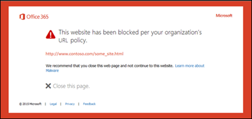

# Säkra länkar i Microsoft Defender för Office 365Safe Links in Microsoft Defender for Office 365

[!INCLUDE [Microsoft 365 Defender rebranding](../includes/microsoft-defender-for-office.md)]

**Gäller för****Applies to**
- [Microsoft Defender för Office 365 Abonnemang 1 och Abonnemang 2Microsoft Defender for Office 365 plan 1 and plan 2](office-365-atp.md)
- [Microsoft 365 DefenderMicrosoft 365 Defender](../mtp/microsoft-threat-protection.md)

> [!IMPORTANT]
> Den här artikeln är avsedd för företagskunder som har [Microsoft Defender för Office 365](office-365-atp.md).This article is intended for business customers who have [Microsoft Defender for Office 365](office-365-atp.md). Om du använder Outlook.com, Microsoft 365 Family eller Microsoft 365 Personal och letar efter information om säkra länkar i Outlook, se [Avancerad Outlook.com säkerhet.](https://support.microsoft.com/office/882d2243-eab9-4545-a58a-b36fee4a46e2)If you're using Outlook.com, Microsoft 365 Family, or Microsoft 365 Personal, and you're looking for information about Safelinks in Outlook, see [Advanced Outlook.com security](https://support.microsoft.com/office/882d2243-eab9-4545-a58a-b36fee4a46e2).

Säkra länkar är en funktion i Defender för [Office 365](office-365-atp.md) som ger URL-sökning och omskrivning av inkommande e-postmeddelanden i e-postflödet samt tids för klick-verifiering av URL:er och länkar i e-postmeddelanden och andra platser.Safe Links is a feature in [Defender for Office 365](office-365-atp.md) that provides URL scanning and rewriting of inbound email messages in mail flow, and time-of-click verification of URLs and links in email messages and other locations. Genomsökning av säkra länkar sker utöver det vanliga skyddet mot skräppost och skadlig programvara för inkommande [e-postmeddelanden](anti-spam-and-anti-malware-protection.md) i Exchange Online Protection (EOP).Safe Links scanning occurs in addition to the regular [anti-spam and anti-malware protection](anti-spam-and-anti-malware-protection.md) in inbound email messages in Exchange Online Protection (EOP). Genomsökning av säkra länkar kan skydda organisationen från skadliga länkar som används vid nätfiske och andra attacker.Safe Links scanning can help protect your organization from malicious links that are used in phishing and other attacks.

Skydd mot säkra länkar är tillgängligt på följande platser:Safe Links protection is available in the following locations:

- **E-postmeddelanden:** Skydd mot säkra länkar för länkar i e-postmeddelanden styrs av principer för säkra länkar.**Email messages**: Safe Links protection for links in email messages is controlled by Safe Links policies. Det finns ingen standardprincip för säkra länkar, så för att skydda säkra länkar i e-postmeddelanden måste du skapa en eller flera principer för **säkra länkar.**There is no default Safe Links policy, **so to get the protection of Safe Links in email messages, you need to create one or more Safe Links policies**. Instruktioner finns i Konfigurera [principer för säkra länkar i Microsoft Defender för Office 365.](set-up-atp-safe-links-policies.md)For instructions, see [Set up Safe Links policies in Microsoft Defender for Office 365](set-up-atp-safe-links-policies.md).

  Mer information om skydd mot säkra länkar för e-postmeddelanden finns i inställningarna för säkra länkar för [e-postmeddelanden](#safe-links-settings-for-email-messages) längre fram i den här artikeln.For more information about Safe Links protection for email messages, see the [Safe Links settings for email messages](#safe-links-settings-for-email-messages) section later in this article.

- **Microsoft Teams** (för närvarande i förhandsversionen av TAP): Skydd av säkra länkar för länkar i Teams-konversationer, gruppchattar eller från kanaler styrs också av principer för säkra länkar.**Microsoft Teams** (currently in TAP Preview): Safe Links protection for links in Teams conversations, group chats, or from channels is also controlled by Safe Links policies. Det finns ingen standardprincip för säkra länkar, så för att få skydd av säkra länkar i Teams måste du skapa en **eller flera principer för säkra länkar.**There is no default Safe Links policy, **so to get the protection of Safe Links in Teams, you need to create one or more Safe Links policies**.

  Mer information om skydd mot säkra länkar i Teams finns i inställningarna [för säkra länkar för Microsoft Teams](#safe-links-settings-for-microsoft-teams) senare i den här artikeln.For more information about Safe Links protection in Teams, see the [Safe Links settings for Microsoft Teams](#safe-links-settings-for-microsoft-teams) section later in this article.

- **Office 365-program:** Skydd mot säkra länkar för Office 365-program är tillgängligt i skrivbords-, mobil- och webb-APS som stöds.**Office 365 apps**: Safe Links protection for Office 365 apps is available in supported desktop, mobile, and web aps. Du **konfigurerar** skydd mot säkra länkar för Office 365-program i den globala inställning som ligger **utanför** principerna för säkra länkar.You **configure** Safe Links protection for Office 365 apps in the global setting that are **outside** of Safe Links policies. Instruktioner finns i Konfigurera [globala inställningar för inställningar för säkra länkar i Microsoft Defender för Office 365.](configure-global-settings-for-safe-links.md)For instructions, see [Configure global settings for Safe Links settings in Microsoft Defender for Office 365](configure-global-settings-for-safe-links.md).

  Skydd av säkra länkar för Office 365-program tillämpas dock bara på användare som ingår i aktiva principer för säkra länkar. But, Safe Links protection for Office 365 apps is only **applied** to users who are included in active Safe Links policies. Om en användare inte ingår i en aktiv princip för säkra länkar får användaren inte skydd mot säkra länkar i Office 365-program som stöds.If a user isn't included in an active Safe Links policy, the user doesn't get Safe Links protection in supported Office 365 apps.

  Mer information om skydd mot säkra länkar i Office 365-program finns i inställningarna för Säkra länkar för [Office 365-program](#safe-links-settings-for-office-365-apps) senare i den här artikeln.For more information about Safe Links protection in Office 365 apps, see the [Safe Links settings for Office 365 apps](#safe-links-settings-for-office-365-apps) section later in this article.

Den här artikeln innehåller detaljerade beskrivningar av följande typer av inställningar för säkra länkar:This article includes detailed descriptions of the following types of Safe Links settings:

- **Inställningar i principer för säkra** länkar: De här inställningarna gäller endast för de användare som ingår i specifika principer och inställningarna kan skilja sig åt mellan principer.**Settings in Safe Links policies**: These settings apply only to the users who are included in the specific policies, and the settings might be different between policies. Dessa inställningar omfattar:These settings include:

  - [Inställningar för säkra länkar för e-postmeddelandenSafe Links settings for email messages](#safe-links-settings-for-email-messages)
  - [Inställningar för säkra länkar för Microsoft TeamsSafe Links settings for Microsoft Teams](#safe-links-settings-for-microsoft-teams)
  - ["Skriva inte om följande URL:er" i principer för säkra länkar"Do not rewrite the following URLs" lists in Safe Links policies](#do-not-rewrite-the-following-urls-lists-in-safe-links-policies)

- **Globala inställningar för säkra** länkar: De här inställningarna konfigureras globalt, inte i principer för säkra länkar.**Global Safe Links settings**: These settings are configured globally, not in Safe Links policies. Inställningarna gäller dock endast för användare som ingår i aktiva principer för säkra länkar.But, the settings apply only to users who are included in active Safe Links policies. Dessa inställningar omfattar:These settings include:

  - [Inställningar för säkra länkar för Office 365-apparSafe Links settings for Office 365 apps](#safe-links-settings-for-office-365-apps)
  - [Listan "Blockera följande URL:er" för Säkra länkar"Block the following URLs" list for Safe Links](#block-the-following-urls-list-for-safe-links)

I följande tabell beskrivs scenarier för säkra länkar i Microsoft 365- och Office 365-organisationer där Defender för Office 365 ingår (brist på licensiering är alltså aldrig ett problem i exemplen).The following table describes scenarios for Safe Links in Microsoft 365 and Office 365 organizations that include Defender for Office 365 (in other words, lack of licensing is never an issue in the examples).

****

|ScenarioScenario|ResultatResult|
|---|---|
|Han är medlem i marknadsföringsavdelningen.Jean is a member of the marketing department. Skydd mot säkra länkar för Office 365-program aktiveras i de globala inställningarna för Säkra länkar, och det finns en princip för säkra länkar som gäller för medlemmar i marknadsföringsavdelningen.Safe Links protection for Office 365 apps is turned on in the global settings for Safe Links, and a Safe Links policy that applies to members of the marketing department exists. Han öppnar en PowerPoint-presentation i ett e-postmeddelande och klickar sedan på en URL i presentationen.Jean opens a PowerPoint presentation in an email message, and then clicks a URL in the presentation.|Han är skyddad av Säkra länkar.Jean is protected by Safe Links. 
 Ingår i en princip för säkra länkar och skydd mot säkra länkar för Office 365-appar är aktiverat.Jean is included in a Safe Links policy, and Safe Links protection for Office 365 apps is turned on. 
 Mer information om kraven för skydd mot säkra länkar i Office 365-program finns i avsnittet Säkra länkar för [Office 365-program](#safe-links-settings-for-office-365-apps) senare i den här artikeln.For more information about the requirements for Safe Links protection in Office 365 apps, see the [Safe Links settings for Office 365 apps](#safe-links-settings-for-office-365-apps) section later in this article.|
|Chris Microsoft 365 E5-organisation har inga principer för säkra länkar konfigurerade.Chris's Microsoft 365 E5 organization has no Safe Links policies configured. Chris får ett e-postmeddelande från en extern avsändare som innehåller en URL till en skadlig webbplats som han slutligen klickar på.Chris receives an email from an external sender that contains a URL to a malicious website that he ultimately clicks.|Chris skyddas inte av Säkra länkar.Chris is not protected by Safe Links. 
 En administratör måste skapa minst en princip för säkra länkar för att alla ska kunna få skydd mot säkra länkar i inkommande e-postmeddelanden.An admin must create at least one Safe Links policy for anyone to get Safe Links protection in inbound email messages. Chris måste omfattas av policyvillkoren för att skydda säkra länkar.Chris must be included in the conditions of policy to get Safe Links protection.|
|I Pats organisation har inga administratörer skapat några principer för säkra länkar, men skydd mot säkra länkar för Office 365-program är aktiverat.In Pat's organization, no admins have created any Safe Links policies, but Safe Links protection for Office 365 apps is turned on. Pat öppnar ett Word-dokument och klickar på en URL i filen.Pat opens a Word document and clicks a URL in the file.|Pat skyddas inte av Säkra länkar.Pat is not protected by Safe Links. 
 Även om skydd mot säkra länkar för Office 365-program är aktiverat globalt ingår Pat inte i några aktiva principer för säkra länkar, så skyddet kan inte tillämpas.Although Safe Links protection for Office 365 apps is turned on globally, Pat is not included in any active Safe Links policies, so the protection can't be applied.|
|I Lees organisation är `https://tailspintoys.com` den konfigurerad i listan **Spärra följande URL-adresser** i de globala inställningarna för Säkra länkar.In Lee's organization, `https://tailspintoys.com` is configured in the **Block the following URLs** list in the global settings for Safe Links. En princip för säkra länkar som innehåller Lee redan finns.A Safe Links policy that includes Lee already exists. Lee får ett e-postmeddelande som innehåller `https://tailspintoys.com/aboutus/trythispage` WEBBADRESSen.Lee receives an email message that contains the URL `https://tailspintoys.com/aboutus/trythispage`. Lee klickar på WEBBADRESSen.Lee clicks the URL.|URL-adressen kan blockeras automatiskt för Lee. Det beror på URL-posten i listan och vilken e-postklient Lee använde.The URL might be automatically blocked for Lee; it depends on the URL entry in the list and the email client Lee used. Mer information finns i listan ["Blockera följande URL:er" för avsnittet Säkra](#block-the-following-urls-list-for-safe-links) länkar senare i den här artikeln.For more information, see the ["Block the following URLs" list for Safe Links](#block-the-following-urls-list-for-safe-links) section later in this article.|
|Både Johan och Julia arbetar för contoso.com.Jamie and Julia both work for contoso.com. För länge sedan konfigurerade administratörer principer för säkra länkar som gäller för både Janne och Julia.A long time ago, admins configured Safe Links policies that apply to both of Jamie and Julia. Johan skickar ett e-postmeddelande till Julia, utan att veta att e-postmeddelandet innehåller en skadlig URL.Jamie sends an email to Julia, not knowing that the email contains a malicious URL.|Julia skyddas av säkra länkar **om principen** för säkra länkar som gäller för henne är konfigurerad att gälla meddelanden mellan interna mottagare.Julia is protected by Safe Links **if** the Safe Links policy that applies to her is configured to apply to messages between internal recipients. Mer information finns i inställningarna för [Säkra länkar för e-postmeddelanden](#safe-links-settings-for-email-messages) längre fram i den här artikeln.For more information, see the [Safe Links settings for email messages](#safe-links-settings-for-email-messages) section later in this article.|

## Inställningar för säkra länkar för e-postmeddelandenSafe Links settings for email messages

Säkra länkar söker igenom inkommande e-postmeddelanden efter kända skadliga hyperlänkar.Safe Links scans incoming email for known malicious hyperlinks. Skannade URL:er skrivs om med Microsofts standard-URL-prefix: `https://nam01.safelinks.protection.outlook.com` .Scanned URLs are rewritten using the Microsoft standard URL prefix: `https://nam01.safelinks.protection.outlook.com`. När länken har skrivits om analyseras den för potentiellt skadligt innehåll.After the link is rewritten, it's analyzed for potentially malicious content.

När säkra länkar har skrivit om en URL förblir URL:en omskriven även om meddelandet vidarebefordras manuellt eller besvaras (både till interna och externa mottagare). After Safe Links rewrites a URL, the URL remains rewritten even if the message is *manually* forwarded or replied to (both to internal and external recipients). Ytterligare länkar som läggs till i det vidarebefordrade eller besvarade meddelandet skrivs inte om.Additional links that are added to the forwarded or replied to message are not rewritten. När det gäller  automatisk vidarebefordran via inkorgsregler eller SMTP-vidarebefordran skrivs dock inte URL-adressen om  i meddelandet som är avsedd för den slutliga mottagaren om inte mottagaren också skyddas av Säkra länkar eller om URL-adressen redan har skrivits om i ett tidigare meddelande.However, in the case of *automatic* forwarding by Inbox rules or SMTP forwarding, the URL will not be rewritten in the message that's intended for the final recipient *unless* that recipient is also protected by Safe Links or the URL had already been rewritten in a previous communication. 

Inställningarna i principer för säkra länkar som gäller för e-postmeddelanden beskrivs i följande lista:The settings in Safe Links policies that apply to email messages are described in the following list:

- **Välj åtgärden för okända potentiellt skadliga URL-adresser i meddelanden:** Aktiverar eller inaktiverar sökning med säkra länkar i e-postmeddelanden.**Select the action for unknown potentially malicious URLs in messages**: Enables or disables Safe Links scanning in email messages. Det rekommenderade värdet är **På.**The recommended value is **On**. Om du slår på den här inställningen resulterar det i följande åtgärder.Turning on this setting results in the following actions.

  - Genomsökning av säkra länkar är aktiverat i Outlook (C2R) i Windows.Safe Links scanning is enabled in Outlook (C2R) on Windows.
  - URL:er skrivs om och användare dirigeras genom skydd mot säkra länkar när de klickar på URL-adresser i meddelanden.URLs are rewritten and users are routed through Safe Links protection when they click URLs in messages.
  - Vid klickning kontrolleras URL:er mot en lista med kända skadliga URL:er och listan ["Blockera följande URL:er".](#block-the-following-urls-list-for-safe-links)When clicked, URLs are checked against a list of known malicious URLs and the ["Block the following URLs" list](#block-the-following-urls-list-for-safe-links).
  - URL:er som inte har ett giltigt rykte detoneras asynkront i bakgrunden.URLs that don't have a valid reputation are detonated asynchronously in the background.

- **Använd URL-skanning** i realtid för misstänkta länkar och länkar som pekar på filer: Möjliggör genomsökning av länkar i realtid, inklusive länkar i e-postmeddelanden som pekar på hämtningsbart innehåll.**Apply real-time URL scanning for suspicious links and links that point to files**: Enables real-time scanning of links, including links in email messages that point to downloadable content. Det rekommenderade värdet aktiveras.The recommended value is enabled.

  - **Vänta tills URL-skanningen har slutförts innan du levererar meddelandet:****Wait for URL scanning to complete before delivering the message**:

    - Aktiverad: Meddelanden som innehåller URL:er hålls kvar tills genomsökning har slutförts.Enabled: Messages that contain URLs are held until scanning is finished. Meddelanden levereras endast när URL:erna har bekräftats vara säkra.Messages are delivered only after the URLs are confirmed to be safe. Det här är det rekommenderade värdet.This is the recommended value.
    - Inaktiverat: Om URL-skanningen inte kan slutföra levereras meddelandet ändå.Disabled: If URL scanning can't complete, deliver the message anyway.

- **Tillämpa säkra länkar på e-postmeddelanden** som skickas inom organisationen: Aktiverar eller inaktiverar säker länkskanning för meddelanden som skickas mellan interna avsändare och interna mottagare inom samma Exchange Online-organisation.**Apply Safe Links to email messages sent within the organization**: Enables or disables Safe Links scanning on messages sent between internal senders and internal recipients within the same Exchange Online organization. Det rekommenderade värdet aktiveras.The recommended value is enabled.

- **Spåra inte användarklick: Aktiverar** eller inaktiverar lagring av data för säkra länkar klickdata för URL:er som klickas i e-postmeddelanden.**Do not track user clicks**: Enables or disables storing Safe Links click data for URLs clicked in email messages. Rekommenderad inställning är att låta den här inställningen vara avmarkerad (för att spåra användarklick).The recommend value is to leave this setting unselected (to track user clicks).

  URL-klickspårning för länkar i e-postmeddelanden som skickas mellan interna avsändare och interna mottagare stöds för närvarande inte.URL click tracking for links in email messages sent between internal senders and internal recipients is currently not supported.

- **Tillåt inte att användare klickar till den ursprungliga** URL:en: Tillåter eller blockerar användare från att klicka på [varningssidan](#warning-pages-from-safe-links) till den ursprungliga URL:en.**Do not allow users to click through to original URL**: Allows or blocks users from clicking through the [warning page](#warning-pages-from-safe-links) to the original URL. Rekommenderad värde är aktiverat.The recommend value is enabled.

- **Skriva inte om följande URL:er:** Lämnar URL:er som de är.**Do not rewrite the following URLs**: Leaves URLs as they are. Med den här listan ser du till att en anpassad lista med säkra webbadresser som inte behöver skannas visas.Keeps a custom list of safe URLs that don't need scanning. Listan är unik för varje princip för säkra länkar.The list is unique for each Safe Links policy. Mer information om  listan Ange inte om följande URL-adresser finns i listorna "Skriva inte om följande URL:er" i avsnittet om principer för säkra länkar längre fram i den här artikeln. For more information about the **Do not rewrite the following URLs** list, see the ["Do not rewrite the following URLs" lists in Safe Links policies](#do-not-rewrite-the-following-urls-lists-in-safe-links-policies) section later in this article.

Mer information om rekommenderade värden för standard- och strikt-principinställningar för principer för säkra länkar finns i [principinställningarna för Säkra länkar.](recommended-settings-for-eop-and-office365-atp.md#safe-links-policy-settings)For more information about the recommended values for Standard and Strict policy settings for Safe Links policies, see [Safe Links policy settings](recommended-settings-for-eop-and-office365-atp.md#safe-links-policy-settings).

- **Mottagarfilter:** Du måste ange mottagarens villkor och undantag som bestämmer vem principen gäller för.**Recipient filters**: You need to specify the recipient conditions and exceptions that determine who the policy applies to. Du kan använda de här egenskaperna för villkor och undantag:You can use these properties for conditions and exceptions:

  - **Mottagaren****The recipient is**
  - **Mottagardomänen är****The recipient domain is**
  - **Mottagaren är medlem i****The recipient is a member of**

  Du kan bara använda ett villkor eller undantag en gång, men villkoret eller undantaget kan innehålla flera värden.You can only use a condition or exception once, but the condition or exception can contain multiple values. Flera värden för samma villkor eller undantag använder ELLER-logik (till exempel _\<recipient1\>_ eller _\<recipient2\>_).Multiple values of the same condition or exception use OR logic (for example, _\<recipient1\>_ or _\<recipient2\>_). Olika villkor och undantag använder OCH-logik (till exempel _\<recipient1\>_ och _\<member of group 1\>_).Different conditions or exceptions use AND logic (for example, _\<recipient1\>_ and _\<member of group 1\>_).

- **Prioritet:** Om du skapar flera principer kan du ange i vilken ordning de ska tillämpas.**Priority**: If you create multiple policies, you can specify the order that they're applied. Inga två policyer kan ha samma prioritet, och policyhantering stannar efter att den första policyn har tillämpats.No two policies can have the same priority, and policy processing stops after the first policy is applied.

  För mer information om ordningsföljden och hur flera policyer utvärderas och tillämpas, se [Order och prioritet för e-postskydd](how-policies-and-protections-are-combined.md).For more information about the order of precedence and how multiple policies are evaluated and applied, see [Order and precedence of email protection](how-policies-and-protections-are-combined.md).

### Hur säkra länkar fungerar i e-postmeddelandenHow Safe Links works in email messages

Så här fungerar skydd mot säkra länkar på en hög nivå med URL-adresser i e-postmeddelanden:At a high level, here's how Safe Links protection works on URLs in email messages:

1. All e-post går via EOP, där INTERNETPROTOKOLL (IP) och kuvertfilter, signaturbaserat skydd mot skadlig programvara, skydd mot skräppost och skadlig programvara filtreras innan meddelandet levereras till mottagarens postlåda.All email goes through EOP, where internet protocol (IP) and envelope filters, signature-based malware protection, anti-spam and anti-malware filters before the message is delivered to the recipient's mailbox.

2. Användaren öppnar meddelandet i sin postlåda och klickar på en URL i meddelandet.The user opens the message in their mailbox and clicks on a URL in the message.

3. Med Säkra länkar kontrolleras url:en omedelbart innan webbplatsen öppnas:Safe Links immediately checks the URL before opening the website:

   - Om URL:en finns i **listan Blockera följande URL:er** öppnas en varning [om blockerad](#blocked-url-warning) URL.If the URL is included in the **Block the following URLs** list, a [blocked URL warning](#blocked-url-warning) opens.

   - Om URL:en pekar på en webbplats som  har fastställt att den är skadlig, öppnas en varningssida för skadlig webbplats (eller en annan varningssida).If the URL points to a website that has been determined to be malicious, a [malicious website warning](#malicious-website-warning) page (or a different warning page) opens.

   - Om **URL:en** pekar på en hämtningsbar fil och använd URL-genomsökning i realtid för misstänkta länkar och länkar som pekar på filer har aktiverats i principen som gäller för användaren, är den hämtningsbara filen markerad.If the URL points to a downloadable file, and the **Apply real-time URL scanning for suspicious links and links that point to files** setting is enabled in the policy that applies to the user, the downloadable file is checked.

   - Om URL:en är säker öppnas webbplatsen.If the URL is determined to be safe, the website opens.

## Inställningar för säkra länkar för Microsoft TeamsSafe Links settings for Microsoft Teams

> [!IMPORTANT]
> Från och med mars 2020 är den här funktionen i förhandsversion och är endast tillgänglig för medlemmar i Microsoft Teams Technology Adoption Program (TAP).As of March 2020, this feature is in Preview and is available only to members of the Microsoft Teams Technology Adoption Program (TAP). Mer information om versionsschemat finns i Microsoft [365-översikten.](https://www.microsoft.com/microsoft-365/roadmap?rtc=1&filters=&searchterms=Safe%2CLinks%2CProtection%2Cfor%2CMicrosoft%2CTeams)For information about the release schedule, check out the [Microsoft 365 roadmap](https://www.microsoft.com/microsoft-365/roadmap?rtc=1&filters=&searchterms=Safe%2CLinks%2CProtection%2Cfor%2CMicrosoft%2CTeams).

Du aktiverar eller inaktiverar skydd mot säkra länkar för Microsoft Teams i principer för säkra länkar.You enable or disable Safe Links protection for Microsoft Teams in Safe Links policies. Mer specifikt använder du åtgärden **Markera för okända eller potentiellt skadliga URL-adresser i Microsoft Teams-inställningen.**Specifically, you use the **Select the action for unknown or potentially malicious URLs within Microsoft Teams** setting. Det rekommenderade värdet är **På.**The recommended value is **On**.

Följande inställningar i principer för säkra länkar som gäller för länkar i e-postmeddelanden gäller även för länkar i Teams:The following settings in Safe Links policies that apply to links in email messages also apply to links in Teams:

- **Använda URL-sökning i realtid för misstänkta länkar och länkar som pekar på filer****Apply real-time URL scanning for suspicious links and links that point to files**
- **Spåra inte användarklick****Do not track user clicks**
- **Tillåt inte att användare klickar till den ursprungliga URL:en****Do not allow users to click through to original URL**

De här inställningarna förklaras i tidigare [inställningar för säkra länkar för e-postmeddelanden.](#safe-links-settings-for-email-messages)These settings are explained in the previous [Safe Links settings for email messages](#safe-links-settings-for-email-messages) section.

När du aktiverar skydd mot säkra länkar för Microsoft Teams kontrolleras URL:er i Teams mot en lista med kända skadliga länkar när den skyddade användaren klickar på länken (tids för klickningsskydd).After you turn on Safe Links protection for Microsoft Teams, URLs in Teams are checked against a list of known malicious links when the protected user clicks the link (time-of-click protection). URL:er skrivs inte om.URLs are not rewritten. Om en länk visas som skadlig har användarna följande funktioner:If a link is found to be malicious, users will have the following experiences:

- Om länken klickades i en Teams-konversation, gruppchatt eller från kanaler visas varningssidan som visas i skärmbilden nedan i standardwebbläsaren.If the link was clicked in a Teams conversation, group chat, or from channels, the warning page as shown in the screenshot below will appear in the default web browser.
- Om du klickade på länken från en fäst flik visas varningssidan i Teams-gränssnittet på den fliken. Alternativet att öppna länken i en webbläsare är inaktiverat av säkerhetsskäl.If the link was clicked from a pinned tab, the warning page will appear in the Teams interface within that tab. The option to open the link in a web browser is disabled for security reasons.
- Beroende på hur tillåt inte användare att klicka sig fram till den ursprungliga **URL-inställningen** i principen har konfigurerats tillåts eller tillåts användaren inte att klicka till den ursprungliga URL:en (Fortsätt ändå **(rekommenderas inte)** på skärmbilden.Depending on how the **Do not allow users to click through to original URL** setting in the policy is configured, the user will or will not be allowed to click through to the original URL (**Continue anyway (not recommended)** in the screenshot). Vi rekommenderar att du aktiverar Tillåt inte att användare klickar sig fram till den ursprungliga **URL-inställningen** så att användarna inte kan klicka till den ursprungliga URL:en.We recommend that you enable the **Do not allow users to click through to original URL** setting so users can't click through to the original URL.

Om användaren som skickade länken inte finns med i en princip för säkra länkar där Teams-skydd är aktiverat kan användaren klicka sig fram till den ursprungliga URL:en på sin dator eller enhet.If the user who sent the link isn't included in a Safe Links policy where Teams protection is enabled, the user is free to click through to the original URL on their computer or device.

Om du **klickar på knappen** Gå tillbaka på varningssidan återgår användaren till sin ursprungliga kontext eller URL-plats.Clicking the **Go Back** button on the warning page will return the user to their original context or URL location. Om du klickar på den ursprungliga länken igen får dock Felsäkert länkar att ändra webbadressen, så att varningssidan visas igen.However, clicking on the original link again will cause Safe Links to rescan the URL, so the warning page will reappear.

### Hur säkra länkar fungerar i TeamsHow Safe Links works in Teams

På en hög nivå fungerar skydd av säkra länkar för URL:er i Microsoft Teams så här:At a high level, here's how Safe Links protection works for URLs in Microsoft Teams:

1. En användare startar Teams-appen.A user starts the Teams app.

2. Microsoft 365 verifierar att användarens organisation inkluderar Microsoft Defender för Office 365 och att användaren ingår i en aktiv princip för säkra länkar där skydd för Microsoft Teams är aktiverat.Microsoft 365 verifies that the user's organization includes Microsoft Defender for Office 365, and that the user is included in an active Safe Links policy where protection for Microsoft Teams is enabled.

3. URL:er valideras när användaren klickar i chattar, gruppchattar, kanaler och flikar.URLs are validated at the time of click for the user in chats, group chats, channels, and tabs.

## Inställningar för säkra länkar för Office 365-apparSafe Links settings for Office 365 apps

Skydd mot säkra länkar för Office 365-program kontrollerar länkar i Office-dokument, inte länkar i e-postmeddelanden (men det kan kontrollera länkar i bifogade Office-dokument i e-postmeddelanden när dokumentet har öppnats).Safe Links protection for Office 365 apps checks links in Office documents, not links in email messages (but it can check links in attached Office documents in email messages after the document is opened).

Skydd mot säkra länkar för Office 365-program har följande klientkrav:Safe Links protection for Office 365 apps has the following client requirements:

- Microsoft 365 Apps eller Microsoft 365 Business Premium.Microsoft 365 Apps or Microsoft 365 Business Premium.
  - Aktuella versioner av Word, Excel och PowerPoint på Windows, Mac eller i en webbläsare.Current versions of Word, Excel, and PowerPoint on Windows, Mac, or in a web browser.
  - Office-appar på iOS- eller Android-enheter.Office apps on iOS or Android devices.
  - Visio i Windows.Visio on Windows.
  - OneNote i en webbläsare.OneNote in a web browser.

- Office 365-program är konfigurerade för modern autentisering.Office 365 apps are configured to use modern authentication. Mer information finns i Hur modern autentisering fungerar för [Office 2013-, Office 2016- och Office 2019-klientprogram.](../../enterprise/modern-auth-for-office-2013-and-2016.md)For more information, see [How modern authentication works for Office 2013, Office 2016, and Office 2019 client apps](../../enterprise/modern-auth-for-office-2013-and-2016.md).

- Användarna loggas in med sina arbets- eller skolkonton.Users are signed in using their work or school accounts. Mer information finns i [Logga in på Office.](https://support.microsoft.com/office/b9582171-fd1f-4284-9846-bdd72bb28426)For more information, see [Sign in to Office](https://support.microsoft.com/office/b9582171-fd1f-4284-9846-bdd72bb28426).

Du konfigurerar skydd mot säkra länkar för Office 365-program i de globala inställningarna för Säkra länkar, inte i principer för säkra länkar.You configure Safe Links protection for Office 365 apps in the global settings for Safe Links, not in Safe Links policies. Men för att skydd mot säkra länkar för Office 365-program ska tillämpas måste användaren som öppnar Office-dokumentet och klickar på länken inkluderas i en aktiv princip för säkra länkar.But, in order for Safe Links protection for Office 365 apps to be applied, the user who opens the Office document and clicks the link must be included in an active Safe Links policy.

Följande inställningar för Säkra länkar är tillgängliga för Office 365-program:The following Safe Links settings are available for Office 365 apps:

- **Office 365-program:** Aktiverar eller inaktiverar säker sökning med länkar i Office 365-program som stöds.**Office 365 applications**: Enables or disables Safe Links scanning in supported Office 365 apps. Standardvärdet och det rekommenderade värdet är **På.**The default and recommended value is **On**.

- **Spåra inte när användare** klickar på Säkra länkar: Aktiverar eller inaktiverar data för säker länkklick på data för URL-adresser som klickas i skrivbordsversionerna av Word, Excel, PowerPoint och Visio.**Do not track when users click Safe Links**: Enables or disables storing Safe Links click data for URLs clicked in the desktop versions Word, Excel, PowerPoint, and Visio. Det rekommenderade värdet är **Av,** vilket innebär att användarens klick spåras.The recommended value is **Off**, which means user clicks are tracked.

- **Låt inte användare** klicka igenom säkra länkar till den ursprungliga  URL:en: Tillåter eller blockerar användare från att klicka på varningssidan till den ursprungliga URL-adressen i skrivbordsversionerna av Word, Excel, PowerPoint och Visio.**Do not let users click through safe links to original URL**: Allows or blocks users from clicking through the [warning page](#warning-pages-from-safe-links) to the original URL in in the desktop versions Word, Excel, PowerPoint, and Visio. Standardvärdet och det rekommenderade värdet är **På.**The default and recommended value is **On**.

Information om hur du konfigurerar inställningarna för säkra länkar för Office 365-program finns i Konfigurera skydd mot säkra länkar för [Office 365-program.](configure-global-settings-for-safe-links.md#configure-safe-links-protection-for-office-365-apps-in-the-security--compliance-center)To configure the Safe Links settings for Office 365 apps, see [Configure Safe Links protection for Office 365 apps](configure-global-settings-for-safe-links.md#configure-safe-links-protection-for-office-365-apps-in-the-security--compliance-center).

Mer information om rekommenderade värden för principinställningarna Standard och Strikt finns i [Globala inställningar för Säkra länkar.](recommended-settings-for-eop-and-office365-atp.md#global-settings-for-safe-links)For more information about the recommended values for Standard and Strict policy settings, see [Global settings for Safe Links](recommended-settings-for-eop-and-office365-atp.md#global-settings-for-safe-links).

### Hur säkra länkar fungerar i Office 365-apparHow Safe Links works in Office 365 apps

Så här fungerar säkert länkskydd för URL:er i Office 365-program på en hög nivå.At a high level, here's how Safe Links protection works for URLs in Office 365 apps. De Office 365-program som stöds beskrivs i föregående avsnitt.The supported Office 365 apps are described in the previous section.

1. En användare loggar in med sitt arbets- eller skolkonto i en organisation som innehåller Microsoft 365 Apps eller Microsoft 365 Business Premium.A user signs in using their work or school account in an organization that includes Microsoft 365 Apps or Microsoft 365 Business Premium.

2. Användaren öppnas och klickar på en länk till ett Office-dokument i ett Office-program som stöds.The user opens and clicks on a link an Office document in a supported Office app.

3. Säkra länkar kontrollerar omedelbart WEBBADRESSen innan målwebbplatsen öppnas:Safe Links immediately checks the URL before opening the target website:

   - Om URL:en finns med i listan som  hoppar över skanning av säkra länkar (listan Blockera följande URL-adresser) öppnas en varningssida för [blockerade](#blocked-url-warning) URL:er.If the URL is included in the list that skips Safe Links scanning (the **Block the following URLs** list) a [blocked URL warning](#blocked-url-warning) page opens.

   - Om URL:en pekar på en webbplats som  har fastställt att den är skadlig, öppnas en varningssida för skadlig webbplats (eller en annan varningssida).If the URL points to a website that has been determined to be malicious, a [malicious website warning](#malicious-website-warning) page (or a different warning page) opens.

   - Om **URL-adressen** pekar på en hämtningsbar fil och principen för säkra länkar som gäller för användaren är konfigurerad att söka igenom länkar till hämtningsbart innehåll (använd URL-genomsökning i realtid för misstänkta länkar och länkar som pekar på filer) är den nedladdningsbara filen markerad.If the URL points to a downloadable file, and the Safe Links policy that applies to the user is configured to scan links to downloadable content (**Apply real-time URL scanning for suspicious links and links that point to files**), the downloadable file is checked.

   - Om URL:en anses vara säker tas användaren till webbplatsen.If the URL is considered safe, the user is taken to the website.

   - Om genomsökning av säkra länkar inte kan slutföras utlöses inte skyddet för säkra länkar.If Safe Links scanning is unable to complete, Safe Links protection does not trigger. I Office-skrivbordsklienter får användaren en varning innan han eller hon går vidare till målwebbplatsen.In Office desktop clients, the user will be warned before they proceed to the destination website.

> [!NOTE]
> Det kan ta flera sekunder i början av varje session att verifiera att användaren har säkra länkar för Office aktiverat.It may take several seconds at the beginning of each session to verify that the user has Safe Links for Office enabled.

## Listan "Blockera följande URL:er" för Säkra länkar"Block the following URLs" list for Safe Links

Listan **Blockera följande URL-adresser** definierar de länkar som alltid blockeras genom genomsökning av säkra länkar på följande platser:The **Block the following URLs** list defines the links that are always blocked by Safe Links scanning in the following locations:

- E-postmeddelanden.Email messages.
- Dokument i Office 365-program i Windows och Mac.Documents in Office 365 apps in Windows and Mac.
- Dokument i Office för iOS och Android.Documents in Office for iOS and Android.

När en användare i en aktiv princip för säkra länkar klickar på en blockerad länk i ett program som stöds kommer de till varningssidan [blockerad](#blocked-url-warning) URL.When a user in an active Safe Links policy clicks a blocked link in a supported app, they're taken to the [Blocked URL warning](#blocked-url-warning) page.

Du konfigurerar listan med URL-adresser i de globala inställningarna för Säkra länkar.You configure the list of URLs in the global settings for Safe Links. Instruktioner finns i [Konfigurera listan "Blockera följande URL:er".](configure-global-settings-for-safe-links.md#configure-the-block-the-following-urls-list-in-the-security--compliance-center)For instructions, see [Configure the "Block the following URLs" list](configure-global-settings-for-safe-links.md#configure-the-block-the-following-urls-list-in-the-security--compliance-center).

**Anmärkningar**:**Notes**:

- En verkligt universell lista över URL-adresser som blockeras överallt finns i [Hantera klientorganisationens lista över tillåtna/blockerade adresser.](tenant-allow-block-list.md)For a truly universal list of URLs that are blocked everywhere, see [Manage the Tenant Allow/Block List](tenant-allow-block-list.md).

- Begränsningar:Limits:
  - Det maximala antalet poster är 500.The maximum number of entries is 500.
  - Den maximala längden på en post är 128 tecken.The maximum length of an entry is 128 characters.
  - Alla poster får högst vara 10 000 tecken.All of the entries can't exceed 10,000 characters.

- Inkludera inte ett snedstreck `/` () i slutet av URL:en.Don't include a forward slash (`/`) at the end of the URL. Du kan till exempel `https://www.contoso.com` använda , inte `https://www.contoso.com/` .For example, use `https://www.contoso.com`, not `https://www.contoso.com/`.

- En URL med endast domän (till `contoso.com` `tailspintoys.com` exempel) blockerar alla URL-adresser som innehåller domänen.A domain only-URL (for example `contoso.com` or `tailspintoys.com`) will block any URL that contains the domain.

- Du kan blockera en underdomän utan att blockera hela domänen.You can block a subdomain without blocking the full domain. Spärrar `toys.contoso.com*` till exempel URL-adresser som innehåller underdomänen, men url-adresser som innehåller den fullständiga domänen blockeras `contoso.com` inte.For example, `toys.contoso.com*` blocks any URL that contains the subdomain, but it doesn't block URLs that contain the full domain `contoso.com`.

- Du kan ta med upp till tre jokertecken ( `*` ) per URL-post.You can include up to three wildcards (`*`) per URL entry.

### Postsyntaxen för listan "Blockera följande URL:er"Entry syntax for the "Block the following URLs" list

Exempel på värden som du kan ange och deras resultat beskrivs i följande tabell:Examples of the values that you can enter and their results are described in the following table:

****

|ValueValue|ResultatResult|
|---|---|
|`contoso.com` 
 elleror 
 `*contoso.com*`|Spärrar domäner, underdomäner och sökvägar.Blocks the domain, subdomains, and paths. Till `https://www.contoso.com` `https://sub.contoso.com` exempel, och `https://contoso.com/abc` blockeras.For example, `https://www.contoso.com`, `https://sub.contoso.com`, and `https://contoso.com/abc` are blocked.|
|`https://contoso.com/a`|Spärrar `https://contoso.com/a` men inte ytterligare undervägar `https://contoso.com/a/b` som.Blocks `https://contoso.com/a` but not additional subpaths like `https://contoso.com/a/b`.|
|`https://contoso.com/a*`|Blockerar `https://contoso.com/a` och ytterligare undervägar `https://contoso.com/a/b` som.Blocks `https://contoso.com/a` and additional subpaths like `https://contoso.com/a/b`.|
|`https://toys.contoso.com*`|Spärrar en underdomän `toys` (i det här exemplet) men tillåter klick till andra domän-URL:er (t.ex. `https://contoso.com` `https://home.contoso.com` eller).Blocks a subdomain (`toys` in this example) but allow clicks to other domain URLs (like `https://contoso.com` or `https://home.contoso.com`).|
|

## "Skriva inte om följande URL:er" i principer för säkra länkar"Do not rewrite the following URLs" lists in Safe Links policies

> [!NOTE]
> Om organisationen använder principer för  säkra länkar är följande URL-listor inte omskrivningar den enda metod som stöds för nätfisketester från tredje part.If your organization use Safe Links policies, the **Do not rewrite the following URLs** lists are the only supported method for third party phishing tests.

Varje princip för  säkra länkar innehåller en Omskrivning av inte följande URL-lista som du kan använda för att ange URL-adresser som inte skrivs om vid genomsökning av säkra länkar.Each Safe Links policy contains a **Do not rewrite the following URLs** list that you can use to specify URLs that are not rewritten by Safe Links scanning. Med andra ord gör listan att användare som ingår i principen kan komma åt angivna URL:er som annars skulle blockeras av säkra länkar.In other words, the list allows users who are included in the policy to access the specified URLs that would otherwise be blocked by Safe Links. Du kan konfigurera olika listor i olika principer för säkra länkar.You can configure different lists in different Safe Links policies. Principbearbetningen avbryts efter att den första principen (förmodligen högsta prioritet) tillämpas på användaren.Policy processing stops after the first (likely, the highest priority) policy is applied to the user. Därför är det bara **en som inte** skriver om följande URL-lista och tillämpas på en användare som ingår i flera aktiva principer för säkra länkar.So, only one **Do not rewrite the following URLs** list is applied to a user who is included in multiple active Safe Links policies.

Information om hur du lägger till poster i listan i nya eller befintliga principer för säkra länkar finns i Skapa principer för säkra [länkar](set-up-atp-safe-links-policies.md#use-the-security--compliance-center-to-create-safe-links-policies) [eller Ändra principer för säkra länkar.](set-up-atp-safe-links-policies.md#use-the-security--compliance-center-to-modify-safe-links-policies)To add entries to the list in new or existing Safe Links policies, see [Create Safe Links policies](set-up-atp-safe-links-policies.md#use-the-security--compliance-center-to-create-safe-links-policies) or [Modify Safe Links policies](set-up-atp-safe-links-policies.md#use-the-security--compliance-center-to-modify-safe-links-policies).

**Anmärkningar**:**Notes**:

- Följande klienter känner inte igen följande **URL-listor** i principer för säkra länkar.The following clients don't recognize the **Do not rewrite the following URLs** lists in Safe Links policies. Användare som omfattas av de här säkerheterna kan blockeras från att komma åt webbadresserna baserat på resultatet av genomsökning av Säkra länkar i dessa klienter:Users included in the polices can be blocked from accessing the URLs based on the results of Safe Links scanning in these clients:

  - Microsoft TeamsMicrosoft Teams
  - Office-webbapparOffice web apps

  En verkligt universell lista över URL-adresser som är tillåtna överallt finns i [Hantera klientorganisationens lista över tillåtna/blockerade adresser.](tenant-allow-block-list.md)For a truly universal list of URLs that are allowed everywhere, see [Manage the Tenant Allow/Block List](tenant-allow-block-list.md).

- Överväg att lägga till ofta använda interna URL:er i listan för att förbättra användarupplevelsen.Consider adding commonly used internal URLs to the list to improve the user experience. Om du till exempel har lokala tjänster, till exempel Skype för företag eller SharePoint, kan du lägga till de URL-adresser som undantar dem från genomsökning.For example, if you have on-premises services, such as Skype for Business or SharePoint, you can add those URLs to exclude them from scanning.

- Om du redan har Skriver inte om följande **URL-adresser** i principerna för säkra länkar bör du granska listorna och lägga till jokertecken efter behov.If you already have **Do not rewrite the following URLs** entries in your Safe Links policies, be sure to review the lists and add wildcards as required. Listan har till exempel en post som du senare `https://contoso.com/a` bestämmer dig för att ta med undervägar `https://contoso.com/a/b` som.For example, your list has an entry like `https://contoso.com/a` and you later decide to include subpaths like `https://contoso.com/a/b`. I stället för att lägga till en ny post kan du lägga till ett jokertecken för den befintliga posten så att det blir `https://contoso.com/a/*` det.Instead of adding a new entry, add a wildcard to the existing entry so it becomes `https://contoso.com/a/*`.

- Du kan ta med upp till tre jokertecken ( `*` ) per URL-post.You can include up to three wildcards (`*`) per URL entry. Jokertecken innehåller uttryckligen prefix eller underdomäner.Wildcards explicitly include prefixes or subdomains. Posten är till exempel inte samma som , eftersom den tillåter att personer besöker underdomäner `contoso.com` `*.contoso.com/*` och `*.contoso.com/*` sökvägar i den angivna domänen.For example, the entry `contoso.com` is not the same as `*.contoso.com/*`, because `*.contoso.com/*` allows people to visit subdomains and paths in the specified domain.

### Postsyntaxen för listan "Ange inte följande URL:er"Entry syntax for the "Do not rewrite the following URLs" list

Exempel på värden som du kan ange och deras resultat beskrivs i följande tabell:Examples of the values that you can enter and their results are described in the following table:

****

|ValueValue|ResultatResult|
|---|---|
|`contoso.com`|Tillåter åtkomst till `https://contoso.com` men inte underdomäner eller sökvägar.Allows access to `https://contoso.com` but not subdomains or paths.|
|`*.contoso.com/*`|Tillåter åtkomst till en domän, underdomäner och sökvägar (till `https://www.contoso.com` `https://www.contoso.com` exempel, `https://maps.contoso.com` `https://www.contoso.com/a` eller).Allows access to a domain, subdomains, and paths (for example, `https://www.contoso.com`, `https://www.contoso.com`, `https://maps.contoso.com`, or `https://www.contoso.com/a`). 
 Den här posten är bättre än den, eftersom den inte tillåter potentiellt falska `*contoso.com*` webbplatser, som `https://www.falsecontoso.com` eller `https://www.false.contoso.completelyfalse.com`This entry is inherently better than `*contoso.com*`, because it doesn't allow potentially fraudulent sites, like `https://www.falsecontoso.com` or `https://www.false.contoso.completelyfalse.com`|
|`https://contoso.com/a`|Tillåter åtkomst `https://contoso.com/a` till, men inte undervägar som `https://contoso.com/a/b`Allows access to `https://contoso.com/a`, but not subpaths like `https://contoso.com/a/b`|
|`https://contoso.com/a/*`|Tillåter åtkomst till `https://contoso.com/a` och undervägar som `https://contoso.com/a/b`Allows access to `https://contoso.com/a` and subpaths like `https://contoso.com/a/b`|
|

## Varningssidor från Säkra länkarWarning pages from Safe Links

Det här avsnittet innehåller exempel på de olika varningssidor som utlöses av skydd mot säkra länkar när du klickar på en URL.This section contains examples of the various warning pages that are triggered by Safe Links protection when you click a URL.

Observera att flera varningssidor har uppdaterats.Note that several warning pages have been updated. Om du inte redan ser de uppdaterade sidorna kommer du snart att göra det.If you're not already seeing the updated pages, you will soon. De uppdaterade sidorna innehåller ett nytt färgschema, mer detaljerad information och möjligheten att gå vidare till en webbplats trots den angivna varningen och rekommendationerna.The updated pages include a new color scheme, more detail, and the ability to proceed to a site despite the given warning and recommendations.

### Avisering om pågående sökningScan in progress notification

Url:en som du klickar på genomsöks av Säkra länkar.The clicked URL is being scanned by Safe Links. Det kan ta en liten stund innan du provar länken igen.You might need to wait a few moments before trying the link again.

Den ursprungliga aviseringssidan såg ut så här:The original notification page looked like this:

### Varning om misstänkt meddelandeSuspicious message warning

Den klickade URL-adressen fanns i ett e-postmeddelande som liknar andra misstänkta meddelanden.The clicked URL was in an email message that's similar to other suspicious messages. Vi rekommenderar att du dubbelkollar e-postmeddelandet innan du fortsätter till webbplatsen.We recommend that you double-check the email message before proceeding to the site.

### Varning om försök till nätfiskePhishing attempt warning

Den klickade URL:en fanns i ett e-postmeddelande som identifierats som en nätfiskeattack.The clicked URL was in an email message that has been identified as a phishing attack. Därför blockeras alla URL:er i e-postmeddelandet.As a result, all URLs in the email message are blocked. Vi rekommenderar att du inte fortsätter till webbplatsen.We recommend that you do not proceed to the site.

### Varning om skadlig webbplatsMalicious website warning

Den klickade URL-adressen pekar på en webbplats som har identifierats som skadlig.The clicked URL points to a site that has been identified as malicious. Vi rekommenderar att du inte fortsätter till webbplatsen.We recommend that you do not proceed to the site.

Den ursprungliga varningssidan såg ut så här:The original warning page looked like this:

### Varning om blockerad URLBlocked URL warning

Url-adressen som du har klickat på har  blockerats manuellt av en administratör i din organisation (listan Blockera följande URL-adresser i de globala inställningarna för säkra länkar).The clicked URL has been manually blocked by an admin in your organization (the **Block the following URLs** list in the global settings for Safe Links). Länken genomsökdes inte av Säkra länkar eftersom den blockerades manuellt.The link was not scanned by Safe Links because it was manually blocked.

Det finns flera orsaker till varför en administratör manuellt skulle blockera specifika URL:er.There are several reasons why an admin would manually block specific URLs. Kontakta administratören om du tror att webbplatsen inte ska blockeras.If you think the site should not be blocked, contact your admin.

Den ursprungliga varningssidan såg ut så här:The original warning page looked like this:

### FelvarningError warning

Någon typ av fel har inträffat och URL-adressen kan inte öppnas.Some kind of error has occurred, and the URL can't be opened.

Den ursprungliga varningssidan såg ut så här:The original warning page looked like this:

