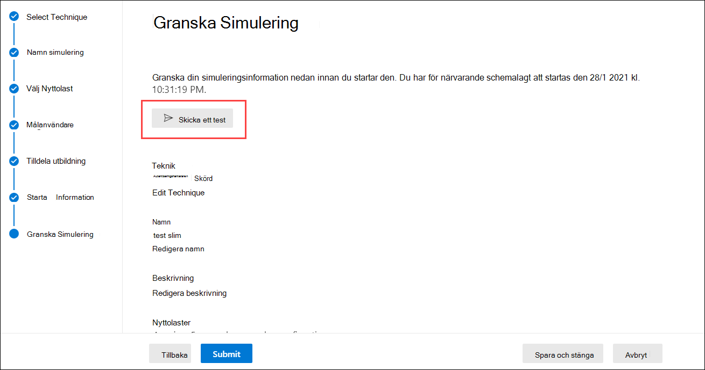

# Överväganden för att attacka simuleringsutbildning och vanliga frågor och svar

Utbildning av attacksimulering är [nu allmänt tillgänglig.](https://techcommunity.microsoft.com/t5/microsoft-security-and/attack-simulation-training-in-microsoft-defender-for-office-365/ba-p/2037291) Utbildning av attackbedrägerier gör att Microsoft 365 E5 eller Microsoft Defender för Office 365-abonnemang 2-organisationer kan mäta och hantera social engineering-risker genom att tillåta skapande och hantering av nätfiskebedrägerier som drivs av avvörade nätfiske payloads i verkligheten. Hyper riktad utbildning som levereras i samarbete med Innovationnova-säkerhet hjälper till att förbättra kunskap och ändra medarbetarnas beteende.

Mer information om hur du kommer igång med attacksimuleringsutbildning finns i [Komma igång med att använda attacksimuleringsutbildning.](attack-simulation-training-get-started.md)

Även om hela skapandet av simuleringar och schemaläggningen har utformats för att vara fritt flöden och friktionsfria krävs det ofta planering för att köra simuleringar på företagsnivå. Den här artikeln hjälper till att hantera specifika utmaningar som vi ser när våra kunder kör simuleringar i sina egna miljöer.

## Problem med slutanvändarupplevelser

### URL-adresser för nätfiskebedrägerier som blockerats av Google Säker surfning

Ett rykte på en URL-tjänst kan identifiera en eller flera av URL:erna som används av attacksimuleringsutbildningen som osäkra. Google Safe Browsing i Google Chrome blockerar några av de simulerade url-adresser för nätfiske med **ett deceptiv webbplats i** förväg. Medan vi arbetar med många URL-ryktesleverantörer för att alltid tillåta vår url:er för simulering har vi inte alltid fullständig täckning.

Observera att det här problemet inte påverkar Microsoft Edge.

Som en del av planeringsfasen kontrollerar du om URL:en är tillgänglig i de webbläsare som stöds innan du använder URL:en i en nätfiskekampanj. Om WEBBADRESSerna blockeras av Googles säkra surfning följer [du dessa riktlinjer](https://support.google.com/chrome/a/answer/7532419) från Google för att tillåta åtkomst till webbadresserna.

Se Komma [igång med att använda attacksimuleringsutbildning](attack-simulation-training-get-started.md) för listan med URL-adresser som för närvarande används av attacksimuleringsutbildning.

### Url:er för nätfiskebedrägerier och URL-adresser för administratörer blockerade av proxylösningar och filterdrivrutiner

Både URL:er för nätfiskebedrägerier och URL-adresser för administratörer kan blockeras eller ignoreras av dina mellanliggande säkerhetsenheter eller filter. Till exempel:

- Brandväggar
- WAF-lösningar (Web Application Firewall)
- Tredjepartsfilterdrivrutiner (till exempel kernellägesfilter)

Även om vi har sett få kunder som blockeras på det här lagret sker det. Om du stöter på problem kan du konfigurera följande URL:er för att kringgå genomsökning genom dina säkerhetsenheter eller filter efter behov:

- De simulerade URL-adresser för nätfiske enligt beskrivningen i Komma igång med [att använda utbildning för attackbedrägerier.](attack-simulation-training-get-started.md)
- <https://security.microsoft.com/attacksimulator>
- <https://security.microsoft.com/attacksimulationreport>
- <https://security.microsoft.com/trainingassignments>

### Simuleringsmeddelanden levereras inte till alla riktade användare

Det är möjligt att antalet användare som faktiskt får simuleringsmeddelandena är mindre än antalet användare som var riktade av simuleringen. Följande typer av användare utesluts som en del av målverifieringen:

- Ogiltiga mottagares e-postadresser.
- Gästanvändare.
- Användare som inte längre är aktiva i Azure Active Directory (Azure AD).

Endast giltiga användare som inte är gästanvändare med en giltig postlåda inkluderas i simuleringar. Om du använder distributionsgrupper eller e-postaktiverade säkerhetsgrupper för att rikta användare kan du använda cmdleten [Get-DistributionGroupMember](https://docs.microsoft.com/powershell/module/exchange/get-distributiongroupmember) i [Exchange Online PowerShell](https://docs.microsoft.com/powershell/exchange/connect-to-exchange-online-powershell) för att visa och verifiera medlemmar i distributionsgrupper.

## Problem med rapportering av attacksimulering

### Utbildningsrapporter om attacksimulering innehåller ingen aktivitetsinformation

Utbildning i attacksimulering ger omfattande, handlingsbara insikter som håller dig informerad om dina anställdas beredskap för hot. Om utbildningsrapporter om attacksimulering inte innehåller data kontrollerar du att granskningsloggsökning är aktiverat i organisationen (det här är aktiverat som standard).

Granskningsloggsökning krävs av utbildning för attacksimulering så att händelser kan registreras, spelas in och läsas upp. Om du inaktiverar granskningsloggsökning får följande konsekvenser för utbildning om attacksimulering:

- Rapporteringsdata är inte tillgängliga i alla rapporter. Rapporterna visas som tomma.
- Utbildningsuppgifterna blockeras eftersom data inte är tillgängliga.

Information om hur du aktiverar granskningsloggsökning finns i Aktivera eller [inaktivera granskningsloggsökning.](../../compliance/turn-audit-log-search-on-or-off.md)

> [!NOTE]
> Information om tom aktivitet kan också orsakas av att inga E5-licenser har tilldelats till användare. Kontrollera att minst en E5-licens har tilldelats till en aktiv användare för att säkerställa att rapporteringshändelser registreras och spelas in.

### Simuleringsrapporter uppdateras inte omedelbart

Detaljerade simuleringsrapporter uppdateras inte direkt efter att du har lanserat en kampanj. Oroa dig inte. är det här beteendet normalt.

Alla simuleringskampanjer har en livscykel. När simuleringen skapas är den **schemalagd.** När simuleringen startar går den över till det **pågående** läget. När den är slutförd går simuleringen över till **läget Slutförd.**

Medan en simulering är i **schemalagt** läge är simuleringsrapporterna till största delen tomma. Under det här steget löser simuleringsmotorn målanvändares e-postadresser, expanderar distributionsgrupper, tar bort gästanvändare från listan osv.:

När simuleringen kommer **in i det** pågående steget kommer du att märka att information börjar gå in i rapporteringen:

Det kan ta upp till 30 minuter innan de enskilda simuleringsrapporterna uppdateras efter övergången till läget **Pågående.** Rapportdata fortsätter att byggas tills simuleringen når **slutförd** tillstånd. Rapporteringsuppdateringar sker med följande intervall:

- Var 10:e minut under de första 60 minuterna.
- Var 15:e minut efter 60 minuter till två dagar.
- Var 30:e minut efter två dagar till sju dagar.
- Var 60:e minut efter sju dagar.

Widgetar på **översiktssidan** ger en snabb ögonblicksbild av organisationens simuleringsbaserade säkerhetsrisk med tiden. Eftersom de här widgetarna återspeglar din övergripande säkerhet och resa över tid uppdateras de efter att varje simuleringskampanj har slutförts.

> [!NOTE]
> Du kan använda alternativet **Exportera på** de olika rapportsidorna för att extrahera data.

### Meddelanden som rapporterats som nätfiske av användare visas inte i simuleringsrapporter

Simuleringsrapporter i utbildning för attacker ger information om användaraktivitet. Till exempel:

- Användare som klickade på länken i meddelandet.
- Användare som har gett upp sina autentiseringsuppgifter.
- Användare som har rapporterat meddelandet som nätfiske.

Om meddelanden som användare rapporterat som nätfiske inte fångas i simuleringsrapporter om attackutbildning kan det finnas en e-postflödesregel i Exchange (kallas även transportregel) som blockerar leveransen av de rapporterade meddelandena till Microsoft. Kontrollera att e-postflödesregler inte blockerar leveransen till följande e-postadresser:

- junk@office365.microsoft.com
- abuse@messaging.microsoft.com
- phish@office365.microsoft.com
- inte \_ junk@office365.microsoft.com

## Andra vanliga frågor och svar

### F: Vilken är den rekommenderade metoden för att rikta användare till simuleringskampanjer?

S: Flera alternativ är tillgängliga för målanvändare:

- Inkludera alla användare (är tillgängliga för organisationer med färre än 40 000 användare).
- Välj specifika användare.
- Välj användare från en CSV-fil.
- Gruppbaserad azure AD-hantering.

Vi har upptäckt att kampanjer där de riktade användarna identifieras av Azure AD-grupper i allmänhet är enklare att hantera.

### F: Finns det några begränsningar för att rikta användare när du importerar från en CSV-fil eller lägger till användare?

S: Gränsen för att importera mottagare från en CSV-fil eller lägga till enskilda mottagare i en simulering är 40 000.

En mottagare kan vara en enskild användare eller grupp. En grupp kan innehålla hundratals eller tusentals mottagare, så det finns ingen faktisk gräns för antalet enskilda användare.

Det kan vara krångligt att hantera en stor CSV-fil eller lägga till många enskilda mottagare. Användning av Azure AD-grupper förenklar den övergripande hanteringen av simuleringen.

### F: Tillhandahåller Microsoft nyttolaster på andra språk?

S: För närvarande finns det 5 lokaliserade nyttolaster tillgängliga. Vi har lagt märke till att eventuella direktöversättningar eller maskinöversättningar av befintliga nyttolaster till andra språk leder till felaktigheter och minskad relevans.

Med det sagt kan du skapa en egen nyttolast på valfri språk med hjälp av den anpassade nyttolastförfattaren. Vi rekommenderar också starkt att du använder befintliga nyttolaster som har använts för att rikta in användare i en viss geografi. Med andra ord, låt attackerarna lokalisera innehållet åt dig.

### F: Hur byter jag till andra språk för administrationsportalen och utbildningsupplevelse?

S: I Microsoft 365 eller Office 365 är språkkonfigurationen specifik och centraliserad för varje användarkonto. Anvisningar om hur du ändrar språkinställningen finns i Ändra visningsspråk och [tidszon i Microsoft 365 för företag.](https://support.microsoft.com/office/6f238bff-5252-441e-b32b-655d5d85d15b)

Observera att konfigurationsändringen kan ta upp till 30 minuter att synkronisera i alla tjänster.

### F: Kan jag utlösa en testsimulering för att förstå hur den ser ut innan jag startar en fullständig kampanj?

S: Ja, det går! På den senaste sidan **granska simulering** i guiden för att skapa en ny simulering finns det ett alternativ för att skicka **ett test.** Det här alternativet skickar ett exempel på nätfiskemeddelande till den inloggade användaren. När du har validerat nätfiskemeddelandet i Inkorgen kan du skicka simuleringen.

### F: Kan jag rikta användare som tillhör en annan klientorganisation som en del av samma simuleringskampanj?

S: nej. Simuleringar mellan klientorganisationen stöds för närvarande inte. Kontrollera att alla dina riktade användare finns i samma klientorganisation. Alla användare med flera klientorganisationsanvändare eller gästanvändare kommer att uteslutas från simuleringskampanjen.

### F: Hur fungerar regionmedveten leverans?

S: Regionmedveten leverans använder attributet TimeZone i den riktade användarens postlåda och "inte före"-logik för att avgöra när meddelandet ska levereras. Tänk dig till exempel följande scenario:

- Klockan 07:00 i Stilla havets tidszon (UTC-8) skapar och schemalägger en kampanj så att den börjar kl. 09:00 samma dag.
- UserA är i eastern tidszon (UTC-5).
- AnvändareB är också i Stilla havets tidszon.

Klockan 09:00 samma dag skickas simuleringsmeddelandet till AnvändareB. Med regionmedveten leverans skickas inte meddelandet till UserA samma dag, eftersom 9:00 Am Pacific time är 12:00 PM Eastern time. I stället skickas meddelandet till UserA kl. 09:00 Eastern tid följande dag.

Så när den första körningen av en kampanj med områdesmedveten leverans har aktiverats kan det visa sig att simuleringsmeddelandet endast skickades till användare i en viss tidszon. Men allt eftersom tiden går och fler användare kommer in i omfattning, kommer de riktade användarna att öka.
