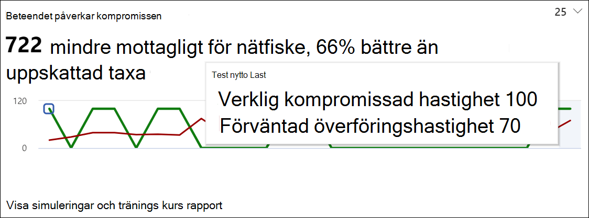
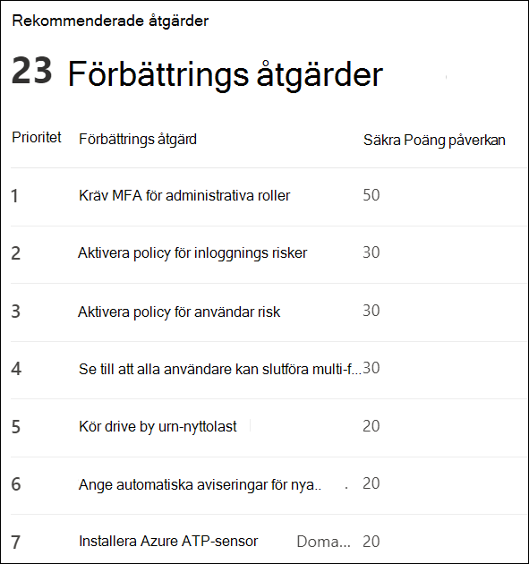

# Få insikter genom att träna på attacksimulering

Med utbildning för att simulera attacker tillhandahåller Microsoft dig insikter baserade på resultat från simuleringar och utbildning som anställda gick igenom. Dessa insikter hjälper dig med att informera dina anställda om hot och att rekommendera nästa steg för att bättre förbereda dina anställda och din miljö för attacker.

[!INCLUDE [Prerelease information](../includes/prerelease.md)]

Vi arbetar ständigt med att utöka alla insikter som är tillgängliga för dig, med beteende effekter och rekommenderade åtgärder tillgängliga.
För att komma igång kan du [gå vidare med utbildning för utleverans simulering i Microsoft 365 Security Center](https://security.microsoft.com/attacksimulator?viewid=overview).

## Beteendet påverkar kompromissen

På fliken **Översikt** för angrepps simulering visas **beteendet för kompromiss** kortet. Det här kortet visar hur medarbetare kan hantera simuleringen som du har använt i motsats till det **förutsagda kompromissade priset**. Du kan använda dessa insikter för att spåra framsteg i de anställdas hot genom att köra flera simuleringar mot samma grupper av anställda.

I diagrammet kan du se:

- **Förväntad kompromiss nivå** som återspeglar den genomsnittliga kompromiss frekvensen för simuleringar med samma typ av nytto Last mellan klient organisationer.
- **Faktisk kompromiss hastighet** visar den andel av anställda som sjönk för simuleringen.

Dessutom visas `<number> less susceptible to phishing` skillnaden mellan det faktiska antalet anställda som äventyras av angreppet och det uppskattade kompromiss priset. Det här antalet anställda är mindre troligt att det äventyras genom liknande attacker i framtiden, samtidigt som `<percent%> better than predicted rate` det visar hur de anställda hade stor till gång till den förväntade kompromissen.

> [!div class="mx-imgBorder"]
> 

Om du vill se en mer detaljerad rapport klickar du på **Visa simuleringar och kurs effektivitets rapport** som ger samma information om ytterligare kontext från själva simuleringen, som simulerings teknik och totalt antal användare riktade till sig.

## Rekommenderade åtgärder

På fliken [ **simuleringar**](https://security.microsoft.com/attacksimulator?viewid=simulations)kommer du till simulerings uppgifter. Här hittar du avsnittet **rekommenderade åtgärder** .

Rekommendationer för rekommenderade åtgärder som är tillgängliga i [Microsofts säkra Poäng](../mtp/microsoft-secure-score.md). Dessa rekommendationer är baserade på den nytto last som används i simuleringen och hjälper dig att skydda dina anställda och din miljö. Om du klickar på varje åtgärd för förbättring kommer du till dess uppgifter.

> [!div class="mx-imgBorder"]
> 

## Relaterade länkar

**Angrepps Simulator** [skapa en simulering av nätfiske-attack](https://docs.microsoft.com/microsoft-365/security/office-365-security/attack-simulation-training?view=o365-worldwide) och [skapa en nytto last för utbildning av dina kontakter](https://docs.microsoft.com/microsoft-365/security/office-365-security/attack-simulation-training-payloads?view=o365-worldwide)
