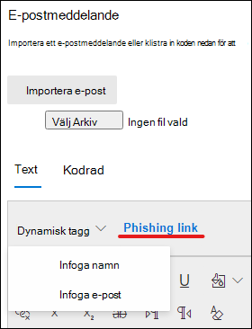

# Skapa en anpassad nyttolast för att träna på attacksimulering

Microsoft erbjuder en robust nytto Last katalog för olika sociala teknik tekniker som kan kopplas till din utbildning för utskrivning av attacker. Men du kanske vill skapa anpassade nytto laster som fungerar bättre för din organisation. I den här artikeln beskrivs hur du skapar en nytto last för utbildning för attack simulering i Microsoft Defender för Office 365.

[!INCLUDE [Prerelease information](../includes/prerelease.md)]

Du kan skapa en nytto last genom att klicka på **skapa en nytto Last** på [fliken dedikerade **nytto laster**](https://security.microsoft.com/attacksimulator?viewid=payload) eller i [guiden skapa simulering](attack-simulation-training.md#selecting-a-payload).

I det första steget i guiden kan du välja en nytto Last typ. **För närvarande är bara e-post tillgänglig**.

Välj sedan en associerad teknik. Se mer information om tekniker när du [väljer en social teknik teknik](attack-simulation-training.md#selecting-a-social-engineering-technique).

I nästa steg namnger du din nytto Last. Du kan också ange en beskrivning.

## Konfigurera nytto Last

Nu är det dags att bygga din nytto Last. Ange avsändarens namn, e-postadress och meddelandets ämne i avsnittet **avsändare** . Välj en nät fiske-URL i listan. Denna URL kommer senare att bäddas in i meddelande texten.

> [!TIP]
> Du kan välja en intern e-postadress för avsändarens avsändare, som kommer att visas som en annan anställd i företaget. Detta ökar det mottagligt för nytto lasten och hjälper anställda att hålla sig utsatt för risk för interna hot.

Det finns en RTF-redigerare som kan skapa din nytto Last. Du kan också importera ett e-postmeddelande som du har skapat i förväg. När du skapar bröd texten i e-postmeddelandet kan du dra nytta av de **dynamiska märkningarna** för att anpassa e-postmeddelandet till dina mål. Klicka på **phishing-länken** för att lägga till den tidigare valda nät fiske adressen i meddelande texten.

> [!TIP]
> Om du vill spara tid kan du växla till alternativet att **ersätta alla länkar i e-postmeddelandet med phishing-länken**.

När du är klar med att bygga upp nytto lasten klickar du på **Nästa**.

## Lägga till indikatorer

Med indikatorer blir det lättare för anställda att komma via attack simuleringen förstå vilken LED trådar de kan leta efter i framtida attacker. Börja genom att klicka på **Lägg till indikator**.

Välj en indikator du vill använda i list rutan. Listan granskas för att innehålla de vanligaste LED trådar som visas i nät fiske meddelanden. När du markerat det här alternativet kontrollerar du att indikator placeringen är inställd på **från bröd texten i e-** postmeddelandet och klickar på **Markera text**. Markera den del av nytto lasten där denna indikator visas och klicka på **Välj**.

Lägg till en egen beskrivning som beskriver indikatorn och klicka i indikatorn för förhands granskning för att se en förhands granskning av indikatorn. När du är klar klickar du på **Lägg till**. Upprepa de här stegen tills du har täckt alla indikatorer i din nytto Last.

## Granska nytto Last

Du är klar med att bygga din nytto Last. Nu är det dags att granska informationen och se en förhands granskning av din nytto Last. I förhands granskningen visas alla indikatorer som du har skapat. Du kan redigera varje del av nytto lasten från det här steget. **Skicka** in din betalning när du är nöjd.

> [!IMPORTANT]
> De nytto laster som du har skapat har **klient organisationen** som källa. När du väljer nytto laster bör du kontrol lera att du inte filtrerar bort **klient organisationen**.
