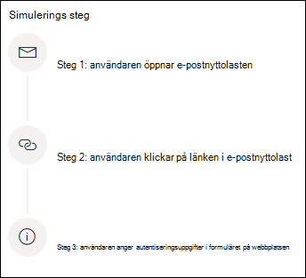

# Simulera nätfiske-attackSimulate a phishing attack

Med utbildning för angrepps Simulator via Microsoft Defender för Office 365 kan du köra säkra cyberterrorism-attacker på din organisation för att testa dina säkerhets principer och-rutiner, samt träna de anställda i organisationen att öka sin medvetenhet och minska deras känslighet för angrepp.Attack simulator training through Microsoft Defender for Office 365 lets you run benign cyber attack simulations on your organization to test your security policies and practices, as well as train the employees of your organization to increase their awareness and decrease their susceptibility to attacks. Här får du hjälp med att simulera en nätfiske-attack genom att använda en angrepps Simulator utbildning.The following walks you through simulating a phishing attack using attack simulator training.

[!INCLUDE [Prerelease information](../includes/prerelease.md)]

För att starta en simulerad nätfiske-attack navigerar du till [Microsoft 365 säkerhets Center](https://security.microsoft.com/).To launch a simulated phishing attack, navigate to the [Microsoft 365 security center](https://security.microsoft.com/). Under **e-post& samarbete** klickar du på **angrepps Simulator** och växlar till fliken [**simuleringar**](https://security.microsoft.com/attacksimulator?viewid=simulations) .Under **Email & collaboration** click on **Attack simulator** and switch to the [**Simulations**](https://security.microsoft.com/attacksimulator?viewid=simulations) tab.

Välj **+ starta en simulering** under **simuleringar** .Under **Simulations** select **+ Launch a simulation**.

> [!NOTE]
> När som helst under simuleringen kan du spara och stänga för att fortsätta att konfigurera simuleringen senare.At any point during simulation creation you can save and close to continue configuring the simulation at a later time.

## Välja en social teknik teknikSelecting a social engineering technique

Välj bland fyra olika tekniker som kan granskas från [Mitre to&CK® Framework](https://attack.mitre.org/techniques/enterprise/).Select from 4 different techniques, curated from the [MITRE ATT&CK® framework](https://attack.mitre.org/techniques/enterprise/). Det finns olika nytto laster för olika tekniker.Different payloads are available for different techniques.

- **Skörde** uppgifter för att samla in autentiseringsuppgifter från anställda genom att ta dem till en välkänd webbplats där du kan skicka ett användar namn och lösen ord.**Credential harvest** attempts to collect credentials from employees by taking them to a well-known looking website with input boxes to submit a username and password.
- **Bifogad fil med skadlig kod** lägger till en skadlig bifogad fil i ett meddelande.**Malware attachment** adds a malicious attachment to a message. När den här bifogade filen öppnas körs en kod som gör att angriparen kan kompromissa med mål enheten.When opened, this attachment will run some arbitrary code that will help the attacker compromise the target's device.
- **Länk i bilaga** är en typ av certifiering skörde hybrid.**Link in attachment** is a type of credential harvest hybrid. En angripare infogar en URL i en e-postbilaga.An attacker inserts a URL into an email attachment. URL-adressen i den bifogade filen följer samma teknik som skörd för autentiseringsuppgifter.The URL within the attachment follows the same technique as credential harvest.
- **Länk till malware kör skadlig** kod från en fil som finns på en välkänd fildelnings webbplats.**Link to malware** will run some arbitrary code from a file hosted on a well-known file-sharing site. En länk till den här skadliga filen läggs till i meddelandet som skickas till målet och klicka på den kör filen och gör det lättare för angriparen att kompromissa med mål enheten.A link to this malicious file is added to the message sent to the target and clicking it will run the file and help the attacker compromise the target's device.

> [!TIP]
> Om du klickar på **Visa information** inom beskrivningen av varje teknik visas ytterligare information om tekniken samt simulerings stegen för den metoden.Clicking on **View details** within the description of each technique will display further information about the technique as well as the simulation steps for that technique.
>
> 

När du har valt en teknik och klickat på **Nästa** får du ett namn och eventuellt en beskrivning.Once you've selected the technique and clicked on **Next** give your simulation a name and optionally a description.

## Välja en nytto LastSelecting a payload

Sedan måste du antingen välja en nytto Last från en befintlig nytto Last katalog.Next, you'll need to either select a payload from the pre-existing payload catalog.

Det finns många data punkter som du kan använda för att välja:Payloads have a number of data points to help you choose:

- **Klicka på Rate** räknas hur många personer som klickade på denna nytto Last.**Click rate** counts how many people clicked this payload.
- **Förväntad kompromiss frekvens** förväntar sig procent av personer som kommer att bli utsatt för denna nytto Last baserat på historiska data för denna nytto Last i Microsoft Defender för Office 365-kunder.**Predicted compromise rate** predicts the percentage of people that will get compromised by this payload based on historic data for this payload across Microsoft Defender for Office 365 customers.
- **Simuleringar startas** antal gånger denna nytto Last användes i andra simuleringar.**Simulations launched** counts the number of times this payload was used in other simulations.
- **Komplexitet**, tillgängliga genom **filter**, beräknas baserat på antalet indikatorer inom nytto lasten som led trådar till att det är en attack.**Complexity**, available through **filters**, is calculated based on the number of indicators within the payload that clue targets in on it being an attack. Fler indikatorer kan leda till lägre komplexitet.More indicators lead to lower complexity.
- **Källa**, som är tillgänglig via **filter**, anger om nytto lasten skapades på din klient organisation eller är en del av Microsofts förvalda nytto fil katalog (global).**Source**, available through **filters**, indicates whether the payload was created on your tenant or is a part of Microsoft's pre-existing payload catalog (global).

Välj en nytto Last i listan för att se en förhands granskning av nytto lasten med ytterligare information om den.Select a payload from the list to see a preview of the payload with additional information about it.

Om du vill skapa en egen nytto Last läser du [skapa en nytto last för utbildning för utskrivning](attack-simulation-training-payloads.md).If you'd like to create your own payload, read [create a payload for attack simulation training](attack-simulation-training-payloads.md).

## Mål grupps anpassningAudience targeting

Nu är det dags att välja simuleringens mål grupp.Now it's time to select this simulation's audience. Du kan välja att **ta med alla användare i organisationen** eller **bara ta med specifika användare och grupper**.You can choose to **include all users in your organization** or **include only specific users and groups**.

Om du väljer att **bara inkludera specifika användare och grupper** kan du antingen:When you choose to **include only specific users and groups** you can either:

- **Lägg till användare**, som gör att du kan använda Sök funktionen för din klient organisation, samt avancerade funktioner för sökning och filtrering, som mål för användare som inte har riktat mot en simulering under de senaste 3 månaderna.**Add users**, which allows you to leverage search for your tenant, as well as advanced search and filtering capabilities, like targeting users who haven't been targeted by a simulation in the last 3 months.
  
- **Importera från CSV** låter dig importera en fördefinierad uppsättning användare för den här simuleringen.**Import from CSV** allows you to import a predefined set of users for this simulation.

## Tilldela utbildningAssigning training

Vi rekommenderar att du tilldelar utbildning för varje simulering, eftersom anställda som deltar i utbildningen är mindre utsatta för liknande attacker.We recommend that you assign training for each simulation, as employees who go through training are less susceptible to similar attacks.

Du kan antingen välja att ha utbildning tilldelat åt dig eller välja kurser och moduler själv.You can either choose to have training assigned for you or select training courses and modules yourself.

Välj **förfallo datum för utbildning** för att se till att anställda avslutar sin utbildning i god tid.Select the **training due date** to make sure employees finish their training in a timely manner.

> [!NOTE]
> Om du väljer att välja kurser och moduler själv kan du fortfarande se det rekommenderade innehållet och alla tillgängliga kurser och moduler.If you choose to select courses and modules yourself, you'll still be able to see the recommended content as well as all available courses and modules.
>
> 

I nästa steg måste du **lägga till utbildningar** om du väljer det själv och anpassar din utbildning.In the next steps you'll need to **Add trainings** if you opted to select it yourself, and customize your training landing page. Du kan förhandsgranska övnings sidan för utbildning och även ändra sidhuvud och brödtext.You'll be able to preview the training landing page, as well as change the header and body of it.

## Starta detaljer och granskaLaunch details and review

Nu när allt är konfigurerat kan du starta simuleringen direkt eller schemalägga det för ett senare datum.Now that everything is configured, you can launch this simulation immediately or schedule it for a later date. Du måste också välja när simuleringen ska avslutas.You will also need to choose when to end this simulation. Vi slutar samla in interaktionen med den här simuleringen tidigare den valda tiden.We will stop capturing interaction with this simulation past the selected time.

**Aktivera region medveten leverans** för att leverera simulerade attack meddelanden till dina anställda under deras arbets tid baserat på deras region.**Enable region aware timezone delivery** to deliver simulated attack messages to your employees during their working hours based on their region.

När du är klar klickar du på **Nästa** och läser informationen för simuleringen.Once you're done, click on **Next** and review the details of your simulation. Klicka på **Redigera** på någon av delarna för att gå tillbaka och ändra eventuell information som behövs.Click on **Edit** on any of the parts to go back and change any details that need changing. När du är klar klickar du på **Skicka**.Once done, click **Submit**.
