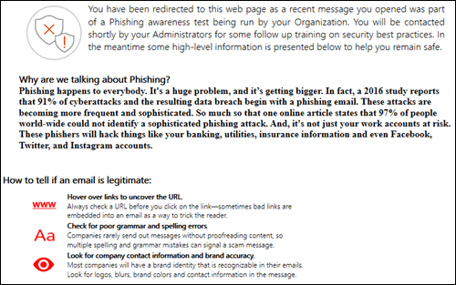

# Attack Simulator i Office 365 ATPAttack Simulator in Office 365 ATP

Med Attack Simulator i Office 365 Advanced Threat Protection Plan 2 (ATP Plan 2) kan du köra realistiska, men simulerade kampanjer för nätfiske- och lösenordsattacker i organisationen.Attack Simulator in Office 365 Advanced Threat Protection Plan 2 (ATP Plan 2) allows you to run realistic, but simulated phishing and password attack campaigns in your organization. Du kan använda resultaten av kampanjer för att identifiera och utbilda sårbara användare.You can use the results of campaigns to identify and train vulnerable users.

## Vad behöver jag veta innan jag börjar?What do you need to know before you begin?

- Öppna Säkerhets- & Compliance Center för Office 365 går du till <https://protection.office.com/>.To open the Office 365 Security & Compliance Center, go to <https://protection.office.com/>. Attack simulator finns på **Threat management** \> **Attack simulator**.Attack simulator is available at **Threat management** \> **Attack simulator**.

  

- Mer information om tillgängligheten för Attack Simulator för olika Office 365-prenumerationer finns i [office 365-tjänstbeskrivning för avancerat skydd mot hot](https://docs.microsoft.com/office365/servicedescriptions/office-365-advanced-threat-protection-service-description).For more information about the availability of Attack Simulator across different Office 365 subscriptions, see [Office 365 Advanced Threat Protection service description](https://docs.microsoft.com/office365/servicedescriptions/office-365-advanced-threat-protection-service-description).

- Du måste vara medlem i rollgrupperna **Organisationshantering** eller **Säkerhetsadministratör.**You need to be a member of the **Organization Management** or **Security Administrator** role groups. Mer information om rollgrupper i Security & Compliance Center finns [i Behörigheter i Office 365 Security & Compliance Center](permissions-in-the-security-and-compliance-center.md).For more information about role groups in the Security & Compliance Center, see [Permissions in the Office 365 Security & Compliance Center](permissions-in-the-security-and-compliance-center.md).

- Ditt konto måste konfigureras för MFA (Multi Factor Authentication) för att skapa och hantera kampanjer i Attack Simulator.Your account needs to be configured for multi-factor authentication (MFA) to create and manage campaigns in Attack Simulator. Instruktioner finns i [Konfigurera multifaktorautentisering](https://docs.microsoft.com/office365/admin/security-and-compliance/set-up-multi-factor-authentication).For instructions, see [Set up multi-factor authentication](https://docs.microsoft.com/office365/admin/security-and-compliance/set-up-multi-factor-authentication).

- Du kan bara köra kampanjer för nätfiske- eller lösenordsattacker på användare med postlådor i Exchange Online.You can only run phishing or password attack campaigns on users with mailboxes in Exchange Online.

- Nätfiskekampanjer samlar in och behandlar händelser i 30 dagar.Phishing campaigns will collect and process events for 30 days. Historiska kampanjdata kommer att vara tillgängliga i upp till 90 dagar efter att du har startat kampanjen.Historical campaign data will be available for up to 90 days after you launch the campaign.

- Det finns inga motsvarande PowerShell-cmdlets för Attack Simulator.There are no corresponding PowerShell cmdlets for Attack Simulator.

## Nätfiskekampanjer för spjutSpear phishing campaigns

*Nätfiske* är en allmän term för e-postattacker som försöker stjäla känslig information i meddelanden som verkar komma från legitima eller betrodda avsändare.*Phishing* is a generic term for email attacks that try to steal sensitive information in messages that appear to be from legitimate or trusted senders. *Spear phishing* är en riktad nätfiskeattack som använder mycket fokuserat och anpassat innehåll som är särskilt anpassat till de riktade mottagarna (vanligtvis efter spaning på mottagarna av angriparen).*Spear phishing* is a targeted phishing attack that uses very focused and customized content that's specifically tailored to the targeted recipients (typically, after reconnaissance on the recipients by the attacker).

Mer information om nätfiske och spjutfiskefiske finns i [Nätfiske](https://docs.microsoft.com/windows/security/threat-protection/intelligence/phishing).For more information about phishing and spear phishing, see [Phishing](https://docs.microsoft.com/windows/security/threat-protection/intelligence/phishing).

I Attack Simulator finns två olika typer av nätfiskekampanjer för spjut:In Attack Simulator, two different types of spear phishing campaigns are available:

- **Spear phishing (autentiseringsuppgifter skörd)**: Attacken försöker övertyga mottagarna att klicka på en webbadress i meddelandet.**Spear phishing (credentials harvest)**: The attack tries to convince the recipients to click a URL in the message. Om de klickar på länken uppmanas användarna att ange sina autentiseringsuppgifter.If they click the link, users are asked to enter their credentials. Om de gör det tas de till någon av följande platser:If they do, they're taken to one of the following locations:

  - En standardsida som förklarar detta var bara ett test och ger tips om hur du känner igen nätfiskemeddelanden.A default page that explains this was a just a test, and gives tips for recognizing phishing messages.

    

  - En anpassad sida (URL) som du anger.A custom page (URL) that you specify.

- **Spear phishing (bilaga)**: Attacken försöker övertyga mottagarna att öppna en .docx eller .pdf-bilaga i meddelandet.**Spear phishing (attachment)**: The attack tries to convince the recipients to open a .docx or .pdf attachment in the message. Den bifogade filen innehåller samma innehåll från standardlänken för\<nätfiske, men den första meningen börjar med "Visningsnamn\>visas det här meddelandet som ett nytt e-postmeddelande som du öppnade...".The attachment contains the same content from the default phishing link, but the first sentence starts with "\<Display Name\>, you are seeing this message as a recent email message you opened...".

> [!NOTE]
> För närvarande upphör inte spjutfiskekampanjer i Attack Simulator.Currently, spear phishing campaigns in Attack Simulator don't expire.

### Skapa en nätfiskekampanj för spjutCreate a spear phishing campaign

En viktig del av en spjutfiskekampanj är utseendet på det e-postmeddelande som skickas till de riktade mottagarna.An important part of any spear phishing campaign is the look and feel of the email message that's sent to the targeted recipients. Om du vill skapa och konfigurera e-postmeddelandet har du följande alternativ:To create and configure the email message, you have these options:

- **Använd en inbyggd e-postmall:** Två inbyggda mallar finns tillgängliga: **Pris giveaway** och **lön Uppdatering**.**Use a built-in email template**: Two built-in templates are available: **Prize Giveaway** and **Payroll Update**. Du kan ytterligare anpassa vissa, alla eller ingen av e-postegenskaperna från mallen när du skapar och startar kampanjen.You can further customize some, all, or none of the email properties from the template when you create and launch the campaign.

- **Skapa en återanvändningsbar e-postmall**: När du har skapat och sparat e-postmallen kan du använda den igen i framtida nätfiskekampanjer.**Create a reusable email template**: After you create and save the email template, you can use it again in future spear phishing campaigns. Du kan ytterligare anpassa vissa, alla eller ingen av e-postegenskaperna från mallen när du skapar och startar kampanjen.You can further customize some, all, or none of the email properties from the template when you create and launch the campaign.

- **Skapa e-postmeddelandet i guiden**: Du kan skapa e-postmeddelandet direkt i guiden när du skapar och startar nätfiskekampanjen för spjutet.**Create the email message in the wizard**: You can create the email message directly in the wizard as you create and launch the spear phishing campaign.

#### Steg 1 (valfritt): Skapa en anpassad e-postmallStep 1 (Optional): Create a custom email template

Om du ska använda någon av de inbyggda mallarna eller skapa e-postmeddelandet direkt i guiden kan du hoppa över det här steget.If you're going to use one of the built-in templates or create the email message directly in the wizard, you can skip this step.

1. Gå till simulator för \> **angreppshantering** **Threat management** för & säkerhet i säkerhetsorganisationscenter .In the Security & Compliance Center, go to **Threat management** \> **Attack simulator**.

2. Klicka på **Attackinformation**i avsnitten **Spear Phishing (Credentials Harvest)** eller **Spear Phishing (Attachment)** på sidan **Simulera attacker.**On the **Simulate attacks** page, in either the **Spear Phishing (Credentials Harvest)** or **Spear Phishing (Attachment)** sections, click **Attack Details**.

   Det spelar ingen roll var du skapar mallen.It doesn't matter where you create the template. De tillgängliga alternativen i mallen är desamma för båda typerna av nätfiskeattacker.The available options in the template are the same for both types of phishing attacks.

3. Klicka på **Ny mall**i avsnittet Skapa mallar i avsnittet **Skapa mallar** på sidan **Attackinformation** som öppnas. **Create Templates**In the **Attack details** page that opens, in the **Phishing Templates** section, in the **Create Templates** area, click **New Template**.

4. Guiden **Konfigurera nätfiskemall** börjar i ett nytt utfällbart utfällbart.The **Configure Phishing Template** wizard starts in a new flyout. I steget **Start** anger du ett unikt visningsnamn för mallen och klickar sedan på **Nästa**.In the **Start** step, enter a unique display name for the template, and then click **Next**.

5. Konfigurera följande inställningar i steget **Konfigurera e-postinformation:**In the **Configure email details** step, configure the following settings:

   - **Från (Namn)**: Visningsnamnet som används för meddelandeavsändaren.**From (Name)**: The display name that's used for the message sender.

   - **Från (E-post)**: Avsändarens e-postadress.**From (Email)**: The sender's email address.

   - **Url till nätloggningsserver:** Klicka på listrutan och välj en av de tillgängliga webbadresserna i listan.**Phishing Login Server URL**: Click the drop down and select one of the available URLs from the list. Detta är webbadressen som användarna kommer att frestas att klicka.This is the URL that users will be tempted to click. Alternativen är:The choices are:

     - <http://portal.docdeliveryapp.com>
     - <http://portal.docdeliveryapp.net>
     - <http://portal.docstoreinternal.com>
     - <http://portal.docstoreinternal.net>
     - <http://portal.hardwarecheck.net>
     - <http://portal.hrsupportint.com>
     - <http://portal.payrolltooling.com>
     - <http://portal.payrolltooling.net>
     - <http://portal.prizegiveaway.net>
     - <http://portal.prizesforall.com>
     - <http://portal.salarytoolint.com>
     - <http://portal.salarytoolint.net>

     > [!NOTE]
     > <ul><li>Alla webbadresser är avsiktligt http, inte https.All of the URLs are intentionally http, not https.</li><li>En URL-ryktestjänst kan identifiera en eller flera av dessa webbadresser som osäkra.A URL reputation service might identify one or more of these URLs as unsafe. Kontrollera tillgängligheten för webbadressen i webbläsare som stöds innan du använder webbadressen i en nätfiskekampanj.Check the availability of the URL in your supported web browsers before you use the URL in a phishing campaign.</li></ul>

   - **Url till anpassad målsida**: Ange en valfri målsida där användarna tas om de klickar på nätfiskelänken och anger sina autentiseringsuppgifter.**Custom Landing Page URL**: Enter an optional landing page where users are taken if they click the phishing link and enter their credentials. Den här länken ersätter standardmålsidan.This link replaces the default landing page. Om du till exempel har intern medvetenhetsutbildning kan du ange webbadressen här.For example, if you have internal awareness training, you can specify that URL here.

   - **Kategori**: För närvarande används inte den här inställningen (allt du anger ignoreras).**Category**: Currently, this setting isn't used (anything you enter is ignored).

   - **Ämne**: **Fältet Ämne** i e-postmeddelandet.**Subject**: The **Subject** field of the email message.

   När du är klar klickar du på **Nästa**.When you're finished, click **Next**.

6. Skapa meddelandetexten för e-postmeddelandet i steget **Skriv e-post.**In the **Compose email** step, create the message body of the email message. Du kan använda fliken **E-post** (en rtf-redigerare) eller fliken **Källa** (rå HTML-kod).You can use the **Email** tab (a rich HTML editor) or the **Source** tab (raw HTML code).

   HTML-formateringen kan vara så enkel eller komplex som du behöver den för att vara.The HTML formatting can be as simple or complex as you need it to be. Du kan infoga bilder och text för att förbättra meddelandets trovärdighet i mottagarens e-postklient.You can insert images and text to enhance the believability of the message in the recipient's email client.

   - `${username}`infogar mottagarens namn.`${username}` inserts the recipient's name.

   - `${loginserverurl}`**Url-värdet för nätfiske inloggningsservern** infogas från föregående steg.`${loginserverurl}` inserts the **Phishing Login Server URL** value from the previous step.

   När du är klar klickar du på **Nästa**.When you're finished, click **Next**.

7. Klicka på **Slutför**i steget **Bekräfta.**In the **Confirm** step, click **Finish**.

#### Steg 2: Skapa och starta nätfiskekampanjen för spjutStep 2: Create and launch the spear phishing campaign

1. Gå till simulator för \> **angreppshantering** **Threat management** för & säkerhet i säkerhetsorganisationscenter .In the Security & Compliance Center, go to **Threat management** \> **Attack simulator**.

2. På sidan **Simulera attacker** gör du något av följande val baserat på vilken typ av kampanj du vill skapa:On the **Simulate attacks** page, make one of the following selections based on the type of campaign you want to create:

   - Klicka på **Starta attack** i avsnittet **Spear Phishing (Credentials Harvest)** eller klicka på **Attackinformation** \> **Launch Attack**.In the **Spear Phishing (Credentials Harvest)** section, click **Launch Attack** or click **Attack Details** \> **Launch Attack**.

   - Klicka på **Attack Details** \> **Launch Attack** **Starta attack** i avsnittet **Spear Phishing (Attachment).**In the **Spear Phishing (Attachment)** section, click **Launch Attack** or click **Attack Details** \> **Launch Attack**.

3. Guiden **Konfigurera nätfiskeattack** startar i ett nytt utfällbart utfällbart.The **Configure Phishing Attack** wizard starts in a new flyout. Gör **Start** något av följande i startsteget:In the **Start** step, do one of the following steps:

   - Ange ett unikt visningsnamn för kampanjen i rutan **Namn.**In the **Name** box, enter a unique display name for the campaign. Klicka inte på **Använd mall**eftersom du skapar e-postmeddelandet senare i guiden.Don't click **Use Template**, because you'll create the email message later in the wizard.

   - Klicka på **Använd mall** och välj en inbyggd eller anpassad e-postmall.Click **Use Template** and select a built-in or custom email template. När du har valt mallen fylls rutan **Namn** automatiskt baserat på mallen, men du kan ändra namnet.After you select the template, the **Name** box is automatically filled based on the template, but you can change the name.

   

   När du är klar klickar du på **Nästa**.When you're finished, click **Next**.

4. Gör något av följande i steget **Målmottagare:**In the **Target recipients** step, do one of the following steps:

   - Klicka på **Adressbok** om du vill välja mottagare (användare eller grupper) för kampanjen.Click **Address Book** to select the recipients (users or groups) for the campaign. Varje riktad mottagare måste ha en Exchange Online-postlåda.Each targeted recipient must have an Exchange Online mailbox. Om du klickar på **Filtrera** och **tillämpa** utan att ange några sökvillkor returneras alla mottagare och läggs till i kampanjen.If you click **Filter** and **Apply** without entering a search criteria, all recipients are returned and added to the campaign.

   - Klicka på **Importera** och sedan **Filimport** om du vill importera ett kommaavgränsat värde (CSV) eller radavgränsad fil med e-postadresser.Click **Import** then **File Import** to import a comma-separated value (CSV) or line-separated file of email addresses. Varje rad måste innehålla mottagarens e-postadress.Each line must contain the recipient's email address.

   När du är klar klickar du på **Nästa**.When you're finished, click **Next**.

5. Konfigurera följande inställningar i steget **Konfigurera e-postinformation:**In the **Configure email details** step, configure the following settings:

   Om du har valt en mall i **startsteget** är de flesta av dessa värden redan konfigurerade, men du kan ändra dem.If you selected a template in the **Start** step, most of these values are already configured, but you can change them.

   - **Från (Namn)**: Visningsnamnet som används för meddelandeavsändaren.**From (Name)**: The display name that's used for the message sender.

   - **Från (E-post)**: Avsändarens e-postadress.**From (Email)**: The sender's email address. Du kan ange en verklig eller falsk e-postadress från organisationens e-postdomän, eller så kan du ange en verklig eller falsk extern e-postadress.You can enter a real or fake email address from your organization's email domain, or you can enter a real or fake external email address. En giltig e-postadress för avsändaren från organisationen kommer faktiskt att matchas i mottagarens e-postklient.A valid sender email address from your organization will actually resolve in the recipient's email client.

   - **Url till nätloggningsserver:** Klicka på listrutan och välj en av de tillgängliga webbadresserna i listan.**Phishing Login Server URL**: Click the drop down and select one of the available URLs from the list. Detta är webbadressen som användarna kommer att frestas att klicka.This is the URL that users will be tempted to click. Alternativen är:The choices are:

     - <http://portal.docdeliveryapp.com>
     - <http://portal.docdeliveryapp.net>
     - <http://portal.docstoreinternal.com>
     - <http://portal.docstoreinternal.net>
     - <http://portal.hardwarecheck.net>
     - <http://portal.hrsupportint.com>
     - <http://portal.payrolltooling.com>
     - <http://portal.payrolltooling.net>
     - <http://portal.prizegiveaway.net>
     - <http://portal.prizesforall.com>
     - <http://portal.salarytoolint.com>
     - <http://portal.salarytoolint.net>

     > [!NOTE]
     > <ul><li>Alla webbadresser är avsiktligt http, inte https.All of the URLs are intentionally http, not https.</li><li>En URL-ryktestjänst kan identifiera en eller flera av dessa webbadresser som osäkra.A URL reputation service might identify one or more of these URLs as unsafe. Kontrollera tillgängligheten för webbadressen i webbläsare som stöds innan du använder webbadressen i en nätfiskekampanj.Check the availability of the URL in your supported web browsers before you use the URL in a phishing campaign.</li><li>Du måste välja en webbadress.You are required to select a URL. För kampanjer <b>med spearfiske (bifogad fil)</b> kan du ta bort länken från meddelandets brödtext i nästa steg (annars innehåller meddelandet både en länk <b>och</b> en bifogad fil).For <b>Spear Phishing (Attachment)</b> campaigns, you can remove the link from the body of the message in the next step (otherwise, the message will contain both a link <b>and</b> an attachment).</li></ul>

   - **Typ av bifogade filer**: Den här inställningen är endast tillgänglig i **spearfiskekampanjer (bifogad fil).****Attachment Type**: This setting is only available in **Spear Phishing (Attachment)** campaigns. Klicka på listrutan och välj **. DOCX** eller **. PDF** från listan.Click the drop down and select **.DOCX** or **.PDF** from the list.

   - **Namn på bifogade filer**: Den här inställningen är endast tillgänglig i **spearfiskekampanjer (bifogad fil).****Attachment Name**: This setting is only available in **Spear Phishing (Attachment)** campaigns. Ange ett filnamn för bifogad fil i .docx eller .pdf.Enter a filename for the .docx or .pdf attachment.

   - **Url till anpassad målsida**: Ange en valfri målsida där användarna tas om de klickar på nätfiskelänken och anger sina autentiseringsuppgifter.**Custom Landing Page URL**: Enter an optional landing page where users are taken if they click the phishing link and enter their credentials. Den här länken ersätter standardmålsidan.This link replaces the default landing page. Om du till exempel har intern medvetenhetsutbildning kan du ange webbadressen här.For example, if you have internal awareness training, you can specify that URL here.

   - **Ämne**: **Fältet Ämne** i e-postmeddelandet.**Subject**: The **Subject** field of the email message.

   När du är klar klickar du på **Nästa**.When you're finished, click **Next**.

6. Skapa meddelandetexten för e-postmeddelandet i steget **Skriv e-post.**In the **Compose email** step, create the message body of the email message. Om du har valt en mall i **startsteget** är meddelandetexten redan konfigurerad, men du kan anpassa den.If you selected a template in the **Start** step, the message body is already configured, but you can customize it. Du kan använda fliken **E-post** (en rtf-redigerare) eller fliken **Källa** (rå HTML-kod).You can use the **Email** tab (a rich HTML editor) or the **Source** tab (raw HTML code).

   HTML-formateringen kan vara så enkel eller komplex som du behöver den för att vara.The HTML formatting can be as simple or complex as you need it to be. Du kan infoga bilder och text för att förbättra meddelandets trovärdighet i mottagarens e-postklient.You can insert images and text to enhance the believability of the message in the recipient's email client.

   - `${username}`infogar mottagarens namn.`${username}` inserts the recipient's name.

   - `${loginserverurl}`Url-värdet för **nätfiske inloggningsservern** infogas.`${loginserverurl}` inserts the **Phishing Login Server URL** value.

   För kampanjer **med nätfiske (bifogad fil)** bör du ta bort länken från meddelandets brödtext (annars innehåller meddelandet både en länk **och** en bifogad fil och länkklick spåras inte i en kampanj för bifogade filer).For **Spear Phishing (Attachment)** campaigns, you should remove the link from the body of the message (otherwise, the message will contain both a link **and** an attachment, and link clicks aren't tracked in an attachment campaign).

   

   När du är klar klickar du på **Nästa**.When you're finished, click **Next**.

7. Klicka på **Slutför** i steget **Bekräfta** för att starta kampanjen.In the **Confirm** step, click **Finish** to launch the campaign. Nätfiskemeddelandet levereras till de riktade mottagarna.The phishing message is delivered to the targeted recipients.

## Kampanjer för lösenordsattackerPassword attack campaigns

En *lösenordsattack* försöker gissa lösenord för användarkonton i en organisation, vanligtvis efter att angriparen har identifierat ett eller flera giltiga användarkonton.A *password attack* tries to guess passwords for user accounts in an organization, typically after the attacker has identified one or more valid user accounts.

I Attack Simulator är två olika typer av lösenordsattackkampanjer tillgängliga för dig att testa komplexiteten i användarnas lösenord:In Attack Simulator, two different types of password attack campaigns are available for you to test the complexity of your users' passwords:

- **Brute force lösenord (ordbok attack)**: En *brute force* eller *ordbok* attack använder en stor ordbok fil av lösenord på ett användarkonto med hopp om att en av dem kommer att fungera (många lösenord mot ett konto).**Brute force password (dictionary attack)**: A *brute force* or *dictionary* attack uses a large dictionary file of passwords on a user account with the hope that one of them will work (many passwords against one account). Felaktiga lösenordsspärrar hjälper till att avskräcka attacker mot brute force-lösenord.Incorrect password lock-outs help deter brute force password attacks.

  För ordlisteattacken kan du ange ett eller flera lösenord som ska provas (manuellt inmatat eller i en uppladdad fil) och du kan ange en eller flera användare.For the dictionary attack, you can specify one or many passwords to try (manually entered or in an uploaded file), and you can specify one or many users.

- **Lösenord spray attack:** Ett *lösenord spray* attack använder samma noggrant genomtänkta lösenord mot en lista över användarkonton (ett lösenord mot många konton).**Password spray attack**: A *password spray* attack uses the same carefully considered password against a list of user accounts (one password against many accounts). Lösenord spray attacker är svårare att upptäcka än brute force lösenord attacker (sannolikheten för framgång ökar när en angripare försöker ett lösenord över dussintals eller hundratals konton utan risk för att snubbla användarens felaktiga lösenord lock-out).Password spray attacks are harder to detect than brute force password attacks (the probability of success increases when an attacker tries one password across dozens or hundreds of accounts without the risk of tripping the user's incorrect password lock-out).

  För lösenordssprayattacken kan du bara ange ett lösenord att prova, och du kan ange en eller flera användare.For the password spray attack, you can only specify one password to try, and you can specify one or many users.

> [!NOTE]
> Lösenordsattackerna i Attack Simulator skickar användarnamn och lösenord Grundläggande auth-begäranden till en slutpunkt, så de fungerar också med andra autentiseringsmetoder (AD FS, lösenordshösksynkronisering, vidaregång, PingFederate, etc.).The password attacks in Attack Simulator pass username and password Basic auth requests to an endpoint, so they also work with other authentication methods (AD FS, password hash sync, pass-through, PingFederate, etc.). För användare som har MFA aktiverat, även om **lösenordsattacken** försöker sitt faktiska lösenord, kommer försöket alltid att registrera sig som ett fel (med andra ord kommer MFA-användare aldrig att visas i antalet lyckade försök för kampanjen).For users that have MFA enabled, even if the password attack tries their actual password, the attempt will always register as a failure (in other words, MFA users will never appear in the **Successful attempts** count of the campaign). Detta är det förväntade resultatet.This is the expected result. MFA är en primär metod för att skydda mot lösenordsattacker.MFA is a primary method to help protect against password attacks.

### Skapa och starta en kampanj för lösenordsattackCreate and launch a password attack campaign

1. Gå till simulator för \> **angreppshantering** **Threat management** för & säkerhet i säkerhetsorganisationscenter .In the Security & Compliance Center, go to **Threat management** \> **Attack simulator**.

2. På sidan **Simulera attacker** gör du något av följande val baserat på vilken typ av kampanj du vill skapa:On the **Simulate attacks** page, make one of the following selections based on the type of campaign you want to create:

   - Klicka på **Starta attack** i avsnittet Brute Force **Password (Dictionary Attack)** eller klicka på **Attackinformation** \> **Launch Attack**.In the **Brute Force Password (Dictionary Attack)** section, click **Launch Attack** or click **Attack Details** \> **Launch Attack**.

   - I avsnittet **Lösenord spray attack,** klicka **på Starta attack** eller klicka på Attack **Detaljer** \> **Launch Attack**.in the **Password spray attack** section, click **Launch Attack** or click **Attack Details** \> **Launch Attack**.

3. Guiden **Konfigurera lösenordsattack** startar i ett nytt utfällbart alternativ.The **Configure Password Attack** wizard starts in a new flyout. I steget **Start** anger du ett unikt visningsnamn för kampanjen och klickar sedan på **Nästa**.In the **Start** step, enter a unique display name for the campaign, and then click **Next**.

4. Gör något av följande i steget **Rikta användare:**In the **Target users** step, do one of the following steps:

   - Klicka på **Adressbok** om du vill välja mottagare (användare eller grupper) för kampanjen.Click **Address Book** to select the recipients (users or groups) for the campaign. Varje riktad mottagare måste ha en Exchange Online-postlåda.Each targeted recipient must have an Exchange Online mailbox. Om du klickar på **Filtrera** och **tillämpa** utan att ange några sökvillkor returneras alla mottagare och läggs till i kampanjen.If you click **Filter** and **Apply** without entering a search criteria, all recipients are returned and added to the campaign.

   - Klicka på **Importera** och sedan **Filimport** om du vill importera ett kommaavgränsat värde (CSV) eller radavgränsad fil med e-postadresser.Click **Import** then **File Import** to import a comma-separated value (CSV) or line-separated file of email addresses. Varje rad måste innehålla mottagarens e-postadress.Each line must contain the recipient's email address.

   När du är klar klickar du på **Nästa**.When you're finished, click **Next**.

5. I steget **Välj attackinställningar** väljer du vad du ska göra baserat på kampanjtypen:In the **Choose attack settings** step, choose what to do based on the campaign type:

   - **Brute Force Password (Dictionary Attack)**: Gör något av följande steg:**Brute Force Password (Dictionary Attack)**: Do either of the following steps:

     - **Ange lösenord manuellt**: Skriv ett lösenord i rutan **Tryck på retur för att lägga till ett lösenord** och tryck sedan på RETUR.**Enter passwords manually**: In the **Press enter to add a password** box, type a password and then press ENTER. Upprepa det här steget så många gånger som behövs.Repeat this step as many times as necessary.

     - **Ladda upp lösenord från en ordlistefil:** Klicka på **Ladda upp** om du vill importera en befintlig textfil som innehåller ett lösenord på varje rad och en tom sista rad.**Upload passwords from a dictionary file**: Click **Upload** to import an existing text file that contains one password on each line and a blank last line. Textfilen måste vara 10 MB eller mindre stor och får inte innehålla fler än 3 0000 lösenord.The text file must be 10 MB or less in size, and can't contain more than 30000 passwords.

   - **Lösenord spray attack:** I **det lösenord (er) att använda i attackrutan,** ange ett lösenord.**Password spray attack**: In **The password(s) to use in the attack** box, enter one password.

   När du är klar klickar du på **Nästa**.When you're finished, click **Next**.

6. Klicka på **Slutför** i steget **Bekräfta** för att starta kampanjen.In the **Confirm** step, click **Finish** to launch the campaign. De angivna lösenorden provas på användare som du har angett.The passwords you specified are tried on users you specified.

## Visa kampanjresultatView campaign results

När du har startat en kampanj kan du kontrollera förloppet och resultaten på huvudsidan **för simulera attacker.**After you launch a campaign, you can check the progress and results on the main **Simulate attacks** page.

Aktiva kampanjer visar ett statusfält, ett slutfört procentvärde och antalet "(slutförda användare) (totalt antal användare).Active campaigns will show a status bar, a completed percentage value and "(completed users) of (total users)" count.Active campaigns will show a status bar, a completed percentage value and "(completed users) of (total users)" count. Om du klickar på knappen **Uppdatera** uppdatera uppdateras förloppet för alla aktiva kampanjer.Clicking the **Refresh** button will update the progress of any active campaigns. Du kan också klicka på **Avsluta** för att stoppa en aktiv kampanj.You can also click **Terminate** to stop an active campaign.

När kampanjen är klar ändras statusen till **Attack slutförd**.When the campaign is finished, the status changes to **Attack completed**. Du kan visa resultatet av kampanjen genom att utföra någon av följande åtgärder:You can view the results of the campaign by doing either of the following actions:

- Klicka på **Visa rapport** under namnet på kampanjen på sidan **Simulera attacker.**On the main **Simulate attacks** page, click **View Report** under the name of the campaign.

- På sidan Simulera **attacker** för huvudformat klickar du på **Attackinformation** i avsnittet för typen av attack.On the main **Simulate attacks** page, click **Attack Details** in the section for the type of attack. På sidan **Attackinformation** som öppnas väljer du kampanjen i avsnittet **Attackhistorik.**On the **Attack details** page that opens, select the campaign in the **Attack History** section.

Någon av de tidigare åtgärderna tar dig till en sida med namnet **Attackinformation**.Either of the previous actions will take you to a page named **Attack details**. Den information som är tillgänglig på den här sidan för varje typ av kampanj beskrivs i följande avsnitt.The information that's available on this page for each type of campaign is described in the following sections.

### Kampanjresultat för Spear Phishing (Credentials Harvest)Spear Phishing (Credentials Harvest) campaign results

Följande information finns på sidan **Attackinformation** för varje kampanj:The following information is available on the **Attack details** page for each campaign:

- Kampanjens varaktighet (startdatum/startdatum och slutdatum/sluttid).The duration (start date/time and end date/time) of the campaign.

- **Totalt antal användare riktade****Total users targeted**

- **Lyckade försök**: Antalet användare som klickade på länken **och** angav sina autentiseringsuppgifter *(alla* användarnamn och lösenordsvärde).**Successful attempts**: The number of users who clicked the link **and** entered their credentials (*any* username and password value).

- **Total framgång:** En procentsats som beräknas av **Lyckade försök** / **Totalt antal användare som är inriktade på**.**Overall Success Rate**: A percentage that's calculated by **Successful attempts** / **Total users targeted**.

- **Snabbaste klick:** Hur lång tid det tog den första användaren att klicka på länken efter att du startat kampanjen.**Fastest Click**: How long it took the first user to click the link after you launched the campaign.

- **Genomsnittligt klick:** Summan av hur lång tid det tog för alla att klicka på länken dividerat med antalet användare som klickade på länken.**Average Click**: The sum of how long it took everyone to click the link divided by the number of users who clicked the link.

- **Klicka på Framgång:** En procentsats som beräknas av (antal användare som klickade på länken) / **Totalt antal användare riktade**.**Click Success Rate**: A percentage that's calculated by (number of users who clicked the link) / **Total users targeted**.

- **Snabbaste autentiseringsuppgifter:** Hur lång tid det tog för den första användaren att ange sina autentiseringsuppgifter efter att du startat kampanjen.**Fastest Credentials**: How long it took the first user to enter their credentials after you launched the campaign.

- **Genomsnittlig autentiseringsuppgifter:** Summan av hur lång tid det tog för alla att ange sina autentiseringsuppgifter dividerat med antalet användare som angett sina autentiseringsuppgifter.**Average Credentials**: The sum of how long it took everyone to enter their credentials divided by the number of users who entered their credentials.

- **Autentiseringsuppgifter Framgång:** En procentsats som beräknas av (antal användare som angett sina autentiseringsuppgifter) / **Totalt antal användare riktade**.**Credential Success Rate**: A percentage that's calculated by (number of users who entered their credentials) / **Total users targeted**.

- Ett stapeldiagram som visar **länken klickade** på och **Autentiseringsuppgifter som anges** nummer per dag.A bar graph that shows the **Link clicked** and **Credential supplied** numbers per day.

- Ett cirkeldiagram som visar **länken klickade på**, **Autentiseringsuppgifter som angetts**och **Inga** procentsatser för kampanjen.A circle graph that shows the **Link clicked**, **Credential supplied**, and **None** percentages for the campaign.

- Avsnittet **Komprometterade användare** visar information om de användare som klickade på länken:The **Compromised Users** section lists the details of the users who clicked the link:

  - Användarens e-postadressThe user's email address

  - Datum/tid då de klickade på länken.The date/time when they clicked the link.

  - Klientens IP-adress.The client IP address.

  - Information om användarens version av Windows och webbläsare.Details about the user's version of Windows and web browser.

  Du kan klicka på **Exportera** om du vill exportera resultaten till en CSV-fil.You can click **Export** to export the results to a CSV file.

### Kampanjresultat för Spear Phishing (Attachment)Spear Phishing (Attachment) campaign results

Följande information finns på sidan **Attackinformation** för varje kampanj:The following information is available on the **Attack details** page for each campaign:

- Kampanjens varaktighet (startdatum/startdatum och slutdatum/sluttid).The duration (start date/time and end date/time) of the campaign.

- **Totalt antal användare riktade****Total users targeted**

- **Lyckade försök**: Antalet användare som öppnade eller hämtade och öppnade den bifogade filen (förhandsgranskning räknas inte).**Successful attempts**: The number of users who opened or downloaded and opened the attachment (preview doesn't count).

- **Total framgång:** En procentsats som beräknas av **Lyckade försök** / **Totalt antal användare som är inriktade på**.**Overall Success Rate**: A percentage that's calculated by **Successful attempts** / **Total users targeted**.

- **Snabbaste öppen tid för bifogade filer**: Hur lång tid det tog för den första användaren att öppna den bifogade filen när du startade kampanjen.**Fastest attachment open time**: How long it took the first user to open the attachment after you launched the campaign.

- **Genomsnittlig öppen tid för bifogade filer**: Summan av hur lång tid det tog för alla att öppna den bifogade filen dividerat med antalet användare som öppnade bilagan.**Average attachment open time**: The sum of how long it took everyone to open the attachment divided by the number of users who opened the attachment.

- **Bifogad fil öppen framgång:** En procentsats som beräknas av (antal användare som öppnade bilagan) / **Totalt antal användare riktade**.**Attachment open success rate**: A percentage that's calculated by (number of users who opened the attachment) / **Total users targeted**.

### Kampanjresultat för Brute Force Password (Dictionary Attack)Brute Force Password (Dictionary Attack) campaign results

Följande information finns på sidan **Attackinformation** för varje kampanj:The following information is available on the **Attack details** page for each campaign:

- Kampanjens varaktighet (startdatum/startdatum och slutdatum/sluttid).The duration (start date/time and end date/time) of the campaign.

- **Totalt antal användare riktade****Total users targeted**

- **Lyckade försök**: Antalet användare som visade sig använda ett av de angivna lösenorden.**Successful attempts**: The number of users who were found to be using one of the specified passwords.

- **Total framgång:** En procentsats som beräknas av **Lyckade försök** / **Totalt antal användare som är inriktade på**.**Overall Success Rate**: A percentage that's calculated by **Successful attempts** / **Total users targeted**.

- I avsnittet **Komprometterade användare** visas de berörda användarnas e-postadresser.The **Compromised Users** section lists the email addresses of the affected users. Du kan klicka på **Exportera** om du vill exportera resultaten till en CSV-fil.You can click **Export** to export the results to a CSV file.

### Kampanjresultat för lösenordssprayattackPassword spray attack campaign results

Följande information finns på sidan **Attackinformation** för varje kampanj:The following information is available on the **Attack details** page for each campaign:

- Kampanjens varaktighet (startdatum/startdatum och slutdatum/sluttid).The duration (start date/time and end date/time) of the campaign.

- **Totalt antal användare riktade****Total users targeted**

- **Lyckade försök**: Antalet användare som visade sig använda det angivna lösenordet.**Successful attempts**: The number of users who were found to be using the specified password.

- **Total framgång:** En procentsats som beräknas av **Lyckade försök** / **Totalt antal användare som är inriktade på**.**Overall Success Rate**: A percentage that's calculated by **Successful attempts** / **Total users targeted**.
