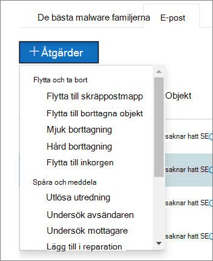

# Så här fungerar automatisk undersökning och svar i Microsoft Defender för Office 365

[!INCLUDE [Microsoft 365 Defender rebranding](../includes/microsoft-defender-for-office.md)]

**Gäller för**
- [Microsoft Defender för Office 365 abonnemang 2](defender-for-office-365.md)
- [Microsoft 365 Defender](../defender/microsoft-365-defender.md)

När säkerhetsvarningar utlöses är det upp till ditt säkerhetsteam att titta på varningarna och vidta åtgärder för att skydda din organisation. Ibland kan säkerhetsåtgärder som grupper känner sig överhopade av mängden aviseringar som utlöses. Funktioner för automatisk undersökning och svar (AIR) i Microsoft Defender för Office 365 kan vara till hjälp.

AIR gör att ditt säkerhetsteam kan samarbeta mer effektivt. AIR-funktioner omfattar automatiserade undersökningsprocesser som svar på välkända hot som finns idag. Lämpliga åtgärdsåtgärder väntar på godkännande, vilket gör det möjligt för teamet med säkerhetsåtgärder att svara på identifierade hot.

I den här artikeln beskrivs hur AIR fungerar genom flera exempel. När du är redo att börja använda AIR kan du gå [till Undersök och svara på hot automatiskt.](office-365-air.md)

- [Exempel 1: Ett användarrapporterat phish-meddelande startar en undersöknings spelbok](#example-a-user-reported-phish-message-launches-an-investigation-playbook)
- [Exempel 2: En säkerhetsadministratör utlöser en undersökning från Threat Explorer](#example-a-security-administrator-triggers-an-investigation-from-threat-explorer)
- [Exempel 3: Ett säkerhetsoperationsteam integrerar AIR med sin SIEM Office 365 Api för hanteringsaktivitet](#example-a-security-operations-team-integrates-air-with-their-siem-using-the-office-365-management-activity-api)

## Exempel: Ett användarrapporterat phish-meddelande startar en undersökningsspelbok

Anta att en användare i organisationen får ett e-postmeddelande som de tror är ett försök till nätfiske. Användaren, som har utbildning för  att rapportera sådana meddelanden, använder tillägget Rapportmeddelande eller tillägget Rapport nätfiske för att skicka det till Microsoft för analys.  In submission is also sent to your system and is visible in Explorer in the **Submissions** view (formerly referred to the **User-reported** view). Dessutom utlöser det användarrapporterade meddelandet nu en systembaserad informationsvarning, som automatiskt startar rättboken för undersökningen.

Under rotundersökningsfasen bedöms olika aspekter av e-postmeddelandet. Detta kan till exempel vara:

- En avgörandehet om vilken typ av hot det kan vara;
- Vem har skickat det;
- Vart e-postmeddelandet skickades från (skickar infrastruktur).
- Om andra förekomster av e-postmeddelandet har levererats eller blockerats.
- En bedömning från våra analytiker;
- Om e-postmeddelandet är kopplat till kända kampanjer;
- med mera.

När rotundersökningen är klar innehåller spelboken en lista med rekommenderade åtgärder för det ursprungliga e-postmeddelandet och de enheter som är kopplade till den.

Sedan utförs flera undersökningssteg för hot och omsening:

- Liknande e-postmeddelanden identifieras med hjälp av sökningar i e-postkluster.
- Signalen delas med andra plattformar, till exempel [Microsoft Defender för Endpoint.](/windows/security/threat-protection/microsoft-defender-atp/microsoft-defender-advanced-threat-protection)
- En fast bedömning görs om några användare har klickat genom skadliga länkar i misstänkta e-postmeddelanden.
- En kontroll utförs i alla Exchange Online Protection ([EOP)](exchange-online-protection-overview.md)och ([Microsoft Defender](defender-for-office-365.md)för Office 365 ) för att se om det finns andra liknande meddelanden som rapporterats av användare.
- En kontroll utförs för att se om en användare har komprometterats. Den här kontrollen utnyttjar signaler Office 365, [Microsoft Cloud App Security](/cloud-app-security)och [Azure Active Directory](/azure/active-directory), vilket korrelerar relaterade användaraktivitetsaktiviteter.

Under licensfasen tilldelas olika risker och hot till olika stegen i det här steget.

Åtgärd är den sista fasen i spelboken. Under den här fasen vidtas åtgärder baserat på undersöknings- och licensfaserna.

## Exempel: En säkerhetsadministratör utlöser en undersökning från Threat Explorer

Förutom automatiserade undersökningar som utlöses av en varning kan organisationens säkerhetsoperationer också utlösa en automatiserad undersökning från en vy i [Hotutforskaren.](threat-explorer.md)  Den här undersökningen skapar också en varning, så att Microsoft Defender-incidenter och externa SIEM-verktyg kan se att undersökningen har utlösts.

Anta till exempel att du använder vyn Skadlig **programvara** i Utforskaren. Med hjälp av flikarna under diagrammet väljer du fliken **E-post.** Om du markerar ett eller flera objekt i listan aktiveras knappen **+** Åtgärder.

Med hjälp **av menyn** Åtgärder kan du välja **Utlösarundersökning**.

I likhet med spelböcker som utlöses av en varning inkluderar automatiska undersökningar som utlösts från en vy i Utforskaren en rotundersökning, åtgärder för att identifiera och korrelera hot och rekommenderade åtgärder för att minimera dessa hot.

## Exempel: Ett team för säkerhetsåtgärder integrerar AIR med sin SIEM Office 365 Api för hanteringsaktivitet

AIR-funktionerna i Microsoft Defender för Office 365 innehåller rapporter [& information](air-view-investigation-results.md) som säkerhetsgrupper kan använda för att övervaka och hantera hot. Men du kan också integrera AIR-funktioner med andra lösningar. Några exempel är ett säkerhetsinformations- och händelsehanteringssystem (SIEM), ett ärendehanteringssystem eller en anpassad rapporteringslösning. Den här typen av integrationer kan göras med hjälp Office 365 API för [hanteringsaktivitet.](/office/office-365-management-api/office-365-management-activity-api-reference)

Exempelvis har en organisation nyligen ställt in ett sätt för sitt säkerhetsteam att visa användarrapporterade phish-aviseringar som redan bearbetats av AIR. Lösningen integrerar relevanta varningar med organisationens SIEM-server och deras case-management system. Lösningen minskar kraftigt antalet falska positiva försök, så att deras säkerhetsoperationer kan fokusera på deras tid och arbete på verkliga hot. Mer information om den här anpassade lösningen finns i Tech Community-bloggen: Öka effektiviteten i ditt SOC med Microsoft Defender för Office 365 och [O365 Management API.](https://techcommunity.microsoft.com/t5/microsoft-security-and/improve-the-effectiveness-of-your-soc-with-office-365-atp-and/ba-p/1525185)

## Nästa steg

- [Komma igång med AIR](office-365-air.md)
- [Visa väntande eller slutförda åtgärdsåtgärder](air-review-approve-pending-completed-actions.md)