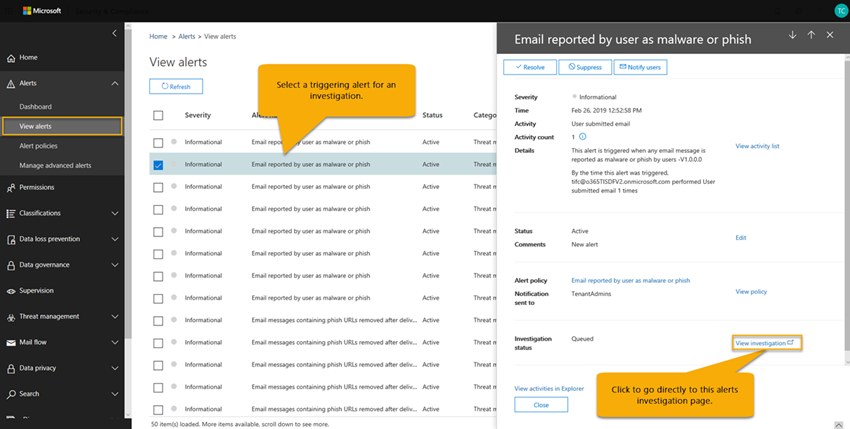

# En översikt över automatiserad undersökning och svar (AIR) i Microsoft Defender för Office 365An overview of automated investigation and response (AIR) in Microsoft Defender for Office 365

[!INCLUDE [Microsoft 365 Defender rebranding](../includes/microsoft-defender-for-office.md)]

När säkerhets varningar utlöses är det upp till din säkerhets åtgärds grupp för att titta på dessa meddelanden och vidta åtgärder för att skydda din organisation.As security alerts are triggered, it's up to your security operations team to look into those alerts and take steps to protect your organization. Ibland kan säkerhets Operations teamen bli försäkrade av volymen av de larm som utlöses.Sometimes, security operations teams can feel overwhelmed by the volume of alerts that are triggered. Automatiserade undersökningar och svar (AIR) i Microsoft Defender för Office 365 kan hjälpa dig.Automated investigation and response (AIR) capabilities in Microsoft Defender for Office 365 can help. 

AIR gör det möjligt för din säkerhets plan att fungera mer effektivt och effektivt.AIR enables your security operations team to operate more efficiently and effectively. FLYGTRAFIK funktioner inkluderar automatiserade undersökningar som svar på välkända hot som existerar idag.AIR capabilities include automated investigation processes in response to well-known threats that exist today. Lämpliga reparations åtgärder väntar på godkännande och gör det möjligt för ditt säkerhets arbete att reagera på identifierade hot.Appropriate remediation actions await approval, enabling your security operations team to respond to detected threats. 

Den här artikeln innehåller en översikt över luft.This article provides an overview of AIR. När du är redo att komma igång med AIR läser du [automatiskt och svarar på hot](office-365-air.md).When you're ready to get started using AIR, see [Automatically investigate and respond to threats](office-365-air.md).

## På en hög nivåAt a high level

När notifieringar utlöses blir säkerhets playbooks träder i kraft.As alerts are triggered, security playbooks go into effect. Beroende på situationen kan en [automatiserad undersöknings process](https://docs.microsoft.com/microsoft-365/security/office-365-security/office-365-air) påbörjas.Depending on the situation, an [automated investigation process](https://docs.microsoft.com/microsoft-365/security/office-365-security/office-365-air) can begin. Under och efter en automatisk undersökning rekommenderas [reparations åtgärder](air-remediation-actions.md) .During and after an automated investigation, [remediation actions](air-remediation-actions.md) are recommended. Inga åtgärder vidtas automatiskt i Microsoft Defender för Office 365.No actions are taken automatically in Microsoft Defender for Office 365. Din säkerhets Operations team granskar och [godkänner eller avvisar varje åtgärd](air-review-approve-pending-completed-actions.md)för att åtgärda.Your security operations team reviews, and then [approves or rejects each remediation action](air-review-approve-pending-completed-actions.md). När alla åtgärder som följer med undersökningen har godkänts eller avvisats slutförs undersökningen.When all of the actions following an investigation are approved or rejected, the investigation completes. Alla de här aktiviteterna spåras och visas i Microsoft 365 säkerhets Center ( [https://security.microsoft.com](https://security.microsoft.com) ).All of these activities are tracked and viewable in the Microsoft 365 security center ([https://security.microsoft.com](https://security.microsoft.com)). (Mer information finns i [Visa information om en undersökning](air-view-investigation-results.md#view-details-of-an-investigation)).(To learn more, see [View details of an investigation](air-view-investigation-results.md#view-details-of-an-investigation)).

I följande avsnitt finns mer information om aviseringar, säkerhets playbooks och flyg exempel.The following sections provide more details about alerts, security playbooks, and examples of AIR in action.

## VarningarAlerts

[Aviseringar](../../compliance/alert-policies.md#viewing-alerts) representerar utlösare för säkerhets åtgärds team arbets flöden för samtals svar.[Alerts](../../compliance/alert-policies.md#viewing-alerts) represent triggers for security operations team workflows for incident response. Prioritera de rätta uppsättningarna med aviseringar och kontrol lera att inga hot är avadresserade är utmanande.Prioritizing the right set of alerts for investigation, while making sure no threats are unaddressed is challenging. När undersökningar av notifieringar utförs manuellt måste säkerhets åtgärds teamerna nå och korrelera enheter (till exempel innehåll, enheter och användare) till risk för hot.When investigations into alerts are performed manually, security operations teams must hunt and correlate entities (such as content, devices and users) at risk from threats. Sådana uppgifter och arbets flöden kan vara mycket tidsödande och involvera flera verktyg och system.Such tasks and workflows can be very time consuming and involve multiple tools and systems. Med luft, undersökning och svar för säkerhets händelser automatiseras genom att viktiga säkerhets-och Threat Management Alerts playbooks automatiskt.With AIR, investigation and response for security events are automated by having key security and threat management alerts trigger security response playbooks automatically. 

För närvarande är det automatiskt undersökta notifieringar som genereras från följande typer av larm principer:Currently for AIR, alerts generated from the following kinds of alert policies are auto-investigated:  

- En potentiellt skadlig URL-adress klickning upptäcktesA potentially malicious URL click was detected
- E-post som rapporter ATS av användaren som Phish`*`Email reported by user as phish`*`
- E-postmeddelanden som innehåller skadlig kod tas bort efter leverans`*`Email messages containing malware removed after delivery`*`
- E-postmeddelanden som innehåller Phish-URL: er tas bort efter leverans`*`Email messages containing phish URLs removed after delivery`*`
- Misstänkta e-postskickade mönsterSuspicious email sending patterns detected
- Användare begränsad från att skicka e-postUser restricted from sending email
- Administratören utlöste den manuella undersökningen av e-post`*`Admin triggered manual investigation of email`*`

> [!NOTE]
> Aviseringarna som är markerade med en asterisk ( `*` ) har tilldelats en allvarlighets grad för *information* i respektive aviserings princip i säkerhets center för Microsoft 365, med e-postaviseringar inaktiverade.The alerts marked with an asterisk (`*`) are assigned an *Informational* severity in the respective alert policies within the Microsoft 365 security center, with email notifications turned off. E-postaviseringar kan aktive ras genom [konfigurering av aviserings principer](../../compliance/alert-policies.md#alert-policy-settings).Email notifications can be turned on through [Alert policy configuration](../../compliance/alert-policies.md#alert-policy-settings). 

Om du vill visa aviseringar väljer du **varningar**i avsnittet säkerhet & efterlevnad  >  **View alerts**.To view alerts, in the Security & Compliance Center, choose **Alerts** > **View alerts**. Välj en avisering om du vill visa dess uppgifter och därifrån kan du använda länken **Visa undersökning** för att gå till motsvarande [undersökning](air-view-investigation-results.md#investigation-graph).Select an alert to view its details, and from there, use the **View investigation** link to go to the corresponding [investigation](air-view-investigation-results.md#investigation-graph).  

> [!NOTE]
> Informations varningar döljs som standard i vyn avisering.Informational alerts are hidden in the alert view by default. För att se dem kan du ändra varnings filtreringen så att den innehåller informations aviseringar.To see them, change the alert filtering to include informational alerts.

Om din organisation hanterar dina säkerhets varningar via ett system för aviserings hantering, tjänst hanterings system eller SIEM (Security information and Event Management) kan du skicka aviseringar till det systemet via ett e-postmeddelande eller via [API för hanterings aktivitet i Office 365](https://docs.microsoft.com/office/office-365-management-api/office-365-management-activity-api-reference).If your organization manages your security alerts through an alert management system, service management system, or Security Information and Event Management (SIEM) system, you can send alerts to that system via either email notification or via the [Office 365 Management Activity API](https://docs.microsoft.com/office/office-365-management-api/office-365-management-activity-api-reference). Undersöknings aviseringar via e-post eller API innehåller länkar för åtkomst till aviseringarna i säkerhets Center för Microsoft 365, vilket gör att den tilldelade säkerhets administratören snabbt kan navigera till undersökningen.The investigation alert notifications via email or API include links to access the alerts in the Microsoft 365 security center, enabling the assigned security administrator to navigate quickly to the investigation.

 

## Säkerhets playbooksSecurity playbooks

Säkerhets playbooks är backend-principer som är baserade på automatisering i Microsoft Defender för Office 365 och Microsoft Threat Protection.Security playbooks are back-end policies that are at the heart of automation in Microsoft Defender for Office 365 and Microsoft Threat Protection. De säkerhets playbooks som tillhandahålls i AIR är baserade på vanliga scenarier för verklig säkerhet och utvecklad utifrån feedback från team för säkerhets åtgärder.The security playbooks provided in AIR are based on common real-world security scenarios and developed based on feedback from security operations teams. En säkerhets Playbook startas automatiskt när specifika aviseringar utlöses inom din organisation.A security playbook is launched automatically when specific alerts are triggered within your organization. När notifieringen utlöses körs den associerade Playbook av den automatiska undersöknings-och svars systemet.Once the alert triggers, the associated playbook is run by the automated investigation and response system. Undersöknings stegen genom analys av aviseringen baserat på den specifika aviseringens Playbook, som visar alla associerade metadata (inklusive e-postmeddelanden, användare, ämnen, avsändare osv.).The investigation steps through analysis of the alert based on that particular alert's playbook, looking at all the associated metadata (including email messages, users, subjects, senders, etc.). På grund av undersökningen playbooks resultat rekommenderar AIR en uppsättning åtgärder som organisationens säkerhets team kan vidta för att kontrol lera och minska hotet.Based on the investigation playbook's findings, AIR recommends a set of actions that your organization's security team can take to control and mitigate the threat. 

Playbooks som du får med flyg är avsedda att klara de hot som organisationer drabbar idag med e-post.The security playbooks you'll get with AIR are designed to tackle the most frequent threats that organizations encounter today with email. De baseras på inmatningar från säkerhets åtgärder och arbets grupps svar, inklusive personer som kan försvara Microsoft och våra kunders till gångar.They're based on input from security operations and incident response teams, including people who help defend Microsoft and our customers' assets.

- Rapporterat Phish meddelandeUser-reported phish message
- URL-Klicka på Verdict ändraURL-click verdict change
- Skadlig kod identifierad efter leverans (malware, ZAP)Malware detected post-delivery (Malware ZAP)
- Phish upptäckte att det är en PhishPhish detected post-delivery ZAP (Phish ZAP)
- Användare som rapporter ATS som kompromissadUser reported as compromised 
- Manuell e-postundersökning (utlöst av administratören från Utforskaren, Phish eller alla e-postvyer)Manual email investigation (triggered by administrator from Explorer Malware, Phish, or All Email view)

Fler playbooks-och Playbook-uppdateringar kommer att publiceras när de har slutförts.More playbooks and playbook updates will be released as they are completed. Besök [Microsoft 365-översikten](https://www.microsoft.com/microsoft-365/roadmap) för att se vad mer som är planerat och kommer snart.Visit the [Microsoft 365 Roadmap](https://www.microsoft.com/microsoft-365/roadmap) to see what else is planned and coming soon.

### Playbooks innehåller undersökningar och rekommendationerPlaybooks include investigation and recommendations

I luft inkluderar varje säkerhets Playbook:In AIR, each security playbook includes: 

- en rot undersökning av ett e-postmeddelandes enheter (till exempel filer, URL: er, mottagare, IP-adresser och mer).a root investigation of an email's entities (such as files, URLs, recipients, IP addresses, and more),
- ytterligare jakt efter liknande e-postmeddelanden som tas emot av organisationenfurther hunting for similar emails received by the organization 
- steg som vidtogs för att identifiera och korrelera andra potentiella hot.steps taken to identify and correlate other potential threats, and 
- rekommenderade hot åtgärds åtgärder.recommended threat remediation actions.

Varje steg i hög nivå innehåller ett antal under steg som utförs för att ge ett djupgående, detaljerat och komplett svar på hot.Each high-level step includes a number of substeps that are executed to provide a deep, detailed, and exhaustive response to threats.

## Exempel: ett användardefinierat Phish meddelande öppnar en undersökning PlaybookExample: A user-reported phish message launches an investigation playbook

Anta att en användare i din organisation får ett e-postmeddelande om att de tycker är ett nät fiske försök.Suppose that a user in your organization receives an email that they think is a phishing attempt. Användaren, utbildad att rapportera sådana meddelanden, använder [tillägget rapport meddelande](enable-the-report-message-add-in.md) för att skicka det till Microsoft för analys.The user, trained to report such messages, uses the [Report Message add-in](enable-the-report-message-add-in.md) to send it to Microsoft for analysis. Överföringen skickas också till ditt system och visas i Utforskaren i vyn för **skickade** samtal (kallades tidigare vyn **användare-rapporterad** ).The submission is also sent to your system and is visible in Explorer in the **Submissions** view (formerly referred to as the **User-reported** view). Dessutom utlöser det användardefinierade meddelandet en systembaserad informations avisering, som automatiskt startar undersökningen Playbook.In addition, the user-reported message now triggers a system-based informational alert, which automatically launches the investigation playbook.

Under den här fasen av rot undersökningen bedöms olika delar av e-postmeddelandet.During the root investigation phase, various aspects of the email are assessed. De här aspekterna inkluderar:These aspects include:

- En analys av vilken typ av hotet det är.A determination about what type of threat it might be;
- Vem skickade det;Who sent it;
- Varifrån e-postmeddelandet skickades (med infrastruktur);Where the email was sent from (sending infrastructure);
- Om andra instanser av e-postmeddelandet levererades eller blockerades;Whether other instances of the email were delivered or blocked;
- En utvärdering från våra analytiker;An assessment from our analysts;
- Om e-postmeddelandet är kopplat till alla kända kampanjer;Whether the email is associated with any known campaigns;
- och mycket annat.and more.

När du har slutfört rot undersökningen tillhandahåller Playbook en lista över rekommenderade åtgärder att vidta på den ursprungliga e-postmeddelandet och de enheter som är kopplade till den.After the root investigation is complete, the playbook provides a list of recommended actions to take on the original email and entities associated with it.
  
Nu utförs flera hot undersökningar och jakt steg:Next, several threat investigation and hunting steps are executed:

- Likartade e-postmeddelanden identifieras via e-postklusters ökning.Similar email messages are identified via email cluster searches.
- Signalen delas med andra plattformar, till exempel [Microsoft Defender för slut punkten](https://docs.microsoft.com/windows/security/threat-protection/microsoft-defender-atp/microsoft-defender-advanced-threat-protection).The signal is shared with other platforms, such as [Microsoft Defender for Endpoint](https://docs.microsoft.com/windows/security/threat-protection/microsoft-defender-atp/microsoft-defender-advanced-threat-protection).
- En bestämning görs på om en användare har klickat på några illasinnade länkar i misstänkta e-postmeddelanden.A determination is made on whether any users have clicked through any malicious links in suspicious email messages.
- En kontroll görs med Exchange Online Protection ([EOP](exchange-online-protection-overview.md)) och Office 365 Avancerat skydd ([ATP](office-365-atp.md)) för att se om det finns andra liknande meddelanden som rapporteras av användarna.A check is done across Exchange Online Protection ([EOP](exchange-online-protection-overview.md)) and Office 365 Advanced Threat Protection ([ATP](office-365-atp.md)) to see if there are any other similar messages reported by users.
- En kontroll görs för att se om en användare har fått ett problem.A check is done to see if a user has been compromised. Den här kontrollen används för att utnyttja signaler mellan Office 365, [Microsoft Cloud App-säkerhet](https://docs.microsoft.com/cloud-app-security)och [Azure Active Directory](https://docs.microsoft.com/azure/active-directory), som korrelerar relaterade användar aktiviteter.This check leverages signals across Office 365, [Microsoft Cloud App Security](https://docs.microsoft.com/cloud-app-security), and [Azure Active Directory](https://docs.microsoft.com/azure/active-directory), correlating any related user activity anomalies.

Under jakt fasen är riskerna och hot tilldelade till olika jakt steg.During the hunting phase, risks and threats are assigned to various hunting steps. 

Reparation är den sista fasen i Playbook.Remediation is the final phase of the playbook. Under den här fasen vidtas reparations steg, baserat på undersökningen och jakt faserna.During this phase, remediation steps are taken, based on the investigation and hunting phases. 

## Exempel: en säkerhets administratör utlöser en undersökning från Threat ExplorerExample: A security administrator triggers an investigation from Threat Explorer

Utöver automatiserade utredningar som löses genom en avisering kan organisationens säkerhets åtgärds team utlösa en automatiserad undersökning från en vy i [Threat Explorer](threat-explorer.md).In addition to automated investigations that are triggered by an alert, your organization's security operations team can trigger an automated investigation from a view in [Threat Explorer](threat-explorer.md).  Genom den här undersökningen skapas också en avisering, så att Microsoft Defender-tillbud och externa SIEM-verktyg kan se att den här undersökningen har utlösts.This investigation also creates an alert, so that Microsoft Defender Incidents and external SIEM tools can see that this investigation was triggered. 

Antag till exempel att du använder vyn **mot skadlig program vara** i Utforskaren.For example, suppose that you are using the **Malware** view in Explorer. Använd flikarna nedanför diagrammet och välj fliken **e-post** . Om du markerar ett eller flera objekt i listan aktive ras knappen **+-åtgärder** .Using the tabs below the chart, you select the **Email** tab. If you select one or more items in the list, the **+ Actions** button activates. 

Med menyn **åtgärder** kan du välja **Utlös ande undersökning**.Using the **Actions** menu, you can select **Trigger investigation**.

På liknande sätt som playbooks utlöst av en avisering, inkluderar automatiska utredningar som utlöses från en vy i Utforskaren en rot undersökning, steg för att identifiera och korrelera hot och rekommenderade åtgärder för att minska dessa hot.Similar to playbooks triggered by an alert, automatic investigations that are triggered from a view in Explorer include a root investigation, steps to identify and correlate threats, and recommended actions to mitigate those threats.

## Exempel: en säkerhets åtgärds grupp integrerar AIR med sina SIEM med hjälp av API för hanterings aktivitet i Office 365Example: A security operations team integrates AIR with their SIEM using the Office 365 Management Activity API

AIR-funktioner i Microsoft Defender för Office 365 innehåller [rapporter & information](air-view-investigation-results.md) som kan användas för att övervaka och adressera hot.AIR capabilities in Microsoft Defender for Office 365 include [reports & details](air-view-investigation-results.md) that security operations teams can use to monitor and address threats. Men du kan också integrera AIR-funktioner med andra lösningar.But you can also integrate AIR capabilities with other solutions. Exemplen innehåller ett system för säkerhets information och Event Management (SIEM), ett ärende hanterings system eller en anpassad rapporterings lösning.Examples include a security information and event management (SIEM) system, a case management system, or a custom reporting solution. Dessa integrerings typer kan du göra med hjälp av [API för hanterings aktivitet i Office 365](https://docs.microsoft.com/office/office-365-management-api/office-365-management-activity-api-reference).These kinds of integrations can be done by using the [Office 365 Management Activity API](https://docs.microsoft.com/office/office-365-management-api/office-365-management-activity-api-reference). 

Till exempel har en organisation ställt in ett sätt för sin säkerhets åtgärds grupp för att Visa rapporterade Phish-aviseringar som redan bearbetats av AIR.For example, recently, an organization set up a way for their security operations team to view user-reported phish alerts that were already processed by AIR. Sin lösning integrerar relevanta aviseringar med organisationens SIEM-Server och ärende hanterings system.Their solution integrates relevant alerts with the organization's SIEM server and their case-management system. Lösningen minskar mängden falsk identifiering så att deras säkerhets åtgärd kan fokusera sin tid och ansträngning för riktiga hot.The solution greatly reduces the number of false positives so that their security operations team can focus their time and effort on real threats. Om du vill veta mer om den här anpassade lösningen kan du läsa [teknisk community-blogg: förbättra effektiviteten hos din SOC med Office 365 ATP och O365 Management API](https://techcommunity.microsoft.com/t5/microsoft-security-and/improve-the-effectiveness-of-your-soc-with-office-365-atp-and/ba-p/1525185).To learn more about this custom solution, see [Tech Community blog: Improve the Effectiveness of your SOC with Office 365 ATP and the O365 Management API](https://techcommunity.microsoft.com/t5/microsoft-security-and/improve-the-effectiveness-of-your-soc-with-office-365-atp-and/ba-p/1525185).

## Nästa stegNext steps

- [Komma igång med luftGet started using AIR](office-365-air.md)

- [Besök Microsoft 365-översikten för att se vad som är planerat och att släppas snartVisit the Microsoft 365 Roadmap to see what's planned and releasing soon](https://www.microsoft.com/microsoft-365/roadmap?filters=)

- [Lär dig mer om automatisk granskning och svars funktioner i Microsoft 365 DefenderLearn about additional automated investigation and response capabilities in Microsoft 365 Defender](https://docs.microsoft.com/microsoft-365/security/mtp/mtp-autoir?view=o365-worldwide&preserve-view=true)
