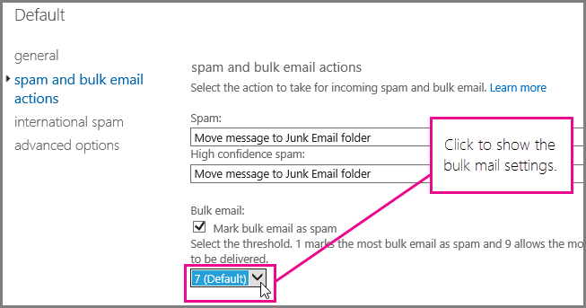

# <a name="customize-the-office-365-anti-spam-filter-with-these-settings"></a>Anpassa skräppostfiltret i Office 365 med följande inställningar

En administratör kan använda flera olika inställningar för skräppostfiltret i Office 365 för att förhindra att skräppost hamnar i användarnas inkorgar. Skräppostfiltret i Office 365 blockerar skräppost och förhindrar falskt negativa meddelanden mer effektivt om du använder alternativen som anges här. Falskt negativ innebär i det här sammanhanget skräppost som egentligen borde blockeras men som skickas till inkorgen ändå.

## <a name="block-ip-addresses-with-a-connection-filter"></a>Blockera IP-adresser med ett anslutningsfilter

Anpassa skräppostfiltret i Office 365 genom att lägga till avsändarens IP-adress i anslutningsfiltrets lista över blockerade IP-adresser:

1. Få meddelandehuvudena för de meddelanden du vill blockera i din e-postklient, till exempel Outlook eller Outlook på webben (kallades tidigare Outlook Web App), enligt beskrivningen i artikeln om att [visa huvuden i e-postmeddelanden i Outlook](https://support.office.com/article/cd039382-dc6e-4264-ac74-c048563d212c).

2. Sök efter IP-adressen som står efter CIP-taggen i huvudet för X-Forefront-Antispam-Report genom att använda [analysverktyget för meddelanderubrik](https://testconnectivity.microsoft.com/?tabid=mha) eller genom att söka manuellt.

3. Lägg till IP-adressen i listan över blockerade IP-adresser genom att följa stegen under ”Använda EAC för att redigera standardprincip för anslutningsfilter” i [Konfigurera principen för anslutningsfilter](configure-the-connection-filter-policy.md).

### <a name="block-bulk-mail-with-mail-flow-rules-transport-rules-or-the-spam-filter"></a>Blockera massutskick med e-postflödesregler (transportregler) eller skräppostfiltret

Består skräpposten främst av massutskick som nyhetsbrev och kampanjer? Du kan anpassa skräppostfiltret i Office 365 genom att [använda e-postflödesregler för att konfigurera filtrering av massutskick](use-transport-rules-to-configure-bulk-email-filtering.md) eller aktivera inställningen **massutskick** i skräppostfiltrets [avancerade filtreringsinställningar i Office 365](advanced-spam-filtering-asf-options.md). I administrationscentret för Exchange börjar du med att klicka på **Skydd** \> **Innehållsfilter**. Sedan dubbelklickar du på den filterprincip du vill justera. Klicka på **Åtgärder för skräppost och massutskick** för att justera inställningarna, som visas här.



### <a name="block-email-spam-using-spam-filter-block-lists"></a>Blockera skräppost med hjälp av blockeringslistor för skräppostfilter

[Konfigurera principer för skräppostskydd i Office 365](configure-your-spam-filter-policies.md) för att lägga till en avsändares adress i listan över blockerade avsändare eller en domän i listan över blockerade domäner i skräppostfiltret. E-postmeddelanden från avsändare eller domäner som finns med på en blockeringslista markeras som skräppost.

## <a name="email-users-can-also-help-ensure-that-false-negative-and-email-spam-is-blocked-with-office-365-spam-filter"></a>Användare kan även bidra till att falska negativa identifieringar och skräppost blockeras med skräppostfiltret i Office 365.

Ditt arbete med att förhindra falska negativa identifieringar och skräppost i Office 365 underlättas om du ber användarna att lägga till avsändarens adress i blockeringslistan för avsändare i [Outlook](https://support.office.com/article/5ae3ea8e-cf41-4fa0-b02a-3b96e21de089) eller [Outlook på webben](https://support.office.com/article/db786e79-54e2-40cc-904f-d89d57b7f41d). I Outlook på webben klickar du på **Inställningar** \> **Alternativ** \> **Blockera eller tillåt**. Sedan lägger du till adressen i listan med **blockerade avsändare**, enligt exemplet nedan.


> [!NOTE]
> Mer information om listor över betrodda avsändare finns i [Skapa listor över betrodda avsändare i Office 365](create-safe-sender-lists-in-office-365.md).

## <a name="eop-only-customers-set-up-directory-synchronization"></a>Kunder med endast EOP: konfigurera katalogsynkronisering

Du kan undvika falskt negativ skräppost om du synkroniserar användarinställningar med tjänsten via katalogsynkronisering för att säkerställa att de spärrade avsändarna respekteras. Mer information finns i ”Använd katalogsynkronisering för att hantera e-postanvändare” i Hantera e-postanvändare i EOP.

## <a name="eop-only-customers-who-are-not-using-directory-synchronization"></a>Kunder med endast EOP som inte använder katalogsynkronisering

EOP-tjänsten har utformats för att stöda användarens betrodda och spärrade avsändare, om informationen har delats med tjänsten. Om du är EOP-kund och använder Outlook, men inte har katalogsynkronisering som konfigurerats för att synkronisera dina användare till Office 365, kan du fortfarande stoppa meddelanden från att levereras till användarnas inkorgar med hjälp av spärrade avsändare. Du kan däremot behöva konfigurera vissa e-postflödesregler i Exchange i följande situationer:

- Om ett meddelande går igenom den vanliga skräppostfiltreringen via EOP och sedan levereras till en lokal Exchange-server, och EOP tilldelar skräppostbedömningen SCL 1-4 (inte skräppost). Då åsidosätter användarnas lokala lista med spärrade avsändare EOP-skräppostfiltrets bedömning och meddelandet levereras till mappen Skräppost.

- Om ett meddelande i EOP tilldelas SCL -1 genom en e-postflödesregel i Exchange eller på grund av att IP-adressen eller domänen finns på listan över tillåtna, sprids SCL till den lokala Exchange-servern med hjälp av kopplingar. I det här fallet tillämpas inte användarens lista med spärrade avsändare. Om du vill ändra på detta kan du skapa en lokal e-postflödesregel som anger SCL till 0. Det här gör att Outlook tillämpar användarnas lokala lista med spärrade avsändare.

### <a name="to-set-up-a-mail-flow-rule-to-stop-messages-from-being-delivered-to-your-users-inbox-by-using-the-blocked-senders-list"></a>Konfigurera en e-postflödesregel för att hindra att meddelanden hamnar i användarnas inkorgar med hjälp av listan med spärrade avsändare

1. Öppna Exchange Management Shell på servern lokalt. Mer information om hur du öppnar Shell i den lokala Exchange-organisationen finns i [Öppna Exchange Management Shell](https://docs.microsoft.com/powershell/exchange/exchange-server/open-the-exchange-management-shell).

2. Kör följande kommando för att dirigera innehållsfiltrerade skräppostmeddelanden till mappen Skräppost för att kunna uppdatera SCL för alla meddelanden som har markerats med SCL -1:

   ```powershell
   New-TransportRule "NameForRule" -HeaderContainsMessageHeader "X-Forefront-Antispam-Report" -HeaderContainsWords "SCL:-1" -SetSCL 0
   ```

   Eftersom SCL är 0 på den lokala Exchange-servern levereras icke-skräppost till användarnas inkorgar, men kan fortfarande med hjälp av användarnas lokala lista över spärrade avsändare skickas till skräppostmappen. Om du använder karantänen för skräppost i EOP kan avsändare som finns på användarens lista över betrodda avsändare ändå identifieras som skräppost och skickas till karantän. Om du använder skräppostmappen i den lokala postlådan kan däremot leverans ske till Inkorgen för betrodda avsändare.

> [!WARNING]
> Om du använder en e-postflödesregel för att ändra SCL-värdet till 0 (eller ett annat värde än -1), tillämpas alla skräppostalternativen i Outlook på meddelandet. Det innebär att spärrade och betrodda listor kommer att tillämpas, men också att meddelanden som inte har adresser som finns på listorna med spärrade eller betrodda avsändare potentiellt markeras som skräppost i filtreringsprocessen för skräppost på klientsidan. Om du vill att Outlook ska bearbeta listorna med spärrade och betrodda avsändare, men inte använda skräppostfiltret på klientsidan, måste du ställa in alternativet ”Ingen automatisk filtrering” i Outlooks skräppostalternativ. ”Ingen automatisk filtrering” är standardalternativet i de senaste versionerna av Outlook, men du bör kontrollera att inställningen är aktiverad för att säkerställa att klientsidans skräppostfilter inte tillämpas på meddelanden. Som administratör kan du inaktivera Outlooks skräppostfiltrering genom att följa anvisningarna i [Outlook: Principinställning för inaktivering av användargränssnitt och filtreringsmekanism för skräppost](https://support.microsoft.com/kb/2180568).

## <a name="see-also"></a>Se även

[Skydd mot skräppost för e-post i Office 365](anti-spam-protection.md)
