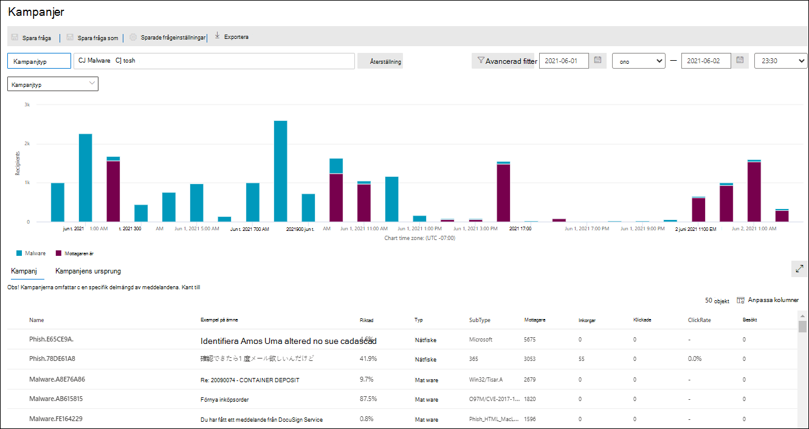

# Kampanjvyer i ATP

Kampanjvyer är en funktion i Advanced Threat Protection (ATP) i Security & Compliance Center som identifierar och kategoriserar nätfiskeattacker i tjänsten. Kampanjvyer kan hjälpa dig att:

- Undersök och reagera effektivt på nätfiskeattacker.

- Bättre förstå omfattningen av attacken.

- Visa värde för beslutsfattare.

Med kampanjvyer kan du se helheten av en attack snabbare och mer komplett än någon människa.

## Vad är en kampanj?

En kampanj är en samordnad e-postattack mot en eller flera organisationer. E-postattacker som stjäl referenser och företagsdata är en stor och lukrativ bransch. I takt med att tekniken ökar i ett försök att stoppa attacker ändrar angripare sina metoder i ett försök att säkerställa fortsatt framgång.

Microsoft utnyttjar de stora mängderna anti-phishing, anti-spam och anti-malware data över hela tjänsten för att identifiera kampanjer. Vi analyserar och klassificerar attackinformationen enligt flera faktorer. Till exempel:

- **Attack källa:** Källa IP-adresser och avsändare e-domäner.

- **Attack meddelandeegenskaper:** Innehållet, stil och ton i attackmeddelanden.

- **Attackmottagare:** Mottagardomäner, mottagarjobbsfunktioner (administratörer, chefer osv.), företagstyper (stora, små, offentliga, privata osv.) och branscher.

- **Attack nyttolast:** Skadliga länkar, bilagor eller andra nyttolaster i attackmeddelanden.

En kampanj kan vara kortlivad eller sträcka sig över flera dagar, veckor eller månader med aktiva och inaktiva perioder. En kampanj kan startas mot din specifika organisation, eller så kan din organisation vara en del av en större kampanj för flera företag.

## Kampanjvyer security & Compliance Center

Kampanjvyer är tillgängliga i [Security & Compliance Center](https://protection.office.com) vid **hothanteringskampanjer** \> **Campaigns**.

Du kan också komma åt kampanjvyn från:

- **Threat management** \> **Explorer** \> **Explorer-kampanjer för** \> **Campaigns** hothantering

- Explorer **Explorer** \> **View** Visa \> alla **e-postmeddelanden** \> **för** **hothantering** \>

> [!TIP]
> Om du inte ser några kampanjdata kan du prova att ändra datumintervallet.

Översiktssidan visar följande information om kampanjen:

- **Namn**

- **Exempelämne**: Ämnesraden för ett av meddelandena i kampanjen. Observera att alla meddelanden i kampanjen inte nödvändigtvis har samma ämne.

- **Typ:** För närvarande är detta värde alltid **Phish**.

- **Undertyp:** Om tillgängligt, det varumärke som phished av denna kampanj. När identifieringen drivs av **ATP-teknik** läggs prefixet ATP till undertypsvärdet.

- **Mottagare**: Antalet användare som har utsatts för den här kampanjen.

- **Inkorg**: Antalet användare som har fått meddelanden från den här kampanjen i inkorgen (inte levererat till Skräppost).

- **Klickad :** Antalet användare som klickade på webbadressen i nätfiskemeddelandet.

- **Klicka på Betyg:** Procentsatsen som beräknas av "**Klickad** / **inkorg**". Det här värdet är en indikator på kampanjens effektivitet och om mottagarna kunde identifiera meddelandet som nätfiske och undvika att klicka på nyttolast-url:en.

- **Besökt:** Hur många användare som faktiskt gjorde det genom att nyttolasten webbplats. Om det finns klickade värden, men säkra länkar **blockeras** åtkomst till webbplatsen, kommer detta värde att vara noll.

När du klickar på namnet på en kampanj visas kampanjinformationen i ett utfällbart utfällbart.

## Information om kampanj

I vyn Kampanjinformation finns mycket information om kampanjen:

- Kampanjinformation:

  - **ID**: Den unika kampanjidentifieraren.

  - **Startad** och **avslutad:** det datumintervallfilter som du har valt.

  - **Effekt**: Följande data för det datumintervallfilter du valde:
  
    - Det totala antalet mottagare.

    - Antalet meddelanden som var "Inkorgade" (det vill än levereras till Inkorgen, inte till Skräppost).

    - Hur många användare klickade på webbadressens nyttolast i nätfiskemeddelandet.

    - Howe många användare besökte webbadressen.

  - En tidslinje för kampanjaktivitet: När kampanjen startades och avslutades och volymen av meddelanden över tid.

### Kampanjflöde

Viktiga detaljer om kampanjen presenteras i ett horisontellt flödesdiagram (ett _sankey-diagram)_ i avsnittet **Flöde.** Dessa uppgifter hjälper dig att förstå delarna av kampanjen och den potentiella effekten i din organisation.

Om du hovrar över ett vågrätt band i diagrammet visas antalet relaterade meddelanden (till exempel meddelanden från en viss käll-IP, meddelanden från käll-IP med den angivna avsändardomänen osv.).

Diagrammet innehåller följande information:

- **Avsändare-IPs**

- **Avsändaredomäner**

- **Filtrera domar:** Värdena här är relaterade till tillgängliga phishing och spam filtrering domar som beskrivs i [Anti-spam meddelande rubriker](anti-spam-message-headers.md). De tillgängliga värdena beskrivs i följande tabell:

  |Value|Spam filter dom|Beskrivning|
  |:-----|:-----|:-----|
  | **Tillåtet**|`SFV:SKN`    `SFV:SKI`|Meddelandet markerades som inte skräppost och/eller överhoppade filtrering innan det utvärderades av skräppostfiltrering (till exempel av en regel för e-postflöde, även känd som en transportregel).  Meddelandet hoppade över skräppostfiltrering av andra skäl (till exempel verkar avsändaren och mottagaren befinna sig i samma organisation).|
  |**Blockerade**|`SFV:SKS`|Meddelandet markerades som skräppost innan det utvärderades av skräppostfiltrering (till exempel av en regel för e-postflöde).|
  |**Upptäckt**|`SFV:SPM`|Meddelandet markerades som skräppost av skräppostfiltret.|
  |**Har inte identifierats**|`SFV:NSPM`|Meddelandet markerades som inte skräppost genom skräppostfiltrering.|
  |**Släppt**|`SFV:SKQ`|Meddelandet hoppade över skräppostfiltrering eftersom det släpptes från karantänen.|
  |**Klient tillåt**\*|`SFV:SKA`|Meddelandet hoppade över skräppostfiltrering på grund av policyinställningar för skräppost (till exempel var avsändaren med i listan över tillåtna avsändare eller tillåtna domänlistan).|
  |**Hyresgästblock**\*\*|`SFV:SKA`|Meddelandet blockerades av skräppostfiltrering på grund av policyinställningar mot skräppost (till exempel var avsändaren i listan över tillåtna avsändare eller tillåtna domänlistan).|
  |**Tillåt användare**\*|`SFV:SFE`|Meddelandet hoppade över skräppostfiltrering eftersom avsändaren fanns i en användares lista över betrodda avsändare i Outlook.|
  |**Användarblock**\*\*|`SFV:BLK`|Meddelandet blockerades av skräppostfiltrering eftersom avsändaren fanns i en användares lista blockerade avsändare i Outlook.|
  |**Zap**|n/a|[Zero-hour auto purge (ZAP)](zero-hour-auto-purge.md) vidtog åtgärder på det levererade meddelandet enligt dina anti-spam-principinställningar (flyttade till mappen Skräppost eller karantän).|

  \*Granska dina policyer mot skräppost, eftersom det tillåtna meddelandet sannolikt skulle ha blockerats av tjänsten.

  \*\*Granska dina policyer mot skräppost, eftersom dessa meddelanden ska sättas i karantän, inte levereras.

- **Leveransplatser**: Du vill förmodligen undersöka meddelanden som faktiskt levererades till mottagare (antingen till inkorgen eller mappen Skräppost), även om användarna inte klickade på nyttolast-URL:en i meddelandet. Du kan också ta bort meddelandena i karantän från karantänen. Mer information finns [i Karantänmeddelanden i Office 365](quarantine-email-messages.md).

  - **Borttagen mapp**

  - **Tappade**

  - **Externt**: Mottagaren finns i din lokala e-postorganisation.

  - **Misslyckades**

  - **Vidarebefordras**

  - **Inkorg**

  - **Skräppostmapp**

  - **Karantän**

  - **Okänd**

> [!NOTE]
> I alla lager som innehåller fler än 10 objekt visas de 10 översta objekten, medan resten buntas ihop i **Andra**.

#### URL-klick

När ett nätfiskemeddelande levereras till en mottagare (till inkorgen eller mappen Skräppost) finns det alltid en chans att användaren klickar på nyttolastadressen. Att inte klicka på webbadressen i ett levererat meddelande är ett litet mått på framgång, men du måste ta reda på varför nätfiskemeddelandet levererades till deras postlåda från början.

Om en användare klickade på nyttolast-URL:en i nätfiskemeddelandet visas åtgärderna i området **URL-klick** i diagrammet i kampanjinformationsvyn.

- **Tillåtet**

- **BlockPage**: Mottagaren klickade på nyttolast-URL:en, men deras åtkomst till den skadliga webbplatsen blockerades av [ATP Safe Links-principerna](atp-safe-links.md) i organisationen.

- **BlockPageOverride**: Mottagaren klickade på nyttolastens URL i meddelandet, ATP Safe Links försökte stoppa dem, men de fick åsidosätta blocket. Du måste undersöka dina principer för [säkra länkar](set-up-atp-safe-links-policies.md) för att se varför användare tillåts åsidosätta domen om säkra länkar och fortsätta till den skadliga webbplatsen.

- **PendingDetonationPage**: ATP Säkra bilagor håller på att öppna nyttolast-URL:en i en virtuell datormiljö och se vad som händer.

- **VäntandeDetonationPageOverride**: Mottagaren tilläts åsidosätta detonationsprocessen för nyttolasten och öppna URL:en utan att vänta på resultatet.

### Flikar

Det finns flera flikar i vyn kampanjinformation som gör att du kan undersöka kampanjen ytterligare.

- **URL-klick**: Om användarna inte klickade på nyttolastadressen i nätfiskemeddelandet är det här avsnittet tomt. Om en användare kunde klicka på webbadressen fylls följande värden i:

  - **Användaren**\*

  - **Url**\*

  - **Klicka på Tid**

  - **Klicka på Åtgärd**

- **Avsändare-IPs**

  - **IP-adress för avsändare**\*

  - **Totalt antal**

  - **Antal inkorgar**

  - **Blockerat antal**

  - **SPF Godkänd:** Avsändaren autentiserades av [Avsändarens policyram (SPF)](how-office-365-uses-spf-to-prevent-spoofing.md). En avsändare som inte skickar SPF-validering anger att avsändaren inte autentiseras eller att meddelandet förfalskar en legitim avsändare.

- **Avsändare**

  - **Avsändare**: Det här är den faktiska avsändaradressen i kommandot SMTP MAIL FROM, vilket inte nödvändigtvis är den Från: e-postadress som användarna ser i sina e-postklienter.

  - **Totalt antal**

  - **Inkorg**

  - **Inte inkorg**

  - **DKIM-godkänd:** Avsändaren autentiserades av [DKIM (Domain Keys Identified Mail).](support-for-validation-of-dkim-signed-messages.md) En avsändare som inte klarar DKIM-validering anger att avsändaren inte autentiseras eller att meddelandet förfalskar en legitim avsändare.

  - **DMARC Godkänd:** Avsändaren autentiserades av [domänbaserad meddelandeautentisering, rapportering och konformance (DMARC)](use-dmarc-to-validate-email.md). En avsändare som inte klarar DMARC-validering anger att avsändaren inte autentiseras eller att meddelandet förfalskar en legitim avsändare.

- **Nyttolaster**

  - **Url**\*

  - **Totalt antal**

\*Om du klickar på det här värdet öppnas ett nytt utfällbart objekt som innehåller mer information om det angivna objektet (användare, URL osv.) ovanpå kampanjinformationsvyn. Om du vill återgå till kampanjinformationsvyn klickar du på **Klar** i det nya utfällbara resultatet.

### Knappar

Med knapparna i vyn kampanjinformation kan du använda kraften i Threat Explorer för att undersöka kampanjen ytterligare.

- **Utforska kampanj**: Öppnar en ny sökflik för Threat Explorer med värdet **Kampanj-ID** som sökfilter.

- **Utforska inkorgsmeddelanden:** Öppnar en ny sökflik för Hot Explorer med **kampanj-ID** och **leveransplats: Inkorgen** som sökfilter.
