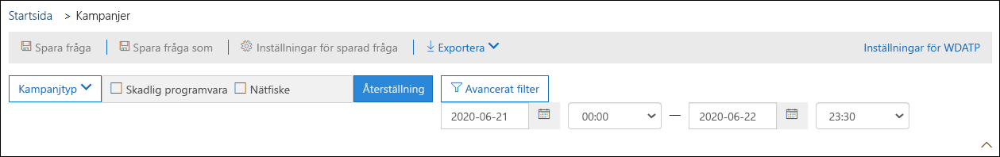
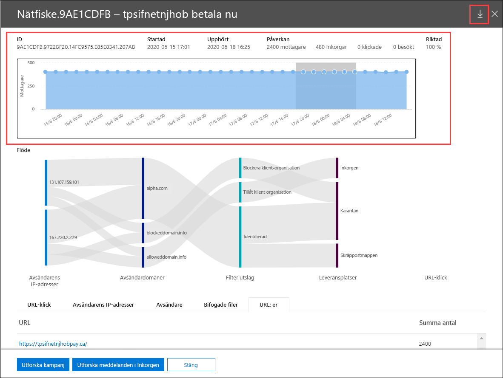

# Kampanjvyer i Microsoft Defender för Office 365

[!INCLUDE [Microsoft 365 Defender rebranding](../includes/microsoft-defender-for-office.md)]

**Gäller för**
- [Microsoft Defender för Office 365 abonnemang 2](defender-for-office-365.md)

Kampanjvyer är en funktion i Microsoft Defender för Office 365 abonnemang 2 (till exempel Microsoft 365 E5 eller organisationer med tillägget Defender Office 365 abonnemang 2). Kampanjvyer i Microsoft 365 Defender-portalen identifierar och kategoriserar nätfiskeattacker i tjänsten. Kampanjvyer kan hjälpa dig att:

- Undersök effektivt och svara på nätfiskeattacker.
- Bättre förståelse för attackens omfattning.
- Visa värde för beslutsfattare.

I kampanjvyer kan du se en helhetsbild av en attack snabbare och mer fullständig än en person.

## Vad är en kampanj?

En kampanj är en koordinerad e-postattack mot en eller flera organisationer. E-postattacker som stjäl autentiseringsuppgifter och företagsdata är en stor och lucrativ bransch. När tekniken ökar i ett försök att stoppa attacker, ändrar attacker deras metoder i ett försök att säkerställa fortsatt framgång.

Microsoft använder sig av de omfattande mängder information om skydd mot nätfiske, skräppost och skadlig programvara som finns i hela tjänsten för att identifiera kampanjer. Vi analyserar och klassificerar attackinformationen utifrån flera faktorer. Till exempel:

- **Attackkälla:** Käll-IP-adresser och avsändardomäner.
- **Meddelandeegenskaper:** Meddelandens innehåll, format och ton.
- **Meddelandemottagare:** Hur mottagare är relaterade. Till exempel mottagardomäner, funktioner för mottagarjobb (administratörer, chefer osv.), företagstyper (stora, små, offentliga, privata osv.) och branscher.
- **Attack av nyttolast:** Skadliga länkar, bifogade filer eller andra nyttolaster i meddelandena.

En kampanj kan vara kortlivad eller kan omfatta flera dagar, veckor eller månader med aktiva och inaktiva perioder. En kampanj kan startas mot din specifika organisation eller din organisation kan vara en del av en större kampanj i flera företag.

## Kampanjvyer i Microsoft 365 Defender-portalen

Kampanjvyer finns i Microsoft 365 Defender-portalen <https://security.microsoft.com> () **i e-& om** \> samarbetskampanjer eller direkt på <https://security.microsoft.com/campaigns> .

Du kan också komma åt kampanjvyer från:

- **Skicka e& och samarbete** \> **Utforskaren** \> **Visa** \> **Kampanjer**
- **Skicka e& och samarbete** \> **Utforskaren** \> **Visa** \> **All e-post** \> **Fliken** Kampanj
- **Skicka e& och samarbete** \> **Utforskaren** \> **Visa** \> **Phish** \> **Fliken** Kampanj
- **Skicka e& och samarbete** \> **Utforskaren** \> **Visa** \> **Skadlig programvara** \> **Fliken** Kampanj

För att komma åt kampanjvyer måste du vara medlem  i rollgrupperna Organisationshantering, Säkerhetsadministratör eller Säkerhetsläsare i Microsoft 365 Defender-portalen. Mer information finns i [Behörigheter i Microsoft 365 Defender-portalen.](permissions-microsoft-365-security-center.md)

## Översikt över kampanjer

På översiktssidan finns information om alla kampanjer.

På **standardfliken** Kampanj visar **området Kampanjtyp** ett stapeldiagram som visar antalet mottagare per dag. Som standard visas både **Phish- och Malware-data** **i** diagrammet.

> [!TIP]
> Om du inte ser några kampanjdata kan du prova att ändra datumintervallet eller [filtren](#filters-and-settings).

Tabellen under diagrammet på översiktssidan visar följande information på **fliken** Kampanj:

- **Namn**

- **Exempel på** ämne: Ämnesraden i ett av meddelandena i kampanjen. Observera att alla meddelanden i kampanjen inte nödvändigtvis har samma ämne.

- **Riktad**: Procentandelen som beräknas av: (antalet kampanjmottagare i organisationen) / (det totala antalet mottagare i kampanjen i alla organisationer i tjänsten). Det här värdet anger i vilken grad kampanjen endast dirigeras till din organisation (ett högre värde) jämfört med när den även riktar sig till andra organisationer i tjänsten (ett lägre värde).

- **Typ:** Det här värdet är **antingen phish** eller **skadlig kod.**

- **Undertyp:** Det här värdet innehåller mer information om kampanjen. Till exempel:
  - **Phish**: Där det finns ett märke som phished av den här kampanjen. Till exempel `Microsoft` , , eller `365` `Unknown` `Outlook` `DocuSign` .
  - **Skadlig** programvara: till exempel `HTML/PHISH` eller `HTML/<MalwareFamilyName>` .

  Om det finns tillgängligt är det märke som används av den här kampanjen. När identifieringen drivs av Defender för Office 365-teknik läggs prefixet **ATP-** till i undertypsvärdet.

- **Mottagare:** Antalet användare som har riktats av den här kampanjen.

- **Inkorg:** Antalet användare som har fått meddelanden från den här kampanjen i Inkorgen (levereras inte till mappen Skräppost).

- **Klickade:** Antalet användare som klickade på URL-adressen eller öppnade den bifogade filen i nätfiskemeddelandet.

- **Klicka på** ränta: Procentandelen som beräknas med "**Klickad**  /  **inkorg**". Det här värdet är en indikator på kampanjens effektivitet. Med andra ord, om mottagarna kunde identifiera meddelandet som nätfiske och om de inte klickade på webbadressen för nyttolasten.

  Observera att **Click rate inte** används i skadlig programvara.

- **Besökt:** Hur många användare som faktiskt tog sig fram till nyttolastwebbplatsen. Om det finns **klickade** värden, Valv men länkar blockerad åtkomst till webbplatsen, är det här värdet noll.

På **fliken Kampanjens** ursprung visas meddelandekällorna på en världskarta.

### Filter och inställningar

Längst upp på sidan **Kampanj finns** det flera filter- och frågeinställningar som hjälper dig att hitta och isolera specifika kampanjer.

Den mest grundläggande filtreringen du kan göra är startdatum/starttid och slutdatum/-tid.

Om du vill filtrera vyn ytterligare kan du göra  en egenskap med flera värden genom att klicka på knappen Kampanjtyp, göra ditt val och sedan klicka **på Uppdatera**.

De filtrerbara kampanjegenskaper som är tillgängliga **i** knappen Kampanjtyp beskrivs i följande lista:

- **Grundläggande:**
  - **Kampanjtyp:** Välj **Skadlig programvara** **eller Phish**. Om du avmarkerar markeringarna får du samma resultat som om du markerar båda.
  - **Kampanjnamn**
  - **Kampanjundertyp**
  - **Avsändare**
  - **Mottagare**
  - **Avsändningsdomän**
  - **Ämne**
  - **Filnamn på bifogad fil**
  - **Familj för skadlig programvara**
  - **Taggar:** Användare eller grupper som har tillämpat den angivna användartaggen (inklusive prioritetskonton). Mer information om användartaggar finns i [Användartaggar.](user-tags.md)
  - **Leveransåtgärd**
  - **Ytterligare åtgärd**
  - **Directionality**
  - **Identifieringsteknik**
  - **Ursprunglig leveransplats**
  - **Senaste leveransplats**
  - **System åsidosättningar**

- **Avancerat:**
  - **Internetmeddelande-ID:** Tillgängligt i **meddelande-ID-sidhuvudet** i meddelandehuvudet. Ett exempelvärde är `<08f1e0f6806a47b4ac103961109ae6ef@server.domain>` (observera vinkelparenteserna).
  - **Nätverksmeddelande-ID:** Ett GUID-värde som är tillgängligt i **huvudfältet X-MS-Exchange-Organization-Network-Message-Id** i meddelandehuvudet.
  - **Sender IP**
  - **SHA256** för bifogade filer: Om du vill hitta HASH-värdet för SHA256 för en fil i Windows kör du följande kommando i kommandotolken: `certutil.exe -hashfile "<Path>\<Filename>" SHA256` .
  - **Kluster-ID**
  - **Aviserings-ID**
  - **Aviseringsprincip-ID**
  - **Kampanj-ID**
  - **ZAP URL-signal**

- **URL:er:**
  - **URL-domän**
  - **URL-domän och sökväg**
  - **URL**
  - **URL-sökväg**
  - **Klicka på bedömning**

Om du vill använda mer avancerad filtrering, t.ex. filtrering efter flera egenskaper, kan du **skapa** en fråga genom att klicka på knappen Avancerat filter. Samma kampanjegenskaper är tillgängliga men med följande förbättringar:

- Du kan klicka på **Lägg till ett villkor** för att välja flera villkor.
- Du kan välja **operatorn Och** **eller** Eller mellan villkoren.
- Du kan välja **gruppobjektet Villkor** längst ned i villkorslistan om du vill skapa komplexa sammansatta villkor.

När du är klar klickar du på **knappen** Fråga.

När du har skapat ett grundläggande eller avancerat filter kan du spara det med hjälp **av Spara fråga** eller Spara fråga **som**. När du senare kommer tillbaka till sidan Kampanjer **kan** du läsa in ett sparat filter genom att klicka på **Sparade frågeinställningar.**

Om du vill exportera diagrammet eller listan med kampanjer klickar du på **Exportera** och väljer **Exportera diagramdata** eller **Exportera kampanjlista**.

Om du har en Microsoft Defender för slutpunkt-prenumeration kan du klicka på **MDE Inställningar** att ansluta till eller koppla bort kampanjerna med Microsoft Defender för Slutpunkt. Mer information finns i Artikeln [om att integrera Microsoft Defender för Office 365 med Microsoft Defender för slutpunkt.](integrate-office-365-ti-with-mde.md)

## Kampanjinformation

När du klickar på namnet på en kampanj visas kampanjinformationen i en utfällbladstext.

### Kampanjinformation

Högst upp i vyn med kampanjinformation finns följande kampanjinformation:

- **Kampanj-ID:** Den unika kampanjidentifieraren.
- **Aktivitet**: Kampanjens varaktighet och aktivitet.
- Följande data för det datumintervallfilter du valde (eller som du väljer på tidslinjen):
- **Påverkan**
- **Meddelanden**: Det totala antalet mottagare.
- **Inkorg:** Antalet meddelanden som har levererats till Inkorgen, inte till mappen Skräppost.
- **Klickad länk:** Hur många användare som klickade på URL-nyttolasten i nätfiskemeddelandet.
- **Länk som besökts:** Hur många användare som besökt URL:en.
- **Riktad(%)**: Procentandelen som beräknas av: (antalet kampanjmottagare i organisationen) / (det totala antalet mottagare i kampanjen i alla organisationer i tjänsten). Observera att det här värdet beräknas över hela kampanjens livslängd och ändras inte baserat på datumfilter.
- Filter för startdatum/starttid och slutdata/-tid för kampanjflödet enligt beskrivningen i nästa avsnitt.
- En interaktiv tidslinje med kampanjaktivitet: Tidslinjen visar aktiviteten under hela kampanjens livstid. Du kan hovra över datapunkterna i diagrammet om du vill se antalet identifierade meddelanden.

### Kampanjflöde

I mitten av vyn med kampanjinformation visas viktig information om kampanjen i ett vågrätt flödesschema (kallas _Sankey-diagram)._ Den här informationen hjälper dig att förstå kampanjens element och hur de kan påverka din organisation.

> [!TIP]
> Informationen som visas i flödesschemat styrs av filtret för datumintervall på tidslinjen enligt beskrivningen i föregående avsnitt.

Om du hovrar över ett vågrätt band i diagrammet visas antalet relaterade meddelanden (till exempel meddelanden från en viss käll-IP, meddelanden från käll-IP med den angivna avsändardomänen osv.).

Diagrammet innehåller följande information:

- **Avsändar-IP**
- **Avsändardomäner**
- **Filtrera omdömen: Bedömningsvärden** är relaterade till tillgängliga filterutskick av nätfiske och skräppost enligt beskrivningen i [Skräppostskyddsrubriker.](anti-spam-message-headers.md) De tillgängliga värdena beskrivs i följande tabell:

   

  ****

  |Värde|Skräppostfilter för bedömning|Beskrivning|
  |---|---|---|
  |**Tillåts**|`SFV:SKN` 
 `SFV:SKI`|Meddelandet har markerats som inte skräppost och/eller hoppats över filtrering innan det utvärderas av skräppostfiltrering. Meddelandet har till exempel markerats som inte skräppost av en e-postflödesregel (kallas även transportregel). 
 Meddelandet hoppade över skräppostfiltrering av andra orsaker. Till exempel ser avsändaren och mottagaren ut att vara i samma organisation.|
  |**Blockeras**|`SFV:SKS`|Meddelandet markerades som skräppost innan det utvärderades av skräppostfiltrering. Till exempel efter en e-postflödesregel.|
  |**Upptäckt**|`SFV:SPM`|Meddelandet markerades som skräppost av skräppostfiltret.|
  |**Inte upptäckt**|`SFV:NSPM`|Meddelandet har markerats som inte skräppost genom filtrering av skräppost.|
  |**Släppt**|`SFV:SKQ`|Meddelandet hoppade över skräppostfiltreringen eftersom det släpptes från karantän.|
  |**Tillåt klientorganisation**\*|`SFV:SKA`|Meddelandet hoppade över skräppostfiltrering på grund av inställningarna i en princip som är skräppostskyddad. Till exempel finns avsändaren i listan med tillåtna avsändare eller domänlistor med tillåtna avsändare.|
  |**Klientorganisationsblock**\*\*|`SFV:SKA`|Meddelandet blockerades av skräppostfiltrering på grund av inställningarna i en princip mot skräppost. Till exempel finns avsändaren i listan med tillåtna avsändare eller domänlistor med tillåtna avsändare.|
  |**Tillåt för användare**\*|`SFV:SFE`|Meddelandet hoppade över skräppostfiltrering eftersom avsändaren fanns i en användares Valv avsändare.|
  |**Användarblock**\*\*|`SFV:BLK`|Meddelandet blockerades av skräppostfiltrering eftersom avsändaren fanns med på en användares lista över spärrade avsändare.|
  |**ZAP**|Ej a|[Zap (Zero-hour auto purge)](zero-hour-auto-purge.md) flyttade det skickade meddelandet till mappen Skräppost eller karantän. Du konfigurerar åtgärden i principen mot skräppost.|
  |

  \* Gå igenom dina principer för skydd mot skräppost eftersom det tillåtna meddelandet sannolikt har blockerats av tjänsten.

  \*\* Läs igenom dina principer för skydd mot skräppost, eftersom dessa meddelanden ska ha karantän och inte levereras.

- **Mål** för meddelanden: Du bör troligtvis undersöka meddelanden som har levererats till mottagare (antingen till Inkorgen eller mappen Skräppost), även om användarna inte klickade på webbadressen för nyttolasten i meddelandet. Du kan också ta bort meddelanden i karantän. Mer information finns i [EOP i karantän.](quarantine-email-messages.md)
  - **Borttagen mapp**
  - **Nedsnad**
  - **Extern:** Mottagaren finns i din lokala e-postorganisation i hybridmiljöer.
  - **Misslyckades**
  - **Vidarebefordrad**
  - **Inkorgen**
  - **Skräppostmapp**
  - **Karantän**
  - **Okänd**

- **URL-klick:** Dessa värden beskrivs i nästa avsnitt.

> [!NOTE]
> I alla lager som innehåller fler än 10 objekt visas de 10 översta objekten, medan resten samlas i **Andra**.

#### URL-klick

När ett nätfiskemeddelande levereras till mottagarens inkorg eller mappen Skräppost är det alltid en chans att användaren klickar på payload-URL:en. Att inte klicka på URL:en är ett litet mått på framgång, men du måste avgöra varför nätfiskemeddelandet ens levererades till postlådan.

Om en användare har klickat på betalningsadressen i nätfiskemeddelandet visas åtgärderna i **området URL-klickningar** i diagrammet i vyn med kampanjinformation.

- **Tillåts**
- **BlockPage:** Mottagaren klickade på webbadressen för nyttolasten, men åtkomsten till den skadliga webbplatsen blockerades [av Valv princip](safe-links.md) för länkar i organisationen.
- **BlockPageOverride:** Mottagaren klickade på payload URL i meddelandet, Valv Links försökte stoppa dem, men de tillåts åsidosätta blockeringen. Kontrollera principer [Valv länkar för](set-up-safe-links-policies.md) att se varför användarna tillåts åsidosätta Valv länkar för att fortsätta till den skadliga webbplatsen.
- **PendingDetonationPage:** Valv Attachments in Microsoft Defender for Office 365 is in the process of opening and investigating the payload URL in a virtual computer environment.
- **VäntandeDetonationPageOverride**: Mottagaren tillåts åsidosätta processen för nyttolast detonation och öppna URL-adressen utan att vänta på resultaten.

### Flikar

Med flikarna i vyn kampanjinformation kan du undersöka kampanjen ytterligare.

> [!TIP]
> Informationen som visas på flikarna styrs av filtret för datumintervall på tidslinjen enligt beskrivningen [i avsnittet Kampanjinformation.](#campaign-information)

- **URL-klick:** Om användarna inte klickade på webbadressen för nyttolasten i meddelandet är det här avsnittet tomt. Om en användare kunde klicka på URL:en fylls följande värden i:
  - **Användare**\*
  - **URL**\*
  - **Klicktid**
  - **Klicka på bedömning**

- **Avsändar-IP**
  - **Sender IP**\*
  - **Totalt antal**
  - **Inkorg**
  - **Inte inkorg**
  - **SPF godkänd:** Avsändaren autentiserades av [Sender Policy Framework (SPF).](how-office-365-uses-spf-to-prevent-spoofing.md) En avsändare som inte klarar SPF-verifieringen anger en oauthenticerad avsändare eller att meddelandet kapar en äkta avsändare.

- **Avsändare**
  - **Avsändare:** Det här är den faktiska avsändaradressen i kommandot SMTP MAIL FROM, som inte nödvändigtvis är från: e-postadressen som användarna ser i sina e-postklienter.
  - **Totalt antal**
  - **Inkorg**
  - **Inte inkorg**
  - **DKIM godkänd:** Avsändaren autentiserades av [Domain Keys Identified Mail (DKIM)](support-for-validation-of-dkim-signed-messages.md). En avsändare som inte klarar DKIM-verifiering anger en oautherad avsändare eller att meddelandet förfalskning av en äkta avsändare.
  - **DMARC godkänd:** Avsändaren autentiserades med domänbaserad meddelandeautentisering, rapportering och [överensstämmelse (DMARC).](use-dmarc-to-validate-email.md) En avsändare som inte klarar DMARC-verifieringen anger en oaugen avsändare eller att meddelandet kapar en äkta avsändare.

- **Bifogade filer**
  - **Filnamn**
  - **SHA256**
  - **Familj för skadlig programvara**
  - **Totalt antal**

- **URL**
  - **URL**\*
  - **Totalt antal**

\* Om du klickar på det här värdet öppnas en ny utfällsida som innehåller mer information om det angivna objektet (användare, URL osv.) överst i vyn med kampanjinformation. Om du vill gå tillbaka till vyn med kampanjinformation klickar du **på Klar** i den nya utfällvyn.

### Knappar

Med knapparna längst ned i vyn med kampanjinformation kan du undersöka och registrera information om kampanjen:

- **Utforska meddelanden:** Undersök kampanjen ytterligare med hjälp av kraften i HotUtforskaren:
  - **Alla meddelanden:** Öppnar en ny sökflik i Hotutforskaren med **värdet kampanj-ID** som sökfilter.
  - **Inkorgsmeddelanden:** Öppnar en ny sökflik för Hotutforskaren med hjälp av **kampanj-ID** och **leveransplats: Inkorgen** som sökfilter.
  - **Interna meddelanden:** Öppnar en ny sökflik i Hotutforskaren med hjälp av **kampanj-ID och riktning: Årsorganisation** som sökfilter. 

- **Ladda ned hotrapporten:** Ladda ned kampanjinformationen till ett Word-dokument (som standard med namnet CampaignReport.docx). Observera att nedladdningen innehåller information om hela kampanjens livslängd (inte bara de filterdatum du valde).
