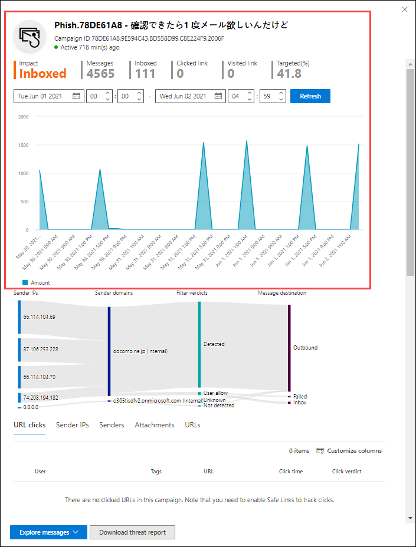

# Kampanjvyer i ATPCampaign Views in ATP

Kampanjvyer är en funktion i Advanced Threat Protection (ATP) i Security & Compliance Center som identifierar och kategoriserar nätfiskeattacker i tjänsten.Campaign Views is a feature in Advanced Threat Protection (ATP) in the Security & Compliance Center that identifies and categorizes phishing attacks in the service. Kampanjvyer kan hjälpa dig att:Campaign Views can help you to:

- Effektivt undersöka och svara på phishing-attacker.Efficiently investigate and respond to phishing attacks.

- Bättre förstå omfattningen av attacken.Better understand the scope of the attack.

- Visa värde för beslutsfattare.Show value to decision makers.

Med kampanjvyer kan du se helheten av en attack snabbare och mer komplett än någon människa.Campaign Views lets you see the big picture of an attack faster and more complete than any human.

## Vad är en kampanj?What is a campaign?

En kampanj är en samordnad e-postattack mot en eller flera organisationer.A campaign is a coordinated email attack against one or many organizations. E-postattacker som stjäl referenser och företagsdata är en stor och lukrativ bransch.Email attacks that steal credentials and company data are a big and lucrative industry. I takt med att tekniken ökar i ett försök att stoppa attacker ändrar angripare sina metoder i ett försök att säkerställa fortsatt framgång.As technologies increase in an effort to stop attacks, attackers modify their methods in an effort to ensure continued success.

Microsoft utnyttjar de stora mängderna anti-phishing, anti-spam och anti-malware data över hela tjänsten för att identifiera kampanjer.Microsoft leverages the vast amounts of anti-phishing, anti-spam, and anti-malware data across the entire service to help identify campaigns. Vi analyserar och klassificerar attackinformationen enligt flera faktorer.We analyze and classify the attack information according to several factors. Till exempel:For example:

- **Attack källa:** Källan IP-adresser och avsändare e-domäner.**Attack source**: The source IP addresses and sender email domains.

- **Attack meddelandeegenskaper:** Innehållet, stilen och tonen i meddelandena.**Attack message properties**: The content, style, and tone of the messages.

- **Attackmottagare:** Mottagare, mottagarjobbsfunktioner (administratörer, chefer osv.), företagstyper (stora, små, offentliga, privata osv.) och branscher.**Attack recipients**: Recipient domains, recipient job functions (admins, executives, etc.), company types (large, small, public, private, etc.), and industries.

- **Attack nyttolast:** Skadliga länkar, bilagor eller andra nyttolaster i meddelandena.**Attack payload**: Malicious links, attachments, or other payloads in the messages.

En kampanj kan vara kortlivad eller sträcka sig över flera dagar, veckor eller månader med aktiva och inaktiva perioder.A campaign might be short-lived, or could span several days, weeks, or months with active and inactive periods. En kampanj kan startas mot din specifika organisation, eller så kan din organisation vara en del av en större kampanj för flera företag.A campaign might be launched against your specific organization, or your organization might be part of a larger campaign across multiple companies.

## Kampanjvyer säkerhets- & compliance centerCampaign Views the Security & Compliance Center

Kampanjvyer är tillgängliga i [Security & Compliance Center](https://protection.office.com) vid **hothanteringskampanjer** \> **Campaigns**eller direkt på <https://protection.office.com/campaigns> .Campaign Views is available in the [Security & Compliance Center](https://protection.office.com) at **Threat management** \> **Campaigns**, or directly at <https://protection.office.com/campaigns>.

Du kan också komma åt kampanjvyer från:You can also get to Campaign Views from:

- **Hantering av** \> hot **Explorer** \> **Visa** \> **Kampanjer****Threat management** \> **Explorer** \> **View** \> **Campaigns**

- **Hantering av** \> hot **Explorer** \> **Visa** \> **Alla e-postmeddelanden** \> **Fliken Kampanj****Threat management** \> **Explorer** \> **View** \> **All email** \> **Campaign** tab

- **Hantering av** \> hot **Explorer** \> **Visa** \> **Phish (phish)** \> **Fliken Kampanj****Threat management** \> **Explorer** \> **View** \> **Phish** \> **Campaign** tab

- **Hantering av** \> hot **Explorer** \> **Visa** \> **Skadlig kod** \> **Fliken Kampanj****Threat management** \> **Explorer** \> **View** \> **Malware** \> **Campaign** tab

För att komma åt kampanjvyer måste du vara medlem i rollgrupperna **Organisationshantering,** **Säkerhetsadministratör**eller **Säkerhetsläsare** i säkerhets- & Compliance Center.To access Campaign Views, you need to be a member of the **Organization Management**, **Security Administrator**, or **Security Reader** role groups in the Security & Compliance Center. Mer information finns i [Behörigheter i Säkerhets- och efterlevnadscentret](permissions-in-the-security-and-compliance-center.md).For more information, see [Permissions in the Security & Compliance Center](permissions-in-the-security-and-compliance-center.md).

## Översikt över kampanjerCampaigns overview

Översiktssidan visar information om alla kampanjer.The overview page shows information about all campaigns.

På fliken **Kampanj** visar området **Kampanjtyp** ett stapeldiagram som visar antalet mottagare per dag.On the default **Campaign** tab, the **Campaign type** area shows a bar graph that shows the number of recipients per day. Som standard visar diagrammet både **Phish-** och **Malware-data.**By default, the graph shows both **Phish** and **Malware** data.

> [!TIP]
> Om du inte ser några kampanjdata kan du prova att ändra datumintervallet eller [filtren](#filters-and-settings).If you don't see any campaign data, try changing the date range or [filters](#filters-and-settings).

På sidan Översikt visas följande information på fliken **Kampanj:**The rest of the overview page shows the following information on the **Campaign** tab:

- **Namn****Name**

- **Exempelämne**: Ämnesraden för ett av meddelandena i kampanjen.**Sample subject**: The subject line of one of the messages in the campaign. Observera att alla meddelanden i kampanjen inte nödvändigtvis har samma ämne.Note that all messages in the campaign will not necessarily have the same subject.

- **Riktad**: Procentsatsen som beräknat med: (antalet kampanjmottagare i organisationen) / (det totala antalet mottagare i kampanjen i alla organisationer i tjänsten).**Targeted**: The percentage as calculated by: (the number of campaign recipients in your organization) / (the total number of recipients in the campaign across all organizations in the service). Det här värdet anger i vilken utsträckning kampanjen är specifikt riktad till din organisation (ett högre värde) jämfört med andra organisationer i tjänsten (ett lägre värde).This value indicates the degree to which the campaign is specifically directed at your organization (a higher value) vs. directed at other organizations in the service (a lower value).

- **Typ:** Detta värde är antingen **Phish** eller **Malware**.**Type**: This value is either **Phish** or **Malware**.

- **Undertyp**: Det här värdet innehåller mer information om kampanjen.**Subtype**: This value contains more details about the campaign. Till exempel:For example:

  - **Phish**: Om tillgängligt, det varumärke som phished av denna kampanj.**Phish**: Where available, the brand that is being phished by this campaign. Till exempel `Microsoft` `365` , , , eller `Unknown` `Outlook` `DocuSign` .For example, `Microsoft`, `365`, `Unknown`, `Outlook`, or `DocuSign`.

  - **Skadlig kod:** Till exempel, `HTML/PHISH` eller `HTML/<MalwareFamilyName>` .**Malware**: For example, `HTML/PHISH` or `HTML/<MalwareFamilyName>`.

Om det finns, det varumärke som phished av denna kampanj.Where available, the brand that is being phished by this campaign. När identifieringen drivs av **ATP-teknik** läggs prefixet ATP till undertypsvärdet.When the detection is driven by ATP technology, the prefix **ATP-** is added to the subtype value.

- **Mottagare**: Antalet användare som har riktats mot kampanjen.**Recipients**: The number of users that were targeted by this campaign.

- **Inkorg**: Antalet användare som har fått meddelanden från den här kampanjen i inkorgen (inte levererat till mappen Skräppost).**Inboxed**: The number of users that received messages from this campaign in their Inbox (not delivered to their Junk Email folder).

- **Klickade på**: Antalet användare som klickade på webbadressen eller öppnade den bifogade filen i nätfiskemeddelandet.**Clicked**: The number of users that clicked on the URL or opened the attachment in the phishing message.

- **Klickfrekvens**: Procentsatsen som beräknas av "**Klickad**  /  **inkorg**".**Click rate**: The percentage as calculated by "**Clicked** / **Inboxed**". Det här värdet är en indikator på kampanjens effektivitet och om mottagarna kunde identifiera meddelandet som nätfiske och undvika att klicka på nyttolast-url:en.This value is an indicator of the effectiveness of the campaign, and whether the recipients were able to identify the message as phishing and avoid clicking on the payload URL.

  Observera att det här värdet inte används i kampanjer för skadlig kod.Note that this value isn't used in malware campaigns.

- **Besökt:** Hur många användare som faktiskt gjorde det genom att nyttolasten webbplats.**Visited**: How many users actually made it through to the payload website. Om det finns klickade värden, men säkra länkar **blockeras** åtkomst till webbplatsen, kommer detta värde att vara noll.If there are **Clicked** values, but Safe Links blocked access to the website, this value will be zero.

På fliken **Kampanjursprung** visas meddelandekällorna på en världskarta.The **Campaign origin** tab shows the message sources on a map of the world.

### Filter och inställningarFilters and settings

Högst upp på sidan Kampanjvyer finns det flera filter- och frågeinställningar som hjälper dig att hitta och isolera specifika kampanjer.At the top of the Campaign Views page, there are several filter and query settings to help you find and isolate specific campaigns.

Den mest grundläggande filtrering som du kan göra är startdatum/tid och slutdatum/-tid.The most basic filtering that you can do is the start date/time and the end date/time.

Om du vill filtrera vyn ytterligare kan du göra en enda egenskap med flera värden som filtrerar genom att klicka på knappen **Kampanjtyp,** göra ditt val och sedan klicka på **Uppdatera**.To further filter the view, you can do single property with multiple values filtering by clicking the **Campaign type** button, making your selection, and then clicking **Refresh**.

De tillgängliga kampanjegenskaperna beskrivs i följande lista:The available campaign properties are described in the following list:

- GrundläggandeBasic

  - **Kampanjtyp:** Välj **Skadlig kod** eller **Phish**.**Campaign type**: Select **Malware** or **Phish**. När du rensar markeringarna får du samma resultat som att välja båda.Clearing the selections has the same result as selecting both.
  - **Kampanjnamn****Campaign name**
  - **Undertyp för kampanj****Campaign subtype**
  - **Avsändare****Sender**
  - **Mottagare****Recipients**
  - **Avsändningsdomän****Sender domain**
  - **Ämne****Subject**
  - **Filnamn för bifogad fil****Attachment filename**
  - **Malware familj****Malware family**
  - **Leveransåtgärd****Delivery action**
  - **Detektionsteknik****Detection technology**
  - **Taggar****Tags**
  - **System åsidosättningar****System overrides**

- AvanceradeAdvanced

  - **Internet-meddelande-ID:** Tillgängligt i fältet **Meddelande-ID-huvud** i meddelandehuvudet.**Internet message ID**: Available in the **Message-ID** header field in the message header. Ett exempelvärde är `<08f1e0f6806a47b4ac103961109ae6ef@server.domain>` (notera vinkelparenteserna).An example value is `<08f1e0f6806a47b4ac103961109ae6ef@server.domain>` (note the angle brackets).
  
  - **Nätverksmeddelande-ID:** Ett GUID-värde som är tillgängligt i huvudfältet **X-MS-Exchange-Organization-Network-Message-Id** i meddelandehuvudet.**Network message ID**: A GUID value that's available in the **X-MS-Exchange-Organization-Network-Message-Id** header field in the message header.
  
  - **IP-adress för avsändare****Sender IP**
  
  - **BIFOGAD FIL SHA256**: Om du vill hitta SHA256-hash-värdet för en fil i Windows kör du följande kommando i en kommandotolk: `certutil.exe -hashfile "<Path>\<Filename>" SHA256` .**Attachment SHA256**: To find the SHA256 hash value of a file in Windows, run the following command in a Command Prompt: `certutil.exe -hashfile "<Path>\<Filename>" SHA256`.
  
  - **Kluster-ID****Cluster ID**
  
  - **Princip-ID för aviseringar****Alert Policy ID**

- WebbadresserURLs

  - **URL-domän****URL domain**
  - **URL-domän och url-sökväg****URL domain and path**
  - **Url****URL**
  - **URL-sökväg****URL path**
  - **Klicka dom****Click verdict**

Om du vill ha mer avancerad filtrering, inklusive filtrering efter flera egenskaper, kan du klicka på knappen **Avancerat filter** för att skapa en fråga.For more advanced filtering, including filtering by multiple properties, you can click the **Advanced filter** button to build a query. Samma kampanjegenskaper är tillgängliga, men med följande förbättringar:The same campaign properties are available, but with the following enhancements:

- Du kan klicka på **Lägg till ett villkor** för att välja flera villkor.You can click **Add a condition** to select multiple conditions.
- Du kan välja operatorn **Och** **eller Eller** mellan villkoren.You can choose the **And** or **Or** operator between conditions.
- Du kan välja objektet **Villkorsgrupp** längst ned i villkorslistan för att skapa komplexa sammansatta villkor.You can select the **Condition group** item at the bottom of the conditions list to form complex compound conditions.

När du är klar klickar du på knappen **Fråga.**When you're finished, click the **Query** button.

När du har skapat ett grundläggande eller avancerat filter kan du spara det med hjälp av **Spara fråga** eller **Spara fråga som**.After you create a basic or advanced filter, you can save it by using **Save query** or **Save query as**. När du senare går tillbaka till kampanjvyer kan du läsa in ett sparat filter genom att klicka på **Sparade frågeinställningar**.Later, when you return to Campaign Views, you can load a saved filter by clicking **Saved query settings**.

Om du vill exportera diagrammet eller listan över kampanjer klickar du på **Exportera** och väljer **Exportera diagramdata** eller **Exportkampanjlista**.To export the graph or the list of campaigns, click **Export** and select **Export chart data** or **Export campaign list**.

Om du har en Microsoft Defender ATP-prenumeration kan du klicka på **WDATP** för att ansluta eller koppla från kampanjinformationen med Microsoft Defender ATP.If you have a Microsoft Defender ATP subscription, you can click **WDATP** to connect or disconnect the campaigns information with Microsoft Defender ATP. Mer information finns i [Integrera Office 365 ATP med Microsoft Defender ATP](https://docs.microsoft.com/microsoft-365/security/office-365-security/integrate-office-365-ti-with-wdatp).For more information, see [Integrate Office 365 ATP with Microsoft Defender ATP](https://docs.microsoft.com/microsoft-365/security/office-365-security/integrate-office-365-ti-with-wdatp).

## Information om kampanjCampaign details

När du klickar på namnet på en kampanj visas kampanjinformationen i ett utfällbart utfällbart.When you click on the name of a campaign, the campaign details appear in a flyout.

### KampanjinformationCampaign information

Högst upp i kampanjinformationsvyn finns följande kampanjinformation tillgänglig:At the top of the campaign details view, the following campaign information is available:

- **ID**: Den unika kampanjidentifieraren.**ID**: The unique campaign identifier.

- **Startad** och **avslutad:** Kampanjens startdatum och slutdatum.**Started** and **Ended**: The start date and end date of the campaign. Observera att dessa datum kan sträcka sig längre än dina filterdatum som du har valt på översiktssidan.Note that these dates might extend further than your filter dates that you selected on the overview page.

- **Effekt**: Det här avsnittet innehåller följande data för det datumintervallfilter du valt (eller som du väljer på tidslinjen):**Impact**: This section contains the following data for the date range filter you selected (or that you select in the timeline):
  
  - Det totala antalet mottagare.The total number of recipients.
  - Antalet meddelanden som var "Inkorged" (det vill än levereras till Inkorgen, inte till mappen Skräppost).The number of messages that were "Inboxed" (that is, delivered to the Inbox, not to the Junk Email folder).
  - Hur många användare klickade på webbadressens nyttolast i nätfiskemeddelandet.How many users clicked on the URL payload in the phishing message.
  - Howe många användare besökte webbadressen.Howe many users visited the URL.

- **Riktad**: Procentsatsen som beräknat med: (antalet kampanjmottagare i organisationen) / (det totala antalet mottagare i kampanjen i alla organisationer i tjänsten).**Targeted**: The percentage as calculated by: (the number of campaign recipients in your organization) / (the total number of recipients in the campaign across all organizations in the service). Observera att det här värdet beräknas under kampanjens hela livstid och inte ändrar filterdatumen.Note that this value is calculated over the entire lifetime of the campaign, and doesn't change the filter dates.

- En interaktiv tidslinje för kampanjaktivitet: Tidslinjen visar aktivitet under kampanjens hela livstid.An interactive timeline of campaign activity: The timeline shows activity over the entire lifetime of the campaign. Som standard innehåller det skuggade området det datumintervallfilter som du valde i översikten.By default, the shaded area includes the date range filter that you selected in the overview. Du kan klicka och dra för att välja en viss startpunkt och slutpunkt, <u>som ändrar de data som visas i **Impact-området** och på resten av sidan enligt beskrivningen i nästa avsnitt</u>.You can click and drag to select a specific start point and end point, <u>which will change the data that's displayed in **Impact** area, and on the rest of the page as described in the next sections</u>.

I namnlisten kan du klicka på knappen Hämta **kampanjbildning** Av att ladda  kampanjskrivningen för att hämta kampanjinformationen till ett Word-dokument (som standard med namnet CampaignReport.docx).In the title bar, you can click the **Download campaign write-up** button  to download the campaign details to a Word document (by default, named CampaignReport.docx). Observera att det här dokumentet innehåller information under kampanjens hela livstid (inte bara de filterdatum du har valt).Note that this document contains details over the entire lifetime of the campaign (not just the filter dates you selected).

### KampanjflödeCampaign flow

I mitten av vyn kampanjinformation presenteras viktiga detaljer om kampanjen i avsnittet **Flöde** i ett vågrätt flödesdiagram (ett så kallat _Sankey-diagram)._In the middle of the campaign details view, important details about the campaign are presented in the **Flow** section in a horizontal flow diagram (known as a _Sankey_ diagram). Dessa uppgifter hjälper dig att förstå delarna av kampanjen och den potentiella effekten i din organisation.These details will help you to understand the elements of the campaign and the potential impact in your organization.

> [!TIP]
> Informationen som visas i **flödesdiagrammet** styrs av det skuggade datumintervallet i tidslinjen enligt beskrivningen i föregående avsnitt.The information that's displayed in the **Flow** diagram is controlled by the shaded date range in the timeline as described in the previous section.

Om du hovrar över ett vågrätt band i diagrammet visas antalet relaterade meddelanden (till exempel meddelanden från en viss käll-IP, meddelanden från käll-IP med den angivna avsändarendomänen osv.).If you hover over a horizontal band in the diagram, you'll see the number of related messages (for example, messages from a particular source IP, messages from the source IP using the specified sender domain, etc.).

Diagrammet innehåller följande information:The diagram contains the following information:

- **Avsändare-IPs****Sender IPs**

- **Avsändaredomäner****Sender domains**

- **Filtrera domar:** Dessa värden är relaterade till tillgängliga phishing och spam filtrering domar som beskrivs i [Anti-spam meddelande rubriker](anti-spam-message-headers.md).**Filter verdicts**: These values are related to the available phishing and spam filtering verdicts as described in [Anti-spam message headers](anti-spam-message-headers.md). De tillgängliga värdena beskrivs i följande tabell:The available values are described in the following table:

  ||||
  |---|---|---|
  |**Värde****Value**|**Spam filter dom****Spam filter verdict**|**Beskrivning****Description**|
  |**Tillåtet****Allowed**|`SFV:SKN`    `SFV:SKI`|Meddelandet markerades som inte skräppost och/eller överhoppade filtrering innan det utvärderades av skräppostfiltrering (till exempel av en regel för e-postflöde, även känd som en transportregel).The message was marked as not spam and/or skipped filtering before being evaluated by spam filtering (for example, by a mail flow rule, also known as a transport rule).  Meddelandet hoppade över skräppostfiltrering av andra skäl (till exempel verkar avsändaren och mottagaren vara i samma organisation).The message skipped spam filtering for other reasons (for example, the sender and recipient appear to be in the same organization).|
  |**Blockerade****Blocked**|`SFV:SKS`|Meddelandet markerades som skräppost innan det utvärderades av skräppostfiltrering (till exempel av en regel för e-postflöde).The message was marked as spam before being evaluated by spam filtering (for example, by a mail flow rule).|
  |**Upptäckt****Detected**|`SFV:SPM`|Meddelandet markerades som skräppost av skräppostfiltret.The message was marked as spam by spam filtering.|
  |**Har inte identifierats****Not Detected**|`SFV:NSPM`|Meddelandet markerades som inte skräppost genom skräppostfiltrering.The message was marked as not spam by spam filtering.|
  |**Släppt****Released**|`SFV:SKQ`|Meddelandet hoppade över skräppostfiltrering eftersom det släpptes från karantänen.The message skipped spam filtering because it was released from quarantine.|
  |**Klient tillåt**\***Tenant Allow**\*|`SFV:SKA`|Meddelandet hoppade över skräppostfiltrering på grund av policyinställningar mot skräppost (till exempel var avsändaren med i listan över tillåtna avsändare eller tillåtna domänlistan).The message skipped spam filtering due to anti-spam policy settings (for example, the sender was in the allowed sender list or allowed domain list).|
  |**Hyresgästblock**\*\***Tenant Block**\*\*|`SFV:SKA`|Meddelandet blockerades av skräppostfiltrering på grund av policyinställningar mot skräppost (till exempel var avsändaren i listan över tillåtna avsändare eller tillåtna domänlistan).The message was blocked by spam filtering due to anti-spam policy settings (for example, the sender was in the allowed sender list or allowed domain list).|
  |**Tillåt användare**\***User Allow**\*|`SFV:SFE`|Meddelandet hoppade över skräppostfiltrering eftersom avsändaren fanns i en användares lista över betrodda avsändare i Outlook.The message skipped spam filtering because the sender was in a user's Safe Senders list in Outlook.|
  |**Användarblock**\*\***User Block**\*\*|`SFV:BLK`|Meddelandet blockerades av skräppostfiltrering eftersom avsändaren fanns i en användares lista blockerade avsändare i Outlook.The message was blocked by spam filtering because the sender was in a user's Blocked Senders list in Outlook.|
  |**Zap****ZAP**|ejn/a|[Zero-hour auto purge (ZAP)](zero-hour-auto-purge.md) vidtog åtgärder på det levererade meddelandet enligt dina anti-spam-principinställningar (flyttade till mappen Skräppost eller karantän).[Zero-hour auto purge (ZAP)](zero-hour-auto-purge.md) took action on the delivered message according to your anti-spam policy settings (moved to the Junk Email folder or Quarantined).|
  |

  \*Granska dina policyer mot skräppost, eftersom det tillåtna meddelandet sannolikt skulle ha blockerats av tjänsten.\* Review your anti-spam policies, because the allowed message would have likely been blocked by the service.

  \*\*Granska dina policyer mot skräppost, eftersom dessa meddelanden ska sättas i karantän, inte levereras.\*\* Review your anti-spam policies, because these messages should be quarantined, not delivered.

- **Leveransplatser**: Du vill förmodligen undersöka meddelanden som faktiskt levererades till mottagarna (antingen till inkorgen eller mappen Skräppost), även om användarna inte klickade på nyttolast-URL:en i meddelandet.**Delivery locations**: You'll likely want to investigate messages that were actually delivered to recipients (either to the Inbox or the Junk Email folder), even if users didn't click on the payload URL in the message. Du kan också ta bort meddelandena i karantän från karantänen.You can also remove the quarantined messages from quarantine. Mer information finns [i EOP i karantän](quarantine-email-messages.md).For more information, see [Quarantined email messages in EOP](quarantine-email-messages.md).

  - **Borttagen mapp****Deleted folder**
  - **Tappade****Dropped**
  - **Externt**: Mottagaren finns i din lokala e-postorganisation i hybridmiljöer.**External**: The recipient is located in your on-premises email organization in hybrid environments.
  - **Misslyckades****Failed**
  - **Vidarebefordras****Forwarded**
  - **Inkorg****Inbox**
  - **Skräppostmapp****Junk folder**
  - **Karantän****Quarantine**
  - **Okänd****Unknown**

- **URL-klick**: Dessa beskrivs i nästa avsnitt.**URL clicks**: These are described in the next section.

> [!NOTE]
> I alla lager som innehåller fler än 10 objekt visas de 10 översta objekten, medan resten buntas ihop i **Andra**.In all layers that contain more than 10 items, the top 10 items are shown, while the rest are bundled together in **Others**.

#### URL-klickURL clicks

När ett nätfiskemeddelande levereras till en mottagare (till inkorgen eller mappen Skräppost) finns det alltid en chans att användaren klickar på nyttolastadressen.When a phishing message is delivered to a recipient (to the Inbox or the Junk Email folder), there's always a chance that the user will click on the payload URL. Att inte klicka på webbadressen i ett levererat meddelande är ett litet mått på framgång, men du måste ta reda på varför nätfiskemeddelandet levererades till deras postlåda från början.Not clicking on the URL in a delivered message is a small measure of success, but you need to determine why the phishing message was delivered to their mailbox in the first place.

Om en användare klickade på nyttolast-URL:en i nätfiskemeddelandet visas åtgärderna i området **URL-klick** i diagrammet i kampanjinformationsvyn.If a user clicked on the payload URL in the phishing message, the actions are displayed in the **URL clicks** area of the diagram in the campaign details view.

- **Tillåtet****Allowed**

- **BlockPage**: Mottagaren klickade på nyttolastens URL, men deras åtkomst till den skadliga webbplatsen blockerades av [ATP Safe Links-principerna](atp-safe-links.md) i organisationen.**BlockPage**: The recipient clicked on the payload URL, but their access to the malicious website was blocked by the [ATP Safe Links](atp-safe-links.md) policies in your organization.

- **BlockPageOverride**: Mottagaren klickade på nyttolastens URL i meddelandet, ATP Safe Links försökte stoppa dem, men de fick åsidosätta blocket.**BlockPageOverride**: The recipient clicked on the payload URL in the message, ATP Safe Links tried to stop them, but they were allowed to override the block. Du måste undersöka dina principer för [säkra länkar](set-up-atp-safe-links-policies.md) för att se varför användare tillåts åsidosätta domen om säkra länkar och fortsätta till den skadliga webbplatsen.You need to investigate your [Safe Links policies](set-up-atp-safe-links-policies.md) to see why users are allowed to override the Safe Links verdict and continue to the malicious website.

- **PendingDetonationPage**: ATP Säkra bilagor håller på att öppna nyttolast-URL:en i en virtuell datormiljö och se vad som händer.**PendingDetonationPage**: ATP Safe Attachments is in the process of opening the payload URL in a virtual computer environment, and seeing what happens.

- **PendingDetonationPageOverride**: Mottagaren tilläts åsidosätta detonationsprocessen för nyttolasten och öppna URL:en utan att vänta på resultatet.**PendingDetonationPageOverride**: The recipient was allowed to override the payload detonation process and open the URL without waiting for the results.

### FlikarTabs

Med flikarna i vyn kampanjinformation kan du undersöka kampanjen ytterligare.The tabs in the campaign details view allow you to further investigate the campaign.

> [!TIP]
> Informationen som visas på flikarna styrs av det skuggade datumintervallet i tidslinjen enligt beskrivningen i avsnittet [Kampanjinformation.](#campaign-information)The information that's displayed on the tabs is controlled by the shaded date range in the timeline as described in [Campaign information](#campaign-information) section.

- **URL-klick**: Om användarna inte klickade på nyttolastadressen i nätfiskemeddelandet är det här avsnittet tomt.**URL clicks**: If users didn't click on the payload URL in the phishing message, this section will be blank. Om en användare kunde klicka på webbadressen fylls följande värden i:If a user was able to click on the URL, the following values will be populated:

  - **Användaren**\***User**\*
  - **Url**\***URL**\*
  - **Klicka på tid****Click time**
  - **Klicka dom****Click verdict**

- **Avsändare-IPs****Sender IPs**

  - **IP-adress för avsändare**\***Sender IP**\*
  - **Totalt antal****Total count**
  - **Inkorg****Inboxed**
  - **Inte inkorg****Not Inboxed**
  - **SPF passerade:** Avsändaren autentiserades av [Sender Policy Framework (SPF)](how-office-365-uses-spf-to-prevent-spoofing.md).**SPF passed**: The sender was authenticated by the [Sender Policy Framework (SPF)](how-office-365-uses-spf-to-prevent-spoofing.md). En avsändare som inte skickar SPF-validering anger att avsändaren inte autentiseras eller att meddelandet förfalskar en legitim avsändare.A sender that does not pass SPF validation indicates the sender isn't authenticated, or the message is spoofing a legitimate sender.

- **Avsändare****Senders**

  - **Avsändare**: Det här är den faktiska avsändaradressen i kommandot SMTP MAIL FROM, vilket inte nödvändigtvis är den Från: e-postadress som användarna ser i sina e-postklienter.**Sender**: This is the actual sender address in the SMTP MAIL FROM command, which is not necessarily the From: email address that users see in their email clients.
  - **Totalt antal****Total count**
  - **Inkorg****Inboxed**
  - **Inte inkorg****Not Inboxed**
  - **DKIM-skickaded:** Avsändaren autentiserades av [DKIM (Domain Keys Identified Mail).](support-for-validation-of-dkim-signed-messages.md)**DKIM passed**: The sender was authenticated by [Domain Keys Identified Mail (DKIM)](support-for-validation-of-dkim-signed-messages.md). En avsändare som inte klarar DKIM-validering anger att avsändaren inte autentiseras eller att meddelandet förfalskar en legitim avsändare.A sender that does not pass DKIM validation indicates the sender isn't authenticated, or the message is spoofing a legitimate sender.
  - **DMARC-godkänd:** Avsändaren autentiserades av [Domänbaserad meddelandeautentisering, rapportering och konformance (DMARC)](use-dmarc-to-validate-email.md).**DMARC passed**: The sender was authenticated by [Domain-based Message Authentication, Reporting, and Conformance (DMARC)](use-dmarc-to-validate-email.md). En avsändare som inte klarar DMARC-validering anger att avsändaren inte autentiseras eller att meddelandet förfalskar en legitim avsändare.A sender that does not pass DMARC validation indicates the sender isn't authenticated, or the message is spoofing a legitimate sender.

- **Bilagor****Attachments**

  - **Filnamn****Filename**
  - **SHA256 (SHA256)****SHA256**
  - **Malware familj****Malware family**
  - **Totalt antal****Total count**

- **Url****URL**

  - **Url**\***URL**\*
  - **Totalt antal****Total Count**

\*Om du klickar på det här värdet öppnas ett nytt utfällbart objekt som innehåller mer information om det angivna objektet (användare, URL osv.) ovanpå kampanjinformationsvyn.\* Clicking on this value opens a new flyout that contains more details about the specified item (user, URL, etc.) on top of the campaign details view. Om du vill återgå till kampanjinformationsvyn klickar du på **Klar** i det nya utfällbara resultatet.To return to the campaign details view, click **Done** in the new flyout.

### KnapparButtons

Med knapparna i vyn kampanjinformation kan du använda kraften i Threat Explorer för att undersöka kampanjen ytterligare.The buttons in the campaign details view allow you to use the power of Threat Explorer to further investigate the campaign.

- **Utforska kampanj**: Öppnar en ny sökflik för Threat Explorer med värdet **Kampanj-ID** som sökfilter.**Explore campaign**: Opens a new Threat Explorer search tab using the **Campaign ID** value as the search filter.

- **Utforska inkorgsmeddelanden:** Öppnar en ny sökflik för Hot Explorer med **kampanj-ID** och **leveransplats: Inkorgen** som sökfilter.**Explore Inboxed messages**: Opens a new Threat Explorer search tab using the **Campaign ID** and **Delivery location: Inbox** as the search filter.
