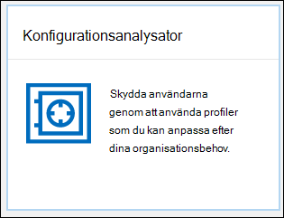

# Konfigurationsanalysator för skyddsprinciper i EOP och Office 365 ATP

> [!NOTE]
> Funktionerna som beskrivs i det här avsnittet är i förhandsversion, är inte tillgängliga i alla organisationer och kan komma att ändras.

Konfigurationsanalysator i Security & Compliance Center är en central plats för att hitta och åtgärda någon av dina säkerhetsprinciper som innehåller inställningar som ligger under profilinställningarna för standardskydd och strikt skydd i [förinställda säkerhetsprinciper](preset-security-policies.md).

Följande typer av principer analyseras av konfigurationsanalysatorn:

- **EOP-principer (Exchange Online Protection):** Detta inkluderar Microsoft 365-organisationer med Exchange Online-postlådor och fristående EOP-organisationer utan Exchange Online-postlådor:
  
  - [Anti-spam politik](configure-your-spam-filter-policies.md).
  - [Anti-malware politik](configure-anti-malware-policies.md).
  - [EOP:s policyer för phishing.](set-up-anti-phishing-policies.md#spoof-settings)

- **Office 365 Advanced Threat Protection (ATP)-principer**: Detta inkluderar organisationer med Microsoft 365 E5- eller Office 365 ATP-tilläggsprenumerationer:

  - ATP:s policyer för phishing, som omfattar:

    - Samma [falska inställningar](set-up-anti-phishing-policies.md#spoof-settings) som är tillgängliga i EOP:s policyer för nätfiske.
    - [Inställningar för personifiering](set-up-anti-phishing-policies.md#impersonation-settings-in-atp-anti-phishing-policies)
    - [Avancerade tröskelvärden för nätfiske](set-up-anti-phishing-policies.md#advanced-phishing-thresholds-in-atp-anti-phishing-policies)

  - [Principer för säkra länkar](recommended-settings-for-eop-and-office365-atp.md#safe-links-policy-settings-in-custom-policies-for-specific-users).

  - [Principer för säkra bilagor](recommended-settings-for-eop-and-office365-atp.md#safe-attachments-policy-settings-in-custom-policies-for-specific-users).

Principinställningsvärdena **Standard** och **Strikt** som används som baslinjer beskrivs i [Rekommenderade inställningar för EOP- och Office 365 ATP-säkerhet](recommended-settings-for-eop-and-office365-atp.md).

## Vad behöver jag veta innan jag börjar?

- Öppna Säkerhets- och efterlevnadscentret på <https://protection.office.com/>. Om du vill gå direkt till sidan **Konfigurationsanalysator** använder du <https://protection.office.com/configurationAnalyzer> .

- Information om hur du använder Windows PowerShell för att ansluta till Exchange Online finns i artikeln om att [ansluta till Exchange Online PowerShell](https://docs.microsoft.com/powershell/exchange/connect-to-exchange-online-powershell).

- Du måste ha tilldelats behörigheter innan du kan genomföra de här procedurerna för detta ämne:

  - Om du vill använda konfigurationsanalysatorn **och** göra uppdateringar av säkerhetsprinciper måste du vara medlem i någon av följande rollgrupper:

    - **Organisationshantering** eller **Säkerhetsadministratör** i [Säkerhets- och efterlevnadscenter](permissions-in-the-security-and-compliance-center.md).
    - **Organisationshantering** eller **Hygienhantering** i [Exchange Online](https://docs.microsoft.com/Exchange/permissions-exo/permissions-exo#role-groups).

  - För skrivskyddad åtkomst till konfigurationsanalysatorn måste du vara medlem i någon av följande rollgrupper:

    - **Säkerhetsläsare** i [Säkerhets- och efterlevnadscentret](permissions-in-the-security-and-compliance-center.md).
    - **Skrivskyddad organisationshantering** i [Exchange Online](https://docs.microsoft.com/Exchange/permissions-exo/permissions-exo#role-groups).

## Använda konfigurationsanalysatorn i Security & Compliance Center

Gå till analysator för **&-efterlevnadsprincip** i Security & Compliance Center \> **Policy** \> **Configuration analyzer**.

Konfigurationsanalysatorn har två huvudflikar:

- **Inställningar och rekommendationer**: Du väljer Standard eller Strikt och jämför dessa inställningar med dina befintliga säkerhetsprinciper. I resultatet kan du justera värdena för dina inställningar för att få dem upp till samma nivå som Standard eller Strikt.

- **Konfigurationsdriftanalys och historik**: Med den här vyn kan du spåra de ändringar som du har gjort i dina principer baserat på resultatet av konfigurationsanalysatorn över tid.

### Fliken Inställning och rekommendationer i konfigurationsanalysatorn

Som standard öppnas fliken i jämförelsen med standardskyddsprofilen. Du kan växla till jämförelsen av profilen Strikt skydd genom att klicka på **Visa strikta rekommendationer**. Om du vill växla tillbaka väljer du **Visa standardrekommendationer**.

Som standard innehåller kolumnen **Principgrupp/inställningsnamn** en komprimerad vy över de olika typerna av säkerhetspoliser och antalet inställningar i de principer som behöver förbättras (om sådana finns). De olika typerna av principer är:

- **Anti-spam**
- **Anti-phishing**
- **Anti-malware**
- **ATP Säkra bilagor** (om din prenumeration inkluderar ATP)
- **ATP Safe Links** (om din prenumeration inkluderar ATP)

I standardvyn är allt komprimerat. Bredvid varje princip visas en sammanfattning av jämförelseresultat från dina principer (som du kan ändra) och inställningarna i motsvarande principer för profilerna Standard eller Strikt skydd (som du inte kan ändra). Följande information visas:

- **Grön**: Alla inställningar i alla befintliga principer är minst lika säkra som den skyddsprofil som du jämför med.
- **Amber**: Ett litet antal inställningar i de befintliga principerna är inte lika säkra som den skyddsprofil som du jämför med.
- **Röd**: Ett stort antal inställningar i de befintliga principerna är inte lika säkra som den skyddsprofil som du jämför med. Detta kan vara några inställningar i många principer eller många inställningar i en princip.

För positiva jämförelser ser du texten: **Alla inställningar följer** \<**Standard** or **Strict**\> **rekommendationerna**. Annars visas antalet rekommenderade inställningar som ska ändras.

Om du expanderar **principgrupp/inställningsnamn**visas alla principer och associerade inställningar i varje specifik princip som kräver uppmärksamhet. Du kan också expandera en viss typ av policy (till exempel **Anti-spam)** för att bara se de inställningarna i de typer av principer som kräver din uppmärksamhet.

Om jämförelsen inte har några rekommendationer för förbättring (grön), expanderande politiken visar ingenting. Om det finns ett antal rekommendationer för förbättringar (gult eller rött), de inställningar som kräver uppmärksamhet avslöjas, och motsvarande information avslöjas i följande kolumner:

- Namnet på den inställning som kräver din uppmärksamhet. I föregående skärmbild är det till exempel **tröskelvärdet för massutskick av e-post** i en policy mot skräppost.

- **Princip**: Namnet på den berörda principen som innehåller inställningen.

- **Används på**: Antalet användare som de berörda principerna tillämpas på.

- **Aktuell konfiguration**: Det aktuella värdet för inställningen.

- **Senast ändrad**: Det datum då principen senast ändrades.

- **Rekommendationer**: Värdet av inställningen i profilen Standard eller Strikt skydd. Om du vill ändra värdet för inställningen i principen så att den matchar det rekommenderade värdet i skyddsprofilen klickar du på **Anta**. Om ändringen lyckas visas meddelandet: Rekommendationer har **antagits**. Klicka på **Uppdatera** om du vill se det minskade antalet rekommendationer och borttagningen av den specifika inställningen/principraden från resultaten.

### Fliken Analys och historik på fliken Konfigurationsdrift i konfigurationsanalysatorn

På den här fliken kan du spåra de ändringar som du har gjort i dina anpassade säkerhetsprinciper baserat på informationen i säkerhetsanalysatorn. Som standard visas följande information:

- **Senast ändrad**
- **Ändrad av**
- **Ange namn**
- **Politik**
- **Typ**

Om du vill filtrera resultaten klickar du på **Filter**. I det utfällbara **filter** som visas kan du välja bland följande filter:

- **Starttid** och **sluttid** (datum)
- **Standardskydd** eller **Strikt skydd**

Om du vill exportera resultaten till en CSV-fil klickar du på **Exportera**.

