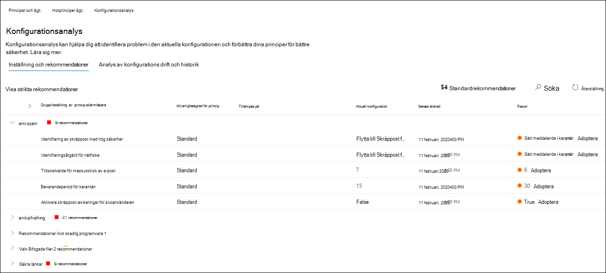

# Konfigurationsanalys för skyddsprinciper i EOP och Microsoft Defender för Office 365

[!INCLUDE [Microsoft 365 Defender rebranding](../includes/microsoft-defender-for-office.md)]

**Gäller för**
- [Exchange Online Protection](exchange-online-protection-overview.md)
- [Microsoft Defender för Office 365 Abonnemang 1 och Abonnemang 2](defender-for-office-365.md)
- [Microsoft 365 Defender](../defender/microsoft-365-defender.md)

Konfigurationsanalys i Microsoft 365 Defender-portalen ger dig en central plats för att hitta och åtgärda säkerhetsprinciper där inställningarna finns under inställningarna Standardskydd och Strikt skydd i [förinställda säkerhetsprinciper.](preset-security-policies.md)

Följande typer av principer analyseras av konfigurationsanalysatorn:

- **Exchange Online Protection (EOP):** Det här omfattar Microsoft 365 organisationer med Exchange Online e-postlådor och fristående EOP-organisationer utan Exchange Online postlådor:

  - [Principer för skydd mot skräppost.](configure-your-spam-filter-policies.md)
  - [Principer för skydd mot skadlig programvara.](configure-anti-malware-policies.md)
  - [Principer för skydd mot nätfiske i EOP.](set-up-anti-phishing-policies.md#spoof-settings)

- **Microsoft Defender Office 365 principer:** Detta omfattar organisationer med Microsoft 365 E5 eller Defender för Office 365 tilläggsprenumerationer:

  - Principer mot nätfiske i Microsoft Defender för Office 365, som omfattar:
    - Samma [förfalskningsinställningar som](set-up-anti-phishing-policies.md#spoof-settings) finns i EOP-principer för skydd mot nätfiske.
    - [Inställningar för personifiering](set-up-anti-phishing-policies.md#impersonation-settings-in-anti-phishing-policies-in-microsoft-defender-for-office-365)
    - [Avancerade tröskelvärden för nätfiske](set-up-anti-phishing-policies.md#advanced-phishing-thresholds-in-anti-phishing-policies-in-microsoft-defender-for-office-365)
  - [Valv principer för länkar](set-up-safe-links-policies.md).
  - [Valv principer för bifogade filer](set-up-safe-attachments-policies.md).

**Standard-** och Strikt-principinställningsvärdena som används som baslinjer beskrivs i Rekommenderade inställningar för EOP och [Microsoft Defender för Office 365 säkerhet.](recommended-settings-for-eop-and-office365.md) 

## Vad behöver jag veta innan jag börjar?

- Du öppnar Microsoft 365 Defender-portalen på <https://security.microsoft.com> . Använd för att gå **direkt till sidan Configuration analyzer** <https://security.microsoft.com/configurationAnalyzer> .

- Information om hur du använder Windows PowerShell för att ansluta till Exchange Online finns i artikeln om att [ansluta till Exchange Online PowerShell](/powershell/exchange/connect-to-exchange-online-powershell).

- Du måste ha tilldelats behörigheter i Microsoft 365 Defender-portalen innan du kan utföra procedurerna i den här artikeln:
  - Om du vill använda konfigurationsanalysatorn och uppdatera säkerhetsprinciper måste  du vara medlem i rollgrupperna Organisationshantering eller **Säkerhetsadministratör.** 
  - För skrivskyddade åtkomst till konfigurationsanalys behöver du vara medlem i rollgrupperna **Global Reader** eller **Säkerhetsläsare.**

  Mer information finns i [Behörigheter i Microsoft 365 Defender-portalen.](permissions-microsoft-365-security-center.md)

  > [!NOTE]
  >  
  > - Om du lägger till användare i Azure Active Directory-rollen får användarna de behörigheter  som krävs i Microsoft 365 Defender-portalen samt behörigheter för andra funktioner i Microsoft 365. Mer information finns i [Om administratörsroller](../../admin/add-users/about-admin-roles.md).
  >
  > - Rollgruppen **Skrivskyddad organisationshantering** i [Exchange Online](/Exchange/permissions-exo/permissions-exo#role-groups) ger också skrivskyddad åtkomst till funktionen.

## Använda konfigurationsanalysen i Microsoft 365 Defender-portalen

I Den Microsoft 365 Defender-portalen går du till avsnittet & för **&** e-postsamarbete & principer för hotprinciper i \>  \>  \>  \> **mallade principer.**

Sidan **Konfigurationsanalys** har två huvudflikar:

- **Inställningar och rekommendationer**: Du **väljer Standard** **eller Strikt** och jämför inställningarna med dina befintliga säkerhetsprinciper. I resultatet kan du justera värdena i inställningarna så att de hamnar på samma nivå som Standard eller Strikt.
- **Konfigurationsanalys och historik:** I den här vyn kan du spåra principändringar över tid.

### Fliken Inställningar och rekommendationer i konfigurationsanalys

Som standard öppnas fliken med jämförelsen av profilen för standardskydd. Du kan växla till jämförelsen av profilen med strikt skydd genom att välja **Visa strikt rekommendationer.** Om du vill växla tillbaka väljer du **Visa standardrekommendationer**.

Som standard innehåller **namnkolumnen Principgrupp/inställning** en komprimerad vy av de olika typerna av säkerhetsprinciper och antalet inställningar som behöver förbättras (om sådana finns). Här är typerna av principer:

- **Skräppostskydd**
- **Skydd mot nätfiske**
- **Skydd mot skadlig programvara**
- **Valv bifogade filer** (om din prenumeration inkluderar Microsoft Defender för Office 365)
- **Valv (om** din prenumeration inkluderar Microsoft Defender för Office 365)

I standardvyn döljs allt. Bredvid varje princip finns en sammanfattning av jämförelseresultat från dina principer (som du kan ändra) och inställningarna i motsvarande principer för standard- eller striktskyddsprofilerna (som du inte kan ändra). Följande information visas för den skyddsprofil som du jämför med:

- **Grön**: Alla inställningar i alla befintliga principer är minst lika säkra som skyddsprofilen.
- **Gult** antal: Ett litet antal inställningar i de befintliga principerna är inte lika säkra som skyddsprofilen.
- **Röd**: Ett stort antal inställningar i de befintliga principerna är inte lika säkra som skyddsprofilen. Det kan vara några inställningar i många principer eller många inställningar i en princip.

För bra jämförelser ser du texten: Alla inställningar **följer** \<**Standard** or **Strict**\> **rekommendationer**. I annat fall visas antalet rekommenderade inställningar som ska ändras.

Om du **expanderar grupp-/inställningsnamn** för princip visas alla principer och de associerade inställningarna i varje specifik princip som kräver uppmärksamhet. Du kan också expandera en viss typ av princip (till exempel Skräppostskydd) om du bara vill visa de inställningarna i de policytyper som kräver din uppmärksamhet.

Om jämförelsen inte har några rekommendationer för förbättring (grön) visar expanderande princip ingenting. Om det finns något antal rekommendationer för förbättring (gult eller rött) visas de inställningar som kräver uppmärksamhet och motsvarande information visas i följande kolumner:

- **Principgrupp/inställningsnamn:** Namnet på den inställning som kräver din uppmärksamhet. På föregående skärmbild är det till exempel inställningarna i standardprincipen för skydd mot skräppost.
- **Princip:** Namnet på den princip som påverkas som innehåller inställningen.
- **Tillämpas på:** Antalet användare som de aktuella principerna tillämpas på.
- **Aktuell konfiguration:** Det aktuella värdet för inställningen. Det här värdet är tomt för standardprincipen av den typen som gäller för alla mottagare.
- **Senast ändrad:** Datumet då principen senast ändrades.
- **Rekommendationer:** Värdet på inställningen i profilen standard eller Strikt skydd. Om du vill ändra värdet för inställningen i principen så att den matchar det rekommenderade värdet i skyddsprofilen klickar du på **Adopt**. Om ändringen lyckas visas meddelandet: Används **Rekommendationer används**. Klicka **på** Uppdatera om du vill se det minskade antalet rekommendationer och borttagningen av den specifika inställnings-/principraden från resultatet.

### Konfigurationsanalys och historikfliken i konfigurationsanalys

På den här fliken kan du spåra de ändringar som du har gjort av dina anpassade säkerhetsprinciper. Som standard visas följande information:

- **Senast ändrad**
- **Ändrad av**
- **Inställningsnamn**
- **Princip**
- **Typ**
- **Konfigurationsändring**
- **Konfigurations drift**: värdet **Öka** eller **Minska**.

Om du vill filtrera resultaten klickar du på **Filter**. I  den utfällna listan Filter som visas kan du välja bland följande filter:

- **Starttid** **och Sluttid** (datum)
- **Standardskydd** eller **Strikt skydd**

Om du vill exportera resultaten till en .csv klickar du på **Exportera**.

