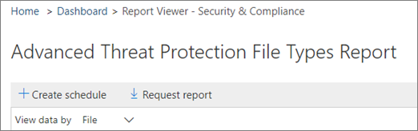

# Skapa ett schema för en &amp; rapport i Säkerhetsefterlevnadscenter

I Security &amp; Compliance Center finns flera [rapporter och insikter](reports-and-insights-in-security-and-compliance.md) tillgängliga för att hjälpa organisationens säkerhetsteam att minska och hantera hot mot din organisation. Om du är medlem i organisationens säkerhetsteam kan du skapa ett schema för en rapport. Schemat du skapar kan innehålla ett anpassat datumintervall som passar din organisation. 
  
## Skapa ett schema för en rapport

> [!IMPORTANT]
> Kontrollera att du har de behörigheter som krävs för att utföra den här uppgiften. I allmänhet kan globala Office 365-administratörer, säkerhetsadministratörer och &amp; säkerhetsläsare komma åt rapporter i Security Compliance Center. Mer information om behörigheter finns [i Behörigheter i &amp; Office 365 Security Compliance Center](permissions-in-the-security-and-compliance-center.md).
  
1. Gå till **instrumentpanelen för rapporter** \> i [Säkerhetsefterlevnadscenter &amp; ](https://protection.office.com). **Dashboard**
    
2. Välj en av följande rapporter: 

    - DLP-principmatchningar
    - Regel för utbytestransport
    - DLP falska positiva och åsidosättningar
    - Office 365 ATP-filtyper
    - Disposition för Office 365 ATP-meddelande
    - Skadlig kod som upptäckts i e-post
    - Bästa malware
    - De främsta avsändare och mottagare
    - Förfalskningar
    - Identifiering av skräppost
    - Skickat och tagit emot e-post
    - DLP-incidenter
    - Krypteringsrapport

    I det här exemplet väljer vi rapporten Avancerade filtyper för skydd av hot.
    
3. I det övre vänstra hörnet av rapporten väljer du **+ Skapa schema**. 
    
    

    (OBS: Alla rapporter har inte knappen **+ Skapa schema.)**
  
    Dialogrutan **Skapa schema** öppnas. 
    
4. Behåll standardinställningarna och välj **Skapa schema**eller välj **Anpassa schema**.
    
    
  
    Om du väljer att anpassa rapportschemat kan du ange rapportens frekvens, en avsändares e-postadress och mottagarens e-postadress. 
    
När du har skapat ett schema för en rapport levereras den rapporten automatiskt via e-post till mottagarnas e-postadresser. 
  
## Relaterade ämnen

[Rapporter och insikter i Office 365 Security &amp; Compliance Center](reports-and-insights-in-security-and-compliance.md)
  
[Hantera scheman för rapporter &amp; i Security Compliance Center](manage-schedules-for-multiple-reports.md)
  
[Hämta befintliga rapporter &amp; i Security Compliance Center](download-existing-reports.md)
  
[Ladda ned en anpassad &amp; rapport i Security Compliance Center](set-up-and-download-a-custom-report.md)
  

