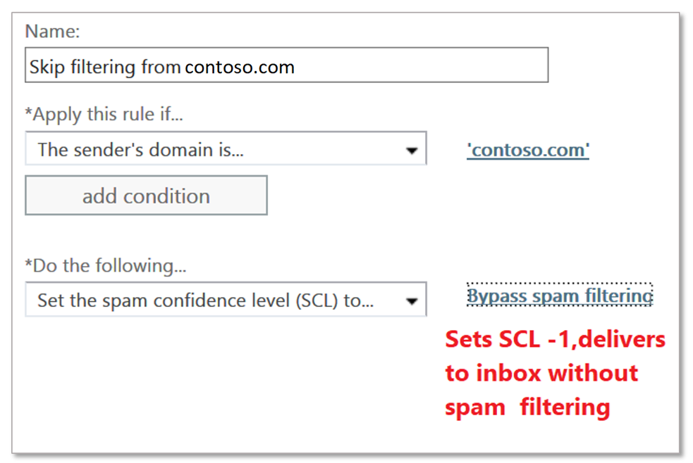

# Skapa listor över betrodda avsändare i Office 365

Om du vill vara säker på att användarna får e-postmeddelanden från en viss avsändare eller avsändare på grund av att du litar på dem och deras meddelanden finns det flera metoder som du kan välja mellan. Dessa alternativ inkluderar Exchange-regler för e-postflöde (kallas även transportregler), Outlook Safe Avsändare, IP-tillåtlistor, listor för skräppostavsändare/domäntillåten.

> [!IMPORTANT]
> Även om organisationen tillåter listor kan användas för att ta itu med falska positiva, bör detta betraktas som en tillfällig lösning och undvikas om möjligt. Att hantera falska positiva med hjälp av tillåtna listor rekommenderas inte eftersom det oavsiktligt kan öppna organisationen till förfalskning, personifiering och andra attacker. Om du använder en tillåten lista för detta ändamål måste du vara vaksam och behålla artikeln för [att skicka in skräppost, icke-skräppost och nätfiske till Microsoft för analys](submit-spam-non-spam-and-phishing-scam-messages-to-microsoft-for-analysis.md), i beredskap.

Den rekommenderade metoden för att konfigurera en lista över betrodda avsändare är att använda regler för e-postflöde eftersom detta ger största möjliga flexibilitet för att säkerställa att endast rätt meddelanden tillåts. *Anti-Spam policy e-postadress* och *domänbaserade tillåt listor* är inte lika säkra som *IP-adressbaserade listor* eftersom domäner lätt kan förfalskas. Men anti-spam politik IP-baserade tillåta listor också innebära risker eftersom de kommer att tillåta alla domäner som skickas via denna IP för att kringgå spam filtrering. Var försiktig och övervaka *eventuella* undantag som gjorts, noggrant.

> [!IMPORTANT]
> • Information om hur du skapar en **blockerad avsändare lista** är [här](create-block-sender-lists-in-office-365.md).    • Om du vill att en avsändaredomän ska kunna skicka oautentiserad e-post (kringgå skydd mot förfalskning) men inte kringgå kontroller mot skräppost och skadlig kod kan du lägga till den i [listan Tillåtspoof.](walkthrough-spoof-intelligence-insight.md)

## Alternativ från de flesta till minst rekommenderade

Du bör alltid begränsa dina Tillåt-listor eftersom de kringgår många säkerhetsåtgärder. Du måste kontrollera alla Tillåt listor som en del av ditt standardunderhåll, så att du är medveten om vem som tillåts kringgå. Rekommendationen är att använda restriktiva regler för e-postflöde där det är möjligt.

- Regler för flöde av exchange
- Outlook-säkra avsändare
- Anti-spam politik: IP-allow Listor
- Anti-spam policy: Avsändare / Domän tillåt listor

## Använda Exchange-flödesregler för att tillåta specifika avsändare (rekommenderas)

För att säkerställa att endast legitima meddelanden tillåts i din organisation villkoret bör vara något av följande:

- Använd status för avsändarautentisering för den sändande domänen. Detta görs genom att kontrollera rubriken Autentiseringsresultat för att säkerställa att det innehåller "dmarc=pass" eller "dmarc=bestguesspass". Detta säkerställer att den sändande domänen har autentiserats och inte förfalskas. Klicka för mer information om [SPF,](set-up-spf-in-office-365-to-help-prevent-spoofing.md) [DKIM](use-dkim-to-validate-outbound-email.md)och [DMARC](use-dmarc-to-validate-email.md) e-postautentisering.

- Om den sändande domänen inte har autentisering använder du den sändande domänen *plus* ett skickande IP-intervall (eller IP-intervall). Se till att du är *så restriktiv som möjligt*, målet är att du gör detta så säkert som möjligt. Ett IP-intervall som är större än /24 rekommenderas *inte.* Undvik att lägga till IP-adressintervall som tillhör konsumenttjänster eller delade infrastrukturer.

> [!IMPORTANT]
> Om du tillåter en IP-adress som är NATted, bör du känna till de maskiner som är inblandade i NAT-poolen för att känna till omfattningen av ditt tillåt. Tänk på att IP-adresser kan ändras och NAT-deltagare kan också göra det. Du måste kontrollera alla Allow-listor igen, inklusive IP-tillåtna som en del av standardunderhållet.

- *Du kan också*lägga till ett villkor som meddelandet kommer från utanför organisationen (detta är underförstått, men det är bra att lägga till det som ett villkor för att ta hänsyn till lokala servrar som kanske inte är korrekt konfigurerade).

- *Om*du kan identifiera unika sökord eller fraser i e-postmeddelandet används eller används den här informationen som ett ytterligare villkor för att ytterligare begränsa de e-postmeddelanden som tillåts av e-postflödesregeln.

Åtgärden på regeln måste följa detta mönster:

1. Ställ in spam konfidensnivån (SCL) till -1 (kringgå skräppostfiltrering).

2. Lägg till en X-Header för att säga vad regeln gör. I exemplet nedan kan du lägga `X-ETR: Bypass spam filtering for authenticated sender 'contoso.com'`till ett enkelt sidhuvud . Om du har mer än en domän i den här regeln kan du ändra rubriktexten efter behov. **När ett meddelande hoppar över filtrering på grund av en e-postflödesregel stämplas SFV:SKN i x-forefront-antispam-rapporthuvudet** **(om det finns på en IP Allow-lista stämplar det också IPV:CAL**). Detta hjälper till med felsökning.

> [!CAUTION]
> Konfigurera inte regler för e-postflöde med endast *avsändardomänen* som ett villkor för att hoppa över skräppostfiltrering. Den här metoden ökar avsevärt risken spammare kan förfalska den sändande domänen (eller personifiera hela e-postadressen) hoppa över alla spam filtrering, kontroller av avsändare autentisering, och meddelandet kommer fram i en persons inkorg.

Lägg inte till domäner som du äger eller populära `microsoft.com`domäner (t.ex. ) i regeln om e-postflöde som ett villkor. Detta anses vara hög risk eftersom det skapar möjligheter för dåliga aktörer att skicka dig e-post som annars skulle filtreras bort.

Mer information finns i [Använd regler för e-postflöde för att ange SCL i meddelanden](use-mail-flow-rules-to-set-the-spam-confidence-level-scl-in-messages.md).

## Använda Outlook Safe Avsändare (slutanvändaren hanterad)

I stället för att auktorisera en adress, en domän eller en IP-adress globalt kan slutanvändare också tillåta att skicka adresser via Outlook Safe Avsändare. Stegen för att ställa in detta skiljer sig åt mellan [Outlook på webben](https://support.office.com/article/48c9f6f7-2309-4f95-9a4d-de987e880e46) och [Outlook-klienten](https://support.office.com/article/5ae3ea8e-cf41-4fa0-b02a-3b96e21de089). **När meddelanden har godkänts på grund av säkra avsändare ser du SFV:SFE i X-Forefront-Antispam-rapporten** som visar att spam/parodi/phish-filtrering kommer att kringgås.

## Använda IP Allow-listor för antiskräppostprincip

När det inte är möjligt att använda regler för e-postflöde för att globalt tillåta en viss avsändare när du validerar avsändarautentisering, eller genom att binda ihop en domän och IP, är det näst bästa alternativet att lägga till avsändaren i *listan Anti-Spam Policy IP Allow*. Du hittar de detaljerade stegen i [Konfigurera principen för anslutningsfilter](configure-the-connection-filter-policy.md). Det är viktigt att hålla antalet tillåtna IP-adresser till ett minimum, så undvik att använda hela IP-adressintervall. Du bör inte heller lägga till IP-adressintervall som tillhör konsumenttjänster eller delade infrastrukturer, och även *se till* att du granskar listan över tillåtna IP-adresser regelbundet och tar bort de som inte längre behövs.

> [!CAUTION]
> Konfigurera anti-spam-poliser för att tillåta baserat på endast avsändar-IP-adress kommer att resultera i att hoppa över skräppostfiltrering för alla meddelanden från den IP-adressen i tillåts regeln. Detta skapar en hög risk för dåliga aktörer skickar e-post som annars skulle filtreras bort. Den här metoden hoppar också över all skräppostfiltrering, kontroller av avsändarautentisering och meddelandet landar i en användares inkorg, vilket ökar risken.

## Använda listor över skräppostpolicy avsändare/domäntillåten

Det minst önskvärda alternativet är att godkänna avsändare/domän. Det här alternativet bör undvikas om det *överhuvudtaget* kringgår Spam/Spoof/Phish-skydd helt och utvärderar inte avsändarens autentisering. Denna metod ökar risken för att få post från dåliga aktörer och rekommenderas bäst tillfälligt och endast vid testning. De detaljerade stegen finns i [Konfigurera ditt avsnitt för principer för skräppostfilter.](configure-your-spam-filter-policies.md)

Den maximala gränsen för dessa listor är cirka 1000 poster. Även om du bara kommer att kunna ange 30 poster i portalen. Du måste använda PowerShell för att lägga till fler än 30 poster.

> [!IMPORTANT]
> • Konfigurera anti-spam-poliser för att *tillåta avsändare/tillåt domän* kommer att resultera i meddelanden som hoppar över skräppostfiltrering för a) meddelanden från avsändare i listan tillåts, eller b) avsändare från en tillåten domän. Den här metoden ökar avsevärt risken spammare kan förfalska den sändande domänen (eller personifiera hela e-postadressen) som hoppar över alla spam filtrering, kontroller av avsändare autentisering, och kommer att skicka meddelandet direkt till en persons inkorg.   • Lägg inte till domäner som du äger eller `microsoft.com`populära domäner (t.ex. ) i postflödesregeln som ett villkor. Denna metod anses vara hög risk eftersom det skapar möjligheter för dåliga aktörer att skicka dig e-post som annars skulle filtreras bort, öka risken.   • Information om hur du skapar en **blockerad avsändare lista** är [här](create-block-sender-lists-in-office-365.md).
