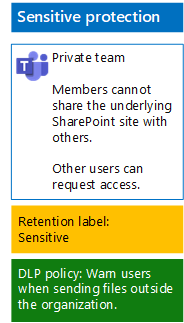

# Skydda filer i team med kvarhållningsetiketter och DLP

 
Använd anvisningarna i den här artikeln för att utforma och distribuera kvarhållningsetiketter och principer för dataförlustskydd (DLP) för grundläggande, känsliga och strikt konfidentiella team och de underliggande SharePoint-webbplatserna. Mer information om de här tre nivåerna av skydd finns i [Skydda filer i Microsoft Teams](secure-files-in-teams.md).
  
## Så här fungerar det

1. Skapa de önskade kvarhållningsetiketterna och publicera dem. Det kan ta upp till 12 timmar innan de publiceras.
2. För de önskade underliggande SharePoint-webbplatserna redigerar du dokumentbiblioteksinställningarna så att de önskade kvarhållningsetiketterna används för objekt i biblioteket.
3. Skapa DLP-principer för åtgärder baserat på kvarhållningsetiketter.

När användare lägger till ett dokument i det underliggande SharePoint-webbplatsbiblioteket för teamet får dokumentet den tilldelade kvarhållningsetiketten som standard. Användare kan ändra etiketten om det behövs. När en användare delar ett dokument utanför organisationen kommer DLP att kontrollera om en etikett har tilldelats och vidta åtgärder om en DLP-princip matchar etiketten. DLP kommer även att leta efter andra principmatchningar, t.ex. för att skydda filer med kreditkortsnummer om den typen av princip har konfigurerats. 

## Kvarhållningsetiketter för dina underliggande SharePoint-webbplatser

Det finns tre faser för att skapa och sedan tilldela kvarhållningsetiketter för de underliggande SharePoint-webbplatserna.
  
### Steg 1: Bestäm namnen på kvarhållningsetiketterna

I den här fasen bestämmer du namnen på dina kvarhållningsetiketter för de fyra nivåerna av informationsskydd som tillämpas på underliggande SharePoint-webbplatser. I följande tabell visas de rekommenderade namnen för respektive nivå.
  
|**Skyddsnivå för underliggande SharePoint-webbplatser**|**Etikettnamn**|
|:-----|:-----|
|Baseline-Public    |Intern offentlig    |
|Baseline-Private    |Privat    |
|Känslig    |Känslig    |
|Strikt konfidentiell    |Strikt konfidentiell    |
   
### Steg 2: Skapa kvarhållningsetiketterna

I den här fasen skapar du och publicerar sedan de etiketter som du definierat för olika nivåer av informationsskydd.
  
1. Logga in på [efterlevnadsportalen för Microsoft 365](https://compliance.microsoft.com) med ett konto som har rollen som säkerhetsadministratör eller företagsadministratör.
    
2. På fliken **Start – Efterlevnad i Microsoft 365** i webbläsaren klickar du på **Klassifikationer > Etiketter**.
    
3. Klicka på **Kvarhållningsetiketter > Skapa en etikett**.
    
4. I fönstret **Namnge din etikett** skriver du namnet på etiketten och en beskrivning för administratörer och användare och klickar sedan på **Nästa**.

5. I fönstret **Filplansbeskrivningar** fyller du i efter behov och klickar sedan på **Nästa**.
    
6. I fönstret **Etikettinställningar** anger du vid behov **Kvarhållning** till **På** och konfigurerar kvarhållningsinställningarna. Klicka på **Nästa**.
    
7. I fönstret **Granska inställningarna** klickar du på **Skapa etiketten**.
    
8. Om du behöver ytterligare etiketter klickar du på **Skapa en etikett** och upprepar sedan steg 3–7 i den här proceduren efter behov.
    

### Publicera dina nya etiketter

Följ de här anvisningarna för att publicera de nya kvarhållningsetiketterna.
  
1. I fönstret **Etiketter** klickar du på fliken **Kvarhållningsetiketter** och sedan på **Publicera etiketter**.
    
2. I fönstret **Välj etiketter att publicera** klickar du på **Välj etiketter att publicera**.
    
3. I fönstret **Välj etiketter** klickar du på **Lägg till**, markerar alla fyra etiketterna och klickar på **Lägg till**.
    
4. Klicka på **Klar**.
    
5. I fönstret **Välj etiketter att publicera** klickar du på **Nästa**.
    
6. I fönstret **Välj platser** klickar du på **Nästa**.
    
7. I fönstret **Namnge principen** skriver du ett namn på uppsättningen med etiketter i **Namn** och klickar sedan på **Nästa**.
    
8. I fönstret **Granska inställningarna** klickar du på **Publicera etiketter** och sedan på **Stäng**.

    
### Steg 3: Tillämpa kvarhållningsetiketterna för dina underliggande SharePoint-webbplatser

Använd de här anvisningarna för att tillämpa kvarhållningsetiketterna för dokumentmapparna på de underliggande SharePoint-webbplatserna.
  
1.  Klicka på **Filer** i teamet och sedan på **Öppna i SharePoint**.

2. På den nya fliken för SharePoint-webbplatsen i webbläsaren klickar du på **Dokument**.
    
3. Klicka på inställningsikonen och sedan på **Inställningar för bibliotek**.
    
4. Under **Behörigheter och hantering** klickar du på **Använd etikett för objekt i det här biblioteket**.
    
5. Välj önskad kvarhållningsetikett i **Inställningar – Använd etikett** och klicka sedan på **Spara**.
    
6. Stäng fliken för SharePoint-webbplatsen.
    
7. Upprepa steg 1–6 för att tilldela kvarhållningsetiketter till dina underliggande SharePoint-webbplatser.
    
Här är konfigurationsresultatet.
  

  
## DLP-principer för dina underliggande SharePoint-webbplatser

Använd följande steg för att konfigurera en DLP-princip som meddelar användare när de delar ett dokument på en underliggande SharePoint-webbplats utanför organisationen.

1. Logga in på [efterlevnadsportalen för Microsoft 365](https://compliance.microsoft.com/) med ett konto som har rollen som säkerhetsadministratör eller företagsadministratör.
    
2. På den nya fliken **Efterlevnad i Microsoft 365** i webbläsaren klickar du på **Principer > Dataförlustskydd**.
    
3. I fönstret **Start > Dataförlustskydd** klickar du på **Skapa en princip**.
    
4. I fönstret **Börja med en mall eller skapa en anpassad princip** klickar du på **Anpassad** och sedan på **Nästa**.
    
5. I fönstret **Namnge principen** skriver du namnet på DLP-principen för känslig nivå i **Namn** och klickar sedan på **Nästa**.
    
6. I fönstret **Välj platser** klickar du på **Låt mig välja specifika platser**. Klicka sedan på **Nästa**.
    
7. Inaktivera platserna **Exchange-e-post**, **OneDrive-konton** och **Chatt- och kanalmeddelanden i Teams** i listan med platser och klicka sedan på **Nästa**.
    
8. I fönstret **Anpassa typen av innehåll som du vill skydda** klickar du på **Redigera**.
    
9. I fönstret **Välj de typer av innehåll som ska skyddas** klickar du på **Lägg till** i listrutan och klickar sedan på **Kvarhållningsetiketter**.
    
10. I fönstret **Kvarhållningsetiketter** klickar du på **Lägg till**, väljer etiketten **Känslig**, klickar på **Lägg till** och sedan på **Klar**.
    
11. I fönstret **Välj de typer av innehåll som ska skyddas** klickar du på **Spara**.
    
12. I fönstret **Anpassa typen av innehåll som du vill skydda** klickar du på **Nästa**.

13. I fönstret **Vad vill du göra om vi identifierar känslig information?** klickar du på **Anpassa tips och e-post**.
    
14. I fönstret **Anpassa principtips och e-postmeddelanden** klickar du på **Anpassa principtipsets text**.
    
15. I textrutan skriver du eller klistrar in något av följande tips:
    
  - Om du vill dela med en användare utanför organisationen, laddar du ned filen och öppnar den. Klicka på Arkiv, Skydda dokument och Kryptera med lösenord och ange sedan ett starkt lösenord. Skicka lösenordet i ett separat e-postmeddelande eller med annat kommunikationssätt.
  - Strikt konfidentiella filer skyddas med kryptering. Bara externa användare som har beviljats åtkomst till dessa filer av IT-avdelningen kan läsa dem.
    
    Alternativt kan du skriva eller klistra in egna principtips som instruerar användarna om hur de delar en fil utanför organisationen.
    
16. Klicka på **OK**.
    
17. I fönstret **Vad vill du göra om vi identifierar känslig information?** klickar du på **Nästa**.
    
18. I fönstret **Vill du aktivera principen eller testa saker först?** klickar du på **Ja, aktivera direkt** och sedan på **Nästa**.
    
19. I fönstret **Granska inställningarna** klickar du på **Skapa** och sedan på **Stäng**.
    
Här är konfigurationsresultatet för känsliga team.
  

  
Använd följande steg för att konfigurera en DLP-princip som blockerar användare när de delar ett dokument på en underliggande SharePoint-webbplats utanför organisationen.
  
1. På den nya fliken **Efterlevnad i Microsoft 365** i webbläsaren klickar du på **Principer > Dataförlustskydd**.
    
2. I fönstret **Dataförlustskydd** klickar du på **Skapa en princip**.
    
3. I fönstret **Börja med en mall eller skapa en anpassad princip** klickar du på **Anpassad** och sedan på **Nästa**.
    
4. I fönstret **Namnge principen** skriver du namnet på DLP-principen för mycket känslig nivå i **Namn** och klickar sedan på **Nästa**.
    
5. I fönstret **Välj platser** klickar du på **Låt mig välja specifika platser**. Klicka sedan på **Nästa**.
    
6. Inaktivera platserna **Exchange-e-post**, **OneDrive-konton** och **Chatt- och kanalmeddelanden i Teams** i listan med platser och klicka sedan på **Nästa**.
    
7. I fönstret **Anpassa vilka typer av känslig information som du vill skydda** klickar du på **Redigera**.
    
8. I fönstret **Välj de typer av innehåll som ska skyddas** klickar du på **Lägg till** i listrutan och klickar sedan på **Kvarhållningsetiketter**.
    
9. I fönstret **Kvarhållningsetiketter** klickar du på **Lägg till**, väljer **Strikt konfidentiellt**, klickar på **Lägg till** och sedan på **Klar**.
    
10. I fönstret **Välj de typer av innehåll som ska skyddas** klickar du på **Spara**.
    
12. I **Anpassa vilka typer av känslig information som du vill skydda** klickar du på **Nästa**.
    
13. I fönstret **Vad vill du göra om vi identifierar känslig information?** klickar du på **Anpassa tips och e-post**.
    
14. I fönstret **Anpassa principtips och e-postmeddelanden** klickar du på **Anpassa principtipsets text**.
    
15. I textrutan skriver du eller klistrar in följande:
    
  - Om du vill dela med en användare utanför organisationen, laddar du ned filen och öppnar den. Klicka på Arkiv, Skydda dokument och Kryptera med lösenord och ange sedan ett starkt lösenord. Skicka lösenordet i ett separat e-postmeddelande eller med annat kommunikationssätt.
    
    Alternativt kan du skriva eller klistra in egna principtips som instruerar användarna om hur de delar en fil utanför organisationen.
    
16. Klicka på **OK**.
    
17. I fönstret **Vad vill du göra om vi identifierar känslig information?**, under **Identifiera när en viss mängd känslig information delas vid ett tillfälle**, klickar du på **Begränsa åtkomst eller kryptera innehållet** och klicka sedan på **Nästa**.
    
18. I fönstret **Vill du aktivera principen eller testa saker först?** klickar du på **Ja, aktivera direkt** och sedan på **Nästa**.
    
19. I fönstret **Granska inställningarna** klickar du på **Skapa** och sedan på **Stäng**.
    
Här är konfigurationsresultatet för strikt konfidentiellt team.
  

  
## Nästa steg

[Skydda filer i team med känslighetsetiketter](deploy-teams-sensitivity-labels.md)
    
## Se även

[Skydda filer i Microsoft Teams](secure-files-in-teams.md)
  
[Införande av moln- och hybridlösningar](https://docs.microsoft.com/office365/enterprise/cloud-adoption-and-hybrid-solutions)

