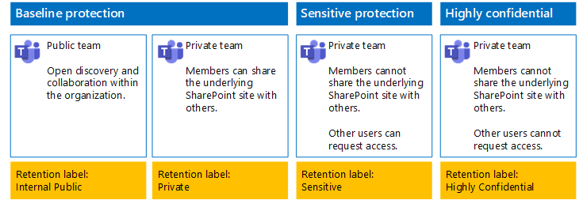

# Skydda filer i team med kvarhållningsetiketter och DLPProtect files in teams with retention labels and DLP

 
Använd anvisningarna i den här artikeln för att utforma och distribuera kvarhållningsetiketter och principer för dataförlustskydd (DLP) för grundläggande, känsliga och strikt konfidentiella team och de underliggande SharePoint-webbplatserna.Use the steps in this article to design and deploy retention labels and data loss prevention (DLP) policies for baseline, sensitive, and highly confidential teams and their underlying SharePoint sites. Mer information om de här tre nivåerna av skydd finns i [Skydda filer i Microsoft Teams](secure-files-in-teams.md).For more information about these three tiers of protection, see [Secure files in Microsoft Teams](secure-files-in-teams.md).
  
## Så här fungerar detHow this works

1. Skapa de önskade kvarhållningsetiketterna och publicera dem.Create the desired retention labels and publish these. Det kan ta upp till 12 timmar innan de publiceras.It can take up to 12 hours for these to be published.
2. För de önskade underliggande SharePoint-webbplatserna redigerar du dokumentbiblioteksinställningarna så att de önskade kvarhållningsetiketterna används för objekt i biblioteket.For the desired underlying SharePoint sites, edit the document library settings to apply the desired retention labels to items in the library.
3. Skapa DLP-principer för åtgärder baserat på kvarhållningsetiketter.Create DLP policies to take action based on the retention labels.

När användare lägger till ett dokument i det underliggande SharePoint-webbplatsbiblioteket för teamet får dokumentet den tilldelade kvarhållningsetiketten som standard.When users add a document to the underlying SharePoint site library for the team, the document will receive the assigned retention label by default. Användare kan ändra etiketten om det behövs.Users can change the label, if needed. När en användare delar ett dokument utanför organisationen kommer DLP att kontrollera om en etikett har tilldelats och vidta åtgärder om en DLP-princip matchar etiketten.When a user shares a document outside the organization, DLP will check to see if a label is assigned and take action if a DLP policy matches the label. DLP kommer även att leta efter andra principmatchningar, t.ex. för att skydda filer med kreditkortsnummer om den typen av princip har konfigurerats.DLP will look for other policy matches as well, such as protecting files with credit card numbers if this type of policy is configured. 

## Kvarhållningsetiketter för dina underliggande SharePoint-webbplatserRetention labels for your underlying SharePoint sites

Det finns tre faser för att skapa och sedan tilldela kvarhållningsetiketter för de underliggande SharePoint-webbplatserna.There are three phases to creating and then assigning retention labels to underlying SharePoint sites.
  
### Steg 1: Bestäm namnen på kvarhållningsetiketternaStep 1: Determine the retention label names

I den här fasen bestämmer du namnen på dina kvarhållningsetiketter för de fyra nivåerna av informationsskydd som tillämpas på underliggande SharePoint-webbplatser.In this phase, you determine the names of your retention labels for the four levels of information protection applied to underlying SharePoint sites. I följande tabell visas de rekommenderade namnen för respektive nivå.The following table lists the recommended names for each level.
  
|**Skyddsnivå för underliggande SharePoint-webbplatser****underlying SharePoint sites protection level**|**Etikettnamn****Label name**|
|:-----|:-----|
|Baseline-PublicBaseline-Public    |Intern offentligInternal public    |
|Baseline-PrivateBaseline-Private    |PrivatPrivate    |
|KänsligSensitive    |KänsligSensitive    |
|Strikt konfidentiellHighly Confidential    |Strikt konfidentiellHighly Confidential    |
   
### Steg 2: Skapa kvarhållningsetiketternaStep 2: Create the retention labels

I den här fasen skapar du och publicerar sedan de etiketter som du definierat för olika nivåer av informationsskydd.In this phase, you create and then publish your determined labels for the different levels of information protection.
  
1. Logga in på [efterlevnadsportalen för Microsoft 365](https://compliance.microsoft.com) med ett konto som har rollen som säkerhetsadministratör eller företagsadministratör.Sign in to the [Microsoft 365 compliance portal](https://compliance.microsoft.com) with an account that has the Security Administrator or Company Administrator role.
    
2. På fliken **Start – Efterlevnad i Microsoft 365** i webbläsaren klickar du på **Klassifikationer > Etiketter**.From the **Home - Microsoft 365 compliance** tab of your browser, click **Classifications > Labels**.
    
3. Klicka på **Kvarhållningsetiketter > Skapa en etikett**.Click **Retention labels > Create a label**.
    
4. I fönstret **Namnge din etikett** skriver du namnet på etiketten och en beskrivning för administratörer och användare och klickar sedan på **Nästa**.On the **Name your label** pane, type the name of the label and a description for admins and users, and then click **Next**.

5. I fönstret **Filplansbeskrivningar** fyller du i efter behov och klickar sedan på **Nästa**.On the **File plan descriptors** pane, fill in as needed, and then click **Next**.
    
6. I fönstret **Etikettinställningar** anger du vid behov **Kvarhållning** till **På** och konfigurerar kvarhållningsinställningarna.On the **Label settings** pane, if needed, set **Retention** to **On** and configure retention settings. Klicka på **Nästa**.Click **Next**.
    
7. I fönstret **Granska inställningarna** klickar du på **Skapa etiketten**.On the **Review your settings** pane, click **Create the label**.
    
8. Om du behöver ytterligare etiketter klickar du på **Skapa en etikett** och upprepar sedan steg 3–7 i den här proceduren efter behov.For your additional labels, click **Create a label**, and then repeat steps 3-7 in this procedure as needed.
    

### Publicera dina nya etiketterPublish your new labels

Följ de här anvisningarna för att publicera de nya kvarhållningsetiketterna.Next, use these steps to publish the new retention labels.
  
1. I fönstret **Etiketter** klickar du på fliken **Kvarhållningsetiketter** och sedan på **Publicera etiketter**.From the **Labels** pane, click the **Retention labels** tab, and then click **Publish labels**.
    
2. I fönstret **Välj etiketter att publicera** klickar du på **Välj etiketter att publicera**.On the **Choose labels to publish** pane, click **Choose labels to publish**.
    
3. I fönstret **Välj etiketter** klickar du på **Lägg till**, markerar alla fyra etiketterna och klickar på **Lägg till**.On the **Choose labels** pane, click **Add**, select all four labels, click **Add**.
    
4. Klicka på **Klar**.Click **Done**.
    
5. I fönstret **Välj etiketter att publicera** klickar du på **Nästa**.On the **Choose labels to publish** pane, click **Next**.
    
6. I fönstret **Välj platser** klickar du på **Nästa**.On the **Choose locations** pane, click **Next**.
    
7. I fönstret **Namnge principen** skriver du ett namn på uppsättningen med etiketter i **Namn** och klickar sedan på **Nästa**.On the **Name your policy** pane, type a name for your set of labels in **Name**, and then click **Next**.
    
8. I fönstret **Granska inställningarna** klickar du på **Publicera etiketter** och sedan på **Stäng**.On the **Review your settings** pane, click **Publish labels**, and then click **Close**.

    
### Steg 3: Tillämpa kvarhållningsetiketterna för dina underliggande SharePoint-webbplatserStep 3: Apply the retention labels to your underlying SharePoint sites

Använd de här anvisningarna för att tillämpa kvarhållningsetiketterna för dokumentmapparna på de underliggande SharePoint-webbplatserna.Use these steps to apply the retention labels to the documents folders of your underlying SharePoint sites.
  
1.  Klicka på **Filer** i teamet och sedan på **Öppna i SharePoint**.From the team, click **Files**, and then click **Open in SharePoint**.

2. På den nya fliken för SharePoint-webbplatsen i webbläsaren klickar du på **Dokument**.In the new SharePoint site tab of your browser, click **Documents**.
    
3. Klicka på inställningsikonen och sedan på **Inställningar för bibliotek**.Click the settings icon, and then click **Library settings**.
    
4. Under **Behörigheter och hantering** klickar du på **Använd etikett för objekt i det här biblioteket**.Under **Permissions and Management**, click **Apply label to items in this library**.
    
5. Välj önskad kvarhållningsetikett i **Inställningar – Använd etikett** och klicka sedan på **Spara**.In **Settings-Apply Label**, select the appropriate retention label, and then click **Save**.
    
6. Stäng fliken för SharePoint-webbplatsen.Close the tab for the SharePoint site.
    
7. Upprepa steg 1–6 för att tilldela kvarhållningsetiketter till dina underliggande SharePoint-webbplatser.Repeat steps 1-6 to assign retention labels to your additional underlying SharePoint sites.
    
Här är konfigurationsresultatet.Here is your resulting configuration.
  

  
## DLP-principer för dina underliggande SharePoint-webbplatserDLP policies for your underlying SharePoint sites

Använd följande steg för att konfigurera en DLP-princip som meddelar användare när de delar ett dokument på en underliggande SharePoint-webbplats utanför organisationen.Use these steps to configure a DLP policy that notifies users when they share a document on an underlying SharePoint site outside the organization.

1. Logga in på [efterlevnadsportalen för Microsoft 365](https://compliance.microsoft.com/) med ett konto som har rollen som säkerhetsadministratör eller företagsadministratör.Sign in to the [Microsoft 365 compliance portal](https://compliance.microsoft.com/) with an account that has the Security Administrator or Company Administrator role.
    
2. På den nya fliken **Efterlevnad i Microsoft 365** i webbläsaren klickar du på **Principer > Dataförlustskydd**.On the new **Microsoft 365 compliance** tab in your browser, click **Policies > Data loss prevention**.
    
3. I fönstret **Start > Dataförlustskydd** klickar du på **Skapa en princip**.In the **Home > Data loss prevention** pane, click **Create a policy**.
    
4. I fönstret **Börja med en mall eller skapa en anpassad princip** klickar du på **Anpassad** och sedan på **Nästa**.In the **Start with a template or create a custom policy** pane, click **Custom**, and then click **Next**.
    
5. I fönstret **Namnge principen** skriver du namnet på DLP-principen för känslig nivå i **Namn** och klickar sedan på **Nästa**.In the **Name your policy** pane, type the name for the sensitive level DLP policy in **Name**, and then click **Next**.
    
6. I fönstret **Välj platser** klickar du på **Låt mig välja specifika platser**. Klicka sedan på **Nästa**.In the **Choose locations** pane, click **Let me choose specific locations**, and then click **Next**.
    
7. Inaktivera platserna **Exchange-e-post**, **OneDrive-konton** och **Chatt- och kanalmeddelanden i Teams** i listan med platser och klicka sedan på **Nästa**.In the list of locations, disable the **Exchange email**, **OneDrive accounts**, and **Teams chat and channel messages** locations, and then click **Next**.
    
8. I fönstret **Anpassa typen av innehåll som du vill skydda** klickar du på **Redigera**.In the **Customize the type of content you want to protect** pane, click **Edit**.
    
9. I fönstret **Välj de typer av innehåll som ska skyddas** klickar du på **Lägg till** i listrutan och klickar sedan på **Kvarhållningsetiketter**.In the **Choose the types of content to protect** pane, click **Add** in the drop-down box, and then click **Retention labels**.
    
10. I fönstret **Kvarhållningsetiketter** klickar du på **Lägg till**, väljer etiketten **Känslig**, klickar på **Lägg till** och sedan på **Klar**.In the **Retention labels** pane, click **Add**, select the **Sensitive** label, click **Add**, and then click **Done**.
    
11. I fönstret **Välj de typer av innehåll som ska skyddas** klickar du på **Spara**.In the **Choose the types of content to protect** pane, click **Save**.
    
12. I fönstret **Anpassa typen av innehåll som du vill skydda** klickar du på **Nästa**.In the **Customize the type of content you want to protect** pane, click **Next**.

13. I fönstret **Vad vill du göra om vi identifierar känslig information?** klickar du på **Anpassa tips och e-post**.In the **What do you want to do if we detect sensitive info?** pane, click **Customize the tip and email**.
    
14. I fönstret **Anpassa principtips och e-postmeddelanden** klickar du på **Anpassa principtipsets text**.In the **Customize policy tips and email notifications** pane, click **Customize the policy tip text**.
    
15. I textrutan skriver du eller klistrar in något av följande tips:In the text box, type or paste in one of the following tips:
    
  - Om du vill dela med en användare utanför organisationen, laddar du ned filen och öppnar den.To share with a user outside the organization, download the file and then open it. Klicka på Arkiv, Skydda dokument och Kryptera med lösenord och ange sedan ett starkt lösenord.Click File, then Protect Document, and then Encrypt with Password, and then specify a strong password. Skicka lösenordet i ett separat e-postmeddelande eller med annat kommunikationssätt.Send the password in a separate email or other means of communication.
  - Strikt konfidentiella filer skyddas med kryptering.Highly confidential files are protected with encryption. Bara externa användare som har beviljats åtkomst till dessa filer av IT-avdelningen kan läsa dem.Only external users who are granted permissions to these files by your IT department can read them.
    
    Alternativt kan du skriva eller klistra in egna principtips som instruerar användarna om hur de delar en fil utanför organisationen.Alternately, type or paste in your own policy tip that instructs users on how to share a file outside your organization.
    
16. Klicka på **OK**.Click **OK**.
    
17. I fönstret **Vad vill du göra om vi identifierar känslig information?** klickar du på **Nästa**.In the **What do you want to do if we detect sensitive info?** pane, click **Next**.
    
18. I fönstret **Vill du aktivera principen eller testa saker först?** klickar du på **Ja, aktivera direkt** och sedan på **Nästa**.In the **Do you want to turn on the policy or test things out first?** pane, click **Yes, turn it on right away**, and then click **Next**.
    
19. I fönstret **Granska inställningarna** klickar du på **Skapa** och sedan på **Stäng**.In the **Review your settings** pane, click **Create**, and then click **Close**.
    
Här är konfigurationsresultatet för känsliga team.Here is your resulting configuration for sensitive teams.
  

  
Använd följande steg för att konfigurera en DLP-princip som blockerar användare när de delar ett dokument på en underliggande SharePoint-webbplats utanför organisationen.Next, use these steps to configure a DLP policy that blocks users when they share a document on an underlying SharePoint site outside the organization.
  
1. På den nya fliken **Efterlevnad i Microsoft 365** i webbläsaren klickar du på **Principer > Dataförlustskydd**.On the new **Microsoft 365 compliance** tab in your browser, click **Policies > Data loss prevention**.
    
2. I fönstret **Dataförlustskydd** klickar du på **Skapa en princip**.In the **Data loss prevention** pane, click **Create a policy**.
    
3. I fönstret **Börja med en mall eller skapa en anpassad princip** klickar du på **Anpassad** och sedan på **Nästa**.In the **Start with a template or create a custom policy** pane, click **Custom**, and then click **Next**.
    
4. I fönstret **Namnge principen** skriver du namnet på DLP-principen för mycket känslig nivå i **Namn** och klickar sedan på **Nästa**.In the **Name your policy** pane, type the name for the highly sensitive level DLP policy in **Name**, and then click **Next**.
    
5. I fönstret **Välj platser** klickar du på **Låt mig välja specifika platser**. Klicka sedan på **Nästa**.In the **Choose locations** pane, click **Let me choose specific locations**, and then click **Next**.
    
6. Inaktivera platserna **Exchange-e-post**, **OneDrive-konton** och **Chatt- och kanalmeddelanden i Teams** i listan med platser och klicka sedan på **Nästa**.In the list of locations, disable the **Exchange email**, **OneDrive accounts**, and **Teams chat and channel messages** locations, and then click **Next**.
    
7. I fönstret **Anpassa vilka typer av känslig information som du vill skydda** klickar du på **Redigera**.In the **Customize the types of sensitive info you want to protect** pane, click **Edit**.
    
8. I fönstret **Välj de typer av innehåll som ska skyddas** klickar du på **Lägg till** i listrutan och klickar sedan på **Kvarhållningsetiketter**.In the **Choose the types of content to protect** pane, click **Add** in the drop-down box, and then click **Retention labels**.
    
9. I fönstret **Kvarhållningsetiketter** klickar du på **Lägg till**, väljer **Strikt konfidentiellt**, klickar på **Lägg till** och sedan på **Klar**.In the **Retention labels** pane, click **Add**, select the **Highly Confidential** label, click **Add**, and then click **Done**.
    
10. I fönstret **Välj de typer av innehåll som ska skyddas** klickar du på **Spara**.In the **Choose the types of content to protect** pane, click **Save**.
    
12. I **Anpassa vilka typer av känslig information som du vill skydda** klickar du på **Nästa**.In the **Customize the types of sensitive info you want to protect** pane, click **Next**.
    
13. I fönstret **Vad vill du göra om vi identifierar känslig information?** klickar du på **Anpassa tips och e-post**.In the **What do you want to do if we detect sensitive info?** pane, click **Customize the tip and email**.
    
14. I fönstret **Anpassa principtips och e-postmeddelanden** klickar du på **Anpassa principtipsets text**.In the **Customize policy tips and email notifications** pane, click **Customize the policy tip text**.
    
15. I textrutan skriver du eller klistrar in följande:In the text box, type or paste in the following:
    
  - Om du vill dela med en användare utanför organisationen, laddar du ned filen och öppnar den.To share with a user outside the organization, download the file and then open it. Klicka på Arkiv, Skydda dokument och Kryptera med lösenord och ange sedan ett starkt lösenord.Click File, then Protect Document, and then Encrypt with Password, and then specify a strong password. Skicka lösenordet i ett separat e-postmeddelande eller med annat kommunikationssätt.Send the password in a separate email or other means of communication.
    
    Alternativt kan du skriva eller klistra in egna principtips som instruerar användarna om hur de delar en fil utanför organisationen.Alternately, type or paste in your own policy tip that instructs users on how to share a file outside your organization.
    
16. Klicka på **OK**.Click **OK**.
    
17. I fönstret **Vad vill du göra om vi identifierar känslig information?**, under **Identifiera när en viss mängd känslig information delas vid ett tillfälle**, klickar du på **Begränsa åtkomst eller kryptera innehållet** och klicka sedan på **Nästa**.In the **What do you want to do if we detect sensitive info?** pane, under **Detect when a specific amount of sensitive info is being shared at one time**, click **Restrict access or encrypt the content**, and then click **Next**.
    
18. I fönstret **Vill du aktivera principen eller testa saker först?** klickar du på **Ja, aktivera direkt** och sedan på **Nästa**.In the **Do you want to turn on the policy or test things out first?** pane, click **Yes, turn it on right away**, and then click **Next**.
    
19. I fönstret **Granska inställningarna** klickar du på **Skapa** och sedan på **Stäng**.In the **Review your settings** pane, click **Create**, and then click **Close**.
    
Här är konfigurationsresultatet för strikt konfidentiellt team.Here is your resulting configuration for high confidentiality team.
  

  
## Nästa stegNext step

[Skydda filer i team med känslighetsetiketterProtect files in teams with sensitivity labels](deploy-teams-sensitivity-labels.md)
    
## Se ävenSee Also

[Skydda filer i Microsoft TeamsSecure files in Microsoft Teams](secure-files-in-teams.md)
  
[Införande av moln- och hybridlösningarCloud adoption and hybrid solutions](https://docs.microsoft.com/office365/enterprise/cloud-adoption-and-hybrid-solutions)

