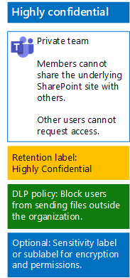

# Skydda filer i team med känslighetsetiketterProtect files in teams with sensitivity labels

Till skillnad från en känslighetsetikett för strikt reglerade data som alla kan tillämpa på valfri fil behöver ett team med höga konfidentialitetskrav en egen etikett eller underetikett så att tilldelade filer:Unlike a sensitivity label for highly regulated data that anyone can apply to any file, a highly confidential team needs its own label or sublabel so that assigned files:

- Krypteras individuellt.Are individually encrypted.
- Innehåller anpassade behörigheter så att bara medlemmar i teamet kan öppna dem.Contain custom permissions so that only members of the team can open it.

För att åstadkomma den här extra säkerhetsnivån för filer i den underliggande SharePoint-webbplatsen för ett team måste du konfigurera en anpassad känslighetsetikett som antingen är en egen etikett eller en underetikett för den allmänna etiketten för strikt reglerade data.To accomplish this additional level of security for files stored in the underlying SharePoint site of a team, you must configure a customized sensitivity label that is either its own label or a sublabel of the general label for highly regulated data. Bara teammedlemmarna kommer att se den anpassade etiketten eller underetiketten i sin lista med etiketter.Only team members will see the customized label or sublabel in their list of labels.

Använd en känslighetsetikett när du behöver ett litet antal etiketter får både global användning och enskilda privata team.Use a sensitivity label when you need a small number of labels for both global use and individual private teams. 

Använd en underetikett för känslighet när du har ett stort antal etiketter eller vill ordna etiketter för team med höga konfidentialitetskrav under strikt reglerade-etiketten.Use a sensitivity sublabel when you have a large number of labels or want to organize labels for highly confidential teams under the highly regulated label.

Använd [de här instruktionerna](https://docs.microsoft.com/microsoft-365/compliance/encryption-sensitivity-labels) till att konfigurera en separat etikett eller en underetikett med följande inställningar:Use [these instructions](https://docs.microsoft.com/microsoft-365/compliance/encryption-sensitivity-labels) to configure a separate label or a sublabel with the following settings:

- Namnet på etiketten eller underetiketten innehåller teamets namnThe name of the label or sublabel contains the name of the team
- Kryptering är aktiveratEncryption is enabled
- Office 365-gruppen för teamet har medförfattarbehörighetThe Office 365 group for the team has Co-Author permissions

När den nya etiketten eller underetiketten har skapats kan du publicera den för dina användare, som sedan kan tillämpa den på filer, antingen lokalt innan de laddas upp till teamet eller senare när filen lagras i teamet.After creating, publish the new label or sublabel for your users, who can then apply them to files either locally before uploading them to the team or later once the file is stored in the team.

Här är konfigurationen för teamet med höga konfidentialitetskrav som använder känslighetsetiketter för filkryptering och behörigheter.Here is the configuration of the highly confidential team that uses sensitivity labels for file encryption and permissions.

## Se ävenSee Also

[Säkra filer i Microsoft TeamsSecure files in Microsoft Teams](secure-files-in-teams.md)
  
[Integrering av moln- och hybridlösningarCloud adoption and hybrid solutions](https://docs.microsoft.com/office365/enterprise/cloud-adoption-and-hybrid-solutions)
