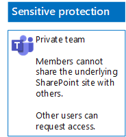

# Distribuera team för tre skyddsnivåer för filer

Använd anvisningarna i den här artikeln för att utforma och distribuera baslinjeteam samt känsliga eller strikt konfidentiella team. Mer information om de här tre nivåerna av skydd finns i [Skydda filer i Microsoft Teams](secure-files-in-teams.md).

## Baslinjeteam

Baslinjeskydd omfattar både offentliga och privata team. Offentliga team kan upptäckas och användas av alla i organisationen. Privata webbplatser kan bara upptäckas och användas av medlemmar i den Office 365-grupp som är kopplad till teamet. Medlemmar i båda dessa typer av team kan dela webbplatsen med andra.

### Offentlig

Följ anvisningarna i [den här artikeln](https://support.office.com/article/174adf5f-846b-4780-b765-de1a0a737e2b) om du vill skapa ett baslinjeteam med offentlig åtkomst och behörigheter.

Här är konfigurationsresultatet.

### Privat

Följ anvisningarna i [den här artikeln](https://support.office.com/article/174adf5f-846b-4780-b765-de1a0a737e2b) om du vill skapa ett baslinjeteam med privat åtkomst och behörigheter.

Här är konfigurationsresultatet.

## Känsliga team

För ett känsligt team börjar du med att [skapa ett privat team](https://support.office.com/article/174adf5f-846b-4780-b765-de1a0a737e2b).

Därefter konfigurerar du den underliggande SharePoint-webbplatsen så att teammedlemmar inte kan dela.

1. I verktygsfältet för teamet klickar du på **Filer**.

2. Klicka på ellipsen och sedan på **Öppna i SharePoint**.

3. Klicka på inställningsikonen i verktygsfältet på den underliggande SharePoint-webbplatsen och klicka sedan på **Webbplatsbehörigheter**.

4. I fönstret **Webbplatsbehörigheter** under **Delningsinställningar** klickar du på **Ändra delningsinställningar**.

5. Under **Delningsbehörigheter** väljer du **Endast webbplatsens ägare kan dela filer, mappar och webbplatsen**. Klicka sedan på **Spara**.

Här är konfigurationsresultatet.

## Strikt konfidentiella team

För ett strikt konfidentiellt team börjar du med att [skapa ett privat team](https://support.office.com/article/174adf5f-846b-4780-b765-de1a0a737e2b).

Därefter konfigurerar du den underliggande SharePoint-webbplatsen så att teammedlemmar inte kan dela och för att förhindra att personer som inte är medlemmar i teamet kan begära åtkomst.

1. I verktygsfältet för teamet klickar du på **Filer**.

2. Klicka på ellipsen och sedan på **Öppna i SharePoint**.

3. Klicka på inställningsikonen i verktygsfältet på den underliggande SharePoint-webbplatsen och klicka sedan på **Webbplatsbehörigheter**.

4. I fönstret **Webbplatsbehörigheter** under **Delningsinställningar** klickar du på **Ändra delningsinställningar**.

5. Under **Delningsbehörigheter** väljer du **Endast webbplatsens ägare kan dela filer, mappar och webbplatsen**.

6. Inaktivera **Tillåt åtkomstbegäranden** och klicka sedan på **Spara**.

Här är konfigurationsresultatet.

## Nästa steg

[Skydda filer i team med kvarhållningsetiketter och DLP](deploy-teams-retention-DLP.md)

## Se även

[Skydda filer i Microsoft Teams](secure-files-in-teams.md)

[Integrering av moln- och hybridlösningar](https://docs.microsoft.com/office365/enterprise/cloud-adoption-and-hybrid-solutions)
