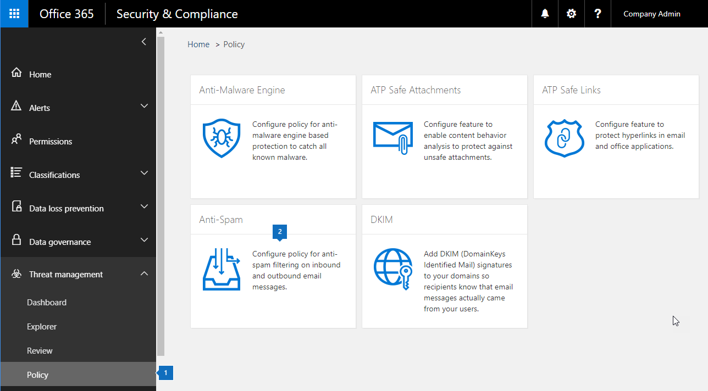

# <a name="enable-or-disable-safety-tips-in-office-365"></a><span data-ttu-id="c228f-103">Aktivera eller inaktivera säkerhetstips i Office 365</span><span class="sxs-lookup"><span data-stu-id="c228f-103">Enable or disable safety tips in Office 365</span></span>

<span data-ttu-id="c228f-104">Exchange Online Protection (EOP) lägger till, eller stämplar, ett säkerhetstips till e-postmeddelanden som det levererar.</span><span class="sxs-lookup"><span data-stu-id="c228f-104">Exchange Online Protection (EOP) adds, or stamps, a safety tip to email messages that it delivers.</span></span> <span data-ttu-id="c228f-105">De här säkerhetstipsen ger mottagarna ett snabbt och visuellt sätt att avgöra om ett meddelande kommer från en säker, verifierad avsändare, om meddelandet har markerats som skräppost av Office 365, om meddelandet innehåller något misstänkt, till exempel ett nätfiskebedrägeri, eller om externa bilder har Spärrats.</span><span class="sxs-lookup"><span data-stu-id="c228f-105">These safety tips provide recipients with a quick, visual way to determine if a message is from a safe, verified sender, if the message has been marked as spam by Office 365, if the message contains something suspicious such as a phishing scam, or if external images have been blocked.</span></span> <span data-ttu-id="c228f-106">Office 365- och EOP-fristående administratörer kan redigera en skräppostprincipinställning för att aktivera eller inaktivera säkerhetstips från att visas i e-post i Outlook och andra e-postklienter för stationära datorer.</span><span class="sxs-lookup"><span data-stu-id="c228f-106">Office 365 and EOP-standalone admins can edit a spam policy setting to enable or disable safety tips from being displayed in email in Outlook and other desktop email clients.</span></span>

<span data-ttu-id="c228f-107">Office 365 aktiverar säkerhetstips som standard för din organisation och vi rekommenderar att du låter dem vara aktiverade för att bekämpa skräppost och nätfiskeattacker.</span><span class="sxs-lookup"><span data-stu-id="c228f-107">Office 365 enables safety tips by default for your organization and we recommend that you leave them enabled to help combat spam and phishing attacks.</span></span> <span data-ttu-id="c228f-108">Du kan inte inaktivera säkerhetstips för Outlook på webben.</span><span class="sxs-lookup"><span data-stu-id="c228f-108">You can't disable safety tips for Outlook on the web.</span></span>

<span data-ttu-id="c228f-109">Information om hur du ser exempel och lär dig mer om informationen i säkerhetstipsen finns [i Säkerhetstips i e-postmeddelanden i Office 365.](safety-tips-in-office-365.md)</span><span class="sxs-lookup"><span data-stu-id="c228f-109">To see examples and to learn about the information displayed in safety tips, see [Safety tips in email messages in Office 365.](safety-tips-in-office-365.md)</span></span>

<span data-ttu-id="c228f-110">I det här avsnittet:</span><span class="sxs-lookup"><span data-stu-id="c228f-110">In this topic:</span></span>

- [<span data-ttu-id="c228f-111">Så här aktiverar eller inaktiverar du säkerhetstips &amp; med hjälp av Säkerhetsefterlevnadscenter för Office 365</span><span class="sxs-lookup"><span data-stu-id="c228f-111">To enable or disable safety tips by using the Office 365 Security &amp; Compliance Center</span></span>](enable-or-disable-safety-tips.md#SandCCsafetytip)

- [<span data-ttu-id="c228f-112">Så här aktiverar eller inaktiverar du säkerhetstips med powershell</span><span class="sxs-lookup"><span data-stu-id="c228f-112">To enable or disable safety tips by using PowerShell</span></span>](enable-or-disable-safety-tips.md#pshellsafetytip)

## <a name="to-enable-or-disable-safety-tips-by-using-the-office-365-security-amp-compliance-center"></a><span data-ttu-id="c228f-113">Så här aktiverar eller inaktiverar du säkerhetstips &amp; med hjälp av Säkerhetsefterlevnadscenter för Office 365</span><span class="sxs-lookup"><span data-stu-id="c228f-113">To enable or disable safety tips by using the Office 365 Security &amp; Compliance Center</span></span>
<span data-ttu-id="c228f-114"><a name="SandCCsafetytip"> </a></span><span class="sxs-lookup"><span data-stu-id="c228f-114"><a name="SandCCsafetytip"> </a></span></span>

1. <span data-ttu-id="c228f-115">Gå till [https://protection.office.com](https://protection.office.com).</span><span class="sxs-lookup"><span data-stu-id="c228f-115">Go to [https://protection.office.com](https://protection.office.com).</span></span>

2. <span data-ttu-id="c228f-116">Logga in på Office 365 med ditt arbets- eller skolkonto.</span><span class="sxs-lookup"><span data-stu-id="c228f-116">Sign in to Office 365 with your work or school account.</span></span>

3. <span data-ttu-id="c228f-117">Välj **policy** **för hantering av** \> hot .</span><span class="sxs-lookup"><span data-stu-id="c228f-117">Choose **Threat Management** \> **Policy**.</span></span>

4. <span data-ttu-id="c228f-118">På **sidan Policy** väljer du **Anti-Spam**.</span><span class="sxs-lookup"><span data-stu-id="c228f-118">On the **Policy** page, choose **Anti-Spam**.</span></span>

    

5. <span data-ttu-id="c228f-120">Välj fliken **Anpassad** på sidan Inställningar **för skräppost.**</span><span class="sxs-lookup"><span data-stu-id="c228f-120">On the **Anti-spam settings** page choose the **Custom** tab.</span></span>

    

6. <span data-ttu-id="c228f-122">Om det behövs väljer du **växeln Anpassade inställningar** för att aktivera anpassade inställningar.</span><span class="sxs-lookup"><span data-stu-id="c228f-122">If necessary, choose the **Custom settings** switch to turn on custom settings.</span></span> <span data-ttu-id="c228f-123">Om växeln för anpassade inställningar är inställd **på Av**kan du inte ändra principer för skräppostfilter.</span><span class="sxs-lookup"><span data-stu-id="c228f-123">If the custom settings switch is set to **Off**, you won't be able to modify spam filter policies.</span></span>

    

7. <span data-ttu-id="c228f-125">Expandera den skräppostprincip som du vill ändra och välj sedan **Redigera princip**.</span><span class="sxs-lookup"><span data-stu-id="c228f-125">Expand the spam policy you want to modify and then choose **Edit policy**.</span></span> <span data-ttu-id="c228f-126">Välj till exempel nedpilen bredvid **Standardsynrofilfilterprincip**.</span><span class="sxs-lookup"><span data-stu-id="c228f-126">For example, choose the down arrow next to **Default spam filter policy**.</span></span> <span data-ttu-id="c228f-127">Om du vill kan du skapa en ny princip genom att välja **Lägg till en princip**.</span><span class="sxs-lookup"><span data-stu-id="c228f-127">Or, if you want, you can create a new policy by choosing **Add a policy**.</span></span>

8. <span data-ttu-id="c228f-128">Expandera **skräppost och massåtgärder.**</span><span class="sxs-lookup"><span data-stu-id="c228f-128">Expand **Spam and bulk** actions.</span></span>

9. <span data-ttu-id="c228f-129">Om du vill aktivera säkerhetstips markerar du kryssrutan **På** under **Säkerhetstips.**</span><span class="sxs-lookup"><span data-stu-id="c228f-129">To enable safety tips, under **Safety Tips**, check the **On** checkbox.</span></span> <span data-ttu-id="c228f-130">Om du vill inaktivera säkerhetstips avmarkerar du kryssrutan **På.**</span><span class="sxs-lookup"><span data-stu-id="c228f-130">To disable safety tips, clear the **On** checkbox.</span></span>

10. <span data-ttu-id="c228f-131">Välj **Save**.</span><span class="sxs-lookup"><span data-stu-id="c228f-131">Choose **Save**.</span></span>

## <a name="to-enable-or-disable-safety-tips-by-using-powershell"></a><span data-ttu-id="c228f-132">Så här aktiverar eller inaktiverar du säkerhetstips med powershell</span><span class="sxs-lookup"><span data-stu-id="c228f-132">To enable or disable safety tips by using PowerShell</span></span>
<span data-ttu-id="c228f-133"><a name="pshellsafetytip"> </a></span><span class="sxs-lookup"><span data-stu-id="c228f-133"><a name="pshellsafetytip"> </a></span></span>

<span data-ttu-id="c228f-134">Administratörer kan använda Exchange Online PowerShell för att aktivera eller inaktivera säkerhetstips.</span><span class="sxs-lookup"><span data-stu-id="c228f-134">Admins can use Exchange Online PowerShell to enable or disable safety tips.</span></span> <span data-ttu-id="c228f-135">Använd cmdlet set-hostedContentFilterPolicy för att aktivera eller inaktivera säkerhetstips i en skräppostfilterprincip.</span><span class="sxs-lookup"><span data-stu-id="c228f-135">Use the Set-HostedContentFilterPolicy cmdlet to enable or disable safety tips in a spam filter policy.</span></span>

1. <span data-ttu-id="c228f-136">Anslut till Exchange Online PowerShell.</span><span class="sxs-lookup"><span data-stu-id="c228f-136">Connect to Exchange Online PowerShell.</span></span> <span data-ttu-id="c228f-137">Mer information finns i [Ansluta till Exchange Online PowerShell](https://docs.microsoft.com/powershell/exchange/exchange-online/connect-to-exchange-online-powershell/connect-to-exchange-online-powershell).</span><span class="sxs-lookup"><span data-stu-id="c228f-137">For information, see [Connect to Exchange Online PowerShell](https://docs.microsoft.com/powershell/exchange/exchange-online/connect-to-exchange-online-powershell/connect-to-exchange-online-powershell).</span></span>

2. <span data-ttu-id="c228f-138">Kör cmdlet set-hostedContentFilterPolicy för att aktivera eller inaktivera säkerhetstips:</span><span class="sxs-lookup"><span data-stu-id="c228f-138">Run the Set-HostedContentFilterPolicy cmdlet to enable or disable safety tips:</span></span>

   ```powershell
   Set-HostedContentFilterPolicy -Identity "policy name " -InlineSafetyTipsEnabled <$true | $false>
   ```

<span data-ttu-id="c228f-139">Där:</span><span class="sxs-lookup"><span data-stu-id="c228f-139">Where:</span></span>

- <span data-ttu-id="c228f-140">*principnamnet* är namnet på den princip som du vill ändra, till exempel **standard**.</span><span class="sxs-lookup"><span data-stu-id="c228f-140">*policy name*  is the name of the policy you want to modify, for example **default**.</span></span>

- <span data-ttu-id="c228f-141">`$true`aktiverar säkerhetstips för spamfilterpolicyn.</span><span class="sxs-lookup"><span data-stu-id="c228f-141">`$true` enables safety tips for the spam filter policy.</span></span>

- <span data-ttu-id="c228f-142">`$false`inaktiverar säkerhetstips för skräppostfilterpolicyn.</span><span class="sxs-lookup"><span data-stu-id="c228f-142">`$false` disables safety tips for the spam filter policy.</span></span>

<span data-ttu-id="c228f-143">Om du till exempel vill inaktivera säkerhetstips för standardprincipen för skräppostfilter kör du följande kommando:</span><span class="sxs-lookup"><span data-stu-id="c228f-143">For example, to disable safety tips for the default spam filter policy, run the following command:</span></span>

```powershell
Set-HostedContentFilterPolicy -Identity "default" -InlineSafetyTipsEnabled $false
```

<span data-ttu-id="c228f-144">Mer information om den här cmdleten finns i [Ange värdinnehållsfilterpolicy](https://docs.microsoft.com/powershell/module/exchange/antispam-antimalware/set-hostedcontentfilterpolicy).</span><span class="sxs-lookup"><span data-stu-id="c228f-144">For more information about this cmdlet, see [Set-HostedContentFilterPolicy](https://docs.microsoft.com/powershell/module/exchange/antispam-antimalware/set-hostedcontentfilterpolicy).</span></span>

## <a name="still-need-help"></a><span data-ttu-id="c228f-145">Vill du ha mer hjälp?</span><span class="sxs-lookup"><span data-stu-id="c228f-145">Still need help?</span></span>
<span data-ttu-id="c228f-146"><a name="pshellsafetytip"> </a></span><span class="sxs-lookup"><span data-stu-id="c228f-146"><a name="pshellsafetytip"> </a></span></span>

<span data-ttu-id="c228f-147">Om du inaktiverar säkerhetstips men fortfarande ser dem i dina e-postmeddelanden kontrollerar du följande:</span><span class="sxs-lookup"><span data-stu-id="c228f-147">If you disabled safety tips but are still seeing them in your email messages, check these things:</span></span>

- <span data-ttu-id="c228f-148">Du kan inte inaktivera säkerhetstips för Outlook på webben.</span><span class="sxs-lookup"><span data-stu-id="c228f-148">You can't disable safety tips for Outlook on the web.</span></span> <span data-ttu-id="c228f-149">Prova att visa samma e-post i en annan klient, till exempel Outlook.</span><span class="sxs-lookup"><span data-stu-id="c228f-149">Try viewing the same email in another client, such as Outlook.</span></span>

- <span data-ttu-id="c228f-150">Säkerhetstips är aktiverat som standard för alla som använder EOP, detta inkluderar alla som har Office 365.</span><span class="sxs-lookup"><span data-stu-id="c228f-150">Safety tips are on by default for every one who uses EOP, this includes everyone who has Office 365.</span></span> <span data-ttu-id="c228f-151">För att inaktivera säkerhetstips från att visas i e-post måste du inaktivera dem med hjälp av en policy för skräppostfilter som beskrivs i det här avsnittet.</span><span class="sxs-lookup"><span data-stu-id="c228f-151">In order to disable safety tips from showing up in email, you must disable them by using a spam filter policy as described in this topic.</span></span> <span data-ttu-id="c228f-152">När du har ställt in principen kontrollerar du att den är aktiverad.</span><span class="sxs-lookup"><span data-stu-id="c228f-152">Once you've set up the policy, ensure that it is enabled.</span></span> <span data-ttu-id="c228f-153">Information om hur du aktiverar principer för skräppostfilter finns i [Konfigurera principer för skräppostfilter](configure-your-spam-filter-policies.md).</span><span class="sxs-lookup"><span data-stu-id="c228f-153">For information on enabling spam filter policies, see [Configure your spam filter policies](configure-your-spam-filter-policies.md).</span></span>

<span data-ttu-id="c228f-154">Fler sätt att bekämpa skräppost och nätfiske finns i [Office 365 Email Anti-Spam Protection](anti-spam-protection.md).</span><span class="sxs-lookup"><span data-stu-id="c228f-154">For more ways to combat spam and phishing, see [Office 365 Email Anti-Spam Protection](anti-spam-protection.md).</span></span>
