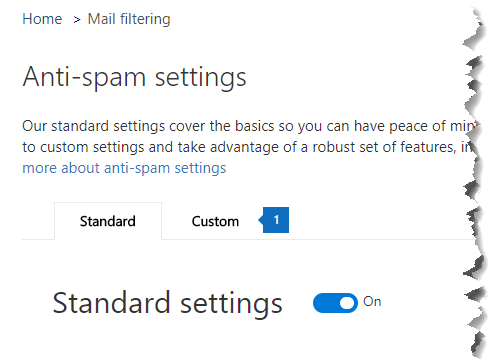

# <a name="enable-or-disable-safety-tips-in-office-365"></a>Aktivera eller inaktivera säkerhetstips i Office 365

Exchange Online Protection (EOP) lägger till, eller stämplar, ett säkerhetstips till e-postmeddelanden som det levererar. De här säkerhetstipsen ger mottagarna ett snabbt och visuellt sätt att avgöra om ett meddelande kommer från en säker, verifierad avsändare, om meddelandet har markerats som skräppost av Office 365, om meddelandet innehåller något misstänkt, till exempel ett nätfiskebedrägeri, eller om externa bilder har Spärrats. Office 365- och EOP-fristående administratörer kan redigera en skräppostprincipinställning för att aktivera eller inaktivera säkerhetstips från att visas i e-post i Outlook och andra e-postklienter för stationära datorer.

Office 365 aktiverar säkerhetstips som standard för din organisation och vi rekommenderar att du låter dem vara aktiverade för att bekämpa skräppost och nätfiskeattacker. Du kan inte inaktivera säkerhetstips för Outlook på webben.

Information om hur du ser exempel och lär dig mer om informationen i säkerhetstipsen finns [i Säkerhetstips i e-postmeddelanden i Office 365.](safety-tips-in-office-365.md)

I det här avsnittet:

- [Så här aktiverar eller inaktiverar du säkerhetstips &amp; med hjälp av Säkerhetsefterlevnadscenter för Office 365](enable-or-disable-safety-tips.md#SandCCsafetytip)

- [Så här aktiverar eller inaktiverar du säkerhetstips med powershell](enable-or-disable-safety-tips.md#pshellsafetytip)

## <a name="to-enable-or-disable-safety-tips-by-using-the-office-365-security-amp-compliance-center"></a>Så här aktiverar eller inaktiverar du säkerhetstips &amp; med hjälp av Säkerhetsefterlevnadscenter för Office 365
<a name="SandCCsafetytip"> </a>

1. Gå till [https://protection.office.com](https://protection.office.com).

2. Logga in på Office 365 med ditt arbets- eller skolkonto.

3. Välj **policy** **för hantering av** \> hot .

4. På **sidan Policy** väljer du **Anti-Spam**.

    

5. Välj fliken **Anpassad** på sidan Inställningar **för skräppost.**

    

6. Om det behövs väljer du **växeln Anpassade inställningar** för att aktivera anpassade inställningar. Om växeln för anpassade inställningar är inställd **på Av**kan du inte ändra principer för skräppostfilter.

    

7. Expandera den skräppostprincip som du vill ändra och välj sedan **Redigera princip**. Välj till exempel nedpilen bredvid **Standardsynrofilfilterprincip**. Om du vill kan du skapa en ny princip genom att välja **Lägg till en princip**.

8. Expandera **skräppost och massåtgärder.**

9. Om du vill aktivera säkerhetstips markerar du kryssrutan **På** under **Säkerhetstips.** Om du vill inaktivera säkerhetstips avmarkerar du kryssrutan **På.**

10. Välj **Save**.

## <a name="to-enable-or-disable-safety-tips-by-using-powershell"></a>Så här aktiverar eller inaktiverar du säkerhetstips med powershell
<a name="pshellsafetytip"> </a>

Administratörer kan använda Exchange Online PowerShell för att aktivera eller inaktivera säkerhetstips. Använd cmdlet set-hostedContentFilterPolicy för att aktivera eller inaktivera säkerhetstips i en skräppostfilterprincip.

1. Anslut till Exchange Online PowerShell. Mer information finns i [Ansluta till Exchange Online PowerShell](https://docs.microsoft.com/powershell/exchange/exchange-online/connect-to-exchange-online-powershell/connect-to-exchange-online-powershell).

2. Kör cmdlet set-hostedContentFilterPolicy för att aktivera eller inaktivera säkerhetstips:

   ```powershell
   Set-HostedContentFilterPolicy -Identity "policy name " -InlineSafetyTipsEnabled <$true | $false>
   ```

Där:

- *principnamnet* är namnet på den princip som du vill ändra, till exempel **standard**.

- `$true`aktiverar säkerhetstips för spamfilterpolicyn.

- `$false`inaktiverar säkerhetstips för skräppostfilterpolicyn.

Om du till exempel vill inaktivera säkerhetstips för standardprincipen för skräppostfilter kör du följande kommando:

```powershell
Set-HostedContentFilterPolicy -Identity "default" -InlineSafetyTipsEnabled $false
```

Mer information om den här cmdleten finns i [Ange värdinnehållsfilterpolicy](https://docs.microsoft.com/powershell/module/exchange/antispam-antimalware/set-hostedcontentfilterpolicy).

## <a name="still-need-help"></a>Vill du ha mer hjälp?
<a name="pshellsafetytip"> </a>

Om du inaktiverar säkerhetstips men fortfarande ser dem i dina e-postmeddelanden kontrollerar du följande:

- Du kan inte inaktivera säkerhetstips för Outlook på webben. Prova att visa samma e-post i en annan klient, till exempel Outlook.

- Säkerhetstips är aktiverat som standard för alla som använder EOP, detta inkluderar alla som har Office 365. För att inaktivera säkerhetstips från att visas i e-post måste du inaktivera dem med hjälp av en policy för skräppostfilter som beskrivs i det här avsnittet. När du har ställt in principen kontrollerar du att den är aktiverad. Information om hur du aktiverar principer för skräppostfilter finns i [Konfigurera principer för skräppostfilter](configure-your-spam-filter-policies.md).

Fler sätt att bekämpa skräppost och nätfiske finns i [Office 365 Email Anti-Spam Protection](anti-spam-protection.md).
