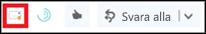

# Aktivera tillägget för att rapportera meddelandeEnable the Report Message add-in

[!INCLUDE [Microsoft 365 Defender rebranding](../includes/microsoft-defender-for-office.md)]

> [!NOTE]
> Om du är administratör i en Microsoft 365-organisation med Exchange Online-postlådor rekommenderar vi att du använder portalen för säkerhets & efterlevnad.If you're an admin in a Microsoft 365 organization with Exchange Online mailboxes, we recommend that you use the Submissions portal in the Security & Compliance Center. Mer information finns i [använda administratörs överföring för att skicka misstänkt skräp post, Phish, URL: er och filer till Microsoft](admin-submission.md).For more information, see [Use Admin Submission to submit suspected spam, phish, URLs, and files to Microsoft](admin-submission.md).

Med rapport tilläggs tillägget för Outlook och Outlook på webben (tidigare Outlook Web App) kan andra personer enkelt rapportera falsk identifiering (god e-post markerat som dåligt) eller falskt negativ (dålig e-post tillåts) till Microsoft och dess dotter bolag för analys.The Report Message add-in for Outlook and Outlook on the web (formerly known as Outlook Web App) enables people to easily report false positives (good email marked as bad) or false negatives (bad email allowed) to Microsoft and its affiliates for analysis. Microsoft använder dessa inlämningar för att förbättra effektiviteten hos e-postskydd.Microsoft uses these submissions to improve the effectiveness of email protection technologies.

Antag till exempel att personer rapporterar många meddelanden som nätfiske.For example, suppose that people are reporting a lot of messages as phishing. De här informations ytorna i [säkerhets instrument panelen](security-dashboard.md) och andra rapporter.This information surfaces in the [Security Dashboard](security-dashboard.md) and other reports. Din organisations säkerhets team kan använda den här informationen som en indikation på att mot nätfiske-principer kan behöva uppdateras.Your organization's security team can use this information as an indication that anti-phishing policies might need to be updated. Om personer rapporterar många meddelanden som inte har flaggats som skräp post som icke-skräppost-objekt genom att använda tillägget rapport, kan organisationens säkerhets Team behöva justera [principer för skräp post](configure-your-spam-filter-policies.md).Or, if people are reporting a lot of messages that were flagged as junk mail as Not Junk by using the Report Message add-in, your organization's security team might need to adjust [anti-spam policies](configure-your-spam-filter-policies.md).

Om din organisation använder [Office 365 Avancerat skydds abonnemang 1](office-365-atp.md) eller [abonnemang 2](office-365-ti.md), tillhandahåller tillägget rapport meddelanden organisationens säkerhets team med användbar information som de kan använda för att granska och uppdatera säkerhets principer.In addition, if your organization is using [Office 365 Advanced Threat Protection Plan 1](office-365-atp.md) or [Plan 2](office-365-ti.md), the Report Message add-in provides your organization's security team with useful information they can use to review and update security policies.

Administratörer kan aktivera tillägget rapportera till organisationen, och enskilda användare kan installera den själva.Admins can enable the Report Message add-in for the organization, and individual users can install it for themselves.

Om du är en enskild användare kan du [Aktivera tilläggs tillägget för rapportering](#get-the-report-message-add-in-for-yourself).If you're an individual user, you can [enable the Report Message add-in for yourself](#get-the-report-message-add-in-for-yourself).

Om du är global administratör eller Exchange Online-administratör och Exchange är konfigurerat för att använda OAuth-autentisering kan du [aktivera tillägget rapportera till din organisation](#get-and-enable-the-report-message-add-in-for-your-organization).If you're a global administrator or an Exchange Online administrator, and Exchange is configured to use OAuth authentication, you can [enable the Report Message add-in for your organization](#get-and-enable-the-report-message-add-in-for-your-organization). Tillägget för rapport meddelanden är nu tillgängligt via [centraliserad distribution](https://docs.microsoft.com/microsoft-365/admin/manage/centralized-deployment-of-add-ins).The Report Message Add-In is now available through [Centralized Deployment](https://docs.microsoft.com/microsoft-365/admin/manage/centralized-deployment-of-add-ins).

## Vad behöver jag veta innan jag börjar?What do you need to know before you begin?

- Tillägget rapportera meddelanden fungerar med de flesta Microsoft 365-abonnemang och följande produkter:The Report Message add-in works with most Microsoft 365 subscriptions and the following products:

  - Outlook på webbenOutlook on the web
  - Outlook 2013 SP1 eller senareOutlook 2013 SP1 or later
  - Outlook 2016 för MacOutlook 2016 for Mac
  - Outlook ingår i Microsoft 365-appar för företagOutlook included with Microsoft 365 apps for Enterprise

- Tillägget för rapport meddelanden är inte tillgängligt för post lådor i lokala Exchange-organisationer.The Report Message add-in is not available for mailboxes in on-premises Exchange organizations.

- Du kan konfigurera vilka meddelanden som ska kopieras eller dirigeras om till en post låda som du anger.You can configure reported messages to be copied or redirected to a mailbox that you specify. Mer information finns i [principer för användar profiler](user-submission.md).For more information, see [User submissions policies](user-submission.md).

- Din befintliga webbläsare bör fungera med tilläggsprogrammet rapportera meddelande.Your existing web browser should work with the Report Message add-in. Om du märker att tillägget inte är tillgängligt eller inte fungerar som förväntat kan du prova en annan webbläsare.But, if you notice the add-in is not available or not working as expected, try a different browser.

- För organisatoriska installationer måste organisationen konfigureras för att använda OAuth-autentisering.For organizational installs, the organization needs to be configured to use OAuth authentication. Mer information finns i [avgöra om centraliserad distribution av tillägg fungerar för din organisation](../../admin/manage/centralized-deployment-of-add-ins.md).For more information, see [Determine if Centralized Deployment of add-ins works for your organization](../../admin/manage/centralized-deployment-of-add-ins.md).

- Administratörer måste vara medlemmar i roll gruppen globala administratörer.Admins need to be a member of the Global admins role group. Mer information finns i [Behörigheter i Säkerhets- och efterlevnadscentret](permissions-in-the-security-and-compliance-center.md).For more information, see [Permissions in the Security & Compliance Center](permissions-in-the-security-and-compliance-center.md).

## Hämta tillägget för rapport meddelanden åt dig självGet the Report Message add-in for yourself

1. Gå till Microsoft AppSource på <https://appsource.microsoft.com/marketplace/apps> och Sök efter rapport meddelande tillägget.Go to the Microsoft AppSource at <https://appsource.microsoft.com/marketplace/apps> and search for the Report Message add-in. Om du vill gå direkt till tillägget rapport, går du till <https://appsource.microsoft.com/product/office/wa104381180> .To go directly to the Report Message add-in, go to <https://appsource.microsoft.com/product/office/wa104381180>.

2. Klicka på **Skaffa det nu**.Click **GET IT NOW**.

   

3. Kontrol lera användnings villkoren och sekretess policyn i dialog rutan som visas och klicka sedan på **Fortsätt**.In the dialog that appears, review the terms of use and privacy policy, and then click **Continue**.

4. Logga in med ditt arbets-eller skol konto (för företag) eller ditt Microsoft-konto (för personligt bruk).Sign in using your work or school account (for business use) or your Microsoft account (for personal use).

När tillägget har installerats och Aktiver ATS ser du följande ikoner:After the add-in is installed and enabled, you'll see the following icons:

- Ikonen ser ut så här i Outlook:In Outlook, the icon looks like this:

  

- I Outlook på webben ser ikonen ut så här:In Outlook on the web, the icon looks like this:

  

Information om hur du använder tillägget finns i [använda tillägget rapportera meddelanden](https://support.microsoft.com/office/b5caa9f1-cdf3-4443-af8c-ff724ea719d2).To learn how to use the add-in, see [Use the Report Message add-in](https://support.microsoft.com/office/b5caa9f1-cdf3-4443-af8c-ff724ea719d2).

## Hämta och aktivera tillägget rapportera meddelande till din organisationGet and enable the Report Message add-in for your organization

> [!NOTE]
> Det kan ta upp till 12 timmar innan tillägget visas i din organisation.It could take up to 12 hours for the add-in to appear in your organization.

1. I administrations centret för Microsoft 365 går du till sidan **tjänster & tillägg** på <https://admin.microsoft.com/AdminPortal/Home#/Settings/ServicesAndAddIns> och klickar sedan på **distribuera tillägg**.In the Microsoft 365 admin center, go to the **Services & add-ins** page at <https://admin.microsoft.com/AdminPortal/Home#/Settings/ServicesAndAddIns>, and then click **Deploy Add-In**.

   

2. I **distribuera en ny** utfällbar tillägg som visas läser du informationen och klickar sedan på **Nästa**.In the **Deploy a new add-in** flyout that appears, review the information, and then click **Next**.

3. På nästa sida klickar du på **Välj från butiken**.On the next page, click **Choose from the Store**.

   

4. Klicka i **sökrutan på** sidan **Välj tillägg** som visas, ange **rapport meddelande**och klicka sedan på ikonen **Sök** sökning  .In the **Select add-in** page that appears, click in the **Search** box, enter **Report Message**, and then click **Search** . Sök efter **rapport meddelande** i listan med resultat och klicka sedan på **Lägg till**.In the list of results, find **Report Message** and then click **Add**.

   

5. I dialog rutan som visas granskar du licensierings-och integritets informationen och klickar sedan på **Fortsätt**.In the dialog that appears, review the licensing and privacy information, and then click **Continue**.

6. På sidan **Konfigurera tillägg** som visas konfigurerar du följande inställningar:In the **Configure add-in** page that appears, configure the following settings:

   - **Tilldelade användare**: Välj något av följande värden:**Assigned users**: Select one of the following values:

     - **Alla** (standard)**Everyone** (default)
     - **Specifika användare/grupper****Specific users / groups**
     - **Bara jag****Just me**

   - **Distributions metod**: Välj något av följande värden:**Deployment method**: Select one of the following values:

     - **Åtgärdat (standard)**: tillägget distribueras automatiskt till de angivna användarna och de kan inte tas bort.**Fixed (Default)**: The add-in is automatically deployed to the specified users and they can't remove it.
     - **Tillgängligt**: användarna kan installera **tillägget via** \> **Skaffa** tillägg som \> **hanteras av administratören**.**Available**: Users can install the add-in at **Home** \> **Get add-ins** \> **Admin-managed**.
     - **Valfritt**: tillägget distribueras automatiskt till angivna användare, men de kan välja att ta bort det.**Optional**: The add-in is automatically deployed to the specified users, but they can choose to remove it.

   

   När du är klar klickar du på **distribuera**.When you're finished, click **Deploy**.

7. På sidan **distribuera rapport meddelanden** som visas visas en status rapport följt av en bekräftelse på att tillägget distribuerades.In the **Deploy Report Message** page that appears, you'll see a progress report followed by a confirmation that the add-in was deployed. När du har läst informationen klickar du på **Nästa**.After you read the information, click **Next**.

   

8. På sidan om meddelande **tillägget** som visas granskar du informationen och klickar sedan på **Stäng**.On the **Announce add-in** page that appears, review the information, and then click **Close**.

   

## Lär dig hur du använder tillägget rapportLearn how to use the Report Message add-in

Personer som har tillägget tilldelat kommer att se följande ikoner:People who have the add-in assigned to them will see the following icons:

- Ikonen ser ut så här i Outlook:In Outlook, the icon looks like this:

  

- I Outlook på webben ser ikonen ut så här:In Outlook on the web, the icon looks like this:

  

När du meddelar användare om tillägget för rapport meddelanden infogar du en länk där du kan [använda tillägget rapport](https://support.microsoft.com/office/b5caa9f1-cdf3-4443-af8c-ff724ea719d2).When you notify users about the Report Message add-in, include a link to [Use the Report Message add-in](https://support.microsoft.com/office/b5caa9f1-cdf3-4443-af8c-ff724ea719d2).

## Granska eller redigera inställningar för rapport tilläggetReview or edit settings for the Report Message add-in

1. Gå till sidan **tjänster & tillägg** i administrations centret för Microsoft 365 <https://admin.microsoft.com/AdminPortal/Home#/Settings/ServicesAndAddIns> .In the Microsoft 365 admin center, go to the **Services & add-ins** page at <https://admin.microsoft.com/AdminPortal/Home#/Settings/ServicesAndAddIns>.

   

2. Hitta och välj tillägget **rapportera meddelanden** .Find and select the **Report Message** add-in.

3. I **Redigera rapport** utfällning som visas granskar och redigerar du inställningar för din organisation.In the **Edit Report Message** flyout that appears, review and edit settings as appropriate for your organization. Klicka på **Spara** när du är klar.When you're finished, click **Save**.

   

## Visa och granska rapporterade meddelandenView and review reported messages

Om du vill granska meddelanden som användare rapporterar till Microsoft har du följande alternativ:To review messages that users report to Microsoft, you have these options:

- Använd portalen administrations underställda.Use the Admin Submissions portal. Mer information finns i [Visa användar inlämningar till Microsoft](admin-submission.md#view-user-submissions-to-microsoft).For more information, see [View user submissions to Microsoft](admin-submission.md#view-user-submissions-to-microsoft).

- Skapa en regel för e-postflöde (kallas även transport regel) för att skicka kopior av rapporterade meddelanden.Create a mail flow rule (also known as a transport rule) to send copies of reported messages. Anvisningar finns i [använda e-postflödes regler för att se vad användarna rapporterar till Microsoft](use-mail-flow-rules-to-see-what-your-users-are-reporting-to-microsoft.md).For instructions, see [Use mail flow rules to see what your users are reporting to Microsoft](use-mail-flow-rules-to-see-what-your-users-are-reporting-to-microsoft.md).
