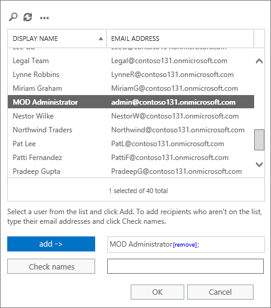

# Aktivera tillägget Rapportmeddelande

> [!NOTE]
> Tillägget Rapportmeddelande för Outlook och Outlook på webben är inte exakt samma sak som [skräppostfiltret](https://support.office.com/article/5ae3ea8e-cf41-4fa0-b02a-3b96e21de089)i Outlook, även om båda kan användas för att markera e-post som skräppost, inte skräppost eller ett nätfiskeförsök. Skillnaden är att tillägget Report Message för Outlook och Outlook på webben meddelar Microsoft om felklassificerad e-post, medan skräppostfiltret i Outlook används för att ordna e-postmeddelanden i en användares postlåda.

## Översikt

Tillägget Report Message för Outlook och Outlook på webben (tidigare kallat Outlook Web App) gör det möjligt för personer att enkelt rapportera felklassificerad e-post, oavsett om den är säker eller skadlig, till Microsoft och dess dotterbolag för analys. Microsoft använder dessa inlämningar för att förbättra effektiviteten i e-postskyddstekniker. Om din organisation använder [Office 365 Advanced Threat Protection Plan 1](office-365-atp.md) eller [Plan 2](office-365-ti.md)ger tillägget Rapportmeddelande dessutom organisationens säkerhetsteam användbar information som de kan använda för att granska och uppdatera säkerhetsprinciper.

Anta till exempel att andra rapporterar många meddelanden som nätfiske. Den här informationen visas i [säkerhetsinstrumentpanelen](security-dashboard.md) och andra rapporter. Organisationens säkerhetsteam kan använda den här informationen som en indikation på att anti-phishing-principer kan behöva uppdateras. Om personer rapporterar många meddelanden som har flaggats som skräppost som Inte skräppost med tillägget Rapportera meddelande kan organisationens säkerhetsteam behöva justera [principer mot skräppost.](configure-your-spam-filter-policies.md)

Tillägget Rapportmeddelande fungerar med de flesta Office 365-prenumerationer och följande produkter:

- Outlook på webben
- Outlook 2013 SP1
- Utsikter 2016
- Outlook 2016 för Mac
- Outlook ingår i Office 365 ProPlus

Tillägget Rapportmeddelande är inte tillgängligt för:

- Postlådor i lokala Exchange-organisationer
- GCC-, GCC HIGH- eller DoD-prenumerationer

Din befintliga webbläsare bör räcka för att tillägget Rapportmeddelande ska fungera. Om du märker att tillägget inte är tillgängligt eller inte fungerar som förväntat provar du en annan webbläsare.

Om du är en enskild användare kan du [aktivera tillägget Rapportmeddelande själv](#get-the-report-message-add-in-for-yourself).

Om du är global Office 365-administratör eller Exchange [Online-administratör](#get-and-enable-the-report-message-add-in-for-your-organization)och Exchange är konfigurerat för att använda OAuth-autentisering kan du aktivera tillägget Rapportmeddelande för din organisation . Tillägget Rapportmeddelande är nu tillgängligt via [centraliserad distribution](https://docs.microsoft.com/office365/admin/manage/centralized-deployment-of-add-ins).

## Hämta tillägget Rapportmeddelande själv

1. Sök efter [tillägget Rapportmeddelande i](https://appsource.microsoft.com/product/office/wa104381180) [Microsoft AppSource](https://appsource.microsoft.com/marketplace/apps).

2. Välj **HÄMTA DEN NU.**

   

3. Läs användarvillkoren och sekretesspolicyn. Välj sedan **Continue** (fortsätt).

4. Logga in på Office 365 med ditt arbets- eller skolkonto (för företagsbruk) eller ditt Microsoft-konto (för personligt bruk).

När tillägget har installerats och aktiverats visas följande ikoner:

- I Outlook ser ikonen ut så här:

  

- I Outlook på webben (tidigare kallat Outlook Web App) ser ikonen ut så här:

  

> [!TIP]
> Som ett nästa steg kan du läsa om hur [du använder tillägget Rapportmeddelande](https://support.office.com/article/b5caa9f1-cdf3-4443-af8c-ff724ea719d2).

## Hämta och aktivera tillägget Rapportmeddelande för din organisation

> [!IMPORTANT]
> Du måste vara global Office 365-administratör eller Exchange Online-administratör för att kunna utföra den här uppgiften. Dessutom måste Exchange konfigureras för att använda OAuth-autentisering Om du vill veta mer finns [i Exchange-krav (centraliserad distribution av tillägg).](https://docs.microsoft.com/office365/admin/manage/centralized-deployment-of-add-ins)

1. Gå till [sidan Tjänster & tillägg i administrationscentret](https://admin.microsoft.com/AdminPortal/Home#/Settings/ServicesAndAddIns) för Microsoft 365.

   

2. Välj **+ Distribuera tillägg**.

   

3. På skärmen **Nytt tillägg** granskar du informationen och väljer sedan **Nästa**.

   

4. Välj **Jag vill lägga till ett tillägg i Office Store**och välj sedan **Nästa**.

   

5. Sök efter **rapportmeddelande**och välj **Lägg**till i listan med resultat bredvid **tillägget Rapportmeddelande.**

   

6. Granska informationen på skärmen **Rapportmeddelande** och välj sedan **Nästa**.

   

7. Ange standardinställningarna för användaren för Outlook och välj sedan **Nästa**.

   

8. Ange vem som får tillägget Rapportmeddelande och välj sedan **Spara**.

   

> [!TIP]
> Vi rekommenderar att [du konfigurerar en regel för att få en kopia av e-postmeddelanden som rapporterats av användarna](#set-up-a-rule-to-get-a-copy-of-email-messages-reported-by-your-users).

Beroende på vad du valde när du konfigurerade tillägget (steg 7-8 ovan) har personer i organisationen [tillägget Report Message](https://support.office.com/article/b5caa9f1-cdf3-4443-af8c-ff724ea719d2) tillgängligt. Personer i organisationen ser följande ikoner:

- I Outlook ser ikonen ut så här:

  

- I Outlook på webben ser ikonen ut så här:

  

> [!TIP]
> När du meddelar användarna om tillägget Rapportmeddelande ska du inkludera en länk till [Använda tillägget Rapportmeddelande](https://support.office.com/article/b5caa9f1-cdf3-4443-af8c-ff724ea719d2).

## Konfigurera en regel för att få en kopia av e-postmeddelanden som rapporterats av användarna

> [!IMPORTANT]
> Du måste vara Exchange Online-administratör för att kunna utföra den här uppgiften.

Du kan ställa in en regel för att få en kopia av e-postmeddelanden som rapporterats av användare i organisationen. Du gör detta när du har hämtat och aktiverat tillägget Rapportmeddelande för din organisation.

1. Välj **regler**för **e-postflöde** \> i administrationscentret för Exchange .

2. Välj **+** \> **Skapa en ny regel**.

3. Skriv ett namn i rutan **Namn,** till exempel Inlämningar.

4. I listan **Använd den här regeln** väljer du **Mottagaradressen innehåller...**.

5. I skärmen **Ange ord eller** `junk@office365.microsoft.com` fraser `phish@office365.microsoft.com`lägger du till och och väljer sedan **OK**.

   

6. I listan **Gör följande...** väljer du **Bcc meddelandet till...**.

7. Lägg till en global administratör, säkerhetsadministratör och/eller säkerhetsläsare som ska få en kopia av varje e-postmeddelande som användarna rapporterar till Microsoft och välj sedan **OK**.

   

8. Välj **Granska den här regeln med allvarlighetsgrad**och välj **Medel**.

9. Under **Välj ett läge för den här regeln**väljer du **Verkställ**.

   

10. Välj **Save**.

När någon i organisationen rapporterar ett e-postmeddelande med tillägget Rapportera meddelande får den globala administratören, säkerhetsadministratören och/eller säkerhetsläsaren en kopia av meddelandet när någon i organisationen rapporterar ett e-postmeddelande med tillägget Rapportera meddelande. Med den här informationen kan du ställa in eller justera principer, till exempel [office 365 ATP-principer](atp-safe-links.md) för säkra länkar eller dina [inställningar mot skräppost.](anti-spam-protection.md)

## Läs om hur du använder tillägget Rapportmeddelande

Se [Använda tillägget Rapportmeddelande](https://support.office.com/article/b5caa9f1-cdf3-4443-af8c-ff724ea719d2).

## Granska eller redigera inställningar för tillägget Rapportmeddelande

Du kan granska och redigera standardinställningarna för tillägget Rapportmeddelande på [sidan Tjänster & tillägg](https://admin.microsoft.com/AdminPortal/Home#/Settings/ServicesAndAddIns).

> [!IMPORTANT]
> Du måste vara global Office 365-administratör eller Exchange Online-administratör för att kunna utföra den här uppgiften.

1. Gå till [sidan Tjänster & tillägg i administrationscentret](https://admin.microsoft.com/AdminPortal/Home#/Settings/ServicesAndAddIns) för Microsoft 365.

   

2. Sök efter och välj tillägget Rapportmeddelande.

   

3. Granska och redigera inställningar på skärmen Rapportera meddelanden efter behov för din organisation.

   

## Relaterade ämnen

[Använda tillägget Rapportmeddelande](https://support.office.com/article/b5caa9f1-cdf3-4443-af8c-ff724ea719d2)

[Visa säkerhetsrapporter för &amp; e-post i Säkerhetsefterlevnadscenter](view-email-security-reports.md)

[Visa rapporter för avancerat hotskydd för Office 365](view-reports-for-atp.md)

[Använda Explorer i &amp; Säkerhetsefterlevnadscenter](threat-explorer.md)
