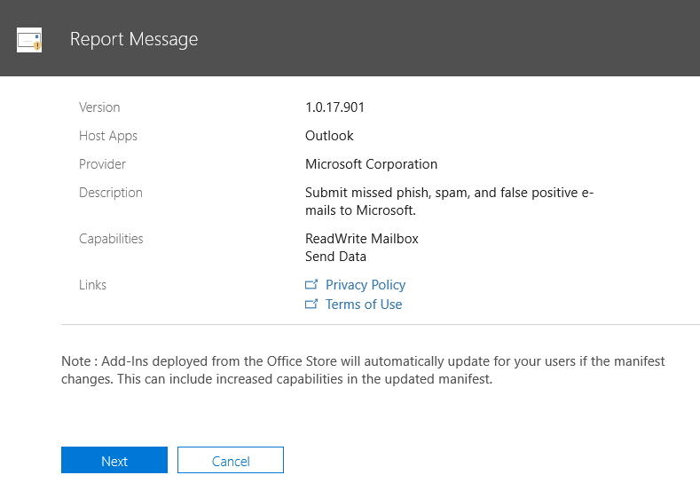
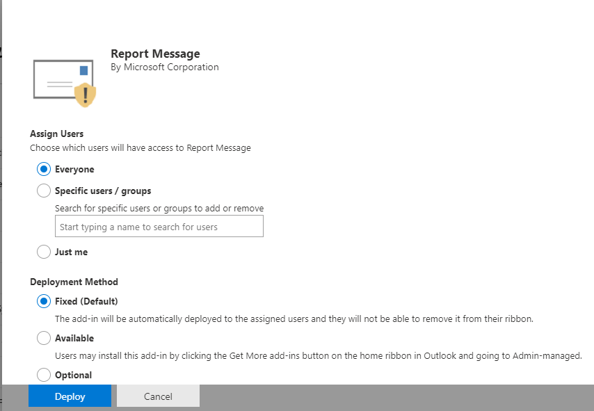

# Aktivera tillägget RapportmeddelandeEnable the Report Message add-in

> [!NOTE]
> Tillägget Rapportmeddelande för Outlook och Outlook på webben är inte exakt samma sak som [skräppostfiltret](https://support.office.com/article/5ae3ea8e-cf41-4fa0-b02a-3b96e21de089)i Outlook, även om båda kan användas för att markera e-post som skräppost, inte skräppost eller ett nätfiskeförsök.The Report Message add-in for Outlook and Outlook on the web is not exactly the same thing as the [Outlook Junk Email Filter](https://support.office.com/article/5ae3ea8e-cf41-4fa0-b02a-3b96e21de089), although both can be used to mark email as junk, not junk, or a phishing attempt. Skillnaden är att tillägget Report Message för Outlook och Outlook på webben meddelar Microsoft om felklassificerad e-post, medan skräppostfiltret i Outlook används för att ordna e-postmeddelanden i en användares postlåda.The difference is, the Report Message add-in for Outlook and Outlook on the web notifies Microsoft about misclassified email, whereas the Outlook Junk Email Filter is used to organize email messages in a user's mailbox.

## ÖversiktOverview

Tillägget Report Message för Outlook och Outlook på webben (tidigare kallat Outlook Web App) gör det möjligt för personer att enkelt rapportera felklassificerad e-post, oavsett om den är säker eller skadlig, till Microsoft och dess dotterbolag för analys.The Report Message add-in for Outlook and Outlook on the web (formerly known as Outlook Web App) enables people to easily report misclassified email, whether safe or malicious, to Microsoft and its affiliates for analysis. Microsoft använder dessa inlämningar för att förbättra effektiviteten i e-postskyddstekniker.Microsoft uses these submissions to improve the effectiveness of email protection technologies. Om din organisation använder [Office 365 Advanced Threat Protection Plan 1](office-365-atp.md) eller [Plan 2](office-365-ti.md)ger tillägget Rapportmeddelande dessutom organisationens säkerhetsteam användbar information som de kan använda för att granska och uppdatera säkerhetsprinciper.In addition, if your organization is using [Office 365 Advanced Threat Protection Plan 1](office-365-atp.md) or [Plan 2](office-365-ti.md), the Report Message add-in provides your organization's security team with useful information they can use to review and update security policies.

Anta till exempel att andra rapporterar många meddelanden som nätfiske.For example, suppose that people are reporting a lot of messages as phishing. Den här informationen visas i [säkerhetsinstrumentpanelen](security-dashboard.md) och andra rapporter.This information surfaces in the [Security Dashboard](security-dashboard.md) and other reports. Organisationens säkerhetsteam kan använda den här informationen som en indikation på att anti-phishing-principer kan behöva uppdateras.Your organization's security team can use this information as an indication that anti-phishing policies might need to be updated. Om personer rapporterar många meddelanden som har flaggats som skräppost som Inte skräppost med tillägget Rapportera meddelande kan organisationens säkerhetsteam behöva justera [principer mot skräppost.](configure-your-spam-filter-policies.md)Or, if people are reporting a lot of messages that were flagged as junk mail as Not Junk by using the Report Message add-in, your organization's security team might need to adjust [anti-spam policies](configure-your-spam-filter-policies.md).

Tillägget Rapportmeddelande fungerar med de flesta Office 365-prenumerationer och följande produkter:The Report Message add-in works with most Office 365 subscriptions and the following products:

- Outlook på webbenOutlook on the web
- Outlook 2013 SP1Outlook 2013 SP1
- Utsikter 2016Outlook 2016
- Outlook 2016 för MacOutlook 2016 for Mac
- Outlook ingår i Office 365 ProPlusOutlook included with Office 365 ProPlus

Tillägget Rapportmeddelande är inte tillgängligt för:The Report Message add-in is currently not available for:

- Postlådor i lokala Exchange-organisationerMailboxes in on-premises Exchange organizations
- GCC-, GCC HIGH- eller DoD-prenumerationerGCC, GCC HIGH, or DoD subscriptions

Din befintliga webbläsare bör räcka för att tillägget Rapportmeddelande ska fungera. Om du märker att tillägget inte är tillgängligt eller inte fungerar som förväntat provar du en annan webbläsare.Your existing web browser should suffice for the Report Message add-in to work; however, if you notice the add-in is not available or not working as expected, try a different browser.

Om du är en enskild användare kan du [aktivera tillägget Rapportmeddelande själv](#get-the-report-message-add-in-for-yourself).If you're an individual user, you can [enable the Report Message add-in for yourself](#get-the-report-message-add-in-for-yourself).

Om du är global Office 365-administratör eller Exchange [Online-administratör](#get-and-enable-the-report-message-add-in-for-your-organization)och Exchange är konfigurerat för att använda OAuth-autentisering kan du aktivera tillägget Rapportmeddelande för din organisation .If you're an Office 365 global administrator or an Exchange Online administrator, and Exchange is configured to use OAuth authentication, you can [enable the Report Message add-in for your organization](#get-and-enable-the-report-message-add-in-for-your-organization). Tillägget Rapportmeddelande är nu tillgängligt via [centraliserad distribution](https://docs.microsoft.com/office365/admin/manage/centralized-deployment-of-add-ins).The Report Message Add-In is now available through [Centralized Deployment](https://docs.microsoft.com/office365/admin/manage/centralized-deployment-of-add-ins).

## Hämta tillägget Rapportmeddelande självGet the Report Message add-in for yourself

1. Sök efter [tillägget Rapportmeddelande i](https://appsource.microsoft.com/product/office/wa104381180) [Microsoft AppSource](https://appsource.microsoft.com/marketplace/apps).In [Microsoft AppSource](https://appsource.microsoft.com/marketplace/apps), search for the [Report Message add-in](https://appsource.microsoft.com/product/office/wa104381180).

2. Välj **HÄMTA DEN NU.**Choose **GET IT NOW**.

   

3. Läs användarvillkoren och sekretesspolicyn.Review the terms of use and privacy policy. Välj sedan **Continue** (fortsätt).Then choose **Continue**.

4. Logga in på Office 365 med ditt arbets- eller skolkonto (för företagsbruk) eller ditt Microsoft-konto (för personligt bruk).Sign in to Office 365 using your work or school account (for business use) or your Microsoft account (for personal use).

När tillägget har installerats och aktiverats visas följande ikoner:After the add-in is installed and enabled, you'll see the following icons:

- I Outlook ser ikonen ut så här:In Outlook, the icon looks like this:

  

- I Outlook på webben (tidigare kallat Outlook Web App) ser ikonen ut så här:In Outlook on the web (formerly known as Outlook Web App), the icon looks like this:

  

> [!TIP]
> Som ett nästa steg kan du läsa om hur [du använder tillägget Rapportmeddelande](https://support.office.com/article/b5caa9f1-cdf3-4443-af8c-ff724ea719d2).As a next step, learn how to [Use the Report Message add-in](https://support.office.com/article/b5caa9f1-cdf3-4443-af8c-ff724ea719d2).

## Hämta och aktivera tillägget Rapportmeddelande för din organisationGet and enable the Report Message add-in for your organization

> [!IMPORTANT]
> Du måste vara global Office 365-administratör eller Exchange Online-administratör för att kunna utföra den här uppgiften.You must be an Office 365 global administrator or an Exchange Online Administrator to complete this task. Dessutom måste Exchange konfigureras för att använda OAuth-autentisering Om du vill veta mer finns [i Exchange-krav (centraliserad distribution av tillägg).](https://docs.microsoft.com/office365/admin/manage/centralized-deployment-of-add-ins)In addition, Exchange must be configured to use OAuth authentication To learn more, see [Exchange requirements (Centralized Deployment of add-ins)](https://docs.microsoft.com/office365/admin/manage/centralized-deployment-of-add-ins).

1. Gå till [sidan Tjänster & tillägg i administrationscentret](https://admin.microsoft.com/AdminPortal/Home#/Settings/ServicesAndAddIns) för Microsoft 365.Go to the [Services & add-ins page](https://admin.microsoft.com/AdminPortal/Home#/Settings/ServicesAndAddIns) in the Microsoft 365 admin center.

   

2. Välj **+ Distribuera tillägg**.Choose **+ Deploy Add-in**.

   

3. På skärmen **Nytt tillägg** granskar du informationen och väljer sedan **Nästa**.In the **New Add-In** screen, review the information, and then choose **Next**.

   

4. Välj **Jag vill lägga till ett tillägg i Office Store**och välj sedan **Nästa**.Select **I want to add an Add-In from the Office Store**, and then choose **Next**.

   

5. Sök efter **rapportmeddelande**och välj **Lägg**till i listan med resultat bredvid **tillägget Rapportmeddelande.**Search for **Report Message**, and in the list of results, next to the **Report Message Add-In**, choose **Add**.

   

6. Granska informationen på skärmen **Rapportmeddelande** och välj sedan **Nästa**.On the **Report Message** screen, review the information, and then choose **Next**.

   

7. Ange standardinställningarna för användaren för Outlook och välj sedan **Nästa**.Specify the user default settings for Outlook, and  then choose **Next**.

   

8. Ange vem som får tillägget Rapportmeddelande och välj sedan **Spara**.Specify who gets the Report Message Add-in, and then choose **Save**.

   

> [!TIP]
> Vi rekommenderar att [du konfigurerar en regel för att få en kopia av e-postmeddelanden som rapporterats av användarna](#set-up-a-rule-to-get-a-copy-of-email-messages-reported-by-your-users).We recommend [setting up a rule to get a copy of email messages reported by your users](#set-up-a-rule-to-get-a-copy-of-email-messages-reported-by-your-users).

Beroende på vad du valde när du konfigurerade tillägget (steg 7-8 ovan) har personer i organisationen [tillägget Report Message](https://support.office.com/article/b5caa9f1-cdf3-4443-af8c-ff724ea719d2) tillgängligt.Depending on what you selected when you set up the add-in (steps 7-8 above), people in your organization will have the [Report Message add-in](https://support.office.com/article/b5caa9f1-cdf3-4443-af8c-ff724ea719d2) available. Personer i organisationen ser följande ikoner:People in your organization will see the following icons:

- I Outlook ser ikonen ut så här:In Outlook, the icon looks like this:

  

- I Outlook på webben ser ikonen ut så här:In Outlook on the web, the icon looks like this:

  

> [!TIP]
> När du meddelar användarna om tillägget Rapportmeddelande ska du inkludera en länk till [Använda tillägget Rapportmeddelande](https://support.office.com/article/b5caa9f1-cdf3-4443-af8c-ff724ea719d2).When you notify users about the Report Message add-in, include a link to [Use the Report Message add-in](https://support.office.com/article/b5caa9f1-cdf3-4443-af8c-ff724ea719d2).

## Konfigurera en regel för att få en kopia av e-postmeddelanden som rapporterats av användarnaSet up a rule to get a copy of email messages reported by your users

> [!IMPORTANT]
> Du måste vara Exchange Online-administratör för att kunna utföra den här uppgiften.You must be an Exchange Online Administrator to perform this task.

Du kan ställa in en regel för att få en kopia av e-postmeddelanden som rapporterats av användare i organisationen.You can set up a rule to get a copy of email messages reported by users in your organization. Du gör detta när du har hämtat och aktiverat tillägget Rapportmeddelande för din organisation.You do this after you have downloaded and enabled the Report Message add-in for your organization.

1. Välj **regler**för **e-postflöde** \> i administrationscentret för Exchange .In the Exchange admin center, choose **mail flow** \> **rules**.

2. Välj **+** \> **Skapa en ny regel**.Choose **+** \> **Create a new rule**.

3. Skriv ett namn i rutan **Namn,** till exempel Inlämningar.In the **Name** box, type a name, such as Submissions.

4. I listan **Använd den här regeln** väljer du **Mottagaradressen innehåller...**.In the **Apply this rule if** list, choose **The recipient address includes...**.

5. I skärmen **Ange ord eller** `junk@office365.microsoft.com` fraser `phish@office365.microsoft.com`lägger du till och och väljer sedan **OK**.In the **specify words or phrases** screen, add `junk@office365.microsoft.com` and `phish@office365.microsoft.com`, and then choose **OK**.

   

6. I listan **Gör följande...** väljer du **Bcc meddelandet till...**.In the **Do the following...** list, choose **Bcc the message to...**.

7. Lägg till en global administratör, säkerhetsadministratör och/eller säkerhetsläsare som ska få en kopia av varje e-postmeddelande som användarna rapporterar till Microsoft och välj sedan **OK**.Add a global administrator, security administrator, and/or security reader who should receive a copy of each email message that people report to Microsoft, and then choose **OK**.

   

8. Välj **Granska den här regeln med allvarlighetsgrad**och välj **Medel**.Select **Audit this rule with severity level**, and choose **Medium**.

9. Under **Välj ett läge för den här regeln**väljer du **Verkställ**.Under **Choose a mode for this rule**, choose **Enforce**.

   

10. Välj **Save**.Choose **Save**.

När någon i organisationen rapporterar ett e-postmeddelande med tillägget Rapportera meddelande får den globala administratören, säkerhetsadministratören och/eller säkerhetsläsaren en kopia av meddelandet när någon i organisationen rapporterar ett e-postmeddelande med tillägget Rapportera meddelande.With this rule in place, whenever someone in your organization reports an email message using the Report Message add-in, your global administrator, security administrator, and/or security reader will receive a copy of that message. Med den här informationen kan du ställa in eller justera principer, till exempel [office 365 ATP-principer](atp-safe-links.md) för säkra länkar eller dina [inställningar mot skräppost.](anti-spam-protection.md)This information can enable you to set up or adjust policies, such as [Office 365 ATP Safe Links](atp-safe-links.md) policies, or your [anti-spam](anti-spam-protection.md) settings.

## Läs om hur du använder tillägget RapportmeddelandeLearn how to use the Report Message add-in

Se [Använda tillägget Rapportmeddelande](https://support.office.com/article/b5caa9f1-cdf3-4443-af8c-ff724ea719d2).See [Use the Report Message add-in](https://support.office.com/article/b5caa9f1-cdf3-4443-af8c-ff724ea719d2).

## Granska eller redigera inställningar för tillägget RapportmeddelandeReview or edit settings for the Report Message add-in

Du kan granska och redigera standardinställningarna för tillägget Rapportmeddelande på [sidan Tjänster & tillägg](https://admin.microsoft.com/AdminPortal/Home#/Settings/ServicesAndAddIns).You can review and edit the default settings for the Report Message add-in on the [Services & Add-Ins page](https://admin.microsoft.com/AdminPortal/Home#/Settings/ServicesAndAddIns).

> [!IMPORTANT]
> Du måste vara global Office 365-administratör eller Exchange Online-administratör för att kunna utföra den här uppgiften.You must be an Office 365 global administrator or an Exchange Online Administrator to complete this task.

1. Gå till [sidan Tjänster & tillägg i administrationscentret](https://admin.microsoft.com/AdminPortal/Home#/Settings/ServicesAndAddIns) för Microsoft 365.Go to the [Services & add-ins page](https://admin.microsoft.com/AdminPortal/Home#/Settings/ServicesAndAddIns) in the Microsoft 365 admin center.

   

2. Sök efter och välj tillägget Rapportmeddelande.Find and select the Report Message add-in.

   

3. Granska och redigera inställningar på skärmen Rapportera meddelanden efter behov för din organisation.On the Report Message screen, review and edit settings as appropriate for your organization.

   

## Relaterade ämnenRelated topics

[Använda tillägget RapportmeddelandeUse the Report Message add-in](https://support.office.com/article/b5caa9f1-cdf3-4443-af8c-ff724ea719d2)

[Visa säkerhetsrapporter för &amp; e-post i SäkerhetsefterlevnadscenterView email security reports in the Security &amp; Compliance Center](view-email-security-reports.md)

[Visa rapporter för avancerat hotskydd för Office 365View reports for Office 365 Advanced Threat Protection](view-reports-for-atp.md)

[Använda Explorer i &amp; SäkerhetsefterlevnadscenterUse Explorer in the Security &amp; Compliance Center](threat-explorer.md)
