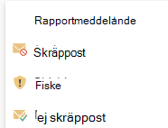

# Aktivera rapportmeddelandet eller tilläggen för nätfiskeEnable the Report Message or the Report Phishing add-ins

[!INCLUDE [Microsoft 365 Defender rebranding](../includes/microsoft-defender-for-office.md)]

**Gäller för****Applies to**
- [Exchange Online ProtectionExchange Online Protection](exchange-online-protection-overview.md)
- [Microsoft Defender för Office 365 Abonnemang 1 och Abonnemang 2Microsoft Defender for Office 365 plan 1 and plan 2](defender-for-office-365.md)
- [Microsoft 365 DefenderMicrosoft 365 Defender](../defender/microsoft-365-defender.md)

> [!NOTE]
> Om du är administratör i en Microsoft 365-organisation med Exchange Online-postlådor rekommenderar vi att du använder portalen för inskickade material i Microsoft 365 Defender-portalen.If you're an admin in a Microsoft 365 organization with Exchange Online mailboxes, we recommend that you use the Submissions portal in the Microsoft 365 Defender portal. Mer information finns i Använda [administratörsinskick för att skicka misstänkt skräppost, nättr ut, URL:er och filer till Microsoft.](admin-submission.md)For more information, see [Use Admin Submission to submit suspected spam, phish, URLs, and files to Microsoft](admin-submission.md).

Med tilläggen Rapportmeddelande och Rapport nätfiske för Outlook och Outlook på webben (tidigare kallat Outlook Web App) kan användare enkelt rapportera falska positiva resultat (bra e-post markerad som dålig) eller falska negativa (felaktig e-post tillåten) till Microsoft och dess dotterbolag för analys.The Report Message and Report Phishing add-ins for Outlook and Outlook on the web (formerly known as Outlook Web App) enable people to easily report false positives (good email marked as bad) or false negatives (bad email allowed) to Microsoft and its affiliates for analysis.

Microsoft använder dessa inskickade material för att göra e-postskyddstekniken mer effektiv.Microsoft uses these submissions to improve the effectiveness of email protection technologies. Anta till exempel att personer rapporterar många meddelanden med hjälp av tillägget Rapport om nätfiske.For example, suppose that people are reporting many messages using the Report Phishing add-in. Den här informationen visas i säkerhetspanelen och andra rapporter.This information surfaces in the Security Dashboard and other reports. Din organisations säkerhetsgrupp kan använda den här informationen som en indikation på att principer mot nätfiske kan behöva uppdateras.Your organization's security team can use this information as an indication that anti-phishing policies might need to be updated.

Du kan installera antingen tillägget Rapportmeddelande eller Rapportera nätfiske.You can install either the Report Message or Report Phishing add-in. Om du vill att användarna ska rapportera både skräppost och nätfiske distribuerar du tillägget Rapportmeddelande i organisationen.If you want your users to report both spam and phishing messages, deploy the Report Message add-in in your organization. Mer information finns i Aktivera tillägget Rapportmeddelande.For more information, see Enable the Report Message add-in.

Via tillägget Rapportmeddelande kan du rapportera både skräppost och nätfiske.The Report Message add-in provides the option to report both spam and phishing messages. Administratörer kan aktivera tillägget Rapportmeddelande för organisationen och enskilda användare kan installera det själva.Admins can enable the Report Message add-in for the organization, and individual users can install it for themselves.

Tillägget Rapport nätfiske ger möjlighet att endast rapportera nätfiskemeddelanden.The Report Phishing add-in provides the option to report only phishing messages. Administratörer kan aktivera tillägget Rapport nätfiske för organisationen, och enskilda användare kan installera det själva.Admins can enable the Report Phishing add-in for the organization, and individual users can install it for themselves.

Om du är enskild användare kan du aktivera båda tilläggen själv.If you're an individual user, you can enable both the add-ins for yourself.

Om du är global administratör eller Exchange Online-administratör och Exchange är konfigurerat att använda OAuth-autentisering kan du aktivera tillägget Rapportmeddelande och tillägget Rapportfiske för organisationen.If you're a global administrator or an Exchange Online administrator, and Exchange is configured to use OAuth authentication, you can enable the Report Message add-in and the Report Phishing add-in for your organization. Båda tilläggen är nu tillgängliga via [centraliserad distribution.](../../admin/manage/centralized-deployment-of-add-ins.md)Both add-ins are now available through [Centralized Deployment](../../admin/manage/centralized-deployment-of-add-ins.md).

## Vad behöver jag veta innan jag börjar?What do you need to know before you begin?

- Både tillägget Rapportmeddelande och tillägget Rapportfiske fungerar med de flesta Microsoft 365-prenumerationer och följande produkter:Both the Report Message add-in and the Report Phishing add-in works with most Microsoft 365 subscriptions and the following products:
  - Outlook på webbenOutlook on the web
  - Outlook 2013 SP1 eller senareOutlook 2013 SP1 or later
  - Outlook 2016 för MacOutlook 2016 for Mac
  - Outlook ingår i Microsoft 365-appar för företagOutlook included with Microsoft 365 apps for Enterprise
  - Outlook-appen för iOS och AndroidOutlook app for iOS and Android

- Båda tilläggen är inte tillgängliga för delade postlådor eller postlådor i lokala Exchange-organisationer.Both add-ins are not available for shared mailboxes or mailboxes in on-premises Exchange organizations.

- Din befintliga webbläsare bör fungera med tilläggen Rapportmeddelande och Rapportera nätfiske. Om du märker att tillägget inte är tillgängligt eller inte fungerar som förväntat kan du prova en annan webbläsare.Your existing web browser should work with both the Report Message and Report Phishing add-ins. But, if you notice the add-in is not available or not working as expected, try a different browser.

- För organisationsinstallationer måste organisationen konfigureras för att använda OAuth-autentisering.For organizational installs, the organization needs to be configured to use OAuth authentication. Mer information finns i [Avgöra om centraliserad distribution av tillägg fungerar för din organisation.](../../admin/manage/centralized-deployment-of-add-ins.md)For more information, see [Determine if Centralized Deployment of add-ins works for your organization](../../admin/manage/centralized-deployment-of-add-ins.md).

- Administratörer måste vara medlemmar i rollgruppen Globala administratörer.Admins need to be a member of the Global admins role group. Mer information finns i [Behörigheter på Microsoft 365 Defender-portalen](permissions-microsoft-365-security-center.md).For more information, see [Permissions in the Microsoft 365 Defender portal](permissions-microsoft-365-security-center.md).

- Mer information om hur du rapporterar ett meddelande med hjälp av funktionen Rapportmeddelande finns i Rapportera falska positiva och [falska negativa objekt i Outlook.](report-false-positives-and-false-negatives.md)For more information on how to report a message using the Report Message feature, see [Report false positives and false negatives in Outlook](report-false-positives-and-false-negatives.md).

> [!IMPORTANT]
> Vi rekommenderar inte den inbyggda rapporteringsupplevelsen i Outlook eftersom det inte kan använda principen för [användarinskickning.](./user-submission.md)We don't recommend the built-in reporting experience in Outlook because it can't use the [user submission policy](./user-submission.md). Vi rekommenderar att du använder tilläggen Rapportmeddelande eller Nätfiskerapport i stället.We recommend using the Report Message add-in or the Report Phishing add-in instead.

## Hämta tillägget RapportmeddelandeGet the Report Message add-in

### Skaffa tillägget Rapportmeddelande åt dig självGet the Report Message add-in for yourself

1. Gå till Microsoft AppSource på <https://appsource.microsoft.com/marketplace/apps> och sök efter tillägget Rapportmeddelande.Go to the Microsoft AppSource at <https://appsource.microsoft.com/marketplace/apps> and search for the Report Message add-in. Gå direkt till tillägget Rapportmeddelande genom att gå till <https://appsource.microsoft.com/product/office/wa104381180> .To go directly to the Report Message add-in, go to <https://appsource.microsoft.com/product/office/wa104381180>.

2. Klicka **på HÄMTA NU.**Click **GET IT NOW**.

   

3. I dialogrutan som visas granskar du användningsvillkoren och sekretesspolicyn och klickar sedan på **Fortsätt.**In the dialog that appears, review the terms of use and privacy policy, and then click **Continue**.

4. Logga in med ditt arbets- eller skolkonto (för företagsanvändning) eller ditt Microsoft-konto (för personlig användning).Sign in using your work or school account (for business use) or your Microsoft account (for personal use).

När tillägget har installerats och aktiverats visas följande ikoner:After the add-in is installed and enabled, you'll see the following icons:

- Ikonen ser ut så här i Outlook:In Outlook, the icon looks like this:

  > [!div class="mx-imgBorder"]
  > 

- Ikonen ser ut så här i Outlook på webben:In Outlook on the web, the icon looks like this:

  > [!div class="mx-imgBorder"]
  > 

### Hämta tillägget Rapportmeddelande för din organisationGet the Report Message add-in for your organization

> [!NOTE]
> Det kan ta upp till 12 timmar innan tillägget visas i organisationen.It could take up to 12 hours for the add-in to appear in your organization.

1. I administrationscentret för Microsoft 365  går du till \> **sidan Tillägg för inställningar** på <https://admin.microsoft.com/AdminPortal/Home#/Settings/AddIns> .In the Microsoft 365 admin center, go to the **Settings** \> **Add-ins** page at <https://admin.microsoft.com/AdminPortal/Home#/Settings/AddIns>. Om du inte ser  tilläggssidan går du  till länken Inställningar Integrerade appar Tillägg högst upp på \>  \>  sidan **Integrerade** appar.If you don't see the **Add-in** Page, go to the **Settings** \> **Integrated apps** \> **Add-ins** link on the top of the **Integrated apps** page.

2. Välj **Distribuera tillägg** högst upp på sidan och välj sedan **Nästa.**Select **Deploy Add-in** at the top of the page, and then select **Next**.

   

3. I den **utfällbaserade menyn** Distribuera ett nytt tillägg som visas granskar du informationen och klickar sedan på **Nästa.**In the **Deploy a new add-in** flyout that appears, review the information, and then click **Next**.

4. Klicka på Välj från **Store på nästa sida.**On the next page, click **Choose from the Store**.

   

5. På sidan **Välj tillägg som visas** klickar du i rutan **Sök,** skriver **Rapportmeddelande** och klickar sedan på **sökikonen**  .In the **Select add-in** page that appears, click in the **Search** box, enter **Report Message**, and then click **Search** . Leta rätt på Rapportmeddelande i **resultatlistan och klicka** sedan på Lägg **till**.In the list of results, find **Report Message** and then click **Add**.

   

6. I dialogrutan som visas granskar du licens- och sekretessinformationen och klickar sedan på **Fortsätt.**In the dialog that appears, review the licensing and privacy information, and then click **Continue**.

7. Konfigurera **följande inställningar på sidan** Konfigurera tillägget som visas:In the **Configure add-in** page that appears, configure the following settings:

   - **Tilldelade användare:** Välj ett av följande värden:**Assigned users**: Select one of the following values:
     - **Alla** (standard)**Everyone** (default)
     - **Specifika användare/grupper****Specific users / groups**
     - **Bara jag****Just me**

   - **Distributionsmetod:** Välj något av följande värden:**Deployment method**: Select one of the following values:
     - **Åtgärdat (standard)**: Tillägget distribueras automatiskt till angivna användare och de kan inte ta bort det.**Fixed (Default)**: The add-in is automatically deployed to the specified users and they can't remove it.
     - **Tillgängligt:** Användarna kan installera tillägget på **Fliken** Hämta \> **tillägg som hanteras** av \> **administratören.****Available**: Users can install the add-in at **Home** \> **Get add-ins** \> **Admin-managed**.
     - **Valfritt:** Tillägget distribueras automatiskt till de angivna användarna, men de kan välja att ta bort det.**Optional**: The add-in is automatically deployed to the specified users, but they can choose to remove it.

   

   När du är klar klickar du på **Distribuera.**When you're finished, click **Deploy**.

8. På **sidan Distribuera rapportmeddelande** som visas visas en förloppsrapport följt av en bekräftelse på att tillägget har distribuerats.In the **Deploy Report Message** page that appears, you'll see a progress report followed by a confirmation that the add-in was deployed. När du har läst informationen klickar du på **Nästa.**After you read the information, click **Next**.

   

9. På **sidan Presentera tillägg som** visas granskar du informationen och klickar sedan på **Stäng.**On the **Announce add-in** page that appears, review the information, and then click **Close**.

   

## Granska eller redigera inställningar för tillägget RapportmeddelandeReview or edit settings for the Report Message add-in

1. I administrationscentret för Microsoft 365 går du till **sidan** \> **Förinställningar-tillägg** på <https://admin.microsoft.com/AdminPortal/Home#/Settings/AddIns> .In the Microsoft 365 admin center, go to the go to the **Settings** \> **Add-ins** page at <https://admin.microsoft.com/AdminPortal/Home#/Settings/AddIns>. Om du inte ser  tilläggssidan går du  till länken Inställningar Integrerade appar Tillägg högst upp på \>  \>  sidan **Integrerade** appar.If you don't see the **Add-in** Page, go to the **Settings** \> **Integrated apps** \> **Add-ins** link on the top of the **Integrated apps** page.

   

2. Leta upp och **välj tillägget** Rapportmeddelande.Find and select the **Report Message** add-in.

3. I den **utfällna** menyn Redigera rapportmeddelande som visas granskar och redigerar du lämpliga inställningar för din organisation.In the **Edit Report Message** flyout that appears, review and edit settings as appropriate for your organization. Klicka på **Spara** när du är klar.When you're finished, click **Save**.

   

## Hämta tillägget Rapport om nätfiskeGet the Report Phishing add-in

### Skaffa tillägget Rapport om nätfiske åt dig självGet the Report Phishing add-in for yourself

1. Gå till Microsoft AppSource på <https://appsource.microsoft.com/marketplace/apps> och sök efter tillägget Rapport nätfiske.Go to the Microsoft AppSource at <https://appsource.microsoft.com/marketplace/apps> and search for the Report Phishing add-in.

2. Klicka **på HÄMTA NU.**Click **GET IT NOW**.

3. I dialogrutan som visas granskar du användningsvillkoren och sekretesspolicyn och klickar sedan på **Fortsätt.**In the dialog that appears, review the terms of use and privacy policy, and then click **Continue**.

4. Logga in med ditt arbets- eller skolkonto (för företagsanvändning) eller ditt Microsoft-konto (för personlig användning).Sign in using your work or school account (for business use) or your Microsoft account (for personal use).

När tillägget har installerats och aktiverats visas följande ikoner:After the add-in is installed and enabled, you'll see the following icons:

- Ikonen ser ut så här i Outlook:In Outlook, the icon looks like this:

  

- Ikonen ser ut så här i Outlook på webben:In Outlook on the web, the icon looks like this:

  > [!div class="mx-imgBorder"]
  > 

### Hämta tillägget Rapport om nätfiske för din organisationGet the Report Phishing add-in for your organization

> [!NOTE]
> Det kan ta upp till 12 timmar innan tillägget visas i organisationen.It could take up to 12 hours for the add-in to appear in your organization.

1. I administrationscentret för Microsoft 365 går du till **sidan** \> **Förinställningar-tillägg** på <https://admin.microsoft.com/AdminPortal/Home#/Settings/AddIns> .In the Microsoft 365 admin center, go to the go to the **Settings** \> **Add-ins** page at <https://admin.microsoft.com/AdminPortal/Home#/Settings/AddIns>. Om du inte ser  tilläggssidan går du  till länken Inställningar Integrerade appar Tillägg högst upp på \>  \>  sidan **Integrerade** appar.If you don't see the **Add-in** Page, go to the **Settings** \> **Integrated apps** \> **Add-ins** link on the top of the **Integrated apps** page.

2. Välj **Distribuera tillägg** högst upp på sidan och välj sedan **Nästa.**Select **Deploy Add-in** at the top of the page, and then select **Next**.

   

3. I den **utfällbaserade menyn** Distribuera ett nytt tillägg som visas granskar du informationen och klickar sedan på **Nästa.**In the **Deploy a new add-in** flyout that appears, review the information, and then click **Next**.

4. Klicka på Välj från **Store på nästa sida.**On the next page, click **Choose from the Store**.

   

5. På sidan **Välj tillägg som visas** klickar  du i rutan Sök, anger **Rapportfiske** och klickar sedan på **sökikonen**  .In the **Select add-in** page that appears, click in the **Search** box, enter **Report Phishing**, and then click **Search** . Leta rätt på Rapport nätfiske i **listan med resultat och** klicka sedan på Lägg **till**.In the list of results, find **Report Phishing** and then click **Add**.

6. I dialogrutan som visas granskar du licens- och sekretessinformationen och klickar sedan på **Fortsätt.**In the dialog that appears, review the licensing and privacy information, and then click **Continue**.

7. Konfigurera **följande inställningar på sidan** Konfigurera tillägget som visas:In the **Configure add-in** page that appears, configure the following settings:

   - **Tilldelade användare:** Välj ett av följande värden:**Assigned users**: Select one of the following values:
     - **Alla** (standard)**Everyone** (default)
     - **Specifika användare/grupper****Specific users / groups**
     - **Bara jag****Just me**

   - **Distributionsmetod:** Välj något av följande värden:**Deployment method**: Select one of the following values:
     - **Åtgärdat (standard)**: Tillägget distribueras automatiskt till angivna användare och de kan inte ta bort det.**Fixed (Default)**: The add-in is automatically deployed to the specified users and they can't remove it.
     - **Tillgängligt:** Användarna kan installera tillägget på **Fliken** Hämta \> **tillägg som hanteras** av \> **administratören.****Available**: Users can install the add-in at **Home** \> **Get add-ins** \> **Admin-managed**.
     - **Valfritt:** Tillägget distribueras automatiskt till de angivna användarna, men de kan välja att ta bort det.**Optional**: The add-in is automatically deployed to the specified users, but they can choose to remove it.

   När du är klar klickar du på **Distribuera.**When you're finished, click **Deploy**.

8. På sidan **Distribuera nätfiske** som visas visas en förloppsrapport följt av en bekräftelse på att tillägget har distribuerats.In the **Deploy Report Phishing** page that appears, you'll see a progress report followed by a confirmation that the add-in was deployed. När du har läst informationen klickar du på **Nästa.**After you read the information, click **Next**.

9. På **sidan Presentera tillägg som** visas granskar du informationen och klickar sedan på **Stäng.**On the **Announce add-in** page that appears, review the information, and then click **Close**.

## Granska eller redigera inställningar för tillägget Rapport nätfiskeReview or edit settings for the Report Phishing add-in

1. I administrationscentret för Microsoft 365 går du till **sidan** \> **Förinställningar-tillägg** på <https://admin.microsoft.com/AdminPortal/Home#/Settings/AddIns> .In the Microsoft 365 admin center, go to the go to the **Settings** \> **Add-ins** page at <https://admin.microsoft.com/AdminPortal/Home#/Settings/AddIns>. Om du inte ser  tilläggssidan går du  till länken Inställningar Integrerade appar Tillägg högst upp på \>  \>  sidan **Integrerade** appar.If you don't see the **Add-in** Page, go to the **Settings** \> **Integrated apps** \> **Add-ins** link on the top of the **Integrated apps** page.

2. Leta upp och **välj tillägget** Rapport nätfiske.Find and select the **Report Phishing** add-in.

3. I den **utfällna** menyn Redigera rapport nätfiske som visas, granskar och redigerar du inställningarna efter behov för din organisation.In the **Edit Report Phishing** flyout that appears, review, and edit settings as appropriate for your organization. Klicka på **Spara** när du är klar.When you're finished, click **Save**.
