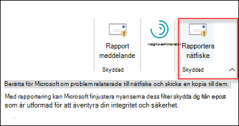

# Aktivera tillägget för att rapportera nätfiske

[!INCLUDE [Microsoft 365 Defender rebranding](../includes/microsoft-defender-for-office.md)]

> [!NOTE]
> Om du är administratör i en Microsoft 365-organisation med Exchange Online-postlådor rekommenderar vi att du använder portalen för inskickade inskickade material i Säkerhets- & efterlevnadscenter. Mer information finns i Använda [administratörsinskick för att skicka misstänkt skräppost, nättr ut, URL:er och filer till Microsoft.](admin-submission.md)

Med tilläggen Rapportmeddelande och Rapport nätfiske för Outlook och Outlook på webben (tidigare kallat Outlook Web App) kan användare enkelt rapportera falska positiva resultat (bra e-post markerad som dålig) eller falska negativa (felaktig e-post tillåten) till Microsoft och dess dotterbolag för analys.

Microsoft använder dessa inskickade material för att göra e-postskyddstekniken mer effektiv. Anta till exempel att personer rapporterar många meddelanden med hjälp av tillägget Rapport om nätfiske. Den här informationen visas i [säkerhetspanelen](security-dashboard.md) och andra rapporter. Din organisations säkerhetsgrupp kan använda den här informationen som en indikation på att principer mot nätfiske kan behöva uppdateras.

Du kan installera antingen tillägget Rapportmeddelande eller Rapportera nätfiske. Om du vill att användarna ska rapportera både skräppost och nätfiske distribuerar du tillägget Rapportmeddelande i organisationen. Mer information finns [i Aktivera tillägget Rapportmeddelande.](enable-the-report-message-add-in.md)

Tillägget Rapport nätfiske ger möjlighet att endast rapportera nätfiskemeddelanden. Administratörer kan aktivera tillägget Rapport nätfiske för organisationen, och enskilda användare kan installera det själva.

Om du är enskild användare kan du [aktivera tillägget Rapport nätfiske för dig själv.](#get-the-report-phishing-add-in-for-yourself)

Om du är global administratör eller Exchange [Online-administratör](#get-and-enable-the-report-phishing-add-in-for-your-organization)och Exchange är konfigurerat att använda OAuth-autentisering kan du aktivera tillägget Rapport nätfiske för din organisation. Rapporten nätfiske-Add-In är nu tillgänglig via [centraliserad distribution.](../../admin/manage/centralized-deployment-of-add-ins.md)

## Vad behöver jag veta innan jag börjar?

- Tillägget Rapportera nätfiske fungerar med de flesta Microsoft 365-prenumerationer och följande produkter:

  - Outlook på webben
  - Outlook 2013 SP1 eller senare
  - Outlook 2016 för Mac eller senare
  - Outlook ingår i Microsoft 365-appar för företag
  - Outlook-appen för iOS och Android

- Tillägget Rapportfiske är inte tillgängligt för delade postlådor eller postlådor i lokala Exchange-organisationer.

- Du kan konfigurera rapporterade meddelanden så att de kopieras eller omdirigeras till en postlåda som du anger. Mer information finns i Principer [för användarinskick.](user-submission.md)

- Din befintliga webbläsare bör fungera med tillägget Rapport nätfiske. Om du märker att tillägget inte är tillgängligt eller inte fungerar som förväntat kan du prova en annan webbläsare.

- För organisationsinstallationer måste organisationen konfigureras för att använda OAuth-autentisering. Mer information finns i [Avgöra om centraliserad distribution av tillägg fungerar för din organisation.](../../admin/manage/centralized-deployment-of-add-ins.md)

- Administratörer måste vara medlemmar i rollgruppen Globala administratörer. Mer information finns i [Behörigheter i Säkerhets- och efterlevnadscentret](permissions-in-the-security-and-compliance-center.md).

## Skaffa tillägget Rapport om nätfiske åt dig själv

1. Gå till Microsoft AppSource på <https://appsource.microsoft.com/marketplace/apps> och sök efter tillägget Rapport nätfiske.

2. Klicka **på HÄMTA NU.**

3. I dialogrutan som visas granskar du användningsvillkoren och sekretesspolicyn och klickar sedan på **Fortsätt.**

4. Logga in med ditt arbets- eller skolkonto (för företagsanvändning) eller ditt Microsoft-konto (för personlig användning).

När tillägget har installerats och aktiverats visas följande ikoner:

- Ikonen ser ut så här i Outlook:

  

- Ikonen ser ut så här i Outlook på webben:

  

## Hämta och aktivera tillägget Rapport om nätfiske för din organisation

> [!NOTE]
> Det kan ta upp till 12 timmar innan tillägget visas i organisationen.

1. I administrationscentret för Microsoft 365 går  du till sidan Inställningar tillägg på . Om tilläggssidan inte visas går du till länken Tillägg för inställningar integrerade appar högst upp på sidan Integrerade \>  <https://admin.microsoft.com/AdminPortal/Home#/Settings/AddIns>   \>  \>  appar. 

2. Välj **Distribuera tillägg** högst upp på sidan och välj sedan **Nästa.**

   

3. I den **utfällbaserade menyn** Distribuera ett nytt tillägg som visas granskar du informationen och klickar sedan på **Nästa.**

4. Klicka på Välj från **Store på nästa sida.**

   

5. På sidan **Välj tillägg som visas** klickar  du i rutan Sök, anger **Rapportfiske** och klickar sedan på **sökikonen**  . Leta rätt på Rapport nätfiske i **listan med resultat och** klicka sedan på Lägg **till**.

6. I dialogrutan som visas granskar du licens- och sekretessinformationen och klickar sedan på **Fortsätt.**

7. Konfigurera **följande inställningar på sidan** Konfigurera tillägget som visas:

   - **Tilldelade användare:** Välj ett av följande värden:

     - **Alla** (standard)
     - **Specifika användare/grupper**
     - **Bara jag**

   - **Distributionsmetod:** Välj något av följande värden:

     - **Åtgärdat (standard)**: Tillägget distribueras automatiskt till angivna användare och de kan inte ta bort det.
     - **Tillgängligt:** Användarna kan installera tillägget på **Fliken** Hämta \> **tillägg som hanteras** av \> **administratören.**
     - **Valfritt:** Tillägget distribueras automatiskt till de angivna användarna, men de kan välja att ta bort det.

   När du är klar klickar du på **Distribuera.**

8. På sidan **Distribuera nätfiske** som visas visas en förloppsrapport följt av en bekräftelse på att tillägget har distribuerats. När du har läst informationen klickar du på **Nästa.**

9. På **sidan Presentera tillägg som** visas granskar du informationen och klickar sedan på **Stäng.**

## Lär dig hur du använder tillägget Rapport om nätfiske

Personer som har tilldelats tillägget ser följande ikoner:

- Ikonen ser ut så här i Outlook:

  

- Ikonen ser ut så här i Outlook på webben:

  

## Granska eller redigera inställningar för tillägget Rapport nätfiske

1. I administrationscentret för Microsoft 365 går  du till sidan Inställningar tillägg på . Om tilläggssidan inte visas går du till länken Tillägg för inställningar integrerade appar högst upp på sidan Integrerade \>  <https://admin.microsoft.com/AdminPortal/Home#/Settings/AddIns>   \>  \>  appar. 

2. Leta upp och **välj tillägget** Rapport nätfiske.

3. I den **utfällna** menyn Redigera rapport nätfiske som visas, granskar och redigerar du inställningarna efter behov för din organisation. Klicka på **Spara** när du är klar.

## Visa och granska rapporterade meddelanden

Om du vill granska meddelanden som användare rapporterar till Microsoft har du följande alternativ:

- Använd portalen för administrationsinskick. Mer information finns i [Visa användarinskick till Microsoft.](admin-submission.md#view-user-submissions-to-microsoft)

- Skapa en e-postflödesregel (kallas även transportregel) för att skicka kopior av rapporterade meddelanden. Anvisningar finns i Använda [e-postflödesregler för att se vad användarna rapporterar till Microsoft.](use-mail-flow-rules-to-see-what-your-users-are-reporting-to-microsoft.md)
