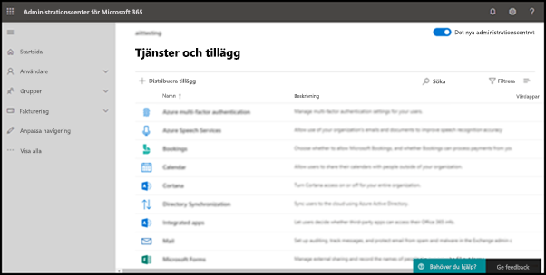

# Aktivera tillägget för att rapportera nätfiskeEnable the Report Phishing add-in

[!INCLUDE [Microsoft 365 Defender rebranding](../includes/microsoft-defender-for-office.md)]

> [!NOTE]
> Om du är administratör i en Microsoft 365 organisation med Exchange Online postlådor rekommenderar vi att du använder portalen för inskickade material i Microsoft 365 Defender postportalen.If you're an admin in a Microsoft 365 organization with Exchange Online mailboxes, we recommend that you use the Submissions portal in the Microsoft 365 Defender portal. Mer information finns i Använda [administratörsinskick för att skicka misstänkt skräppost, nättr ut, URL:er och filer till Microsoft.](admin-submission.md)For more information, see [Use Admin Submission to submit suspected spam, phish, URLs, and files to Microsoft](admin-submission.md).

Med tilläggen Rapportmeddelande och Rapport nätfiske för Outlook och Outlook på webben (tidigare kallat Outlook Web App) kan användare enkelt rapportera falska positiva meddelanden (bra e-post markerad som dålig) eller falska negativa meddelanden (felaktig e-post tillåten) till Microsoft och dess dotterbolag för analys.The Report Message and Report Phishing add-ins for Outlook and Outlook on the web (formerly known as Outlook Web App) enable people to easily report false positives (good email marked as bad) or false negatives (bad email allowed) to Microsoft and its affiliates for analysis.

Microsoft använder dessa inskickade material för att göra e-postskyddstekniken mer effektiv.Microsoft uses these submissions to improve the effectiveness of email protection technologies. Anta till exempel att personer rapporterar många meddelanden med hjälp av tillägget Rapport om nätfiske.For example, suppose that people are reporting many messages using the Report Phishing add-in. Den här informationen visas i [säkerhetspanelen](security-dashboard.md) och andra rapporter.This information surfaces in the [Security Dashboard](security-dashboard.md) and other reports. Din organisations säkerhetsgrupp kan använda den här informationen som en indikation på att principer mot nätfiske kan behöva uppdateras.Your organization's security team can use this information as an indication that anti-phishing policies might need to be updated.

Du kan installera antingen tillägget Rapportmeddelande eller Rapportera nätfiske.You can install either the Report Message or Report Phishing add-in. Om du vill att användarna ska rapportera både skräppost och nätfiske distribuerar du tillägget Rapportmeddelande i organisationen.If you want your users to report both spam and phishing messages, deploy the Report Message add-in in your organization. Mer information finns [i Aktivera tillägget Rapportmeddelande.](enable-the-report-message-add-in.md)For more information, see [Enable the Report Message add-in](enable-the-report-message-add-in.md).

Tillägget Rapport nätfiske ger möjlighet att endast rapportera nätfiskemeddelanden.The Report Phishing add-in provides the option to report only phishing messages. Administratörer kan aktivera tillägget Rapport nätfiske för organisationen, och enskilda användare kan installera det själva.Admins can enable the Report Phishing add-in for the organization, and individual users can install it for themselves.

Om du är enskild användare kan du [aktivera tillägget Rapport nätfiske för dig själv.](#get-the-report-phishing-add-in-for-yourself)If you're an individual user, you can [enable the Report Phishing add-in for yourself](#get-the-report-phishing-add-in-for-yourself).

Om du är global administratör eller [Exchange Online-administratör](#get-and-enable-the-report-phishing-add-in-for-your-organization)och Exchange är konfigurerat att använda OAuth-autentisering kan du aktivera tillägget Rapport nätfiske för din organisation.If you're a global administrator or an Exchange Online administrator, and Exchange is configured to use OAuth authentication, you can [enable the Report Phishing add-in for your organization](#get-and-enable-the-report-phishing-add-in-for-your-organization). Rapporten nätfiske-Add-In är nu tillgänglig via [centraliserad distribution.](../../admin/manage/centralized-deployment-of-add-ins.md)The Report Phishing Add-In is now available through [Centralized Deployment](../../admin/manage/centralized-deployment-of-add-ins.md).

## Vad behöver jag veta innan jag börjar?What do you need to know before you begin?

- Tillägget Rapport nätfiske fungerar med de flesta Microsoft 365 prenumerationer och följande produkter:The Report Phishing add-in works with most Microsoft 365 subscriptions and the following products:

  - Outlook på webbenOutlook on the web
  - Outlook 2013 SP1 eller senareOutlook 2013 SP1 or later
  - Outlook 2016 för Mac eller senareOutlook 2016 for Mac or later
  - Outlook ingår i Microsoft 365 för företagOutlook included with Microsoft 365 apps for Enterprise
  - Outlook för iOS och AndroidOutlook app for iOS and Android

- Tillägget Rapport nätfiske är inte tillgängligt för delade postlådor eller postlådor i lokala Exchange organisationer.The Report Phishing add-in is not available for shared mailboxes or mailboxes in on-premises Exchange organizations.

- Du kan konfigurera rapporterade meddelanden så att de kopieras eller omdirigeras till en postlåda som du anger.You can configure reported messages to be copied or redirected to a mailbox that you specify. Mer information finns i Principer [för användarinskick.](user-submission.md)For more information, see [User submissions policies](user-submission.md).

- Din befintliga webbläsare bör fungera med tillägget Rapport nätfiske.Your existing web browser should work with the Report Phishing add-in. Om du märker att tillägget inte är tillgängligt eller inte fungerar som förväntat kan du prova en annan webbläsare.But, if you notice the add-in is not available or not working as expected, try a different browser.

- För organisationsinstallationer måste organisationen konfigureras för att använda OAuth-autentisering.For organizational installs, the organization needs to be configured to use OAuth authentication. Mer information finns i [Avgöra om centraliserad distribution av tillägg fungerar för din organisation.](../../admin/manage/centralized-deployment-of-add-ins.md)For more information, see [Determine if Centralized Deployment of add-ins works for your organization](../../admin/manage/centralized-deployment-of-add-ins.md).

- Administratörer måste vara medlemmar i rollgruppen Globala administratörer.Admins need to be a member of the Global admins role group. Mer information finns under [Behörigheter på Microsoft 365 Defender-portalen](permissions-microsoft-365-security-center.md).For more information, see [Permissions in the Microsoft 365 Defender portal](permissions-microsoft-365-security-center.md).

## Skaffa tillägget Rapport om nätfiske åt dig självGet the Report Phishing add-in for yourself

1. Gå till Microsoft AppSource på <https://appsource.microsoft.com/marketplace/apps> och sök efter tillägget Rapport nätfiske.Go to the Microsoft AppSource at <https://appsource.microsoft.com/marketplace/apps> and search for the Report Phishing add-in.

2. Klicka **på HÄMTA NU.**Click **GET IT NOW**.

3. I dialogrutan som visas granskar du användningsvillkoren och sekretesspolicyn och klickar sedan på **Fortsätt.**In the dialog that appears, review the terms of use and privacy policy, and then click **Continue**.

4. Logga in med ditt arbets- eller skolkonto (för företagsanvändning) eller ditt Microsoft-konto (för personlig användning).Sign in using your work or school account (for business use) or your Microsoft account (for personal use).

När tillägget har installerats och aktiverats visas följande ikoner:After the add-in is installed and enabled, you'll see the following icons:

- I Outlook ser ikonen ut så här:In Outlook, the icon looks like this:

  

- I Outlook på webben ser ikonen ut så här:In Outlook on the web, the icon looks like this:

  

## Hämta och aktivera tillägget Rapport om nätfiske för din organisationGet and enable the Report Phishing add-in for your organization

> [!NOTE]
> Det kan ta upp till 12 timmar innan tillägget visas i organisationen.It could take up to 12 hours for the add-in to appear in your organization.

1. I Administrationscenter för Microsoft 365 går du till sidan **Inställningar-tillägg** på . Om du inte ser tilläggssidan går du till länken tillägg för \>  <https://admin.microsoft.com/AdminPortal/Home#/Settings/AddIns>   \>  \> **Inställningar-integrerade**  appar högst upp på sidan Integrerade appar.In the Microsoft 365 admin center, go to the go to the **Settings** \> **Add-ins** page at <https://admin.microsoft.com/AdminPortal/Home#/Settings/AddIns>, If you don't see the **Add-in** Page, go to the **Settings** \> **Integrated apps** \> **Add-ins** link on the top of the **Integrated apps** page.

2. Välj **Distribuera tillägg** högst upp på sidan och välj sedan **Nästa.**Select **Deploy Add-in** at the top of the page, and then select **Next**.

   

3. I den **utfällbaserade menyn** Distribuera ett nytt tillägg som visas granskar du informationen och klickar sedan på **Nästa.**In the **Deploy a new add-in** flyout that appears, review the information, and then click **Next**.

4. Klicka på Välj från **Store på nästa sida.**On the next page, click **Choose from the Store**.

   

5. På sidan **Välj tillägg som visas** klickar  du i rutan Sök, anger **Rapportfiske** och klickar sedan på **sökikonen**  .In the **Select add-in** page that appears, click in the **Search** box, enter **Report Phishing**, and then click **Search** . Leta rätt på Rapport nätfiske i **listan med resultat och** klicka sedan på Lägg **till**.In the list of results, find **Report Phishing** and then click **Add**.

6. I dialogrutan som visas granskar du licens- och sekretessinformationen och klickar sedan på **Fortsätt.**In the dialog that appears, review the licensing and privacy information, and then click **Continue**.

7. Konfigurera **följande inställningar på sidan** Konfigurera tillägget som visas:In the **Configure add-in** page that appears, configure the following settings:

   - **Tilldelade användare:** Välj ett av följande värden:**Assigned users**: Select one of the following values:

     - **Alla** (standard)**Everyone** (default)
     - **Specifika användare/grupper****Specific users / groups**
     - **Bara jag****Just me**

   - **Distributionsmetod:** Välj något av följande värden:**Deployment method**: Select one of the following values:

     - **Åtgärdat (standard)**: Tillägget distribueras automatiskt till angivna användare och de kan inte ta bort det.**Fixed (Default)**: The add-in is automatically deployed to the specified users and they can't remove it.
     - **Tillgängligt:** Användarna kan installera tillägget på **Fliken** Hämta \> **tillägg som hanteras** av \> **administratören.****Available**: Users can install the add-in at **Home** \> **Get add-ins** \> **Admin-managed**.
     - **Valfritt:** Tillägget distribueras automatiskt till de angivna användarna, men de kan välja att ta bort det.**Optional**: The add-in is automatically deployed to the specified users, but they can choose to remove it.

   När du är klar klickar du på **Distribuera.**When you're finished, click **Deploy**.

8. På sidan **Distribuera nätfiske** som visas visas en förloppsrapport följt av en bekräftelse på att tillägget har distribuerats.In the **Deploy Report Phishing** page that appears, you'll see a progress report followed by a confirmation that the add-in was deployed. När du har läst informationen klickar du på **Nästa.**After you read the information, click **Next**.

9. På **sidan Presentera tillägg som** visas granskar du informationen och klickar sedan på **Stäng.**On the **Announce add-in** page that appears, review the information, and then click **Close**.

## Lär dig hur du använder tillägget Rapport om nätfiskeLearn how to use the Report Phishing add-in

Personer som har tilldelats tillägget ser följande ikoner:People who have the add-in assigned to them will see the following icons:

- I Outlook ser ikonen ut så här:In Outlook, the icon looks like this:

  

- I Outlook på webben ser ikonen ut så här:In Outlook on the web, the icon looks like this:

  

## Granska eller redigera inställningar för tillägget Rapport nätfiskeReview or edit settings for the Report Phishing add-in

1. I Administrationscenter för Microsoft 365 går du till sidan **Inställningar-tillägg** på . Om du inte ser tilläggssidan går du till länken tillägg för \>  <https://admin.microsoft.com/AdminPortal/Home#/Settings/AddIns>   \>  \> **Inställningar-integrerade**  appar högst upp på sidan Integrerade appar.In the Microsoft 365 admin center, go to the go to the **Settings** \> **Add-ins** page at <https://admin.microsoft.com/AdminPortal/Home#/Settings/AddIns>, If you don't see the **Add-in** Page, go to the **Settings** \> **Integrated apps** \> **Add-ins** link on the top of the **Integrated apps** page.

2. Leta upp och **välj tillägget** Rapport nätfiske.Find and select the **Report Phishing** add-in.

3. I den **utfällna** menyn Redigera rapport nätfiske som visas, granskar och redigerar du inställningarna efter behov för din organisation.In the **Edit Report Phishing** flyout that appears, review, and edit settings as appropriate for your organization. Klicka på **Spara** när du är klar.When you're finished, click **Save**.

## Visa och granska rapporterade meddelandenView and review reported messages

Om du vill granska meddelanden som användare rapporterar till Microsoft har du följande alternativ:To review messages that users report to Microsoft, you have these options:

- Använd portalen för administrationsinskick.Use the Admin Submissions portal. Mer information finns i [Visa användarinskick till Microsoft.](admin-submission.md#view-user-submissions-to-microsoft)For more information, see [View user submissions to Microsoft](admin-submission.md#view-user-submissions-to-microsoft).

- Skapa en e-postflödesregel (kallas även transportregel) för att skicka kopior av rapporterade meddelanden.Create a mail flow rule (also known as a transport rule) to send copies of reported messages. Instruktioner finns i Använda [e-postflödesregler för att se vad användarna rapporterar till Microsoft.](/exchange/security-and-compliance/mail-flow-rules/use-rules-to-see-what-users-are-reporting-to-microsoft)For instructions, see [Use mail flow rules to see what users are reporting to Microsoft](/exchange/security-and-compliance/mail-flow-rules/use-rules-to-see-what-users-are-reporting-to-microsoft).
