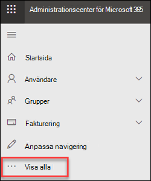
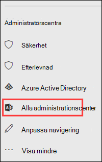
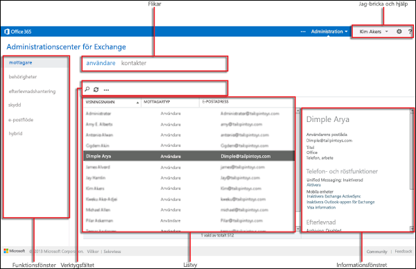

# Administrationscenter för Exchange i fristående EOPExchange admin center in standalone EOP

Exchange admin center (EAC) är en webbaserad hanteringskonsol för fristående Exchange Online Protection (EOP).The Exchange admin center (EAC) is a web-based management console for standalone Exchange Online Protection (EOP).

Letar du efter Exchange Online-versionen av det här avsnittet?Looking for the Exchange Online version of this topic? Se [Administrationscenter för Exchange i Exchange Online](https://docs.microsoft.com/exchange/exchange-admin-center).See [Exchange admin center in Exchange Online](https://docs.microsoft.com/exchange/exchange-admin-center).

## Öppna EAC i EOPOpen the EAC in EOP

Fristående EOP-kunder kan komma åt EAC med hjälp av följande metoder:Standalone EOP customers can access the EAC by using the following methods:

- **Från Microsoft 365 admin center:****From the Microsoft 365 admin center**:

  1. Gå till <https://admin.microsoft.com> och klicka på Visa **alla**.Go to <https://admin.microsoft.com> and click **Show all**.

     

  2. Klicka på Alla **administrationscenter i** avsnittet **Administrationscenter**som visas.In the **Admin centers** section that appears, click **All admin centers**.

     

  3. Klicka på **Exchange Online Protection**på sidan Alla **administrationscenter** som visas .On the **All admin centers** page that appears, click **Exchange Online Protection**.

- Gå direkt till `https://admin.protection.outlook.com/ecp/` .Go directly to `https://admin.protection.outlook.com/ecp/`.

## Gemensamma element för användargränssnitt i EAC i EOPCommon user interface elements in the EAC in EOP

I det här avsnittet beskrivs de användargränssnittselement som finns i EAC.This section describes the user interface elements that are found in the EAC.

### FunktionsfönstretFeature Pane

Detta är den första navigeringsnivån för de flesta av de uppgifter som du utför i EAC.This is the first level of navigation for most of the tasks you'll perform in the EAC. Funktionsfönstret är ordnat efter funktionsområden.The feature pane is organized by feature areas.

- **Mottagare**: Här ska du visa grupper och externa kontakter.**Recipients**: This is where you'll view groups and external contacts.

- **Behörigheter**: Här hanterar du administratörsroller.**Permissions**: This where you'll manage admin roles.

- **Efterlevnadshantering**: Här hittar du rapporten administratörsrollgrupp och rapporten administratörsgranskningslogg.**Compliance Management**: This is where you'll find the administrator role group report and the admin audit log report.

- **Skydd**: Här kan du hantera principer mot skadlig kod, standardprincipen för anslutningsfilter och DKIM.**Protection**: This is where you can manage anti-malware policies, the default connection filter policy, and DKIM.

  > [!NOTE]
  > Du bör hantera principer mot skadlig kod och standardprincipen för anslutningsfilter i Security & Compliance Center.You should manage anti-malware policies and the default connection filter policy in the Security & Compliance Center. Mer information finns [i Konfigurera principer mot skadlig kod i EOP](configure-anti-malware-policies.md) och Konfigurera [anslutningsfiltrering i EOP](configure-the-connection-filter-policy.md).For more information, see [Configure anti-malware policies in EOP](configure-anti-malware-policies.md) and [Configure connection filtering in EOP](configure-the-connection-filter-policy.md).

- **E-postflöde:** Här hanterar du regler för e-postflöde (kallas även transportregler), accepterade domäner och kopplingar samt var du kan gå för att köra meddelandespårning.**Mail Flow**: This is where you'll manage mail flow rules (also known as transport rules), accepted domains, and connectors, as well as where you can go to run message trace.

- **Hybrid:** Här kan du köra [hybridkonfigurationsguiden](https://docs.microsoft.com/Exchange/hybrid-configuration-wizard)och där du kan installera [Exchange Online PowerShell-modulen](https://docs.microsoft.com/powershell/exchange/mfa-connect-to-exchange-online-powershell).**Hybrid**: This is where you can run the [Hybrid Configuration Wizard](https://docs.microsoft.com/Exchange/hybrid-configuration-wizard), and where you can install the [Exchange Online PowerShell module](https://docs.microsoft.com/powershell/exchange/mfa-connect-to-exchange-online-powershell).

### FlikarTabs

Flikarna är din andra navigeringsnivå.The tabs are your second level of navigation. Vart och ett av funktionsområdena innehåller olika flikar, som var och en representerar en funktion.Each of the feature areas contains various tabs, each representing a feature.

### VerktygsfältetToolbar

När du klickar på de flesta flikar visas ett verktygsfält.When you click most tabs, you'll see a toolbar. Verktygsfältet har ikoner som utför en viss åtgärd.The toolbar has icons that perform a specific action. I följande tabell beskrivs ikonerna och deras åtgärder.The following table describes the icons and their actions.

||||
|---|---|---|
|**Ikonen****Icon**|**Namn****Name**|**Åtgärder****Action**|
||Lägg till, NyttAdd, New|Använd den här ikonen om du vill skapa ett nytt objekt.Use this icon to create a new object. Vissa av dessa ikoner har en associerad nedpil som du kan klicka på för att visa ytterligare objekt som du kan skapa.Some of these icons have an associated down arrow you can click to show additional objects you can create.|
||RedigeraEdit|Använd den här ikonen för att redigera ett objekt.Use this icon to edit an object.|
||Ta bortDelete|Använd den här ikonen om du vill ta bort ett objekt.Use this icon to delete an object. Vissa borttagningsikoner har en nedpil som du kan klicka på för att visa ytterligare alternativ.Some delete icons have a down arrow you can click to show additional options.|
||SökSearch|Använd den här ikonen för att öppna en sökruta där du kan skriva sökfrasen för ett objekt som du vill söka efter.Use this icon to open a search box in which you can type the search phrase for an object you want to find.|
||ÅterställningRefresh|Använd den här ikonen för att uppdatera listvyn.Use this icon to refresh the list view.|
||Fler alternativMore options|Använd den här ikonen om du vill visa fler åtgärder som du kan utföra för flikens objekt.Use this icon to view more actions you can perform for that tab's objects. I Mottagare **visar \> användare** som klickar på den här ikonen alternativet för att utföra en **avancerad sökning**.For example, in **Recipients \> Users** clicking this icon shows the option to perform an **Advanced Search**.|
||Uppil och nedpilUp arrow and down arrow|Använd dessa ikoner för att flytta ett objekts prioritet uppåt eller nedåt.Use these icons to move an object's priority up or down.|
||Ta bortRemove|Använd den här ikonen om du vill ta bort objekt från en lista.Use this icon to remove objects from a list.|
|

### ListvyList View

När du väljer en flik visas i de flesta fall en listvy.When you select a tab, in most cases you'll see a list view. Den synliga gränsen med EAC-listvyn är cirka 10 000 objekt.The viewable limit with the EAC list view is approximately 10,000 objects. Dessutom ingår personsökning så att du kan bläddra till resultat.In addition, paging is included so that you can page to results.

### InformationsfönstretDetails Pane

När du markerar ett objekt i listvyn visas information om objektet i informationsfönstret.When you select an object from the list view, information about that object is displayed in the details pane. I vissa fall innehåller informationsfönstret hanteringsuppgifter.In some cases the details pane includes management tasks.

### Jag kakel och hjälpMe tile and Help

Med panelen **Jag** kan du logga ut EAC:en och logga in som en annan användare.The **Me** tile allows you to sign out the EAC and sign in as a different user. På **Help**  den nedrullningssvänliga menyn Hjälpikon kan du utföra följande åtgärder:From the **Help** drop-down menu, you can perform the following actions:

- **Hjälp:** Klicka på  Hjälpikonen för att visa hjälpinnehållet online.**Help**: Click  to view the online help content.

- **Feedback**: Lämna feedback.**Feedback**: Leave feedback.

- **Community**: Post en fråga för att hitta svar i community forum.**Community**: Post a question for find answers in the community forums.

- **Inaktivera hjälpbubbla:** Hjälpbubblan visar sammanhangsberoende hjälp för fält när du skapar eller redigerar ett objekt.**Disable Help bubble**: The Help bubble displays contextual help for fields when you create or edit an object. Du kan stänga av hjälpbubblan eller slå på den om den har inaktiverats.You can turn off the Help bubble or turn it on if it has been disabled.

- **Visa kommandologgning:** Ett nytt fönster öppnas som visar motsvarande PowerShell-kommandon baserat på vad du har konfigurerat i EAC.**Show Command Logging**: A new window opens that shows the equivalent PowerShell commands based on what you configured in EAC.

## Webbläsare som stödsSupported Browsers

För bästa möjliga upplevelse av EAC rekommenderar vi att du alltid använder de senaste webbläsarna, Office-klienterna och apparna.For the best experience using the EAC, we recommend that you always use the latest browsers, Office clients, and apps. Vi rekommenderar också att du installerar programuppdateringar när de blir tillgängliga.We also recommend that you install software updates when they become available. Mer information om de webbläsare och systemkrav som stöds för tjänsten finns i [Systemkrav för Office](https://products.office.com/office-system-requirements).For more information about the supported browsers and system requirements for the service, see [System requirements for Office](https://products.office.com/office-system-requirements).

## Språk som stödsSupported languages

Följande språk stöds och är tillgängliga för EAC i fristående EOP.The following languages are supported and available for the EAC in standalone EOP.

- AmhariskaAmharic

- ArabiskaArabic

- Baskiska (baskiska)Basque (Basque)

- Bengali (Indien)Bengali (India)

- BulgarianBulgarian

- CatalanCatalan

- Kinesiska (förenklad)Chinese (Simplified)

- Kinesiska (traditionell)Chinese (Traditional)

- CroatianCroatian

- CzechCzech

- DanishDanish

- DutchDutch

- DutchDutch

- EnglishEnglish

- EstonianEstonian

- Filippinska (Filippinerna)Filipino (Philippines)

- FinnishFinnish

- FrenchFrench

- GalicianGalician

- GermanGerman

- GreekGreek

- GujaratiGujarati

- HebrewHebrew

- HindiHindi

- HungarianHungarian

- IsländskaIcelandic

- IndonesianIndonesian

- ItalianItalian

- JapaneseJapanese

- KannadaKannada

- KazakhKazakh

- KiswahiliKiswahili

- KoreanKorean

- LatvianLatvian

- LithuanianLithuanian

- Malajiska (Brunei Darussalam)Malay (Brunei Darussalam)

- Malajiska (Malaysia)Malay (Malaysia)

- MalayalamMalayalam

- MarathiMarathi

- Norska (Bokmål)Norwegian (Bokmål)

- Norska (nynorsk)Norwegian (Nynorsk)

- OriyaOriya

- PersiskaPersian

- PolishPolish

- Portugisiska (Brasilien)Portuguese (Brazil)

- Portugisiska (Portugal)Portuguese (Portugal)

- RomanianRomanian

- RussianRussian

- Serbiska (kyrilliska, Serbien)Serbian (Cyrillic, Serbia)

- Serbiska (latin)Serbian (Latin)

- SlovakSlovak

- SlovenianSlovenian

- SpanishSpanish

- SwedishSwedish

- TamilskaTamil

- TeluguTelugu

- ThaiThai

- TurkishTurkish

- UkrainianUkrainian

- UrduUrdu

- VietnameseVietnamese

- WalesiskaWelsh
