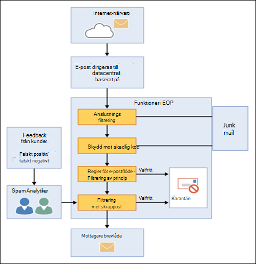

# Översikt över Exchange Online Protection

Exchange Online Protection (EOP) är den molnbaserade filtreringstjänsten som hjälper till att skydda din organisation mot skräppost och skadlig kod. EOP ingår i alla Microsoft 365-organisationer med Exchange Online-postlådor.

Men EOP är också tillgängligt i följande lokala scenarier:

- **I ett fristående scenario:** EOP ger molnbaserat e-postskydd för din lokala Exchange-organisation eller för någon annan lokal SMTP-e-postlösning.

- **I en hybriddistribution:** EOP kan konfigureras för att skydda din e-postmiljö och styra e-postroutning när du har en blandning av lokala och molnpostlådor.

I dessa scenarier kan EOP förenkla hanteringen av din e-postmiljö och minska många av de bördor som följer med att underhålla lokal maskinvara och programvara.

I resten av det här avsnittet beskrivs hur EOP fungerar i fristående miljöer och hybridmiljöer.

## Så här fungerar EOP

För att förstå hur EOP fungerar hjälper det att se hur det bearbetar inkommande e-post:

- Ett inkommande meddelande passerar inledningsvis genom anslutningsfiltrering, som kontrollerar avsändarens rykte och kontrollerar meddelandet efter skadlig kod. Majoriteten av spam stoppas på denna punkt och tas bort av EOP. Mer information finns i [konfigurera anslutningsfilter](configure-the-connection-filter-policy.md).

- Meddelanden fortsätter genom principfiltrering, där meddelanden utvärderas mot anpassade regler för e-postflöde (kallas även transportregler) som du skapar eller tillämpar från en mall. Du kan till exempel ha en regel som skickar ett meddelande till en chef när e-post kommer från en viss avsändare. DLP-kontroller (Data loss prevention) sker också vid denna tidpunkt (Exchange Enterprise CAL with Services).

- Därefter passerar meddelanden genom skräppostfiltrering (kallas även innehållsfiltrering). Ett meddelande som är bestämt att vara skräppost kan skickas till en användares skräppostmapp eller till karantänen, bland andra alternativ. Mer information finns i [Konfigurera principer för skräppostskydd](configure-your-spam-filter-policies.md).

- När ett meddelande har skickat alla dessa skyddslager har levererats det till mottagaren.

Mer information finns i [Ordning och prioritet för e-postskydd](how-policies-and-protections-are-combined.md).

### EOP-datacenter

EOP körs på ett världsomspännande nätverk av datacenter som är utformade för att ge den bästa tillgängligheten. Om ett datacenter till exempel blir otillgängligt dirigeras e-postmeddelanden automatiskt till ett annat datacenter utan avbrott i tjänsten. Servrar i varje datacenter accepterar meddelanden för din räkning, vilket ger ett lager av separation mellan din organisation och internet, vilket minskar belastningen på dina servrar. Genom detta nätverk med högtillgänglig tillgång kan Microsoft se till att e-post når din organisation i tid.

EOP utför belastningsutjämning mellan datacenter men bara inom en region. Om du etableras i en region bearbetas alla dina meddelanden med hjälp av e-postroutning för den regionen. Följande lista visar hur regional e-postroutning fungerar för EOP-datacenter:

- I Europa, Mellanöstern och Afrika (EMEA) finns alla Exchange Online-postlådor i EMEA-datacenter och alla meddelanden dirigeras via EMEA-datacenter för EOP-filtrering.

- I Asien-Stillahavsområdet (APAC) finns alla Exchange Online-postlådor i APAC-datacenter och meddelanden dirigeras för närvarande via APAC-datacenter för EOP-filtrering.

- I Amerika finns alla Exchange Online-postlådor i amerikanska datacenter, med undantag för Sydamerika där datacenter i Brasilien och Chile används och i Kanada där datacenter i Kanada används. Alla e-postmeddelanden, inklusive meddelanden för kunder i Sydamerika och Kanada, dirigeras via lokala datacenter för EOP-filtrering. e-post i karantän lagras i det datacenter där klienten finns.

- För Government Community Cloud (GCC) finns alla Exchange Online-postlådor i amerikanska datacenter och alla meddelanden dirigeras via amerikanska datacenter för EOP-filtrering.

## EOP-planer och funktioner för lokala e-postorganisationer

De tillgängliga EOP-prenumerationsplanerna är:

- **EOP fristående**: Du registrerar dig i EOP för att skydda din lokala e-postorganisation.

- **EOP-funktioner i Exchange Online**: Alla prenumerationer som inkluderar Exchange Online (fristående eller som en del av Microsoft 365) använder EOP för att skydda dina Exchange Online-postlådor.

- **Exchange Enterprise CAL med tjänster**: Om du har en lokal Exchange-organisation där du har köpt ytterligare Exchange Enterprise CAL med tjänstelicenser är EOP en del av de inkluderade tjänsterna.

Information om krav, viktiga begränsningar och funktionstillgänglighet i alla EOP-prenumerationsplaner finns i [beskrivningen av Tjänsten Exchange Online Protection](https://docs.microsoft.com/office365/servicedescriptions/exchange-online-protection-service-description/exchange-online-protection-service-description).

## Konfigurera EOP för lokala e-postorganisationer

Det kan vara enkelt att konfigurera EOP, särskilt när det gäller en liten organisation med en handfull efterlevnadsregler. Men om du har en stor organisation med flera domäner, anpassade efterlevnadsregler eller hybridpostflöde kan det ta mer planering och tid.

Om du redan har köpt EOP läser du [Konfigurera din EOP-tjänst](set-up-your-eop-service.md) för att se till att du slutför alla nödvändiga steg för att konfigurera EOP för att skydda din meddelandemiljö.

## EOP-hjälp för administratörer

Hjälpinnehållet för EOP-administratörer består av följande kategorier på den högsta nivån:

- [Översikt över Exchange Online Protection](exchange-online-protection-overview.md): Introducerar hur EOP fungerar och innehåller länkar till ytterligare information.

- [EOP-funktioner](eop-features.md): Innehåller en lista över funktioner som är tillgängliga i EOP.

- [Konfigurera din EOP-tjänst:](set-up-your-eop-service.md)Innehåller steg för att konfigurera din EOP-tjänst och länkar till ytterligare information.

- [Byt till EOP från Google Postini, Barracuda Spam and Virus Firewall eller Cisco IronPort](switch-to-eop-from-google-postini-the-barracuda-spam-and-virus-firewall-or-cisco.md): Beskriver processen för att byta till EOP från en annan e-postskyddsprodukt.

- [Hantera mottagare i fristående EOP:](manage-recipients-in-eop.md)Beskriver hur du hanterar e-postanvändare och grupper i EOP.

- [E-postflöde i EOP:](mail-flow-in-eop.md)Beskriver hur du konfigurerar anpassade scenarier för e-postflöde med kopplingar, hur du hanterar domäner som är associerade med tjänsten och hur du aktiverar funktionen DBEB (Directory Based Edge Blocking).

- [Metodtips för att konfigurera EOP:](best-practices-for-configuring-eop.md)Beskriver rekommenderade konfigurationsinställningar och överväganden för när du har konfigurerat och etablerat tjänsten.

- [Granskningsrapporter i fristående EOP](auditing-reports-in-eop.md): Beskriver hur du använder granskningsrapporter för att spåra konfigurationsändringar i tjänsten.

- [Skydd mot skräppost och skadlig kod i EOP:](anti-spam-and-anti-malware-protection.md)Beskriver filtrering av skräppost och filtrering av skadlig kod och visar hur du anpassar dem så att de bäst uppfyller organisationens behov. Beskriver också uppgifter som administratörer och slutanvändare kan utföra på meddelanden i karantän.

- [Rapportering och meddelandespårning i Exchange Online Protection](reporting-and-message-trace-in-exchange-online-protection.md): Beskriver de rapporter och felsökningsverktyg som är tillgängliga.

- [Exchange admin center i fristående EOP:](exchange-admin-center-in-exchange-online-protection-eop.md)Beskriver hur du kommer åt och navigera genom Exchange admin center (EAC) hanteringsgränssnitt för att hantera din EOP-tjänst.

- [Exchange Online Protection PowerShell](https://docs.microsoft.com/powershell/exchange/exchange-online-protection-powershell): Innehåller information om fjärr-PowerShell, som gör att du kan hantera din EOP-tjänst från kommandoraden.

- [Hjälp och support för EOP](help-and-support-for-eop.md) Ger information om hur du skaffar hjälp och teknisk support.
