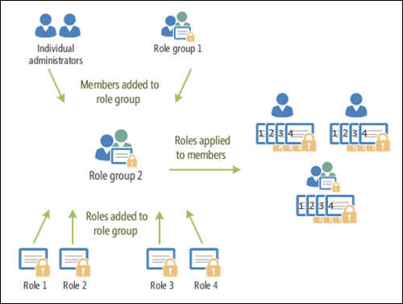

# <a name="permissions-in-standalone-eop"></a><span data-ttu-id="ad1b5-103">Behörigheter i fristående EOP</span><span class="sxs-lookup"><span data-stu-id="ad1b5-103">Permissions in standalone EOP</span></span>

<span data-ttu-id="ad1b5-104">Fristående Exchange Online Protection (EOP) utan Exchange Online-postlådor använder RBAC-behörighet (rollbaserad åtkomst kontroll) för att enkelt ge administratörer behörigheter.</span><span class="sxs-lookup"><span data-stu-id="ad1b5-104">Standalone Exchange Online Protection (EOP) without Exchange Online mailboxes uses the Role Based Access Control (RBAC) permissions model to easily grant permissions to your admins.</span></span> <span data-ttu-id="ad1b5-105">Du kan använda behörighets funktionerna i fristående EOP för att snabbt komma igång med din nya organisation.</span><span class="sxs-lookup"><span data-stu-id="ad1b5-105">You can use the permission features in standalone EOP to get your new organization up and running quickly.</span></span>

<span data-ttu-id="ad1b5-106">Information om hur du tilldelar användare behörigheter finns i [Hantera administratörs roll grupper i EOP](manage-admin-role-group-permissions-in-eop.md).</span><span class="sxs-lookup"><span data-stu-id="ad1b5-106">To grant permissions to users, see [Manage admin role groups in EOP](manage-admin-role-group-permissions-in-eop.md).</span></span>

<span data-ttu-id="ad1b5-107">Mer information om behörigheter i Microsoft 365 finns i [om administratörs roller](https://docs.microsoft.com/microsoft-365/admin/add-users/about-admin-roles).</span><span class="sxs-lookup"><span data-stu-id="ad1b5-107">For more information about permissions across Microsoft 365, see [About admin roles](https://docs.microsoft.com/microsoft-365/admin/add-users/about-admin-roles).</span></span>

## <a name="role-based-permissions"></a><span data-ttu-id="ad1b5-108">Rollbaserade behörigheter</span><span class="sxs-lookup"><span data-stu-id="ad1b5-108">Role-based permissions</span></span>

<span data-ttu-id="ad1b5-109">Administratörs behörighet som du ger användare baseras på hanterings roller.</span><span class="sxs-lookup"><span data-stu-id="ad1b5-109">The admin permissions that you grant to users are based on management roles.</span></span> <span data-ttu-id="ad1b5-110">En hanterings roll definierar de cmdlets som är tillgängliga för en uppsättning uppgifter.</span><span class="sxs-lookup"><span data-stu-id="ad1b5-110">A management role defines the cmdlets that are available for a set of given tasks.</span></span> <span data-ttu-id="ad1b5-111">Eftersom administrations centret för Exchange (UK) och den fristående EOP-PowerShell använder båda cmdlets ger användare behörighet att utföra relaterade uppgifter i UK eller i fristående EOP PowerShell.</span><span class="sxs-lookup"><span data-stu-id="ad1b5-111">Because the Exchange admin center (EAC) and standalone EOP PowerShell both use cmdlets, granting access to a cmdlet gives the user permission to do the related tasks in the EAC or in standalone EOP PowerShell.</span></span> <span data-ttu-id="ad1b5-112">Rollen e-postmottagare definierar till exempel de cmdlets som krävs för att ändra e-postanvändare.</span><span class="sxs-lookup"><span data-stu-id="ad1b5-112">For example, the Mail Recipients role defines the cmdlets that are required to modify mail users.</span></span>

<span data-ttu-id="ad1b5-113">I fristående EOP är administrativa roller den enda typ av hanterings roll som är tillgänglig (det finns inga roller för slutanvändare eller roll tilldelning).</span><span class="sxs-lookup"><span data-stu-id="ad1b5-113">In standalone EOP, administrative roles are the only type of management role that's available (there are no end-user roles or role assignment policies).</span></span>

## <a name="role-groups"></a><span data-ttu-id="ad1b5-114">Roll grupper</span><span class="sxs-lookup"><span data-stu-id="ad1b5-114">Role groups</span></span>

<span data-ttu-id="ad1b5-115">För att göra det lättare att tilldela roller till användare använder fristående EOP roll grupper.</span><span class="sxs-lookup"><span data-stu-id="ad1b5-115">To make it easier to assign roles to users, standalone EOP uses role groups.</span></span> <span data-ttu-id="ad1b5-116">Hanterings roller är tilldelade till roll grupper och roll gruppens medlemmar får de behörigheter som är kopplade till rollerna.</span><span class="sxs-lookup"><span data-stu-id="ad1b5-116">Management roles are assigned to role groups, and the role group members get the permissions that are associated with the roles.</span></span> <span data-ttu-id="ad1b5-117">Med andra ord är inte lednings roller direkt kopplade till användarna. de har tilldelats roll gruppen.</span><span class="sxs-lookup"><span data-stu-id="ad1b5-117">In other words, management roles aren't directly assigned to users; they're assigned to role group.</span></span> <span data-ttu-id="ad1b5-118">Med den här modellen kan du tilldela många roller till många roll grupps medlemmar samtidigt.</span><span class="sxs-lookup"><span data-stu-id="ad1b5-118">This model allows you to assign many roles to many role group members at once.</span></span> <span data-ttu-id="ad1b5-119">Roll grupps medlemmar kan vara e-postanvändare, e-postaktiverade säkerhets grupper, användare från Microsoft 365 Admin Center och andra roll grupper.</span><span class="sxs-lookup"><span data-stu-id="ad1b5-119">Role group members can be mail users, mail-enabled security groups, users from the Microsoft 365 admin center, and other role groups.</span></span>

<span data-ttu-id="ad1b5-120">Följande bild visar förhållandet mellan användare, roll grupper och roller.</span><span class="sxs-lookup"><span data-stu-id="ad1b5-120">The following figure shows the relationship between users, role groups, and roles.</span></span>



<span data-ttu-id="ad1b5-122">De tillgängliga roll grupperna i fristående EOP beskrivs i följande tabell.</span><span class="sxs-lookup"><span data-stu-id="ad1b5-122">The available role groups in standalone EOP are described in the following table.</span></span>

****

|<span data-ttu-id="ad1b5-123">Roll grupp</span><span class="sxs-lookup"><span data-stu-id="ad1b5-123">Role group</span></span>|<span data-ttu-id="ad1b5-124">Beskrivning</span><span class="sxs-lookup"><span data-stu-id="ad1b5-124">Description</span></span>|<span data-ttu-id="ad1b5-125">Standard roller tilldelade</span><span class="sxs-lookup"><span data-stu-id="ad1b5-125">Default roles assigned</span></span>|
|---|---|---|
|<span data-ttu-id="ad1b5-126">ComplianceManagement</span><span class="sxs-lookup"><span data-stu-id="ad1b5-126">ComplianceManagement</span></span>|<span data-ttu-id="ad1b5-127">Konfigurera och hantera inställningar för efterlevnad i organisationen, inklusive data förlust skydd (DLP) om ditt abonnemang har DLP-funktioner.</span><span class="sxs-lookup"><span data-stu-id="ad1b5-127">Configure and manage compliance settings within the organization, including data loss prevention (DLP) if your subscription has DLP capabilities.</span></span> <br/><br/> <span data-ttu-id="ad1b5-128">Medlemmar i rollen [efterlevnad för administratörer](https://docs.microsoft.com/azure/active-directory/users-groups-roles/directory-assign-admin-roles#compliance-administrator) i Azure AD får automatiskt behörigheterna för den här roll gruppen.</span><span class="sxs-lookup"><span data-stu-id="ad1b5-128">Members of the [Compliance Administrator](https://docs.microsoft.com/azure/active-directory/users-groups-roles/directory-assign-admin-roles#compliance-administrator) role in Azure AD automatically get the permissions of this role group.</span></span>|<span data-ttu-id="ad1b5-129">Gransknings loggar</span><span class="sxs-lookup"><span data-stu-id="ad1b5-129">Audit Logs</span></span> <br/><br/> <span data-ttu-id="ad1b5-130">Administration av efterlevnad</span><span class="sxs-lookup"><span data-stu-id="ad1b5-130">Compliance Administration</span></span> <br/><br/> <span data-ttu-id="ad1b5-131">Information Rights Management</span><span class="sxs-lookup"><span data-stu-id="ad1b5-131">Information Rights Management</span></span> <br/><br/> <span data-ttu-id="ad1b5-132">Hantering av bevarande</span><span class="sxs-lookup"><span data-stu-id="ad1b5-132">Retention Management</span></span> <br/><br/> <span data-ttu-id="ad1b5-133">Gransknings loggar endast för visning</span><span class="sxs-lookup"><span data-stu-id="ad1b5-133">View-Only Audit Logs</span></span> <br/><br/> <span data-ttu-id="ad1b5-134">Skrivskyddad konfiguration</span><span class="sxs-lookup"><span data-stu-id="ad1b5-134">View-Only Configuration</span></span> <br/><br/> <span data-ttu-id="ad1b5-135">Endast visning-mottagare</span><span class="sxs-lookup"><span data-stu-id="ad1b5-135">View-Only Recipients</span></span>|
|<span data-ttu-id="ad1b5-136">ContentExplorerContentViewer</span><span class="sxs-lookup"><span data-stu-id="ad1b5-136">ContentExplorerContentViewer</span></span>|<span data-ttu-id="ad1b5-137">Används inte.</span><span class="sxs-lookup"><span data-stu-id="ad1b5-137">Not used.</span></span>|<span data-ttu-id="ad1b5-138">Innehålls översikt för data klassificering</span><span class="sxs-lookup"><span data-stu-id="ad1b5-138">Data Classification Content Viewer</span></span>|
|<span data-ttu-id="ad1b5-139">ContentExplorerListViewer</span><span class="sxs-lookup"><span data-stu-id="ad1b5-139">ContentExplorerListViewer</span></span>|<span data-ttu-id="ad1b5-140">Används inte.</span><span class="sxs-lookup"><span data-stu-id="ad1b5-140">Not used.</span></span>|<span data-ttu-id="ad1b5-141">Visnings program för data klassificering</span><span class="sxs-lookup"><span data-stu-id="ad1b5-141">Data Classification List Viewer</span></span>|
|<span data-ttu-id="ad1b5-142">Kontakta</span><span class="sxs-lookup"><span data-stu-id="ad1b5-142">HelpDesk</span></span>|<span data-ttu-id="ad1b5-143">Visa och hantera e-postanvändare.</span><span class="sxs-lookup"><span data-stu-id="ad1b5-143">View and manage mail users.</span></span>|<span data-ttu-id="ad1b5-144">Återställ lösen ord</span><span class="sxs-lookup"><span data-stu-id="ad1b5-144">Reset Password</span></span> <br/><br/> <span data-ttu-id="ad1b5-145">Användar alternativ</span><span class="sxs-lookup"><span data-stu-id="ad1b5-145">User Options</span></span> <br/><br/> <span data-ttu-id="ad1b5-146">Endast visning-mottagare</span><span class="sxs-lookup"><span data-stu-id="ad1b5-146">View-Only Recipients</span></span>|
|<span data-ttu-id="ad1b5-147">HygieneManagement</span><span class="sxs-lookup"><span data-stu-id="ad1b5-147">HygieneManagement</span></span>|<span data-ttu-id="ad1b5-148">Hantera skydds funktioner (anti-spam, mot skadlig program vara osv.).</span><span class="sxs-lookup"><span data-stu-id="ad1b5-148">Manage protection features (anti-spam, anti-malware, etc.).</span></span>|<span data-ttu-id="ad1b5-149">Transport hygien</span><span class="sxs-lookup"><span data-stu-id="ad1b5-149">Transport Hygiene</span></span> <br/><br/> <span data-ttu-id="ad1b5-150">Skrivskyddad konfiguration</span><span class="sxs-lookup"><span data-stu-id="ad1b5-150">View-Only Configuration</span></span> <br/><br/> <span data-ttu-id="ad1b5-151">Endast visning-mottagare</span><span class="sxs-lookup"><span data-stu-id="ad1b5-151">View-Only Recipients</span></span>|
|<span data-ttu-id="ad1b5-152">MailFlowAdministrator</span><span class="sxs-lookup"><span data-stu-id="ad1b5-152">MailFlowAdministrator</span></span>|<span data-ttu-id="ad1b5-153">Visa och hantera godkända domäner och kopplingar</span><span class="sxs-lookup"><span data-stu-id="ad1b5-153">View and manage accepted domains and connectors</span></span>|<span data-ttu-id="ad1b5-154">Fjärranslutna och godkända domäner</span><span class="sxs-lookup"><span data-stu-id="ad1b5-154">Remote and Accepted Domains</span></span> <br/><br/> <span data-ttu-id="ad1b5-155">Endast visning-mottagare</span><span class="sxs-lookup"><span data-stu-id="ad1b5-155">View-Only Recipients</span></span>|
|<span data-ttu-id="ad1b5-156">I</span><span class="sxs-lookup"><span data-stu-id="ad1b5-156">OrganizationManagement</span></span>|<span data-ttu-id="ad1b5-157">Administratörs åtkomst till hela organisationen och möjligheten att utföra nästan alla uppgifter.</span><span class="sxs-lookup"><span data-stu-id="ad1b5-157">Admin access to the entire organization and the ability to perform almost any task.</span></span> <br/><br/> <span data-ttu-id="ad1b5-158">Medlemmar i rollen [Global administratör](https://docs.microsoft.com/azure/active-directory/users-groups-roles/directory-assign-admin-roles#global-administrator--company-administrator) i Azure AD hämtar automatiskt behörigheterna för den här roll gruppen.</span><span class="sxs-lookup"><span data-stu-id="ad1b5-158">Members of the [Global Administrator](https://docs.microsoft.com/azure/active-directory/users-groups-roles/directory-assign-admin-roles#global-administrator--company-administrator) role in Azure AD automatically get the permissions of this role group.</span></span> <br/><br/> <span data-ttu-id="ad1b5-159">**Viktigt**! eftersom roll gruppen i är en kraftfull roll ska endast användare som utför administrativa uppgifter på arbets nivå vara medlemmar i den här roll gruppen.</span><span class="sxs-lookup"><span data-stu-id="ad1b5-159">**Important**: Because the OrganizationManagement role group is a powerful role, only users that perform organizational-level administrative tasks should be members of this role group.</span></span>|<span data-ttu-id="ad1b5-160">Antimalware</span><span class="sxs-lookup"><span data-stu-id="ad1b5-160">AntiMalware</span></span> <br/><br/> <span data-ttu-id="ad1b5-161">AntiSpam</span><span class="sxs-lookup"><span data-stu-id="ad1b5-161">AntiSpam</span></span> <br/><br/> <span data-ttu-id="ad1b5-162">Gransknings loggar</span><span class="sxs-lookup"><span data-stu-id="ad1b5-162">Audit Logs</span></span> <br/><br/> <span data-ttu-id="ad1b5-163">Administratör för efterlevnad</span><span class="sxs-lookup"><span data-stu-id="ad1b5-163">Compliance Administrator</span></span> <br/><br/> <span data-ttu-id="ad1b5-164">Distributionsgrupper</span><span class="sxs-lookup"><span data-stu-id="ad1b5-164">Distribution Groups</span></span> <br/><br/> <span data-ttu-id="ad1b5-165">Information Rights Management</span><span class="sxs-lookup"><span data-stu-id="ad1b5-165">Information Rights Management</span></span> <br/><br/> <span data-ttu-id="ad1b5-166">Skapa e-postmottagare</span><span class="sxs-lookup"><span data-stu-id="ad1b5-166">Mail Recipient Creation</span></span> <br/><br/> <span data-ttu-id="ad1b5-167">E-postmottagare</span><span class="sxs-lookup"><span data-stu-id="ad1b5-167">Mail Recipients</span></span> <br/><br/> <span data-ttu-id="ad1b5-168">Meddelande uppföljning</span><span class="sxs-lookup"><span data-stu-id="ad1b5-168">Message Tracking</span></span> <br/><br/> <span data-ttu-id="ad1b5-169">Migrering</span><span class="sxs-lookup"><span data-stu-id="ad1b5-169">Migration</span></span> <br/><br/> <span data-ttu-id="ad1b5-170">Åtkomst till organisations klient</span><span class="sxs-lookup"><span data-stu-id="ad1b5-170">Organization Client Access</span></span> <br/><br/> <span data-ttu-id="ad1b5-171">Organisations konfiguration</span><span class="sxs-lookup"><span data-stu-id="ad1b5-171">Organization Configuration</span></span> <br/><br/> <span data-ttu-id="ad1b5-172">Inställningar för organisations transport</span><span class="sxs-lookup"><span data-stu-id="ad1b5-172">Organization Transport Settings</span></span> <br/><br/> <span data-ttu-id="ad1b5-173">Karantän</span><span class="sxs-lookup"><span data-stu-id="ad1b5-173">Quarantine</span></span> <br/><br/> <span data-ttu-id="ad1b5-174">Mottagar principer</span><span class="sxs-lookup"><span data-stu-id="ad1b5-174">Recipient Policies</span></span> <br/><br/> <span data-ttu-id="ad1b5-175">Fjärranslutna och godkända domäner</span><span class="sxs-lookup"><span data-stu-id="ad1b5-175">Remote and Accepted Domains</span></span> <br/><br/> <span data-ttu-id="ad1b5-176">Återställ lösen ord</span><span class="sxs-lookup"><span data-stu-id="ad1b5-176">Reset Password</span></span> <br/><br/> <span data-ttu-id="ad1b5-177">Hantering av bevarande</span><span class="sxs-lookup"><span data-stu-id="ad1b5-177">Retention Management</span></span> <br/><br/> <span data-ttu-id="ad1b5-178">Roll hantering</span><span class="sxs-lookup"><span data-stu-id="ad1b5-178">Role Management</span></span> <br/><br/> <span data-ttu-id="ad1b5-179">Säkerhets administratör</span><span class="sxs-lookup"><span data-stu-id="ad1b5-179">Security Administrator</span></span> <br/><br/> <span data-ttu-id="ad1b5-180">Skapa och medlemskap i säkerhets grupper</span><span class="sxs-lookup"><span data-stu-id="ad1b5-180">Security Group Creation and Membership</span></span> <br/><br/> <span data-ttu-id="ad1b5-181">Säkerhets läsare</span><span class="sxs-lookup"><span data-stu-id="ad1b5-181">Security Reader</span></span> <br/><br/> <span data-ttu-id="ad1b5-182">Etikett administratör för känslighet</span><span class="sxs-lookup"><span data-stu-id="ad1b5-182">Sensitivity Label Administrator</span></span> <br/><br/> <span data-ttu-id="ad1b5-183">Valt</span><span class="sxs-lookup"><span data-stu-id="ad1b5-183">Supervision</span></span> <br/><br/> <span data-ttu-id="ad1b5-184">Transport hygien</span><span class="sxs-lookup"><span data-stu-id="ad1b5-184">Transport Hygiene</span></span> <br/><br/> <span data-ttu-id="ad1b5-185">Transport regler</span><span class="sxs-lookup"><span data-stu-id="ad1b5-185">Transport Rules</span></span> <br/><br/> <span data-ttu-id="ad1b5-186">Användar alternativ</span><span class="sxs-lookup"><span data-stu-id="ad1b5-186">User Options</span></span> <br/><br/> <span data-ttu-id="ad1b5-187">Skrivskyddat antivirus program</span><span class="sxs-lookup"><span data-stu-id="ad1b5-187">View-Only AntiMalware</span></span> <br/><br/> <span data-ttu-id="ad1b5-188">Skrivskyddat AntiSpam</span><span class="sxs-lookup"><span data-stu-id="ad1b5-188">View-Only AntiSpam</span></span> <br/><br/> <span data-ttu-id="ad1b5-189">Gransknings loggar endast för visning</span><span class="sxs-lookup"><span data-stu-id="ad1b5-189">View-Only Audit Logs</span></span> <br/><br/> <span data-ttu-id="ad1b5-190">Skrivskyddad konfiguration</span><span class="sxs-lookup"><span data-stu-id="ad1b5-190">View-Only Configuration</span></span> <br/><br/> <span data-ttu-id="ad1b5-191">Endast visning-karantän</span><span class="sxs-lookup"><span data-stu-id="ad1b5-191">View-Only Quarantine</span></span> <br/><br/> <span data-ttu-id="ad1b5-192">Endast visning-mottagare</span><span class="sxs-lookup"><span data-stu-id="ad1b5-192">View-Only Recipients</span></span> <br/><br/> <span data-ttu-id="ad1b5-193">Skrivskyddad Threat Intelligence</span><span class="sxs-lookup"><span data-stu-id="ad1b5-193">View-Only Threat Intelligence</span></span>|
|<span data-ttu-id="ad1b5-194">QuarantineAdministrator</span><span class="sxs-lookup"><span data-stu-id="ad1b5-194">QuarantineAdministrator</span></span>|<span data-ttu-id="ad1b5-195">Hantera meddelanden i karantän för alla mottagare.</span><span class="sxs-lookup"><span data-stu-id="ad1b5-195">Manage quarantined messages for all recipients.</span></span>|<span data-ttu-id="ad1b5-196">Karantän</span><span class="sxs-lookup"><span data-stu-id="ad1b5-196">Quarantine</span></span>|
|<span data-ttu-id="ad1b5-197">RecipientManagement</span><span class="sxs-lookup"><span data-stu-id="ad1b5-197">RecipientManagement</span></span>|<span data-ttu-id="ad1b5-198">Skapa, hantera och ta bort mottagar objekt i organisationen.</span><span class="sxs-lookup"><span data-stu-id="ad1b5-198">Create, manage, and remove recipient objects in the organization.</span></span>|<span data-ttu-id="ad1b5-199">Distributionsgrupper</span><span class="sxs-lookup"><span data-stu-id="ad1b5-199">Distribution Groups</span></span> <br/><br/> <span data-ttu-id="ad1b5-200">Skapa e-postmottagare</span><span class="sxs-lookup"><span data-stu-id="ad1b5-200">Mail Recipient Creation</span></span> <br/><br/> <span data-ttu-id="ad1b5-201">E-postmottagare</span><span class="sxs-lookup"><span data-stu-id="ad1b5-201">Mail Recipients</span></span> <br/><br/> <span data-ttu-id="ad1b5-202">Meddelande uppföljning</span><span class="sxs-lookup"><span data-stu-id="ad1b5-202">Message Tracking</span></span> <br/><br/> <span data-ttu-id="ad1b5-203">Migrering</span><span class="sxs-lookup"><span data-stu-id="ad1b5-203">Migration</span></span> <br/><br/> <span data-ttu-id="ad1b5-204">Mottagar principer</span><span class="sxs-lookup"><span data-stu-id="ad1b5-204">Recipient Policies</span></span> <br/><br/> <span data-ttu-id="ad1b5-205">Återställ lösen ord</span><span class="sxs-lookup"><span data-stu-id="ad1b5-205">Reset Password</span></span>|
|<span data-ttu-id="ad1b5-206">RecordsManagement</span><span class="sxs-lookup"><span data-stu-id="ad1b5-206">RecordsManagement</span></span>|<span data-ttu-id="ad1b5-207">Konfigurera funktioner för regelefterlevnad, till exempel bevarande princip koder, meddelande klassificeringar och regler för e-postflöde (kallas även transport regler).</span><span class="sxs-lookup"><span data-stu-id="ad1b5-207">Configure compliance features, such as retention policy tags, message classifications, and mail flow rules (also known as transport rules).</span></span>|<span data-ttu-id="ad1b5-208">Meddelande uppföljning</span><span class="sxs-lookup"><span data-stu-id="ad1b5-208">Message Tracking</span></span> <br/><br/> <span data-ttu-id="ad1b5-209">Hantering av bevarande</span><span class="sxs-lookup"><span data-stu-id="ad1b5-209">Retention Management</span></span> <br/><br/> <span data-ttu-id="ad1b5-210">Transport regler</span><span class="sxs-lookup"><span data-stu-id="ad1b5-210">Transport Rules</span></span>|
|<span data-ttu-id="ad1b5-211">SecurityAdministrator</span><span class="sxs-lookup"><span data-stu-id="ad1b5-211">SecurityAdministrator</span></span>|<span data-ttu-id="ad1b5-212">Konfigurera alla aspekter av skydd i organisationen (anti-spam, mot skadlig kod, anti-förfalskning, karantän osv.).</span><span class="sxs-lookup"><span data-stu-id="ad1b5-212">Configure all aspects of protection in the organization (anti-spam, anti-malware, anti-spoofing, quarantine, etc.).</span></span> <br/><br/> <span data-ttu-id="ad1b5-213">Medlemmar i rollen [säkerhets administratör](https://docs.microsoft.com/azure/active-directory/users-groups-roles/directory-assign-admin-roles#security-administrator) i Azure AD hämtar automatiskt behörigheterna för den här roll gruppen.</span><span class="sxs-lookup"><span data-stu-id="ad1b5-213">Members of the [Security Administrator](https://docs.microsoft.com/azure/active-directory/users-groups-roles/directory-assign-admin-roles#security-administrator) role in Azure AD automatically get the permissions of this role group.</span></span>|<span data-ttu-id="ad1b5-214">Antimalware</span><span class="sxs-lookup"><span data-stu-id="ad1b5-214">AntiMalware</span></span> <br/><br/> <span data-ttu-id="ad1b5-215">AntiSpam</span><span class="sxs-lookup"><span data-stu-id="ad1b5-215">AntiSpam</span></span> <br/><br/> <span data-ttu-id="ad1b5-216">Gransknings loggar</span><span class="sxs-lookup"><span data-stu-id="ad1b5-216">Audit Logs</span></span> <br/><br/> <span data-ttu-id="ad1b5-217">Karantän</span><span class="sxs-lookup"><span data-stu-id="ad1b5-217">Quarantine</span></span> <br/><br/> <span data-ttu-id="ad1b5-218">Säkerhets administratör</span><span class="sxs-lookup"><span data-stu-id="ad1b5-218">Security Administrator</span></span> <br/><br/> <span data-ttu-id="ad1b5-219">Etikett administratör för känslighet</span><span class="sxs-lookup"><span data-stu-id="ad1b5-219">Sensitivity Label Administrator</span></span> <br/><br/> <span data-ttu-id="ad1b5-220">Skrivskyddat antivirus program</span><span class="sxs-lookup"><span data-stu-id="ad1b5-220">View-Only AntiMalware</span></span> <br/><br/> <span data-ttu-id="ad1b5-221">Skrivskyddat AntiSpam</span><span class="sxs-lookup"><span data-stu-id="ad1b5-221">View-Only AntiSpam</span></span> <br/><br/> <span data-ttu-id="ad1b5-222">Gransknings loggar endast för visning</span><span class="sxs-lookup"><span data-stu-id="ad1b5-222">View-Only Audit Logs</span></span> <br/><br/> <span data-ttu-id="ad1b5-223">Endast visning-karantän</span><span class="sxs-lookup"><span data-stu-id="ad1b5-223">View-Only Quarantine</span></span> <br/><br/> <span data-ttu-id="ad1b5-224">Skrivskyddad Threat Intelligence</span><span class="sxs-lookup"><span data-stu-id="ad1b5-224">View-Only Threat Intelligence</span></span>|
|<span data-ttu-id="ad1b5-225">SecurityReader</span><span class="sxs-lookup"><span data-stu-id="ad1b5-225">SecurityReader</span></span>|<span data-ttu-id="ad1b5-226">Skrivskyddad åtkomst till alla skydds aspekter i organisationen (anti-spam, skadlig program vara, anti-förfalskning, karantän osv.).</span><span class="sxs-lookup"><span data-stu-id="ad1b5-226">View-only access to all aspects of protection in the organization (anti-spam, anti-malware, anti-spoofing, quarantine, etc.).</span></span> <br/><br/> <span data-ttu-id="ad1b5-227">Medlemmar i rollen [säkerhets läsare](https://docs.microsoft.com/azure/active-directory/users-groups-roles/directory-assign-admin-roles#security-reader) i Azure AD får automatiskt behörigheterna för den här roll gruppen.</span><span class="sxs-lookup"><span data-stu-id="ad1b5-227">Members of the [Security Reader](https://docs.microsoft.com/azure/active-directory/users-groups-roles/directory-assign-admin-roles#security-reader) role in Azure AD automatically get the permissions of this role group.</span></span>|<span data-ttu-id="ad1b5-228">Säkerhets läsare</span><span class="sxs-lookup"><span data-stu-id="ad1b5-228">Security Reader</span></span> <br/><br/> <span data-ttu-id="ad1b5-229">Skrivskyddat antivirus program</span><span class="sxs-lookup"><span data-stu-id="ad1b5-229">View-Only AntiMalware</span></span> <br/><br/> <span data-ttu-id="ad1b5-230">Skrivskyddat AntiSpam</span><span class="sxs-lookup"><span data-stu-id="ad1b5-230">View-Only AntiSpam</span></span> <br/><br/> <span data-ttu-id="ad1b5-231">Endast visning-karantän</span><span class="sxs-lookup"><span data-stu-id="ad1b5-231">View-Only Quarantine</span></span> <br/><br/> <span data-ttu-id="ad1b5-232">Skrivskyddad Threat Intelligence</span><span class="sxs-lookup"><span data-stu-id="ad1b5-232">View-Only Threat Intelligence</span></span>|
|<span data-ttu-id="ad1b5-233">TenantAdmins</span><span class="sxs-lookup"><span data-stu-id="ad1b5-233">TenantAdmins</span></span>|<span data-ttu-id="ad1b5-234">Medlemskap i den här roll gruppen synkroniseras mellan tjänster och hanteras centralt.</span><span class="sxs-lookup"><span data-stu-id="ad1b5-234">Membership in this role group is synchronized across services and managed centrally.</span></span> <span data-ttu-id="ad1b5-235">Den här roll gruppen är som standard inte tilldelad några roller.</span><span class="sxs-lookup"><span data-stu-id="ad1b5-235">By default, this role group is not assigned any roles.</span></span> <span data-ttu-id="ad1b5-236">Det kommer att vara medlem i roll gruppen organisations hantering och kommer att ärva dessa behörigheter.</span><span class="sxs-lookup"><span data-stu-id="ad1b5-236">However, it will be a member of the Organization Management role group and will inherit those permissions.</span></span>|<span data-ttu-id="ad1b5-237">none (ingen)</span><span class="sxs-lookup"><span data-stu-id="ad1b5-237">none</span></span>|
|<span data-ttu-id="ad1b5-238">ViewOnlyOrganizationManagement</span><span class="sxs-lookup"><span data-stu-id="ad1b5-238">ViewOnlyOrganizationManagement</span></span>|<span data-ttu-id="ad1b5-239">Visa mottagare, skydd och konfigurations objekt samt deras egenskaper i organisationen.</span><span class="sxs-lookup"><span data-stu-id="ad1b5-239">View recipient, protection, and configuration objects and their properties in the organization.</span></span>|<span data-ttu-id="ad1b5-240">Administratör för efterlevnad</span><span class="sxs-lookup"><span data-stu-id="ad1b5-240">Compliance Administrator</span></span> <br/><br/> <span data-ttu-id="ad1b5-241">Säkerhets administratör</span><span class="sxs-lookup"><span data-stu-id="ad1b5-241">Security Administrator</span></span> <br/><br/> <span data-ttu-id="ad1b5-242">Säkerhets läsare</span><span class="sxs-lookup"><span data-stu-id="ad1b5-242">Security Reader</span></span> <br/><br/> <span data-ttu-id="ad1b5-243">Etikett administratör för känslighet</span><span class="sxs-lookup"><span data-stu-id="ad1b5-243">Sensitivity Label Administrator</span></span> <br/><br/> <span data-ttu-id="ad1b5-244">Skrivskyddad konfiguration</span><span class="sxs-lookup"><span data-stu-id="ad1b5-244">View-Only Configuration</span></span> <br/><br/> <span data-ttu-id="ad1b5-245">Endast visning-mottagare</span><span class="sxs-lookup"><span data-stu-id="ad1b5-245">View-Only Recipients</span></span>|
|

<span data-ttu-id="ad1b5-246">Om du arbetar i en mindre organisation som bara har några få administratörer kan du behöva lägga till dessa användare i roll gruppen organisations hantering och du kan aldrig behöva använda de andra roll grupperna.</span><span class="sxs-lookup"><span data-stu-id="ad1b5-246">If you work in a small organization that has only a few admins, you might need to add those users to the Organization Management role group only, and you may never need to use the other role groups.</span></span> <span data-ttu-id="ad1b5-247">Om du arbetar i en större organisation kan du ha administratörer som utför specifika uppgifter, till exempel inställningar för mottagare.</span><span class="sxs-lookup"><span data-stu-id="ad1b5-247">If you work in a larger organization, you might have admins who perform specific tasks, such as recipient configuration.</span></span> <span data-ttu-id="ad1b5-248">I sådana fall kan du lägga till en administratör i roll gruppen för mottagar hantering och en annan administratör till roll gruppen organisations hantering.</span><span class="sxs-lookup"><span data-stu-id="ad1b5-248">In those cases, you might add one admin to the Recipient Management role group, and another admin to the Organization Management role group.</span></span> <span data-ttu-id="ad1b5-249">Dessa administratörer kan sedan hantera sina särskilda områden, men de har inte behörighet att hantera områden som de inte ansvarar för.</span><span class="sxs-lookup"><span data-stu-id="ad1b5-249">Those admins can then manage their specific areas, but they won't have permissions to manage areas they're not responsible for.</span></span>

<span data-ttu-id="ad1b5-250">Om de inbyggda roll grupperna i Exchange Online inte matchar arbets administratörens jobb funktion kan du skapa roll grupper och lägga till roller för dem.</span><span class="sxs-lookup"><span data-stu-id="ad1b5-250">If the built-in role groups in Exchange Online don't match the job function of your administrators, you can create role groups and add roles to them.</span></span> <span data-ttu-id="ad1b5-251">Mer information finns i [Hantera roll grupper i fristående EOP](manage-admin-role-group-permissions-in-eop.md).</span><span class="sxs-lookup"><span data-stu-id="ad1b5-251">For more information, see [Manage role groups in standalone EOP](manage-admin-role-group-permissions-in-eop.md).</span></span>

## <a name="roles"></a><span data-ttu-id="ad1b5-252">Role</span><span class="sxs-lookup"><span data-stu-id="ad1b5-252">Roles</span></span>

<span data-ttu-id="ad1b5-253">De inbyggda rollerna som är tillgängliga i fristående EOP beskrivs i följande tabell.</span><span class="sxs-lookup"><span data-stu-id="ad1b5-253">The built-in roles that are available in standalone EOP are described in the following table.</span></span>

****

|<span data-ttu-id="ad1b5-254">Roll \* \*</span><span class="sxs-lookup"><span data-stu-id="ad1b5-254">Role\*\*</span></span>|<span data-ttu-id="ad1b5-255">Beskrivning</span><span class="sxs-lookup"><span data-stu-id="ad1b5-255">Description</span></span>|<span data-ttu-id="ad1b5-256">Standard roll grupp tilldelningar</span><span class="sxs-lookup"><span data-stu-id="ad1b5-256">Default role group assignments</span></span>|
|---|---|---|
|<span data-ttu-id="ad1b5-257">Antimalware</span><span class="sxs-lookup"><span data-stu-id="ad1b5-257">AntiMalware</span></span>|<span data-ttu-id="ad1b5-258">Visa och ändra konfiguration och rapporter för funktioner mot skadlig program vara.</span><span class="sxs-lookup"><span data-stu-id="ad1b5-258">View and modify the configuration and reports for anti-malware features.</span></span>|<span data-ttu-id="ad1b5-259">I</span><span class="sxs-lookup"><span data-stu-id="ad1b5-259">OrganizationManagement</span></span> <br/><br/> <span data-ttu-id="ad1b5-260">SecurityAdministrator</span><span class="sxs-lookup"><span data-stu-id="ad1b5-260">SecurityAdministrator</span></span>|
|<span data-ttu-id="ad1b5-261">AntiSpam</span><span class="sxs-lookup"><span data-stu-id="ad1b5-261">AntiSpam</span></span>|<span data-ttu-id="ad1b5-262">Visa och ändra konfiguration och rapporter för skydd mot skräp post.</span><span class="sxs-lookup"><span data-stu-id="ad1b5-262">View and modify the configuration and reports for anti-spam features.</span></span>|<span data-ttu-id="ad1b5-263">I</span><span class="sxs-lookup"><span data-stu-id="ad1b5-263">OrganizationManagement</span></span> <br/><br/> <span data-ttu-id="ad1b5-264">SecurityAdministrator</span><span class="sxs-lookup"><span data-stu-id="ad1b5-264">SecurityAdministrator</span></span>|
|<span data-ttu-id="ad1b5-265">Gransknings loggar</span><span class="sxs-lookup"><span data-stu-id="ad1b5-265">Audit Logs</span></span>|<span data-ttu-id="ad1b5-266">Sök i gransknings loggen för administratörer och se resultatet.</span><span class="sxs-lookup"><span data-stu-id="ad1b5-266">Search the administrator audit log and view the results.</span></span>|<span data-ttu-id="ad1b5-267">ComplianceManagement</span><span class="sxs-lookup"><span data-stu-id="ad1b5-267">ComplianceManagement</span></span> <br/><br/> <span data-ttu-id="ad1b5-268">I</span><span class="sxs-lookup"><span data-stu-id="ad1b5-268">OrganizationManagement</span></span> <br/><br/> <span data-ttu-id="ad1b5-269">SecurityAdministrator</span><span class="sxs-lookup"><span data-stu-id="ad1b5-269">SecurityAdministrator</span></span>|
|<span data-ttu-id="ad1b5-270">Administratör för efterlevnad<sup>\*</sup></span><span class="sxs-lookup"><span data-stu-id="ad1b5-270">Compliance Administrator<sup>\*</sup></span></span>||<span data-ttu-id="ad1b5-271">ComplianceManagement</span><span class="sxs-lookup"><span data-stu-id="ad1b5-271">ComplianceManagement</span></span> <br/><br/> <span data-ttu-id="ad1b5-272">I</span><span class="sxs-lookup"><span data-stu-id="ad1b5-272">OrganizationManagement</span></span> <br/><br/> <span data-ttu-id="ad1b5-273">ViewOnlyOrganizationManagement</span><span class="sxs-lookup"><span data-stu-id="ad1b5-273">ViewOnlyOrganizationManagement</span></span>|
|<span data-ttu-id="ad1b5-274">Innehålls översikt för data klassificering<sup>\*</sup></span><span class="sxs-lookup"><span data-stu-id="ad1b5-274">Data Classification Content Viewer<sup>\*</sup></span></span>||<span data-ttu-id="ad1b5-275">ContentExplorerContentViewer</span><span class="sxs-lookup"><span data-stu-id="ad1b5-275">ContentExplorerContentViewer</span></span>|
|<span data-ttu-id="ad1b5-276">Visnings program för data klassificering<sup>\*</sup></span><span class="sxs-lookup"><span data-stu-id="ad1b5-276">Data Classification List Viewer<sup>\*</sup></span></span>||
|<span data-ttu-id="ad1b5-277">Distributionsgrupper</span><span class="sxs-lookup"><span data-stu-id="ad1b5-277">Distribution Groups</span></span>|<span data-ttu-id="ad1b5-278">Skapa och hantera alla distributions grupper, e-postaktiverade säkerhets grupper och medlemmar.</span><span class="sxs-lookup"><span data-stu-id="ad1b5-278">Create and manage all distribution groups, mail-enabled security groups, and members.</span></span>|<span data-ttu-id="ad1b5-279">I</span><span class="sxs-lookup"><span data-stu-id="ad1b5-279">OrganizationManagement</span></span> <br/><br/> <span data-ttu-id="ad1b5-280">RecipientManagement</span><span class="sxs-lookup"><span data-stu-id="ad1b5-280">RecipientManagement</span></span>|
|<span data-ttu-id="ad1b5-281">Information Rights Management<sup>\*</sup></span><span class="sxs-lookup"><span data-stu-id="ad1b5-281">Information Rights Management<sup>\*</sup></span></span>||<span data-ttu-id="ad1b5-282">ComplianceManagement</span><span class="sxs-lookup"><span data-stu-id="ad1b5-282">ComplianceManagement</span></span> <br/><br/> <span data-ttu-id="ad1b5-283">I</span><span class="sxs-lookup"><span data-stu-id="ad1b5-283">OrganizationManagement</span></span>|
|<span data-ttu-id="ad1b5-284">Skapa e-postmottagare</span><span class="sxs-lookup"><span data-stu-id="ad1b5-284">Mail Recipient Creation</span></span>|<span data-ttu-id="ad1b5-285">Skapa och ta bort e-postanvändare.</span><span class="sxs-lookup"><span data-stu-id="ad1b5-285">Create and remove mail users.</span></span>|<span data-ttu-id="ad1b5-286">I</span><span class="sxs-lookup"><span data-stu-id="ad1b5-286">OrganizationManagement</span></span> <br/><br/> <span data-ttu-id="ad1b5-287">RecipientManagement</span><span class="sxs-lookup"><span data-stu-id="ad1b5-287">RecipientManagement</span></span>|
|<span data-ttu-id="ad1b5-288">E-postmottagare</span><span class="sxs-lookup"><span data-stu-id="ad1b5-288">Mail Recipients</span></span>|<span data-ttu-id="ad1b5-289">Ändra befintliga e-postanvändare.</span><span class="sxs-lookup"><span data-stu-id="ad1b5-289">Modify existing mail users.</span></span>|<span data-ttu-id="ad1b5-290">I</span><span class="sxs-lookup"><span data-stu-id="ad1b5-290">OrganizationManagement</span></span> <br/><br/> <span data-ttu-id="ad1b5-291">RecipientManagement</span><span class="sxs-lookup"><span data-stu-id="ad1b5-291">RecipientManagement</span></span>|
|<span data-ttu-id="ad1b5-292">Meddelande uppföljning<sup>\*</sup></span><span class="sxs-lookup"><span data-stu-id="ad1b5-292">Message Tracking<sup>\*</sup></span></span>||<span data-ttu-id="ad1b5-293">I</span><span class="sxs-lookup"><span data-stu-id="ad1b5-293">OrganizationManagement</span></span> <br/><br/> <span data-ttu-id="ad1b5-294">RecipientManagement</span><span class="sxs-lookup"><span data-stu-id="ad1b5-294">RecipientManagement</span></span> <br/><br/> <span data-ttu-id="ad1b5-295">Hantering av Arkiv handlingar</span><span class="sxs-lookup"><span data-stu-id="ad1b5-295">Records Management</span></span>|
|<span data-ttu-id="ad1b5-296">Migreringsläge<sup>\*</sup></span><span class="sxs-lookup"><span data-stu-id="ad1b5-296">Migration<sup>\*</sup></span></span>||<span data-ttu-id="ad1b5-297">I</span><span class="sxs-lookup"><span data-stu-id="ad1b5-297">OrganizationManagement</span></span> <br/><br/> <span data-ttu-id="ad1b5-298">RecipientManagement</span><span class="sxs-lookup"><span data-stu-id="ad1b5-298">RecipientManagement</span></span>|
|<span data-ttu-id="ad1b5-299">MyBaseOptions</span><span class="sxs-lookup"><span data-stu-id="ad1b5-299">MyBaseOptions</span></span>|<span data-ttu-id="ad1b5-300">Gör det möjligt för användarna att visa sina egna meddelanden i karantän.</span><span class="sxs-lookup"><span data-stu-id="ad1b5-300">Allows users to view their own quarantined messages.</span></span> <br/><br/> <span data-ttu-id="ad1b5-301">Rollen tilldelas automatiskt till användarna och du kan inte tilldela den manuellt.</span><span class="sxs-lookup"><span data-stu-id="ad1b5-301">This role is automatically assigned to users, and you can't assign it manually.</span></span>|<span data-ttu-id="ad1b5-302">none (ingen)</span><span class="sxs-lookup"><span data-stu-id="ad1b5-302">none</span></span>|
|<span data-ttu-id="ad1b5-303">Åtkomst till organisations klient<sup>\*</sup></span><span class="sxs-lookup"><span data-stu-id="ad1b5-303">Organization Client Access<sup>\*</sup></span></span>||<span data-ttu-id="ad1b5-304">I</span><span class="sxs-lookup"><span data-stu-id="ad1b5-304">OrganizationManagement</span></span>|
|<span data-ttu-id="ad1b5-305">Organisations konfiguration</span><span class="sxs-lookup"><span data-stu-id="ad1b5-305">Organization Configuration</span></span>|<span data-ttu-id="ad1b5-306">Visa rapporter.</span><span class="sxs-lookup"><span data-stu-id="ad1b5-306">View reports.</span></span>|<span data-ttu-id="ad1b5-307">I</span><span class="sxs-lookup"><span data-stu-id="ad1b5-307">OrganizationManagement</span></span>|
|<span data-ttu-id="ad1b5-308">Inställningar för organisations transport<sup>\*</sup></span><span class="sxs-lookup"><span data-stu-id="ad1b5-308">Organization Transport Settings<sup>\*</sup></span></span>||<span data-ttu-id="ad1b5-309">I</span><span class="sxs-lookup"><span data-stu-id="ad1b5-309">OrganizationManagement</span></span>|
|<span data-ttu-id="ad1b5-310">Karantän</span><span class="sxs-lookup"><span data-stu-id="ad1b5-310">Quarantine</span></span>|<span data-ttu-id="ad1b5-311">Hantera alla typer av meddelande i karantän för alla mottagare.</span><span class="sxs-lookup"><span data-stu-id="ad1b5-311">Manage all types of quarantined message for all recipients.</span></span>|<span data-ttu-id="ad1b5-312">I</span><span class="sxs-lookup"><span data-stu-id="ad1b5-312">OrganizationManagement</span></span> <br/><br/> <span data-ttu-id="ad1b5-313">QuarantineAdministrator</span><span class="sxs-lookup"><span data-stu-id="ad1b5-313">QuarantineAdministrator</span></span> <br/><br/> <span data-ttu-id="ad1b5-314">SecurityAdministrator</span><span class="sxs-lookup"><span data-stu-id="ad1b5-314">SecurityAdministrator</span></span>|
|<span data-ttu-id="ad1b5-315">Mottagar principer<sup>\*</sup></span><span class="sxs-lookup"><span data-stu-id="ad1b5-315">Recipient Policies<sup>\*</sup></span></span>||<span data-ttu-id="ad1b5-316">I</span><span class="sxs-lookup"><span data-stu-id="ad1b5-316">OrganizationManagement</span></span> <br/><br/> <span data-ttu-id="ad1b5-317">RecipientManagement</span><span class="sxs-lookup"><span data-stu-id="ad1b5-317">RecipientManagement</span></span>|
|<span data-ttu-id="ad1b5-318">Fjärranslutna och godkända domäner</span><span class="sxs-lookup"><span data-stu-id="ad1b5-318">Remote and Accepted Domains</span></span>|<span data-ttu-id="ad1b5-319">Hantera fjärrdomäner, godkända domäner och kopplingar.</span><span class="sxs-lookup"><span data-stu-id="ad1b5-319">Manage remote domains, accepted domains, and connectors.</span></span>|<span data-ttu-id="ad1b5-320">MailFlowAdministrator</span><span class="sxs-lookup"><span data-stu-id="ad1b5-320">MailFlowAdministrator</span></span> <br/><br/> <span data-ttu-id="ad1b5-321">I</span><span class="sxs-lookup"><span data-stu-id="ad1b5-321">OrganizationManagement</span></span>|
|<span data-ttu-id="ad1b5-322">Återställ lösen ord<sup>\*</sup></span><span class="sxs-lookup"><span data-stu-id="ad1b5-322">Reset Password<sup>\*</sup></span></span>||<span data-ttu-id="ad1b5-323">Kontakta</span><span class="sxs-lookup"><span data-stu-id="ad1b5-323">HelpDesk</span></span> <br/><br/> <span data-ttu-id="ad1b5-324">I</span><span class="sxs-lookup"><span data-stu-id="ad1b5-324">OrganizationManagement</span></span> <br/><br/> <span data-ttu-id="ad1b5-325">RecipientManagement</span><span class="sxs-lookup"><span data-stu-id="ad1b5-325">RecipientManagement</span></span>|
|<span data-ttu-id="ad1b5-326">Hantering av bevarande<sup>\*</sup></span><span class="sxs-lookup"><span data-stu-id="ad1b5-326">Retention Management<sup>\*</sup></span></span>||<span data-ttu-id="ad1b5-327">ComplianceManagement</span><span class="sxs-lookup"><span data-stu-id="ad1b5-327">ComplianceManagement</span></span> <br/><br/> <span data-ttu-id="ad1b5-328">I</span><span class="sxs-lookup"><span data-stu-id="ad1b5-328">OrganizationManagement</span></span> <br/><br/> <span data-ttu-id="ad1b5-329">RecordsManagement</span><span class="sxs-lookup"><span data-stu-id="ad1b5-329">RecordsManagement</span></span>|
|<span data-ttu-id="ad1b5-330">Roll hantering</span><span class="sxs-lookup"><span data-stu-id="ad1b5-330">Role Management</span></span>|<span data-ttu-id="ad1b5-331">Skapa och hantera roll grupper.</span><span class="sxs-lookup"><span data-stu-id="ad1b5-331">Create and manage role groups.</span></span>|<span data-ttu-id="ad1b5-332">I</span><span class="sxs-lookup"><span data-stu-id="ad1b5-332">OrganizationManagement</span></span>|
|<span data-ttu-id="ad1b5-333">Säkerhets administratör</span><span class="sxs-lookup"><span data-stu-id="ad1b5-333">Security Administrator</span></span>|<span data-ttu-id="ad1b5-334">Hantera konfigurationen och rapporterna för alla säkerhets-och skydds funktioner.</span><span class="sxs-lookup"><span data-stu-id="ad1b5-334">Manage the configuration and reports for all security and protection features.</span></span>|<span data-ttu-id="ad1b5-335">I</span><span class="sxs-lookup"><span data-stu-id="ad1b5-335">OrganizationManagement</span></span> <br/><br/> <span data-ttu-id="ad1b5-336">SecurityAdministrator</span><span class="sxs-lookup"><span data-stu-id="ad1b5-336">SecurityAdministrator</span></span> <br/><br/> <span data-ttu-id="ad1b5-337">ViewOnlyOrganizationManagement</span><span class="sxs-lookup"><span data-stu-id="ad1b5-337">ViewOnlyOrganizationManagement</span></span>|
|<span data-ttu-id="ad1b5-338">Skapa och medlemskap i säkerhets grupper</span><span class="sxs-lookup"><span data-stu-id="ad1b5-338">Security Group Creation and Membership</span></span>|<span data-ttu-id="ad1b5-339">Skapa och hantera e-postaktiverade säkerhets grupper.</span><span class="sxs-lookup"><span data-stu-id="ad1b5-339">Create and manage mail-enabled security groups.</span></span>|<span data-ttu-id="ad1b5-340">I</span><span class="sxs-lookup"><span data-stu-id="ad1b5-340">OrganizationManagement</span></span>|
|<span data-ttu-id="ad1b5-341">Säkerhets läsare</span><span class="sxs-lookup"><span data-stu-id="ad1b5-341">Security Reader</span></span>|<span data-ttu-id="ad1b5-342">Visa konfiguration och rapporter för säkerhets-och skydds funktioner.</span><span class="sxs-lookup"><span data-stu-id="ad1b5-342">View the configuration and reports for security and protection features.</span></span>|<span data-ttu-id="ad1b5-343">Organisationshantering</span><span class="sxs-lookup"><span data-stu-id="ad1b5-343">Organization Management</span></span> <br/><br/> <span data-ttu-id="ad1b5-344">SecurityReader</span><span class="sxs-lookup"><span data-stu-id="ad1b5-344">SecurityReader</span></span> <br/><br/> <span data-ttu-id="ad1b5-345">ViewOnlyOrganizationManagement</span><span class="sxs-lookup"><span data-stu-id="ad1b5-345">ViewOnlyOrganizationManagement</span></span>|
|<span data-ttu-id="ad1b5-346">Etikett administratör för känslighet<sup>\*</sup></span><span class="sxs-lookup"><span data-stu-id="ad1b5-346">Sensitivity Label Administrator<sup>\*</sup></span></span>||<span data-ttu-id="ad1b5-347">I</span><span class="sxs-lookup"><span data-stu-id="ad1b5-347">OrganizationManagement</span></span> <br/><br/> <span data-ttu-id="ad1b5-348">SecurityAdministrator</span><span class="sxs-lookup"><span data-stu-id="ad1b5-348">SecurityAdministrator</span></span> <br/><br/> <span data-ttu-id="ad1b5-349">ViewOnlyOrganizationManagement</span><span class="sxs-lookup"><span data-stu-id="ad1b5-349">ViewOnlyOrganizationManagement</span></span>|
|<span data-ttu-id="ad1b5-350">Valt<sup>\*</sup></span><span class="sxs-lookup"><span data-stu-id="ad1b5-350">Supervision<sup>\*</sup></span></span>||<span data-ttu-id="ad1b5-351">I</span><span class="sxs-lookup"><span data-stu-id="ad1b5-351">OrganizationManagement</span></span>|
|<span data-ttu-id="ad1b5-352">Transport hygien</span><span class="sxs-lookup"><span data-stu-id="ad1b5-352">Transport Hygiene</span></span>|<span data-ttu-id="ad1b5-353">Hantera funktioner mot skadlig program vara, skräp post och anti-förfalskningar.</span><span class="sxs-lookup"><span data-stu-id="ad1b5-353">Manage anti-malware, anti-spam features, and anti-spoofing features.</span></span>|<span data-ttu-id="ad1b5-354">HygieneManagement</span><span class="sxs-lookup"><span data-stu-id="ad1b5-354">HygieneManagement</span></span> <br/><br/> <span data-ttu-id="ad1b5-355">I</span><span class="sxs-lookup"><span data-stu-id="ad1b5-355">OrganizationManagement</span></span>|
|<span data-ttu-id="ad1b5-356">Transport regler</span><span class="sxs-lookup"><span data-stu-id="ad1b5-356">Transport Rules</span></span>|<span data-ttu-id="ad1b5-357">Skapa och hantera regler för e-postflöde (kallas även transport regler).</span><span class="sxs-lookup"><span data-stu-id="ad1b5-357">Create and manage mail flow rules (also known as transport rules).</span></span>|<span data-ttu-id="ad1b5-358">I</span><span class="sxs-lookup"><span data-stu-id="ad1b5-358">OrganizationManagement</span></span> <br/><br/> <span data-ttu-id="ad1b5-359">RecordsManagement</span><span class="sxs-lookup"><span data-stu-id="ad1b5-359">RecordsManagement</span></span>|
|<span data-ttu-id="ad1b5-360">Användar alternativ</span><span class="sxs-lookup"><span data-stu-id="ad1b5-360">User Options</span></span>|<span data-ttu-id="ad1b5-361">Ändra befintliga e-postanvändare.</span><span class="sxs-lookup"><span data-stu-id="ad1b5-361">Modify existing mail users.</span></span>|<span data-ttu-id="ad1b5-362">Kontakta</span><span class="sxs-lookup"><span data-stu-id="ad1b5-362">HelpDesk</span></span> <br/><br/> <span data-ttu-id="ad1b5-363">I</span><span class="sxs-lookup"><span data-stu-id="ad1b5-363">OrganizationManagement</span></span>|
|<span data-ttu-id="ad1b5-364">Skrivskyddat antivirus program</span><span class="sxs-lookup"><span data-stu-id="ad1b5-364">View-Only AntiMalware</span></span>|<span data-ttu-id="ad1b5-365">Visa konfiguration och rapporter för funktioner mot skadlig program vara.</span><span class="sxs-lookup"><span data-stu-id="ad1b5-365">View the configuration and reports for anti-malware features.</span></span>|<span data-ttu-id="ad1b5-366">I</span><span class="sxs-lookup"><span data-stu-id="ad1b5-366">OrganizationManagement</span></span> <br/><br/> <span data-ttu-id="ad1b5-367">SecurityAdministrator</span><span class="sxs-lookup"><span data-stu-id="ad1b5-367">SecurityAdministrator</span></span> <br/><br/> <span data-ttu-id="ad1b5-368">SecurityReader</span><span class="sxs-lookup"><span data-stu-id="ad1b5-368">SecurityReader</span></span>|
|<span data-ttu-id="ad1b5-369">Skrivskyddat AntiSpam</span><span class="sxs-lookup"><span data-stu-id="ad1b5-369">View-Only AntiSpam</span></span>|<span data-ttu-id="ad1b5-370">Visa konfiguration och rapporter för skydd mot skräp post.</span><span class="sxs-lookup"><span data-stu-id="ad1b5-370">View the configuration and reports for anti-spam features.</span></span>|<span data-ttu-id="ad1b5-371">I</span><span class="sxs-lookup"><span data-stu-id="ad1b5-371">OrganizationManagement</span></span> <br/><br/> <span data-ttu-id="ad1b5-372">SecurityAdministrator</span><span class="sxs-lookup"><span data-stu-id="ad1b5-372">SecurityAdministrator</span></span> <br/><br/> <span data-ttu-id="ad1b5-373">SecurityReader</span><span class="sxs-lookup"><span data-stu-id="ad1b5-373">SecurityReader</span></span>|
|<span data-ttu-id="ad1b5-374">Gransknings loggar endast för visning</span><span class="sxs-lookup"><span data-stu-id="ad1b5-374">View-Only Audit Logs</span></span>|<span data-ttu-id="ad1b5-375">Sök i gransknings loggen för administratörer och se resultatet.</span><span class="sxs-lookup"><span data-stu-id="ad1b5-375">Search the administrator audit log and view the results.</span></span>|<span data-ttu-id="ad1b5-376">ComplianceManagement</span><span class="sxs-lookup"><span data-stu-id="ad1b5-376">ComplianceManagement</span></span> <br/><br/> <span data-ttu-id="ad1b5-377">I</span><span class="sxs-lookup"><span data-stu-id="ad1b5-377">OrganizationManagement</span></span> <br/><br/> <span data-ttu-id="ad1b5-378">SecurityAdministrator</span><span class="sxs-lookup"><span data-stu-id="ad1b5-378">SecurityAdministrator</span></span>|
|<span data-ttu-id="ad1b5-379">Skrivskyddad konfiguration</span><span class="sxs-lookup"><span data-stu-id="ad1b5-379">View-Only Configuration</span></span>|<span data-ttu-id="ad1b5-380">Visa alla inställningar för organisationen och e-postflöde (icke-mottagare) i organisationen.</span><span class="sxs-lookup"><span data-stu-id="ad1b5-380">View all of the organization and mail flow (non-recipient) settings in the organization.</span></span>|<span data-ttu-id="ad1b5-381">ComplianceManagement</span><span class="sxs-lookup"><span data-stu-id="ad1b5-381">ComplianceManagement</span></span> <br/><br/> <span data-ttu-id="ad1b5-382">HygieneManagement</span><span class="sxs-lookup"><span data-stu-id="ad1b5-382">HygieneManagement</span></span> <br/><br/> <span data-ttu-id="ad1b5-383">I</span><span class="sxs-lookup"><span data-stu-id="ad1b5-383">OrganizationManagement</span></span> <br/><br/> <span data-ttu-id="ad1b5-384">ViewOnlyOrganizationManagement</span><span class="sxs-lookup"><span data-stu-id="ad1b5-384">ViewOnlyOrganizationManagement</span></span>|
|<span data-ttu-id="ad1b5-385">Endast visning-karantän</span><span class="sxs-lookup"><span data-stu-id="ad1b5-385">View-Only Quarantine</span></span>|<span data-ttu-id="ad1b5-386">Visa alla meddelanden i karantän för alla mottagare.</span><span class="sxs-lookup"><span data-stu-id="ad1b5-386">View all quarantined messages for all recipients.</span></span>|<span data-ttu-id="ad1b5-387">I</span><span class="sxs-lookup"><span data-stu-id="ad1b5-387">OrganizationManagement</span></span> <br/><br/> <span data-ttu-id="ad1b5-388">SecurityAdministrator</span><span class="sxs-lookup"><span data-stu-id="ad1b5-388">SecurityAdministrator</span></span> <br/><br/> <span data-ttu-id="ad1b5-389">SecurityReader</span><span class="sxs-lookup"><span data-stu-id="ad1b5-389">SecurityReader</span></span>|
|<span data-ttu-id="ad1b5-390">Endast visning-mottagare</span><span class="sxs-lookup"><span data-stu-id="ad1b5-390">View-Only Recipients</span></span>|<span data-ttu-id="ad1b5-391">Visa egenskaper för mottagare och kör meddelande spårning.</span><span class="sxs-lookup"><span data-stu-id="ad1b5-391">View recipient properties and run message trace.</span></span>|<span data-ttu-id="ad1b5-392">ComplianceManagement</span><span class="sxs-lookup"><span data-stu-id="ad1b5-392">ComplianceManagement</span></span> <br/><br/> <span data-ttu-id="ad1b5-393">Kontakta</span><span class="sxs-lookup"><span data-stu-id="ad1b5-393">HelpDesk</span></span> <br/><br/> <span data-ttu-id="ad1b5-394">HygieneManagement</span><span class="sxs-lookup"><span data-stu-id="ad1b5-394">HygieneManagement</span></span> <br/><br/> <span data-ttu-id="ad1b5-395">MailFlowAdministrator</span><span class="sxs-lookup"><span data-stu-id="ad1b5-395">MailFlowAdministrator</span></span> <br/><br/>  <span data-ttu-id="ad1b5-396">I</span><span class="sxs-lookup"><span data-stu-id="ad1b5-396">OrganizationManagement</span></span> <br/><br/> <span data-ttu-id="ad1b5-397">ViewOnlyOrganizationManagement</span><span class="sxs-lookup"><span data-stu-id="ad1b5-397">ViewOnlyOrganizationManagement</span></span>|
|<span data-ttu-id="ad1b5-398">Skrivskyddad Threat Intelligence<sup>\*</sup></span><span class="sxs-lookup"><span data-stu-id="ad1b5-398">View-Only Threat Intelligence<sup>\*</sup></span></span>||<span data-ttu-id="ad1b5-399">I</span><span class="sxs-lookup"><span data-stu-id="ad1b5-399">OrganizationManagement</span></span> <br/><br/> <span data-ttu-id="ad1b5-400">SecurityAdministrator</span><span class="sxs-lookup"><span data-stu-id="ad1b5-400">SecurityAdministrator</span></span> <br/><br/> <span data-ttu-id="ad1b5-401">SecurityReader</span><span class="sxs-lookup"><span data-stu-id="ad1b5-401">SecurityReader</span></span>|
|

<span data-ttu-id="ad1b5-402"><sup>\*</sup> Även om den här rollen är tillgänglig gör den egentligen inget användbart i fristående EOP.</span><span class="sxs-lookup"><span data-stu-id="ad1b5-402"><sup>\*</sup> Although this role is available, it basically does nothing useful in standalone EOP.</span></span>

## <a name="microsoft-365-permissions-in-standalone-eop"></a><span data-ttu-id="ad1b5-403">Microsoft 365-behörigheter i fristående EOP</span><span class="sxs-lookup"><span data-stu-id="ad1b5-403">Microsoft 365 permissions in standalone EOP</span></span>

<span data-ttu-id="ad1b5-404">När du skapar en användare i administrations centret för Microsoft 365 kan du välja om du vill tilldela olika administrativa roller, till exempel global administratör, tjänst administratör, lösen ords administratör och så vidare, till användaren.</span><span class="sxs-lookup"><span data-stu-id="ad1b5-404">When you create a user in the Microsoft 365 admin center, you can choose whether to assign various administrative roles, such as Global admin, Service admin, Password admin, and so on, to the user.</span></span> <span data-ttu-id="ad1b5-405">Vissa, men inte alla, Microsoft 365-roller ger administratörs behörighet för användare i EOP.</span><span class="sxs-lookup"><span data-stu-id="ad1b5-405">Some, but not all, Microsoft 365 roles grant the user administrative permissions in EOP.</span></span>

> [!NOTE]
> <span data-ttu-id="ad1b5-406">Det konto som du använde för att skapa en fristående EOP-organisation tilldelas automatiskt till rollen global administratör.</span><span class="sxs-lookup"><span data-stu-id="ad1b5-406">The account you used to create your standalone EOP organization is automatically assigned to the Global admin role.</span></span>

<span data-ttu-id="ad1b5-407">I följande tabell visas Microsoft 365-roller och de fristående EOP som de motsvarar.</span><span class="sxs-lookup"><span data-stu-id="ad1b5-407">The following table lists the Microsoft 365 roles and the standalone EOP role groups that they correspond to.</span></span> <span data-ttu-id="ad1b5-408">Mer information om de här rollerna finns i [om administratörs roller](https://docs.microsoft.com/microsoft-365/admin/add-users/about-admin-roles).</span><span class="sxs-lookup"><span data-stu-id="ad1b5-408">For more information about these roles, see [About admin roles](https://docs.microsoft.com/microsoft-365/admin/add-users/about-admin-roles).</span></span>

****

|<span data-ttu-id="ad1b5-409">Microsoft 365-roll</span><span class="sxs-lookup"><span data-stu-id="ad1b5-409">Microsoft 365 role</span></span>|<span data-ttu-id="ad1b5-410">Roll gruppen EOP</span><span class="sxs-lookup"><span data-stu-id="ad1b5-410">EOP role group</span></span>|
|---|---|
|<span data-ttu-id="ad1b5-411">Exchange-administratör</span><span class="sxs-lookup"><span data-stu-id="ad1b5-411">Exchange admin</span></span>|<span data-ttu-id="ad1b5-412">I</span><span class="sxs-lookup"><span data-stu-id="ad1b5-412">OrganizationManagement</span></span>|
|<span data-ttu-id="ad1b5-413">Global administratör</span><span class="sxs-lookup"><span data-stu-id="ad1b5-413">Global admin</span></span>|<span data-ttu-id="ad1b5-414">I</span><span class="sxs-lookup"><span data-stu-id="ad1b5-414">OrganizationManagement</span></span> <br/><br/> <span data-ttu-id="ad1b5-415">**Obs!** den globala administratörs rollen och i-rolltjänsten är sammankopplade med en speciell roll grupp för företags administratörer.</span><span class="sxs-lookup"><span data-stu-id="ad1b5-415">**Note**: The Global admin role and the OrganizationManagement role group are tied together using a special Company Administrator role group.</span></span> <span data-ttu-id="ad1b5-416">Roll gruppen företags administratörer hanteras internt och kan inte ändras direkt.</span><span class="sxs-lookup"><span data-stu-id="ad1b5-416">The Company Administrator role group is managed internally and can't be modified directly.</span></span>|
|<span data-ttu-id="ad1b5-417">Lösenordsadministratör</span><span class="sxs-lookup"><span data-stu-id="ad1b5-417">Password admin</span></span>|<span data-ttu-id="ad1b5-418">Kontakta</span><span class="sxs-lookup"><span data-stu-id="ad1b5-418">HelpDesk</span></span>|
|<span data-ttu-id="ad1b5-419">Global läsare</span><span class="sxs-lookup"><span data-stu-id="ad1b5-419">Global reader</span></span>|<span data-ttu-id="ad1b5-420">ViewOnlyOrganizationManagement</span><span class="sxs-lookup"><span data-stu-id="ad1b5-420">ViewOnlyOrganizationManagement</span></span>|
|<span data-ttu-id="ad1b5-421">Säkerhetsadministratör</span><span class="sxs-lookup"><span data-stu-id="ad1b5-421">Security admin</span></span>|<span data-ttu-id="ad1b5-422">SecurityAdministrator</span><span class="sxs-lookup"><span data-stu-id="ad1b5-422">SecurityAdministrator</span></span>|
|<span data-ttu-id="ad1b5-423">Säkerhetsläsare</span><span class="sxs-lookup"><span data-stu-id="ad1b5-423">Security reader</span></span>|<span data-ttu-id="ad1b5-424">SecurityReader</span><span class="sxs-lookup"><span data-stu-id="ad1b5-424">SecurityReader</span></span>|
|

<span data-ttu-id="ad1b5-425">Andra Microsoft 365-roller har ingen motsvarande EOP roll grupp och ger inte administratörs behörighet i EOP.</span><span class="sxs-lookup"><span data-stu-id="ad1b5-425">Other Microsoft 365 roles don't have a corresponding EOP role group and won't grant administrative permissions in EOP.</span></span> <span data-ttu-id="ad1b5-426">Mer information om hur du tilldelar en Microsoft 365-roll till en användare finns i [tilldela administratörs roller](https://docs.microsoft.com/microsoft-365/admin/add-users/assign-admin-roles).</span><span class="sxs-lookup"><span data-stu-id="ad1b5-426">For more information about assigning a Microsoft 365 role to a user, see [Assign admin roles](https://docs.microsoft.com/microsoft-365/admin/add-users/assign-admin-roles).</span></span>

<span data-ttu-id="ad1b5-427">Användare kan beviljas administrativa rättigheter i EOP utan att lägga till dem i Microsoft 365-roller.</span><span class="sxs-lookup"><span data-stu-id="ad1b5-427">Users can be granted administrative rights in EOP without adding them to Microsoft 365 roles.</span></span> <span data-ttu-id="ad1b5-428">Det gör du genom att lägga till användaren som medlem i en EOP.</span><span class="sxs-lookup"><span data-stu-id="ad1b5-428">You do this by adding the user as a member of an EOP role group.</span></span> <span data-ttu-id="ad1b5-429">Användaren får behörighet i EOP, men de får inte behörighet i andra Microsoft 365-arbetsbelastningar.</span><span class="sxs-lookup"><span data-stu-id="ad1b5-429">The user will get permissions in EOP, but they won't get permissions in other Microsoft 365 workloads.</span></span>

### <a name="how-do-you-know-this-worked"></a><span data-ttu-id="ad1b5-430">Hur vet du att det fungerade?</span><span class="sxs-lookup"><span data-stu-id="ad1b5-430">How do you know this worked?</span></span>

<span data-ttu-id="ad1b5-431">Om du vill kontrol lera att du har kopierat en roll grupp gör du något av följande:</span><span class="sxs-lookup"><span data-stu-id="ad1b5-431">To verify that you've successfully copied a role group, do either of the following steps:</span></span>

- <span data-ttu-id="ad1b5-432">Gå **till** \> **Administratörs rollerna**i UK och kontrol lera att roll gruppen är listad (eller inte listad).</span><span class="sxs-lookup"><span data-stu-id="ad1b5-432">In the EAC, go to **Permissions** \> **Admin Roles**, and verify the role group is listed (or not listed).</span></span> <span data-ttu-id="ad1b5-433">Välj roll gruppen och kontrol lera inställningarna i informations fönstret eller klicka på **Redigera**  för att bekräfta inställningarna.</span><span class="sxs-lookup"><span data-stu-id="ad1b5-433">Select the role group, and verify the settings in the Details pane or click **Edit**  to verify the settings.</span></span>

- <span data-ttu-id="ad1b5-434">I Exchange Online PowerShell ersätter du \<Role Group Name\> namnet på roll gruppen och kör följande kommando för att kontrol lera att roll gruppen finns (eller inte existerar) och verifierar inställningarna:</span><span class="sxs-lookup"><span data-stu-id="ad1b5-434">In Exchange Online PowerShell, replace \<Role Group Name\> with the name of the role group, and run the following command to verify the role group exists (or doesn't exist) and verify the settings:</span></span>

    ```PowerShell
    Get-RoleGroup -Identity "<Role Group Name>" | Format-List
    ```
