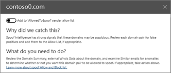

# Genomgång - Från en instrumentpanel till en insiktWalkthrough - From a dashboard to an insight

Om du inte har varit ny [i rapporter och &amp; insikter i Office 365 Security Compliance Center](reports-and-insights-in-security-and-compliance.md)kan det hjälpa dig att se hur du enkelt kan navigera från en instrumentpanel till en insikt och rekommenderade åtgärder.If you're new to [reports and insights in the Office 365 Security &amp; Compliance Center](reports-and-insights-in-security-and-compliance.md), it might help to see how you can easily navigate from a dashboard to an insight and recommended actions. 
  
Detta är en av flera genomgångar för Security &amp; Compliance Center.This is one of several walkthroughs for the Security &amp; Compliance Center. Mer information finns i avsnittet [Omsammanhängande ämnen](#related-topics) om du vill se ytterligare genomgångar.To see additional walkthroughs, see the [Related topics](#related-topics) section. 
  
## Genomgång: Från en instrumentpanel till en insiktWalkthrough: From a dashboard to an insight

Låt oss gå igenom flödet från en instrumentpanel till en rapport till en insikt och åtgärd.Let's walk through the flow from a dashboard to a report to an insight and action. (Detta är en kort [parodi intelligens](learn-about-spoof-intelligence.md) exempel.)(This is a brief [spoof intelligence](learn-about-spoof-intelligence.md) example.) 
  
1. Vi börjar med säkerhetsinstrumentpanelen i [Security &amp; Compliance Center](https://protection.office.com).We begin with the Security dashboard in the [Security &amp; Compliance Center](https://protection.office.com). (Gå till **instrumentpanelen**för **hothantering** \> .)(Go to **Threat management** \> **Dashboard**.)  
  
2. På raden **Insights** märker vi en insikt som anger att vi måste granska vissa domäner som kan vara misstänkta.In the **Insights** row, we notice an insight indicating we need to review some domains that might be suspicious. (Klicka på **Domänpar**på raden **Insikter** .)(In the **Insights** row, click **Domain pairs**.)  
  
3. Vi får en lista över aktiviteter relaterade till falska underrättelser.We get a list of activities related to spoof intelligence. Det här är fall där e-postmeddelanden skickades som ser ut som de kom från vår organisation men faktiskt skickades från en annan organisation.These are instances where email messages were sent that look like they came from our organization but were, in fact, sent from another organization. Målet är att avgöra om de förfalskade meddelandena är auktoriserade eller inte.The goal is to determine whether the spoofed messages are authorized or not.  I den här listan kan vi sortera informationen efter antal meddelanden, datum då förfalskningen senast upptäcktes och mycket mer.In this list, we can sort the information by message count, date the spoofing was last detected, and more. (Klicka på kolumnrubriker, till exempel **Antal meddelanden** eller **Senast sett** för att se hur sorteringfungerar.)(Click column headings, such as **Message count** or **Last seen** to see how sorting works.) 
    
4. Om du väljer ett objekt i listan öppnas ett informationsfönster där vi kan se ytterligare information, inklusive liknande e-postmeddelanden som har upptäckts.Selecting an item in the list opens a details pane where we can see additional information, including similar email messages that were detected. (Klicka på ett objekt i listan och granska informationen och rekommendationerna.)(Click an item in the list, and review the information and recommendations.)  
  
5. Observera att vi högst upp i fönstret har möjlighet att lägga till avsändaren i organisationens lista över tillåtna avsändare.Notice that at the top of the pane, we have the option to add the sender to our organization's allowed senders list. (Välj inte **Lägg till i listan Tillåt för "AllowedtoSpoof"** förrän du är säker på att du vill göra detta.(Do not select **Add to 'AllowedtoSpoof' sender allow list** until you are sure you want to do this. [Läs mer om falska intelligens](learn-about-spoof-intelligence.md).)[Learn more about spoof intelligence](learn-about-spoof-intelligence.md).) 
  
På så sätt kan vi gå från en instrumentpanel till insikter och rekommenderade åtgärder.In this way, we can move from a dashboard to insights and recommended actions.
  
## Relaterade ämnenRelated topics

[Genomgång: Från en insikt till en detaljerad rapportWalkthrough: From an insight to a detailed report](from-an-insight-to-a-detailed-report.md)
  
[Genomgång: Från en detaljerad rapport till en insiktWalkthrough: From a detailed report to an insight](from-a-detailed-report-to-an-insight.md)
  

