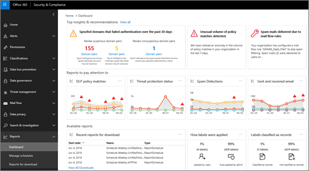
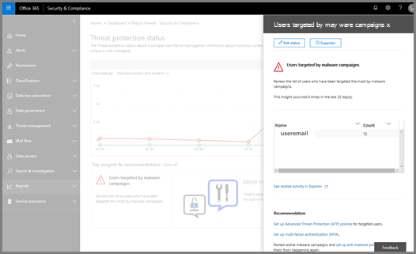

# Genomgång - Från en detaljerad rapport till en insiktWalkthrough - From a detailed report to an insight

Om du inte har tidigare rapporterat [och insikter i &amp; Office 365 Security Compliance Center](reports-and-insights-in-security-and-compliance.md)kan det hjälpa dig att se hur du enkelt kan navigera från en detaljerad rapport till en insikt och rekommenderade åtgärder.If you're new to [reports and insights in the Office 365 Security &amp; Compliance Center](reports-and-insights-in-security-and-compliance.md), it might help to see how you can easily navigate from a detailed report to an insight and recommended actions. 
  
Detta är en av flera genomgångar &amp; för Security Compliance Center.This is one of several walkthroughs for the Security &amp; Compliance Center. Mer information om hur du går igenom ytterligare genomgångar finns i avsnittet [Närliggande ämnen.](#related-topics)To see additional walkthroughs, see the [Related topics](#related-topics) section. 
  
## Genomgång: Från en detaljerad rapport till en insiktWalkthrough: From a detailed report to an insight

Låt oss gå igenom flödet från en detaljerad rapport till en insikt och åtgärder.Let's walk through the flow from a detailed report to an insight and actions. (Detta är en kort [anti-spam och anti-malware](anti-spam-and-anti-malware-protection.md) exempel.)(This is a brief [anti-spam and anti-malware](anti-spam-and-anti-malware-protection.md) example.) 
  
1. Vi börjar med rapporter i [Security &amp; Compliance Center.](https://protection.office.com)We begin with [Security &amp; Compliance Center](https://protection.office.com) reports. (Gå till \> **instrumentpanelen** **Rapporter** .)(Go to **Reports** \> **Dashboard**.)  
  
2. Vi väljer en rapport för att få en mer detaljerad vy.We choose a report to get a more detailed view. (Välj en rapport, till exempel rapporten **Status för skydd mot hot.)**(Choose a report, such as the **Threat Protection Status** report.) 
  
3. Vi märker en statistikindikator i diagrammet samt under rapporten.We notice an insights indicator in the chart as well as below the report. Om du placerar muspekaren på insiktsmarkören finns ytterligare information.Positioning the mouse pointer on the insights marker gives some additional details. (Hovra över insiktsmarkören för att se ytterligare information.)(Hover over the insights marker to see additional details.)
    
4. Om du klickar på antingen statistikmarkören i diagrammet eller om statistikwidgeten om skadlig kod under diagrammet öppnas ett informationsfönster.Clicking either the insights marker in the chart or the insights widget about malware below the chart opens a details pane. (Markera widgeten insikter under diagrammet.)(Below the chart, select the insights widget.)  Informationsfönstret innehåller information och rekommendationer att tänka på, inklusive granskning av principer, genomförande av ytterligare utforskning och redigeringsstatus.The details pane provides information and recommendations to consider, including reviewing policies, conducting further exploration, and editing status. (Läs[mer om skydd mot skräppost och skadlig kod i Office 365](anti-spam-and-anti-malware-protection.md).)([Learn more about anti-spam and anti-malware protection in Office 365](anti-spam-and-anti-malware-protection.md).)
    
På så sätt kan vi gå från en detaljerad rapport till en insikt och rekommenderade åtgärder.In this way, we can move from a detailed report to an insight and recommended actions. 
  
## Relaterade ämnenRelated topics

[Genomgång: Från en insikt till en detaljerad rapportWalkthrough: From an insight to a detailed report](from-an-insight-to-a-detailed-report.md)
  
[Genomgång: Från en instrumentpanel till en insiktWalkthrough: From a dashboard to an insight](from-a-dashboard-to-an-insight.md)
  

