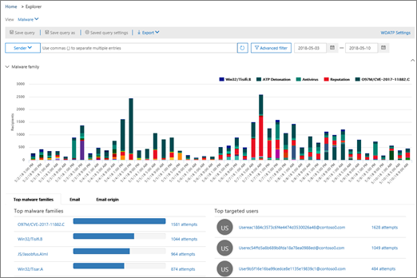

# Genomgång – Från en insikt till en detaljerad rapportWalkthrough - From an insight to a detailed report

Om du inte har tidigare [rapporterat och &amp; insikter i Security Compliance Center](reports-and-insights-in-security-and-compliance.md)kan det hjälpa dig att se hur du enkelt kan navigera från en insikt till en detaljerad rapport.If you're new to [reports and insights in the Security &amp; Compliance Center](reports-and-insights-in-security-and-compliance.md), it might help to see how you can easily navigate from an insight to a detailed report. 
  
Detta är en av flera genomgångar för [Security &amp; Compliance Center](https://protection.office.com).This is one of several walkthroughs for the [Security &amp; Compliance Center](https://protection.office.com). Mer information om hur du går igenom ytterligare genomgångar finns i avsnittet [Närliggande ämnen.](#related-topics)To see additional walkthroughs, see the [Related topics](#related-topics) section. 
  
## Från en insikt till en detaljerad rapportFrom an insight to a detailed report

Låt oss gå igenom flödet från instrumentpanelen till en insikt till en detaljerad rapport för datautforskning.Let's walk through the flow from the dashboard to an insight to a detailed report for data exploration. (Detta är ett kort exempel [på dataförlustförebyggande.)](../../compliance/data-loss-prevention-policies.md)(This is a brief [data loss prevention](../../compliance/data-loss-prevention-policies.md) example.) 
  
1. Vi börjar med en instrumentpanel i [Security &amp; Compliance Center](https://protection.office.com).We begin with a dashboard in the [Security &amp; Compliance Center](https://protection.office.com). (Gå till \> **instrumentpanelen** **Rapporter** .)(Go to **Reports** \> **Dashboard**.) 
  
2. I det övre vänstra hörnet av instrumentpanelen, bredvid **Top insights &amp; rekommendationer,** har vi en länk.In the upper left corner of the dashboard, next to **Top insights &amp; recommendations**, we have a link. (Klicka på **Visa alla**.)(Click **View all**.)  Detta tar oss till en lista över insikter för vår organisation.This takes us to a list of insights for our organization. 
  
3. Om du väljer ett objekt i listan öppnas en ruta där vi kan visa mer information om objektet.Selecting an item in the list opens a pane where we can view more details about that item. (Klicka på ett objekt.)(Click an item.)  Vi ser rekommenderade åtgärder som vi bör överväga, till exempel att se över policyer.We see recommended actions we should consider, such as reviewing policies. ([Läs mer om principer för att förebygga dataförlust](../../compliance/data-loss-prevention-policies.md).)([Learn more about data loss prevention policies](../../compliance/data-loss-prevention-policies.md).)
    
4. Vi har också en länk för att se mer information.We also have a link to view more details. (Klicka på **Visa relaterad aktivitet i Utforskaren**.)(Click **See related activity in Explorer**.) Detta tar oss till en rapporttyp som kallas [Threat Explorer (och realtidsidentifieringar)](threat-explorer.md), där vi kan använda filter och detaljgranska specifika detaljer.This takes us to a report type called [Threat Explorer (and real-time detections)](threat-explorer.md), where we can apply filters and drill into specific details. 
  
På så sätt kan vi enkelt gå från en inblick i dess underliggande detaljer och fatta mer välgrundade beslut om dataförlustförebyggande för en organisation.In this way, we can move easily from an insight into its underlying details, and make more informed decisions about data loss prevention for an organization.
  
## Relaterade ämnenRelated topics

[Genomgång: Från en detaljerad rapport till en insiktWalkthrough: From a detailed report to an insight](from-a-detailed-report-to-an-insight.md)
  
[Genomgång: Från en instrumentpanel till en insiktWalkthrough: From a dashboard to an insight](from-a-dashboard-to-an-insight.md)
  

