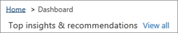
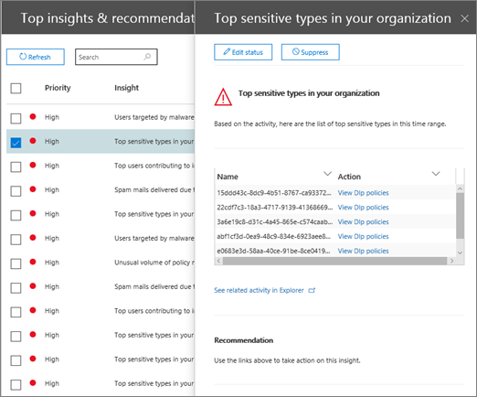

# Genomgång - Från en insikt till en detaljerad rapport

Om du inte har tidigare rapporterat [och insikter i &amp; Office 365 Security Compliance Center](reports-and-insights-in-security-and-compliance.md)kan det hjälpa dig att se hur du enkelt kan navigera från en insikt till en detaljerad rapport. 
  
Detta är en av flera genomgångar för [Security &amp; Compliance Center](https://protection.office.com). Mer information om hur du går igenom ytterligare genomgångar finns i avsnittet [Närliggande ämnen.](#related-topics) 
  
## Från en insikt till en detaljerad rapport

Låt oss gå igenom flödet från instrumentpanelen till en insikt till en detaljerad rapport för datautforskning. (Detta är ett kort exempel [på dataförlustförebyggande.)](../../compliance/data-loss-prevention-policies.md) 
  
1. Vi börjar med en instrumentpanel i [Security &amp; Compliance Center](https://protection.office.com). (Gå till \> **instrumentpanelen** **Rapporter** .) 
  
2. I det övre vänstra hörnet av instrumentpanelen, bredvid **Top insights &amp; rekommendationer,** har vi en länk. (Klicka på **Visa alla**.)  Detta tar oss till en lista över insikter för vår organisation. 
  
3. Om du väljer ett objekt i listan öppnas en ruta där vi kan visa mer information om objektet. (Klicka på ett objekt.)  Vi ser rekommenderade åtgärder som vi bör överväga, till exempel att se över policyer. ([Läs mer om principer för att förebygga dataförlust](../../compliance/data-loss-prevention-policies.md).)
    
4. Vi har också en länk för att se mer information. (Klicka på **Visa relaterad aktivitet i Utforskaren**.) Detta tar oss till en rapporttyp som kallas [Threat Explorer (och realtidsidentifieringar)](threat-explorer.md), där vi kan använda filter och detaljgranska specifika detaljer. 
  
På så sätt kan vi enkelt gå från en inblick i dess underliggande detaljer och fatta mer välgrundade beslut om dataförlustförebyggande för en organisation.
  
## Relaterade ämnen

[Genomgång: Från en detaljerad rapport till en insikt](from-a-detailed-report-to-an-insight.md)
  
[Genomgång: Från en instrumentpanel till en insikt](from-a-dashboard-to-an-insight.md)
  

