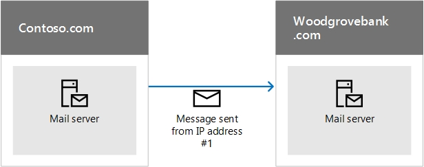

# <a name="how-microsoft-365-uses-sender-policy-framework-spf-to-prevent-spoofing"></a><span data-ttu-id="5bf9a-103">Så använder Microsoft 365 SPF (Sender Policy Framework) för att förhindra förfalskning</span><span class="sxs-lookup"><span data-stu-id="5bf9a-103">How Microsoft 365 uses Sender Policy Framework (SPF) to prevent spoofing</span></span>

 <span data-ttu-id="5bf9a-104">**Sammanfattning:** I den här artikeln beskrivs hur Microsoft 365 använder TXT-posten (Sender Policy Framework) i DNS för att säkerställa att måle-e-postsystem litar på meddelanden som skickas från din anpassade domän.</span><span class="sxs-lookup"><span data-stu-id="5bf9a-104">**Summary:** This article describes how Microsoft 365 uses the Sender Policy Framework (SPF) TXT record in DNS to ensure that destination email systems trust messages sent from your custom domain.</span></span> <span data-ttu-id="5bf9a-105">Detta gäller utgående e-post som skickas från Microsoft 365.</span><span class="sxs-lookup"><span data-stu-id="5bf9a-105">This applies to outbound mail sent from Microsoft 365.</span></span> <span data-ttu-id="5bf9a-106">Meddelanden som skickas från Microsoft 365 till en mottagare inom Microsoft 365 kommer alltid att passera SPF.</span><span class="sxs-lookup"><span data-stu-id="5bf9a-106">Messages sent from Microsoft 365 to a recipient within Microsoft 365 will always pass SPF.</span></span>

<span data-ttu-id="5bf9a-107">En SPF TXT-post är en DNS-post som förhindrar förfalskning och nätfiske genom att verifiera domännamnet som e-postmeddelanden skickas från.</span><span class="sxs-lookup"><span data-stu-id="5bf9a-107">An SPF TXT record is a DNS record that helps prevent spoofing and phishing by verifying the domain name from which email messages are sent.</span></span> <span data-ttu-id="5bf9a-108">SPF validerar ursprunget för e-postmeddelanden genom att verifiera avsändarens IP-adress mot den påstådda ägaren av den sändande domänen.</span><span class="sxs-lookup"><span data-stu-id="5bf9a-108">SPF validates the origin of email messages by verifying the IP address of the sender against the alleged owner of the sending domain.</span></span>

> [!NOTE]
> <span data-ttu-id="5bf9a-109">SPF-posttyper inaktuella av Internet Engineering Task Force (IETF) 2014.</span><span class="sxs-lookup"><span data-stu-id="5bf9a-109">SPF record types were deprecated by the Internet Engineering Task Force (IETF) in 2014.</span></span> <span data-ttu-id="5bf9a-110">Se i stället till att du använder TXT-poster i DNS för att publicera din SPF-information.</span><span class="sxs-lookup"><span data-stu-id="5bf9a-110">Instead, ensure that you use TXT records in DNS to publish your SPF information.</span></span> <span data-ttu-id="5bf9a-111">Resten av den här artikeln använder termen SPF TXT-post för tydlighetens skull.</span><span class="sxs-lookup"><span data-stu-id="5bf9a-111">The rest of this article uses the term SPF TXT record for clarity.</span></span>

<span data-ttu-id="5bf9a-112">Domänadministratörer publicerar SPF-information i TXT-poster i DNS.</span><span class="sxs-lookup"><span data-stu-id="5bf9a-112">Domain administrators publish SPF information in TXT records in DNS.</span></span> <span data-ttu-id="5bf9a-113">SPF-informationen identifierar auktoriserade utgående e-postservrar.</span><span class="sxs-lookup"><span data-stu-id="5bf9a-113">The SPF information identifies authorized outbound email servers.</span></span> <span data-ttu-id="5bf9a-114">Mål e-postsystem verifiera att meddelanden kommer från auktoriserade utgående e-postservrar.</span><span class="sxs-lookup"><span data-stu-id="5bf9a-114">Destination email systems verify that messages originate from authorized outbound email servers.</span></span> <span data-ttu-id="5bf9a-115">Om du redan är bekant med SPF, eller om du har en enkel distribution, och bara behöver veta vad du ska inkludera i din SPF TXT-post i DNS för Microsoft 365, kan du gå till [Konfigurera SPF i Microsoft 365 för att förhindra förfalskning](set-up-spf-in-office-365-to-help-prevent-spoofing.md).</span><span class="sxs-lookup"><span data-stu-id="5bf9a-115">If you are already familiar with SPF, or you have a simple deployment, and just need to know what to include in your SPF TXT record in DNS for Microsoft 365, you can go to [Set up SPF in Microsoft 365 to help prevent spoofing](set-up-spf-in-office-365-to-help-prevent-spoofing.md).</span></span> <span data-ttu-id="5bf9a-116">Om du inte har en distribution som är helt värd i Microsoft 365, eller om du vill ha mer information om hur SPF fungerar eller hur du felsöker SPF för Microsoft 365, fortsätter du läsa.</span><span class="sxs-lookup"><span data-stu-id="5bf9a-116">If you do not have a deployment that is fully-hosted in Microsoft 365, or you want more information about how SPF works or how to troubleshoot SPF for Microsoft 365, keep reading.</span></span>

> [!NOTE]
> <span data-ttu-id="5bf9a-117">Tidigare var du tvungen att lägga till en annan SPF TXT-post i din anpassade domän om du också använde SharePoint Online.</span><span class="sxs-lookup"><span data-stu-id="5bf9a-117">Previously, you had to add a different SPF TXT record to your custom domain if you also used SharePoint Online.</span></span> <span data-ttu-id="5bf9a-118">Det behöver du inte göra längre.</span><span class="sxs-lookup"><span data-stu-id="5bf9a-118">This is no longer required.</span></span> <span data-ttu-id="5bf9a-119">Den här ändringen kan minska risken för att SharePoint Online-meddelanden hamnar i skräppostmappen.</span><span class="sxs-lookup"><span data-stu-id="5bf9a-119">This change should reduce the risk of SharePoint Online notification messages ending up in the Junk Email folder.</span></span> <span data-ttu-id="5bf9a-120">Du behöver inte göra några ändringar omedelbart, men om du får felet "för många sökninger" ändrar du SPF TXT-posten enligt beskrivningen i [Konfigurera SPF i Microsoft 365 för att förhindra förfalskning](set-up-spf-in-office-365-to-help-prevent-spoofing.md).</span><span class="sxs-lookup"><span data-stu-id="5bf9a-120">You do not need to make any changes immediately, but if you receive the "too many lookups" error, modify your SPF TXT record as described in [Set up SPF in Microsoft 365 to help prevent spoofing](set-up-spf-in-office-365-to-help-prevent-spoofing.md).</span></span>

## <a name="how-spf-works-to-prevent-spoofing-and-phishing-in-microsoft-365"></a><span data-ttu-id="5bf9a-121">Så här fungerar SPF för att förhindra förfalskning och nätfiske i Microsoft 365</span><span class="sxs-lookup"><span data-stu-id="5bf9a-121">How SPF works to prevent spoofing and phishing in Microsoft 365</span></span>
<span data-ttu-id="5bf9a-122"><a name="HowSPFWorks"> </a></span><span class="sxs-lookup"><span data-stu-id="5bf9a-122"><a name="HowSPFWorks"> </a></span></span>

<span data-ttu-id="5bf9a-123">SPF avgör om en avsändare tillåts skicka för en domän.</span><span class="sxs-lookup"><span data-stu-id="5bf9a-123">SPF determines whether or not a sender is permitted to send on behalf of a domain.</span></span> <span data-ttu-id="5bf9a-124">Om avsändaren inte tillåts göra det, det vill säga om e-postmeddelandet misslyckas SPF-kontrollen på den mottagande servern, avgör skräppostprincipen som konfigurerats på den servern vad meddelandet ska göra.</span><span class="sxs-lookup"><span data-stu-id="5bf9a-124">If the sender is not permitted to do so, that is, if the email fails the SPF check on the receiving server, the spam policy configured on that server determines what to do with the message.</span></span>

<span data-ttu-id="5bf9a-125">Varje SPF TXT-post innehåller tre delar: deklarationen att det är en SPF TXT-post, IP-adresser som tillåts skicka e-post från din domän och de externa domäner som kan skicka för domänens räkning och en tvingande regel.</span><span class="sxs-lookup"><span data-stu-id="5bf9a-125">Each SPF TXT record contains three parts: the declaration that it is an SPF TXT record, the IP addresses that are allowed to send mail from your domain and the external domains that can send on your domain's behalf, and an enforcement rule.</span></span> <span data-ttu-id="5bf9a-126">Du behöver alla tre i en giltig SPF TXT-post.</span><span class="sxs-lookup"><span data-stu-id="5bf9a-126">You need all three in a valid SPF TXT record.</span></span> <span data-ttu-id="5bf9a-127">I den här artikeln beskrivs hur du skapar din SPF TXT-post och innehåller metodtips för hur du arbetar med tjänsterna i Microsoft 365.</span><span class="sxs-lookup"><span data-stu-id="5bf9a-127">This article describes how you form your SPF TXT record and provides best practices for working with the services in Microsoft 365.</span></span> <span data-ttu-id="5bf9a-128">Länkar till instruktioner om hur du arbetar med domänregistratorer för att publicera din post till DNS finns också.</span><span class="sxs-lookup"><span data-stu-id="5bf9a-128">Links to instructions on working with your domain registrar to publish your record to DNS are also provided.</span></span>

### <a name="spf-basics-ip-addresses-allowed-to-send-from-your-custom-domain"></a><span data-ttu-id="5bf9a-129">Grunderna i SPF: IP-adresser som tillåts skicka från din anpassade domän</span><span class="sxs-lookup"><span data-stu-id="5bf9a-129">SPF basics: IP addresses allowed to send from your custom domain</span></span>
<span data-ttu-id="5bf9a-130"><a name="SPFBasicsIPaddresses"> </a></span><span class="sxs-lookup"><span data-stu-id="5bf9a-130"><a name="SPFBasicsIPaddresses"> </a></span></span>

<span data-ttu-id="5bf9a-131">Ta en titt på den grundläggande syntaxen för en SPF-regel:</span><span class="sxs-lookup"><span data-stu-id="5bf9a-131">Take a look at the basic syntax for an SPF rule:</span></span>

<span data-ttu-id="5bf9a-132">v=spf1 \<IP\>\<enforcement rule\></span><span class="sxs-lookup"><span data-stu-id="5bf9a-132">v=spf1 \<IP\> \<enforcement rule\></span></span>

<span data-ttu-id="5bf9a-133">Anta till exempel att följande SPF-regel finns för contoso.com:</span><span class="sxs-lookup"><span data-stu-id="5bf9a-133">For example, let's say the following SPF rule exists for contoso.com:</span></span>

<span data-ttu-id="5bf9a-134">v=spf1 \<IP address #1\> \<IP address #2\> \<IP address #3\>\<enforcement rule\></span><span class="sxs-lookup"><span data-stu-id="5bf9a-134">v=spf1 \<IP address #1\> \<IP address #2\> \<IP address #3\> \<enforcement rule\></span></span>

<span data-ttu-id="5bf9a-135">I det här exemplet instruerar SPF-regeln den mottagande e-postservern att endast ta emot e-post från dessa IP-adresser för domänen contoso.com:</span><span class="sxs-lookup"><span data-stu-id="5bf9a-135">In this example, the SPF rule instructs the receiving email server to only accept mail from these IP addresses for the domain contoso.com:</span></span>

- <span data-ttu-id="5bf9a-136">IP-adress #1</span><span class="sxs-lookup"><span data-stu-id="5bf9a-136">IP address #1</span></span>

- <span data-ttu-id="5bf9a-137">IP-adress #2</span><span class="sxs-lookup"><span data-stu-id="5bf9a-137">IP address #2</span></span>

- <span data-ttu-id="5bf9a-138">IP-adress #3</span><span class="sxs-lookup"><span data-stu-id="5bf9a-138">IP address #3</span></span>

<span data-ttu-id="5bf9a-139">Den här SPF-regeln talar om för den mottagande e-postservern att om ett meddelande kommer från contoso.com, men inte från någon av dessa tre IP-adresser, bör den mottagande servern tillämpa tvingande regeln på meddelandet.</span><span class="sxs-lookup"><span data-stu-id="5bf9a-139">This SPF rule tells the receiving email server that if a message comes from contoso.com, but not from one of these three IP addresses, the receiving server should apply the enforcement rule to the message.</span></span> <span data-ttu-id="5bf9a-140">Verkställighetsregeln är vanligtvis ett av följande alternativ:</span><span class="sxs-lookup"><span data-stu-id="5bf9a-140">The enforcement rule is usually one of these options:</span></span>

- <span data-ttu-id="5bf9a-141">**Hårt misslyckande.**</span><span class="sxs-lookup"><span data-stu-id="5bf9a-141">**Hard fail.**</span></span> <span data-ttu-id="5bf9a-142">Markera meddelandet med "svårt fel" i meddelandekuvertet och följ sedan den mottagande serverns konfigurerade skräppostprincip för den här typen av meddelande.</span><span class="sxs-lookup"><span data-stu-id="5bf9a-142">Mark the message with 'hard fail' in the message envelope and then follow the receiving server's configured spam policy for this type of message.</span></span>

- <span data-ttu-id="5bf9a-143">**Mjuk misslyckas.**</span><span class="sxs-lookup"><span data-stu-id="5bf9a-143">**Soft fail.**</span></span> <span data-ttu-id="5bf9a-144">Markera meddelandet med "mjukt fel" i meddelandekuvertet.</span><span class="sxs-lookup"><span data-stu-id="5bf9a-144">Mark the message with 'soft fail' in the message envelope.</span></span> <span data-ttu-id="5bf9a-145">Vanligtvis är e-postservrar konfigurerade för att leverera dessa meddelanden ändå.</span><span class="sxs-lookup"><span data-stu-id="5bf9a-145">Typically, email servers are configured to deliver these messages anyway.</span></span> <span data-ttu-id="5bf9a-146">De flesta slutanvändare ser inte det här märket.</span><span class="sxs-lookup"><span data-stu-id="5bf9a-146">Most end users do not see this mark.</span></span>

- <span data-ttu-id="5bf9a-147">**Neutral.**</span><span class="sxs-lookup"><span data-stu-id="5bf9a-147">**Neutral.**</span></span> <span data-ttu-id="5bf9a-148">Gör ingenting, det vill säga markera inte meddelandet kuvertet.</span><span class="sxs-lookup"><span data-stu-id="5bf9a-148">Do nothing, that is, do not mark the message envelope.</span></span> <span data-ttu-id="5bf9a-149">Detta är vanligtvis reserverad för teständamål och används sällan.</span><span class="sxs-lookup"><span data-stu-id="5bf9a-149">This is usually reserved for testing purposes and is rarely used.</span></span>

<span data-ttu-id="5bf9a-150">Följande exempel visar hur SPF fungerar i olika situationer.</span><span class="sxs-lookup"><span data-stu-id="5bf9a-150">The following examples show how SPF works in different situations.</span></span> <span data-ttu-id="5bf9a-151">I dessa exempel är contoso.com avsändaren och woodgrovebank.com är mottagaren.</span><span class="sxs-lookup"><span data-stu-id="5bf9a-151">In these examples, contoso.com is the sender and woodgrovebank.com is the receiver.</span></span>

### <a name="example-1-email-authentication-of-a-message-sent-directly-from-sender-to-receiver"></a><span data-ttu-id="5bf9a-152">Exempel 1: E-postautentisering av ett meddelande som skickas direkt från avsändare till mottagare</span><span class="sxs-lookup"><span data-stu-id="5bf9a-152">Example 1: Email authentication of a message sent directly from sender to receiver</span></span>
<span data-ttu-id="5bf9a-153"><a name="spfExample1"> </a></span><span class="sxs-lookup"><span data-stu-id="5bf9a-153"><a name="spfExample1"> </a></span></span>

<span data-ttu-id="5bf9a-154">SPF fungerar bäst när sökvägen från avsändare till mottagare är direkt, till exempel:</span><span class="sxs-lookup"><span data-stu-id="5bf9a-154">SPF works best when the path from sender to receiver is direct, for example:</span></span>



<span data-ttu-id="5bf9a-156">När woodgrovebank.com tar emot meddelandet, om IP-adressen #1 finns i SPF TXT-posten för contoso.com, skickar meddelandet SPF-kontrollen och autentiseras.</span><span class="sxs-lookup"><span data-stu-id="5bf9a-156">When woodgrovebank.com receives the message, if IP address #1 is in the SPF TXT record for contoso.com, the message passes the SPF check and is authenticated.</span></span>

### <a name="example-2-spoofed-sender-address-fails-the-spf-check"></a><span data-ttu-id="5bf9a-157">Exempel 2: Förfalskad avsändaradress misslyckas SPF-kontrollen</span><span class="sxs-lookup"><span data-stu-id="5bf9a-157">Example 2: Spoofed sender address fails the SPF check</span></span>
<span data-ttu-id="5bf9a-158"><a name="spfExample2"> </a></span><span class="sxs-lookup"><span data-stu-id="5bf9a-158"><a name="spfExample2"> </a></span></span>

<span data-ttu-id="5bf9a-159">Anta att en phisher hittar ett sätt att förfalska contoso.com:</span><span class="sxs-lookup"><span data-stu-id="5bf9a-159">Suppose a phisher finds a way to spoof contoso.com:</span></span>


<span data-ttu-id="5bf9a-161">Eftersom IP-adressen #12 inte finns i contoso.com s SPF TXT post, misslyckas meddelandet SPF kontroll och mottagaren kan välja att markera det som spam.</span><span class="sxs-lookup"><span data-stu-id="5bf9a-161">Since IP address #12 is not in contoso.com's SPF TXT record, the message fails the SPF check and the receiver may choose to mark it as spam.</span></span>

### <a name="example-3-spf-and-forwarded-messages"></a><span data-ttu-id="5bf9a-162">Exempel 3: SPF och vidarebefordrade meddelanden</span><span class="sxs-lookup"><span data-stu-id="5bf9a-162">Example 3: SPF and forwarded messages</span></span>
<span data-ttu-id="5bf9a-163"><a name="spfExample3"> </a></span><span class="sxs-lookup"><span data-stu-id="5bf9a-163"><a name="spfExample3"> </a></span></span>

<span data-ttu-id="5bf9a-164">En nackdel med SPF är att det inte fungerar när ett e-postmeddelande har vidarebefordrats.</span><span class="sxs-lookup"><span data-stu-id="5bf9a-164">One drawback of SPF is that it doesn't work when an email has been forwarded.</span></span> <span data-ttu-id="5bf9a-165">Anta till exempel att användaren på woodgrovebank.com har ställt in en vidarebefordringsregel för att skicka all e-post till ett outlook.com-konto:</span><span class="sxs-lookup"><span data-stu-id="5bf9a-165">For example, suppose the user at woodgrovebank.com has set up a forwarding rule to send all email to an outlook.com account:</span></span>


<span data-ttu-id="5bf9a-167">Meddelandet passerar ursprungligen SPF-kontrollen vid woodgrovebank.com men det misslyckas SPF-kontrollen vid outlook.com eftersom IP-#25 inte finns i contoso.com:s SPF TXT-post.</span><span class="sxs-lookup"><span data-stu-id="5bf9a-167">The message originally passes the SPF check at woodgrovebank.com but it fails the SPF check at outlook.com because IP #25 is not in contoso.com's SPF TXT record.</span></span> <span data-ttu-id="5bf9a-168">Outlook.com kan sedan markera meddelandet som skräppost.</span><span class="sxs-lookup"><span data-stu-id="5bf9a-168">Outlook.com might then mark the message as spam.</span></span> <span data-ttu-id="5bf9a-169">För att komma runt det här problemet, använd SPF tillsammans med andra e-postautentiseringsmetoder som DKIM och DMARC.</span><span class="sxs-lookup"><span data-stu-id="5bf9a-169">To work around this problem, use SPF in conjunction with other email authentication methods such as DKIM and DMARC.</span></span>

### <a name="spf-basics-including-third-party-domains-that-can-send-mail-on-behalf-of-your-domain"></a><span data-ttu-id="5bf9a-170">Grunderna i SPF: Inklusive domäner från tredje part som kan skicka e-post för din domän</span><span class="sxs-lookup"><span data-stu-id="5bf9a-170">SPF basics: Including third-party domains that can send mail on behalf of your domain</span></span>
<span data-ttu-id="5bf9a-171"><a name="SPFBasicsIncludes"> </a></span><span class="sxs-lookup"><span data-stu-id="5bf9a-171"><a name="SPFBasicsIncludes"> </a></span></span>

<span data-ttu-id="5bf9a-172">Förutom IP-adresser kan du också konfigurera SPF TXT-posten så att den inkluderar domäner som avsändare.</span><span class="sxs-lookup"><span data-stu-id="5bf9a-172">In addition to IP addresses, you can also configure your SPF TXT record to include domains as senders.</span></span> <span data-ttu-id="5bf9a-173">Dessa läggs till i SPF TXT-posten som "include"-satser.</span><span class="sxs-lookup"><span data-stu-id="5bf9a-173">These are added to the SPF TXT record as "include" statements.</span></span> <span data-ttu-id="5bf9a-174">Till exempel kanske contoso.com vill inkludera alla IP-adresser till e-postservrarna från contoso.net och contoso.org som den också äger.</span><span class="sxs-lookup"><span data-stu-id="5bf9a-174">For example, contoso.com might want to include all of the IP addresses of the mail servers from contoso.net and contoso.org which it also owns.</span></span> <span data-ttu-id="5bf9a-175">För att göra detta publicerar contoso.com en SPF TXT-post som ser ut så här:</span><span class="sxs-lookup"><span data-stu-id="5bf9a-175">To do this, contoso.com publishes an SPF TXT record that looks like this:</span></span>

```text
v=spf1 include:contoso.net include:contoso.org -all
```

<span data-ttu-id="5bf9a-176">När den mottagande servern ser den här posten i DNS utförs även en DNS-sökning på SPF TXT-posten för contoso.net och sedan för contoso.org. Om den hittar ytterligare en inkludera uttalande i posterna för contoso.net eller contoso.org, kommer det att följa dem också.</span><span class="sxs-lookup"><span data-stu-id="5bf9a-176">When the receiving server sees this record in DNS, it also performs a DNS lookup on the SPF TXT record for contoso.net and then for contoso.org. If it finds an additional include statement within the records for contoso.net or contoso.org, it will follow those too.</span></span> <span data-ttu-id="5bf9a-177">För att förhindra överbelastningsattacker är det maximala antalet DNS-sökningar för ett enskilt e-postmeddelande 10.</span><span class="sxs-lookup"><span data-stu-id="5bf9a-177">In order to help prevent denial of service attacks, the maximum number of DNS lookups for a single email message is 10.</span></span> <span data-ttu-id="5bf9a-178">Varje include-sats representerar ytterligare en DNS-sökning.</span><span class="sxs-lookup"><span data-stu-id="5bf9a-178">Each include statement represents an additional DNS lookup.</span></span> <span data-ttu-id="5bf9a-179">Om ett meddelande överskrider 10-gränsen misslyckas SPF.</span><span class="sxs-lookup"><span data-stu-id="5bf9a-179">If a message exceeds the 10 limit, the message fails SPF.</span></span> <span data-ttu-id="5bf9a-180">När ett meddelande når den här gränsen, beroende på hur den mottagande servern är konfigurerad, kan avsändaren få ett meddelande som säger att meddelandet genereras "för många sökninger" eller att "maximalt hoppantal för meddelandet har överskridits" (vilket kan hända när uppslagsslingen loopar och överträffar DNS-timeouten).</span><span class="sxs-lookup"><span data-stu-id="5bf9a-180">Once a message reaches this limit, depending on the way the receiving server is configured, the sender may get a message that says the message generated "too many lookups" or that the "maximum hop count for the message has been exceeded" (which can happen when the lookups loop and surpass the DNS timeout).</span></span> <span data-ttu-id="5bf9a-181">Tips om hur du undviker detta finns i [Felsökning: Metodtips för SPF i Microsoft 365](how-office-365-uses-spf-to-prevent-spoofing.md#SPFTroubleshoot).</span><span class="sxs-lookup"><span data-stu-id="5bf9a-181">For tips on how to avoid this, see [Troubleshooting: Best practices for SPF in Microsoft 365](how-office-365-uses-spf-to-prevent-spoofing.md#SPFTroubleshoot).</span></span>

## <a name="requirements-for-your-spf-txt-record-and-microsoft-365"></a><span data-ttu-id="5bf9a-182">Krav för din SPF TXT-post och Microsoft 365</span><span class="sxs-lookup"><span data-stu-id="5bf9a-182">Requirements for your SPF TXT record and Microsoft 365</span></span>
<span data-ttu-id="5bf9a-183"><a name="SPFReqsinO365"> </a></span><span class="sxs-lookup"><span data-stu-id="5bf9a-183"><a name="SPFReqsinO365"> </a></span></span>

<span data-ttu-id="5bf9a-184">Om du konfigurerar e-post när du konfigurerar Microsoft 365 har du redan skapat en SPF TXT-post som identifierar Microsofts meddelandeservrar som en legitim e-postkälla för din domän.</span><span class="sxs-lookup"><span data-stu-id="5bf9a-184">If you set up mail when you set up Microsoft 365, you already created an SPF TXT record that identifies the Microsoft messaging servers as a legitimate source of mail for your domain.</span></span> <span data-ttu-id="5bf9a-185">Denna post ser förmodligen ut så här:</span><span class="sxs-lookup"><span data-stu-id="5bf9a-185">This record probably looks like this:</span></span>

```text
v=spf1 include:spf.protection.outlook.com -all
```

<span data-ttu-id="5bf9a-186">Om du är en helt värd kund, det vill säga du har inga lokala e-postservrar som skickar utgående e-post, är detta den enda SPF TXT-post som du behöver publicera för Office 365.</span><span class="sxs-lookup"><span data-stu-id="5bf9a-186">If you're a fully-hosted customer, that is, you have no on-premises mail servers that send outbound mail, this is the only SPF TXT record that you need to publish for Office 365.</span></span>

<span data-ttu-id="5bf9a-187">Om du har en hybriddistribution (det vill säga du har vissa postlådor lokalt och vissa i Microsoft 365), eller om du är en fristående Exchange Online Protection -kund (det vill säga din organisation använder EOP för att skydda dina lokala postlådor), bör du lägga till den utgående IP-adressen för var och en av dina lokala e-postservrar (EPF TXT-posten i DNS).</span><span class="sxs-lookup"><span data-stu-id="5bf9a-187">If you have a hybrid deployment (that is, you have some mailboxes on-premises and some hosted in Microsoft 365), or if you're an Exchange Online Protection (EOP) standalone customer (that is, your organization uses EOP to protect your on-premises mailboxes), you should add the outbound IP address for each of your on-premises edge mail servers to the SPF TXT record in DNS.</span></span>

## <a name="form-your-spf-txt-record-for-microsoft-365"></a><span data-ttu-id="5bf9a-188">Bilda din SPF TXT-post för Microsoft 365</span><span class="sxs-lookup"><span data-stu-id="5bf9a-188">Form your SPF TXT record for Microsoft 365</span></span>
<span data-ttu-id="5bf9a-189"><a name="FormYourSPF"> </a></span><span class="sxs-lookup"><span data-stu-id="5bf9a-189"><a name="FormYourSPF"> </a></span></span>

<span data-ttu-id="5bf9a-190">Använd syntaxinformationen i den här artikeln för att skapa SPF TXT-posten för din anpassade domän.</span><span class="sxs-lookup"><span data-stu-id="5bf9a-190">Use the syntax information in this article to form the SPF TXT record for your custom domain.</span></span> <span data-ttu-id="5bf9a-191">Även om det finns andra syntaxalternativ som inte nämns här, är dessa de vanligaste alternativen.</span><span class="sxs-lookup"><span data-stu-id="5bf9a-191">Although there are other syntax options that are not mentioned here, these are the most commonly used options.</span></span> <span data-ttu-id="5bf9a-192">När du har skapat posten måste du uppdatera posten hos domänregistratorn.</span><span class="sxs-lookup"><span data-stu-id="5bf9a-192">Once you have formed your record, you need to update the record at your domain registrar.</span></span>

<span data-ttu-id="5bf9a-193">Information om de domäner som du måste inkludera för Microsoft 365 finns i [Externa DNS-poster som krävs för SPF](https://docs.microsoft.com/office365/enterprise/external-domain-name-system-records).</span><span class="sxs-lookup"><span data-stu-id="5bf9a-193">For information about the domains you will need to include for Microsoft 365, see [External DNS records required for SPF](https://docs.microsoft.com/office365/enterprise/external-domain-name-system-records).</span></span> <span data-ttu-id="5bf9a-194">Använd [steg-för-steg-instruktionerna](https://docs.microsoft.com/microsoft-365/admin/get-help-with-domains/create-dns-records-at-any-dns-hosting-provider#add-a-txt-record-for-spf-to-help-prevent-email-spam) för uppdatering av SPF-poster (TXT) för domänregistratorer.</span><span class="sxs-lookup"><span data-stu-id="5bf9a-194">Use the [step-by-step instructions](https://docs.microsoft.com/microsoft-365/admin/get-help-with-domains/create-dns-records-at-any-dns-hosting-provider#add-a-txt-record-for-spf-to-help-prevent-email-spam) for updating SPF (TXT) records for your domain registrar.</span></span>

### <a name="spf-txt-record-syntax-for-microsoft-365"></a><span data-ttu-id="5bf9a-195">SPF TXT-postsyntax för Microsoft 365</span><span class="sxs-lookup"><span data-stu-id="5bf9a-195">SPF TXT record syntax for Microsoft 365</span></span>
<span data-ttu-id="5bf9a-196"><a name="SPFSyntaxO365"> </a></span><span class="sxs-lookup"><span data-stu-id="5bf9a-196"><a name="SPFSyntaxO365"> </a></span></span>

<span data-ttu-id="5bf9a-197">En typisk SPF TXT-post för Microsoft 365 har följande syntax:</span><span class="sxs-lookup"><span data-stu-id="5bf9a-197">A typical SPF TXT record for Microsoft 365 has the following syntax:</span></span>

```text
v=spf1 [<ip4>|<ip6>:<IP address>] [include:<domain name>] <enforcement rule>
```

<span data-ttu-id="5bf9a-198">Ett exempel:</span><span class="sxs-lookup"><span data-stu-id="5bf9a-198">For example:</span></span>

```text
v=spf1 ip4:192.168.0.1 ip4:192.168.0.2 include:spf.protection.outlook.com -all
```

<span data-ttu-id="5bf9a-199">där:</span><span class="sxs-lookup"><span data-stu-id="5bf9a-199">where:</span></span>

- <span data-ttu-id="5bf9a-200">**v=spf1** krävs.</span><span class="sxs-lookup"><span data-stu-id="5bf9a-200">**v=spf1** is required.</span></span> <span data-ttu-id="5bf9a-201">Detta definierar TXT-posten som en SPF TXT-post.</span><span class="sxs-lookup"><span data-stu-id="5bf9a-201">This defines the TXT record as an SPF TXT record.</span></span>

- <span data-ttu-id="5bf9a-202">**ip4** anger att du använder IP version 4-adresser.</span><span class="sxs-lookup"><span data-stu-id="5bf9a-202">**ip4** indicates that you are using IP version 4 addresses.</span></span> <span data-ttu-id="5bf9a-203">**ip6** anger att du använder IP version 6-adresser.</span><span class="sxs-lookup"><span data-stu-id="5bf9a-203">**ip6** indicates that you are using IP version 6 addresses.</span></span> <span data-ttu-id="5bf9a-204">Om du använder IPv6 IP-adresser, ersätta **ip4** med **ip6** i exemplen i den här artikeln.</span><span class="sxs-lookup"><span data-stu-id="5bf9a-204">If you are using IPv6 IP addresses, replace **ip4** with **ip6** in the examples in this article.</span></span> <span data-ttu-id="5bf9a-205">Du kan också ange IP-adressintervall med CIDR-notation, till exempel **ip4:192.168.0.1/26**.</span><span class="sxs-lookup"><span data-stu-id="5bf9a-205">You can also specify IP address ranges using CIDR notation, for example **ip4:192.168.0.1/26**.</span></span>

- <span data-ttu-id="5bf9a-206">_IP-adress_ är den IP-adress som du vill lägga till i SPF TXT-posten.</span><span class="sxs-lookup"><span data-stu-id="5bf9a-206">_IP address_ is the IP address that you want to add to the SPF TXT record.</span></span> <span data-ttu-id="5bf9a-207">Detta är vanligtvis IP-adressen för den utgående e-postservern för din organisation.</span><span class="sxs-lookup"><span data-stu-id="5bf9a-207">Usually, this is the IP address of the outbound mail server for your organization.</span></span> <span data-ttu-id="5bf9a-208">Du kan lista flera utgående e-postservrar.</span><span class="sxs-lookup"><span data-stu-id="5bf9a-208">You can list multiple outbound mail servers.</span></span> <span data-ttu-id="5bf9a-209">Mer information finns i [Exempel: SPF TXT-post för flera utgående lokala e-postservrar och Microsoft 365](how-office-365-uses-spf-to-prevent-spoofing.md#ExampleSPFMultipleMailServerO365).</span><span class="sxs-lookup"><span data-stu-id="5bf9a-209">For more information, see [Example: SPF TXT record for multiple outbound on-premises mail servers and Microsoft 365](how-office-365-uses-spf-to-prevent-spoofing.md#ExampleSPFMultipleMailServerO365).</span></span>

- <span data-ttu-id="5bf9a-210">_domännamn_ är den domän som du vill lägga till som en legitim avsändare.</span><span class="sxs-lookup"><span data-stu-id="5bf9a-210">_domain name_ is the domain you want to add as a legitimate sender.</span></span> <span data-ttu-id="5bf9a-211">En lista över domännamn som du bör inkludera för Microsoft 365 finns i [Externa DNS-poster som krävs för SPF](https://docs.microsoft.com/office365/enterprise/external-domain-name-system-records).</span><span class="sxs-lookup"><span data-stu-id="5bf9a-211">For a list of domain names you should include for Microsoft 365, see [External DNS records required for SPF](https://docs.microsoft.com/office365/enterprise/external-domain-name-system-records).</span></span>

- <span data-ttu-id="5bf9a-212">Verkställighetsregel är vanligtvis en av följande:</span><span class="sxs-lookup"><span data-stu-id="5bf9a-212">Enforcement rule is usually one of the following:</span></span>

  - <span data-ttu-id="5bf9a-213">-alla</span><span class="sxs-lookup"><span data-stu-id="5bf9a-213">-all</span></span>

    <span data-ttu-id="5bf9a-214">Indikerar ett hårt fel.</span><span class="sxs-lookup"><span data-stu-id="5bf9a-214">Indicates hard fail.</span></span> <span data-ttu-id="5bf9a-215">Om du känner till alla auktoriserade IP-adresser för din domän, lista dem i SPF TXT-posten och använda -all (hard fail) kvalificeraren.</span><span class="sxs-lookup"><span data-stu-id="5bf9a-215">If you know all of the authorized IP addresses for your domain, list them in the SPF TXT record and use the -all (hard fail) qualifier.</span></span> <span data-ttu-id="5bf9a-216">Om du bara använder SPF, det vill säga du använder inte DMARC eller DKIM, bör du också använda -all-kvalificeraren.</span><span class="sxs-lookup"><span data-stu-id="5bf9a-216">Also, if you are only using SPF, that is, you are not using DMARC or DKIM, you should use the -all qualifier.</span></span> <span data-ttu-id="5bf9a-217">Vi rekommenderar att du alltid använder den här kvalificeraren.</span><span class="sxs-lookup"><span data-stu-id="5bf9a-217">We recommend that you use always this qualifier.</span></span>

  - <span data-ttu-id="5bf9a-218">~ alla</span><span class="sxs-lookup"><span data-stu-id="5bf9a-218">~all</span></span>

    <span data-ttu-id="5bf9a-219">Indikerar mjuk misslyckas.</span><span class="sxs-lookup"><span data-stu-id="5bf9a-219">Indicates soft fail.</span></span> <span data-ttu-id="5bf9a-220">Om du inte är säker på att du har en fullständig lista över IP-adresser, bör du använda kvalificeraren ~all (soft fail).</span><span class="sxs-lookup"><span data-stu-id="5bf9a-220">If you're not sure that you have the complete list of IP addresses, then you should use the ~all (soft fail) qualifier.</span></span> <span data-ttu-id="5bf9a-221">Dessutom, om du använder DMARC med p = karantän eller p = avvisa, då kan du använda ~ alla.</span><span class="sxs-lookup"><span data-stu-id="5bf9a-221">Also, if you are using DMARC with p=quarantine or p=reject, then you can use ~all.</span></span> <span data-ttu-id="5bf9a-222">Annars använder -alla.</span><span class="sxs-lookup"><span data-stu-id="5bf9a-222">Otherwise, use -all.</span></span>

  - <span data-ttu-id="5bf9a-223">?alla</span><span class="sxs-lookup"><span data-stu-id="5bf9a-223">?all</span></span>

    <span data-ttu-id="5bf9a-224">Anger neutral.</span><span class="sxs-lookup"><span data-stu-id="5bf9a-224">Indicates neutral.</span></span> <span data-ttu-id="5bf9a-225">Detta används vid testning av SPF.</span><span class="sxs-lookup"><span data-stu-id="5bf9a-225">This is used when testing SPF.</span></span> <span data-ttu-id="5bf9a-226">Vi rekommenderar inte att du använder den här kvalificeraren i din livedistribution.</span><span class="sxs-lookup"><span data-stu-id="5bf9a-226">We do not recommend that you use this qualifier in your live deployment.</span></span>

### <a name="example-spf-txt-record-to-use-when-all-of-your-mail-is-sent-by-microsoft-365"></a><span data-ttu-id="5bf9a-227">Exempel: SPF TXT-post som ska användas när all din e-post skickas av Microsoft 365</span><span class="sxs-lookup"><span data-stu-id="5bf9a-227">Example: SPF TXT record to use when all of your mail is sent by Microsoft 365</span></span>
<span data-ttu-id="5bf9a-228"><a name="ExampleSPFNoSP"> </a></span><span class="sxs-lookup"><span data-stu-id="5bf9a-228"><a name="ExampleSPFNoSP"> </a></span></span>

<span data-ttu-id="5bf9a-229">Om all din e-post skickas av Microsoft 365 använder du detta i din SPF TXT-post:</span><span class="sxs-lookup"><span data-stu-id="5bf9a-229">If all of your mail is sent by Microsoft 365, use this in your SPF TXT record:</span></span>

```text
v=spf1 include:spf.protection.outlook.com -all
```

### <a name="example-spf-txt-record-for-a-hybrid-scenario-with-one-on-premises-exchange-server-and-microsoft-365"></a><span data-ttu-id="5bf9a-230">Exempel: SPF TXT-post för ett hybridscenario med en lokal Exchange Server och Microsoft 365</span><span class="sxs-lookup"><span data-stu-id="5bf9a-230">Example: SPF TXT record for a hybrid scenario with one on-premises Exchange Server and Microsoft 365</span></span>
<span data-ttu-id="5bf9a-231"><a name="ExampleSPFHybridOneExchangeServer"> </a></span><span class="sxs-lookup"><span data-stu-id="5bf9a-231"><a name="ExampleSPFHybridOneExchangeServer"> </a></span></span>

<span data-ttu-id="5bf9a-232">Om IP-adressen för din lokala Exchange Server är 192.168.0.1, för att ställa in tvingande SPF-regeln på ett hårt fel, bildar du SPF TXT-posten enligt följande:</span><span class="sxs-lookup"><span data-stu-id="5bf9a-232">In a hybrid environment, if the IP address of your on-premises Exchange Server is 192.168.0.1, in order to set the SPF enforcement rule to hard fail, form the SPF TXT record as follows:</span></span>

```text
v=spf1 ip4:192.168.0.1 include:spf.protection.outlook.com -all
```

### <a name="example-spf-txt-record-for-multiple-outbound-on-premises-mail-servers-and-microsoft-365"></a><span data-ttu-id="5bf9a-233">Exempel: SPF TXT-post för flera utgående lokala e-postservrar och Microsoft 365</span><span class="sxs-lookup"><span data-stu-id="5bf9a-233">Example: SPF TXT record for multiple outbound on-premises mail servers and Microsoft 365</span></span>
<span data-ttu-id="5bf9a-234"><a name="ExampleSPFMultipleMailServerO365"> </a></span><span class="sxs-lookup"><span data-stu-id="5bf9a-234"><a name="ExampleSPFMultipleMailServerO365"> </a></span></span>

<span data-ttu-id="5bf9a-235">Om du har flera utgående e-postservrar, inkludera IP-adressen för varje e-postserver i SPF TXT-posten och separera varje IP-adress med ett blanksteg följt av en "ip4:"-sats.</span><span class="sxs-lookup"><span data-stu-id="5bf9a-235">If you have multiple outbound mail servers, include the IP address for each mail server in the SPF TXT record and separate each IP address with a space followed by an "ip4:" statement.</span></span> <span data-ttu-id="5bf9a-236">Ett exempel:</span><span class="sxs-lookup"><span data-stu-id="5bf9a-236">For example:</span></span>

```text
v=spf1 ip4:192.168.0.1 ip4:192.168.0.2 ip4:192.168.0.3 include:spf.protection.outlook.com -all
```

## <a name="next-steps-set-up-spf-for-microsoft-365"></a><span data-ttu-id="5bf9a-237">Nästa steg: Konfigurera SPF för Microsoft 365</span><span class="sxs-lookup"><span data-stu-id="5bf9a-237">Next steps: Set up SPF for Microsoft 365</span></span>
<span data-ttu-id="5bf9a-238"><a name="SPFNextSteps"> </a></span><span class="sxs-lookup"><span data-stu-id="5bf9a-238"><a name="SPFNextSteps"> </a></span></span>

<span data-ttu-id="5bf9a-239">När du har formulerat din SPF TXT-post följer du stegen i [Konfigurera SPF i Microsoft 365 för att förhindra förfalskning](set-up-spf-in-office-365-to-help-prevent-spoofing.md) för att lägga till den i domänen.</span><span class="sxs-lookup"><span data-stu-id="5bf9a-239">Once you have formulated your SPF TXT record, follow the steps in [Set up SPF in Microsoft 365 to help prevent spoofing](set-up-spf-in-office-365-to-help-prevent-spoofing.md) to add it to your domain.</span></span>

<span data-ttu-id="5bf9a-240">Även om SPF är utformat för att förhindra förfalskning, men det finns förfalskningstekniker som SPF inte kan skydda mot.</span><span class="sxs-lookup"><span data-stu-id="5bf9a-240">Although SPF is designed to help prevent spoofing, but there are spoofing techniques that SPF cannot protect against.</span></span> <span data-ttu-id="5bf9a-241">För att skydda mot dessa, när du har ställt in SPF, bör du också konfigurera DKIM och DMARC för Microsoft 365.</span><span class="sxs-lookup"><span data-stu-id="5bf9a-241">In order to protect against these, once you have set up SPF, you should also configure DKIM and DMARC for Microsoft 365.</span></span> <span data-ttu-id="5bf9a-242">Information om hur du kommer igång finns i [Använda DKIM för att validera utgående e-post som skickas från din anpassade domän i Microsoft 365](use-dkim-to-validate-outbound-email.md).</span><span class="sxs-lookup"><span data-stu-id="5bf9a-242">To get started, see [Use DKIM to validate outbound email sent from your custom domain in Microsoft 365](use-dkim-to-validate-outbound-email.md).</span></span> <span data-ttu-id="5bf9a-243">Därefter läser du [Använda DMARC för att validera e-post i Microsoft 365](use-dmarc-to-validate-email.md).</span><span class="sxs-lookup"><span data-stu-id="5bf9a-243">Next, see [Use DMARC to validate email in Microsoft 365](use-dmarc-to-validate-email.md).</span></span>

## <a name="troubleshooting-best-practices-for-spf-in-microsoft-365"></a><span data-ttu-id="5bf9a-244">Felsökning: Metodtips för SPF i Microsoft 365</span><span class="sxs-lookup"><span data-stu-id="5bf9a-244">Troubleshooting: Best practices for SPF in Microsoft 365</span></span>
<span data-ttu-id="5bf9a-245"><a name="SPFTroubleshoot"> </a></span><span class="sxs-lookup"><span data-stu-id="5bf9a-245"><a name="SPFTroubleshoot"> </a></span></span>

<span data-ttu-id="5bf9a-246">Du kan bara skapa en SPF TXT-post för din anpassade domän.</span><span class="sxs-lookup"><span data-stu-id="5bf9a-246">You can only create one SPF TXT record for your custom domain.</span></span> <span data-ttu-id="5bf9a-247">Om du skapar flera poster misslyckas en round robin-situation och SPF misslyckas.</span><span class="sxs-lookup"><span data-stu-id="5bf9a-247">Creating multiple records causes a round robin situation and SPF will fail.</span></span> <span data-ttu-id="5bf9a-248">Undvik detta kan du skapa separata poster för varje underdomän.</span><span class="sxs-lookup"><span data-stu-id="5bf9a-248">To avoid this, you can create separate records for each subdomain.</span></span> <span data-ttu-id="5bf9a-249">Skapa till exempel en post för contoso.com och en annan post för bulkmail.contoso.com.</span><span class="sxs-lookup"><span data-stu-id="5bf9a-249">For example, create one record for contoso.com and another record for bulkmail.contoso.com.</span></span>

<span data-ttu-id="5bf9a-250">Om ett e-postmeddelande orsakar fler än 10 DNS-sökningar innan det levereras, svarar den mottagande e-postservern med ett permanent fel, även kallat _permerror_och gör att meddelandet misslyckas med SPF-kontrollen.</span><span class="sxs-lookup"><span data-stu-id="5bf9a-250">If an email message causes more than 10 DNS lookups before it is delivered, the receiving mail server will respond with a permanent error, also called a  _permerror_, and cause the message to fail the SPF check.</span></span> <span data-ttu-id="5bf9a-251">Den mottagande servern kan också svara med en icke-leveransrapport (NDR) som innehåller ett fel som liknar dessa:</span><span class="sxs-lookup"><span data-stu-id="5bf9a-251">The receiving server may also respond with a non-delivery report (NDR) that contains an error similar to these:</span></span>

- <span data-ttu-id="5bf9a-252">Meddelandet överskred antalet hopp.</span><span class="sxs-lookup"><span data-stu-id="5bf9a-252">The message exceeded the hop count.</span></span>

- <span data-ttu-id="5bf9a-253">Meddelandet krävde för många uppslag.</span><span class="sxs-lookup"><span data-stu-id="5bf9a-253">The message required too many lookups.</span></span>

## <a name="avoiding-the-too-many-lookups-error-when-you-use-third-party-domains-with-microsoft-365"></a><span data-ttu-id="5bf9a-254">Undvika felet "för många sökninger" när du använder domäner från tredje part med Microsoft 365</span><span class="sxs-lookup"><span data-stu-id="5bf9a-254">Avoiding the "too many lookups" error when you use third-party domains with Microsoft 365</span></span>
<span data-ttu-id="5bf9a-255"><a name="SPFTroubleshoot"> </a></span><span class="sxs-lookup"><span data-stu-id="5bf9a-255"><a name="SPFTroubleshoot"> </a></span></span>

<span data-ttu-id="5bf9a-256">Vissa SPF TXT-poster för domäner från tredje part leder den mottagande servern att utföra ett stort antal DNS-sökningar.</span><span class="sxs-lookup"><span data-stu-id="5bf9a-256">Some SPF TXT records for third-party domains direct the receiving server to perform a large number of DNS lookups.</span></span> <span data-ttu-id="5bf9a-257">Till exempel, vid tidpunkten för denna skrift, innehåller Salesforce.com 5 innehålla satser i sin post:</span><span class="sxs-lookup"><span data-stu-id="5bf9a-257">For example, at the time of this writing, Salesforce.com contains 5 include statements in its record:</span></span>

```text
v=spf1 include:_spf.google.com
include:_spfblock.salesforce.com
include:_qa.salesforce.com
include:_spfblock1.salesforce.com
include:spf.mandrillapp.com mx ~all
```

<span data-ttu-id="5bf9a-258">För att undvika felet kan du implementera en princip där alla som skickar massutskick av e-post, till exempel, måste använda en underdomän specifikt för detta ändamål.</span><span class="sxs-lookup"><span data-stu-id="5bf9a-258">To avoid the error, you can implement a policy where anyone sending bulk email, for example, has to use a subdomain specifically for this purpose.</span></span> <span data-ttu-id="5bf9a-259">Du definierar sedan en annan SPF TXT-post för underdomänen som innehåller massmeddelandet.</span><span class="sxs-lookup"><span data-stu-id="5bf9a-259">You then define a different SPF TXT record for the subdomain that includes the bulk email.</span></span>

 <span data-ttu-id="5bf9a-260">I vissa fall, till exempel salesforce.com exempel, måste du använda domänen i din SPF TXT-post, men i andra fall kan tredje part redan har skapat en underdomän som du kan använda för detta ändamål.</span><span class="sxs-lookup"><span data-stu-id="5bf9a-260">In some cases, like the salesforce.com example, you have to use the domain in your SPF TXT record, but in other cases, the third-party may have already created a subdomain for you to use for this purpose.</span></span> <span data-ttu-id="5bf9a-261">Till exempel har exacttarget.com skapat en underdomän som du behöver använda för din SPF TXT-post:</span><span class="sxs-lookup"><span data-stu-id="5bf9a-261">For example, exacttarget.com has created a subdomain that you need to use for your SPF TXT record:</span></span>

```text
cust-spf.exacttarget.com
```

<span data-ttu-id="5bf9a-262">När du inkluderar domäner från tredje part i SPF TXT-posten måste du bekräfta med den tredje parten vilken domän eller underdomän som ska användas för att undvika att köra in i 10-uppslagsgränsen.</span><span class="sxs-lookup"><span data-stu-id="5bf9a-262">When you include third-party domains in your SPF TXT record, you need to confirm with the third-party which domain or subdomain to use in order to avoid running into the 10 lookup limit.</span></span>

## <a name="how-to-view-your-current-spf-txt-record-and-determine-the-number-of-lookups-that-it-requires"></a><span data-ttu-id="5bf9a-263">Så här visar du din aktuella SPF TXT-post och bestämmer antalet uppslag som krävs</span><span class="sxs-lookup"><span data-stu-id="5bf9a-263">How to view your current SPF TXT record and determine the number of lookups that it requires</span></span>
<span data-ttu-id="5bf9a-264"><a name="SPFTroubleshoot"> </a></span><span class="sxs-lookup"><span data-stu-id="5bf9a-264"><a name="SPFTroubleshoot"> </a></span></span>

<span data-ttu-id="5bf9a-265">Du kan använda nslookup för att visa dina DNS-poster, inklusive din SPF TXT-post.</span><span class="sxs-lookup"><span data-stu-id="5bf9a-265">You can use nslookup to view your DNS records, including your SPF TXT record.</span></span> <span data-ttu-id="5bf9a-266">Eller, om du föredrar, det finns ett antal gratis, online-verktyg tillgängliga som du kan använda för att visa innehållet i din SPF TXT post.</span><span class="sxs-lookup"><span data-stu-id="5bf9a-266">Or, if you prefer, there are a number of free, online tools available that you can use to view the contents of your SPF TXT record.</span></span> <span data-ttu-id="5bf9a-267">Genom att titta på din SPF TXT-post och följa kedjan med inkludera-satser och omdirigeringar kan du bestämma hur många DNS-sökningar posten kräver.</span><span class="sxs-lookup"><span data-stu-id="5bf9a-267">By looking at your SPF TXT record and following the chain of include statements and redirects, you can determine how many DNS lookups the record requires.</span></span> <span data-ttu-id="5bf9a-268">Vissa online-verktyg kommer även att räkna och visa dessa uppslag för dig.</span><span class="sxs-lookup"><span data-stu-id="5bf9a-268">Some online tools will even count and display these lookups for you.</span></span> <span data-ttu-id="5bf9a-269">Om du håller reda på det här numret förhindrar du att meddelanden som skickas från din organisation utlöser ett permanent fel, som kallas permerror, från den mottagande servern.</span><span class="sxs-lookup"><span data-stu-id="5bf9a-269">Keeping track of this number will help prevent messages sent from your organization from triggering a permanent error, called a permerror, from the receiving server.</span></span>

## <a name="for-more-information"></a><span data-ttu-id="5bf9a-270">Mer information</span><span class="sxs-lookup"><span data-stu-id="5bf9a-270">For more information</span></span>
<span data-ttu-id="5bf9a-271"><a name="SPFTroubleshoot"> </a></span><span class="sxs-lookup"><span data-stu-id="5bf9a-271"><a name="SPFTroubleshoot"> </a></span></span>

<span data-ttu-id="5bf9a-272">Behöver du hjälp med att lägga till SPF TXT-posten?</span><span class="sxs-lookup"><span data-stu-id="5bf9a-272">Need help adding the SPF TXT record?</span></span> <span data-ttu-id="5bf9a-273">Läs artikeln [Skapa DNS-poster hos valfri DNS-värd för Microsoft 365](https://docs.microsoft.com/microsoft-365/admin/get-help-with-domains/create-dns-records-at-any-dns-hosting-provider#add-a-txt-record-for-spf-to-help-prevent-email-spam) för detaljerad information om användning av Avsänarprincipramverk med din anpassade domän i Microsoft 365.</span><span class="sxs-lookup"><span data-stu-id="5bf9a-273">Read the article [Create DNS records at any DNS hosting provider for Microsoft 365](https://docs.microsoft.com/microsoft-365/admin/get-help-with-domains/create-dns-records-at-any-dns-hosting-provider#add-a-txt-record-for-spf-to-help-prevent-email-spam) for detailed information about usage of Sender Policy Framework with your custom domain in Microsoft 365.</span></span> <span data-ttu-id="5bf9a-274">[Meddelanden mot skräppost](anti-spam-message-headers.md) innehåller syntax- och rubrikfält som används av Microsoft 365 för SPF-kontroller.</span><span class="sxs-lookup"><span data-stu-id="5bf9a-274">[Anti-spam message headers](anti-spam-message-headers.md) includes the syntax and header fields used by Microsoft 365 for SPF checks.</span></span>


