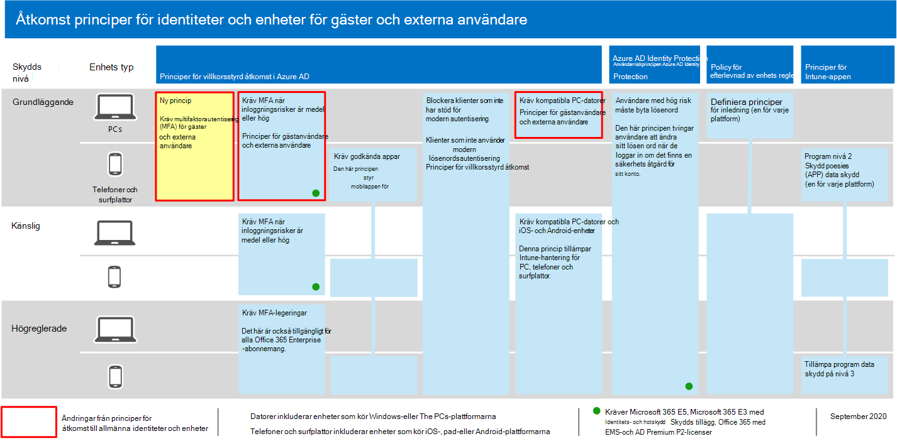

# Principer för att tillåta gäståtkomst och åtkomst för B2B-externa användare

I den här artikeln beskrivs hur du justerar rekommenderade principer för enhets- och identitetsåtkomst för att tillåta åtkomst för gäster och externa användare som har ett Azure Active Directory-konto (Azure AD) business-to-business (B2B). Den här vägledningen bygger på de [gemensamma principerna för identitets- och enhetsåtkomst.](identity-access-policies.md)

De här rekommendationerna är utformade för att gälla **baslinjenivån** för skyddet. Men du kan också justera rekommendationerna utifrån dina specifika behov för **känsligt och** **starkt reglerat** skydd.

Att tillhandahålla en sökväg för B2B-konton för autentisering med din Azure AD-klientorganisation ger inte dessa konton åtkomst till hela miljön. B2B-användare och deras konton har åtkomst till tjänster och resurser, som filer, som delas med dem genom villkorsstyrd åtkomstprincip.

## Uppdatera vanliga principer för att tillåta och skydda gäster och åtkomst för externa användare

Det här diagrammet visar vilka principer som ska läggas till eller uppdateras bland vanliga principer för identitets- och enhetsåtkomst, för B2B-gäst- och extern användaråtkomst.

[Visa en större version av den här bilden](https://github.com/MicrosoftDocs/microsoft-365-docs/raw/public/microsoft-365/media/microsoft-365-policies-configurations/identity-access-ruleset-guest.png)

I följande tabell visas de principer som du antingen behöver skapa och uppdatera. De vanliga principerna länkar till de tillhörande konfigurationsanvisningarna i [artikeln Principer för gemensamma identiteter och enhetsåtkomst.](identity-access-policies.md)

|Skyddsnivå|Principer|Mer information|
|---|---|---|
|**Grundläggande**|[Kräv alltid MFA för gäster och externa användare](identity-access-policies.md#require-mfa-based-on-sign-in-risk)|Skapa den här nya principen och konfigurera: <ul><li>För **Tilldelningar > användare** och grupper > Välj användare och grupper och välj sedan **Alla gästanvändare och externa användare.**</li><li>Om **det >** villkor > du logga in låter du alla alternativ vara avmarkerade för att alltid tillämpa multifaktorautentisering (MFA).</li></ul>|
||[Kräv MFA när inloggningsrisken är *medelhög* eller *hög*](identity-access-policies.md#require-mfa-based-on-sign-in-risk)|Ändra den här principen för att utesluta gäster och externa användare.|
||[Kräv kompatibla PC-datorer](identity-access-policies.md#require-compliant-pcs-but-not-compliant-phones-and-tablets)|Ändra den här principen för att utesluta gäster och externa användare.|

Om du vill inkludera eller exkludera gäster och externa användare i **villkorsstyrda åtkomstprinciper** markerar du, för Tilldelningar > Användare och grupper > Inkludera eller **Exkludera,** markera Alla gästanvändare och **externa användare.**

## Mer information

### Gäster och åtkomst för externa användare med Microsoft Teams

Microsoft Teams definierar följande användare:

- **Gäståtkomst** använder ett Azure AD B2B-konto som kan läggas till som medlem i ett team och har åtkomst till teamets kommunikation och resurser.

- **Extern åtkomst** är för en extern användare som inte har ett B2B-konto. Extern användaråtkomst omfattar inbjudningar, samtal, chattar och möten, men omfattar inte teammedlemskap och åtkomst till teamets resurser.

Mer information finns i [jämförelsen mellan gäster och extern användaråtkomst för team.](https://docs.microsoft.com/microsoftteams/communicate-with-users-from-other-organizations#compare-external-and-guest-access)

Mer information om hur du skyddar identitets- och enhetsåtkomstprinciper för Teams finns i principrekommendationer för att skydda [Chattar, grupper och filer i Teams.](teams-access-policies.md)

### Kräv MFA alltid för gästanvändare och externa användare

Den här principen uppmanar gäster att registrera sig för MFA i din klientorganisation, oavsett om de är registrerade för MFA i sin hemklientorganisation. När du ska få åtkomst till resurser i klientorganisationen måste gäster och externa användare använda MFA för varje begäran.

### Utesluta gäster och externa användare från riskbaserade MFA

Även om organisationer kan tillämpa riskbaserade principer för B2B-användare med Azure AD Identity Protection, finns det begränsningar i implementeringen av Azure AD Identity Protection för B2B-samarbetsanvändare i en resurskatalog på grund av att deras identitet finns i deras hemkatalog. På grund av dessa begränsningar rekommenderar Microsoft att du undantar gäster från riskbaserade MFA-policyer och kräver att dessa användare alltid använder MFA.

Mer information finns i Begränsningar [av identitetsskydd för B2B-samarbetsanvändare.](https://docs.microsoft.com/azure/active-directory/identity-protection/concept-identity-protection-b2b#limitations-of-identity-protection-for-b2b-collaboration-users)

### Utesluta gäster och externa användare från enhetshantering

Det är bara en organisation som kan hantera en enhet. Om du inte utesluter gäster och externa användare från principer som kräver enhetsefterlevnad blockerar dessa principer dessa användare.

## Nästa steg

Konfigurera villkorsstyrda åtkomstprinciper för:

- [Microsoft Teams](teams-access-policies.md)
- [Exchange Online](secure-email-recommended-policies.md)
- [SharePoint](sharepoint-file-access-policies.md)
