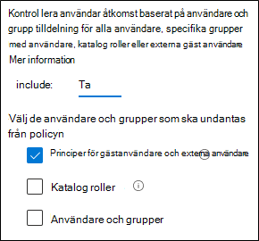

# Principer för att tillåta gäst åtkomst och åtkomst till externa användarePolicies for allowing guest access and B2B external user access

I den här artikeln beskrivs hur du justerar Rekommenderad enhet och identitets åtkomst för att tillåta åtkomst för gäster och externa användare som har ett Azure Active Directory (Azure AD)-konto.This article discusses adjusting the recommended device and identity access policies to allow access for guests and external users that have an Azure Active Directory (Azure AD) Business-to-Business (B2B) account. Den här vägledningen bygger på [vanliga principer för identitets-och enhets åtkomst](identity-access-policies.md).This guidance builds on the [common identity and device access policies](identity-access-policies.md).

Dessa rekommendationer är avsedda att tillämpas på den **ursprungliga** skydds nivån.These recommendations are designed to apply to the **baseline** tier of protection. Men du kan också justera rekommendationerna baserat på dina specifika behov för **känsligt** och **starkt reglerat** skydd.But you can also adjust the recommendations based on your specific needs for **sensitive** and **highly regulated** protection.

Om du tillhandahåller en sökväg för B2B-konton för att autentisera med din Azure AD-klient får inte dessa konton åtkomst till hela din miljö.Providing a path for B2B accounts to authenticate with your Azure AD tenant doesn't give these accounts access to your entire environment. B2B-användare och deras konton har till gång till tjänster och resurser, till exempel filer, som delas med dem via princip för villkorsstyrd åtkomst.B2B users and their accounts have access to services and resources, like files, shared with them by Conditional Access policy.

## Uppdatera gemensamma principer för att tillåta och skydda gäster och åtkomst till externa användareUpdating the common policies to allow and protect guests and external user access

Det här diagrammet visar vilka principer du kan lägga till eller uppdatera bland de vanliga åtkomst principerna för identitet och enheter, för B2B-gäst och åtkomst via extern användare.This diagram shows which policies to add or update among the common identity and device access policies, for B2B guest and external user access.

[Visa en större version av bildenSee a larger version of this image](https://github.com/MicrosoftDocs/microsoft-365-docs/raw/public/microsoft-365/media/microsoft-365-policies-configurations/identity-access-ruleset-guest.png)

I följande tabell visas de principer som du måste skapa och uppdatera.The following table lists the policies you either need to create and update. Gemensamma principer-länken till de associerade konfigurations anvisningarna i artikeln om [principer för åtkomst policys för identitet och enheter](identity-access-policies.md) .The common policies link to the associated configuration instructions in the [Common identity and device access policies](identity-access-policies.md) article.

|Skydds nivåProtection level|PrincipernaPolicies|Mer informationMore information|
|---|---|---|
|**Grundläggande****Baseline**|[Kräv MFA alltid för gäster och externa användareRequire MFA always for guests and external users](identity-access-policies.md#require-mfa-based-on-sign-in-risk)|Skapa den här nya principen och konfigurera:Create this new policy and configure: <ul><li>För **uppgifter > användare och grupper > inkludera** väljer **du Välj användare och grupper** och sedan **alla gäst-och externa användare**.For **Assignments > Users and groups > Include**, choose **Select users and groups**, and then select **All guest and external users**.</li><li>För **tilldelningar > villkor > inloggning** ska du låta alla alternativ vara avmarkerade så att multifaktorautentisering alltid används (MFA).For **Assignments > Conditions > Sign-in**, leave all options unchecked to always enforce multi-factor authentication (MFA).</li></ul>|
||[Kräv MFA när en inloggnings risk är *mellan* eller *hög*Require MFA when sign-in risk is *medium* or *high*](identity-access-policies.md#require-mfa-based-on-sign-in-risk)|Ändra den här principen för att exkludera gäster och externa användare.Modify this policy to exclude guests and external users.|
||[Kräv kompatibla PC-datorerRequire compliant PCs](identity-access-policies.md#require-compliant-pcs-but-not-compliant-phones-and-tablets)|Ändra den här principen för att exkludera gäster och externa användare.Modify this policy to exclude guests and external users.|

Om du vill inkludera eller exkludera gäster och externa användare i principer för villkorsstyrd åtkomst för **uppgifter > användare och grupper > inkludera** eller **exkludera** markerar du **alla gäster och externa användare**.To include or exclude guests and external users in Conditional Access policies, for **Assignments > Users and groups > Include** or **Exclude**, check **All guest and external users**.

## Mer informationMore information

### Gäster och åtkomst till externa användare med Microsoft TeamsGuests and external user access with Microsoft Teams

Microsoft Teams definierar följande användare:Microsoft Teams defines the following users:

- **Gäst åtkomst** använder ett Azure AD B2B-konto som kan läggas till som medlem i ett team och ha åtkomst till kommunikationen och resurserna i teamet.**Guest access** uses an Azure AD B2B account that can be added as a member of a team and have access to the communications and resources of the team.

- **Extern åtkomst** är för en extern användare som inte har ett B2B-konto.**External access** is for an external user that doesn't have a B2B account. Åtkomst till externa användare inkluderar inbjudningar, samtal, chattar och möten, men inkluderar inte grupp medlemskap och åtkomst till teamens resurser.External user access includes invitations, calls, chats, and meetings, but doesn't include team membership and access to the resources of the team.

Mer information finns i [jämförelsen mellan gäster och externa användar åtkomst för Teams](https://docs.microsoft.com/microsoftteams/communicate-with-users-from-other-organizations#compare-external-and-guest-access).For more information, see the [comparison between guests and external user access for teams](https://docs.microsoft.com/microsoftteams/communicate-with-users-from-other-organizations#compare-external-and-guest-access).

Mer information om hur du skyddar identitets-och åtkomst principer för grupper finns i [Policy rekommendationer för att skydda Teams, grupper och filer](teams-access-policies.md).For more information on securing identity and device access policies for Teams, see [Policy recommendations for securing Teams chats, groups, and files](teams-access-policies.md).

### Kräv MFA alltid för gäst-och externa användareRequire MFA always for guest and external users

Den här principen ber dig registrera gäster för MFA i klient organisationen, oavsett om de är registrerade för MFA i sin hem klient organisation.This policy prompts guests to register for MFA in your tenant, regardless of whether they're registered for MFA in their home tenant. När du får åtkomst till resurser i klient organisationen måste gäster och externa användare använda MFA för varje begäran.When accessing resources in your tenant, guests and external users are required to use MFA for every request.

### Exkludera gäster och externa användare från riskfyllda MFAExcluding guests and external users from risk-based MFA

Trots att organisationer kan använda riskbaserade principer för B2B-användare som använder Azure AD Identity Protection finns det begränsningar i implementeringen av Azure AD Identity Protection för B2B-samarbets användare i en resurs katalog på grund av deras identitet i sin Hem Katalog.While organizations can enforce risk-based policies for B2B users using Azure AD Identity Protection, there are limitations in the implementation of Azure AD Identity Protection for B2B collaboration users in a resource directory due to their identity existing in their home directory. På grund av dessa begränsningar rekommenderar Microsoft att du exkluderar gäster från riskfyllda MFA-principer och kräver att dessa användare alltid använder MFA.Due to these limitations, Microsoft recommends you exclude guests from risk-based MFA policies and require these users to always use MFA.

Mer information finns i [begränsningar för identitets skydd för B2B-samarbets användare](https://docs.microsoft.com/azure/active-directory/identity-protection/concept-identity-protection-b2b#limitations-of-identity-protection-for-b2b-collaboration-users).For more information, see [Limitations of Identity Protection for B2B collaboration users](https://docs.microsoft.com/azure/active-directory/identity-protection/concept-identity-protection-b2b#limitations-of-identity-protection-for-b2b-collaboration-users).

### Exkludera gäster och externa användare från enhets hanteringExcluding guests and external users from device management

Endast en organisation kan hantera en enhet.Only one organization can manage a device. Om du inte utesluter gäster och externa användare från principer som kräver att enheter efterlevs blockerar dessa användare.If you don't exclude guests and external users from policies that require device compliance, these policies will block these users.

## Nästa stegNext step

Konfigurera principer för villkorsstyrd åtkomst för:Configure Conditional Access policies for:

- [Microsoft TeamsMicrosoft Teams](teams-access-policies.md)
- [Exchange OnlineExchange Online](secure-email-recommended-policies.md)
- [SharePointSharePoint](sharepoint-file-access-policies.md)
