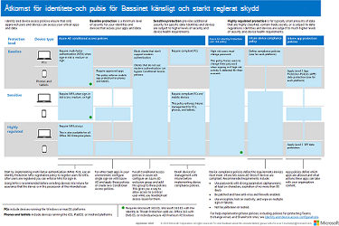
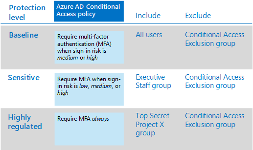
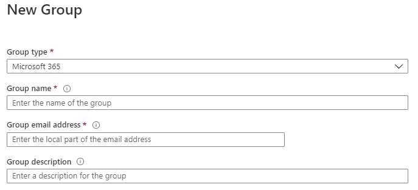
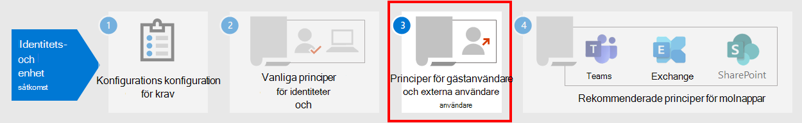

# Vanliga principer för identitets- och enhetsåtkomst

I den här artikeln beskrivs vanliga rekommenderade principer för att skydda åtkomst till Microsoft 365-moln tjänster, inklusive lokala program som har publicerats med Azure Active Directory (Azure AD)-tillämpningsproxy.

Den här vägledningen handlar om hur du distribuerar rekommenderade principer i en nyligen etablerad miljö. Genom att konfigurera dessa principer i en särskild laboratorie miljö kan du förstå och utvärdera rekommenderade principer innan du förbereder introduktionen till din produkt miljö. Den nyligen etablerade miljön kan endast vara moln-eller hybrid för att återspegla dina behov.

## Princip uppsättning

Följande diagram illustrerar den rekommenderade uppsättningen principer. Det visar vilken skydds nivå varje princip gäller för och om policyn gäller för datorer eller telefoner och surfplattor, eller båda enhets kategorierna. Det visar också var du konfigurerar dessa principer.

[Visa en större version av bilden](https://github.com/MicrosoftDocs/microsoft-365-docs/raw/public/microsoft-365/media/microsoft-365-policies-configurations/Identity_device_access_policies_byplan.png)

Här är en ensidig PDF-sammanfattning med länkar till enskilda principer:

    [Visa som en PDF-fil](../../downloads/MSFT-cloud-architecture-identity-device-protection-handout.pdf) \| [Ladda ned som PDF](https://github.com/MicrosoftDocs/microsoft-365-docs/raw/public/microsoft-365/downloads/MSFT-cloud-architecture-identity-device-protection-handout.pdf)

I resten av den här artikeln beskrivs hur du konfigurerar dessa principer.

> [!NOTE]
> Att kräva att multifaktorautentisering används (MFA) rekommenderas innan de registrerar enheter i Intune för att kontrol lera att enheten är avsedd för den avsedda användaren. Du måste registrera enheter i Intune innan du kan tvinga fram principer för enhetskompatibilitet.

För att ge dig tid att utföra dessa uppgifter rekommenderar vi att du implementerar rikt linjerna i den ordning som anges i tabellen. MFA-principerna för känslig och högreglerade skydds nivåer kan implementeras när som helst.

|Skydds nivå|Principerna|Mer information|
|---|---|---|
|**Grundläggande**|[Kräv MFA när en inloggnings risk är *mellan* eller *hög*](#require-mfa-based-on-sign-in-risk)||
||[Blockera klienter som inte har stöd för modern autentisering](#block-clients-that-dont-support-modern-authentication)|Klienter som inte använder modern lösenordsautentisering kan kringgå principer för villkorsstyrd åtkomst, så det är viktigt att blockera dessa.|
||[Användare med hög risk måste byta lösenord](#high-risk-users-must-change-password)|Tvingar användare att ändra sitt lösen ord när de loggar in om en högrisk aktivitet identifieras för sitt konto.|
||[Tillämpa program data skydds policy](#apply-app-data-protection-policies)|En Intune program skydds policy per plattform (Windows, iOS/iPad, Android).|
||[Kräv godkända appar och program skydd](#require-approved-apps-and-app-protection)|Aktiverar dataexekveringsskydd för telefoner och surfplattor med iOS, iPad eller Android.|
||[Definiera principer för efterlevnadsprinciper](#define-device-compliance-policies)|En princip för varje plattform.|
||[Kräv kompatibla PC-datorer](#require-compliant-pcs-but-not-compliant-phones-and-tablets)|Framtvingar Intune-hantering av datorer med Windows eller MacOS.|
|**Känslig**|[Kräv MFA när en inloggnings risk är *låg*, *medel* eller *hög*](#require-mfa-based-on-sign-in-risk)||
||[Kräv kompatibla datorer *och* mobila enheter](#require-compliant-pcs-and-mobile-devices)|Framtvingar Intune-hantering för båda datorerna (Windows eller MacOS) och telefoner eller surfplattor (iOS, iPad eller Android).|
|**Strikt reglerad**|[Kräv *alltid* MFA](#require-mfa-based-on-sign-in-risk)|
|

## Tilldela principer till grupper och användare

Innan du konfigurerar principer ska du identifiera de Azure AD-grupper du använder för varje skydds nivå. Bas linje skydd gäller normalt för alla i organisationen. En användare som ingår i både bas linje och känsligt skydd får alla rikt linjer som tillämpas samt känsliga principer. Skyddet är kumulativt och den mest restriktiva principen tillämpas.

Ett rekommenderat tillvägagångs sätt är att skapa en Azure AD-grupp för undantag för villkorlig åtkomst. Lägg till den här gruppen i alla principer för villkorsstyrd åtkomst i området **exkludera** för **användare och grupper** i avsnittet **uppgifter** . Det gör att du kan ge åtkomst till en användare när du felsöker åtkomst problem. Detta rekommenderas endast som en tillfällig lösning. Övervaka den här gruppen för ändringar och kontrol lera att exkluderings gruppen bara används som avsett.

Här är ett exempel på grupp tilldelning och undantag för MFA.

Här är resultatet:

- Alla användare måste använda MFA när inloggnings risken är medel eller hög.

- Medlemmar i gruppen exekutiv personal måste använda MFA när inloggnings risken är låg, medel eller hög.

  I det här fallet matchar medlemmar i gruppen exekutiva personer både principer för bas linje och villkorsstyrd åtkomst. Åtkomst kontrollerna för båda principer är kombinerade, vilka i det här fallet är likvärdigt med den känsliga principen för villkorsstyrd åtkomst.

- Medlemmar i den Top Secret-projekt X-gruppen måste alltid använda MFA

  I det här fallet matchar medlemmar i den Top Secreta projekt X-gruppen både bas linje och villkorsstyrd åtkomst policy som är starkt reglerad. Åtkomst kontrollerna för båda principer kombineras. Eftersom åtkomst kontrollen för den högreglerade principen för villkorsstyrd åtkomst är mer restriktiv används den.

Var försiktig när du tillämpar högre skydds nivåer för grupper och användare. Till exempel måste du använda MFA varje gång de loggar in, även om de inte arbetar med det starkt reglerade innehållet i Project X.

Alla Azure AD-grupper som skapas som en del av dessa rekommendationer måste skapas som Microsoft 365-grupper. Det här är viktigt för att du ska kunna distribuera känslighets etiketter när du skyddar dokument i Microsoft Teams och SharePoint.

## Kräv MFA baserat på inloggnings risker

Du bör ha användarna registrerade för MFA innan de behöver använda det. Om du har Microsoft 365 E5, Microsoft 365 E3 med identitets & hot Protection-tillägg, Office 365 med EMS, eller de enskilda Azure AD Premium P2-licenserna, kan du använda principen för MFA-registrering med Azure AD-skyddsagenten för att kräva att användare registrerar MFA. För [kravet på arbete](identity-access-prerequisites.md) ingår att registrera alla användare med MFA.

När användarna är registrerade kan du kräva MFA för att logga in med en ny princip för villkorsstyrd åtkomst.

1. Gå till [Azure-portalen](https://portal.azure.com)och logga in med dina inloggnings uppgifter.
2. I listan med Azure-tjänster väljer du **Azure Active Directory**.
3. Välj **säkerhet** i listan **Hantera** och välj sedan **villkorlig åtkomst**.
4. Välj **ny princip** och ange den nya Principens namn.

I följande tabell beskrivs princip inställningarna för villkorsstyrd åtkomst för att kräva MFA baserat på inloggnings risker.

I avsnittet **uppgifter** :

|Inställning|Fjärråtkomstsegenskaper|Värden|Kommentarer|
|---|---|---|---|
|Användare och grupper|Inkludera|**Välj användare och grupper > användare och grupper**: Välj specifika grupper som innehåller riktade användar konton.|Börja med gruppen som innehåller pilot användar konton.|
||Ta|**Användare och grupper**: Välj en undantags grupp för villkorlig åtkomst. tjänst konton (program identiteter).|Medlemskapet bör ändras efter behov.|
|Moln program eller-åtgärder|**> moln program inkluderar**|**Välj appar**: Välj de program du vill att den här policyn ska tillämpas på. Välj till exempel Exchange Online.||
|Situationer|||Konfigurera villkor som är specifika för din miljö och dina behov.|
||Inloggnings risker||Se anvisningarna i följande tabell.|
|

### Inställningar för problem med inloggnings risk

Tillämpa inställningarna på risk nivå baserat på den skydds nivå du är riktad mot.

|Skydds nivå|Risk nivå värden som behövs|Fattning|
|---|---|---|
|Grundläggande|Hög, medium|Markera båda.|
|Känslig|Hög, medium, lågt|Markera alla tre.|
|Strikt reglerad||Låt alla alternativ vara avmarkerade om du alltid vill använda MFA.|
|

I avsnittet **Access Controls** :

|Inställning|Fjärråtkomstsegenskaper|Värden|Fattning|
|---|---|---|---|
|Tilldelas|**Grant access**||Använda|
|||**Kräv multifaktorautentisering**|Check|
||**Kräv alla markerade kontroller**||Använda|
|

Välj **Välj** för att spara inställningen för **beviljande** .

**Välj slutligen för** **att aktivera principer** och välj sedan **skapa**.

Överväg [också att använda verktyget för](https://docs.microsoft.com/azure/active-directory/active-directory-conditional-access-whatif) att testa policyn.

## Blockera klienter som inte har stöd för modern autentisering

Använd inställningarna i de här tabellerna för en princip för villkorsstyrd åtkomst för att blockera klienter som inte stöder modern.

I [den här artikeln](../../enterprise/microsoft-365-client-support-modern-authentication.md) finns en lista med klienter i Microsoft 365 som gör suppport modern.

I avsnittet **uppgifter** :

|Inställning|Fjärråtkomstsegenskaper|Värden|Kommentarer|
|---|---|---|---|
|Användare och grupper|Inkludera|**Välj användare och grupper > användare och grupper**: Välj specifika grupper som innehåller riktade användar konton.|Börja med gruppen som innehåller pilot användar konton.|
||Ta|**Användare och grupper**: Välj en undantags grupp för villkorlig åtkomst. tjänst konton (program identiteter).|Medlemskapet bör ändras efter behov.|
|Moln program eller-åtgärder|**> moln program inkluderar**|**Välj appar**: Välj de program som motsvarar klienterna som inte stöder modern lösenordsautentisering.||
|Situationer|**Klient program**|Välj **Ja** för att **Konfigurera**   Avmarkera kryss markeringar för **webbläsare** och **mobilappar och Station ära klienter**||
|

I avsnittet **Access Controls** :

|Inställning|Fjärråtkomstsegenskaper|Värden|Fattning|
|---|---|---|---|
|Tilldelas|**Blockera åtkomst**||Använda|
||**Kräv alla markerade kontroller**||Använda|
|

Välj **Välj** för att spara inställningen för **beviljande** .

**Välj slutligen för** **att aktivera principer** och välj sedan **skapa**.

Överväg att använda [verktyget för att testa](https://docs.microsoft.com/azure/active-directory/active-directory-conditional-access-whatif) policyn.

För Exchange Online kan du använda autentiseringsprinciper för att [Inaktivera grundläggande](https://docs.microsoft.com/exchange/clients-and-mobile-in-exchange-online/disable-basic-authentication-in-exchange-online)åtkomst, vilket tvingar alla klient åtkomst förfrågningar att använda modern verifikation.

## Användare med hög risk måste byta lösenord

För att säkerställa att alla högrisk användares komprometterade konton tvingas göra en ändring av lösen ord när de loggar in måste du tillämpa följande policy.

Logga in på [Microsoft Azure-portalen ( https://portal.azure.com)](https://portal.azure.com/) med administratörs uppgifterna och navigera sedan till **Azure AD Identity Protection > User risk policy**.

I avsnittet **uppgifter** :

|Skriv|Fjärråtkomstsegenskaper|Värden|Fattning|
|---|---|---|---|
|Användare|Inkludera|**Alla användare**|Använda|
|Risk för användare|**Högsta**||Använda|
|

I avsnittet andra **uppgifter** :

|Skriv|Fjärråtkomstsegenskaper|Värden|Fattning|
|---|---|---|---|
|Åtkomst|**Tillåt åtkomst**||Använda|
|||**Kräv lösen ords ändring**|Check|
|

Välj **klar** för att spara **åtkomst** inställningar.

Välj slutligen **på** för att **påtvinga policy** och välj sedan **Spara**.

Överväg att använda [verktyget för att testa](https://docs.microsoft.com/azure/active-directory/active-directory-conditional-access-whatif) policyn.

Använd den här principen tillsammans med [konfiguration av lösen ords skydd i Azure AD](https://docs.microsoft.com/azure/active-directory/authentication/concept-password-ban-bad)som identifierar och blockerar kända svaga lösen ord och deras varianter och ytterligare svaga termer som är specifika för din organisation. Genom att använda lösen ords skydd för Azure AD ser du till att ändrade lösen ord är starka.

## Tillämpa program data skydds policy

App Protection policies (APP) definierar vilka appar som tillåts och vilka åtgärder de kan utföra med din organisations data. De val som är tillgängliga i appen gör det möjligt för organisationer att skräddarsy skyddet mot deras specifika behov. I vissa fall är det kanske inte uppenbart vilka princip inställningar som krävs för att implementera ett fullständigt scenario. För att hjälpa organisationer att prioritera en mobil klient Bryt punkts härdning har Microsoft infört taxonomi för programmets data skydds ramverk för iOS-och Android-mobilappar.

PROGRAM data skydds ramverket är uppdelat i tre olika konfigurations nivåer, med varje nivå som bygger på föregående nivå:

- **Företags grundläggande data skydd** (nivå 1) säkerställer att appar skyddas med en PIN-kod och krypterad och utför selektiv rensning. För Android-enheter verifierar den här nivån Android-enhetens attestering. Det här är en inmatnings nivå konfiguration som ger en liknande data skydds kontroll i Exchange Online Mailbox-principer och introducerar den och användar populationen till program.
- **Förbättrat data skydd för företag** (nivå 2) introducerar mekanismer för att förhindra program data läckage och minimi krav på operativ system. Det här är den konfiguration som kan användas för de flesta mobila användare som vill komma åt arbets-eller skol data.
- **Data skydd i företags kvalitet** (nivå 3) introducerar avancerade data skydds mekanismer, förbättrad PIN-konfiguration och försvar för mobil hot från appen. Denna konfiguration är önskvärt för användare som har till gång till högrisk data.

Om du vill se de särskilda rekommendationerna för varje konfigurations nivå och de program som måste skyddas kan du granska [data skydds ramverket med hjälp av skydds principer för appar](https://docs.microsoft.com/mem/intune/apps/app-protection-framework).

Genom att använda de principer som beskrivs i [identitets-och enhets åtkomst](microsoft-365-policies-configurations.md)kan du följa de grundläggande inställningarna för data skydd i nivå 2. De data skydds nivåer som är starkt prioriterade är nära nivå 3-inställningar för data skydd i Enterprise.

|Skydds nivå|Program skydds princip|Mer information|
|---|---|---|
|Grundläggande|[Nivå 2-förbättrat data skydd](https://docs.microsoft.com/mem/intune/apps/app-protection-framework#level-2-enterprise-enhanced-data-protection)|De princip inställningar som tillämpas i nivå 2 inkluderar alla princip inställningar som rekommenderas för nivå 1 och lägger till eller uppdaterar princip inställningarna nedan för att implementera fler kontroller och en mer avancerad konfiguration än nivå 1.|
|Känslig|[Nivå 2-förbättrat data skydd](https://docs.microsoft.com/mem/intune/apps/app-protection-framework#level-2-enterprise-enhanced-data-protection)|De princip inställningar som tillämpas i nivå 2 inkluderar alla princip inställningar som rekommenderas för nivå 1 och lägger till eller uppdaterar princip inställningarna nedan för att implementera fler kontroller och en mer avancerad konfiguration än nivå 1.|
|Säkerhets regler|[Nivå 3-skydda företags data](https://docs.microsoft.com/mem/intune/apps/app-protection-framework#level-3-enterprise-high-data-protection)|De princip inställningar som tillämpas i nivå 3 inkluderar alla princip inställningar som rekommenderas för nivå 1 och 2 och lägger till eller uppdaterar de här princip inställningarna för att implementera fler kontroller och en mer avancerad konfiguration än nivå 2.|
|

Om du vill skapa en ny skydds princip för varje plattform (iOS och Android) i Microsoft slut punkts hanteraren med inställningarna för data skydds ramverk kan du:

1. Skapa principer manuellt genom att följa de steg som beskrivs [för att skapa och distribuera skydds principer för appar med Microsoft Intune](https://docs.microsoft.com/mem/intune/apps/app-protection-policies).
2. Importera exempel på [princip konfigurations ramverket för Intune-appens skydd](https://github.com/microsoft/Intune-Config-Frameworks/tree/master/AppProtectionPolicies) med INTUNE-JSON- [skript](https://github.com/microsoftgraph/powershell-intune-samples).

## Kräv godkända appar och program skydd

För att påtvinga program skydds principer som du använde i Intune måste du skapa en princip för villkorsstyrd åtkomst för att Kräv godkända klient program och de villkor som ställts in i APPENs skydds principer.

För att tvinga skydds principer för appar krävs en uppsättning principer som beskrivs i [Kräv program skydds princip för Cloud App Access med villkorlig åtkomst](https://docs.microsoft.com/azure/active-directory/conditional-access/app-protection-based-conditional-access). Dessa principer ingår i de rekommenderade uppsättningarna med identitets-och åtkomst principer.

Om du vill skapa principen för villkorsstyrd åtkomst som kräver godkända appar och APP Protection följer du anvisningarna i "steg 1: Konfigurera en princip för villkorlig åtkomst för Azure AD för Microsoft 365" i [Scenario 1: Microsoft 365-appar kräver godkända appar med skydds principer för appar](https://docs.microsoft.com/azure/active-directory/conditional-access/app-protection-based-conditional-access#scenario-1-office-365-apps-require-approved-apps-with-app-protection-policies), som tillåter Outlook för iOS och Android, men blockerar OAuth-kompatibla Exchange ActiveSync-klienter från att ansluta till Exchange Online.

   > [!NOTE]
   > Den här principen gör att mobila användare kan komma åt alla Office-slutpunkter med hjälp av tillämpliga appar.

Om du aktiverar mobil åtkomst till Exchange Online implementerar du [spärrar ActiveSync-klienter](secure-email-recommended-policies.md#block-activesync-clients)som hindrar Exchange ActiveSync-klienter att använda grundläggande åtkomst från anslutning till Exchange Online. Den här principen visas inte i bilden högst upp i den här artikeln. Det beskrivs och visas i [Policy rekommendationer för att skydda e-post](secure-email-recommended-policies.md).

 Dessa principer använder kontrollen för [godkända klienter](https://docs.microsoft.com/azure/active-directory/conditional-access/concept-conditional-access-grant#require-approved-client-app) och kräver [program skydds princip](https://docs.microsoft.com/azure/active-directory/conditional-access/concept-conditional-access-grant#require-app-protection-policy).

Om du blockerar äldre klientautentisering för andra klient program på iOS-och Android-enheter säkerställer du att dessa klienter inte kan kringgå principer för villkorlig åtkomst. Om du följer anvisningarna i den här artikeln har du redan konfigurerat [blockera klienter som inte stöder modern](#block-clients-that-dont-support-modern-authentication).

<!---
With Conditional Access, organizations can restrict access to approved (modern authentication capable) iOS and Android client apps with Intune app protection policies applied to them. Several Conditional Access policies are required, with each policy targeting all potential users. Details on creating these policies can be found in [Require app protection policy for cloud app access with Conditional Access](https://docs.microsoft.com/azure/active-directory/conditional-access/app-protection-based-conditional-access).

1. Follow "Step 1: Configure an Azure AD Conditional Access policy for Microsoft 365" in [Scenario 1: Microsoft 365 apps require approved apps with app protection policies](https://docs.microsoft.com/azure/active-directory/conditional-access/app-protection-based-conditional-access#scenario-1-office-365-apps-require-approved-apps-with-app-protection-policies), which allows Outlook for iOS and Android, but blocks OAuth capable Exchange ActiveSync clients from connecting to Exchange Online.

   > [!NOTE]
   > This policy ensures mobile users can access all Office endpoints using the applicable apps.

2. If enabling mobile access to Exchange Online, implement [Block ActiveSync clients](secure-email-recommended-policies.md#block-activesync-clients), which prevents Exchange ActiveSync clients leveraging basic authentication from connecting to Exchange Online.

   The above policies leverage the grant controls [Require approved client app](https://docs.microsoft.com/azure/active-directory/conditional-access/concept-conditional-access-grant#require-approved-client-app) and [Require app protection policy](https://docs.microsoft.com/azure/active-directory/conditional-access/concept-conditional-access-grant#require-app-protection-policy).

3. Disable legacy authentication for other client apps on iOS and Android devices. For more information, see [Block clients that don't support modern authentication](#block-clients-that-dont-support-modern-authentication).
-->

## Definiera principer för enhetskompatibilitet

Enhet – efterlevnadsprinciper definierar kraven som enheter måste uppfylla för att kunna identifieras som kompatibla. Du skapar principer för regelefterlevnad-enheter från administrations centret för Microsoft Endpoint Manager.

Du måste skapa en princip för varje dator, telefon eller surfplatta:

- Android-enhetens administratör
- Android Enterprise
- iOS/iPad
- macOS
- Windows 8,1 och senare
- Windows 10 och senare

Om du vill skapa principer för efterlevnadsprinciper loggar du in i [administrations centret för Microsoft slut punkts hanteraren](https://endpoint.microsoft.com) med dina administratörs uppgifter och navigerar **sedan till principer** för principer för  >  **efterlevnadsprinciper**  >  **Policies**. Välj **Skapa princip**.

Om principer för enhetskompatibilitet ska distribueras måste de kopplas till användar grupper. Du tilldelar en policy när du har skapat och sparat den. I Admin Center väljer du policy och sedan **uppgifter**. När du har valt de grupper som du vill ta emot principen för väljer du **Spara** för att spara grupp tilldelningen och distribuera policyn.

Stegvisa instruktioner om hur du skapar efterlevnadsprinciper i Intune finns i [skapa en policy för efterlevnad i Microsoft Intune](https://docs.microsoft.com/mem/intune/protect/create-compliance-policy) i Intune-dokumentationen.

### Rekommenderade inställningar för Windows 10 och senare

Följande inställningar rekommenderas för datorer med Windows 10 och senare, enligt konfigurationen i **steg 2: inställningar för efterlevnad**, av processen för att skapa principer.

Information om **utvärderings regler för tjänsten för Hälsoattestering för Windows >** i den här tabellen.

|Fjärråtkomstsegenskaper|Värde|Fattning|
|---|---|---|
|Kräv BitLocker|Nödvändig|Använda|
|Kräv säker start för att vara aktive rad på enheten|Nödvändig|Använda|
|Kräv kod integritet|Nödvändig|Använda|
|

Ange lämpliga värden för operativ system versioner baserat på dina IT-och säkerhets principer för **enhets egenskaper**.

För **Configuration Manager-efterlevnad** väljer du **Kräv**.

Information om **säkerhet** finns i den här tabellen.

|Skriv|Fjärråtkomstsegenskaper|Värde|Fattning|
|---|---|---|---|
|Lösenord|Kräv lösen ord för att låsa upp mobila enheter|Nödvändig|Använda|
||Enkla lösen ord|Blockera|Använda|
||Lösen ords typ|Enhetens standard|Använda|
||Minsta längd på lösen ord|18.6|Skriv|
||Maximalt antal minuter av inaktivitet innan lösen ord krävs|0,15|Skriv   Den här inställningen stöds för Android-versionerna 4,0 och senare eller KNOX 4,0 och senare. För iOS-enheter stöds det för iOS 8,0 och senare.|
||Lösen ordet upphör (dagar)|41|Skriv|
||Antal tidigare lösen ord för att förhindra åter användning|T5|Skriv|
||Kräv lösen ord när enheten återgår från Idle-tillstånd (mobil och Holographic)|Nödvändig|Tillgängligt för Windows 10 och senare|
|Kryptering|Kryptering av data lagring på enhet|Nödvändig|Använda|
|Enhets säkerhet|Vägg|Nödvändig|Använda|
||Viktigt|Nödvändig|Använda|
||Antispionprogram|Nödvändig|Använda   För den här inställningen krävs en antispionprograms lösning registrerade i Windows säkerhets Center.|
|Defender|Microsoft Defender antimalware|Nödvändig|Använda|
||Microsoft Defender antimalware-version||Skriv   Stöds endast för Windows 10-skrivbordet. Microsoft rekommenderar att versions nummer inte överstiger fem gånger från den senaste versionen.|
||Microsoft Defender antimalware-signatur uppdaterad|Nödvändig|Använda|
||Real tids skydd|Nödvändig|Använda   Stöds endast för Windows 10-skrivbordet|
|

#### Microsoft Defender för Endpoint

|Skriv|Fjärråtkomstsegenskaper|Värde|Fattning|
|---|---|---|---|
|Microsoft Defender för slut punkts regler|Kräv att enheten bevaras på eller under maskin risk poängen|Risk|Använda|
|

## Kräv kompatibla datorer (men inte kompatibla telefoner och surfplattor)

Innan du lägger till en princip för att kräva kompatibla datorer måste du registrera enheter för hantering i Intune. Om du använder multifaktorautentisering rekommenderas innan du registrerar enheter i Intune för att garantera att enheten är avsedd för den avsedda användaren.

Så här kräver du kompatibla datorer:

1. Gå till [Azure-portalen](https://portal.azure.com)och logga in med dina inloggnings uppgifter.
2. I listan med Azure-tjänster väljer du **Azure Active Directory**.
3. Välj **säkerhet** i listan **Hantera** och välj sedan **villkorlig åtkomst**.
4. Välj **ny princip** och ange den nya Principens namn.

5. Under **uppgifter** väljer du **användare och grupper** och inkluderar vem du vill att principen ska gälla för. Uteslut också din undantags grupp för villkorsstyrd åtkomst.

6. Välj **molnappar eller åtgärder** under **uppgifter**.

7. Om du vill **Inkludera** väljer du **Välj program > väljer** och väljer sedan önskade appar i listan med **moln program** . Välj till exempel Exchange Online. Välj **Välj** när du är klar.

8. För att kräva kompatibla datorer (men inte kompatibla telefoner och surfplattor) väljer du **villkor > enhets plattformar** under **uppgifter**. Välj **Ja** för att **Konfigurera**. Välj  **Välj maskinvaruplattformar**, Välj **Windows** och **MacOS** och välj sedan **klar**.

9. Välj **Tillåt** under **åtkomst kontroller**.

10. Välj **bevilja åtkomst** och kontrol lera **att kryss rutan Kräv enhet är markerad som kompatibel**. För flera kontroller väljer du **Kräv alla markerade kontroller**. Välj **Markera** när du är klar.

11. Välj **på** för **Aktivera policy** och välj sedan **skapa**.

> [!NOTE]
> Kontrol lera att enheten är kompatibel innan du aktiverar den här principen. Annars kan du låsa upp och inte ändra denna princip förrän ditt användar konto har lagts till i gruppen uteslutning för villkorlig åtkomst.

## Kräv kompatibla datorer *och* mobila enheter

Så här kräver du efterlevnad för alla enheter:

1. Gå till [Azure-portalen](https://portal.azure.com)och logga in med dina inloggnings uppgifter.
2. I listan med Azure-tjänster väljer du **Azure Active Directory**.
3. Välj **säkerhet** i listan **Hantera** och välj sedan **villkorlig åtkomst**.
4. Välj **ny princip** och ange den nya Principens namn.

5. Under **uppgifter** väljer du **användare och grupper** och inkluderar vem du vill att principen ska gälla för. Uteslut också din undantags grupp för villkorsstyrd åtkomst.

6. Välj **molnappar eller åtgärder** under **uppgifter**.

7. Om du vill **Inkludera** väljer du **Välj program > väljer** och väljer sedan önskade appar i listan med **moln program** . Välj till exempel Exchange Online. Välj **Välj** när du är klar.

8. Välj **Tillåt** under **åtkomst kontroller**.

9. Välj **bevilja åtkomst** och kontrol lera **att kryss rutan Kräv enhet är markerad som kompatibel**. För flera kontroller väljer du **Kräv alla markerade kontroller**. Välj **Markera** när du är klar.

10. Välj **på** för **Aktivera policy** och välj sedan **skapa**.

> [!NOTE]
> Kontrol lera att enheten är kompatibel innan du aktiverar den här principen. Annars kan du låsa upp och inte ändra denna princip förrän ditt användar konto har lagts till i gruppen uteslutning för villkorlig åtkomst.

## Nästa steg

[Läs mer om policy rekommendationer för gäst-och externa användare](identity-access-policies-guest-access.md)
