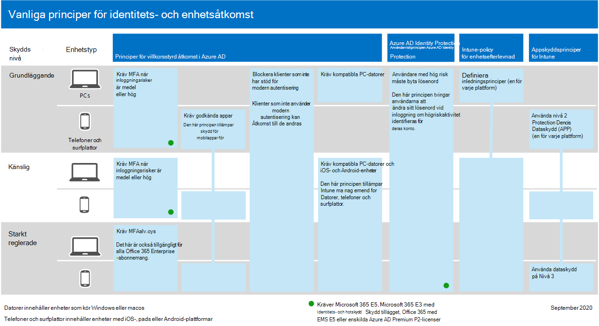

# Vanliga principer för identitets- och enhetsåtkomstCommon identity and device access policies

**Gäller för****Applies to**
- [Exchange Online ProtectionExchange Online Protection](exchange-online-protection-overview.md)
- [Microsoft Defender för Office 365 Abonnemang 1 och Abonnemang 2Microsoft Defender for Office 365 plan 1 and plan 2](defender-for-office-365.md)
- AzureAzure

I den här artikeln beskrivs de vanligaste rekommenderade principerna för att skydda åtkomsten till Microsoft 365-molntjänster, inklusive lokala program som publicerats med Azure Active Directory (Azure AD) programproxy.This article describes the common recommended policies for securing access to Microsoft 365 cloud services, including on-premises applications published with Azure Active Directory (Azure AD) Application Proxy.

I den här vägledningen beskrivs hur du distribuerar de rekommenderade principerna i en nyetablerade miljö.This guidance discusses how to deploy the recommended policies in a newly-provisioned environment. Genom att konfigurera de här principerna i en separat labbmiljö kan du förstå och utvärdera de rekommenderade principerna innan du förinstallerar utrullningen till dina preproduktions- och produktionsmiljöer.Setting up these policies in a separate lab environment allows you to understand and evaluate the recommended policies before staging the rollout to your preproduction and production environments. Din nyligen etablerade miljö kan vara molnbaserad eller hybrid för att återspegla dina utvärderingsbehov.Your newly provisioned environment can be cloud-only or hybrid to reflect your evaluation needs.

## PrincipuppsättningPolicy set

I följande diagram visas den rekommenderade uppsättningen principer.The following diagram illustrates the recommended set of policies. Den visar vilken nivå av skydd som varje princip gäller för och om principerna gäller för datorer eller telefoner och surfplattor, eller båda kategorierna av enheter.It shows which tier of protections each policy applies to and whether the policies apply to PCs or phones and tablets, or both categories of devices. Den anger också var du konfigurerar de här principerna.It also indicates where you configure these policies.

Här är en PDF-sammanfattning på en sida med länkar till de enskilda principerna:Here's a one-page PDF summary with links to the individual policies:

   [Visa som PDF](../../downloads/MSFT-cloud-architecture-identity-device-protection-handout.pdf) \| [Ladda ned som PDF](https://github.com/MicrosoftDocs/microsoft-365-docs/raw/public/microsoft-365/downloads/MSFT-cloud-architecture-identity-device-protection-handout.pdf)[View as a PDF](../../downloads/MSFT-cloud-architecture-identity-device-protection-handout.pdf) \| [Download as a PDF](https://github.com/MicrosoftDocs/microsoft-365-docs/raw/public/microsoft-365/downloads/MSFT-cloud-architecture-identity-device-protection-handout.pdf)

I resten av den här artikeln beskrivs hur du konfigurerar de här principerna.The rest of this article describes how to configure these policies.

> [!NOTE]
> Du bör kräva multifaktorautentisering (MFA) innan du registrerar enheter i Intune för att försäkra dig om att enheten ligger hos den avsedda användaren.Requiring the use of multi-factor authentication (MFA) is recommended before enrolling devices in Intune to assure that the device is in the possession of the intended user. Du måste registrera enheter i Intune innan du kan tillämpa principer för enhetsefterlevnad.You must enroll devices in Intune before you can enforce device compliance policies.

För att ge dig tid att utföra dessa uppgifter rekommenderar vi att du implementerar baslinjeprinciperna i den ordning som anges i den här tabellen.To give you time to accomplish these tasks, we recommend implementing the baseline policies in the order listed in this table. Men MFA-principerna för känsliga och starkt reglerade skyddsnivåer kan implementeras när som helst.However, the MFA policies for sensitive and highly regulated levels of protection can be implemented at any time.

|SkyddsnivåProtection level|PrinciperPolicies|Mer informationMore information|LicensieringLicensing|
|---|---|---|---|
|**Grundläggande****Baseline**|[Kräv MFA när inloggningsrisken är *medium* eller *hög*Require MFA when sign-in risk is *medium* or *high*](#require-mfa-based-on-sign-in-risk)||Microsoft 365 E5 eller Microsoft 365 E3 med E5-säkerhets tilläggMicrosoft 365 E5 or Microsoft 365 E3 with the E5 Security add-on|
||[Blockera klienter som inte har stöd för modern autentiseringBlock clients that don't support modern authentication](#block-clients-that-dont-support-multi-factor)|Klienter som inte använder modern autentisering kan åsidosätta villkorsstyrda åtkomstprinciper, så det är viktigt att blockera dessa.Clients that do not use modern authentication can bypass Conditional Access policies, so it's important to block these.|Microsoft 365 E3 eller E5Microsoft 365 E3 or E5|
||[Användare med hög risk måste byta lösenordHigh risk users must change password](#high-risk-users-must-change-password)|Tvingar användarna att ändra sitt lösenord vid inloggning om högriskaktivitet identifieras för deras konto.Forces users to change their password when signing in if high-risk activity is detected for their account.|Microsoft 365 E5 eller Microsoft 365 E3 med E5-säkerhets tilläggMicrosoft 365 E5 or Microsoft 365 E3 with the E5 Security add-on|
||[Tillämpa programskyddsprinciper (APP)-dataskyddApply Application Protection Policies (APP) data protection](#apply-app-data-protection-policies)|Appskyddsprincipen för One Intune per plattform (Windows, iOS/iPadOS, Android).One Intune App Protection policy per platform (Windows, iOS/iPadOS, Android).|Microsoft 365 E3 eller E5Microsoft 365 E3 or E5|
||[Kräv godkända appar och programskyddRequire approved apps and app protection](#require-approved-apps-and-app-protection)|Tillämpar mobil appskydd för telefoner och surfplattor med iOS, iPadOS eller Android.Enforces mobile app protection for phones and tablets using iOS, iPadOS, or Android.|Microsoft 365 E3 eller E5Microsoft 365 E3 or E5|
||[Definiera principer för enhetsefterlevnadDefine device compliance policies](#define-device-compliance-policies)|En princip för varje plattform.One policy for each platform.|Microsoft 365 E3 eller E5Microsoft 365 E3 or E5|
||[Kräv kompatibla PC-datorerRequire compliant PCs](#require-compliant-pcs-but-not-compliant-phones-and-tablets)|Framtvingar Intune-hantering av datorer med Windows eller macOS.Enforces Intune management of PCs using Windows or macOS.|Microsoft 365 E3 eller E5Microsoft 365 E3 or E5|
|**Känslig****Sensitive**|[Kräv MFA när inloggningsrisken *är låg,* *medel* eller *hög*Require MFA when sign-in risk is *low*, *medium*, or *high*](#require-mfa-based-on-sign-in-risk)||Microsoft 365 E5 eller Microsoft 365 E3 med E5-säkerhets tilläggMicrosoft 365 E5 or Microsoft 365 E3 with the E5 Security add-on|
||[Kräv kompatibla datorer *och* mobila enheterRequire compliant PCs *and* mobile devices](#require-compliant-pcs-and-mobile-devices)|Framtvingar Intune-hantering för både datorer (Windows eller macOS) och telefoner och surfplattor (iOS, iPadOS eller Android).Enforces Intune management for both PCs (Windows or macOS) and phones or tablets (iOS, iPadOS, or Android).|Microsoft 365 E3 eller E5Microsoft 365 E3 or E5|
|**Strikt reglerad****Highly regulated**|[*Kräv* alltid MFA*Always* require MFA](#assigning-policies-to-groups-and-users)||Microsoft 365 E3 eller E5Microsoft 365 E3 or E5|
|

## Tilldela principer till grupper och användareAssigning policies to groups and users

Innan du konfigurerar principer identifierar du de Azure AD-grupper du använder för varje skyddsnivå.Before configuring policies, identify the Azure AD groups you are using for each tier of protection. Normalt gäller baslinjeskydd för alla i organisationen.Typically, baseline protection applies to everybody in the organization. En användare som ingår för både baslinje- och känsligt skydd kommer att tillämpa alla baslinjeprinciper plus känsliga principer.A user who is included for both baseline and sensitive protection will have all the baseline policies applied plus the sensitive policies. Skyddet ackumuleras och den mest restriktiva principen tillämpas.Protection is cumulative and the most restrictive policy is enforced.

En rekommenderad metod är att skapa en Azure AD-grupp för undantag för villkorsstyrd åtkomst.A recommended practice is to create an Azure AD group for Conditional Access exclusion. Lägg till den här gruppen i  alla **villkorsstyrda** åtkomstprinciper i inställningen Exkludera värdet **för** inställningen Användare och grupper i avsnittet Tilldelningar.Add this group to all of your Conditional Access policies in the **Exclude** value of the **Users and groups** setting in the **Assignments** section. Det ger dig en metod för att ge åtkomst till en användare medan du felsöker åtkomstproblem.This gives you a method to provide access to a user while you troubleshoot access issues. Det här rekommenderas endast som en tillfällig lösning.This is recommended as a temporary solution only. Övervaka den här gruppen efter ändringar och se till att undantagsgruppen endast används som avsett.Monitor this group for changes and be sure the exclusion group is being used only as intended.

Här är ett exempel på grupptilldelning och undantag som kräver MFA.Here's an example of group assignment and exclusions for requiring MFA.

Här är resultaten:Here are the results:

- Alla användare måste använda MFA när inloggningsrisken är medium eller hög.All users are required to use MFA when the sign-in risk is medium or high.

- Medlemmar i ledningsgruppen måste använda MFA när inloggningsrisken är låg, medium eller hög.Members of the Executive Staff group are required to use MFA when the sign-in risk is low, medium, or high.

  I det här fallet matchar medlemmarna i gruppen Ledningspersonal både baslinjeprincipen och känsliga villkorsstyrda åtkomstprinciper.In this case, members of the Executive Staff group match both the baseline and sensitive Conditional Access policies. Åtkomstkontrollerna för båda principerna kombineras, vilket i det här fallet motsvarar den känsliga villkorsstyrda åtkomstprincipen.The access controls for both policies are combined, which in this case is equivalent to the sensitive Conditional Access policy.

- Medlemmar i gruppen Top Secret Project X måste alltid använda MFAMembers of the Top Secret Project X group are always required to use MFA

  I det här fallet matchar medlemmar i gruppen Top Secret Project X både baslinjeprincipen och starkt reglerade villkorsstyrda principer för villkorsstyrd åtkomst.In this case, members of the Top Secret Project X group match both the baseline and highly-regulated Conditional Access policies. Åtkomstkontrollerna för båda principerna kombineras.The access controls for both policies are combined. Eftersom åtkomstkontrollen för den högst reglerade villkorsstyrda principen är mer restriktiv används den.Because the access control for the highly-regulated Conditional Access policy is more restrictive, it is used.

Var försiktig när du använder högre skyddsnivåer för grupper och användare.Be careful when applying higher levels of protection to groups and users. Medlemmar i X-gruppen Top Secret Project måste till exempel använda MFA varje gång de loggar in, även om de inte arbetar med det högreglerade innehållet för Project X.For example, members of the Top Secret Project X group will be required to use MFA every time they sign in, even if they are not working on the highly-regulated content for Project X.

Alla Azure AD-grupper som skapats som en del av dessa rekommendationer måste skapas Microsoft 365 grupper.All Azure AD groups created as part of these recommendations must be created as Microsoft 365 groups. Det här är viktigt för distributionen av känslighetsetiketter när du skyddar dokument i Microsoft Teams och SharePoint.This is important for the deployment of sensitivity labels when securing documents in Microsoft Teams and SharePoint.

## Kräv MFA baserat på inloggningsriskRequire MFA based on sign-in risk

Du bör be användarna registrera sig för MFA innan de behöver använda den.You should have your users register for MFA prior to requiring its use. Om du har Microsoft 365 E5, Microsoft 365 E3 med E5-säkerhets tillägget, Office 365 med EMS E5 eller enskilda Azure AD Premium P2-licenser, kan du använda MFA-registreringsprincipen med Azure AD Identity Protection för att kräva att användare registrerar sig för MFA.If you have Microsoft 365 E5, Microsoft 365 E3 with the E5 Security add-on, Office 365 with EMS E5, or individual Azure AD Premium P2 licenses, you can use the MFA registration policy with Azure AD Identity Protection to require that users register for MFA. Det [nödvändiga arbetet omfattar](identity-access-prerequisites.md) registrering av alla användare med MFA.The [prerequisite work](identity-access-prerequisites.md) includes registering all users with MFA.

När användarna har registrerats kan du kräva MFA för inloggning med en ny princip för villkorsstyrd åtkomst.After your users are registered, you can require MFA for sign-in with a new Conditional Access policy.

1. Gå till [Azure Portal och](https://portal.azure.com)logga in med dina autentiseringsuppgifter.Go to the [Azure portal](https://portal.azure.com), and sign in with your credentials.
2. I listan över Azure-tjänster väljer du **Azure Active Directory**.In the list of Azure services, choose **Azure Active Directory**.
3. I listan **Hantera** väljer du **Säkerhet och** sedan **Villkorsstyrd åtkomst.**In the **Manage** list, choose **Security**, and then choose **Conditional Access**.
4. Välj **Ny princip** och skriv namnet på den nya principen.Choose **New policy** and type the new policy's name.

I följande tabeller beskrivs inställningarna för villkorsstyrd åtkomst-princip så att MFA krävs baserat på inloggningsrisker.The following tables describes the Conditional Access policy settings to require MFA based on sign-in risk.

I **avsnittet** Uppgifter:In the **Assignments** section:

|InställningSetting|EgenskaperProperties|VärdenValues|KommentarNotes|
|---|---|---|---|
|Användare och grupperUsers and groups|InkluderaInclude|**Välj användare och grupper > användare och grupper**: Välj specifika grupper som innehåller riktade användarkonton.**Select users and groups > Users and groups**:  Select specific groups containing targeted user accounts.|Börja med den grupp som innehåller pilotanvändarkonton.Start with the group that includes pilot user accounts.|
||UndantaExclude|**Användare och grupper:** Välj din undantagsgrupp för villkorsstyrd åtkomst; tjänstkonton (appidentiteter).**Users and groups**: Select your Conditional Access exception group; service accounts (app identities).|Medlemskapet bör ändras tillfälligt och efter behov.Membership should be modified on an as-needed, temporary basis.|
|Molnappar eller -åtgärderCloud apps or actions|**Molnappar > Inkludera****Cloud apps > Include**|**Välj appar:** Välj de appar som du vill att principen ska gälla för.**Select apps**: Select the apps you want this policy to apply to. Välj till exempel Exchange Online.For example, select Exchange Online.||
|VillkorConditions|||Konfigurera villkor som är specifika för din miljö och dina behov.Configure conditions that are specific to your environment and needs.|
||InloggningsriskSign-in risk||Se vägledning i följande tabell.See the guidance in the following table.|
|

### Inställningar för inloggningsriskvillkorSign-in risk condition settings

Tillämpa inställningarna för risknivå baserat på vilken skyddsnivå du ska rikta.Apply the risk level settings based on the protection level you are targeting.

|SkyddsnivåLevel of protection|Nödvändiga risknivåvärdenRisk level values needed|ÅtgärdAction|
|---|---|---|
|GrundläggandeBaseline|Hög, mediumHigh, medium|Kontrollera båda.Check both.|
|KänsligSensitive|Hög, medel, lågHigh, medium, low|Markera alla tre.Check all three.|
|Strikt regleradHighly regulated||Låt alla alternativ vara avmarkerade om du alltid vill använda MFA.Leave all options unchecked to always enforce MFA.|
|

I avsnittet **Access-kontroller:**In the **Access controls** section:

|InställningSetting|EgenskaperProperties|VärdenValues|ÅtgärdAction|
|---|---|---|---|
|GrantGrant|**Grant access****Grant access**||VäljSelect|
|||**Kräv multifaktorautentisering****Require Multi-factor authentication**|CheckCheck|
||**Kräva alla markerade kontroller****Require all the selected controls**||VäljSelect|
|

Välj **Välj** för att spara **inställningarna för** Bevilja.Choose **Select** to save the **Grant** settings.

Välj slutligen **På för** Aktivera **princip** och välj sedan **Skapa**.Finally, select **On** for **Enable policy**, and then choose **Create**.

Överväg även att använda [verktyget Vad händer](/azure/active-directory/active-directory-conditional-access-whatif) om för att testa principen.Also consider using the [What if](/azure/active-directory/active-directory-conditional-access-whatif) tool to test the policy.

## Blockera klienter som inte har stöd för flera faktorerBlock clients that don't support multi-factor

Använd inställningarna i de här tabellerna för en villkorsstyrd åtkomstprincip för att blockera klienter som inte har stöd för multifaktorautentisering.Use the settings in these tables for a Conditional Access policy to block clients that don't support multi-factor authentication.

I [den här](../../enterprise/microsoft-365-client-support-multi-factor-authentication.md) artikeln finns en lista över klienter i Microsoft 365 som har stöd för multifaktorautentisering.See [this article](../../enterprise/microsoft-365-client-support-multi-factor-authentication.md) for a list of clients in Microsoft 365 that do support multi-factor authentication.

I **avsnittet** Uppgifter:In the **Assignments** section:

|InställningSetting|EgenskaperProperties|VärdenValues|KommentarNotes|
|---|---|---|---|
|Användare och grupperUsers and groups|InkluderaInclude|**Välj användare och grupper > användare och grupper**: Välj specifika grupper som innehåller riktade användarkonton.**Select users and groups > Users and groups**:  Select specific groups containing targeted user accounts.|Börja med den grupp som innehåller pilotanvändarkonton.Start with the group that includes pilot user accounts.|
||UndantaExclude|**Användare och grupper:** Välj din undantagsgrupp för villkorsstyrd åtkomst; tjänstkonton (appidentiteter).**Users and groups**: Select your Conditional Access exception group; service accounts (app identities).|Medlemskapet bör ändras tillfälligt och efter behov.Membership should be modified on an as-needed, temporary basis.|
|Molnappar eller -åtgärderCloud apps or actions|**Molnappar > Inkludera****Cloud apps > Include**|**Välj appar:** Välj de program som motsvarar de klienter som inte stöder modern autentisering.**Select apps**: Select the apps corresponding to the clients that do not support modern authentication.||
|VillkorConditions|**Klientappar****Client apps**|Välj **Ja** för **Konfigurera**Choose **Yes** for **Configure** 
 Avmarkera bkryssmarkeringarna **för webbläsar-** och **mobilprogram och skrivbordsklienter**Clear the check marks for **Browser** and **Mobile apps and desktop clients**||
|

I avsnittet **Access-kontroller:**In the **Access controls** section:

|InställningSetting|EgenskaperProperties|VärdenValues|ÅtgärdAction|
|---|---|---|---|
|GrantGrant|**Blockera åtkomst****Block access**||VäljSelect|
||**Kräva alla markerade kontroller****Require all the selected controls**||VäljSelect|
|

Välj **Välj** för att spara **inställningarna för** Bevilja.Choose **Select** to save the **Grant** settings.

Välj slutligen **På för** Aktivera **princip** och välj sedan **Skapa**.Finally, select **On** for **Enable policy**, and then choose **Create**.

Överväg att använda [verktyget Vad händer](/azure/active-directory/active-directory-conditional-access-whatif) om för att testa principen.Consider using the [What if](/azure/active-directory/active-directory-conditional-access-whatif) tool to test the policy.

För Exchange Online här alternativet kan du använda autentiseringsprinciper för att inaktivera [grundläggande](/exchange/clients-and-mobile-in-exchange-online/disable-basic-authentication-in-exchange-online)autentisering, som tvingar alla klientåtkomstförfrågningar att använda modern autentisering.For Exchange Online, you can use authentication policies to [disable Basic authentication](/exchange/clients-and-mobile-in-exchange-online/disable-basic-authentication-in-exchange-online), which forces all client access requests to use modern authentication.

## Användare med hög risk måste byta lösenordHigh risk users must change password

För att säkerställa att alla högriskanvändares komprometterade konton tvingas utföra en lösenordsändring vid inloggning måste du använda följande princip.To ensure that all high-risk users' compromised accounts are forced to perform a password change when signing-in, you must apply the following policy.

Logga in på [Microsoft Azure (med https://portal.azure.com)](https://portal.azure.com/) dina administratörsautentiseringsuppgifter och gå sedan till Azure AD Identity Protection > **Användarriskprincip.**Log in to the [Microsoft Azure portal (https://portal.azure.com)](https://portal.azure.com/) with your administrator credentials, and then navigate to **Azure AD Identity Protection > User Risk Policy**.

I **avsnittet** Uppgifter:In the **Assignments** section:

|TypType|EgenskaperProperties|VärdenValues|ÅtgärdAction|
|---|---|---|---|
|AnvändareUsers|InkluderaInclude|**Alla användare****All users**|VäljSelect|
|AnvändarriskUser risk|**Hög****High**||VäljSelect|
|

I det andra **avsnittet uppgifter:**In the second **Assignments** section:

|TypType|EgenskaperProperties|VärdenValues|ÅtgärdAction|
|---|---|---|---|
|ÅtkomstAccess|**Tillåt åtkomst****Allow access**||VäljSelect|
|||**Kräv lösenordsändring****Require password change**|CheckCheck|
|

Spara **Access-inställningarna** genom att **välja** Klar.Choose **Done** to save the **Access** settings.

Välj slutligen **På för** **Framtvinga** princip och välj sedan **Spara**.Finally, select **On** for **Enforce policy**, and then choose **Save**.

Överväg att använda [verktyget Vad händer](/azure/active-directory/active-directory-conditional-access-whatif) om för att testa principen.Consider using the [What if](/azure/active-directory/active-directory-conditional-access-whatif) tool to test the policy.

Använd den här principen tillsammans med [Konfigurera Lösenordsskydd](/azure/active-directory/authentication/concept-password-ban-bad)i Azure AD som identifierar och blockerar kända svaga lösenord och deras varianter samt ytterligare svaga termer som är specifika för din organisation.Use this policy in conjunction with [Configure Azure AD password protection](/azure/active-directory/authentication/concept-password-ban-bad), which detects and blocks known weak passwords and their variants and additional weak terms that are specific to your organization. Genom att använda Lösenordsskydd i Azure AD säkerställs att ändrade lösenord är starka.Using Azure AD password protection ensures that changed passwords are strong ones.

## Använda principer för APP-dataskyddApply APP data protection policies

APP:er definierar vilka appar som tillåts och vilka åtgärder de kan vidta med organisationens data.APPs define which apps are allowed and the actions they can take with your organization's data. De val som finns tillgängliga i APP gör det möjligt för organisationer att anpassa skyddet efter sina specifika behov.The choices available in APP enable organizations to tailor the protection to their specific needs. För vissa är det kanske inte uppenbart vilka principinställningar som krävs för att implementera ett fullständigt scenario.For some, it may not be obvious which policy settings are required to implement a complete scenario. För att hjälpa organisationer att prioritera klientslutpunktens hårdnande har Microsoft introducerat taxonomi för sitt APP-dataskyddsramverk för hantering av iOS- och Android-mobilappar.To help organizations prioritize mobile client endpoint hardening, Microsoft has introduced taxonomy for its APP data protection framework for iOS and Android mobile app management.

Ramverket för APP-dataskydd är indelade i tre distinkta konfigurationsnivåer, med varje nivå som bygger på den föregående nivån:The APP data protection framework is organized into three distinct configuration levels, with each level building off the previous level:

- **Enterprise Basic Data Protection** (Nivå 1) garanterar att appar skyddas med en PIN-kod och krypteras samt utför selektiva rensningsåtgärder.**Enterprise basic data protection** (Level 1) ensures that apps are protected with a PIN and encrypted and performs selective wipe operations. För Android-enheter verifierar den här nivån Android-enhetsanningar.For Android devices, this level validates Android device attestation. Det här är en konfiguration på postnivå som ger liknande dataskyddskontroll i Exchange Online postlådeprinciper och introducerar IT och användarens population till APP.This is an entry level configuration that provides similar data protection control in Exchange Online mailbox policies and introduces IT and the user population to APP.
- **Enterprise enhanced data protection** (Level 2) introduces APP dataläckningsskyddmekanismer och minimikraven för OS.**Enterprise enhanced data protection** (Level 2) introduces APP data leakage prevention mechanisms and minimum OS requirements. Det här är den konfiguration som gäller för de flesta mobila användare med åtkomst till arbets- eller skoldata.This is the configuration that is applicable to most mobile users accessing work or school data.
- **Enterprise high data protection** (Level 3) introduces advanced data protection mechanisms, enhanced PIN configuration, and APP Mobile Threat Defense.**Enterprise high data protection** (Level 3) introduces advanced data protection mechanisms, enhanced PIN configuration, and APP Mobile Threat Defense. Den här konfigurationen är ett bra sätt för användare som har åtkomst till data med hög risk.This configuration is desirable for users that are accessing high risk data.

Om du vill se specifika rekommendationer för varje konfigurationsnivå och de lägsta program som måste skyddas, granskar du Ramverk för dataskydd [med programskyddsprinciper.](/mem/intune/apps/app-protection-framework)To see the specific recommendations for each configuration level and the minimum apps that must be protected, review [Data protection framework using app protection policies](/mem/intune/apps/app-protection-framework).

Med de principer som beskrivs i [identitets-](microsoft-365-policies-configurations.md)och enhetsåtkomstkonfigurationer mappas baslinje- och känsligt skyddsnivå nära de förbättrade inställningarna för dataskydd på Nivå 2 för företag.Using the principles outlined in [Identity and device access configurations](microsoft-365-policies-configurations.md), the Baseline and Sensitive protection tiers map closely with the Level 2 enterprise enhanced data protection settings. Nivånivån hög nivå för skydd av hög nivå 3 är mappad till de höga dataskyddsinställningarna på Nivå 3.The Highly regulated protection tier maps closely to the Level 3 enterprise high data protection settings.

|SkyddsnivåProtection level|ProgramskyddsprincipApp Protection Policy|Mer informationMore information|
|---|---|---|
|GrundläggandeBaseline|[Nivå 2 förbättrat dataskyddLevel 2 enhanced data protection](/mem/intune/apps/app-protection-framework#level-2-enterprise-enhanced-data-protection)|Principinställningarna på nivå 2 innehåller alla principinställningar som rekommenderas för nivå 1 och lägger till eller uppdaterar nedanstående principinställningar för att implementera fler kontroller och en mer avancerad konfiguration än nivå 1.The policy settings enforced in level 2 include all the policy settings recommended for level 1 and only adds to or updates the below policy settings to implement more controls and a more sophisticated configuration than level 1.|
|KänsligSensitive|[Nivå 2 förbättrat dataskyddLevel 2 enhanced data protection](/mem/intune/apps/app-protection-framework#level-2-enterprise-enhanced-data-protection)|Principinställningarna på nivå 2 innehåller alla principinställningar som rekommenderas för nivå 1 och lägger till eller uppdaterar nedanstående principinställningar för att implementera fler kontroller och en mer avancerad konfiguration än nivå 1.The policy settings enforced in level 2 include all the policy settings recommended for level 1 and only adds to or updates the below policy settings to implement more controls and a more sophisticated configuration than level 1.|
|Mycket regleradHighly Regulated|[Hög dataskyddsnivå 3 för företagLevel 3 enterprise high data protection](/mem/intune/apps/app-protection-framework#level-3-enterprise-high-data-protection)|Principinställningarna på nivå 3 innehåller alla principinställningar som rekommenderas för nivå 1 och 2 och lägger bara till eller uppdaterar nedanstående principinställningar för att implementera fler kontroller och en mer avancerad konfiguration än nivå 2.The policy settings enforced in level 3 include all the policy settings recommended for level 1 and 2 and only adds to or updates the below policy settings to implement more controls and a more sophisticated configuration than level 2.|
|

Om du vill skapa en ny programskyddsprincip för varje plattform (iOS och Android) Microsoft Endpoint Manager använda inställningarna för dataskyddsramverk kan du:To create a new app protection policy for each platform (iOS and Android) within Microsoft Endpoint Manager using the data protection framework settings, you can:

1. Skapa principerna manuellt genom att följa stegen i Skapa och distribuera principer [för programskydd med Microsoft Intune](/mem/intune/apps/app-protection-policies).Manually create the policies by following the steps in [How to create and deploy app protection policies with Microsoft Intune](/mem/intune/apps/app-protection-policies).
2. Importera [exempelmallarna för Intune App Protection Policy Configuration Framework JSON-mallar](https://github.com/microsoft/Intune-Config-Frameworks/tree/master/AppProtectionPolicies) [med Intunes PowerShell-skript](https://github.com/microsoftgraph/powershell-intune-samples).Import the sample [Intune App Protection Policy Configuration Framework JSON templates](https://github.com/microsoft/Intune-Config-Frameworks/tree/master/AppProtectionPolicies) with [Intune's PowerShell scripts](https://github.com/microsoftgraph/powershell-intune-samples).

## Kräv godkända appar och appskyddRequire approved apps and APP protection

Om du vill tillämpa appskyddsprinciperna som du tillämpade i Intune måste du skapa en princip för villkorsstyrd åtkomst så att godkända klientappar krävs och villkoren i APPskyddsprinciperna.To enforce the APP protection policies you applied in Intune, you must create a Conditional Access policy to require approved client apps and the conditions set in the APP protection policies.

Tvingande APP-skyddsprinciper kräver en uppsättning principer som beskrivs i [Kräv appskyddsprincip för molnbaserad åtkomst med villkorsstyrd åtkomst.](/azure/active-directory/conditional-access/app-protection-based-conditional-access)Enforcing APP protection policies requires a set of policies described in in [Require app protection policy for cloud app access with Conditional Access](/azure/active-directory/conditional-access/app-protection-based-conditional-access). Dessa principer ingår i den här rekommenderade uppsättningen principer för identitets- och åtkomstkonfiguration.These policies are each included in this recommended set of identity and access configuration policies.

Om du vill skapa principen för villkorsstyrd åtkomst som kräver godkända appar och APPskydd följer du "Steg 1: Konfigurera en villkorsbaserad åtkomstprincip för Azure AD för Microsoft 365" i [Scenario 1: Microsoft 365-appar](/azure/active-directory/conditional-access/app-protection-based-conditional-access#scenario-1-office-365-apps-require-approved-apps-with-app-protection-policies)kräver godkända appar med appskyddsprinciper, vilket gör att Outlook för iOS och Android blockerar OAuth-kompatibla Exchange ActiveSync-klienter från att ansluta till Exchange Online.To create the Conditional Access policy that requires approved apps and APP protection, follow "Step 1: Configure an Azure AD Conditional Access policy for Microsoft 365" in [Scenario 1: Microsoft 365 apps require approved apps with app protection policies](/azure/active-directory/conditional-access/app-protection-based-conditional-access#scenario-1-office-365-apps-require-approved-apps-with-app-protection-policies), which allows Outlook for iOS and Android, but blocks OAuth capable Exchange ActiveSync clients from connecting to Exchange Online.

   > [!NOTE]
   > Med den här principen kan mobila användare komma Office alla slutpunkter med hjälp av tillämpliga appar.This policy ensures mobile users can access all Office endpoints using the applicable apps.

Om du aktiverar mobil åtkomst till Exchange Online implementerar du [Blockera ActiveSync-klienter,](secure-email-recommended-policies.md#block-activesync-clients)vilket förhindrar att Exchange ActiveSync-klienter använder grundläggande autentisering från att ansluta till Exchange Online.If you are enabling mobile access to Exchange Online, implement [Block ActiveSync clients](secure-email-recommended-policies.md#block-activesync-clients), which prevents Exchange ActiveSync clients leveraging basic authentication from connecting to Exchange Online. Den här principen visas inte i illustrationen högst upp i den här artikeln.This policy is not pictured in the illustration at the top of this article. Den beskrivs och visas i Principrekommendationer [för att skydda e-post.](secure-email-recommended-policies.md)It is described and pictured in [Policy recommendations for securing email](secure-email-recommended-policies.md).

Om du vill skapa principen för villkorsstyrd åtkomst som kräver Edge för iOS och Android följer du "Steg 2: Konfigurera en villkorsbaserad åtkomstprincip för Azure AD för Microsoft 365" i [Scenario 2:](/azure/active-directory/conditional-access/app-protection-based-conditional-access#scenario-2-browser-apps-require-approved-apps-with-app-protection-policies)Webbläsarappar kräver godkända appar med appskyddsprinciper, vilket gör att Edge för iOS och Android blockerar andra mobila enhetswebbläsare från att ansluta till Microsoft 365-slutpunkter.To create the Conditional Access policy that requires Edge for iOS and Android, follow "Step 2: Configure an Azure AD Conditional Access policy for Microsoft 365" in [Scenario 2: Browser apps require approved apps with app protection policies](/azure/active-directory/conditional-access/app-protection-based-conditional-access#scenario-2-browser-apps-require-approved-apps-with-app-protection-policies), which allows Edge for iOS and Android, but blocks other mobile device web browsers from connecting to Microsoft 365 endpoints.

 De här principerna använder bevilja kontroller [Kräv godkänd klientapp](/azure/active-directory/conditional-access/concept-conditional-access-grant#require-approved-client-app) och [Kräv appskyddsprincip.](/azure/active-directory/conditional-access/concept-conditional-access-grant#require-app-protection-policy)These policies leverage the grant controls [Require approved client app](/azure/active-directory/conditional-access/concept-conditional-access-grant#require-approved-client-app) and [Require app protection policy](/azure/active-directory/conditional-access/concept-conditional-access-grant#require-app-protection-policy).

Slutligen säkerställer blockering av äldre autentisering för andra klientappar på iOS- och Android-enheter att dessa klienter inte kan åsidosätta villkorsstyrda åtkomstprinciper.Finally, blocking legacy authentication for other client apps on iOS and Android devices ensures that these clients cannot bypass Conditional Access policies. Om du följer vägledning i den här artikeln har du redan konfigurerat Blockera klienter [som inte stöder modern autentisering.](#block-clients-that-dont-support-multi-factor)If you're following the guidance in this article, you've already configured [Block clients that don't support modern authentication](#block-clients-that-dont-support-multi-factor).

<!---
With Conditional Access, organizations can restrict access to approved (modern authentication capable) iOS and Android client apps with Intune app protection policies applied to them. Several Conditional Access policies are required, with each policy targeting all potential users. Details on creating these policies can be found in [Require app protection policy for cloud app access with Conditional Access](/azure/active-directory/conditional-access/app-protection-based-conditional-access).

1. Follow "Step 1: Configure an Azure AD Conditional Access policy for Microsoft 365" in [Scenario 1: Microsoft 365 apps require approved apps with app protection policies](/azure/active-directory/conditional-access/app-protection-based-conditional-access#scenario-1-office-365-apps-require-approved-apps-with-app-protection-policies), which allows Outlook for iOS and Android, but blocks OAuth capable Exchange ActiveSync clients from connecting to Exchange Online.

   > [!NOTE]
   > This policy ensures mobile users can access all Office endpoints using the applicable apps.

2. If enabling mobile access to Exchange Online, implement [Block ActiveSync clients](secure-email-recommended-policies.md#block-activesync-clients), which prevents Exchange ActiveSync clients leveraging basic authentication from connecting to Exchange Online.

   The above policies leverage the grant controls [Require approved client app](/azure/active-directory/conditional-access/concept-conditional-access-grant#require-approved-client-app) and [Require app protection policy](/azure/active-directory/conditional-access/concept-conditional-access-grant#require-app-protection-policy).

3. Disable legacy authentication for other client apps on iOS and Android devices. For more information, see [Block clients that don't support modern authentication](#block-clients-that-dont-support-modern-authentication).
-->

## Definiera principer för enhetsefterlevnadDefine device-compliance policies

Principer för enhetsefterlevnad definierar de krav som enheter måste uppfylla för att fastställas som kompatibla.Device-compliance policies define the requirements that devices must meet to be determined as compliant. Du skapar Intune-policyer för enhetsefterlevnad Microsoft Endpoint Manager administrationscentret.You create Intune device compliance policies from within the Microsoft Endpoint Manager admin center.

Du måste skapa en princip för varje dator, telefon eller pekplatta:You must create a policy for each PC, phone, or tablet platform:

- Administratör för Android-enhetAndroid device administrator
- Android EnterpriseAndroid Enterprise
- iOS/iPadOSiOS/iPadOS
- macOSmacOS
- Windows 8.1 och senareWindows 8.1 and later
- Windows 10 och senareWindows 10 and later

Om du vill skapa principer för enhetsefterlevnad loggar du in [på Microsoft Endpoint Manager Admin Center](https://endpoint.microsoft.com) med dina administratörsautentiseringsuppgifter och går sedan till **Principer** för \> **enhetsefterlevnad.** \> To create device compliance policies, log in to the [Microsoft Endpoint Manager Admin Center](https://endpoint.microsoft.com) with your administrator credentials, and then navigate to **Devices** \> **Compliance policies** \> **Policies**. Välj **Skapa princip**.Select **Create Policy**.

För att principer för enhetsefterlevnad ska distribueras måste de tilldelas till användargrupper.For device compliance policies to be deployed, they must be assigned to user groups. Du tilldelar en princip när du har skapat och sparat den.You assign a policy after you create and save it. Välj principen i administrationscentret och välj sedan **Uppgifter.**In the admin center, select the policy and then select **Assignments**. När du har valt de grupper du vill få principen väljer du Spara **för** att spara grupptilldelningen och distribuera principen.After selecting the groups that you want to receive the policy, select **Save** to save that group assignment and deploy the policy.

Stegvisa instruktioner för hur du skapar efterlevnadsprinciper i Intune finns i Skapa en efterlevnadsprincip i [Microsoft Intune](/mem/intune/protect/create-compliance-policy) i Intune-dokumentationen.For step-by-step guidance on creating compliance policies in Intune, see [Create a compliance policy in Microsoft Intune](/mem/intune/protect/create-compliance-policy) in the Intune documentation.

### Rekommenderade inställningar för Windows 10 och senareRecommended settings for Windows 10 and later

Följande inställningar rekommenderas för datorer som kör Windows 10 och senare, enligt konfiguration i **steg 2:** Efterlevnadsinställningar, i processen för att skapa principen.The following settings are recommended for PCs running Windows 10 and later, as configured in **Step 2: Compliance settings**, of the policy creation process.

Information **om regler > Windows för enhetshälsa och utvärderingsregler för tjänsten** finns i den här tabellen.For **Device health > Windows Health Attestation Service evaluation rules**, see this table.

|EgenskaperProperties|VärdeValue|ÅtgärdAction|
|---|---|---|
|Kräv BitLockerRequire BitLocker|KrävRequire|VäljSelect|
|Kräv att säker start aktiveras på enhetenRequire Secure Boot to be enabled on the device|KrävRequire|VäljSelect|
|Kräv kodintegritetRequire code integrity|KrävRequire|VäljSelect|
|

För **Enhetsegenskaper** anger du lämpliga värden för operativsystemsversioner baserat på din IT och dina säkerhetsprinciper.For **Device properties**, specify appropriate values for operating system versions based on your IT and security policies.

För **Konfigurationshanterarens efterlevnad** väljer du **Kräv**.For **Configuration Manager Compliance**, select **Require**.

Information **om Systemsäkerhet** finns i den här tabellen.For **System security**, see this table.

|TypType|EgenskaperProperties|VärdeValue|ÅtgärdAction|
|---|---|---|---|
|LösenordPassword|Kräv lösenord för att låsa upp mobila enheterRequire a password to unlock mobile devices|KrävRequire|VäljSelect|
||Enkla lösenordSimple passwords|BlockeraBlock|VäljSelect|
||LösenordstypPassword type|StandardenhetDevice default|VäljSelect|
||Minsta lösenordslängdMinimum password length|66|TypType|
||Maximalt antal minuter av inaktivitet innan lösenord krävsMaximum minutes of inactivity before password is required|1515|TypType 
 Den här inställningen stöds för Android-versionerna 4.0 och senare eller KNOX 4.0 och senare.This setting is supported for Android versions 4.0 and above or KNOX 4.0 and above. För iOS-enheter stöds det för iOS 8.0 och högre.For iOS devices, it's supported for iOS 8.0 and above.|
||Lösenords giltighetstid (dagar)Password expiration (days)|4141|TypType|
||Antal tidigare lösenord för att förhindra återanvändningNumber of previous passwords to prevent reuse|55|TypType|
||Kräv lösenord när enheten återgår från inaktivt läge (Mobile och Holographic)Require password when device returns from idle state (Mobile and Holographic)|KrävRequire|Tillgänglig för Windows 10 och senareAvailable for Windows 10 and later|
|KrypteringEncryption|Kryptering av datalagring på enhetenEncryption of data storage on device|KrävRequire|VäljSelect|
|EnhetssäkerhetDevice Security|BrandväggFirewall|KrävRequire|VäljSelect|
||AntivirusAntivirus|KrävRequire|VäljSelect|
||AntispionprogramAntispyware|KrävRequire|VäljSelect 
 Den här inställningen kräver en lösning mot spionprogram som är registrerad Windows-säkerhet Center.This setting requires an Anti-Spyware solution registered with Windows Security Center.|
|DefenderDefender|Microsoft Defender AntimalwareMicrosoft Defender Antimalware|KrävRequire|VäljSelect|
||Lägsta version av Microsoft Defender AntimalwareMicrosoft Defender Antimalware minimum version||TypType 
 Stöds endast för Windows 10 skrivbordet.Only supported for Windows 10 desktop. Microsoft rekommenderar versioner som inte har fler än fem versioner från den senaste versionen.Microsoft recommends versions no more than five behind from the most recent version.|
||Microsoft Defender Antimalware-signatur uppdateradMicrosoft Defender Antimalware signature up to date|KrävRequire|VäljSelect|
||RealtidsskyddReal-time protection|KrävRequire|VäljSelect 
 Stöds endast för Windows 10 skrivbordetOnly supported for Windows 10 desktop|
|

#### Microsoft Defender för EndpointMicrosoft Defender for Endpoint

|TypType|EgenskaperProperties|VärdeValue|ÅtgärdAction|
|---|---|---|---|
|Microsoft Defender för slutpunktsregler i Microsoft Endpoint Manager administrationscenterMicrosoft Defender for Endpoint rules in the Microsoft Endpoint Manager admin center|[Kräv att enheten ligger på eller under maskinriskresultatetRequire the device to be at or under the machine-risk score](/mem/intune/protect/advanced-threat-protection-configure#create-and-assign-compliance-policy-to-set-device-risk-level)|MedelMedium|VäljSelect|
|

## Kräv kompatibla datorer (men inte kompatibla telefoner och surfplattor)Require compliant PCs (but not compliant phones and tablets)

Innan du lägger till en princip för att kräva kompatibla datorer måste du registrera dina enheter för hantering i Intune.Before adding a policy to require compliant PCs, be sure to enroll your devices for management in Intune. Användning av multifaktorautentisering rekommenderas innan enheter registreras i Intune för att säkerställa att enheten ligger hos den avsedda användaren.Using multi-factor authentication is recommended before enrolling devices into Intune for assurance that the device is in the possession of the intended user.

Så här kräver du kompatibla datorer:To require compliant PCs:

1. Gå till [Azure Portal och](https://portal.azure.com)logga in med dina autentiseringsuppgifter.Go to the [Azure portal](https://portal.azure.com), and sign in with your credentials.
2. I listan över Azure-tjänster väljer du **Azure Active Directory**.In the list of Azure services, choose **Azure Active Directory**.
3. I listan **Hantera** väljer du **Säkerhet och** sedan **Villkorsstyrd åtkomst.**In the **Manage** list, choose **Security**, and then choose **Conditional Access**.
4. Välj **Ny princip** och skriv namnet på den nya principen.Choose **New policy** and type the new policy's name.

5. Under **Tilldelningar** väljer du **Användare och grupper** och tar med dem du vill att principen ska gälla för.Under **Assignments**, choose **Users and groups** and include who you want the policy to apply to. Exkludera även undantagsgruppen för villkorsstyrd åtkomst.Also exclude your Conditional Access exclusion group.

6. Under **Uppgifter väljer** du **Molnappar eller åtgärder**.Under **Assignments**, choose **Cloud apps or actions**.

7. Under **Inkludera** väljer du **Välj > Välj** och sedan önskade appar i listan **Molnappar.**For **Include**, choose **Select apps > Select**, and then select the desired apps from the **Cloud apps** list. Välj till exempel Exchange Online.For example, select Exchange Online. Välj **Välj** när du är klar.Choose **Select** when done.

8. Om du vill ha kompatibla datorer (men inte kompatibla telefoner och surfplattor) **väljer** du Under Uppgifter väljer du **> enhetsplattformar.**To require compliant PCs (but not compliant phones and tablets), under **Assignments**, choose **Conditions > Device platforms**. Välj **Ja** för **Konfigurera**.Select **Yes** for **Configure**. Välj **Välj enhetsplattformar**, **Windows** **macOS** och välj sedan **Klar**.Choose  **Select device platforms**, select **Windows** and **macOS**, and then choose **Done**.

9. Under **Access-kontroller** väljer du **Bevilja** .Under **Access controls**, choose **Grant** .

10. Välj **Bevilja åtkomst** och markera sedan **Kräv att enheten markeras som kompatibel.**Choose **Grant access** and then check **Require device to be marked as compliant**. För flera kontroller markerar du **Kräv alla markerade kontroller**.For multiple controls, select **Require all the selected controls**. Välj Välj när du är **klar.**When complete, choose **Select**.

11. Välj **På** för **aktivera princip** och välj sedan **Skapa**.Select **On** for **Enable policy**, and then choose **Create**.

> [!NOTE]
> Kontrollera att enheten är kompatibel innan du aktiverar den här principen.Make sure that your device is compliant before enabling this policy. Annars kan du bli utelåst och kommer inte att kunna ändra den här principen förrän användarkontot har lagts till i undantagsgruppen Villkorsstyrd åtkomst.Otherwise, you could get locked out and will be unable to change this policy until your user account has been added to the Conditional Access exclusion group.

## Kräv kompatibla datorer *och* mobila enheterRequire compliant PCs *and* mobile devices

Så här kräver du efterlevnad för alla enheter:To require compliance for all devices:

1. Gå till [Azure Portal och](https://portal.azure.com)logga in med dina autentiseringsuppgifter.Go to the [Azure portal](https://portal.azure.com), and sign in with your credentials.
2. I listan över Azure-tjänster väljer du **Azure Active Directory**.In the list of Azure services, choose **Azure Active Directory**.
3. I listan **Hantera** väljer du **Säkerhet och** sedan **Villkorsstyrd åtkomst.**In the **Manage** list, choose **Security**, and then choose **Conditional Access**.
4. Välj **Ny princip** och skriv namnet på den nya principen.Choose **New policy** and type the new policy's name.

5. Under **Tilldelningar** väljer du **Användare och grupper** och tar med dem du vill att principen ska gälla för.Under **Assignments**, choose **Users and groups** and include who you want the policy to apply to. Exkludera även undantagsgruppen för villkorsstyrd åtkomst.Also exclude your Conditional Access exclusion group.

6. Under **Uppgifter väljer** du **Molnappar eller åtgärder**.Under **Assignments**, choose **Cloud apps or actions**.

7. Under **Inkludera** väljer du **Välj > Välj** och sedan önskade appar i listan **Molnappar.**For **Include**, choose **Select apps > Select**, and then select the desired apps from the **Cloud apps** list. Välj till exempel Exchange Online.For example, select Exchange Online. Välj **Välj** när du är klar.Choose **Select** when done.

8. Under **Access-kontroller** väljer du **Bevilja** .Under **Access controls**, choose **Grant** .

9. Välj **Bevilja åtkomst** och markera sedan **Kräv att enheten markeras som kompatibel.**Choose **Grant access** and then check **Require device to be marked as compliant**. För flera kontroller markerar du **Kräv alla markerade kontroller**.For multiple controls, select **Require all the selected controls**. Välj Välj när du är **klar.**When complete, choose **Select**.

10. Välj **På** för **aktivera princip** och välj sedan **Skapa**.Select **On** for **Enable policy**, and then choose **Create**.

> [!NOTE]
> Kontrollera att enheten är kompatibel innan du aktiverar den här principen.Make sure that your device is compliant before enabling this policy. Annars kan du bli utelåst och kommer inte att kunna ändra den här principen förrän användarkontot har lagts till i undantagsgruppen Villkorsstyrd åtkomst.Otherwise, you could get locked out and will be unable to change this policy until your user account has been added to the Conditional Access exclusion group.

## Nästa stegNext step

[Läs mer om principrekommendationer för gästanvändare och externa användareLearn about policy recommendations for guest and external users](identity-access-policies-guest-access.md)