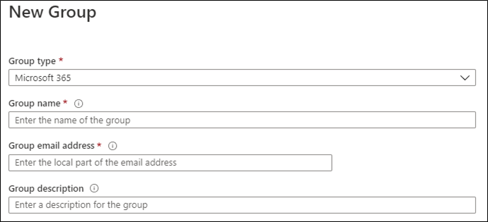

# Vanliga principer för identitets- och enhetsåtkomstCommon identity and device access policies

I den här artikeln beskrivs vanliga rekommenderade principer för att skydda åtkomst till Microsoft 365-moln tjänster, inklusive lokala program som har publicerats med Azure Active Directory (Azure AD)-tillämpningsproxy.This article describes the common recommended policies for securing access to Microsoft 365 cloud services, including on-premises applications published with Azure Active Directory (Azure AD) Application Proxy.

Den här vägledningen handlar om hur du distribuerar rekommenderade principer i en nyligen etablerad miljö.This guidance discusses how to deploy the recommended policies in a newly-provisioned environment. Genom att konfigurera dessa principer i en särskild laboratorie miljö kan du förstå och utvärdera rekommenderade principer innan du förbereder introduktionen till din produkt miljö.Setting up these policies in a separate lab environment allows you to understand and evaluate the recommended policies before staging the rollout to your preproduction and production environments. Den nyligen etablerade miljön kan endast vara moln-eller hybrid för att återspegla dina behov.Your newly provisioned environment can be cloud-only or hybrid to reflect your evaluation needs.

## Princip uppsättningPolicy set

Följande diagram illustrerar den rekommenderade uppsättningen principer.The following diagram illustrates the recommended set of policies. Det visar vilken skydds nivå varje princip gäller för och om policyn gäller för datorer eller telefoner och surfplattor, eller båda enhets kategorierna.It shows which tier of protections each policy applies to and whether the policies apply to PCs or phones and tablets, or both categories of devices. Det visar också var du konfigurerar dessa principer.It also indicates where you configure these policies.

[Visa en större version av bildenSee a larger version of this image](https://github.com/MicrosoftDocs/microsoft-365-docs/raw/public/microsoft-365/media/microsoft-365-policies-configurations/Identity_device_access_policies_byplan.png)

Här är en ensidig PDF-sammanfattning med länkar till enskilda principer:Here's a one-page PDF summary with links to the individual policies:

   [Visa som en PDF-fil](../../downloads/MSFT-cloud-architecture-identity-device-protection-handout.pdf) \| [Ladda ned som PDF](https://github.com/MicrosoftDocs/microsoft-365-docs/raw/public/microsoft-365/downloads/MSFT-cloud-architecture-identity-device-protection-handout.pdf)[View as a PDF](../../downloads/MSFT-cloud-architecture-identity-device-protection-handout.pdf) \| [Download as a PDF](https://github.com/MicrosoftDocs/microsoft-365-docs/raw/public/microsoft-365/downloads/MSFT-cloud-architecture-identity-device-protection-handout.pdf)

I resten av den här artikeln beskrivs hur du konfigurerar dessa principer.The rest of this article describes how to configure these policies.

> [!NOTE]
> Att kräva att multifaktorautentisering används (MFA) rekommenderas innan de registrerar enheter i Intune för att kontrol lera att enheten är avsedd för den avsedda användaren.Requiring the use of multi-factor authentication (MFA) is recommended before enrolling devices in Intune to assure that the device is in the possession of the intended user. Du måste registrera enheter i Intune innan du kan tvinga fram principer för enhetskompatibilitet.You must enroll devices in Intune before you can enforce device compliance policies.

För att ge dig tid att utföra dessa uppgifter rekommenderar vi att du implementerar rikt linjerna i den ordning som anges i tabellen.To give you time to accomplish these tasks, we recommend implementing the baseline policies in the order listed in this table. MFA-principerna för känslig och högreglerade skydds nivåer kan implementeras när som helst.However, the MFA policies for sensitive and highly regulated levels of protection can be implemented at any time.

|Skydds nivåProtection level|PrincipernaPolicies|Mer informationMore information|
|---|---|---|
|**Grundläggande****Baseline**|[Kräv MFA när en inloggnings risk är *mellan* eller *hög*Require MFA when sign-in risk is *medium* or *high*](#require-mfa-based-on-sign-in-risk)||
||[Blockera klienter som inte har stöd för modern autentiseringBlock clients that don't support modern authentication](#block-clients-that-dont-support-modern-authentication)|Klienter som inte använder modern lösenordsautentisering kan kringgå principer för villkorsstyrd åtkomst, så det är viktigt att blockera dessa.Clients that do not use modern authentication can bypass Conditional Access policies, so it's important to block these.|
||[Användare med hög risk måste byta lösenordHigh risk users must change password](#high-risk-users-must-change-password)|Tvingar användare att ändra sitt lösen ord när de loggar in om en högrisk aktivitet identifieras för sitt konto.Forces users to change their password when signing in if high-risk activity is detected for their account.|
||[Tillämpa program data skydds policyApply app data protection policies](#apply-app-data-protection-policies)|En Intune program skydds policy per plattform (Windows, iOS/iPad, Android).One Intune App Protection policy per platform (Windows, iOS/iPadOS, Android).|
||[Kräv godkända appar och program skyddRequire approved apps and app protection](#require-approved-apps-and-app-protection)|Aktiverar dataexekveringsskydd för telefoner och surfplattor med iOS, iPad eller Android.Enforces mobile app protection for phones and tablets using iOS, iPadOS, or Android.|
||[Definiera principer för efterlevnadsprinciperDefine device compliance policies](#define-device-compliance-policies)|En princip för varje plattform.One policy for each platform.|
||[Kräv kompatibla PC-datorerRequire compliant PCs](#require-compliant-pcs-but-not-compliant-phones-and-tablets)|Framtvingar Intune-hantering av datorer med Windows eller MacOS.Enforces Intune management of PCs using Windows or MacOS.|
|**Känslig****Sensitive**|[Kräv MFA när en inloggnings risk är *låg*, *medel* eller *hög*Require MFA when sign-in risk is *low*, *medium*, or *high*](#require-mfa-based-on-sign-in-risk)||
||[Kräv kompatibla datorer *och* mobila enheterRequire compliant PCs *and* mobile devices](#require-compliant-pcs-and-mobile-devices)|Framtvingar Intune-hantering för båda datorerna (Windows eller MacOS) och telefoner eller surfplattor (iOS, iPad eller Android).Enforces Intune management for both PCs (Windows or MacOS) and phones or tablets (iOS, iPadOS, or Android).|
|**Strikt reglerad****Highly regulated**|[Kräv *alltid* MFA*Always* require MFA](#require-mfa-based-on-sign-in-risk)|
|

## Tilldela principer till grupper och användareAssigning policies to groups and users

Innan du konfigurerar principer ska du identifiera de Azure AD-grupper du använder för varje skydds nivå.Before configuring policies, identify the Azure AD groups you are using for each tier of protection. Bas linje skydd gäller normalt för alla i organisationen.Typically, baseline protection applies to everybody in the organization. En användare som ingår i både bas linje och känsligt skydd får alla rikt linjer som tillämpas samt känsliga principer.A user who is included for both baseline and sensitive protection will have all the baseline policies applied plus the sensitive policies. Skyddet är kumulativt och den mest restriktiva principen tillämpas.Protection is cumulative and the most restrictive policy is enforced.

Ett rekommenderat tillvägagångs sätt är att skapa en Azure AD-grupp för undantag för villkorlig åtkomst.A recommended practice is to create an Azure AD group for Conditional Access exclusion. Lägg till den här gruppen i alla principer för villkorsstyrd åtkomst i området **exkludera** för **användare och grupper** i avsnittet **uppgifter** .Add this group to all of your Conditional Access policies in the **Exclude** value of the **Users and groups** setting in the **Assignments** section. Det gör att du kan ge åtkomst till en användare när du felsöker åtkomst problem.This gives you a method to provide access to a user while you troubleshoot access issues. Detta rekommenderas endast som en tillfällig lösning.This is recommended as a temporary solution only. Övervaka den här gruppen för ändringar och kontrol lera att exkluderings gruppen bara används som avsett.Monitor this group for changes and be sure the exclusion group is being used only as intended.

Här är ett exempel på grupp tilldelning och undantag för MFA.Here's an example of group assignment and exclusions for requiring MFA.

Här är resultatet:Here are the results:

- Alla användare måste använda MFA när inloggnings risken är medel eller hög.All users are required to use MFA when the sign-in risk is medium or high.

- Medlemmar i gruppen exekutiv personal måste använda MFA när inloggnings risken är låg, medel eller hög.Members of the Executive Staff group are required to use MFA when the sign-in risk is low, medium, or high.

  I det här fallet matchar medlemmar i gruppen exekutiva personer både principer för bas linje och villkorsstyrd åtkomst.In this case, members of the Executive Staff group match both the baseline and sensitive Conditional Access policies. Åtkomst kontrollerna för båda principer är kombinerade, vilka i det här fallet är likvärdigt med den känsliga principen för villkorsstyrd åtkomst.The access controls for both policies are combined, which in this case is equivalent to the sensitive Conditional Access policy.

- Medlemmar i den Top Secret-projekt X-gruppen måste alltid använda MFAMembers of the Top Secret Project X group are always required to use MFA

  I det här fallet matchar medlemmar i den Top Secreta projekt X-gruppen både bas linje och villkorsstyrd åtkomst policy som är starkt reglerad.In this case, members of the Top Secret Project X group match both the baseline and highly-regulated Conditional Access policies. Åtkomst kontrollerna för båda principer kombineras.The access controls for both policies are combined. Eftersom åtkomst kontrollen för den högreglerade principen för villkorsstyrd åtkomst är mer restriktiv används den.Because the access control for the highly-regulated Conditional Access policy is more restrictive, it is used.

Var försiktig när du tillämpar högre skydds nivåer för grupper och användare.Be careful when applying higher levels of protection to groups and users. Till exempel måste du använda MFA varje gång de loggar in, även om de inte arbetar med det starkt reglerade innehållet i Project X.For example, members of the Top Secret Project X group will be required to use MFA every time they sign in, even if they are not working on the highly-regulated content for Project X.

Alla Azure AD-grupper som skapas som en del av dessa rekommendationer måste skapas som Microsoft 365-grupper.All Azure AD groups created as part of these recommendations must be created as Microsoft 365 groups. Det här är viktigt för att du ska kunna distribuera känslighets etiketter när du skyddar dokument i Microsoft Teams och SharePoint.This is important for the deployment of sensitivity labels when securing documents in Microsoft Teams and SharePoint.

## Kräv MFA baserat på inloggnings riskerRequire MFA based on sign-in risk

Du bör ha användarna registrerade för MFA innan de behöver använda det.You should have your users register for MFA prior to requiring its use. Om du har Microsoft 365 E5, Microsoft 365 E3 med identitets & hot Protection-tillägg, Office 365 med EMS, eller de enskilda Azure AD Premium P2-licenserna, kan du använda principen för MFA-registrering med Azure AD-skyddsagenten för att kräva att användare registrerar MFA.If you have Microsoft 365 E5, Microsoft 365 E3 with the Identity & Threat Protection add-on, Office 365 with EMS E5, or individual Azure AD Premium P2 licenses, you can use the MFA registration policy with Azure AD Identity Protection to require that users register for MFA. För [kravet på arbete](identity-access-prerequisites.md) ingår att registrera alla användare med MFA.The [prerequisite work](identity-access-prerequisites.md) includes registering all users with MFA.

När användarna är registrerade kan du kräva MFA för att logga in med en ny princip för villkorsstyrd åtkomst.After your users are registered, you can require MFA for sign-in with a new Conditional Access policy.

1. Gå till [Azure-portalen](https://portal.azure.com)och logga in med dina inloggnings uppgifter.Go to the [Azure portal](https://portal.azure.com), and sign in with your credentials.
2. I listan med Azure-tjänster väljer du **Azure Active Directory**.In the list of Azure services, choose **Azure Active Directory**.
3. Välj **säkerhet** i listan **Hantera** och välj sedan **villkorlig åtkomst**.In the **Manage** list, choose **Security**, and then choose **Conditional Access**.
4. Välj **ny princip** och ange den nya Principens namn.Choose **New policy** and type the new policy's name.

I följande tabell beskrivs princip inställningarna för villkorsstyrd åtkomst för att kräva MFA baserat på inloggnings risker.The following tables describes the Conditional Access policy settings to require MFA based on sign-in risk.

I avsnittet **uppgifter** :In the **Assignments** section:

|InställningSetting|FjärråtkomstsegenskaperProperties|VärdenValues|KommentarerNotes|
|---|---|---|---|
|Användare och grupperUsers and groups|InkluderaInclude|**Välj användare och grupper > användare och grupper**: Välj specifika grupper som innehåller riktade användar konton.**Select users and groups > Users and groups**:  Select specific groups containing targeted user accounts.|Börja med gruppen som innehåller pilot användar konton.Start with the group that includes pilot user accounts.|
||TaExclude|**Användare och grupper**: Välj en undantags grupp för villkorlig åtkomst. tjänst konton (program identiteter).**Users and groups**: Select your Conditional Access exception group; service accounts (app identities).|Medlemskapet bör ändras efter behov.Membership should be modified on an as-needed, temporary basis.|
|Moln program eller-åtgärderCloud apps or actions|**> moln program inkluderar****Cloud apps > Include**|**Välj appar**: Välj de program du vill att den här policyn ska tillämpas på.**Select apps**: Select the apps you want this policy to apply to. Välj till exempel Exchange Online.For example, select Exchange Online.||
|SituationerConditions|||Konfigurera villkor som är specifika för din miljö och dina behov.Configure conditions that are specific to your environment and needs.|
||Inloggnings riskerSign-in risk||Se anvisningarna i följande tabell.See the guidance in the following table.|
|

### Inställningar för problem med inloggnings riskSign-in risk condition settings

Tillämpa inställningarna på risk nivå baserat på den skydds nivå du är riktad mot.Apply the risk level settings based on the protection level you are targeting.

|Skydds nivåLevel of protection|Risk nivå värden som behövsRisk level values needed|ÅtgärdAction|
|---|---|---|
|GrundläggandeBaseline|Hög, mediumHigh, medium|Markera båda.Check both.|
|KänsligSensitive|Hög, medium, lågtHigh, medium, low|Markera alla tre.Check all three.|
|Strikt regleradHighly regulated||Låt alla alternativ vara avmarkerade om du alltid vill använda MFA.Leave all options unchecked to always enforce MFA.|
|

I avsnittet **Access Controls** :In the **Access controls** section:

|InställningSetting|FjärråtkomstsegenskaperProperties|VärdenValues|ÅtgärdAction|
|---|---|---|---|
|TilldelasGrant|**Grant access****Grant access**||AnvändaSelect|
|||**Kräv multifaktorautentisering****Require Multi-factor authentication**|CheckCheck|
||**Kräv alla markerade kontroller****Require all the selected controls**||AnvändaSelect|
|

Välj **Välj** för att spara inställningen för **beviljande** .Choose **Select** to save the **Grant** settings.

**Välj slutligen för** **att aktivera principer** och välj sedan **skapa**.Finally, select **On** for **Enable policy**, and then choose **Create**.

Överväg [också att använda verktyget för](https://docs.microsoft.com/azure/active-directory/active-directory-conditional-access-whatif) att testa policyn.Also consider using the [What if](https://docs.microsoft.com/azure/active-directory/active-directory-conditional-access-whatif) tool to test the policy.

## Blockera klienter som inte har stöd för modern autentiseringBlock clients that don't support modern authentication

Använd inställningarna i de här tabellerna för en princip för villkorsstyrd åtkomst för att blockera klienter som inte stöder modern.Use the settings in these tables for a Conditional Access policy to block clients that don't support modern authentication.

I [den här artikeln](../../enterprise/microsoft-365-client-support-modern-authentication.md) finns en lista med klienter i Microsoft 365 som gör suppport modern.See [this article](../../enterprise/microsoft-365-client-support-modern-authentication.md) for a list of clients in Microsoft 365 that do suppport modern authentication.

I avsnittet **uppgifter** :In the **Assignments** section:

|InställningSetting|FjärråtkomstsegenskaperProperties|VärdenValues|KommentarerNotes|
|---|---|---|---|
|Användare och grupperUsers and groups|InkluderaInclude|**Välj användare och grupper > användare och grupper**: Välj specifika grupper som innehåller riktade användar konton.**Select users and groups > Users and groups**:  Select specific groups containing targeted user accounts.|Börja med gruppen som innehåller pilot användar konton.Start with the group that includes pilot user accounts.|
||TaExclude|**Användare och grupper**: Välj en undantags grupp för villkorlig åtkomst. tjänst konton (program identiteter).**Users and groups**: Select your Conditional Access exception group; service accounts (app identities).|Medlemskapet bör ändras efter behov.Membership should be modified on an as-needed, temporary basis.|
|Moln program eller-åtgärderCloud apps or actions|**> moln program inkluderar****Cloud apps > Include**|**Välj appar**: Välj de program som motsvarar klienterna som inte stöder modern lösenordsautentisering.**Select apps**: Select the apps corresponding to the clients that do not support modern authentication.||
|SituationerConditions|**Klient program****Client apps**|Välj **Ja** för att **Konfigurera**Choose **Yes** for **Configure** 
 Avmarkera kryss markeringar för **webbläsare** och **mobilappar och Station ära klienter**Clear the check marks for **Browser** and **Mobile apps and desktop clients**||
|

I avsnittet **Access Controls** :In the **Access controls** section:

|InställningSetting|FjärråtkomstsegenskaperProperties|VärdenValues|ÅtgärdAction|
|---|---|---|---|
|TilldelasGrant|**Blockera åtkomst****Block access**||AnvändaSelect|
||**Kräv alla markerade kontroller****Require all the selected controls**||AnvändaSelect|
|

Välj **Välj** för att spara inställningen för **beviljande** .Choose **Select** to save the **Grant** settings.

**Välj slutligen för** **att aktivera principer** och välj sedan **skapa**.Finally, select **On** for **Enable policy**, and then choose **Create**.

Överväg att använda [verktyget för att testa](https://docs.microsoft.com/azure/active-directory/active-directory-conditional-access-whatif) policyn.Consider using the [What if](https://docs.microsoft.com/azure/active-directory/active-directory-conditional-access-whatif) tool to test the policy.

För Exchange Online kan du använda autentiseringsprinciper för att [Inaktivera grundläggande](https://docs.microsoft.com/exchange/clients-and-mobile-in-exchange-online/disable-basic-authentication-in-exchange-online)åtkomst, vilket tvingar alla klient åtkomst förfrågningar att använda modern verifikation.For Exchange Online, you can use authentication policies to [disable Basic authentication](https://docs.microsoft.com/exchange/clients-and-mobile-in-exchange-online/disable-basic-authentication-in-exchange-online), which forces all client access requests to use modern authentication.

## Användare med hög risk måste byta lösenordHigh risk users must change password

För att säkerställa att alla högrisk användares komprometterade konton tvingas göra en ändring av lösen ord när de loggar in måste du tillämpa följande policy.To ensure that all high-risk users' compromised accounts are forced to perform a password change when signing-in, you must apply the following policy.

Logga in på [Microsoft Azure-portalen ( https://portal.azure.com)](https://portal.azure.com/) med administratörs uppgifterna och navigera sedan till **Azure AD Identity Protection > User risk policy**.Log in to the [Microsoft Azure portal (https://portal.azure.com)](https://portal.azure.com/) with your administrator credentials, and then navigate to **Azure AD Identity Protection > User Risk Policy**.

I avsnittet **uppgifter** :In the **Assignments** section:

|Type (Typ)Type|FjärråtkomstsegenskaperProperties|VärdenValues|ÅtgärdAction|
|---|---|---|---|
|AnvändareUsers|InkluderaInclude|**Alla användare****All users**|AnvändaSelect|
|Risk för användareUser risk|**Högsta****High**||AnvändaSelect|
|

I avsnittet andra **uppgifter** :In the second **Assignments** section:

|Type (Typ)Type|FjärråtkomstsegenskaperProperties|VärdenValues|ÅtgärdAction|
|---|---|---|---|
|ÅtkomstAccess|**Tillåt åtkomst****Allow access**||AnvändaSelect|
|||**Kräv lösen ords ändring****Require password change**|CheckCheck|
|

Välj **klar** för att spara **åtkomst** inställningar.Choose **Done** to save the **Access** settings.

Välj slutligen **på** för att **påtvinga policy** och välj sedan **Spara**.Finally, select **On** for **Enforce policy**, and then choose **Save**.

Överväg att använda [verktyget för att testa](https://docs.microsoft.com/azure/active-directory/active-directory-conditional-access-whatif) policyn.Consider using the [What if](https://docs.microsoft.com/azure/active-directory/active-directory-conditional-access-whatif) tool to test the policy.

Använd den här principen tillsammans med [konfiguration av lösen ords skydd i Azure AD](https://docs.microsoft.com/azure/active-directory/authentication/concept-password-ban-bad)som identifierar och blockerar kända svaga lösen ord och deras varianter och ytterligare svaga termer som är specifika för din organisation.Use this policy in conjunction with [Configure Azure AD password protection](https://docs.microsoft.com/azure/active-directory/authentication/concept-password-ban-bad), which detects and blocks known weak passwords and their variants and additional weak terms that are specific to your organization. Genom att använda lösen ords skydd för Azure AD ser du till att ändrade lösen ord är starka.Using Azure AD password protection ensures that changed passwords are strong ones.

## Tillämpa program data skydds policyApply APP data protection policies

App Protection policies (APP) definierar vilka appar som tillåts och vilka åtgärder de kan utföra med din organisations data.App Protection Policies (APP) define which apps are allowed and the actions they can take with your organization's data. De val som är tillgängliga i appen gör det möjligt för organisationer att skräddarsy skyddet mot deras specifika behov.The choices available in APP enable organizations to tailor the protection to their specific needs. I vissa fall är det kanske inte uppenbart vilka princip inställningar som krävs för att implementera ett fullständigt scenario.For some, it may not be obvious which policy settings are required to implement a complete scenario. För att hjälpa organisationer att prioritera en mobil klient Bryt punkts härdning har Microsoft infört taxonomi för programmets data skydds ramverk för iOS-och Android-mobilappar.To help organizations prioritize mobile client endpoint hardening, Microsoft has introduced taxonomy for its APP data protection framework for iOS and Android mobile app management.

PROGRAM data skydds ramverket är uppdelat i tre olika konfigurations nivåer, med varje nivå som bygger på föregående nivå:The APP data protection framework is organized into three distinct configuration levels, with each level building off the previous level:

- **Företags grundläggande data skydd** (nivå 1) säkerställer att appar skyddas med en PIN-kod och krypterad och utför selektiv rensning.**Enterprise basic data protection** (Level 1) ensures that apps are protected with a PIN and encrypted and performs selective wipe operations. För Android-enheter verifierar den här nivån Android-enhetens attestering.For Android devices, this level validates Android device attestation. Det här är en inmatnings nivå konfiguration som ger en liknande data skydds kontroll i Exchange Online Mailbox-principer och introducerar den och användar populationen till program.This is an entry level configuration that provides similar data protection control in Exchange Online mailbox policies and introduces IT and the user population to APP.
- **Förbättrat data skydd för företag** (nivå 2) introducerar mekanismer för att förhindra program data läckage och minimi krav på operativ system.**Enterprise enhanced data protection** (Level 2) introduces APP data leakage prevention mechanisms and minimum OS requirements. Det här är den konfiguration som kan användas för de flesta mobila användare som vill komma åt arbets-eller skol data.This is the configuration that is applicable to most mobile users accessing work or school data.
- **Data skydd i företags kvalitet** (nivå 3) introducerar avancerade data skydds mekanismer, förbättrad PIN-konfiguration och försvar för mobil hot från appen.**Enterprise high data protection** (Level 3) introduces advanced data protection mechanisms, enhanced PIN configuration, and APP Mobile Threat Defense. Denna konfiguration är önskvärt för användare som har till gång till högrisk data.This configuration is desirable for users that are accessing high risk data.

Om du vill se de särskilda rekommendationerna för varje konfigurations nivå och de program som måste skyddas kan du granska [data skydds ramverket med hjälp av skydds principer för appar](https://docs.microsoft.com/mem/intune/apps/app-protection-framework).To see the specific recommendations for each configuration level and the minimum apps that must be protected, review [Data protection framework using app protection policies](https://docs.microsoft.com/mem/intune/apps/app-protection-framework).

Genom att använda de principer som beskrivs i [identitets-och enhets åtkomst](microsoft-365-policies-configurations.md)kan du följa de grundläggande inställningarna för data skydd i nivå 2.Using the principles outlined in [Identity and device access configurations](microsoft-365-policies-configurations.md), the Baseline and Sensitive protection tiers map closely with the Level 2 enterprise enhanced data protection settings. De data skydds nivåer som är starkt prioriterade är nära nivå 3-inställningar för data skydd i Enterprise.The Highly regulated protection tier maps closely to the Level 3 enterprise high data protection settings.

|Skydds nivåProtection level|Program skydds principApp Protection Policy|Mer informationMore information|
|---|---|---|
|GrundläggandeBaseline|[Nivå 2-förbättrat data skyddLevel 2 enhanced data protection](https://docs.microsoft.com/mem/intune/apps/app-protection-framework#level-2-enterprise-enhanced-data-protection)|De princip inställningar som tillämpas i nivå 2 inkluderar alla princip inställningar som rekommenderas för nivå 1 och lägger till eller uppdaterar princip inställningarna nedan för att implementera fler kontroller och en mer avancerad konfiguration än nivå 1.The policy settings enforced in level 2 include all the policy settings recommended for level 1 and only adds to or updates the below policy settings to implement more controls and a more sophisticated configuration than level 1.|
|KänsligSensitive|[Nivå 2-förbättrat data skyddLevel 2 enhanced data protection](https://docs.microsoft.com/mem/intune/apps/app-protection-framework#level-2-enterprise-enhanced-data-protection)|De princip inställningar som tillämpas i nivå 2 inkluderar alla princip inställningar som rekommenderas för nivå 1 och lägger till eller uppdaterar princip inställningarna nedan för att implementera fler kontroller och en mer avancerad konfiguration än nivå 1.The policy settings enforced in level 2 include all the policy settings recommended for level 1 and only adds to or updates the below policy settings to implement more controls and a more sophisticated configuration than level 1.|
|Säkerhets reglerHighly Regulated|[Nivå 3-skydda företags dataLevel 3 enterprise high data protection](https://docs.microsoft.com/mem/intune/apps/app-protection-framework#level-3-enterprise-high-data-protection)|De princip inställningar som tillämpas i nivå 3 inkluderar alla princip inställningar som rekommenderas för nivå 1 och 2 och lägger till eller uppdaterar de här princip inställningarna för att implementera fler kontroller och en mer avancerad konfiguration än nivå 2.The policy settings enforced in level 3 include all the policy settings recommended for level 1 and 2 and only adds to or updates the below policy settings to implement more controls and a more sophisticated configuration than level 2.|
|

Om du vill skapa en ny skydds princip för varje plattform (iOS och Android) i Microsoft slut punkts hanteraren med inställningarna för data skydds ramverk kan du:To create a new app protection policy for each platform (iOS and Android) within Microsoft Endpoint Manager using the data protection framework settings, you can:

1. Skapa principer manuellt genom att följa de steg som beskrivs [för att skapa och distribuera skydds principer för appar med Microsoft Intune](https://docs.microsoft.com/mem/intune/apps/app-protection-policies).Manually create the policies by following the steps in [How to create and deploy app protection policies with Microsoft Intune](https://docs.microsoft.com/mem/intune/apps/app-protection-policies).
2. Importera exempel på [princip konfigurations ramverket för Intune-appens skydd](https://github.com/microsoft/Intune-Config-Frameworks/tree/master/AppProtectionPolicies) med INTUNE-JSON- [skript](https://github.com/microsoftgraph/powershell-intune-samples).Import the sample [Intune App Protection Policy Configuration Framework JSON templates](https://github.com/microsoft/Intune-Config-Frameworks/tree/master/AppProtectionPolicies) with [Intune's PowerShell scripts](https://github.com/microsoftgraph/powershell-intune-samples).

## Kräv godkända appar och program skyddRequire approved apps and APP protection

För att påtvinga program skydds principer som du använde i Intune måste du skapa en princip för villkorsstyrd åtkomst för att Kräv godkända klient program och de villkor som ställts in i APPENs skydds principer.To enforce the APP protection policies you applied in Intune, you must create a Conditional Access policy to require approved client apps and the conditions set in the APP protection policies.

För att tvinga skydds principer för appar krävs en uppsättning principer som beskrivs i [Kräv program skydds princip för Cloud App Access med villkorlig åtkomst](https://docs.microsoft.com/azure/active-directory/conditional-access/app-protection-based-conditional-access).Enforcing APP protection policies requires a set of policies described in in [Require app protection policy for cloud app access with Conditional Access](https://docs.microsoft.com/azure/active-directory/conditional-access/app-protection-based-conditional-access). Dessa principer ingår i de rekommenderade uppsättningarna med identitets-och åtkomst principer.These policies are each included in this recommended set of identity and access configuration policies.

Om du vill skapa principen för villkorsstyrd åtkomst som kräver godkända appar och APP Protection följer du anvisningarna i "steg 1: Konfigurera en princip för villkorlig åtkomst för Azure AD för Microsoft 365" i [Scenario 1: Microsoft 365-appar kräver godkända appar med skydds principer för appar](https://docs.microsoft.com/azure/active-directory/conditional-access/app-protection-based-conditional-access#scenario-1-office-365-apps-require-approved-apps-with-app-protection-policies), som tillåter Outlook för iOS och Android, men blockerar OAuth-kompatibla Exchange ActiveSync-klienter från att ansluta till Exchange Online.To create the Conditional Access policy that requires approved apps and APP protection, follow "Step 1: Configure an Azure AD Conditional Access policy for Microsoft 365" in [Scenario 1: Microsoft 365 apps require approved apps with app protection policies](https://docs.microsoft.com/azure/active-directory/conditional-access/app-protection-based-conditional-access#scenario-1-office-365-apps-require-approved-apps-with-app-protection-policies), which allows Outlook for iOS and Android, but blocks OAuth capable Exchange ActiveSync clients from connecting to Exchange Online.

   > [!NOTE]
   > Den här principen gör att mobila användare kan komma åt alla Office-slutpunkter med hjälp av tillämpliga appar.This policy ensures mobile users can access all Office endpoints using the applicable apps.

Om du aktiverar mobil åtkomst till Exchange Online implementerar du [spärrar ActiveSync-klienter](secure-email-recommended-policies.md#block-activesync-clients)som hindrar Exchange ActiveSync-klienter att använda grundläggande åtkomst från anslutning till Exchange Online.If you are enabling mobile access to Exchange Online, implement [Block ActiveSync clients](secure-email-recommended-policies.md#block-activesync-clients), which prevents Exchange ActiveSync clients leveraging basic authentication from connecting to Exchange Online. Den här principen visas inte i bilden högst upp i den här artikeln.This policy is not pictured in the illustration at the top of this article. Det beskrivs och visas i [Policy rekommendationer för att skydda e-post](secure-email-recommended-policies.md).It is described and pictured in [Policy recommendations for securing email](secure-email-recommended-policies.md).

Om du vill skapa principen för villkorsstyrd åtkomst som kräver att iOS och Android används, följer du anvisningarna i "steg 2: Konfigurera en princip för villkorlig åtkomst för Azure AD för Microsoft 365" i [Scenario 2: webb läsar program kräver godkända appar med skydds principer](https://docs.microsoft.com/azure/active-directory/conditional-access/app-protection-based-conditional-access#scenario-2-browser-apps-require-approved-apps-with-app-protection-policies)för appar, vilka tillåter Edge för iOS och Android, men blockerar andra mobila enheter från att ansluta till Microsoft 365-slutpunkter.To create the Conditional Access policy that requires Edge for iOS and Android, follow "Step 2: Configure an Azure AD Conditional Access policy for Microsoft 365" in [Scenario 2: Browser apps require approved apps with app protection policies](https://docs.microsoft.com/azure/active-directory/conditional-access/app-protection-based-conditional-access#scenario-2-browser-apps-require-approved-apps-with-app-protection-policies), which allows Edge for iOS and Android, but blocks other mobile device web browsers from connecting to Microsoft 365 endpoints.

 Dessa principer använder kontrollen för [godkända klienter](https://docs.microsoft.com/azure/active-directory/conditional-access/concept-conditional-access-grant#require-approved-client-app) och kräver [program skydds princip](https://docs.microsoft.com/azure/active-directory/conditional-access/concept-conditional-access-grant#require-app-protection-policy).These policies leverage the grant controls [Require approved client app](https://docs.microsoft.com/azure/active-directory/conditional-access/concept-conditional-access-grant#require-approved-client-app) and [Require app protection policy](https://docs.microsoft.com/azure/active-directory/conditional-access/concept-conditional-access-grant#require-app-protection-policy).

Om du blockerar äldre klientautentisering för andra klient program på iOS-och Android-enheter säkerställer du att dessa klienter inte kan kringgå principer för villkorlig åtkomst.Finally, blocking legacy authentication for other client apps on iOS and Android devices ensures that these clients cannot bypass Conditional Access policies. Om du följer anvisningarna i den här artikeln har du redan konfigurerat [blockera klienter som inte stöder modern](#block-clients-that-dont-support-modern-authentication).If you're following the guidance in this article, you've already configured [Block clients that don't support modern authentication](#block-clients-that-dont-support-modern-authentication).

<!---
With Conditional Access, organizations can restrict access to approved (modern authentication capable) iOS and Android client apps with Intune app protection policies applied to them. Several Conditional Access policies are required, with each policy targeting all potential users. Details on creating these policies can be found in [Require app protection policy for cloud app access with Conditional Access](https://docs.microsoft.com/azure/active-directory/conditional-access/app-protection-based-conditional-access).

1. Follow "Step 1: Configure an Azure AD Conditional Access policy for Microsoft 365" in [Scenario 1: Microsoft 365 apps require approved apps with app protection policies](https://docs.microsoft.com/azure/active-directory/conditional-access/app-protection-based-conditional-access#scenario-1-office-365-apps-require-approved-apps-with-app-protection-policies), which allows Outlook for iOS and Android, but blocks OAuth capable Exchange ActiveSync clients from connecting to Exchange Online.

   > [!NOTE]
   > This policy ensures mobile users can access all Office endpoints using the applicable apps.

2. If enabling mobile access to Exchange Online, implement [Block ActiveSync clients](secure-email-recommended-policies.md#block-activesync-clients), which prevents Exchange ActiveSync clients leveraging basic authentication from connecting to Exchange Online.

   The above policies leverage the grant controls [Require approved client app](https://docs.microsoft.com/azure/active-directory/conditional-access/concept-conditional-access-grant#require-approved-client-app) and [Require app protection policy](https://docs.microsoft.com/azure/active-directory/conditional-access/concept-conditional-access-grant#require-app-protection-policy).

3. Disable legacy authentication for other client apps on iOS and Android devices. For more information, see [Block clients that don't support modern authentication](#block-clients-that-dont-support-modern-authentication).
-->

## Definiera principer för enhetskompatibilitetDefine device-compliance policies

Enhet – efterlevnadsprinciper definierar kraven som enheter måste uppfylla för att kunna identifieras som kompatibla.Device-compliance policies define the requirements that devices must meet to be determined as compliant. Du skapar principer för regelefterlevnad-enheter från administrations centret för Microsoft Endpoint Manager.You create Intune device compliance policies from within the Microsoft Endpoint Manager admin center.

Du måste skapa en princip för varje dator, telefon eller surfplatta:You must create a policy for each PC, phone, or tablet platform:

- Android-enhetens administratörAndroid device administrator
- Android EnterpriseAndroid Enterprise
- iOS/iPadiOS/iPadOS
- macOSmacOS
- Windows 8,1 och senareWindows 8.1 and later
- Windows 10 och senareWindows 10 and later

Om du vill skapa principer för efterlevnadsprinciper loggar du in i [administrations centret för Microsoft slut punkts hanteraren](https://endpoint.microsoft.com) med dina administratörs uppgifter och navigerar **sedan till principer** för principer för \> **efterlevnadsprinciper** \> .To create device compliance policies, log in to the [Microsoft Endpoint Manager Admin Center](https://endpoint.microsoft.com) with your administrator credentials, and then navigate to **Devices** \> **Compliance policies** \> **Policies**. Välj **Skapa princip**.Select **Create Policy**.

Om principer för enhetskompatibilitet ska distribueras måste de kopplas till användar grupper.For device compliance policies to be deployed, they must be assigned to user groups. Du tilldelar en policy när du har skapat och sparat den.You assign a policy after you create and save it. I Admin Center väljer du policy och sedan **uppgifter**.In the admin center, select the policy and then select **Assignments**. När du har valt de grupper som du vill ta emot principen för väljer du **Spara** för att spara grupp tilldelningen och distribuera policyn.After selecting the groups that you want to receive the policy, select **Save** to save that group assignment and deploy the policy.

Stegvisa instruktioner om hur du skapar efterlevnadsprinciper i Intune finns i [skapa en policy för efterlevnad i Microsoft Intune](https://docs.microsoft.com/mem/intune/protect/create-compliance-policy) i Intune-dokumentationen.For step-by-step guidance on creating compliance policies in Intune, see [Create a compliance policy in Microsoft Intune](https://docs.microsoft.com/mem/intune/protect/create-compliance-policy) in the Intune documentation.

### Rekommenderade inställningar för Windows 10 och senareRecommended settings for Windows 10 and later

Följande inställningar rekommenderas för datorer med Windows 10 och senare, enligt konfigurationen i **steg 2: inställningar för efterlevnad**, av processen för att skapa principer.The following settings are recommended for PCs running Windows 10 and later, as configured in **Step 2: Compliance settings**, of the policy creation process.

Information om **utvärderings regler för tjänsten för Hälsoattestering för Windows >** i den här tabellen.For **Device health > Windows Health Attestation Service evaluation rules**, see this table.

|FjärråtkomstsegenskaperProperties|ValueValue|ÅtgärdAction|
|---|---|---|
|Kräv BitLockerRequire BitLocker|NödvändigRequire|AnvändaSelect|
|Kräv säker start för att vara aktive rad på enhetenRequire Secure Boot to be enabled on the device|NödvändigRequire|AnvändaSelect|
|Kräv kod integritetRequire code integrity|NödvändigRequire|AnvändaSelect|
|

Ange lämpliga värden för operativ system versioner baserat på dina IT-och säkerhets principer för **enhets egenskaper**.For **Device properties**, specify appropriate values for operating system versions based on your IT and security policies.

För **Configuration Manager-efterlevnad** väljer du **Kräv**.For **Configuration Manager Compliance**, select **Require**.

Information om **säkerhet** finns i den här tabellen.For **System security**, see this table.

|Type (Typ)Type|FjärråtkomstsegenskaperProperties|ValueValue|ÅtgärdAction|
|---|---|---|---|
|LösenordPassword|Kräv lösen ord för att låsa upp mobila enheterRequire a password to unlock mobile devices|NödvändigRequire|AnvändaSelect|
||Enkla lösen ordSimple passwords|BlockeraBlock|AnvändaSelect|
||Lösen ords typPassword type|Enhetens standardDevice default|AnvändaSelect|
||Minsta längd på lösen ordMinimum password length|18.66|Type (Typ)Type|
||Maximalt antal minuter av inaktivitet innan lösen ord krävsMaximum minutes of inactivity before password is required|0,1515|Type (Typ)Type 
 Den här inställningen stöds för Android-versionerna 4,0 och senare eller KNOX 4,0 och senare.This setting is supported for Android versions 4.0 and above or KNOX 4.0 and above. För iOS-enheter stöds det för iOS 8,0 och senare.For iOS devices, it's supported for iOS 8.0 and above.|
||Lösen ordet upphör (dagar)Password expiration (days)|4141|Type (Typ)Type|
||Antal tidigare lösen ord för att förhindra åter användningNumber of previous passwords to prevent reuse|T55|Type (Typ)Type|
||Kräv lösen ord när enheten återgår från Idle-tillstånd (mobil och Holographic)Require password when device returns from idle state (Mobile and Holographic)|NödvändigRequire|Tillgängligt för Windows 10 och senareAvailable for Windows 10 and later|
|KrypteringEncryption|Kryptering av data lagring på enhetEncryption of data storage on device|NödvändigRequire|AnvändaSelect|
|Enhets säkerhetDevice Security|VäggFirewall|NödvändigRequire|AnvändaSelect|
||ViktigtAntivirus|NödvändigRequire|AnvändaSelect|
||AntispionprogramAntispyware|NödvändigRequire|AnvändaSelect 
 För den här inställningen krävs en antispionprograms lösning registrerade i Windows säkerhets Center.This setting requires an Anti-Spyware solution registered with Windows Security Center.|
|DefenderDefender|Microsoft Defender antimalwareMicrosoft Defender Antimalware|NödvändigRequire|AnvändaSelect|
||Microsoft Defender antimalware-versionMicrosoft Defender Antimalware minimum version||Type (Typ)Type 
 Stöds endast för Windows 10-skrivbordet.Only supported for Windows 10 desktop. Microsoft rekommenderar att versions nummer inte överstiger fem gånger från den senaste versionen.Microsoft recommends versions no more than five behind from the most recent version.|
||Microsoft Defender antimalware-signatur uppdateradMicrosoft Defender Antimalware signature up to date|NödvändigRequire|AnvändaSelect|
||Real tids skyddReal-time protection|NödvändigRequire|AnvändaSelect 
 Stöds endast för Windows 10-skrivbordetOnly supported for Windows 10 desktop|
|

#### Microsoft Defender för EndpointMicrosoft Defender for Endpoint

|Type (Typ)Type|FjärråtkomstsegenskaperProperties|ValueValue|ÅtgärdAction|
|---|---|---|---|
|Microsoft Defender för slut punkts reglerMicrosoft Defender for Endpoint rules|Kräv att enheten bevaras på eller under maskin risk poängenRequire the device to be at or under the machine-risk score|RiskMedium|AnvändaSelect|
|

## Kräv kompatibla datorer (men inte kompatibla telefoner och surfplattor)Require compliant PCs (but not compliant phones and tablets)

Innan du lägger till en princip för att kräva kompatibla datorer måste du registrera enheter för hantering i Intune.Before adding a policy to require compliant PCs, be sure to enroll devices for management into Intune. Om du använder multifaktorautentisering rekommenderas innan du registrerar enheter i Intune för att garantera att enheten är avsedd för den avsedda användaren.Using multi-factor authentication is recommended before enrolling devices into Intune for assurance that the device is in the possession of the intended user.

Så här kräver du kompatibla datorer:To require compliant PCs:

1. Gå till [Azure-portalen](https://portal.azure.com)och logga in med dina inloggnings uppgifter.Go to the [Azure portal](https://portal.azure.com), and sign in with your credentials.
2. I listan med Azure-tjänster väljer du **Azure Active Directory**.In the list of Azure services, choose **Azure Active Directory**.
3. Välj **säkerhet** i listan **Hantera** och välj sedan **villkorlig åtkomst**.In the **Manage** list, choose **Security**, and then choose **Conditional Access**.
4. Välj **ny princip** och ange den nya Principens namn.Choose **New policy** and type the new policy's name.

5. Under **uppgifter** väljer du **användare och grupper** och inkluderar vem du vill att principen ska gälla för.Under **Assignments**, choose **Users and groups** and include who you want the policy to apply to. Uteslut också din undantags grupp för villkorsstyrd åtkomst.Also exclude your Conditional Access exclusion group.

6. Välj **molnappar eller åtgärder** under **uppgifter**.Under **Assignments**, choose **Cloud apps or actions**.

7. Om du vill **Inkludera** väljer du **Välj program > väljer** och väljer sedan önskade appar i listan med **moln program** .For **Include**, choose **Select apps > Select**, and then select the desired apps from the **Cloud apps** list. Välj till exempel Exchange Online.For example, select Exchange Online. Välj **Välj** när du är klar.Choose **Select** when done.

8. För att kräva kompatibla datorer (men inte kompatibla telefoner och surfplattor) väljer du **villkor > enhets plattformar** under **uppgifter**.To require compliant PCs (but not compliant phones and tablets), under **Assignments**, choose **Conditions > Device platforms**. Välj **Ja** för att **Konfigurera**.Select **Yes** for **Configure**. Välj  **Välj maskinvaruplattformar**, Välj **Windows** och **MacOS** och välj sedan **klar**.Choose  **Select device platforms**, select **Windows** and **macOS**, and then choose **Done**.

9. Välj **Tillåt** under **åtkomst kontroller**.Under **Access controls**, choose **Grant** .

10. Välj **bevilja åtkomst** och kontrol lera **att kryss rutan Kräv enhet är markerad som kompatibel**.Choose **Grant access** and then check **Require device to be marked as compliant**. För flera kontroller väljer du **Kräv alla markerade kontroller**.For multiple controls, select **Require all the selected controls**. Välj **Markera** när du är klar.When complete, choose **Select**.

11. Välj **på** för **Aktivera policy** och välj sedan **skapa**.Select **On** for **Enable policy**, and then choose **Create**.

> [!NOTE]
> Kontrol lera att enheten är kompatibel innan du aktiverar den här principen.Make sure that your device is compliant before enabling this policy. Annars kan du låsa upp och inte ändra denna princip förrän ditt användar konto har lagts till i gruppen uteslutning för villkorlig åtkomst.Otherwise, you could get locked out and will be unable to change this policy until your user account has been added to the Conditional Access exclusion group.

## Kräv kompatibla datorer *och* mobila enheterRequire compliant PCs *and* mobile devices

Så här kräver du efterlevnad för alla enheter:To require compliance for all devices:

1. Gå till [Azure-portalen](https://portal.azure.com)och logga in med dina inloggnings uppgifter.Go to the [Azure portal](https://portal.azure.com), and sign in with your credentials.
2. I listan med Azure-tjänster väljer du **Azure Active Directory**.In the list of Azure services, choose **Azure Active Directory**.
3. Välj **säkerhet** i listan **Hantera** och välj sedan **villkorlig åtkomst**.In the **Manage** list, choose **Security**, and then choose **Conditional Access**.
4. Välj **ny princip** och ange den nya Principens namn.Choose **New policy** and type the new policy's name.

5. Under **uppgifter** väljer du **användare och grupper** och inkluderar vem du vill att principen ska gälla för.Under **Assignments**, choose **Users and groups** and include who you want the policy to apply to. Uteslut också din undantags grupp för villkorsstyrd åtkomst.Also exclude your Conditional Access exclusion group.

6. Välj **molnappar eller åtgärder** under **uppgifter**.Under **Assignments**, choose **Cloud apps or actions**.

7. Om du vill **Inkludera** väljer du **Välj program > väljer** och väljer sedan önskade appar i listan med **moln program** .For **Include**, choose **Select apps > Select**, and then select the desired apps from the **Cloud apps** list. Välj till exempel Exchange Online.For example, select Exchange Online. Välj **Välj** när du är klar.Choose **Select** when done.

8. Välj **Tillåt** under **åtkomst kontroller**.Under **Access controls**, choose **Grant** .

9. Välj **bevilja åtkomst** och kontrol lera **att kryss rutan Kräv enhet är markerad som kompatibel**.Choose **Grant access** and then check **Require device to be marked as compliant**. För flera kontroller väljer du **Kräv alla markerade kontroller**.For multiple controls, select **Require all the selected controls**. Välj **Markera** när du är klar.When complete, choose **Select**.

10. Välj **på** för **Aktivera policy** och välj sedan **skapa**.Select **On** for **Enable policy**, and then choose **Create**.

> [!NOTE]
> Kontrol lera att enheten är kompatibel innan du aktiverar den här principen.Make sure that your device is compliant before enabling this policy. Annars kan du låsa upp och inte ändra denna princip förrän ditt användar konto har lagts till i gruppen uteslutning för villkorlig åtkomst.Otherwise, you could get locked out and will be unable to change this policy until your user account has been added to the Conditional Access exclusion group.

## Nästa stegNext step

[Läs mer om policy rekommendationer för gäst-och externa användareLearn about policy recommendations for guest and external users](identity-access-policies-guest-access.md)
