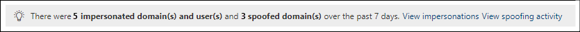

# Personifieringsinsikt i Defender för Office 365

[!INCLUDE [Microsoft 365 Defender rebranding](../includes/microsoft-defender-for-office.md)]

**Gäller för**
- [Microsoft Defender för Office 365 Abonnemang 1 och Abonnemang 2](defender-for-office-365.md)
- [Microsoft 365 Defender](../defender/microsoft-365-defender.md)

> [!NOTE]
> Funktionerna som beskrivs i den här artikeln är förhandsversioner, kan komma att ändras och är inte tillgängliga i alla organisationer.

Personifiering är när avsändaren av ett e-postmeddelande ser ut ungefär som en verklig eller förväntad e-postadress. Attacker är ofta användare som utger sig för att vara avsändarens e-postadresser i nätfiske eller andra typer av attacker i ett försök att få mottagarens förtroende. Det finns i stort sett två typer av personifiering:

- **Domänpersonifiering:** I lila@contoso.com utger sig den imiterade avsändarens e-postadress för att lila@ćóntoso.com.
- **Personifiering av användare:** I michelle@contoso.com utger sig den imiterade avsändarens e-postadress för att rnichell@contoso.com.

Domänpersonifiering skiljer sig från [domänförfalskning](anti-spoofing-protection.md), eftersom den imiterade domänen vanligtvis är en verklig, registrerad domän. Meddelanden från avsändare i den imiterade domänen kan och ofta utföra vanliga e-postautentiseringskontroller som annars skulle kunna identifiera förfalskningsförsök (SPF, DKIM och DMARC).

Personifieringsskydd är en del av de inställningar för skydd mot nätfiske som är exklusiva för Microsoft Defender för Office 365. Mer information om de här inställningarna finns [i Inställningar för personifiering i skydd mot nätfiske i Microsoft Defender för Office 365.](set-up-anti-phishing-policies.md#impersonation-settings-in-anti-phishing-policies-in-microsoft-defender-for-office-365)

Du kan använda identitetsinsikter i säkerhetscentret i Microsoft 365 för att snabbt identifiera meddelanden från imiterade avsändare eller avsändardomäner som du har konfigurerat för personifieringsskydd.

## Vad behöver jag veta innan jag börjar?

- Öppna Microsoft 365 Säkerhetscenter på <https://security.microsoft.com>. Om du vill gå direkt till personifieringsinsikten **på sidan Skydd mot nätfiske** använder du <https://security.microsoft.com/antiphishing> . Använd för att gå **direkt till sidan Personifieringsinsikter.** <https://security.microsoft.com/impersonationinsight>

- Du måste ha tilldelats behörigheter i säkerhetscentret innan du kan utföra procedurerna i den här artikeln:
  - **Organisationshantering**
  - **Säkerhetsadministratör**
  - **Säkerhetsläsare**
  - **Global läsare**

  Mer information finns i [Behörigheter i säkerhetscentret.](permissions-in-the-security-and-compliance-center.md)

  **Obs!** Om du lägger till användare till motsvarande Azure Active Directory-roll i administrationscentret för  Microsoft 365 får användarna de behörigheter som krävs i säkerhetscentret och behörigheter för andra funktioner i Microsoft 365. Mer information finns i [Om administratörsroller](../../admin/add-users/about-admin-roles.md).

- Du aktiverar och konfigurerar personifieringsskydd i skydd mot nätfiske i Microsoft Defender för Office 365. Personifieringsskydd är inte aktiverat som standard. Mer information finns i Konfigurera [principer för skydd mot nätfiske i Microsoft Defender för Office 365.](configure-atp-anti-phishing-policies.md)

## Öppna personifieringsinsikten i säkerhetscentret

1. I säkerhetscentret går du till avsnittet & **för** & principer för skydd mot \> **nätfiske** i \>  \>  \> **säkerhetscentret.**

2. På sidan **Mot nätfiske** ser personifieringsinsikten ut så här:

   

   Insikten har två lägen:

    - **Insiktsläge:** Om personifieringsskydd är aktiverat och konfigurerat i principer mot nätfiske visar insikten antalet identifierade meddelanden från imiterade domäner och imiterade användare (avsändare) under de senaste sju dagarna. Det här är totalt alla identifierade imiterade avsändare från alla principer mot nätfiske.
    - Vad **händer** om-läge: Om personifieringsskydd inte har aktiverats och konfigurerats i någon  aktiv policy för skydd mot nätfiske visar insikten hur många meddelanden som har upptäckts av våra funktioner för personifieringsskydd under de senaste sju dagarna.

Om du vill visa information om personifieringsidentifieringarna klickar du på **Visa personifieringar** i personifieringsinsikten.

   > [!NOTE]
   > Mer information om förfalskningsinformation finns i [Förfalskningsinformation i EOP.](learn-about-spoof-intelligence.md)

## Visa information om meddelanden från avsändare i imiterade domäner

På sidan **Personifieringsinsikt** som  visas när du klickar på Visa personifieringar i personifieringsinsynen kontrollerar du att **fliken** Domäner är markerad. Fliken **Domäner** innehåller följande information:

- **Sender Domain**: Den personifierande domänen, som är den domän som användes för att skicka e-postmeddelandet.
- **Antal meddelanden:** Antalet meddelanden från att utge sig för att vara avsändare under de senaste 7 dagarna.
- **Personifieringstyp:** Det här värdet visar den identifierade platsen för personifieringen (till exempel **Domän i adress**).
- **Personifierade domäner:** Den imiterade domänen, som bör se ut ungefär som den domän som är konfigurerad för personifieringsskydd i nätfiskeprincipen.
- **Domäntyp:** Det här värdet **är Företagsdomän** för interna domäner **eller Egen domän** för egna domäner.
- **Princip:** Principen mot nätfiske som upptäckte den imiterade domänen.
- **Tillåtet att personifiera**: Något av följande värden:
  - **Ja:** Domänen har konfigurerats som betrodd domän (ett undantag för personifieringsskydd) i principen mot nätfiske. Meddelanden från avsändare i den imiterade domänen identifierades, men var tillåtna.
  - **Nej:** Domänen har konfigurerats för personifieringsskydd i principen mot nätfiske. Meddelanden från avsändare i den imiterade domänen identifierades och agerade utifrån åtgärden för imiterade domäner i principen mot nätfiske.

Du kan klicka på markerade kolumnrubriker för att sortera resultatet.

Om du vill filtrera resultaten kan du använda sökikonen Sök för att ange en kommaavgränsad lista   resultatet.

### Visa information om meddelanden från avsändare i imiterade domäner

På fliken **Domäner** på sidan **Personifieringsinsikt väljer** du en av de tillgängliga identifieringarna av personifiering. Den utfällingstext för information som visas innehåller följande information och funktioner:

- **Personifieringsprincip för val som ska ändras:** Välj den policy för skydd mot nätfiske som du vill ändra. Endast de domäner där den imiterade domänen definieras i principen är tillgängliga. I föregående sida ser du vilken princip som faktiskt var ansvarig för att identifiera den imiterade domänen (förmodligen baserat på mottagaren och prioriteten för principen).
- Lägg **till** i listan med tillåtna personifiering: Använd den här **växlingsknappen** för att lägga till eller ta bort avsändaren från betrodda avsändare och domäner (undantag för personifiering) för den skydd mot nätfiskeprincip som du har valt:
  - Om värdet **Tillåts personifiera** för den här posten **var Nej** är växlingsknappen inaktiverad. Om du vill undanta alla avsändare i den här domänen från utvärdering genom personifieringsskydd drar du reglaget till På:  . Domänen läggs till i listan **Betrodda domäner** i inställningarna för personifieringsskydd i principen mot nätfiske.
  - Om **värdet Tillåts personifiera** för den här posten **var Ja** är växlingsknappen på. Om du vill returnera alla avsändare i den här domänen till utvärdering med personifieringsskydd drar du reglaget till av:  . Domänen tas bort från listan **Betrodda domäner** i inställningarna för personifieringsskydd i principen mot nätfiske.
- Därför att vi inte kunde göra detta.
- Det här behöver du göra.
- En domänsammanfattning som visar den imiterade domänen.
- WhoIs data about the sender.
- En länk till att [öppna Hotutforskaren](threat-explorer.md) för att visa ytterligare information om avsändaren.
- Liknande meddelanden från samma avsändare som har levererats till organisationen.

## Visa information om meddelanden från imiterade avsändare

På sidan **Personifieringsinsikt** som  visas när du har klickat på Visa personifieringar i personifieringsinsynen klickar du på **fliken** Användare. Fliken **Användare** innehåller följande information:

- **Avsändare:** E-postadressen till den person som utger sig för att vara avsändare av e-postmeddelandet.
- **Antal meddelanden:** Antalet meddelanden från den personifierade avsändaren under de senaste 7 dagarna.
- **Personifieringstyp:** Det här värdet **är Användare i visningsnamn**.
- **Personifierade** användare: E-postadressen till den imiterade avsändaren, som bör se ut ungefär som den användare som är konfigurerad för personifieringsskydd i principen mot nätfiske.
- **Användartyp:** Det här värdet visar vilken typ av skydd som tillämpas (till exempel **Skyddad användare** eller **Postlådeintelligens).**
- **Princip:** Principen mot nätfiske som upptäckte den imiterade avsändaren.
- **Tillåtet att personifiera**: Något av följande värden:
  - **Ja:** Avsändaren har konfigurerats som betrodd användare (ett undantag för personifieringsskydd) i principen mot nätfiske. Meddelanden från den imiterade avsändaren identifierades men var tillåtna.
  - **Nej:** Avsändaren har konfigurerats för personifieringsskydd i principen mot nätfiske. Meddelanden från den imiterade avsändaren identifierades och agerade utifrån åtgärden för imiterade användare i principen mot nätfiske.

Du kan klicka på markerade kolumnrubriker för att sortera resultatet.

Om du vill filtrera resultaten kan du använda **rutan Filtrera avsändare** för att ange en kommaavgränsad lista med värden för att filtrera resultatet.

### Visa information om meddelanden från imiterade avsändare

På fliken **Användare** på sidan **Personifieringsinsikt väljer** du en av de tillgängliga identifieringarna av personifiering. Den utfällingstext för information som visas innehåller följande information och funktioner:

- **Personifieringsprincip för val som ska ändras:** Välj den policy för skydd mot nätfiske som du vill ändra. Endast policyer där den imiterade avsändaren definieras i principen är tillgänglig. I föregående sida kan du se vilken princip som faktiskt var ansvarig för att identifiera den imiterade avsändaren (förmodligen baserat på mottagaren och prioriteten för principen).
- Lägg **till** i listan med tillåtna personifiering: Använd den här **växlingsknappen** för att lägga till eller ta bort avsändaren från betrodda avsändare och domäner (undantag för personifiering) för den skydd mot nätfiskeprincip som du har valt:
  - Om värdet **Tillåts personifiera** för den här posten **var Nej** är växlingsknappen inaktiverad. Om du vill undanta avsändaren från utvärdering genom personifieringsskydd drar du reglaget till på:  . Avsändaren läggs till i listan **Betrodda** användare i inställningarna för personifieringsskydd i principen mot nätfiske.
  - Om **värdet Tillåts personifiera** för den här posten **var Ja** är växlingsknappen på. Om du vill returnera avsändaren till utvärderingen genom personifieringsskydd drar du reglaget till av:  . Avsändaren tas bort från listan **Betrodda** användare i inställningarna för personifieringsskydd i principen mot nätfiske.
- Därför att vi inte kunde göra detta.
- Det här behöver du göra.
- En avsändarsammanfattning där den imiterade avsändaren listas.
- WhoIs data about the sender.
- En länk till att [öppna Hotutforskaren](threat-explorer.md) för att visa ytterligare information om avsändaren.
- Liknande meddelanden från samma avsändare som har levererats till organisationen.
