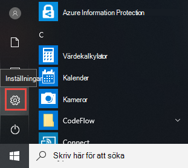
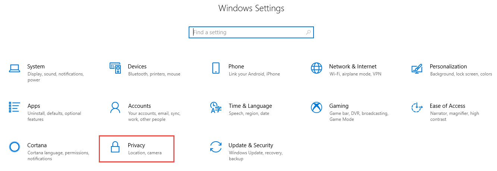
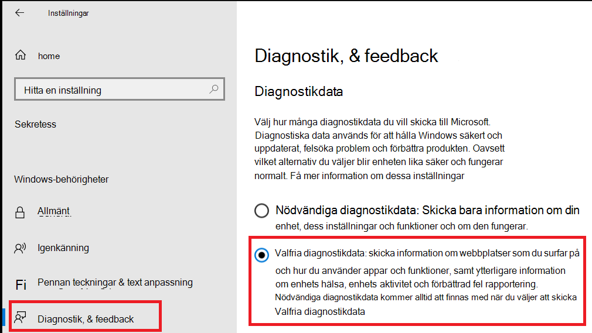
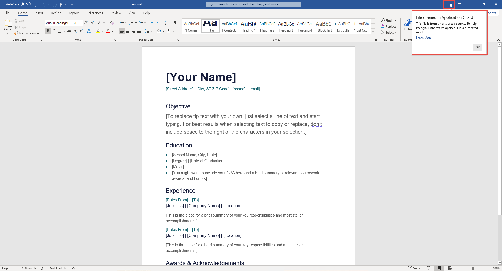

# <a name="application-guard-for-office-for-admins"></a><span data-ttu-id="efae8-105">Application Guard för Office för administratörer</span><span class="sxs-lookup"><span data-stu-id="efae8-105">Application Guard for Office for admins</span></span>

<span data-ttu-id="efae8-106">**Gäller för:** Word, Excel och PowerPoint för Microsoft 365, Windows 10 Enterprise</span><span class="sxs-lookup"><span data-stu-id="efae8-106">**Applies to:** Word, Excel, and PowerPoint for Microsoft 365, Windows 10 Enterprise</span></span>

<span data-ttu-id="efae8-107">Microsoft Defender Application Guard för Office (Application Guard för Office) hjälper till att förhindra att filer som inte är betrodda kommer åt betrodda resurser, vilket skyddar ditt företag från nya och nya attacker.</span><span class="sxs-lookup"><span data-stu-id="efae8-107">Microsoft Defender Application Guard for Office (Application Guard for Office) helps prevent untrusted files from accessing trusted resources, keeping your enterprise safe from new and emerging attacks.</span></span> <span data-ttu-id="efae8-108">Den här artikeln beskriver hur administratörer kan konfigurera enheter för en förhandsgranskning av Application Guard för Office.</span><span class="sxs-lookup"><span data-stu-id="efae8-108">This article walks admins through setting up devices for a preview of Application Guard for Office.</span></span> <span data-ttu-id="efae8-109">Den innehåller information om systemkrav och installationssteg för att aktivera Application Guard för Office på en enhet.</span><span class="sxs-lookup"><span data-stu-id="efae8-109">It provides information about system requirements and installation steps to enable Application Guard for Office on a device.</span></span>

## <a name="prerequisites"></a><span data-ttu-id="efae8-110">Förutsättningar</span><span class="sxs-lookup"><span data-stu-id="efae8-110">Prerequisites</span></span>

### <a name="minimum-hardware-requirements"></a><span data-ttu-id="efae8-111">Lägsta maskinvarukrav</span><span class="sxs-lookup"><span data-stu-id="efae8-111">Minimum hardware requirements</span></span>

* <span data-ttu-id="efae8-112">**CPU:** 64-bitars, 4 kärnor (fysiska eller virtuella), virtualiseringstillägg (Intel VT-x ELLER AMD-V), motsvarande Core i5 eller senare rekommenderas</span><span class="sxs-lookup"><span data-stu-id="efae8-112">**CPU**: 64-bit, 4 cores (physical or virtual), virtualization extensions   (Intel VT-x OR AMD-V), Core i5 equivalent or higher recommended</span></span>
* <span data-ttu-id="efae8-113">**Fysiskt** minne: 8 GB RAM-minne</span><span class="sxs-lookup"><span data-stu-id="efae8-113">**Physical memory**: 8-GB RAM</span></span>
* <span data-ttu-id="efae8-114">**Hårddisk:** 10 GB ledigt utrymme på systemenheten (SSD rekommenderas)</span><span class="sxs-lookup"><span data-stu-id="efae8-114">**Hard disk**: 10 GB of free space on the system drive (SSD recommended)</span></span>

### <a name="minimum-software-requirements"></a><span data-ttu-id="efae8-115">Lägsta programvarukrav</span><span class="sxs-lookup"><span data-stu-id="efae8-115">Minimum software requirements</span></span>

* <span data-ttu-id="efae8-116">**Windows 10**: Windows 10 Enterprise-versionen, klientversion 2004 (20H1) version 19041 eller senare</span><span class="sxs-lookup"><span data-stu-id="efae8-116">**Windows 10**: Windows 10 Enterprise edition, Client Build version 2004 (20H1) build 19041 or later</span></span>
* <span data-ttu-id="efae8-117">**Office:** Office Current Channel version 2011 16.0.13530.10000 eller senare.</span><span class="sxs-lookup"><span data-stu-id="efae8-117">**Office**: Office Current Channel Build version 2011 16.0.13530.10000 or later.</span></span> <span data-ttu-id="efae8-118">Både 32-bitars- och 64-bitarsversioner av Office stöds.</span><span class="sxs-lookup"><span data-stu-id="efae8-118">Both 32-bit and 64-bit versions of Office are supported.</span></span>
* <span data-ttu-id="efae8-119">**Uppdateringspaket:** Kumulativ månatlig säkerhetsuppdatering för Windows 10 [KB4571756](https://support.microsoft.com/help/4571756/windows-10-update-KB4571756)</span><span class="sxs-lookup"><span data-stu-id="efae8-119">**Update package**: Windows 10 cumulative monthly security update [KB4571756](https://support.microsoft.com/help/4571756/windows-10-update-KB4571756)</span></span>

<span data-ttu-id="efae8-120">Detaljerade systemkrav finns i [Systemkrav för Microsoft Defender Application Guard.](https://docs.microsoft.com/windows/security/threat-protection/microsoft-defender-application-guard/reqs-md-app-guard)</span><span class="sxs-lookup"><span data-stu-id="efae8-120">For detailed system requirements, refer to [System requirements for Microsoft Defender Application Guard](https://docs.microsoft.com/windows/security/threat-protection/microsoft-defender-application-guard/reqs-md-app-guard).</span></span> <span data-ttu-id="efae8-121">Mer information om Kanaler för Office-uppdateringar finns i [Översikt över uppdateringskanaler för Microsoft 365.](https://docs.microsoft.com/deployoffice/overview-update-channels)</span><span class="sxs-lookup"><span data-stu-id="efae8-121">To learn more about Office update channels, see [Overview of update channels for Microsoft 365](https://docs.microsoft.com/deployoffice/overview-update-channels).</span></span>

### <a name="licensing-requirements"></a><span data-ttu-id="efae8-122">Licenskrav</span><span class="sxs-lookup"><span data-stu-id="efae8-122">Licensing requirements</span></span>

* <span data-ttu-id="efae8-123">Microsoft 365 E5 eller Microsoft 365 E5 Security</span><span class="sxs-lookup"><span data-stu-id="efae8-123">Microsoft 365 E5 or Microsoft 365 E5 Security</span></span>

## <a name="deploy-application-guard-for-office"></a><span data-ttu-id="efae8-124">Distribuera Application Guard för Office</span><span class="sxs-lookup"><span data-stu-id="efae8-124">Deploy Application Guard for Office</span></span>

### <a name="enable-application-guard-for-office"></a><span data-ttu-id="efae8-125">Aktivera Application Guard för Office</span><span class="sxs-lookup"><span data-stu-id="efae8-125">Enable Application Guard for Office</span></span>

1. <span data-ttu-id="efae8-126">Ladda ned och installera **den kumulativa månatliga säkerhetsuppdateringen för Windows 10 KB4571756.**</span><span class="sxs-lookup"><span data-stu-id="efae8-126">Download and install **Windows 10 cumulative monthly security updates KB4571756**.</span></span>

2. <span data-ttu-id="efae8-127">Välj **Microsoft Defender Application Guard** under Windows-funktioner och välj **OK.**</span><span class="sxs-lookup"><span data-stu-id="efae8-127">Select **Microsoft Defender Application Guard** under Windows Features and  select **OK**.</span></span> <span data-ttu-id="efae8-128">När du aktiverar Application Guard-funktionen uppmanas du att starta om systemet.</span><span class="sxs-lookup"><span data-stu-id="efae8-128">Enabling the Application Guard feature will prompt a system reboot.</span></span> <span data-ttu-id="efae8-129">Du kan välja att starta om nu eller efter steg 3.</span><span class="sxs-lookup"><span data-stu-id="efae8-129">You can choose to reboot now or after step 3.</span></span>

   

   <span data-ttu-id="efae8-131">Funktionen kan också aktiveras genom att köra följande PowerShell-kommando som administratör:</span><span class="sxs-lookup"><span data-stu-id="efae8-131">The feature can also be enabled by running the following PowerShell command as administrator:</span></span>

   ```powershell
   Enable-WindowsOptionalFeature -online -FeatureName Windows-Defender-ApplicationGuard
   ```

3. <span data-ttu-id="efae8-132">Sök efter **Microsoft Defender Application Guard i hanterat läge,** en grupprincip i administrativa mallar för datorkonfiguration **\\ \\ Windows-komponenter \\ Microsoft Defender Application Guard.**</span><span class="sxs-lookup"><span data-stu-id="efae8-132">Search for **Microsoft Defender Application Guard in Managed Mode**, a group policy in **Computer Configuration\\Administrative Templates\\Windows Components\\Microsoft Defender Application Guard**.</span></span> <span data-ttu-id="efae8-133">Aktivera den här principen genom att ange värdet under Alternativ som **2** eller **3** och sedan välja **OK** eller **Använd.**</span><span class="sxs-lookup"><span data-stu-id="efae8-133">Turn on this policy by setting the value under Options as **2** or **3**, and then selecting **OK** or **Apply**.</span></span>

   

   <span data-ttu-id="efae8-135">I stället kan du ange motsvarande princip för CSP:</span><span class="sxs-lookup"><span data-stu-id="efae8-135">Instead, you can set the corresponding CSP policy:</span></span>

   > <span data-ttu-id="efae8-136">OMA-URI: **./Device/Vendor/MSFT/WindowsDefenderApplicationGuard/Settings/AllowWindowsDefenderApplicationGuard**</span><span class="sxs-lookup"><span data-stu-id="efae8-136">OMA-URI: **./Device/Vendor/MSFT/WindowsDefenderApplicationGuard/Settings/AllowWindowsDefenderApplicationGuard**</span></span> <br> <span data-ttu-id="efae8-137">Datatyp: **Heltal**</span><span class="sxs-lookup"><span data-stu-id="efae8-137">Data type: **Integer**</span></span> <br> <span data-ttu-id="efae8-138">Värde: **2**</span><span class="sxs-lookup"><span data-stu-id="efae8-138">Value: **2**</span></span>

4. <span data-ttu-id="efae8-139">Starta om systemet.</span><span class="sxs-lookup"><span data-stu-id="efae8-139">Restart the system.</span></span>

### <a name="set-diagnostics--feedback-to-send-full-data"></a><span data-ttu-id="efae8-140">Ställ in diagnostik & feedback för att skicka fullständiga data</span><span class="sxs-lookup"><span data-stu-id="efae8-140">Set Diagnostics & feedback to send full data</span></span>

<span data-ttu-id="efae8-141">Det här steget säkerställer att de data som behövs för att identifiera och åtgärda problem når Microsoft.</span><span class="sxs-lookup"><span data-stu-id="efae8-141">This step ensures that the data necessary to identify and fix problems is reaching Microsoft.</span></span> <span data-ttu-id="efae8-142">Följ anvisningarna för att aktivera diagnostik på din Windows-enhet:</span><span class="sxs-lookup"><span data-stu-id="efae8-142">Follow these steps to enable diagnostics on your Windows device:</span></span>

1. <span data-ttu-id="efae8-143">Öppna **Inställningar** på Start-menyn.</span><span class="sxs-lookup"><span data-stu-id="efae8-143">Open **Settings** from the Start menu.</span></span>

   

2. <span data-ttu-id="efae8-145">Välj **Sekretess i Windows-inställningar.** </span><span class="sxs-lookup"><span data-stu-id="efae8-145">On **Windows Settings**, select **Privacy**.</span></span>

   

3. <span data-ttu-id="efae8-147">Under Sekretess väljer du **Diagnostik & feedback och** väljer Valfri **diagnostikdata.**</span><span class="sxs-lookup"><span data-stu-id="efae8-147">Under Privacy, select **Diagnostics & feedback** and select **Optional diagnostic data**.</span></span>

   

<span data-ttu-id="efae8-149">Mer information om hur du konfigurerar Windows-diagnostikinställningar finns i [Konfigurera Windows-diagnostikdata i din organisation.](https://docs.microsoft.com/windows/privacy/configure-windows-diagnostic-data-in-your-organization#enterprise-management)</span><span class="sxs-lookup"><span data-stu-id="efae8-149">For more on configuring Windows diagnostic settings, refer to [Configuring Windows diagnostic data in your organization](https://docs.microsoft.com/windows/privacy/configure-windows-diagnostic-data-in-your-organization#enterprise-management).</span></span>

### <a name="confirm-that-application-guard-for-office-is-enabled-and-working"></a><span data-ttu-id="efae8-150">Bekräfta att Application Guard för Office är aktiverat och fungerar</span><span class="sxs-lookup"><span data-stu-id="efae8-150">Confirm that Application Guard for Office is enabled and working</span></span>

<span data-ttu-id="efae8-151">Innan du bekräftar att Application Guard för Office är aktiverat startar du Word, Excel eller PowerPoint på en enhet där principerna har distribuerats.</span><span class="sxs-lookup"><span data-stu-id="efae8-151">Before confirming that Application Guard for Office is enabled, launch Word, Excel, or PowerPoint on a device where the policies have been deployed.</span></span> <span data-ttu-id="efae8-152">Kontrollera att Office är aktiverat.</span><span class="sxs-lookup"><span data-stu-id="efae8-152">Make sure Office is activated.</span></span> <span data-ttu-id="efae8-153">Du kan behöva använda din arbetsidentitet för att aktivera Office-produkten först.</span><span class="sxs-lookup"><span data-stu-id="efae8-153">You may need to use your work identity to activate the Office product first.</span></span>

<span data-ttu-id="efae8-154">Bekräfta att Application Guard för Office är aktiverat genom att starta Word, Excel eller PowerPoint och sedan öppna ett dokument som inte är betrodd.</span><span class="sxs-lookup"><span data-stu-id="efae8-154">To confirm that Application Guard for Office is enabled, launch Word, Excel, or PowerPoint, and then open an untrusted document.</span></span> <span data-ttu-id="efae8-155">Du kan till exempel öppna ett dokument som har laddats ned från Internet eller en bifogad fil i ett e-postmeddelande från någon utanför organisationen.</span><span class="sxs-lookup"><span data-stu-id="efae8-155">For example, you can open a document that was downloaded from the internet or an email attachment from someone outside your organization.</span></span>

<span data-ttu-id="efae8-156">När du först öppnar en fil som inte är betrodd kan du se en Office-välkomstskärm som i följande exempel.</span><span class="sxs-lookup"><span data-stu-id="efae8-156">When you first open an untrusted file, you may see an Office splash screen like the following example.</span></span> <span data-ttu-id="efae8-157">Den kan visas ett tag medan Application Guard för Office aktiveras och filen öppnas.</span><span class="sxs-lookup"><span data-stu-id="efae8-157">It might be displayed for some time while Application Guard for Office is being activated and the file is being opened.</span></span> <span data-ttu-id="efae8-158">Senare öppningar av filer som inte är betrodda bör vara snabbare.</span><span class="sxs-lookup"><span data-stu-id="efae8-158">Subsequent openings of untrusted files should be faster.</span></span>


<span data-ttu-id="efae8-160">När filen öppnas bör den visa några visuella indikatorer på att filen öppnats i Application Guard för Office:</span><span class="sxs-lookup"><span data-stu-id="efae8-160">Upon being opened, the file should display a few visual indicators that the file was opened inside Application Guard for Office:</span></span>

* <span data-ttu-id="efae8-161">En bildtext i menyfliksområdet</span><span class="sxs-lookup"><span data-stu-id="efae8-161">A callout in the ribbon</span></span>

  

* <span data-ttu-id="efae8-163">Programikonen med en sköld i Aktivitetsfältet</span><span class="sxs-lookup"><span data-stu-id="efae8-163">The application icon with a shield in the taskbar</span></span>

  

## <a name="configure-application-guard-for-office"></a><span data-ttu-id="efae8-165">Konfigurera Application Guard för Office</span><span class="sxs-lookup"><span data-stu-id="efae8-165">Configure Application Guard for Office</span></span>

<span data-ttu-id="efae8-166">Office har stöd för följande principer för att du ska kunna konfigurera funktionerna i Application Guard för Office.</span><span class="sxs-lookup"><span data-stu-id="efae8-166">Office supports the following policies to enable you to configure the capabilities of Application Guard for Office.</span></span> <span data-ttu-id="efae8-167">Dessa principer kan konfigureras via grupprinciper eller office-molnprinciptjänsten.</span><span class="sxs-lookup"><span data-stu-id="efae8-167">These policies can be configured through Group policies or through the Office cloud policy service.</span></span>

> [!NOTE]
> <span data-ttu-id="efae8-168">Om du konfigurerar de här principerna kan vissa funktioner inaktiveras för filer som öppnas i Application Guard för Office.</span><span class="sxs-lookup"><span data-stu-id="efae8-168">Configuring these policies can disable some functionalities for files opened in Application Guard for Office.</span></span>

|<span data-ttu-id="efae8-169">Princip</span><span class="sxs-lookup"><span data-stu-id="efae8-169">Policy</span></span>|<span data-ttu-id="efae8-170">Beskrivning</span><span class="sxs-lookup"><span data-stu-id="efae8-170">Description</span></span>|
|---|---|
|<span data-ttu-id="efae8-171">Använd inte Application Guard för Office</span><span class="sxs-lookup"><span data-stu-id="efae8-171">Don't use Application Guard for Office</span></span>|<span data-ttu-id="efae8-172">Aktivering av den här principen tvingar Word, Excel och PowerPoint att använda den skyddade visningsisolering i stället för Application Guard för Office.</span><span class="sxs-lookup"><span data-stu-id="efae8-172">Enabling this policy will force Word, Excel, and PowerPoint to use the Protected View isolation container instead of Application Guard for Office.</span></span> <span data-ttu-id="efae8-173">Den här principen kan användas för att tillfälligt inaktivera Application Guard för Office när det är problem med att lämna det aktiverat för Microsoft Edge.</span><span class="sxs-lookup"><span data-stu-id="efae8-173">This policy can be used to temporarily disable Application Guard for Office when there are issues in leaving it enabled for Microsoft Edge.</span></span>|
|<span data-ttu-id="efae8-174">Konfigurera Application Guard för Office-behållaren i förväg</span><span class="sxs-lookup"><span data-stu-id="efae8-174">Configure Application Guard for Office container pre-creation</span></span>|<span data-ttu-id="efae8-175">Den här principen bestämmer om Application Guard för Office-behållaren, för att isolera icke betrodda filer, är förskapad för förbättrad körningsprestanda.</span><span class="sxs-lookup"><span data-stu-id="efae8-175">This policy determines if the Application Guard for Office container, for isolating untrusted files, is pre-created for improved run-time performance.</span></span> <span data-ttu-id="efae8-176">Om du aktiverar den här inställningen kan du ange antalet dagar för att fortsätta att skapa en behållare, eller låta den inbyggda heuristiska Office-pre-skapa behållaren.</span><span class="sxs-lookup"><span data-stu-id="efae8-176">If you enable this setting, you can specify the number of days to continue pre-creating a container or let the Office built-in heuristic pre-create the container.</span></span>
|<span data-ttu-id="efae8-177">Tillåt inte att Office-dokument öppnas i Application Guard för Office</span><span class="sxs-lookup"><span data-stu-id="efae8-177">Don't allow copy/paste for Office documents opened in Application Guard for Office</span></span>|<span data-ttu-id="efae8-178">Aktivering av den här principen förhindrar att en användare kopierar och klistrar in innehåll från ett dokument som öppnas i Application Guard för Office till ett dokument som öppnas utanför det.</span><span class="sxs-lookup"><span data-stu-id="efae8-178">Enabling this policy will prevent a user from copying and pasting content from a document opened in Application Guard for Office to a document opened outside of it.</span></span>|
|<span data-ttu-id="efae8-179">Inaktivera maskinvaruacceleration i Application Guard för Office</span><span class="sxs-lookup"><span data-stu-id="efae8-179">Disable hardware acceleration in Application Guard for Office</span></span>|<span data-ttu-id="efae8-180">Den här principen styr om Application Guard för Office använder maskinvaruacceleration för att återge grafik.</span><span class="sxs-lookup"><span data-stu-id="efae8-180">This policy controls whether Application Guard for Office uses hardware acceleration to render graphics.</span></span> <span data-ttu-id="efae8-181">Om du aktiverar den här inställningen använder Application Guard för Office programvarubaserad återgivning (CPU) och läser inte in några grafikdrivrutiner från tredje part eller interagerar med ansluten grafikmaskinvara.</span><span class="sxs-lookup"><span data-stu-id="efae8-181">If you enable this setting, Application Guard for Office uses software-based (CPU) rendering and won't load any third-party graphics drivers or interact with any connected graphics hardware.</span></span>
|<span data-ttu-id="efae8-182">Inaktivera filtyper som inte stöds i Application Guard för Office</span><span class="sxs-lookup"><span data-stu-id="efae8-182">Disable unsupported file types protection in Application Guard for Office</span></span>|<span data-ttu-id="efae8-183">Den här principen styr om Application Guard för Office blockerar filtyper som inte stöds från att öppnas eller omdirigeringen till Skyddad vy aktiveras.</span><span class="sxs-lookup"><span data-stu-id="efae8-183">This policy controls whether Application Guard for Office will block unsupported file types from being opened or if it will enable the redirection to Protected View.</span></span>
|<span data-ttu-id="efae8-184">Inaktivera åtkomst till kameran och mikrofonen för dokument som öppnas i Application Guard för Office</span><span class="sxs-lookup"><span data-stu-id="efae8-184">Turn off camera and microphone access for documents opened in Application Guard for Office</span></span>|<span data-ttu-id="efae8-185">Om du aktiverar den här principen tas Office-åtkomsten till kameran och mikrofonen i Application Guard för Office bort.</span><span class="sxs-lookup"><span data-stu-id="efae8-185">Enabling this policy will remove Office access to the camera and microphone inside Application Guard for Office.</span></span>|
|<span data-ttu-id="efae8-186">Begränsa utskrift från dokument som öppnas i Application Guard för Office</span><span class="sxs-lookup"><span data-stu-id="efae8-186">Restrict printing from documents opened in Application Guard for Office</span></span>|<span data-ttu-id="efae8-187">Aktivering av den här principen begränsar vilka skrivare som en användare kan skriva ut från en fil som öppnas i Application Guard för Office.</span><span class="sxs-lookup"><span data-stu-id="efae8-187">Enabling this policy will limit the printers that a user can print to from a file opened in Application Guard for Office.</span></span> <span data-ttu-id="efae8-188">Du kan till exempel använda den här principen för att begränsa användare till att bara skriva ut till PDF.</span><span class="sxs-lookup"><span data-stu-id="efae8-188">For example, you can use this policy to restrict users to only print to PDF.</span></span>|
|<span data-ttu-id="efae8-189">Hindra användare från att ta bort Application Guard för Office-skydd på filer</span><span class="sxs-lookup"><span data-stu-id="efae8-189">Prevent users from removing Application Guard for Office protection on files</span></span>|<span data-ttu-id="efae8-190">Aktivering av den här principen tar bort alternativet (i Office-programupplevelsen) för att inaktivera Application Guard för Office-skydd eller öppna en fil utanför Application Guard för Office.</span><span class="sxs-lookup"><span data-stu-id="efae8-190">Enabling this policy will remove the option (within the Office application experience) to disable Application Guard for Office protection or to open a file outside Application Guard for Office.</span></span> <p> <span data-ttu-id="efae8-191">**Obs!** Användare kan fortfarande kringgå den här principen genom att manuellt ta bort egenskapen Markera på webben från filen eller genom att flytta ett dokument till en betrodd plats.</span><span class="sxs-lookup"><span data-stu-id="efae8-191">**Note:** Users can still bypass this policy by manually removing the mark-of-the-web property from the file or by moving a document to a Trusted location.</span></span>|
|

> [!NOTE]
> <span data-ttu-id="efae8-192">Följande principer kräver att användaren loggar ut och loggar in igen för att Windows ska gälla:</span><span class="sxs-lookup"><span data-stu-id="efae8-192">The following policies will require the user to sign out and sign in again to Windows to take effect:</span></span>
>
> * <span data-ttu-id="efae8-193">Inaktivera kopiera och klistra in för dokument som öppnas i Application Guard för Office</span><span class="sxs-lookup"><span data-stu-id="efae8-193">Disable copy/paste for documents opened in Application Guard for Office</span></span>
> * <span data-ttu-id="efae8-194">Begränsa utskrift av dokument som öppnas i Application Guard för Office</span><span class="sxs-lookup"><span data-stu-id="efae8-194">Restrict printing for documents opened in Application Guard for Office</span></span>
> * <span data-ttu-id="efae8-195">Inaktivera kamera- och mikrofonåtkomst till dokument som öppnas i Application Guard för Office</span><span class="sxs-lookup"><span data-stu-id="efae8-195">Turn off camera and mic access to documents opened in Application Guard for Office</span></span>

## <a name="submit-feedback"></a><span data-ttu-id="efae8-196">Skicka feedback</span><span class="sxs-lookup"><span data-stu-id="efae8-196">Submit feedback</span></span>

### <a name="submit-feedback-via-feedback-hub"></a><span data-ttu-id="efae8-197">Skicka feedback via Feedbackhubben</span><span class="sxs-lookup"><span data-stu-id="efae8-197">Submit feedback via Feedback Hub</span></span>

<span data-ttu-id="efae8-198">Om du stöter på problem när du startar Application Guard för Office uppmanas du att skicka feedback via Feedbackhubben:</span><span class="sxs-lookup"><span data-stu-id="efae8-198">If you encounter any issues when launching Application Guard for Office, you're encouraged to submit your feedback via Feedback Hub:</span></span>

1. <span data-ttu-id="efae8-199">Öppna **appen Feedbackhubben** och logga in.</span><span class="sxs-lookup"><span data-stu-id="efae8-199">Open the **Feedback Hub app** and sign in.</span></span>

2. <span data-ttu-id="efae8-200">Om du får en dialogruta när du startar Application Guard väljer du Rapportera till **Microsoft** i feldialogrutan för att starta en ny feedbackinskickning.</span><span class="sxs-lookup"><span data-stu-id="efae8-200">If you get an error dialog while launching Application Guard, select **Report to Microsoft** in the error dialog to start a new feedback submission.</span></span> <span data-ttu-id="efae8-201">Annars navigerar du <https://aka.ms/mdagoffice-fb> för att välja rätt kategori för Application Guard och väljer Sedan Lägg till ny **+ &nbsp; feedback** uppe till höger.</span><span class="sxs-lookup"><span data-stu-id="efae8-201">Otherwise, navigate to <https://aka.ms/mdagoffice-fb> to select the correct category for Application Guard, then select **+&nbsp;Add new feedback** near the top right.</span></span>

3. <span data-ttu-id="efae8-202">Ange en sammanfattning i **rutan Summera din feedback** om den inte redan har fyllts i åt dig.</span><span class="sxs-lookup"><span data-stu-id="efae8-202">Enter a summary in the **Summarize your feedback** box if it isn't already filled in for you.</span></span>

4. <span data-ttu-id="efae8-203">Ange en detaljerad beskrivning av problemet du upplevt och vilka steg du har tagit i rutan Förklara **mer information** och välj sedan **Nästa.**</span><span class="sxs-lookup"><span data-stu-id="efae8-203">Enter a detailed description of the issue that you experienced and what steps you took in the **Explain in more detail** box, then select **Next**.</span></span>

5. <span data-ttu-id="efae8-204">Välj bubblan bredvid **Problem.**</span><span class="sxs-lookup"><span data-stu-id="efae8-204">Select the bubble next to **Problem**.</span></span> <span data-ttu-id="efae8-205">Kontrollera att den valda kategorin är **Säkerhet och Sekretess Microsoft Defender Application Guard – \> Office** och välj sedan **Nästa.**</span><span class="sxs-lookup"><span data-stu-id="efae8-205">Make sure the category selected is **Security and Privacy \> Microsoft Defender Application Guard – Office**, then select **Next**.</span></span>

6. <span data-ttu-id="efae8-206">Välj **Ny feedback** och sedan **Nästa.**</span><span class="sxs-lookup"><span data-stu-id="efae8-206">Select **New feedback**, then **Next**.</span></span>

7. <span data-ttu-id="efae8-207">Samla in spårningar om problemet:</span><span class="sxs-lookup"><span data-stu-id="efae8-207">Collect traces about the issue:</span></span>

   1. <span data-ttu-id="efae8-208">Expandera panelen **Återskapa** mitt problem.</span><span class="sxs-lookup"><span data-stu-id="efae8-208">Expand the **Recreate my problem** tile.</span></span>

   2. <span data-ttu-id="efae8-209">Om problemet uppstår medan Application Guard körs öppnar du en Application Guard-instans.</span><span class="sxs-lookup"><span data-stu-id="efae8-209">If the issue you're experiencing occurs while Application Guard is running, open an Application Guard instance.</span></span> <span data-ttu-id="efae8-210">Om du öppnar en instans kan ytterligare spårningar samlas in från Application Guard-behållaren.</span><span class="sxs-lookup"><span data-stu-id="efae8-210">Opening an instance allows additional traces to be collected from within the Application Guard container.</span></span>

   3. <span data-ttu-id="efae8-211">Välj **Starta inspelning och** vänta tills panelen snurrar och säg Stoppa *inspelning.*</span><span class="sxs-lookup"><span data-stu-id="efae8-211">Select **Start recording**, and wait for the tile to stop spinning and say *Stop recording*.</span></span>

   4. <span data-ttu-id="efae8-212">Återskapa problemet med Application Guard helt.</span><span class="sxs-lookup"><span data-stu-id="efae8-212">Fully reproduce the issue with Application Guard.</span></span> <span data-ttu-id="efae8-213">Reproducering kan innefatta försök att starta en Application Guard-instans och vänta tills den misslyckas eller återger ett problem i en Application Guard-instans som körs.</span><span class="sxs-lookup"><span data-stu-id="efae8-213">Reproduction might include attempting to launch an Application Guard instance and waiting until it fails, or reproducing an issue in a running Application Guard instance.</span></span>

   5. <span data-ttu-id="efae8-214">Välj panelen **Stoppa** inspelning.</span><span class="sxs-lookup"><span data-stu-id="efae8-214">Select the **Stop recording** tile.</span></span>

   6. <span data-ttu-id="efae8-215">Låt Application Guard-instanserna vara öppna, även efter några minuter efter inskickat material, så att även behållardiagnostik kan samlas in.</span><span class="sxs-lookup"><span data-stu-id="efae8-215">Keep any running Application Guard instance(s) open, even for a few minutes after submission, so that container diagnostics can also be collected.</span></span>

8. <span data-ttu-id="efae8-216">Bifoga alla relevanta skärmbilder eller filer som är relaterade till problemet.</span><span class="sxs-lookup"><span data-stu-id="efae8-216">Attach any relevant screenshots or files related to the problem.</span></span>

9. <span data-ttu-id="efae8-217">Välj **Skicka.**</span><span class="sxs-lookup"><span data-stu-id="efae8-217">Select **Submit**.</span></span>

### <a name="submit-feedback-via-office-customer-voice"></a><span data-ttu-id="efae8-218">Skicka feedback via Office Customer Voice</span><span class="sxs-lookup"><span data-stu-id="efae8-218">Submit feedback via Office Customer Voice</span></span>

<span data-ttu-id="efae8-219">Du kan också skicka feedback från Office om problemet inträffar när Office-dokument öppnas i Application Guard.</span><span class="sxs-lookup"><span data-stu-id="efae8-219">You may also submit feedback from within Office if the issue happens when Office documents are opened in Application Guard.</span></span> <span data-ttu-id="efae8-220">Se [Office Insider-handboken för att](https://insider.office.com/handbook) skicka feedback.</span><span class="sxs-lookup"><span data-stu-id="efae8-220">Refer to the [Office Insider Handbook](https://insider.office.com/handbook) for submitting feedback.</span></span>

## <a name="integration-with-microsoft-defender-for-endpoint-and-microsoft-defender-for-office-365"></a><span data-ttu-id="efae8-221">Integrering med Microsoft Defender för Slutpunkt och Microsoft Defender för Office 365</span><span class="sxs-lookup"><span data-stu-id="efae8-221">Integration with Microsoft Defender for Endpoint and Microsoft Defender for Office 365</span></span>

<span data-ttu-id="efae8-222">Application Guard för Office är integrerat med Microsoft Defender för Endpoint för att tillhandahålla övervakning och aviseringar om skadlig aktivitet som sker i den isolerade miljön.</span><span class="sxs-lookup"><span data-stu-id="efae8-222">Application Guard for Office is integrated with Microsoft Defender for Endpoint to provide monitoring and alerting on malicious activity that happens in the isolated environment.</span></span>

<span data-ttu-id="efae8-223">Microsoft Defender för Endpoint är en säkerhetsplattform som utformats för att hjälpa företagsnätverk att förhindra, upptäcka, undersöka och svara på avancerade hot.</span><span class="sxs-lookup"><span data-stu-id="efae8-223">Microsoft Defender for Endpoint is a security platform designed to help enterprise networks prevent, detect, investigate, and respond to advanced threats.</span></span> <span data-ttu-id="efae8-224">Mer information om den här plattformen finns i [Microsoft Defender för Slutpunkt.](https://www.microsoft.com/microsoft-365/windows/microsoft-defender-atp)</span><span class="sxs-lookup"><span data-stu-id="efae8-224">For more details about this platform, see [Microsoft Defender for Endpoint](https://www.microsoft.com/microsoft-365/windows/microsoft-defender-atp).</span></span> <span data-ttu-id="efae8-225">Mer information om onboarding-enheter till den här plattformen finns [i Onboard-enheter i Microsoft Defender för Slutpunkt-tjänsten.](https://docs.microsoft.com/windows/security/threat-protection/microsoft-defender-atp/onboard-configure)</span><span class="sxs-lookup"><span data-stu-id="efae8-225">To learn more about onboarding devices to this platform, see [Onboard devices to the Microsoft Defender for Endpoint service](https://docs.microsoft.com/windows/security/threat-protection/microsoft-defender-atp/onboard-configure).</span></span>

<span data-ttu-id="efae8-226">Du kan också konfigurera Microsoft Defender för Office 365 så att det fungerar med Defender för Slutpunkt.</span><span class="sxs-lookup"><span data-stu-id="efae8-226">You can also configure Microsoft Defender for Office 365 to work with Defender for Endpoint.</span></span> <span data-ttu-id="efae8-227">Mer information finns i Integrera [Defender för Office 365 med Microsoft Defender för Slutpunkt.](integrate-office-365-ti-with-wdatp.md)</span><span class="sxs-lookup"><span data-stu-id="efae8-227">For more info, refer to [Integrate Defender for Office 365 with Microsoft Defender for Endpoint](integrate-office-365-ti-with-wdatp.md).</span></span>

## <a name="limitations-and-considerations"></a><span data-ttu-id="efae8-228">Begränsningar och överväganden</span><span class="sxs-lookup"><span data-stu-id="efae8-228">Limitations and considerations</span></span>

* <span data-ttu-id="efae8-229">Application Guard för Office är ett begränsat läge som isolerar dokument som inte är betrodda så att de inte kan komma åt betrodda företagsresurser, ett intranät, användarens identitet och godtyckliga filer på datorn.</span><span class="sxs-lookup"><span data-stu-id="efae8-229">Application Guard for Office is a restricted mode that isolates untrusted documents so that they can't access trusted corporate resources, an intranet, the user's identity, and arbitrary files on the computer.</span></span> <span data-ttu-id="efae8-230">Om en användare försöker komma åt en funktion som är beroende av en sådan åtkomst, t.ex. infoga en bild från en lokal fil på disken, kommer åtkomsten att misslyckas och generera en fråga som i följande exempel.</span><span class="sxs-lookup"><span data-stu-id="efae8-230">As a result, if a user tries to access a feature that has a dependency on such access—for example, inserting a picture from a local file on disk—the access will fail and produce a prompt like the following example.</span></span> <span data-ttu-id="efae8-231">Om du vill aktivera ett dokument som inte är betrott för åtkomst till betrodda resurser måste användarna ta bort Application Guard-skyddet från dokumentet.</span><span class="sxs-lookup"><span data-stu-id="efae8-231">To enable an untrusted document to access trusted resources, users must remove Application Guard protection from the document.</span></span>

  

  > [!NOTE]
  > <span data-ttu-id="efae8-233">Informera användarna om att endast ta bort skydd om de litar på filen och dess källa eller var den kommer från.</span><span class="sxs-lookup"><span data-stu-id="efae8-233">Advise users to only remove protection if they trust the file and its source or where it came from.</span></span>

* <span data-ttu-id="efae8-234">Aktivt innehåll i dokument som makron och ActiveX-kontroller inaktiveras i Application Guard för Office.</span><span class="sxs-lookup"><span data-stu-id="efae8-234">Active content in documents like macros and ActiveX controls are disabled in Application Guard for Office.</span></span> <span data-ttu-id="efae8-235">Användare måste ta bort Application Guard-skyddet för att aktivera aktivt innehåll.</span><span class="sxs-lookup"><span data-stu-id="efae8-235">Users need to remove Application Guard protection to enable active content.</span></span>

* <span data-ttu-id="efae8-236">Filer som inte är betrodda från nätverksresurser eller filer som delats från OneDrive, OneDrive för företag eller SharePoint Online från en annan organisation öppnas som skrivskyddade i Application Guard.</span><span class="sxs-lookup"><span data-stu-id="efae8-236">Untrusted files from network shares or files shared from OneDrive, OneDrive for Business, or SharePoint Online from a different organization open as read-only in Application Guard.</span></span> <span data-ttu-id="efae8-237">Användare kan spara en lokal kopia av sådana filer om de vill fortsätta arbeta i behållaren eller ta bort skydd för att arbeta direkt med den ursprungliga filen.</span><span class="sxs-lookup"><span data-stu-id="efae8-237">Users can save a local copy of such files to continue working in the container or remove protection to directly work with the original file.</span></span>

* <span data-ttu-id="efae8-238">Filer som skyddas av IRM (Information Rights Management) blockeras som standard.</span><span class="sxs-lookup"><span data-stu-id="efae8-238">Files that are protected by Information Rights Management (IRM) are blocked by default.</span></span> <span data-ttu-id="efae8-239">Om användare vill öppna sådana filer i Skyddad vy måste en administratör konfigurera principinställningarna för filtyper som inte stöds för organisationen.</span><span class="sxs-lookup"><span data-stu-id="efae8-239">If users want to open such files in Protected View, an administrator must configure policy settings for unsupported file types for the organization.</span></span>

* <span data-ttu-id="efae8-240">Eventuella anpassningar av Office-program i Application Guard för Office kvarstår inte när en användare loggar ut och loggar in igen eller efter att enheten startats om.</span><span class="sxs-lookup"><span data-stu-id="efae8-240">Any customizations to Office applications in Application Guard for Office won't persist after a user signs out and signs in again or after the device restarts.</span></span>

* <span data-ttu-id="efae8-241">Endast hjälpmedelsverktyg som använder UIA-ramverket kan ge en tillgänglig upplevelse för filer som öppnas i Application Guard för Office.</span><span class="sxs-lookup"><span data-stu-id="efae8-241">Only Accessibility tools that use the UIA framework can provide an accessible experience for files opened in Application Guard for Office.</span></span>

* <span data-ttu-id="efae8-242">Nätverksanslutningen krävs för första lanseringen av Application Guard efter installationen.</span><span class="sxs-lookup"><span data-stu-id="efae8-242">Network connectivity is required for the first launch of Application Guard after installation.</span></span> <span data-ttu-id="efae8-243">Anslutning krävs för att Application Guard ska kunna verifiera licensen.</span><span class="sxs-lookup"><span data-stu-id="efae8-243">Connectivity is required for Application Guard to validate the license.</span></span>

* <span data-ttu-id="efae8-244">I dokumentets informationsavsnitt kan egenskapen *Senast ändrad av* visa **WDAGUtilityAccount** som användare.</span><span class="sxs-lookup"><span data-stu-id="efae8-244">In the document's info section, the *Last Modified By* property may display **WDAGUtilityAccount** as the user.</span></span> <span data-ttu-id="efae8-245">WDAGUtilityAccount är den anonyma användare som konfigurerats i Application Guard.</span><span class="sxs-lookup"><span data-stu-id="efae8-245">WDAGUtilityAccount is the anonymous user configured in Application Guard.</span></span> <span data-ttu-id="efae8-246">Skrivbordsanvändarens identitet delas inte i Application Guard-behållaren.</span><span class="sxs-lookup"><span data-stu-id="efae8-246">The desktop user's identity isn't shared inside the Application Guard container.</span></span>

## <a name="performance-optimizations-for-application-guard-for-office"></a><span data-ttu-id="efae8-247">Prestandaoptimeringar för Application Guard för Office</span><span class="sxs-lookup"><span data-stu-id="efae8-247">Performance optimizations for Application Guard for Office</span></span>

<span data-ttu-id="efae8-248">Det här avsnittet innehåller en översikt över prestandaoptimeringar som används i Application Guard för Office.</span><span class="sxs-lookup"><span data-stu-id="efae8-248">This section provides an overview of the performance optimizations used in Application Guard for Office.</span></span> <span data-ttu-id="efae8-249">Den här informationen kan hjälpa administratörer att diagnostisera rapporter från användare som är relaterade till prestanda i Office eller det övergripande systemet när Application Guard är aktiverat.</span><span class="sxs-lookup"><span data-stu-id="efae8-249">This information can help administrators diagnose reports from users related to the performance of Office or the overall system when Application Guard is enabled.</span></span>

<span data-ttu-id="efae8-250">Application Guard använder en virtualiserad behållare för att isolera dokument som inte är betrodda bort från systemet.</span><span class="sxs-lookup"><span data-stu-id="efae8-250">Application Guard uses a virtualized container to isolate untrusted documents away from the system.</span></span> <span data-ttu-id="efae8-251">Processen att skapa en behållare och konfigurera Application Guard-behållaren för att öppna Office-dokument kan påverka användarupplevelsen negativt när användare öppnar ett dokument som inte är betrodd.</span><span class="sxs-lookup"><span data-stu-id="efae8-251">The process of creating a container and setting up the Application Guard container to open Office documents has a performance overhead that might negatively affect user experience when users open an untrusted document.</span></span>

<span data-ttu-id="efae8-252">För att ge användarna den förväntade filöppningen använder Application Guard logik för att förinstallera en behållare när följande heuristisk uppfylls på ett system: En användare har öppnat en fil i antingen Skyddad vy eller Application Guard under de senaste 28 dagarna.</span><span class="sxs-lookup"><span data-stu-id="efae8-252">To provide users with the expected file-opening experience, Application Guard uses logic to pre-create a container when the following heuristic is met on a system: A user has opened a file in either Protected View or Application Guard in the past 28 days.</span></span>

<span data-ttu-id="efae8-253">När den här heuristiskt uppfylls skapar Office en Application Guard-behållare för användaren när de har loggat in på Windows.</span><span class="sxs-lookup"><span data-stu-id="efae8-253">When this heuristic is met, Office will pre-create an Application Guard container for the user after they sign in to Windows.</span></span> <span data-ttu-id="efae8-254">Medan den här förinstallerade åtgärden pågår kan prestandan vara långsam i systemet, men effekten löses så fort åtgärden har slutförts.</span><span class="sxs-lookup"><span data-stu-id="efae8-254">While this pre-create operation is in progress, the system may experience slow performance, but the effect will resolve as soon as the operation completes.</span></span>

> [!NOTE]
> <span data-ttu-id="efae8-255">De tips som behövs för att skapa behållaren i förväg genereras av Office-program när en användare använder dem.</span><span class="sxs-lookup"><span data-stu-id="efae8-255">The hints needed for the heuristic to pre-create the container are generated by Office applications as a user uses them.</span></span> <span data-ttu-id="efae8-256">Om en användare installerar Office på ett nytt system där Application Guard är aktiverat förinstallerar inte Office behållaren förrän efter första gången en användare öppnar ett dokument som inte är betrodd i systemet.</span><span class="sxs-lookup"><span data-stu-id="efae8-256">If a user installs Office on a new system where Application Guard is enabled, Office will not pre-create the container until after the first time a user opens an untrusted document on the system.</span></span> <span data-ttu-id="efae8-257">Användaren kommer att observera att den här första filen tar längre tid att öppna i Application Guard.</span><span class="sxs-lookup"><span data-stu-id="efae8-257">The user will observe that this first file takes longer to open in Application Guard.</span></span>

## <a name="known-issues"></a><span data-ttu-id="efae8-258">Kända problem</span><span class="sxs-lookup"><span data-stu-id="efae8-258">Known issues</span></span>

* <span data-ttu-id="efae8-259">Om du väljer `http` `https` webblänkar (eller) öppnas inte webbläsaren.</span><span class="sxs-lookup"><span data-stu-id="efae8-259">Selecting web links (`http` or `https`) doesn't open the browser.</span></span>
* <span data-ttu-id="efae8-260">Det går för närvarande inte att klistra in RTF-innehåll eller -bilder i Office-dokument som öppnats med Application Guard.</span><span class="sxs-lookup"><span data-stu-id="efae8-260">Pasting rich text format (RTF) content or images in Office documents opened with Application Guard isn't supported at this time.</span></span>
* <span data-ttu-id="efae8-261">Uppdateringar av .NET leder till att filer inte öppnas i Application Guard.</span><span class="sxs-lookup"><span data-stu-id="efae8-261">Updates to .NET cause files to fail to open in Application Guard.</span></span> <span data-ttu-id="efae8-262">En lösning är att användare kan starta om enheten när de får det här felet.</span><span class="sxs-lookup"><span data-stu-id="efae8-262">As a workaround, users can restart their device when they come across this failure.</span></span> <span data-ttu-id="efae8-263">Läs mer om problemet med att [ta emot ett felmeddelande när du försöker öppna Windows Defender Application Guard eller Windows Sandbox.](https://support.microsoft.com/help/4575917/receiving-an-error-message-when-attempting-to-open-windows-defender-ap)</span><span class="sxs-lookup"><span data-stu-id="efae8-263">Learn more about the issue at [Receiving an error message when attempting to open Windows Defender Application Guard or Windows Sandbox](https://support.microsoft.com/help/4575917/receiving-an-error-message-when-attempting-to-open-windows-defender-ap).</span></span>
