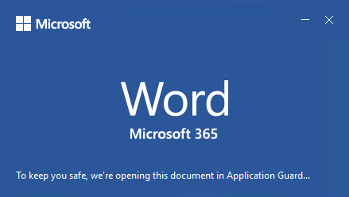

# <a name="application-guard-for-office-public-preview-for-admins"></a><span data-ttu-id="459c8-105">Application Guard för Office (offentlig för hands version) för administratörer</span><span class="sxs-lookup"><span data-stu-id="459c8-105">Application Guard for Office (public preview) for admins</span></span>

[!INCLUDE [Microsoft 365 Defender rebranding](../includes/microsoft-defender-for-office.md)]


<span data-ttu-id="459c8-106">**Gäller för:** Word, Excel och PowerPoint för Microsoft 365, Windows 10 Enterprise</span><span class="sxs-lookup"><span data-stu-id="459c8-106">**Applies to:** Word, Excel, and PowerPoint for Microsoft 365, Windows 10 Enterprise</span></span>

>[!IMPORTANT]
><span data-ttu-id="459c8-107">Vissa uppgifter gäller för en för hands version som kan ändras väsentligt innan den släpps kommersiellt.</span><span class="sxs-lookup"><span data-stu-id="459c8-107">Some information relates to a prereleased product which may be substantially modified before it's commercially released.</span></span> <span data-ttu-id="459c8-108">Microsoft lämnar inga garantier, uttryckliga eller underförstådda, med avseende på informationen som tillhandahålls här.</span><span class="sxs-lookup"><span data-stu-id="459c8-108">Microsoft makes no warranties, express or implied, with respect to the information provided here.</span></span>


<span data-ttu-id="459c8-109">Microsoft Defender Application Guard för Office (Application Guard för Office) hindrar icke betrodda filer från att komma åt betrodda resurser, så att ditt företag är säkert mot nya och framväxande attacker.</span><span class="sxs-lookup"><span data-stu-id="459c8-109">Microsoft Defender Application Guard for Office (Application Guard for Office) helps prevent untrusted files from accessing trusted resources, keeping your enterprise safe from new and emerging attacks.</span></span> <span data-ttu-id="459c8-110">I den här artikeln får administratörer hjälp med att konfigurera enheter för förhands granskning av Application Guard för Office.</span><span class="sxs-lookup"><span data-stu-id="459c8-110">This article walks admins through setting up devices for a preview of Application Guard for Office.</span></span> <span data-ttu-id="459c8-111">Den innehåller information om system krav och installations anvisningar för att aktivera Application Guard för Office på en enhet.</span><span class="sxs-lookup"><span data-stu-id="459c8-111">It provides information about system requirements and installation steps to enable Application Guard for Office on a device.</span></span>

## <a name="prerequisites"></a><span data-ttu-id="459c8-112">Krav</span><span class="sxs-lookup"><span data-stu-id="459c8-112">Prerequisites</span></span>

### <a name="minimum-hardware-requirements"></a><span data-ttu-id="459c8-113">Minsta maskin varu krav</span><span class="sxs-lookup"><span data-stu-id="459c8-113">Minimum hardware requirements</span></span>

* <span data-ttu-id="459c8-114">**CPU** : 64-bitar, 4 kärnor (fysiskt eller virtuellt), virtualiseringslösningar (Intel VT-x eller AMD-V), bas i5 motsvarande eller högre rekommenderas</span><span class="sxs-lookup"><span data-stu-id="459c8-114">**CPU** : 64-bit, 4 cores (physical or virtual), virtualization extensions   (Intel VT-x OR AMD-V), Core i5 equivalent or higher recommended</span></span>
* <span data-ttu-id="459c8-115">**Fysiskt minne** : 8 GB RAM-minne</span><span class="sxs-lookup"><span data-stu-id="459c8-115">**Physical memory** : 8-GB RAM</span></span>
* <span data-ttu-id="459c8-116">**Hård disk** : 10 GB ledigt utrymme på system enheten (SSD rekommenderas)</span><span class="sxs-lookup"><span data-stu-id="459c8-116">**Hard disk** : 10 GB of free space on the system drive (SSD recommended)</span></span>

### <a name="minimum-software-requirements"></a><span data-ttu-id="459c8-117">Minsta program varu krav</span><span class="sxs-lookup"><span data-stu-id="459c8-117">Minimum software requirements</span></span>

* <span data-ttu-id="459c8-118">**Windows 10** : Windows 10 Enterprise Edition, Client version 2004 (20H1) build 19041</span><span class="sxs-lookup"><span data-stu-id="459c8-118">**Windows 10** : Windows 10 Enterprise edition, Client Build version 2004 (20H1) build 19041</span></span>
* <span data-ttu-id="459c8-119">**Office** : Office beta Channel version 2008 16.0.13212 eller senare</span><span class="sxs-lookup"><span data-stu-id="459c8-119">**Office** : Office Beta Channel Build version 2008 16.0.13212 or later</span></span>
* <span data-ttu-id="459c8-120">**Uppdaterings paket** : Windows 10 kumulativa [KB4571756](https://support.microsoft.com/help/4571756/windows-10-update-KB4571756) säkerhets uppdateringar</span><span class="sxs-lookup"><span data-stu-id="459c8-120">**Update package** : Windows 10 cumulative monthly security updates [KB4571756](https://support.microsoft.com/help/4571756/windows-10-update-KB4571756)</span></span> 

<span data-ttu-id="459c8-121">Detaljerade system krav finns i [system krav för Microsoft Defender Application Guard](https://docs.microsoft.com/windows/security/threat-protection/microsoft-defender-application-guard/reqs-md-app-guard).</span><span class="sxs-lookup"><span data-stu-id="459c8-121">For detailed system requirements, refer to [System requirements for Microsoft Defender Application Guard](https://docs.microsoft.com/windows/security/threat-protection/microsoft-defender-application-guard/reqs-md-app-guard).</span></span> <span data-ttu-id="459c8-122">Mer information om för hands versionen av Office Insider finns i [komma igång med distribution av Office Insider-versioner](https://insider.office.com/business/deploy).</span><span class="sxs-lookup"><span data-stu-id="459c8-122">To learn more about Office Insider Preview builds, refer to [Getting started on deploying Office Insider builds](https://insider.office.com/business/deploy).</span></span>

### <a name="licensing-requirements"></a><span data-ttu-id="459c8-123">Licens krav</span><span class="sxs-lookup"><span data-stu-id="459c8-123">Licensing requirements</span></span>
* <span data-ttu-id="459c8-124">Microsoft 365 E5 eller Microsoft 365 E5 Security</span><span class="sxs-lookup"><span data-stu-id="459c8-124">Microsoft 365 E5 or Microsoft 365 E5 Security</span></span>

## <a name="deploy-application-guard-for-office"></a><span data-ttu-id="459c8-125">Distribuera Application Guard för Office</span><span class="sxs-lookup"><span data-stu-id="459c8-125">Deploy Application Guard for Office</span></span>

### <a name="enable-application-guard-for-office"></a><span data-ttu-id="459c8-126">Aktivera Application Guard för Office</span><span class="sxs-lookup"><span data-stu-id="459c8-126">Enable Application Guard for Office</span></span>

1.  <span data-ttu-id="459c8-127">Ladda ned och installera **Windows 10 kumulativa KB4571756 för säkerhets uppdateringar**.</span><span class="sxs-lookup"><span data-stu-id="459c8-127">Download and install **Windows 10 cumulative monthly security updates KB4571756**.</span></span> 

2.  <span data-ttu-id="459c8-128">Välj **Microsoft Defender Application Guard** under Windows-funktioner och välj **OK**.</span><span class="sxs-lookup"><span data-stu-id="459c8-128">Select **Microsoft Defender Application Guard** under Windows Features and select **OK**.</span></span> <span data-ttu-id="459c8-129">Om du aktiverar funktionen Application Guard ombeds du att starta om datorn.</span><span class="sxs-lookup"><span data-stu-id="459c8-129">Enabling the Application Guard feature will prompt a system reboot.</span></span> <span data-ttu-id="459c8-130">Du kan välja att starta om nu eller efter steg 3.</span><span class="sxs-lookup"><span data-stu-id="459c8-130">You can choose to reboot now or after step 3.</span></span>

    
    
    <span data-ttu-id="459c8-132">Du kan också aktivera funktionen genom att köra följande PowerShell-kommando som administratör:</span><span class="sxs-lookup"><span data-stu-id="459c8-132">The feature can also be enabled by running the following PowerShell command as administrator:</span></span> 

    ```powershell
    Enable-WindowsOptionalFeature -online -FeatureName Windows-Defender-ApplicationGuard 
    ```

3.  <span data-ttu-id="459c8-133">Leta efter Microsoft Defender Application Guard i grup principen hanterat läge på **dator konfiguration \\ administrativa mallar \\ Windows-komponenter \\ Microsoft Defender Application Guard**.</span><span class="sxs-lookup"><span data-stu-id="459c8-133">Look for the Microsoft Defender Application Guard in Managed Mode group policy located at **Computer Configuration\\Administrative Templates\\Windows Components\\Microsoft Defender Application Guard**.</span></span> <span data-ttu-id="459c8-134">Aktivera den här principen genom att ange värdet under alternativ som **2** eller **3** och sedan klicka på **OK** eller **Använd**.</span><span class="sxs-lookup"><span data-stu-id="459c8-134">Turn this policy on by setting the value under Options as **2** or **3** then selecting **OK** or **Apply**.</span></span>

    
  
    <span data-ttu-id="459c8-136">Alternativt kan du ange motsvarande KRYPTOGRAFIPROVIDER-princip:</span><span class="sxs-lookup"><span data-stu-id="459c8-136">Alternatively, you can set the corresponding CSP policy:</span></span> 

    <span data-ttu-id="459c8-137">OMA-URI: **./Device/Vendor/MSFT/WindowsDefenderApplicationGuard/Settings/AllowWindowsDefenderApplicationGuard** 
    </span><span class="sxs-lookup"><span data-stu-id="459c8-137">OMA-URI: **./Device/Vendor/MSFT/WindowsDefenderApplicationGuard/Settings/AllowWindowsDefenderApplicationGuard** 
    </span></span><br><span data-ttu-id="459c8-138">Datatyp: **Integer** 
</span><span class="sxs-lookup"><span data-stu-id="459c8-138">Data type: **Integer** 
</span></span><br><span data-ttu-id="459c8-139">Värde: **2**</span><span class="sxs-lookup"><span data-stu-id="459c8-139">Value: **2**</span></span>


4.  <span data-ttu-id="459c8-140">Starta om systemet.</span><span class="sxs-lookup"><span data-stu-id="459c8-140">Reboot the system.</span></span>

### <a name="set-diagnostics--feedback-to-send-full-data"></a><span data-ttu-id="459c8-141">Ställa in diagnostik & feedback för att skicka fullständiga data</span><span class="sxs-lookup"><span data-stu-id="459c8-141">Set Diagnostics & feedback to send full data</span></span>

<span data-ttu-id="459c8-142">Det här steget ser till att de uppgifter som behövs för att identifiera och åtgärda problem når Microsoft.</span><span class="sxs-lookup"><span data-stu-id="459c8-142">This step ensures that the data necessary to identify and fix problems is reaching Microsoft.</span></span> <span data-ttu-id="459c8-143">Följ de här anvisningarna för att aktivera diagnostik på din Windows-enhet:</span><span class="sxs-lookup"><span data-stu-id="459c8-143">Follow these steps to enable diagnostics on your Windows device:</span></span>

1.  <span data-ttu-id="459c8-144">Öppna **Inställningar** från Start-menyn.</span><span class="sxs-lookup"><span data-stu-id="459c8-144">Open **Settings** from the Start menu.</span></span>

    

2.  <span data-ttu-id="459c8-146">I **Windows-inställningar** väljer du **Sekretess**.</span><span class="sxs-lookup"><span data-stu-id="459c8-146">On **Windows Settings** , select **Privacy**.</span></span>

    

3.  <span data-ttu-id="459c8-148">Under sekretess väljer du **diagnostik & feedback** och väljer **valfria diagnostikdata**.</span><span class="sxs-lookup"><span data-stu-id="459c8-148">Under Privacy, select **Diagnostics & feedback** and select **Optional diagnostic data**.</span></span>

    

<span data-ttu-id="459c8-150">Mer information om hur du konfigurerar inställningar för Windows-diagnostik finns i [Konfigurera diagnostikdata för Windows i organisationen](https://docs.microsoft.com/windows/privacy/configure-windows-diagnostic-data-in-your-organization#enterprise-management).</span><span class="sxs-lookup"><span data-stu-id="459c8-150">For more on configuring Windows diagnostic settings, refer to [Configuring Windows diagnostic data in your organization](https://docs.microsoft.com/windows/privacy/configure-windows-diagnostic-data-in-your-organization#enterprise-management).</span></span>

### <a name="confirm-that-application-guard-for-office-is-enabled-and-working"></a><span data-ttu-id="459c8-151">Kontrol lera att Application Guard för Office är aktiverat och fungerar</span><span class="sxs-lookup"><span data-stu-id="459c8-151">Confirm that Application Guard for Office is enabled and working</span></span>

<span data-ttu-id="459c8-152">Innan du bekräftar att Application Guard för Office är aktiverat startar du Word, Excel eller PowerPoint på en enhet där principerna har distribuerats.</span><span class="sxs-lookup"><span data-stu-id="459c8-152">Before confirming that the Application Guard for Office is enabled, launch Word, Excel, or PowerPoint on a device where the policies have been deployed.</span></span> <span data-ttu-id="459c8-153">Kontrol lera att Office är aktiverat.</span><span class="sxs-lookup"><span data-stu-id="459c8-153">Make sure Office is activated.</span></span> <span data-ttu-id="459c8-154">Du kan behöva använda arbets identiteten för att aktivera Office-produkten först.</span><span class="sxs-lookup"><span data-stu-id="459c8-154">You may need to use your work identity to activate the Office product first.</span></span>

<span data-ttu-id="459c8-155">Bekräfta att Application Guard för Office nu är aktiverat genom att starta Word, Excel eller PowerPoint och öppna ett icke-betrott dokument.</span><span class="sxs-lookup"><span data-stu-id="459c8-155">To confirm that Application Guard for Office is now enabled, launch Word, Excel, or PowerPoint and open an untrusted document.</span></span> <span data-ttu-id="459c8-156">Du kan till exempel öppna ett dokument som hämtats från Internet eller en e-postbilaga från någon utanför organisationen.</span><span class="sxs-lookup"><span data-stu-id="459c8-156">For example, you can open a document downloaded from the internet or an email attachment from someone outside your organization.</span></span>

<span data-ttu-id="459c8-157">Vid den första starten av en fil som inte är betrodd visas välkomst skärmen för Office som den nedan.</span><span class="sxs-lookup"><span data-stu-id="459c8-157">On the first launch of an untrusted file, you may see an Office splash screen like the one below.</span></span> <span data-ttu-id="459c8-158">Det kan visas för lite tid medan Application Guard för Office aktive ras och filen öppnas.</span><span class="sxs-lookup"><span data-stu-id="459c8-158">It might show for some time while Application Guard for Office is being activated and the file is being opened.</span></span> <span data-ttu-id="459c8-159">Kommande lanseringar av ej betrodda filer bör bli snabbare.</span><span class="sxs-lookup"><span data-stu-id="459c8-159">Subsequent launches of untrusted files should be faster.</span></span>




<span data-ttu-id="459c8-161">När filen öppnas visas en del indikatorer som filen har öppnats i Application Guard för Office:</span><span class="sxs-lookup"><span data-stu-id="459c8-161">Upon being opened, the file should display a few visual indicators that the file was opened inside Application Guard for Office:</span></span>

* <span data-ttu-id="459c8-162">En bildtext i menyfliksområdet</span><span class="sxs-lookup"><span data-stu-id="459c8-162">A callout in the ribbon</span></span>

    
* <span data-ttu-id="459c8-164">Program ikonen med en sköld i aktivitets fältet</span><span class="sxs-lookup"><span data-stu-id="459c8-164">The application icon with a shield in the taskbar</span></span> 

    


## <a name="configure-application-guard-for-office"></a><span data-ttu-id="459c8-166">Konfigurera Application Guard för Office</span><span class="sxs-lookup"><span data-stu-id="459c8-166">Configure Application Guard for Office</span></span>
<span data-ttu-id="459c8-167">Office har stöd för följande principer som gör att du kan konfigurera funktionerna i Application Guard för Office.</span><span class="sxs-lookup"><span data-stu-id="459c8-167">Office supports the following policies to enable you to configure the capabilities of Application Guard for Office.</span></span> <span data-ttu-id="459c8-168">Dessa principer kan konfigureras via grup principer eller via moln princip tjänsten för Office.</span><span class="sxs-lookup"><span data-stu-id="459c8-168">These policies can be configured through Group policies or through the Office cloud policy service.</span></span> 

>[!NOTE] 
> <span data-ttu-id="459c8-169">Dessa principer blir snart tillgängliga.</span><span class="sxs-lookup"><span data-stu-id="459c8-169">These policies will become available soon.</span></span>
><span data-ttu-id="459c8-170">Om du konfigurerar dessa principer kan vissa funktioner för filer som öppnas i Application Guard för Office inte aktive ras.</span><span class="sxs-lookup"><span data-stu-id="459c8-170">Also, configuring these policies can disable some functionalities for files opened in Application Guard for Office.</span></span>

| <span data-ttu-id="459c8-171">Autentiseringsprincip</span><span class="sxs-lookup"><span data-stu-id="459c8-171">Policy</span></span>                                                                          | <span data-ttu-id="459c8-172">Beskrivning</span><span class="sxs-lookup"><span data-stu-id="459c8-172">Description</span></span>                                                                                                                                                                                                                                                                                             |
|---------------------------------------------------------------------------------|---------------------------------------------------------------------------------------------------------------------------------------------------------------------------------------------------------------------------------------------------------------------------------------------------------|
| <span data-ttu-id="459c8-173">Inaktivera Application Guard för Office</span><span class="sxs-lookup"><span data-stu-id="459c8-173">Disable Application Guard for Office</span></span>                                            | <span data-ttu-id="459c8-174">Om du aktiverar den här principen kan Word, Excel och PowerPoint användas för att använda isolerings behållaren skyddad vy i stället för application Guard för Office.</span><span class="sxs-lookup"><span data-stu-id="459c8-174">Enabling this policy will force Word, Excel, and PowerPoint to use the Protected View isolation container instead of Application Guard for Office.</span></span> <span data-ttu-id="459c8-175">Med den här policyn kan du tillfälligt inaktivera Application Guard för Office när det finns problem med att lämna det aktiverat för Edge.</span><span class="sxs-lookup"><span data-stu-id="459c8-175">This policy can be used to temporarily disable Application Guard for Office when there are issues in leaving it enabled for Edge.</span></span>                                  |
| <span data-ttu-id="459c8-176">Inaktivera kopiera/klistra in för dokument som öppnats i Application Guard</span><span class="sxs-lookup"><span data-stu-id="459c8-176">Disable copy/paste for documents opened in Application Guard</span></span>                    | <span data-ttu-id="459c8-177">Om du aktiverar den här principen hindras en användare från att kopiera och klistra in innehåll från ett dokument som öppnats i Application Guard för Office till ett dokument som öppnats utanför det.</span><span class="sxs-lookup"><span data-stu-id="459c8-177">Enabling this policy will prevent a user from copying and pasting content from a document opened in Application Guard for Office to a document opened outside it.</span></span>                                                                                                                                   |
| <span data-ttu-id="459c8-178">Förhindra att användare tar bort Application Guard-skyddet för filer</span><span class="sxs-lookup"><span data-stu-id="459c8-178">Prevent users from removing Application Guard protection on files</span></span>               | <span data-ttu-id="459c8-179">Om du aktiverar den här principen tas alternativet bort (i Office-programupplevelsen) för att inaktivera Application Guard-skydd eller öppna en fil utanför Application Guard.</span><span class="sxs-lookup"><span data-stu-id="459c8-179">Enabling this policy will remove the option (within the Office application experience) to disable Application Guard protection or open a file outside Application Guard.</span></span> <br><br><span data-ttu-id="459c8-180">**Obs!** Användare kan fortfarande kringgå den här principen genom att manuellt ta bort egenskapen för märkning från filen eller genom att flytta ett dokument till en betrodd plats.</span><span class="sxs-lookup"><span data-stu-id="459c8-180">**Note:** Users can still bypass this policy by manually removing the mark-of-the-web property from the file or by moving a document to a Trusted location.</span></span> |
| <span data-ttu-id="459c8-181">Begränsa utskrift från dokument som öppnats i Application Guard</span><span class="sxs-lookup"><span data-stu-id="459c8-181">Restrict printing from documents opened in Application Guard</span></span>                    | <span data-ttu-id="459c8-182">Om du aktiverar den här principen begränsas skrivare som en användare kan skriva ut till från en fil som öppnats i Application Guard för Office.</span><span class="sxs-lookup"><span data-stu-id="459c8-182">Enabling this policy will limit printers a user can print to from a file opened in Application Guard for Office.</span></span> <span data-ttu-id="459c8-183">Du kan till exempel använda den här principen för att begränsa användare till endast Skriv ut till PDF.</span><span class="sxs-lookup"><span data-stu-id="459c8-183">For example, you can use this policy to restrict users to only print to PDF.</span></span>                              |
| <span data-ttu-id="459c8-184">Stänga av kamera-och mikrofon åtkomst för dokument som öppnats i Application Guard</span><span class="sxs-lookup"><span data-stu-id="459c8-184">Turn off camera and microphone access for documents opened in Application Guard</span></span> | <span data-ttu-id="459c8-185">Om du aktiverar den här principen tas Office-åtkomst till kamera och mikrofon i Application Guard för Office bort.</span><span class="sxs-lookup"><span data-stu-id="459c8-185">Enabling this policy will remove Office access to Camera and Microphone inside Application Guard for Office.</span></span>                                                                                                                                                                                                     |
>[!NOTE] 
><span data-ttu-id="459c8-186">Följande principer kräver att användaren loggar ut och sedan loggar in igen för att Windows ska fungera:</span><span class="sxs-lookup"><span data-stu-id="459c8-186">The following policies will require the user to log off and re-login to Windows to take effect:</span></span>
> 
> *  <span data-ttu-id="459c8-187">Inaktivera kopiera/klistra in för dokument som öppnats i Application Guard</span><span class="sxs-lookup"><span data-stu-id="459c8-187">Disable copy/paste for documents opened in Application Guard</span></span>
>*  <span data-ttu-id="459c8-188">Begränsa utskrift för dokument som öppnats i Application Guard</span><span class="sxs-lookup"><span data-stu-id="459c8-188">Restrict printing for documents opened in Application Guard</span></span>
> *  <span data-ttu-id="459c8-189">Stänga av kamera-och mikrofon åtkomst till dokument som öppnats i Application Guard</span><span class="sxs-lookup"><span data-stu-id="459c8-189">Turn off camera and mic access to documents opened in Application Guard</span></span>


## <a name="submit-feedback"></a><span data-ttu-id="459c8-190">Skicka feedback</span><span class="sxs-lookup"><span data-stu-id="459c8-190">Submit feedback</span></span>

### <a name="submit-feedback-via-feedback-hub"></a><span data-ttu-id="459c8-191">Skicka feedback via feedback Hub</span><span class="sxs-lookup"><span data-stu-id="459c8-191">Submit feedback via Feedback Hub</span></span>

<span data-ttu-id="459c8-192">Om du stöter på problem när du startar Application Guard för Office uppmanas du att skicka in dina synpunkter via feedback Hub:</span><span class="sxs-lookup"><span data-stu-id="459c8-192">If you encounter any issues when launching Application Guard for Office, you are encouraged to submit your feedback via Feedback Hub:</span></span>

1.  <span data-ttu-id="459c8-193">Öppna **appen feedback Hub** och logga in.</span><span class="sxs-lookup"><span data-stu-id="459c8-193">Open the **Feedback Hub app** and sign in.</span></span>

2.  <span data-ttu-id="459c8-194">Om du får en dialog ruta när du startar Application Guard väljer du **rapportera till Microsoft** i fel dialog rutan för att starta en ny feedback-överföring.</span><span class="sxs-lookup"><span data-stu-id="459c8-194">If you get an error dialog while launching Application Guard, select **Report to Microsoft** in the error dialog to start a new feedback submission.</span></span> <span data-ttu-id="459c8-195">I annat fall navigerar du till <https://aka.ms/wdagoffice-fb> för att välja rätt kategori för application Guard och väljer sedan **+ Lägg till ny feedback** nära det övre högra hörnet.</span><span class="sxs-lookup"><span data-stu-id="459c8-195">Otherwise, navigate to <https://aka.ms/wdagoffice-fb> to select the correct category for Application Guard, then select **+ Add new feedback** near the top right.</span></span>

3.  <span data-ttu-id="459c8-196">Fyll i rutan **sammanfatta din feedback** om den inte redan är ifylld.</span><span class="sxs-lookup"><span data-stu-id="459c8-196">Fill in the **Summarize your feedback** box if it isn’t already filled in for you.</span></span>

4.  <span data-ttu-id="459c8-197">Fyll i rutan **förklara i mer information** med en detaljerad beskrivning av det problem du fick och vilka steg du vidtog och välj sedan **Nästa**.</span><span class="sxs-lookup"><span data-stu-id="459c8-197">Fill in the **Explain in more detail** box with a detailed description of the issue you experienced and what steps you took, then select **Next**.</span></span>

5.  <span data-ttu-id="459c8-198">Välj bubblan bredvid problemet.</span><span class="sxs-lookup"><span data-stu-id="459c8-198">Select the bubble next to Problem.</span></span> <span data-ttu-id="459c8-199">Kontrol lera att den valda kategorin är **säkerhet och sekretess \> Microsoft Defender Application Guard – Office** och välj sedan **Nästa**.</span><span class="sxs-lookup"><span data-stu-id="459c8-199">Make sure the category selected is **Security and Privacy \> Microsoft Defender Application Guard – Office** , then select **Next**.</span></span>

6.  <span data-ttu-id="459c8-200">Välj **ny feedback** och sedan **Nästa**.</span><span class="sxs-lookup"><span data-stu-id="459c8-200">Select **New feedback** , then **Next**.</span></span>

7.  <span data-ttu-id="459c8-201">Samla in spår om problemet:</span><span class="sxs-lookup"><span data-stu-id="459c8-201">Collect traces about the issue:</span></span>

    1. <span data-ttu-id="459c8-202">Expandera rutan **återskapa mitt problem** .</span><span class="sxs-lookup"><span data-stu-id="459c8-202">Expand the **Recreate my problem** tile.</span></span>

    2.  <span data-ttu-id="459c8-203">Om problemet du upplever inträffar när Application Guard körs öppnar du en Application Guard-instans.</span><span class="sxs-lookup"><span data-stu-id="459c8-203">If the issue you’re experiencing occurs while Application Guard is running, open an Application Guard instance.</span></span> <span data-ttu-id="459c8-204">Om du gör det kan fler spårningar samlas in från Application Guard-behållaren.</span><span class="sxs-lookup"><span data-stu-id="459c8-204">Doing this allows additional traces to be collected from within the Application Guard container.</span></span>

    3.  <span data-ttu-id="459c8-205">Välj **Starta inspelning** och vänta tills panelen stannar och säg sedan *stoppa inspelningen*.</span><span class="sxs-lookup"><span data-stu-id="459c8-205">Select **Start recording** and wait for the tile to stop spinning and say *Stop recording*.</span></span>

    4.  <span data-ttu-id="459c8-206">Helt återskapa problemet med Application Guard.</span><span class="sxs-lookup"><span data-stu-id="459c8-206">Fully reproduce the issue with Application Guard.</span></span> <span data-ttu-id="459c8-207">Det kan inkludera att ett försök görs att starta en Application Guard-instans och vänta tills den inte fungerar, eller att det uppstår ett problem i en kör Application Guard-instans.</span><span class="sxs-lookup"><span data-stu-id="459c8-207">This might include attempting to launch an Application Guard instance and waiting until it fails, or reproducing an issue in a running Application Guard instance.</span></span>

    5.  <span data-ttu-id="459c8-208">Välj panelen **stoppa inspelning** .</span><span class="sxs-lookup"><span data-stu-id="459c8-208">Select the **Stop recording** tile.</span></span>

    6.  <span data-ttu-id="459c8-209">Behåll alla öppna Application Guard-instanser, till och med ett par minuter efter att du har skickat in, så att behållar diagnostik också kan samlas in.</span><span class="sxs-lookup"><span data-stu-id="459c8-209">Keep any running Application Guard instance/s open, even until a few minutes after submission, so that container diagnostics can also be collected.</span></span>

8.  <span data-ttu-id="459c8-210">Bifoga relevanta skärm bilder eller filer för problemet.</span><span class="sxs-lookup"><span data-stu-id="459c8-210">Attach any relevant screenshots or files related to the problem.</span></span>

9.  <span data-ttu-id="459c8-211">Välj **Skicka**.</span><span class="sxs-lookup"><span data-stu-id="459c8-211">Select **Submit**.</span></span>


### <a name="submit-feedback-via-office-customer-voice"></a><span data-ttu-id="459c8-212">Skicka feedback via Office Customer Voice</span><span class="sxs-lookup"><span data-stu-id="459c8-212">Submit feedback via Office Customer Voice</span></span>

<span data-ttu-id="459c8-213">Du kan också skicka feedback från Office om problemet inträffar när Office-dokument öppnas i Application Guard.</span><span class="sxs-lookup"><span data-stu-id="459c8-213">You may also submit feedback from within Office if the issue happens when Office documents are opened in Application Guard.</span></span> <span data-ttu-id="459c8-214">Se [Office Insider-handboken](https://insider.office.com/handbook) för att skicka feedback.</span><span class="sxs-lookup"><span data-stu-id="459c8-214">Refer to the [Office Insider Handbook](https://insider.office.com/handbook) for submitting feedback.</span></span>

## <a name="integration-with-microsoft-defender-for-endpoint-and-microsoft-defender-for-office-365"></a><span data-ttu-id="459c8-215">Integrering med Microsoft Defender för slut punkt och Microsoft Defender för Office 365</span><span class="sxs-lookup"><span data-stu-id="459c8-215">Integration with Microsoft Defender for Endpoint and Microsoft Defender for Office 365</span></span>

<span data-ttu-id="459c8-216">Application Guard för Office är integrerat med Microsoft Defender för slut punkt för att tillhandahålla övervakning och avisering vid skadlig aktivitet i den isolerade miljön.</span><span class="sxs-lookup"><span data-stu-id="459c8-216">Application Guard for Office is integrated with Microsoft Defender for Endpoint to provide monitoring and alerting on malicious activity happening in the isolated environment.</span></span>

<span data-ttu-id="459c8-217">Microsoft Defender för slut punkten är en säkerhets plattform som utformats för att hjälpa företags nätverk att förhindra, upptäcka, undersöka och reagera på avancerade hot.</span><span class="sxs-lookup"><span data-stu-id="459c8-217">Microsoft Defender for Endpoint is a security platform designed to help enterprise networks prevent, detect, investigate, and respond to advanced threats.</span></span> <span data-ttu-id="459c8-218">Mer information om den här plattformen finns på sidan [Microsoft Defender för slut punkt](https://www.microsoft.com/microsoft-365/windows/microsoft-defender-atp) .</span><span class="sxs-lookup"><span data-stu-id="459c8-218">For more details about this platform, visit the [Microsoft Defender for Endpoint](https://www.microsoft.com/microsoft-365/windows/microsoft-defender-atp) page.</span></span> <span data-ttu-id="459c8-219">Läs mer om inbyggda enheter till den här plattformen på [inbyggda enheter till Microsoft Defender för slut punkts tjänsten](https://docs.microsoft.com/windows/security/threat-protection/microsoft-defender-atp/onboard-configure).</span><span class="sxs-lookup"><span data-stu-id="459c8-219">Learn more about onboarding devices to this platform at [Onboard devices to the Microsoft Defender for Endpoint service](https://docs.microsoft.com/windows/security/threat-protection/microsoft-defender-atp/onboard-configure).</span></span>

<span data-ttu-id="459c8-220">Du kan också konfigurera Microsoft Defender för Office 365 så att det fungerar med Defender för slut punkten.</span><span class="sxs-lookup"><span data-stu-id="459c8-220">You can also configure Microsoft Defender for Office 365 to work with Defender for Endpoint.</span></span> <span data-ttu-id="459c8-221">Se [integrera Defender för Office 365 med Microsoft Defender för slut punkt](https://docs.microsoft.com/microsoft-365/security/office-365-security/integrate-office-365-ti-with-wdatp?view=o365-worldwide).</span><span class="sxs-lookup"><span data-stu-id="459c8-221">Refer to [Integrate Defender for Office 365 with Microsoft Defender for Endpoint](https://docs.microsoft.com/microsoft-365/security/office-365-security/integrate-office-365-ti-with-wdatp?view=o365-worldwide).</span></span>

## <a name="limitations-and-considerations"></a><span data-ttu-id="459c8-222">Begränsningar och överväganden</span><span class="sxs-lookup"><span data-stu-id="459c8-222">Limitations and considerations</span></span>

* <span data-ttu-id="459c8-223">Application Guard för Office är ett begränsat läge som isolerar icke betrodda dokument från åtkomst till betrodda företags resurser, intranät, användarens identitet och alla filer som finns på datorn.</span><span class="sxs-lookup"><span data-stu-id="459c8-223">Application Guard for Office is a restricted mode that isolates untrusted documents from accessing trusted corporate resources, intranet, the user's identity, and arbitrary files present on the computer.</span></span> <span data-ttu-id="459c8-224">Om en användare försöker få till gång till en funktion som har ett samband med en sådan åtkomst, till exempel att infoga en bild från en lokal fil på disken, kommer den att Miss lyckas och skapa en ledtext som den nedan.</span><span class="sxs-lookup"><span data-stu-id="459c8-224">As a result, if a user tries to access a feature that has a dependency on such access, for example, inserting a picture from a local file on disk, it will fail and produce a prompt like the one below.</span></span> <span data-ttu-id="459c8-225">Om du vill aktivera ett icke-betrott dokument för åtkomst till betrodda resurser måste användarna ta bort Application Guard-skydd från dokumentet.</span><span class="sxs-lookup"><span data-stu-id="459c8-225">To enable an untrusted document to access trusted resources, users must remove Application Guard protection from the document.</span></span>

    

    >[!NOTE]    
    ><span data-ttu-id="459c8-227">Meddela användarna att de bara ska ta bort skydd om de litar på filen och dess källa eller var den kom ifrån.</span><span class="sxs-lookup"><span data-stu-id="459c8-227">Advise users to only remove protection if they trust the file and its source or where it came from.</span></span>

* <span data-ttu-id="459c8-228">Aktivt innehåll i dokument som makron och ActiveX-kontroller är inaktiverade i Application Guard för Office.</span><span class="sxs-lookup"><span data-stu-id="459c8-228">Active content in documents like macros and ActiveX controls are disabled in Application Guard for Office.</span></span> <span data-ttu-id="459c8-229">Användare måste ta bort Application Guard-skyddet för att aktivera aktivt innehåll.</span><span class="sxs-lookup"><span data-stu-id="459c8-229">Users need to remove Application Guard protection to enable active content.</span></span>

* <span data-ttu-id="459c8-230">Icke betrodda filer som öppnats från nätverks resurser eller filer som delas från OneDrive, OneDrive för företag eller SharePoint Online från en annan organisation öppnas som skrivskyddade i Application Guard.</span><span class="sxs-lookup"><span data-stu-id="459c8-230">Untrusted files opened from network shares or files shared from OneDrive, OneDrive for Business, or SharePoint Online from a different organization open as read-only in Application Guard.</span></span> <span data-ttu-id="459c8-231">Användare kan spara en lokal kopia av sådana filer för att fortsätta arbeta i behållaren eller ta bort skyddet för att arbeta direkt med den ursprungliga filen.</span><span class="sxs-lookup"><span data-stu-id="459c8-231">Users can save a local copy of such files to continue working in the container or remove protection to directly work with the original file.</span></span>

* <span data-ttu-id="459c8-232">Filer som skyddas med IRM (Information Rights Management) fortsätter att öppnas i skyddad vy.</span><span class="sxs-lookup"><span data-stu-id="459c8-232">Files that are protected by Information Rights Management (IRM) continue to   open in Protected View.</span></span>
* <span data-ttu-id="459c8-233">Eventuella anpassningar av Office-program i Application Guard för Office sparas inte när användaren loggar ut och loggar in eller startar om enheten.</span><span class="sxs-lookup"><span data-stu-id="459c8-233">Any customizations to Office applications in Application Guard for Office will not persist after a user logs off and logs back in or reboots the device.</span></span> 

* <span data-ttu-id="459c8-234">Endast hjälpmedel som använder UIA-ramverket kan erbjuda en lättillgänglig upplevelse för filer som öppnats i Application Guard för Office.</span><span class="sxs-lookup"><span data-stu-id="459c8-234">Only Accessibility tools that use the UIA framework can provide an accessible experience for files opened in Application Guard for Office.</span></span>

* <span data-ttu-id="459c8-235">Nätverks anslutning krävs för den första starten av Application Guard efter installationen.</span><span class="sxs-lookup"><span data-stu-id="459c8-235">Network connectivity is required for the first launch of Application Guard after installation.</span></span> <span data-ttu-id="459c8-236">Det här krävs för att Application Guard ska verifiera licensen.</span><span class="sxs-lookup"><span data-stu-id="459c8-236">This is required for Application Guard to validate the license.</span></span>
* <span data-ttu-id="459c8-237">I dokumentets informations avsnitt kan egenskapen *senast ändrad av* Visa WDAGUtilityAccount som användare.</span><span class="sxs-lookup"><span data-stu-id="459c8-237">In the document's info section, the *Last Modified By* property may display WDAGUtilityAccount as the user.</span></span> <span data-ttu-id="459c8-238">Det här är den anonyma användare som är konfigurerad i Application Guard med angiven att Skriv bords användarens identitet inte är delad inuti Application Guard-behållaren.</span><span class="sxs-lookup"><span data-stu-id="459c8-238">This is the anonymous user configured in Application Guard given that the desktop user's identity is not shared inside the Application Guard container.</span></span> 

## <a name="performance-optimizations-for-application-guard"></a><span data-ttu-id="459c8-239">Prestanda optimeringar för application Guard</span><span class="sxs-lookup"><span data-stu-id="459c8-239">Performance optimizations for Application Guard</span></span> 

<span data-ttu-id="459c8-240">Det här avsnittet innehåller en översikt över prestanda optimeringar som används i Application Guard för Office.</span><span class="sxs-lookup"><span data-stu-id="459c8-240">This section provides an overview of the performance optimizations used in Application Guard for Office.</span></span> <span data-ttu-id="459c8-241">Med hjälp av den här informationen kan administratörer diagnostisera rapporter från användare relaterade till Office-prestationer eller det övergripande systemet när Application Guard är aktiverat.</span><span class="sxs-lookup"><span data-stu-id="459c8-241">This information can help administrators diagnose reports from users related to the performance of Office or the overall system when Application Guard is enabled.</span></span> 

<span data-ttu-id="459c8-242">Application Guard använder en virtualiserad behållare för att isolera icke betrodda dokument från systemet.</span><span class="sxs-lookup"><span data-stu-id="459c8-242">Application Guard uses a virtualized container to isolate untrusted documents away from the system.</span></span> <span data-ttu-id="459c8-243">Processen med att skapa en behållare och ställa in Application Guard-behållaren för att öppna Office-dokument har en prestanda som kan påverka användarens upplevelse negativt när användare öppnar ett icke-betrott dokument.</span><span class="sxs-lookup"><span data-stu-id="459c8-243">The process of creating a container and setting up the Application Guard container to open Office documents has a performance overhead that might negatively impact user experience when users open an  untrusted document.</span></span> 


<span data-ttu-id="459c8-244">För att användarna ska kunna använda den förväntade fil öppnings upplevelsen använder Application Guard logik för att skapa en container innan följande heuristik uppfylls på ett system: en användare har öppnat en fil i antingen skyddad vy eller program miljö under de senaste 28 dagarna.</span><span class="sxs-lookup"><span data-stu-id="459c8-244">To provide users with the expected file opening experience, Application Guard uses logic to pre-create a container when the following heuristic is met on a system: A user has opened a file in either Protected View or Application Guard in the past 28 days.</span></span> 

<span data-ttu-id="459c8-245">När den här heuristiskheten är uppfylld kommer Office att skapa en program skydds behållare för användaren när de loggar in i Windows.</span><span class="sxs-lookup"><span data-stu-id="459c8-245">When this heuristic is met, Office will pre-create an Application Guard container for the user after they log in to Windows.</span></span> <span data-ttu-id="459c8-246">När den här för skapande åtgärden pågår kan systemet få långsam prestanda.</span><span class="sxs-lookup"><span data-stu-id="459c8-246">When this pre-create operation is in progress, the system may experience slow performance.</span></span> <span data-ttu-id="459c8-247">Detta löses så snart åtgärden har slutförts.</span><span class="sxs-lookup"><span data-stu-id="459c8-247">This will resolve as soon as the operation completes.</span></span> 


>[!NOTE] 
><span data-ttu-id="459c8-248">Tipsen som behövs för den heuristik som används för att skapa en container genereras av Office-program som en användare använder dem.</span><span class="sxs-lookup"><span data-stu-id="459c8-248">The hints needed for the heuristic used to pre-create the container are generated by Office applications as a user uses them.</span></span> <span data-ttu-id="459c8-249">Om en användare installerar Office på ett nytt system där Application Guard är aktive rad kommer Office inte att skapa en ny container förrän första gången en användare öppnar ett icke-betrott dokument på systemet.</span><span class="sxs-lookup"><span data-stu-id="459c8-249">If a user installs Office on a new system where Application Guard is enabled, Office will not pre-create the container until after the first time a user opens an untrusted document on the system.</span></span> <span data-ttu-id="459c8-250">Användaren kommer att Observera att den här första filen tar längre tid att öppna i Application Guard.</span><span class="sxs-lookup"><span data-stu-id="459c8-250">The user will observe that this first file takes longer to open in Application Guard.</span></span> 

## <a name="known-issues-in-preview"></a><span data-ttu-id="459c8-251">Kända problem i förhands granskning</span><span class="sxs-lookup"><span data-stu-id="459c8-251">Known issues in preview</span></span>

* <span data-ttu-id="459c8-252">```http```Du kan inte öppna webbläsaren genom att klicka på webb länkar (eller ```https``` ).</span><span class="sxs-lookup"><span data-stu-id="459c8-252">Clicking on web links (```http``` or ```https```) does not open the browser.</span></span> 
* <span data-ttu-id="459c8-253">.NET-uppdateringar gör att det inte går att öppna filer i Application Guard.</span><span class="sxs-lookup"><span data-stu-id="459c8-253">.NET updates cause files to fail to open in Application Guard.</span></span> <span data-ttu-id="459c8-254">Som en lösning kan användare starta om enheten när det här problemet uppstår.</span><span class="sxs-lookup"><span data-stu-id="459c8-254">As a workaround, users can reboot their device when this issue is encountered.</span></span>
    <span data-ttu-id="459c8-255">Läs mer om problemet med [att få ett fel meddelande när du försöker öppna Windows Defender Application Guard eller Windows sandbox](https://support.microsoft.com/help/4575917/receiving-an-error-message-when-attempting-to-open-windows-defender-ap).</span><span class="sxs-lookup"><span data-stu-id="459c8-255">Learn more about the issue at [Receiving an error message when attempting to open Windows Defender Application Guard or Windows Sandbox](https://support.microsoft.com/help/4575917/receiving-an-error-message-when-attempting-to-open-windows-defender-ap).</span></span>
