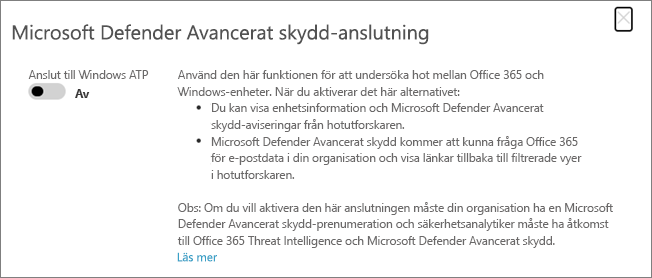

# Använda Microsoft Defender för Office 365 tillsammans med Microsoft Defender för Endpoint

[!INCLUDE [Microsoft 365 Defender rebranding](../includes/microsoft-defender-for-office.md)]

[Microsoft Defender för Office 365](defender-for-office-365.md) kan konfigureras för att fungera med [Microsoft Defender för slutpunkt.](/windows/security/threat-protection)

Genom att integrera Microsoft Defender för Office 365 med Microsoft Defender för Endpoint kan du hjälpa dina säkerhetsåtgärder att övervaka teamet och vidta åtgärder snabbt om användarnas enheter är på risk. När integration har aktiverats kan teamet för säkerhetsåtgärder till exempel se de enheter som eventuellt påverkas av ett upptäckt e-postmeddelande, samt hur många aviseringar som nyligen har genererats för dessa enheter i Microsoft Defender för Slutpunkt.

I följande bild visas hur fliken **Enheter ser** ut när du har aktiverat Microsoft Defender för slutpunktsintegrering:

I det här exemplet kan du se att mottagarna av det identifierade e-postmeddelandet har fyra enheter och en har en avisering. Om du klickar på länken för en enhet öppnas sidan [Microsoft 365 Defender](../defender-endpoint/microsoft-defender-security-center.md) (tidigare Microsoft Defender Säkerhetscenter).

> [!TIP]
> Defender Microsoft 365 portalen ersätter den Microsoft Defender Säkerhetscenter. Se [Microsoft Defender för slutpunkt i Microsoft 365 Defender](../defender/microsoft-365-security-center-mde.md).

## Krav

- Din organisation måste ha Microsoft Defender för Office 365 (eller Office 365 E5) och Microsoft Defender för Slutpunkt.

- Du måste vara global administratör eller ha en säkerhetsadministratörsroll (till exempel säkerhetsadministratör) som tilldelats Microsoft 365. (Se [Behörigheter i säkerhets- & Säkerhets- och efterlevnadscenter](permissions-in-the-security-and-compliance-center.md))

- Du måste ha tillgång [till Utforskaren (eller identifieringar i realtid).](threat-explorer.md)

## Integrera Microsoft Defender för Office 365 med Microsoft Defender för Slutpunkt

Integrering av Microsoft Defender för Office 365 med Microsoft Defender för slutpunkt konfigureras i både Defender för Slutpunkt och Defender för Office 365.

1. Som global administratör eller säkerhetsadministratör går du till [https://protection.office.com](https://protection.office.com) och loggar in. (Då kommer du till Office 365 Säkerhets- & Efterlevnadscenter.)

2. Välj Hothanteringsutforskaren **i** \> **navigeringsfönstret.**

   

3. Välj Defender för Endpoint Inställningar **(MDE-Inställningar) i skärmens övre högra Inställningar.**

4. I dialogrutan Microsoft Defender för slutpunktsanslutning aktiverar du Microsoft **Defender Anslut microsoft Defender för slutpunkt.**

   

5. Gå till Microsoft 365 Defender-portalen ( [https://security.microsoft.com](https://security.microsoft.com) .

6. I navigeringsfältet väljer **du Inställningar**. Välj sedan **Avancerade funktioner** under **Allmänt.**

7. Rulla ned **till Office 365 Threat Intelligence-anslutning** och aktivera anslutningen.

   

## Relaterade artiklar

[Funktioner för undersökning av hot och svar i Office 365](office-365-ti.md)

[Microsoft Defender för Office 365](defender-for-office-365.md)

[Microsoft Defender för Endpoint](/windows/security/threat-protection)
