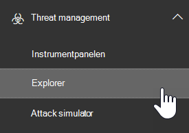

# Använda Microsoft Defender för Office 365 tillsammans med Microsoft Defender för slut punkten

[!INCLUDE [Microsoft 365 Defender rebranding](../includes/microsoft-defender-for-office.md)]

[Microsoft Defender för Office 365](office-365-atp.md) kan konfigureras så att det fungerar med [Microsoft Defender för slut punkten](https://docs.microsoft.com/windows/security/threat-protection).

Att integrera Microsoft Defender för Office 365 med Microsoft Defender för slut punkten kan hjälpa din säkerhets åtgärds grupp övervakning och vidta åtgärder snabbt om användarnas enheter löper risk. När integrationen är aktive rad kan till exempel din säkerhets åtgärds grupp se vilka enheter som eventuellt påverkas av ett identifierat e-postmeddelande, samt hur många senaste aviseringar som genererades för dessa enheter i Microsoft Defender för slut punkter.

I följande bild visas hur fliken **enheter** ser ut som har Microsoft Defender för slut punkts integrering aktiverat:

I det här exemplet kan du se att mottagarna av det identifierade e-postmeddelandet har fyra enheter och en har en avisering. Om du klickar på länken för en enhet öppnas den i Microsoft Defender säkerhets Center ( <https://securitycenter.windows.com> ).

> [!TIP]
> **[Läs mer om Microsoft Defender säkerhets Center](https://docs.microsoft.com/windows/security/threat-protection/microsoft-defender-atp/use)** (kallas även Microsoft Defender för slut punkts Portal).

## Krav

- Din organisation måste ha Microsoft Defender för Office 365 (eller Office 365 E5) och Microsoft Defender för slut punkt.

- Du måste vara global administratör eller ha en säkerhets administratörs roll (till exempel säkerhets administratör) som tilldelats i [säkerhets & Compliance Center](https://protection.office.com). (Se [behörigheter i säkerhets & kompatibilitetskontrollen](permissions-in-the-security-and-compliance-center.md))

- Du måste ha till gång till både [Explorer (eller real tids identifieringar)](threat-explorer.md) i säkerhets & efterlevnaden för säkerhet och Microsoft Defender säkerhets Center.

## Integrera Microsoft Defender för Office 365 med Microsoft Defender för slut punkt

Att integrera Microsoft Defender för Office 365 med Microsoft Defender för slut punkten är inställt på både säkerhets & och Microsoft Defender säkerhets Center.

1. Som global administratör eller säkerhets administratör går du till <https://protection.office.com> och loggar in. (Du kommer till Office 365 Security & Compliance Center.)

2. Välj **Threat Management** \> **Explorer** i navigerings fönstret.

   

3. I det övre högra hörnet på skärmen väljer du **Defender för slut punkts inställningar**.

4. I dialog rutan Microsoft Defender för slut punkts anslutning aktiverar **du Anslut till Microsoft Defender för slut punkt**.

   

5. Gå till Microsoft Defender säkerhets Center ( <https://securitycenter.windows.com> ).

6. I navigerings fältet väljer du **Inställningar**. Under **Allmänt** väljer du **avancerade funktioner**.

7. Rulla ned till **Office 365 Threat Intelligence-anslutning** och slå på anslutningen.

   

## Relaterade artiklar

[Hot-och svars funktioner i Office 365](office-365-ti.md)

[Microsoft Defender för Office 365](office-365-atp.md)

[Microsoft Defender för slut punkt](https://docs.microsoft.com/windows/security/threat-protection)
