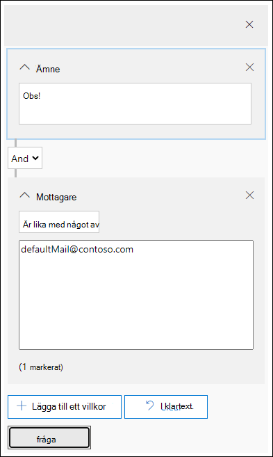

# Undersök skadlig e-post som har levererats i Office 365Investigate malicious email that was delivered in Office 365

Med [Office 365 Avancerat skydd](office-365-atp.md) kan du undersöka aktiviteter som ger folk i din organisation till risk och att vidta åtgärder för att skydda din organisation.[Office 365 Advanced Threat Protection](office-365-atp.md) enables you to investigate activities that put people in your organization at risk, and to take action to protect your organization. Om du till exempel är en del av din organisations säkerhets team kan du hitta och undersöka misstänkta e-postmeddelanden som har levererats.For example, if you are part of your organization's security team, you can find and investigate suspicious email messages that were delivered. Du kan göra det med hjälp av [Threat Explorer (eller identifieringar i real tid)](threat-explorer.md).You can do this by using [Threat Explorer (or real-time detections)](threat-explorer.md).

> [!NOTE]
> Hoppa till reparations artikeln [här](https://docs.microsoft.com/microsoft-365/security/mtp/article-submission/remediate-malicious-email-delivered-office-365?view=o365-21vianet&branch=pr-en-us-4258).Jump to the remediation article [here](https://docs.microsoft.com/microsoft-365/security/mtp/article-submission/remediate-malicious-email-delivered-office-365?view=o365-21vianet&branch=pr-en-us-4258).

## Innan du börjarBefore you begin

Kontrol lera följande krav:Make sure that the following requirements are met:

- Din organisation har [Office 365 Avancerat skydd](office-365-atp.md) och [licenser är tilldelade till användare](../../admin/manage/assign-licenses-to-users.md).Your organization has [Office 365 Advanced Threat Protection](office-365-atp.md) and [licenses are assigned to users](../../admin/manage/assign-licenses-to-users.md).

- [gransknings loggning](../../compliance/turn-audit-log-search-on-or-off.md) är aktiverat för din organisation.[audit logging](../../compliance/turn-audit-log-search-on-or-off.md) is turned on for your organization.

- Din organisation har principer som har definierats för att förhindra skräp post, mot skadlig program vara och så vidare.Your organization has policies defined for anti-spam, anti-malware, anti-phishing, and so on. Se [skydda mot hot i Office 365](protect-against-threats.md).See [Protect against threats in Office 365](protect-against-threats.md).

- Du är global administratör, eller så har du antingen säkerhets administratören eller Sök-och säkerhets rollen för säkerhets &amp; kontroll.You are a global administrator, or you have either the Security Administrator or the Search and Purge role assigned in the Security &amp; Compliance Center. Se [behörigheter i säkerhetsrelaterade &amp; Center](permissions-in-the-security-and-compliance-center.md).See [Permissions in the Security &amp; Compliance Center](permissions-in-the-security-and-compliance-center.md). För vissa åtgärder måste du också ha en ny för hands versions förhands granskning.For some actions, you must also have a new Preview role assigned.

### Förhandsgranska roll behörigheterPreview role permissions

Om du vill utföra vissa åtgärder, till exempel Visa meddelande rubriker eller hämta e-postinnehåll, måste du ha en ny roll som heter för *förhands granskning* tillagd i en annan lämplig roll grupp.To perform certain actions, such as viewing message headers or downloading email message content, you must have a new role called *Preview* added to another appropriate role group. Följande tabell förklarar de roller och behörigheter som krävs.The following table clarifies required roles and permissions.

****

|AktivitetActivity|Roll gruppRole group|Vill du för hands Visa den?Preview role needed?|
|---|---|---|
|Använd Threat Explorer (och real tids identifieringar) för att analysera hotUse Threat Explorer (and real-time detections) to analyze threats |Global administratörGlobal Administrator   Säkerhets administratörSecurity Administrator   Säkerhets läsareSecurity Reader|NejNo|
|Använd Threat Explorer (och real tids identifieringar) för att visa rubriker för e-postmeddelanden samt för hands Visa och ladda ned e-postmeddelanden i karantänUse Threat Explorer (and real-time detections) to view headers for email messages as well as preview and download quarantined email messages|Global administratörGlobal Administrator   Säkerhets administratörSecurity Administrator  Säkerhets läsareSecurity Reader|NejNo|
|Använda Threat Explorer för att visa rubriker och hämta e-postmeddelanden som skickas till post lådorUse Threat Explorer to view headers and download email messages delivered to mailboxes|Global administratörGlobal Administrator  Säkerhets administratörSecurity Administrator   Säkerhets läsareSecurity Reader   AutomatiskPreview|JaYes|
|

> [!NOTE]
> För *hands versionen* är en roll och inte en roll grupp; förhands gransknings rollen måste läggas till i en befintlig roll grupp för Office 365.*Preview* is a role and not a role group; the Preview role must be added to an existing role group for Office 365. Rollen global administratör har tilldelats administratörs Center för Microsoft 365 ( [https://admin.microsoft.com](https://admin.microsoft.com) ) och rollerna säkerhets administratör och säkerhets läsare tilldelas i säkerhets & Compliance Center ( [https://protection.office.com](https://protection.office.com) ).The Global Administrator role is assigned the Microsoft 365 admin center ([https://admin.microsoft.com](https://admin.microsoft.com)), and the Security Administrator and Security Reader roles are assigned in the Security & Compliance Center ([https://protection.office.com](https://protection.office.com)). Mer information om roller och behörigheter finns i [behörigheter i säkerhets & Compliance Center](permissions-in-the-security-and-compliance-center.md).To learn more about roles and permissions, see [Permissions in the Security & Compliance Center](permissions-in-the-security-and-compliance-center.md).

## Hitta och ta bort misstänkta e-postmeddelanden som har levereratsFind and delete suspicious email that was delivered

Threat Explorer är en kraftfull rapport som kan hantera flera ändamål, till exempel att söka efter och ta bort meddelanden, identifiera IP-adressen för en oönskad e-avsändare eller påbörja en olycka för ytterligare undersökning.Threat Explorer is a powerful report that can serve multiple purposes, such as finding and deleting messages, identifying the IP address of a malicious email sender, or starting an incident for further investigation. Följande procedur fokuserar på att använda Utforskaren för att hitta och ta bort skadlig e-post från mottagares post lådor.The following procedure focuses on using Explorer to find and delete malicious email from recipient's mailboxes.

> [!NOTE]
> Standard sökningar i Utforskaren inkluderar för närvarande inte zapped-objekt.Default searches in Explorer don't currently include Zapped items.  Detta gäller för alla vyer, till exempel skadliga program och Phish.This applies to all views, for example malware or phish views. Om du vill inkludera Zappeda objekt måste du lägga till en "leverans åtgärd" för att ta med "borttagen av ZAP".To include Zapped items you need to add a 'Delivery action' set to include 'Removed by ZAP'. Om du inkluderar alla alternativ visas alla leverans resultat, inklusive zapped-objekt.If you include all options, you'll see all delivery action results, including Zapped items.

1. **Navigera till Threat Explorer**: gå till [https://protection.office.com](https://protection.office.com) och logga in med ditt arbets-eller skol konto för Office 365.**Navigate to Threat Explorer**: Go to [https://protection.office.com](https://protection.office.com) and sign in using your work or school account for Office 365. Då kommer du till säkerhets &amp; kontroll Center.This takes you to the Security &amp; Compliance Center.

2. Välj **Threat Management** Explorer i navigerings fältet till vänster \> **Explorer**.In the left navigation quick-launch, choose **Threat management** \> **Explorer**.

    

    <!-- You may notice the new **Special actions** column. This feature is aimed at telling admins the outcome of processing an email. The **Special actions** column can be accessed in the same place as **Delivery action** and **Delivery location**. Special actions might be updated at the end of Threat Explorer's email timeline, which is a new feature aimed at making the hunting experience better for admins.-->

3. **Vyer i Threat Explorer**: Välj **all e-post**i menyn **Visa** .**Views in Threat Explorer**: In the **View** menu, choose **All email**.

    

    Vyn för *skadliga program* är för närvarande standard och fångar in e-postmeddelanden där ett hot mot skadlig kod upptäcks.The *Malware* view is currently the default, and captures emails where a malware threat is detected. *Phish* -vyn fungerar på samma sätt för Phish.The *Phish* view operates in the same way, for Phish.

    *Alla e-* postvyer visar alla e-postmeddelanden som tagits emot av organisationen, oavsett om det upptäckts eller inte.However, *All email* view lists every mail received by the organization, whether threats were detected or not. Det här är många data, vilket är orsaken till att ett filter används för den här vyn.As you can imagine, this is a lot of data, which is why this view shows a placeholder that asks a filter be applied. (Den här vyn är bara tillgänglig för ATP-kunder.)(This view is only available for ATP P2 customers.)

    I vyn *inlämning* visas alla e-postmeddelanden som skickas av administratören eller användaren som har rapporter ATS till Microsoft.*Submissions* view shows up all mails submitted by admin or user that were reported to Microsoft.

4. **Sök och filtrera i Threat Explorer**: filter visas högst upp på sidan i Sök fältet för att hjälpa administratörer i deras utredningar.**Search and filter in Threat Explorer**: Filters appear at the top of the page in the search bar to help admins in their investigations. Observera att det går att använda flera filter samtidigt och flera kommaavgränsade värden som läggs till i ett filter för att begränsa sökningen.Notice that multiple filters can be applied at the same time, and multiple comma-separated values added to a filter to narrow down the search. TidRemember:

    - Filter gör exakt matchning på de flesta filter villkor.Filters do exact matching on most filter conditions.
    - Ämnes filter använder en innehåller-fråga.Subject filter uses a CONTAINS query.
    - URL-filter fungerar med eller utan protokoll (ex.URL filters work with or without protocols (ex. https).https).
    - URL-domän, URL-sökväg och URL-domän och Sök vägs filter kräver inte protokollet för att filtrera.URL domain, URL path, and URL domain and path filters don't require a protocol to filter.
    - Du måste klicka på ikonen Uppdatera varje gång du ändrar filter värden för att få relevanta resultat.You must click the Refresh icon every time you change the filter values to get relevant results.

5. **Avancerade filter**: med de här filtren kan du skapa komplexa frågor och filtrera data uppsättningen.**Advanced filters**: With these filters, you can build complex queries and filter your data set. Om du klickar på *Avancerade filter* öppnas en utfällbar med alternativ.Clicking on *Advanced Filters* opens a flyout with options.

   Avancerad filtrering är ett fantastiskt tillägg för Sök funktioner.Advanced filtering is a great addition to search capabilities. Ett booleskt **icke** -filter har introducerats på *mottagare*, *avsändare* och *avsändare-domän* för att tillåta att administratörer undersöker genom att exkludera värden.A boolean **NOT** filter has been introduced on *Recipient*, *Sender* and *Sender domain* to allow admins to investigate by excluding values. Det här alternativet visas under markerings parameter *som inte innehåller något av*.This option appears under selection parameter *Contains none of*. Om du **inte** vill att administratörer ska utesluta aviserings post lådor, standard brev lådor från deras undersökningar och är användbart i de fall då administratörer söker efter ett specifikt ämne (ämne = "Attention") där mottagaren kan ställas in på *ingen av defaultMail \@ contoso.com*.**NOT** will let admins exclude alert mailboxes, default reply mailboxes from their investigations, and is useful for cases where admins search for a specific subject (subject="Attention") where the Recipient can be set to *none of defaultMail\@contoso.com*. Det här är en exakt Sök funktion.This is an exact value search.

   

   Om du *filtrerar efter timmar* blir det lättare för din organisations säkerhets grupp att öka detalj nivån.*Filtering by hours* will help your organization's security team drill down quickly. Den kortast tillåtna tids åtgången är 30 minuter.The shortest allowed time duration is 30 minutes. Om du kan begränsa den misstänkta åtgärden till tid bild ruta (t. ex. det hände 3 timmar sedan) så begränsas kontexten och hjälp till att hitta problemet.If you can narrow the suspicious action by time-frame (e.g. it happened 3 hours ago), this will limit the context and help pinpoint the problem.

   

6. **Fält i Threat Explorer**: Threat Explorer visar mycket mer säkerhetsrelaterad e-postinformation som *leverans åtgärd*, *leverans plats*, *särskild åtgärd, befattning* *,* *åsidosättningar*och URL- *hot*.**Fields in threat explorer**: Threat Explorer exposes a lot more security-related mail information such as *Delivery action*, *Delivery location*, *Special action*, *Directionality*, *Overrides*, and *URL threat*. Det gör det också möjligt för din organisations säkerhets grupp att undersöka det med högre säkerhet.It also allows your organization's security team to investigate with a higher certainty.

    *Leverans åtgärden* är den åtgärd som utförs via e-post på grund av befintliga principer eller identifieringar.*Delivery action* is the action taken on an email due to existing policies or detections. Här är de möjliga åtgärder som ett e-postmeddelande kan ta:Here are the possible actions an email can take:

    - **Levererat** – e-post levererades till Inkorgen eller mappen för en användare och användaren kan komma åt den direkt.**Delivered** – email was delivered to inbox or folder of a user and the user can directly access it.
    - **Skräp post** – e-postmeddelandet skickades till antingen användarens skräppostmappen eller mappen Borttaget, och användaren har till gång till e-postmeddelanden i sina skräppostmappen.**Junked** (Delivered to junk)– email was sent to either user's junk folder or deleted folder, and the user has access to email messages in their Junk or Deleted folder.
    - **Blockerad** – alla e-postmeddelanden som har satts i karantän, som misslyckats eller släppts.**Blocked** – any email messages that are quarantined, that failed, or were dropped. (Det här är inte tillgängligt för användaren.)(This is completely inaccessible by the user.)
    - **Ersatt** – ett e-postmeddelande där skadligt bifogade filer ersätts med txt-filer som gör att den bifogade filen har skadligt**Replaced** – any email where malicious attachments are replaced by .txt files that state the attachment was malicious

    **Leverans plats**: filtret för leverans plats är tillgängligt för att administratörer ska förstå var misstänkt skadlig e-post har avslut ATS och vilka åtgärder som vidtogs.**Delivery location**: The Delivery location filter is available in order to help admins understand where suspected malicious mail ended-up and what actions were taken on it. Resultatet kan exporteras till kalkyl bladet.The resulting data can be exported to spreadsheet. Möjliga leverans ställen är:Possible delivery locations are:

    - **Inkorg eller mapp** – e-postmeddelandet finns i Inkorgen eller i en specifik mapp enligt dina e-postregler.**Inbox or folder** – The email is in the Inbox or a specific folder, according to your email rules.
    - **On-lokala eller external** – post lådan finns inte i molnet, men den är lokal.**On-prem or external** – The mailbox doesn't exist in the Cloud but is on-premises.
    - **Skräppostmappen** – e-postmeddelandet finns i en användares mapp för skräp post.**Junk folder** – The email is in a user's Junk mail folder.
    - **Mappen Borttaget** – e-postmeddelandet finns i mappen Borttaget.**Deleted items folder** – The email is in a user's Deleted items folder.
    - **Karantän** – e-postmeddelandet i karantän och inte i en användares post låda.**Quarantine** – The email in quarantine, and not in a user's mailbox.
    - **Misslyckades** -det gick inte att nå post lådan.**Failed** – The email failed to reach the mailbox.
    - **Släppt** – e-postmeddelandet har kopplats ned någonstans i e-postflödet.**Dropped** – The email was lost somewhere in the mail flow.

    **Riktad**: med det här alternativet kan säkerhets åtgärds gruppen filtrera efter "riktningen" ett e-postmeddelande kommer från eller går.**Directionality**: This option allows your security operations team to filter by the 'direction' a mail comes from, or is going. Riktnings värden är *inkommande*, *utgående*och *inom organisation* (motsvarande e-post som kommer till ditt organisations samtal från en annan plats, som skickas från din organisation eller skickas internt till din organisation.Directionality values are *Inbound*, *Outbound*, and *Intra-org* (corresponding to mail coming into your org from outside, being sent out of your org, or being sent internally to your org, respectively). Den här informationen kan hjälpa dig att skydda säkerhets åtgärder för att upptäcka förfalskningar och användning, eftersom en avvikelse mellan värdet (ex.This information can help security operations teams spot spoofing and impersonation, because a mismatch between the Directionality value (ex. *Inkommande*) och avsändarens domän (som *verkar* vara en intern domän), är det tydligt!*Inbound*), and the domain of the sender (which *appears* to be an internal domain) will be evident! Värdet för riktning är avgränsat och kan skilja sig från meddelande spårningen.The Directionality value is separate, and can differ from, the Message Trace. Resultat kan exporteras till kalkyl bladet.Results can be exported to spreadsheet.

    **Åsidosättningar**: det här filtret tar information som visas på e-postmeddelandets informations flik och använder det för att visa var organisations-och användar principer har *åsidosatts*.**Overrides**: This filter takes information that appears on the mail's details tab and uses it to expose where organizational, or user policies, for allowing and blocking mails have been *overridden*. Det viktigaste med filtret är att det hjälper organisationens säkerhets team att se hur många misstänkta e-postmeddelanden som levererats på grund av konfiguration.The most important thing about this filter is that it helps your organization's security team see how many suspicious emails were delivered due to configuration. Då får de möjlighet att ändra Tillåt och blockera efter behov.This gives them an opportunity to modify allows and blocks as needed. Det här filtret kan exporteras till kalkyl bladet.This result set of this filter can be exported to spreadsheet.

    ****

    |Åsidosättning av Threat ExplorerThreat Explorer Overrides|Vad de betyderWhat they mean|
    |---|---|
    |Tillåts av organisations principAllowed by Org Policy|E-post har skickats till post lådan enligt organisationens policy.Mail was allowed into the mailbox as directed by the organization policy.|
    |Blockerat av organisations principBlocked by Org policy|E-post har blockerats från leverans till post lådan enligt organisationens policy.Mail was blocked from delivery to the mailbox as directed by the organization policy.|
    |Fil tillägget blockerat av en organisations principFile extension blocked by Org Policy|Filen blockerades från leverans till post lådan enligt organisationens policy.File was blocked from delivery to the mailbox as directed by the organization policy.|
    |Tillåts av en användar principAllowed by User Policy|E-post har skickats till post lådan enligt användar policyn.Mail was allowed into the mailbox as directed by the user policy.|
    |Blockerad av en användar principBlocked by User Policy|E-post har blockerats från leverans till post lådan enligt användar policyn.Mail was blocked from delivery to the mailbox as directed by the user policy.|
    |

    **URL-hot**: fältet URL-hot har inkluderats på fliken *information* i ett e-postmeddelande för att visa att en URL-adress visas för hotet.**URL threat**: The URL threat field has been included on the *details* tab of an email to indicate the threat presented by a URL. Hot som presenteras av en URL kan inkludera *skadlig kod*, *Phish*eller *skräp post*, och en URL utan *hotet* säger *ingen* i avsnittet hot.Threats presented by a URL can include *Malware*, *Phish*, or *Spam*, and a URL with *no threat* will say *None* in the threats section.

7. **Vyn tids linje för e-post**: dina säkerhets åtgärder kan behöva djupgående för att visa e-postuppgifter.**Email timeline view**: Your security operations team might need to deep-dive into email details to investigate further. Med e-posttids linjen kan administratörer se åtgärder på ett e-postmeddelande från leveransen till efter leverans.The email timeline allows admins to view actions taken on an email from delivery to post-delivery. Om du vill visa en e-posttidslinje klickar du på ämnet för e-postmeddelandet och sedan på e-postschema.To view an email timeline, click on the subject of an email message, and then click Email timeline. (Det visas i andra rubriker på panelen som Sammanfattning eller Detaljer.) De här resultaten kan exporteras till kalkyl bladet.(It appears among other headings on the panel like Summary or Details.) These results can be exported to spreadsheet.

    E-posttids linjen öppnas i en tabell som visar alla leverans-och efter leverans händelser för e-postmeddelandet.Email timeline will open to a table that shows all delivery and post-delivery events for the email. Om det inte finns några fler åtgärder i e-postmeddelandet bör du se en händelse för den ursprungliga leveransen som ger ett resultat, till exempel *blockerat*, med en Verdict som *Phish*.If there are no further actions on the email, you should see a single event for the original delivery that states a result, such as *Blocked*, with a verdict like *Phish*. Administratörer kan exportera hela e-postschemat, inklusive all information om fliken och e-post (till exempel ämne, avsändare, mottagare, nätverk och meddelande-ID).Admins can export the entire email timeline, including all details on the tab and email (such as, Subject, Sender, Recipient, Network, and Message ID). E-postlinjen klipps av ned på slump slag eftersom det är mindre tid att kontrol lera olika platser för att försöka förstå händelser som har hänt sedan e-postmeddelandet kom.The email timeline cuts down on randomization because there is less time spent checking different locations to try to understand events that happened since the email arrived. När flera händelser inträffar till, eller nära, samtidigt i ett e-postmeddelande, visas händelserna i vyn tids linje.When multiple events happen at, or close to, the same time on an email, those events show up in a timeline view.

8. För **hands version/nedladdning**: Threat Explorer ger din säkerhets policy den information de behöver för att undersöka misstänkt e-post.**Preview / download**: Threat Explorer gives your security operations team the details they need to investigate suspicious email. Din säkerhets åtgärd kan antingen:Your security operations team can either:

    - [Kontrol lera leverans åtgärden och plats](#check-the-delivery-action-and-location).[Check the delivery action and location](#check-the-delivery-action-and-location).

    - [Visa tids linjen för din e-post](#view-the-timeline-of-your-email).[View the timeline of your email](#view-the-timeline-of-your-email).

### Kontrol lera leverans åtgärd och platsCheck the delivery action and location

I [Threat Explorer (och real tids identifieringar)](threat-explorer.md)har du nu **leverans** -och **leverans plats** kolumner i stället för kolumnen förra **leverans status** .In [Threat Explorer (and real-time detections)](threat-explorer.md), you now have **Delivery Action** and **Delivery Location** columns instead of the former **Delivery Status** column. Detta ger en mer fullständig bild av var e-postmeddelandena hamnar.This results in a more complete picture of where your email messages land. Delar av syftet med ändringen är att göra det enklare att underkänna sig på säkerhets åtgärder, men netto resultatet är att få reda på var det finns problem med e-postmeddelanden.Part of the goal of this change is to make investigations easier for security operations teams, but the net result is knowing the location of problem email messages at a glance.

Leverans status är nu uppdelad i två kolumner:Delivery Status is now broken out into two columns:

- **Leverans åtgärd** – vilken är statusen för det här meddelandet?**Delivery action** - What is the status of this email?

- **Leverans plats** – var hette detta e-postmeddelande som ett resultat?**Delivery location** - Where was this email routed as a result?

Leverans åtgärden är den åtgärd som utförs via e-post på grund av befintliga principer eller identifieringar.Delivery action is the action taken on an email due to existing policies or detections. Här är de möjliga åtgärder som ett e-postmeddelande kan ta:Here are the possible actions an email can take:

- **Levererat** – e-post levererades till Inkorgen eller mappen för en användare och användaren kan komma åt den direkt.**Delivered** – email was delivered to inbox or folder of a user and the user can directly access it.

- **Skräp post** – e-postmeddelandet skickades antingen till användarens skräppostmappen eller mappen Borttaget, och användaren har till gång till e-postmeddelanden i mappen skräp post.**Junked** – email was sent to either user's junk folder or deleted folder, and the user has access to email messages in their Junk or Deleted folder.

- **Blockerad** – alla e-postmeddelanden som har satts i karantän, som misslyckats eller släppts.**Blocked** – any email messages that are quarantined, that failed, or were dropped. (Det här är inte tillgängligt för användaren.)(This is completely inaccessible by the user.)

- **Ersatt** – ett e-postmeddelande där skadligt bifogade filer ersätts med txt-filer som gör att den bifogade filen har skadligt.**Replaced** – any email where malicious attachments are replaced by .txt files that state the attachment was malicious.

Leverans platsen visar resultaten av principer och upptäckter med efter-leverans.Delivery location shows the results of policies and detections that run post-delivery. Den är länkad till en leverans åtgärd.It's linked to a Delivery Action. Det här fältet lades till för att ge insyn i den åtgärd som utförs när ett problem har uppstått.This field was added to give insight into the action taken when a problem mail is found. Här är möjliga värden för leverans plats:Here are the possible values of delivery location:

- **Inkorg eller mapp** – e-postmeddelandet finns i Inkorgen eller i en mapp (enligt dina e-postregler).**Inbox or folder** – The email is in the inbox or a folder (according to your email rules).

- **On-lokala eller external** – post lådan finns inte i molnet, men den är lokal.**On-prem or external** – The mailbox doesn't exist on cloud but is on-premises.

- **Skräppostmappen** – e-postadressen finns i en användares skräppost-mapp.**Junk folder** – The email is in a user's Junk folder.

- **Mappen Borttaget** – e-postmeddelandet finns i mappen Borttaget.**Deleted items folder** – The email is in a user's Deleted items folder.

- **Karantän** – e-postmeddelandet i karantän och inte i en användares post låda.**Quarantine** – The email in quarantine, and not in a user's mailbox.

- **Misslyckades** -det gick inte att nå post lådan.**Failed** – The email failed to reach the mailbox.

- **Släppt** – e-postmeddelandet tappas bort någonstans i e-postflödet.**Dropped** – The email gets lost somewhere in the mail flow.

### Visa tids linjen för din e-postView the timeline of your email

**E-Posttids linje** är ett fält i Threat Explorer som gör det lättare för dina säkerhets åtgärder.**Email Timeline** is a field in Threat Explorer that makes hunting easier for your security operations team. När flera händelser inträffar samtidigt eller nära varandra i ett e-postmeddelande visas händelserna i vyn tids linje.When multiple events happen at or close to the same time on an email, those events show up in a timeline view. Vissa händelser som inträffar efter leveransen i e-postmeddelandet sparas i kolumnen **särskilda åtgärder** .Some events that happen post-delivery to email are captured in the **Special actions** column. Om du kombinerar information från tids linjen för ett e-postmeddelande med eventuella särskilda åtgärder som vidtogs efter publiceringen blir administratörer inblick i policy-och Threat-hanteringen (till exempel var e-postadressen cirkulerades och i vissa fall vad den slutliga utvärderingen var).Combining information from the timeline of an email message with any special actions that were taken post-delivery gives admins insight into policies and threat handling (such as where the mail was routed, and, in some cases, what the final assessment was).

> [!IMPORTANT]
> Hoppa till ett reparations ämne [här](https://docs.microsoft.com/microsoft-365/security/mtp/article-submission/remediate-malicious-email-delivered-office-365?view=o365-worldwide).Jump to a remediation topic [here](https://docs.microsoft.com/microsoft-365/security/mtp/article-submission/remediate-malicious-email-delivered-office-365?view=o365-worldwide).

<!-- Reference material

1. **Navigate to Threat Explorer**: Go to [https://protection.office.com](https://protection.office.com) and sign in using your work or school account for Office 365. This takes you to the Security &amp; Compliance Center.

2. In the left navigation quick-launch, choose **Threat management** \> **Explorer**.

3. Click on the subject of an email message, and then click **Email timeline**. (It appears among other headings on the panel like **Summary** or **Details**.)

    Once you've opened the email timeline, you should see a table that tells you the post-delivery events for that mail. In the case of no further events for the email, you should see a single event for the original delivery that states a result like **Blocked** with a verdict like **Phish**. The tab also has the option to export the entire email timeline, and this exports all the details on the tab and details on the email (things like Subject, Sender, Recipient, Network, and Message ID).

    The email timeline cuts down on randomization because there is less time spent checking different locations to try to understand events that happened since the email arrived. When multiple events happen at, or close to, the same time on an email, those events show up in a timeline view.

    Some events that happen post-delivery to your mail are captured in the **Special actions** column. Combining the information from the email timeline along with special actions taken on email post-delivery gives admins insight into how their policies work, where the email was finally routed, and, in some cases, what the final assessment was.

4. In the **View** menu, choose **All email**.

    

    Notice the labels that appear in the report, such as **Delivered**, **Unknown**, or **Delivered to junk**.

    

    (Depending on the actions that were taken on email messages for your organization, you might see other labels, such as **Blocked** or **Replaced**.)

5. In the report, choose **Delivered** to view only email messages that ended up in users' inboxes.

    

6. Below the chart, review the **Email** list below the chart.

    

7. In the list, choose an item to view more details about that email message. For example, you can click the subject line to view information about the sender, recipients, attachments, and other similar email messages.

    

8. After viewing information about email messages, select one or more items in the list to activate **+ Actions**.

9. Use the **+ Actions** list to apply an action, such as **Move to deleted** items. This deletes the selected messages from the recipients' mailboxes.

    

## Dealing with suspicious email messages

Malicious attackers might be sending mail to people in your organization in an attempt to phish their credentials and gain access to your corporate secrets. To help prevent this, you use the threat protection services in Office 365, including [Exchange Online Protection](exchange-online-protection-overview.md) and [Advanced Threat Protection](office-365-atp.md). However, it occasionally happens that an attacker sends email that contains a link (URL) that only later points to malicious content (such as malware). Or, you might realize too late that someone in your organization has been compromised, and while they were compromised, an attacker used their account to send email to other people in your organization. As part of dealing with either of these scenarios, you can remove suspicious email messages from user inboxes. To do that, you can use [Threat Explorer](threat-explorer.md).

## Finding re-routed email messages after actions are taken

Threat Explorer provides your security operations team with the details they need to investigate suspicious email. Your security operations team can:

- [View the email headers and download the email body](#view-the-email-headers-and-download-the-email-body)

- [Check the delivery action and location](#check-the-delivery-action-and-location)

- [View the timeline of your email](#view-the-timeline-of-your-email)

### View the email headers and download the email body

The ability to preview email headers and download the body of an email body are powerful capabilities in Threat Explorer. Appropriate [permissions](permissions-in-the-security-and-compliance-center.md) must be assigned. See [Preview role permissions](#preview-role-permissions).

To access your message header and email download options, follow these steps:

1. Go to [https://protection.office.com](https://protection.office.com) and sign in using your work or school account for Office 365. This takes you to the Security &amp; Compliance Center.

2. In the left navigation, choose **Threat management** \> **Explorer**.

3. Click on a subject in the Threat Explorer table.

    This opens the flyout, where both header preview and email download links are positioned.

    

> [!IMPORTANT]
> This capability doesn't show up for email messages that were never found in a user's mailbox, which can happen if an email was dropped or its delivery failed. In cases where email messages were deleted from users' mailboxes, admins see a "Mail not found" error message.
-->

## Relaterade ämnenRelated topics

[Åtgärda skadlig e-post som skickas i Office 365Remediate malicious email delivered in Office 365](https://docs.microsoft.com/microsoft-365/security/mtp/article-submission/remediate-malicious-email-delivered-office-365?view=o365-worldwide)

[Office 365 Avancerat skyddOffice 365 Advanced Threat Protection](office-365-ti.md)

[Skydda mot hot i Office 365Protect against threats in Office 365](protect-against-threats.md)

[Visa rapporter för Office 365 Avancerat skyddView reports for Office 365 Advanced Threat Protection](view-reports-for-atp.md)
