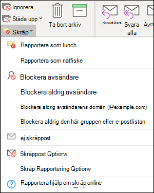
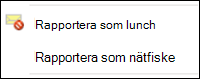
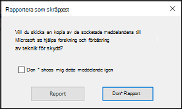
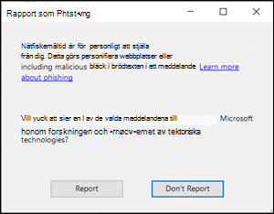
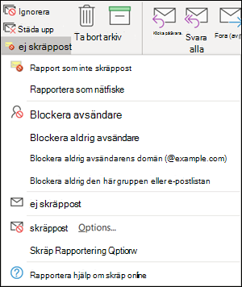
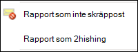
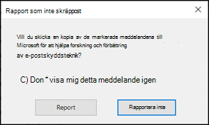

# <a name="install-and-use-the-junk-email-reporting-add-in-for-microsoft-outlook"></a><span data-ttu-id="bf243-103">Installera och använda tillägget Skräppostrapportering för Microsoft Outlook</span><span class="sxs-lookup"><span data-stu-id="bf243-103">Install and use the Junk Email Reporting add-in for Microsoft Outlook</span></span>

[!INCLUDE [Microsoft 365 Defender rebranding](../includes/microsoft-defender-for-office.md)]

<span data-ttu-id="bf243-104">**Gäller för**</span><span class="sxs-lookup"><span data-stu-id="bf243-104">**Applies to**</span></span>
- [<span data-ttu-id="bf243-105">Exchange Online Protection</span><span class="sxs-lookup"><span data-stu-id="bf243-105">Exchange Online Protection</span></span>](exchange-online-protection-overview.md)
- [<span data-ttu-id="bf243-106">Microsoft Defender för Office 365 Abonnemang 1 och Abonnemang 2</span><span class="sxs-lookup"><span data-stu-id="bf243-106">Microsoft Defender for Office 365 plan 1 and plan 2</span></span>](office-365-atp.md)
- [<span data-ttu-id="bf243-107">Microsoft 365 Defender</span><span class="sxs-lookup"><span data-stu-id="bf243-107">Microsoft 365 Defender</span></span>](../mtp/microsoft-threat-protection.md)

> [!NOTE]
> <span data-ttu-id="bf243-108">Om du inte använder tillägget Skräppostrapportering rekommenderar vi i stället [](enable-the-report-message-add-in.md) tilläggen [Rapportmeddelande](enable-the-report-phish-add-in.md) eller Rapport nätfiske.</span><span class="sxs-lookup"><span data-stu-id="bf243-108">If you aren't currently using the Junk E-mail Reporting add-in, we recommend the [Report Message add-in](enable-the-report-message-add-in.md) or the [Report Phishing add-in](enable-the-report-phish-add-in.md) instead.</span></span> <span data-ttu-id="bf243-109">Mer informations finns i [Anmäla meddelanden och filer till Microsoft](report-junk-email-messages-to-microsoft.md).</span><span class="sxs-lookup"><span data-stu-id="bf243-109">For more information, see [Report messages and files to Microsoft](report-junk-email-messages-to-microsoft.md).</span></span>

<span data-ttu-id="bf243-110">Med tillägget Skräppostrapportering för Microsoft Outlook kan användare skicka falska positiva meddelanden (bra e-post som har markerats som skräppost), falska negativa meddelanden (felaktig e-post tillåts) och nätfiskemeddelanden till Microsoft.</span><span class="sxs-lookup"><span data-stu-id="bf243-110">The Junk Email Reporting Add-in for Microsoft Outlook allows users to submit false positives (good email marked as spam), false negatives (bad email allowed) and phishing messages to Microsoft.</span></span> <span data-ttu-id="bf243-111">Om din organisation inte använder Exchange Online Protection (till exempel lokal Exchange eller andra e-posttjänster än Exchange Online) påverkar inte inskickingen av skräppostrapporten skräppostfiltreringen.</span><span class="sxs-lookup"><span data-stu-id="bf243-111">If your organization doesn't use Exchange Online Protection (for example, on-premises Exchange or email services other than Exchange Online), your junk email report submission will not affect your spam filtering.</span></span>

<span data-ttu-id="bf243-112">I det här avsnittet förklaras hur du installerar och använder tillägget Skräppostrapportering.</span><span class="sxs-lookup"><span data-stu-id="bf243-112">This topic explains how to install and use the Junk Email Reporting add-in.</span></span>

## <a name="what-do-you-need-to-know-before-you-begin"></a><span data-ttu-id="bf243-113">Vad behöver jag veta innan jag börjar?</span><span class="sxs-lookup"><span data-stu-id="bf243-113">What do you need to know before you begin?</span></span>

- <span data-ttu-id="bf243-114">Information om hur du installerar tillägget [](#install-the-junk-email-reporting-add-in) Skräppostrapportering finns i avsnittet Installera tillägget Skräppostrapportering senare i den här artikeln.</span><span class="sxs-lookup"><span data-stu-id="bf243-114">To install the Junk Email Reporting add-in, see the [Install the Junk Email Reporting add-in](#install-the-junk-email-reporting-add-in) section later in this article.</span></span>

- <span data-ttu-id="bf243-115">Tillägget Skräppostrapportering fungerar med följande versioner av Outlook:</span><span class="sxs-lookup"><span data-stu-id="bf243-115">The Junk Email Reporting add-in works with the following versions of Outlook:</span></span>

  - <span data-ttu-id="bf243-116">Outlook 2013 eller senare</span><span class="sxs-lookup"><span data-stu-id="bf243-116">Outlook 2013 or later</span></span>
  - <span data-ttu-id="bf243-117">Outlook ingår i Microsoft 365-program för företag</span><span class="sxs-lookup"><span data-stu-id="bf243-117">Outlook included with Microsoft 365 Apps for enterprise</span></span>

- <span data-ttu-id="bf243-118">Mer information om hur du rapporterar meddelanden till Microsoft finns [i Rapportera meddelanden och filer till Microsoft.](report-junk-email-messages-to-microsoft.md)</span><span class="sxs-lookup"><span data-stu-id="bf243-118">For more information about reporting messages to Microsoft, see [Report messages and files to Microsoft](report-junk-email-messages-to-microsoft.md).</span></span>

## <a name="use-the-junk-email-reporting-add-in-to-report-spam-and-phishing-messages"></a><span data-ttu-id="bf243-119">Använd tillägget Skräppostrapportering för att rapportera skräppost och nätfiskemeddelanden</span><span class="sxs-lookup"><span data-stu-id="bf243-119">Use the Junk Email Reporting add-in to report spam and phishing messages</span></span>

1. <span data-ttu-id="bf243-120">För meddelanden i Inkorgen eller någon annan e-postmapp utom Skräppost använder du någon av följande metoder för att rapportera skräppost och nätfiske:</span><span class="sxs-lookup"><span data-stu-id="bf243-120">For messages in the Inbox or any other email folder except Junk Email, use any of the following methods to report spam and phishing messages:</span></span>

   - <span data-ttu-id="bf243-121">Markera meddelandet eller öppna meddelandet.</span><span class="sxs-lookup"><span data-stu-id="bf243-121">Select the message or open the message.</span></span> <span data-ttu-id="bf243-122">Klicka på **Skräppost** **på fliken** Start eller Meddelande i **menyfliksområdet** och välj sedan Rapportera **som skräppost** eller Rapportera **som nätfiske.**</span><span class="sxs-lookup"><span data-stu-id="bf243-122">In the **Home** or **Message** tab in the ribbon, click **Junk**, and then select **Report as Junk** or **Report as Phishing**.</span></span>

     

   - <span data-ttu-id="bf243-124">Högerklicka på meddelandet, välj **Skräppost** och välj sedan **Rapportera som skräppost eller** Rapportera som **nätfiske.**</span><span class="sxs-lookup"><span data-stu-id="bf243-124">Right-click on the message, select **Junk**, and then select **Report as Junk** or **Report as Phishing**.</span></span>

     

   - <span data-ttu-id="bf243-126">Markera flera meddelanden, högerklicka och välj sedan Rapportera **som skräppost** eller Rapportera **som nätfiske.**</span><span class="sxs-lookup"><span data-stu-id="bf243-126">Select multiple messages, right-click, and then select **Report as Junk** or **Report as Phishing**.</span></span>

     

2. <span data-ttu-id="bf243-128">Läs informationen i dialogrutan som visas och klicka på **Rapport.**</span><span class="sxs-lookup"><span data-stu-id="bf243-128">In the dialog that appears, read the information and click **Report**.</span></span> <span data-ttu-id="bf243-129">Om du ändrar dig klickar du **på Rapportera inte.**</span><span class="sxs-lookup"><span data-stu-id="bf243-129">If you change your mind, click **Don't Report**.</span></span>

   

   

3. <span data-ttu-id="bf243-132">De valda meddelandena skickas till Microsoft för analys och:</span><span class="sxs-lookup"><span data-stu-id="bf243-132">The selected messages will be sent to Microsoft for analysis and:</span></span>

   - <span data-ttu-id="bf243-133">Flyttades till mappen Skräppost om den rapporterades som skräppost.</span><span class="sxs-lookup"><span data-stu-id="bf243-133">Moved to the Junk Email folder if it was reported as spam.</span></span>
   - <span data-ttu-id="bf243-134">Borttagna om de rapporterats som nätfiske.</span><span class="sxs-lookup"><span data-stu-id="bf243-134">Deleted if it was reported as phishing.</span></span>

   <span data-ttu-id="bf243-135">Bekräfta att meddelandena har skickats genom att öppna mappen **Skickat för** att visa skickade meddelanden.</span><span class="sxs-lookup"><span data-stu-id="bf243-135">To confirm that the messages have been submitted, open your **Sent Items** folder to view the submitted messages.</span></span>

## <a name="use-the-junk-email-reporting-add-in-to-report-non-spam-and-phishing-messages-from-the-junk-email-folder"></a><span data-ttu-id="bf243-136">Använd tillägget Skräppostrapportering för att rapportera icke skräppost- och nätfiskemeddelanden från mappen Skräppost</span><span class="sxs-lookup"><span data-stu-id="bf243-136">Use the Junk Email Reporting add-in to report non-spam and phishing messages from the Junk Email folder</span></span>

1. <span data-ttu-id="bf243-137">Använd någon av följande metoder i mappen Skräppost för att rapportera skräppost med falska positiva resultat eller nätfiskemeddelanden:</span><span class="sxs-lookup"><span data-stu-id="bf243-137">In the Junk Email folder, use any of the following methods to report spam false positives or phishing messages:</span></span>

   - <span data-ttu-id="bf243-138">Markera meddelandet eller öppna meddelandet.</span><span class="sxs-lookup"><span data-stu-id="bf243-138">Select the message or open the message.</span></span> <span data-ttu-id="bf243-139">Klicka på **Inte** skräppost **på** fliken Start eller Meddelande i menyfliksområdet och välj sedan Rapporten **som** Inte skräppost eller Rapportera **som nätfiske.**</span><span class="sxs-lookup"><span data-stu-id="bf243-139">In the **Home** or **Message** tab in the ribbon, click **Not Junk**, and then select **Report as Not Junk** or **Report as Phishing**.</span></span>

     

   - <span data-ttu-id="bf243-141">Högerklicka på meddelandet, klicka på **Skräppost** och välj sedan **Rapportera som** Inte skräppost eller Rapportera **som nätfiske.**</span><span class="sxs-lookup"><span data-stu-id="bf243-141">Right-click on the message, click **Junk**, and then select **Report as Not Junk** or **Report as Phishing**.</span></span>

     

   - <span data-ttu-id="bf243-143">Markera flera meddelanden, högerklicka och välj sedan Rapportera som Inte **skräppost** eller **Rapportera som nätfiske.**</span><span class="sxs-lookup"><span data-stu-id="bf243-143">Select multiple messages, right-click, and then select **Report as Not Junk** or **Report as Phishing**.</span></span>

     

2. <span data-ttu-id="bf243-145">Läs informationen i dialogrutan som visas och klicka på **Rapport.**</span><span class="sxs-lookup"><span data-stu-id="bf243-145">In the dialog that appears, read the information and click **Report**.</span></span> <span data-ttu-id="bf243-146">Om du ändrar dig klickar du **på Rapportera inte.**</span><span class="sxs-lookup"><span data-stu-id="bf243-146">If you change your mind, click **Don't Report**.</span></span>

   

   

3. <span data-ttu-id="bf243-149">De valda meddelandena skickas till Microsoft för analys och:</span><span class="sxs-lookup"><span data-stu-id="bf243-149">The selected messages will be sent to Microsoft for analysis and:</span></span>

   - <span data-ttu-id="bf243-150">Flyttades till mappen Skräppost om den rapporterades som skräppost.</span><span class="sxs-lookup"><span data-stu-id="bf243-150">Moved to the Junk Email folder if it was reported as spam.</span></span>
   - <span data-ttu-id="bf243-151">Borttagna om de rapporterats som nätfiske.</span><span class="sxs-lookup"><span data-stu-id="bf243-151">Deleted if it was reported as phishing.</span></span>

   <span data-ttu-id="bf243-152">Bekräfta att meddelandena har skickats genom att öppna mappen **Skickat för** att visa skickade meddelanden.</span><span class="sxs-lookup"><span data-stu-id="bf243-152">To confirm that the messages have been submitted, open your **Sent Items** folder to view the submitted messages.</span></span>

## <a name="install-the-junk-email-reporting-add-in"></a><span data-ttu-id="bf243-153">Installera tillägget Skräppostrapportering</span><span class="sxs-lookup"><span data-stu-id="bf243-153">Install the Junk Email Reporting add-in</span></span>

- <span data-ttu-id="bf243-154">Du måste ha administratörsbehörighet på den dator där du installerar tillägget.</span><span class="sxs-lookup"><span data-stu-id="bf243-154">You need to have administrator privileges on the computer where you're installing the add-in.</span></span>

- <span data-ttu-id="bf243-155">Gå till <https://www.microsoft.com/download/details.aspx?id=18275> och ladda ned lämplig MSI-fil för din version av Office till en plats som är lätt att hitta:</span><span class="sxs-lookup"><span data-stu-id="bf243-155">Go to <https://www.microsoft.com/download/details.aspx?id=18275> and download the appropriate .msi file for your version of Office to a location that's easy to find:</span></span>

  - <span data-ttu-id="bf243-156">**32-bitars:**`Junk Reporting Add-in for Office 2007, 2010, 2013, and 2016 (32-bit).msi`</span><span class="sxs-lookup"><span data-stu-id="bf243-156">**32-bit**: `Junk Reporting Add-in for Office 2007, 2010, 2013, and 2016 (32-bit).msi`</span></span>
  - <span data-ttu-id="bf243-157">**64-bitars:**`Junk Reporting Add-in for Office 2007, 2010, 2013, and 2016 (64-bit).msi`</span><span class="sxs-lookup"><span data-stu-id="bf243-157">**64-bit**: `Junk Reporting Add-in for Office 2007, 2010, 2013, and 2016 (64-bit).msi`</span></span>

- <span data-ttu-id="bf243-158">För Outlook 2013 eller senare är Microsoft .NET Framework 2.0 den enda förutsättningen.</span><span class="sxs-lookup"><span data-stu-id="bf243-158">For Outlook 2013 or later, the only prerequisite is the Microsoft .NET Framework 2.0.</span></span> <span data-ttu-id="bf243-159">I Windows 10 kan du inte installera .NET Framework 2.0 från en nedladdning.</span><span class="sxs-lookup"><span data-stu-id="bf243-159">In Windows 10, you don't install the .NET Framework 2.0 from a download.</span></span>

### <a name="install-the-junk-email-reporting-add-in-using-the-setup-wizard"></a><span data-ttu-id="bf243-160">Installera tillägget Skräppostrapportering med hjälp av installationsguiden</span><span class="sxs-lookup"><span data-stu-id="bf243-160">Install the Junk Email Reporting Add-in using the Setup wizard</span></span>

1. <span data-ttu-id="bf243-161">Stäng Outlook på datorn.</span><span class="sxs-lookup"><span data-stu-id="bf243-161">On your computer, close Outlook.</span></span>

2. <span data-ttu-id="bf243-162">Kontrollera att .NET Framework 2.0 är aktiverat i Windows 10.</span><span class="sxs-lookup"><span data-stu-id="bf243-162">In Windows 10, verify the .NET Framework 2.0 is enabled.</span></span> <span data-ttu-id="bf243-163">Instruktioner finns i [Aktivera .NET Framework 3.5 på Kontrollpanelen.](https://docs.microsoft.com/dotnet/framework/install/dotnet-35-windows-10#enable-the-net-framework-35-in-control-panel)</span><span class="sxs-lookup"><span data-stu-id="bf243-163">For instructions, see [Enable the .NET Framework 3.5 in Control Panel](https://docs.microsoft.com/dotnet/framework/install/dotnet-35-windows-10#enable-the-net-framework-35-in-control-panel).</span></span>

3. <span data-ttu-id="bf243-164">Leta upp .msi-filen som du laddade ned och dubbelklicka på den.</span><span class="sxs-lookup"><span data-stu-id="bf243-164">Locate the .msi file you downloaded and double-click on it.</span></span>

4. <span data-ttu-id="bf243-165">På sidan **Välkommen till installationsprogrammet för rapportering av** skräppost för Microsoft klickar du på **Nästa.**</span><span class="sxs-lookup"><span data-stu-id="bf243-165">On the **Welcome to Microsoft Junk Email Reporting Add-in Setup** page, click **Next**.</span></span>

5. <span data-ttu-id="bf243-166">Granska licensavtalet, klicka **på Jag accepterar villkoren i licensavtalet** om du godkänner villkoren och klicka sedan på **Nästa.**</span><span class="sxs-lookup"><span data-stu-id="bf243-166">Review the license agreement, click **I accept the terms in the License Agreement** if you agree to the terms, and then click **Next**.</span></span>

6. <span data-ttu-id="bf243-167">Klicka på Slutför när guiden är **klar.**</span><span class="sxs-lookup"><span data-stu-id="bf243-167">When the wizard is complete, click **Finish**.</span></span>

<span data-ttu-id="bf243-168">Starta Outlook.</span><span class="sxs-lookup"><span data-stu-id="bf243-168">Start Outlook.</span></span>

<span data-ttu-id="bf243-169">Leta efter knappen **Skräppost** i menyfliksområdet i Outlook.</span><span class="sxs-lookup"><span data-stu-id="bf243-169">Look for the **Junk** button on your Outlook ribbon.</span></span> <span data-ttu-id="bf243-170">Nu kan du rapportera skräppost till Microsoft genom att markera skräppostmeddelanden i Inkorgen och klicka på **knappen Rapportera** skräppost.</span><span class="sxs-lookup"><span data-stu-id="bf243-170">You can now report junk email messages to Microsoft by selecting the junk email messages in your Inbox and clicking the **Report Junk** button.</span></span>

<span data-ttu-id="bf243-171">Välj nedåtpilen bredvid skräppost för **fler** alternativ, till exempel Rapport som **nätfiske** om du vill rapportera nätfiskemeddelanden till Microsoft.</span><span class="sxs-lookup"><span data-stu-id="bf243-171">Choose the down arrow next to **Junk** for more options such as **Report as Phishing** if you want to report phishing scam emails to Microsoft.</span></span> <span data-ttu-id="bf243-172">I skräppostmappen kan du också markera **Rapportera** inte skräppost om ett e-postmeddelande felaktigt identifierats som skräppost.</span><span class="sxs-lookup"><span data-stu-id="bf243-172">In your junk mail folder, you can also select, **Report not junk** if an email was incorrectly identified as junk mail.</span></span>

### <a name="install-the-junk-email-reporting-add-in-using-silent-mode"></a><span data-ttu-id="bf243-173">Installera rapportering av skräppost i Add-In tyst läge</span><span class="sxs-lookup"><span data-stu-id="bf243-173">Install the Junk Email Reporting Add-In using Silent Mode</span></span>

1. <span data-ttu-id="bf243-174">Stäng Outlook på datorn.</span><span class="sxs-lookup"><span data-stu-id="bf243-174">On your computer, close Outlook.</span></span>

2. <span data-ttu-id="bf243-175">Installera .NET Framework 2.0 i Windows 10 genom att köra följande kommando:</span><span class="sxs-lookup"><span data-stu-id="bf243-175">In Windows 10, install the .NET Framework 2.0 by running the following command:</span></span>

   ```dos
   DISM /Online /Enable-Feature /FeatureName:NetFx3 /All
   ```

3. <span data-ttu-id="bf243-176">Om du vill installera tillägget utan interaktion med användarna öppnar du kommandotolken och använder följande syntax:</span><span class="sxs-lookup"><span data-stu-id="bf243-176">To install the add-in without any user interaction, open a Command Prompt and use the following syntax:</span></span>

   ```dos
   msiexec /qn /i "<PathToMSIFile>\<MSIFile>" [MaxMessageSelection=<1-50>] [BccEmailAddress="<EmailAddress1>; <EmailAddress2>"...]
   ```

   - <span data-ttu-id="bf243-177">`MaxMessageSelection` anger det maximala antalet meddelanden som du kan välja för en enskild inskickning.</span><span class="sxs-lookup"><span data-stu-id="bf243-177">`MaxMessageSelection` specifies the maximum number of messages that you can select for a single submission.</span></span> <span data-ttu-id="bf243-178">Giltiga värden är 1 till 50.</span><span class="sxs-lookup"><span data-stu-id="bf243-178">Valid values are from 1 to 50.</span></span> <span data-ttu-id="bf243-179">Standardvärdet är 15.</span><span class="sxs-lookup"><span data-stu-id="bf243-179">The default value is 15.</span></span>

   - <span data-ttu-id="bf243-180">`BccEmailAddress` ytterligare mottagare av hemlig kopia som ska få en kopia av alla användarinskickningar.</span><span class="sxs-lookup"><span data-stu-id="bf243-180">`BccEmailAddress` specifies additional Bcc recipients who will receive a copy of all user submissions.</span></span> <span data-ttu-id="bf243-181">Standardvärdet är tomt (inga ytterligare mottagare av Hemlig kopia).</span><span class="sxs-lookup"><span data-stu-id="bf243-181">The default value is blank (no additional Bcc recipients).</span></span>

   <span data-ttu-id="bf243-182">I det här exemplet installeras 64-bitarsversionen av tillägget från den angivna sökvägen med standardinställningarna.</span><span class="sxs-lookup"><span data-stu-id="bf243-182">This example installs the 64-bit version of the add-in from the specified path with the default settings.</span></span>

   ```dos
   msiexec /qn /i "C:\Downloads\Junk Reporting Add-in for Office 2007, 2010, 2013, and 2016 (64-bit).msi"
   ```

   <span data-ttu-id="bf243-183">I det här exemplet installeras 32-bitarsversionen av tillägget från den angivna sökvägen med följande ytterligare inställningar:</span><span class="sxs-lookup"><span data-stu-id="bf243-183">This example installs the 32-bit version of the add-in from the specified path with the following additional settings:</span></span>

   - <span data-ttu-id="bf243-184">Upp till 20 meddelanden kan väljas i en enda inskickning.</span><span class="sxs-lookup"><span data-stu-id="bf243-184">Up to 20 messages can be selected in a single submission.</span></span>
   - <span data-ttu-id="bf243-185">junkreports@contoso.com och hollyd@treyresearch.net ta emot hemlig kopia av alla bidrag.</span><span class="sxs-lookup"><span data-stu-id="bf243-185">junkreports@contoso.com and hollyd@treyresearch.net receive Bcc copies of all submissions.</span></span>

   ```dos
   msiexec /qn /i "C:\Downloads\Junk Reporting Add-in for Office 2007, 2010, 2013, and 2016 (32-bit).msi" MaxMessageSelection=20 BccEmailAddress="junkreports@contoso.com; hollyd@treyresearch.net"
   ```

### <a name="how-do-you-know-this-worked"></a><span data-ttu-id="bf243-186">Hur vet du att det fungerade?</span><span class="sxs-lookup"><span data-stu-id="bf243-186">How do you know this worked?</span></span>

<span data-ttu-id="bf243-187">Kontrollera att du har installerat tillägget Skräppostrapportering genom att göra något av följande i Outlook:</span><span class="sxs-lookup"><span data-stu-id="bf243-187">To verify that you've successfully installed the Junk Email Reporting Add-in, do the any of the following steps in Outlook:</span></span>

- <span data-ttu-id="bf243-188">Markera meddelandet eller öppna meddelandet.</span><span class="sxs-lookup"><span data-stu-id="bf243-188">Select the message or open the message.</span></span> <span data-ttu-id="bf243-189">Klicka på **Skräppost** **på fliken** Start eller Meddelande **i** menyfliksområdet och kontrollera att följande alternativ är tillgängliga:</span><span class="sxs-lookup"><span data-stu-id="bf243-189">In the **Home** or **Message** tab in the ribbon, click **Junk**, and verify that the following options are available:</span></span>

  - <span data-ttu-id="bf243-190">**Rapportera som skräppost**</span><span class="sxs-lookup"><span data-stu-id="bf243-190">**Report as Junk**</span></span>
  - <span data-ttu-id="bf243-191">**Rapportera som nätfiske**</span><span class="sxs-lookup"><span data-stu-id="bf243-191">**Report as Phishing**</span></span>
  - <span data-ttu-id="bf243-192">**Alternativ för skräppostrapportering**</span><span class="sxs-lookup"><span data-stu-id="bf243-192">**Junk Reporting Options**</span></span>
  - <span data-ttu-id="bf243-193">**Rapportera hjälp för Skräppost online**</span><span class="sxs-lookup"><span data-stu-id="bf243-193">**Report Junk Online Help**</span></span>

  

- <span data-ttu-id="bf243-195">Högerklicka på meddelandet, välj **Skräppost** och kontrollera att följande alternativ är tillgängliga:</span><span class="sxs-lookup"><span data-stu-id="bf243-195">Right-click on the message, select **Junk**, and verify that the following options are available:</span></span>

  - <span data-ttu-id="bf243-196">**Rapportera som skräppost**</span><span class="sxs-lookup"><span data-stu-id="bf243-196">**Report as Junk**</span></span>
  - <span data-ttu-id="bf243-197">**Rapportera som nätfiske**</span><span class="sxs-lookup"><span data-stu-id="bf243-197">**Report as Phishing**</span></span>
  - <span data-ttu-id="bf243-198">**Alternativ för skräppostrapportering**</span><span class="sxs-lookup"><span data-stu-id="bf243-198">**Junk Reporting Options**</span></span>
  - <span data-ttu-id="bf243-199">**Rapportera hjälp för Skräppost online**</span><span class="sxs-lookup"><span data-stu-id="bf243-199">**Report Junk Online Help**</span></span>

  

- <span data-ttu-id="bf243-201">Markera flera meddelanden, högerklicka och kontrollera att följande alternativ är tillgängliga:</span><span class="sxs-lookup"><span data-stu-id="bf243-201">Select multiple messages, right click, and verify that the following options are available:</span></span>

  - <span data-ttu-id="bf243-202">**Rapportera som skräppost**</span><span class="sxs-lookup"><span data-stu-id="bf243-202">**Report as Junk**</span></span>
  - <span data-ttu-id="bf243-203">**Rapportera som nätfiske**</span><span class="sxs-lookup"><span data-stu-id="bf243-203">**Report as Phishing**</span></span>

  

- <span data-ttu-id="bf243-205">Gör de föregående åtgärderna i **mappen Skräppost** och kontrollera att de **tidigare** alternativen för skräppostrapportering nu är **Inte skräppost.**</span><span class="sxs-lookup"><span data-stu-id="bf243-205">Do the previous actions in the **Junk Email** folder and verify the previous **Junk** reporting options are now **Not Junk**.</span></span>

  

  

  

## <a name="uninstall-the-junk-email-reporting-add-in"></a><span data-ttu-id="bf243-209">Avinstallera tillägget Skräppostrapportering</span><span class="sxs-lookup"><span data-stu-id="bf243-209">Uninstall the Junk Email Reporting Add-in</span></span>

<span data-ttu-id="bf243-210">När du stänger Outlook kan du använda någon av följande procedurer för att avinstallera tillägget Skräppostrapportering:</span><span class="sxs-lookup"><span data-stu-id="bf243-210">After you close Outlook, use any of the following procedures to uninstall the Junk Email Reporting Add-in:</span></span>

- <span data-ttu-id="bf243-211">**Kontrollpanelen:** Tryck på Windows-tangenten + R. I dialogrutan **Kör** som öppnas anger du och `control appwiz.cpl` klickar sedan på **OK.**</span><span class="sxs-lookup"><span data-stu-id="bf243-211">**Control Panel**: Press the Windows key + R. In the **Run** dialog that opens, enter `control appwiz.cpl` and then click **OK**.</span></span>

  <span data-ttu-id="bf243-212">Leta upp och **välj tillägget Microsoft Skräppostrapportering** i listan och klicka sedan på **Avinstallera.**</span><span class="sxs-lookup"><span data-stu-id="bf243-212">Find and select **Microsoft Junk Email Reporting Add-in** in the list, and then click **Uninstall**.</span></span>

- <span data-ttu-id="bf243-213">**Windows Installer paket:** Hitta eller hämta lämplig .msi-fil och dubbelklicka på den.</span><span class="sxs-lookup"><span data-stu-id="bf243-213">**Windows Installer package**: Find or download the appropriate .msi file, and double-click on it.</span></span>

  - <span data-ttu-id="bf243-214">**32-bitars:**`Junk Reporting Add-in for Office 2007, 2010, 2013, and 2016 (32-bit).msi`</span><span class="sxs-lookup"><span data-stu-id="bf243-214">**32-bit**: `Junk Reporting Add-in for Office 2007, 2010, 2013, and 2016 (32-bit).msi`</span></span>

  - <span data-ttu-id="bf243-215">**64-bitars:**`Junk Reporting Add-in for Office 2007, 2010, 2013, and 2016 (64-bit).msi`</span><span class="sxs-lookup"><span data-stu-id="bf243-215">**64-bit**: `Junk Reporting Add-in for Office 2007, 2010, 2013, and 2016 (64-bit).msi`</span></span>

  <span data-ttu-id="bf243-216">I dialogrutan som visas väljer du **Ta bort microsoft-tillägget Skräppostrapportering för Outlook och** klickar sedan på **Nästa.**</span><span class="sxs-lookup"><span data-stu-id="bf243-216">In the dialog that appears, select **Remove Microsoft Junk Email Reporting Add-in for Outlook** and then click **Next**.</span></span>

- <span data-ttu-id="bf243-217">**Tyst läge:** Hitta eller hämta lämplig MSI-fil.</span><span class="sxs-lookup"><span data-stu-id="bf243-217">**Silent Mode**: Find or download the appropriate .msi file.</span></span> <span data-ttu-id="bf243-218">I kommandotolken ersätter du med MSI-filens plats \<PathToFile\> och kör något av följande kommandon:</span><span class="sxs-lookup"><span data-stu-id="bf243-218">In a Command Prompt window, replace \<PathToFile\> with the location of the .msi file, and run one of the following commands:</span></span>

  - <span data-ttu-id="bf243-219">**32-bitars:**</span><span class="sxs-lookup"><span data-stu-id="bf243-219">**32-bit**:</span></span>

    ```dos
    msiexec /x "<PathToFile>\Junk Reporting Add-in for Office 2007, 2010, 2013, and 2016 (32-bit).msi" /qn MSIRESTARTMANAGERCONTROL="DisableShutdown"
    ```

  - <span data-ttu-id="bf243-220">**64-bitars:**</span><span class="sxs-lookup"><span data-stu-id="bf243-220">**64-bit**:</span></span>

    ```dos
    msiexec /x "<PathToFile>\Junk Reporting Add-in for Office 2007, 2010, 2013, and 2016 (64-bit).msi" /qn MSIRESTARTMANAGERCONTROL="DisableShutdown"
    ```

<span data-ttu-id="bf243-221">När du öppnar Outlook efter avinstallationen ska alternativen för skräppost, inte skräppost och nätfiskerapportering vara borta.</span><span class="sxs-lookup"><span data-stu-id="bf243-221">When you open Outlook after the uninstall, the junk, not junk, and phishing reporting options should be gone.</span></span>

## <a name="troubleshooting-the-junk-email-reporting-add-in"></a><span data-ttu-id="bf243-222">Felsöka tillägget Skräppostrapportering</span><span class="sxs-lookup"><span data-stu-id="bf243-222">Troubleshooting the Junk Email Reporting add-in</span></span>

<span data-ttu-id="bf243-223">Ibland kan du uppleva problem med Outlook när du har lagt till tillägget Skräppostrapportering.</span><span class="sxs-lookup"><span data-stu-id="bf243-223">Occasionally, you might experience trouble with Outlook after adding the Junk Email Reporting Add-In.</span></span> <span data-ttu-id="bf243-224">I det här avsnittet beskrivs problem som du kan stöta på samt tips för att lösa problemen.</span><span class="sxs-lookup"><span data-stu-id="bf243-224">This section describes problems that you might encounter, along with tips for resolving these issues.</span></span>

### <a name="troubleshooting-for-users"></a><span data-ttu-id="bf243-225">Felsökning för användare</span><span class="sxs-lookup"><span data-stu-id="bf243-225">Troubleshooting for users</span></span>

<span data-ttu-id="bf243-226">Du får ett eller flera av följande problem:</span><span class="sxs-lookup"><span data-stu-id="bf243-226">You experience one or more of the following problems:</span></span>

- <span data-ttu-id="bf243-227">Inget händer när du klickar **på Rapportera skräppost**</span><span class="sxs-lookup"><span data-stu-id="bf243-227">Nothing happens when you click **Report Junk**</span></span>
- <span data-ttu-id="bf243-228">Outlook slutar svara när du har valt ett e-postmeddelande</span><span class="sxs-lookup"><span data-stu-id="bf243-228">Outlook stops responding after you select an email message</span></span>
- <span data-ttu-id="bf243-229">Rapporterad skräppost kan inte levereras på grund av ett "olevererbart" svar</span><span class="sxs-lookup"><span data-stu-id="bf243-229">Reported junk mail cannot be delivered due to an "undeliverable" reply</span></span>

<span data-ttu-id="bf243-230">Lös problemet genom att göra följande:</span><span class="sxs-lookup"><span data-stu-id="bf243-230">To fix this problem, do the following steps:</span></span>

1. <span data-ttu-id="bf243-231">Stäng och starta om Outlook.</span><span class="sxs-lookup"><span data-stu-id="bf243-231">Close and restart Outlook.</span></span>
2. <span data-ttu-id="bf243-232">Skapa och skicka ett testmeddelande och kontrollera att mottagaren har fått meddelandet.</span><span class="sxs-lookup"><span data-stu-id="bf243-232">Create and send a test message, and verify that the recipient received the message.</span></span>
3. <span data-ttu-id="bf243-233">Kontakta administratören om problemet kvarstår.</span><span class="sxs-lookup"><span data-stu-id="bf243-233">If the problem persists, contact your admin.</span></span>

<span data-ttu-id="bf243-234">Information om andra metoder som du kan använda för att skicka meddelanden till Microsoft finns i [Rapportera meddelanden och filer till Microsoft.](report-junk-email-messages-to-microsoft.md)</span><span class="sxs-lookup"><span data-stu-id="bf243-234">For other methods that you can use to submit messages to Microsoft, see [Report messages and files to Microsoft](report-junk-email-messages-to-microsoft.md).</span></span>

### <a name="troubleshooting-for-admins"></a><span data-ttu-id="bf243-235">Felsökning för administratörer</span><span class="sxs-lookup"><span data-stu-id="bf243-235">Troubleshooting for admins</span></span>

#### <a name="problem-an-error-message-continually-appears-that-asks-users-to-contact-their-system-administrator"></a><span data-ttu-id="bf243-236">Problem: Ett felmeddelande visas kontinuerligt som ber användarna att kontakta sina systemadministratör</span><span class="sxs-lookup"><span data-stu-id="bf243-236">Problem: An error message continually appears that asks users to contact their system administrator</span></span>

1. <span data-ttu-id="bf243-237">Verifiera eller ange `LoggingLevel` registernyckeln till värdet "Utförlig":</span><span class="sxs-lookup"><span data-stu-id="bf243-237">Verify or set the `LoggingLevel` registry key to the value "Verbose":</span></span>

   - <span data-ttu-id="bf243-238">**32-bitars Outlook på 32-bitars Windows:**</span><span class="sxs-lookup"><span data-stu-id="bf243-238">**32-bit Outlook on 32-bit Windows**:</span></span>

     ```text
     Windows Registry Editor Version 5.00

     [HKEY_LOCAL_MACHINE\Software\Microsoft\Junk Email Reporting\Addins]
     "LoggingLevel"="Verbose"
     ```

   - <span data-ttu-id="bf243-239">**32-bitars Outlook på 64-bitars Windows:**</span><span class="sxs-lookup"><span data-stu-id="bf243-239">**32-bit Outlook on 64-bit Windows**:</span></span>

     ```text
     Windows Registry Editor Version 5.00

     [HKEY_LOCAL_MACHINE\Software\Wow6432Node\Microsoft\Junk Email Reporting\Addins]
     "LoggingLevel"="Verbose"
     ```

   - <span data-ttu-id="bf243-240">**64-bitars Outlook:**</span><span class="sxs-lookup"><span data-stu-id="bf243-240">**64-bit Outlook**:</span></span>

     ```text
     Windows Registry Editor Version 5.00

     [HKEY_LOCAL_MACHINE\Software\Microsoft\Junk E-mail Reporting\Addins]
     "LoggingLevel"="Verbose"
     ```

2. <span data-ttu-id="bf243-241">Starta om Outlook och be användarna att rapportera när de ser felmeddelandet.</span><span class="sxs-lookup"><span data-stu-id="bf243-241">Restart Outlook and ask users to report back when they see the error message.</span></span>

3. <span data-ttu-id="bf243-242">Samla in logginformationen som finns på följande plats:</span><span class="sxs-lookup"><span data-stu-id="bf243-242">Collect the log information found at the following location:</span></span>

   `%LOCALAPPDATA%\Microsoft\Junk Email Reporting Add-in\SpamReporterAddinLog.txt`

4. <span data-ttu-id="bf243-243">Kontakta den tekniska supporten för Exchange Online Protection och ge dem logginformationen.</span><span class="sxs-lookup"><span data-stu-id="bf243-243">Contact Exchange Online Protection Technical Support and provide them with the log information.</span></span>

#### <a name="problem-users-selected-not-to-receive-a-confirmation-prompt-when-they-report-messages-and-now-they-want-the-prompt-back"></a><span data-ttu-id="bf243-244">Problem: Användarna valde att inte få någon bekräftelsefråga när de rapporterar meddelanden, och nu vill de få tillbaka uppmaningen</span><span class="sxs-lookup"><span data-stu-id="bf243-244">Problem: Users selected not to receive a confirmation prompt when they report messages, and now they want the prompt back</span></span>

1. <span data-ttu-id="bf243-245">Skapa `ConfirmReportJunk` registernyckeln med värdet "True":</span><span class="sxs-lookup"><span data-stu-id="bf243-245">Create the `ConfirmReportJunk`registry key with the value "True":</span></span>

   ```text
   Windows Registry Editor Version 5.00

   HKEY_CURRENT_USER\Software\Microsoft\Junk E-mail Reporting\Preferences]
   "ConfirmReportJunk"="True"
   ```

2. <span data-ttu-id="bf243-246">Starta om Outlook.</span><span class="sxs-lookup"><span data-stu-id="bf243-246">Restart Outlook.</span></span>
