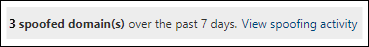

# <a name="spoof-intelligence-insight-in-eop"></a><span data-ttu-id="d2532-103">Falska intelligensinsikter i EOP</span><span class="sxs-lookup"><span data-stu-id="d2532-103">Spoof intelligence insight in EOP</span></span>

[!INCLUDE [Microsoft 365 Defender rebranding](../includes/microsoft-defender-for-office.md)]

<span data-ttu-id="d2532-104">**Gäller för**</span><span class="sxs-lookup"><span data-stu-id="d2532-104">**Applies to**</span></span>
- [<span data-ttu-id="d2532-105">Exchange Online Protection</span><span class="sxs-lookup"><span data-stu-id="d2532-105">Exchange Online Protection</span></span>](exchange-online-protection-overview.md)
- [<span data-ttu-id="d2532-106">Microsoft Defender för Office 365 Abonnemang 1 och Abonnemang 2</span><span class="sxs-lookup"><span data-stu-id="d2532-106">Microsoft Defender for Office 365 plan 1 and plan 2</span></span>](defender-for-office-365.md)
- [<span data-ttu-id="d2532-107">Microsoft 365 Defender</span><span class="sxs-lookup"><span data-stu-id="d2532-107">Microsoft 365 Defender</span></span>](../defender/microsoft-365-defender.md)

> [!NOTE]
> <span data-ttu-id="d2532-108">Funktionerna som beskrivs i den här artikeln är förhandsversioner, kan komma att ändras och är inte tillgängliga i alla organisationer.</span><span class="sxs-lookup"><span data-stu-id="d2532-108">The features described in this article are in Preview, are subject to change, and are not available in all organizations.</span></span> <span data-ttu-id="d2532-109">Om organisationen inte har de funktioner som beskrivs i den här artikeln kan du läsa den äldre hanteringsupplevelsen för förfalskning på Hantera [förfalskningsavsändare](walkthrough-spoof-intelligence-insight.md)med hjälp av förfalsknings- och förfalskningsinformation i EOP.</span><span class="sxs-lookup"><span data-stu-id="d2532-109">If your organization does not have the features described in this article, see the older spoof management experience at [Manage spoofed senders using the spoof intelligence policy and spoof intelligence insight in EOP](walkthrough-spoof-intelligence-insight.md).</span></span>

<span data-ttu-id="d2532-110">I Microsoft 365 organisationer med postlådor i Exchange Online eller fristående EOP-organisationer (Exchange Online Protection) utan Exchange Online-postlådor skyddas inkommande e-postmeddelanden automatiskt mot förfalskning.</span><span class="sxs-lookup"><span data-stu-id="d2532-110">In Microsoft 365 organizations with mailboxes in Exchange Online or standalone Exchange Online Protection (EOP) organizations without Exchange Online mailboxes, inbound email messages are automatically protected against spoofing.</span></span> <span data-ttu-id="d2532-111">EOP använder **förfalskningsinformation som** en del av organisationens totala skydd mot nätfiske.</span><span class="sxs-lookup"><span data-stu-id="d2532-111">EOP uses **spoof intelligence** as part of your organization's overall defense against phishing.</span></span> <span data-ttu-id="d2532-112">Mer information finns i [Skydd mot förfalskning i EOP.](anti-spoofing-protection.md)</span><span class="sxs-lookup"><span data-stu-id="d2532-112">For more information, see [Anti-spoofing protection in EOP](anti-spoofing-protection.md).</span></span>

<span data-ttu-id="d2532-113">När en avsändare kapar en e-postadress verkar det vara en användare i en av organisationens domäner eller en användare i en extern domän som skickar e-post till organisationen.</span><span class="sxs-lookup"><span data-stu-id="d2532-113">When a sender spoofs an email address, they appear to be a user in one of your organization's domains, or a user in an external domain that sends email to your organization.</span></span> <span data-ttu-id="d2532-114">Attacker som förfalskning av avsändare för att skicka skräppost eller nätfiske måste blockeras.</span><span class="sxs-lookup"><span data-stu-id="d2532-114">Attackers who spoof senders to send spam or phishing email need to be blocked.</span></span> <span data-ttu-id="d2532-115">Men det finns situationer där legitima avsändare är förfalskning.</span><span class="sxs-lookup"><span data-stu-id="d2532-115">But there are scenarios where legitimate senders are spoofing.</span></span> <span data-ttu-id="d2532-116">Till exempel:</span><span class="sxs-lookup"><span data-stu-id="d2532-116">For example:</span></span>

- <span data-ttu-id="d2532-117">Legitima scenarier för förfalskning av interna domäner:</span><span class="sxs-lookup"><span data-stu-id="d2532-117">Legitimate scenarios for spoofing internal domains:</span></span>
  - <span data-ttu-id="d2532-118">Avsändare från tredje part använder din domän för att skicka massutskick till dina egna anställda för företags omröstningar.</span><span class="sxs-lookup"><span data-stu-id="d2532-118">Third-party senders use your domain to send bulk mail to your own employees for company polls.</span></span>
  - <span data-ttu-id="d2532-119">Ett externt företag genererar och skickar reklam- eller produktuppdateringar åt dig.</span><span class="sxs-lookup"><span data-stu-id="d2532-119">An external company generates and sends advertising or product updates on your behalf.</span></span>
  - <span data-ttu-id="d2532-120">En assistent behöver regelbundet skicka e-post till en annan person i din organisation.</span><span class="sxs-lookup"><span data-stu-id="d2532-120">An assistant regularly needs to send email for another person within your organization.</span></span>
  - <span data-ttu-id="d2532-121">Ett internt program skickar e-postaviseringar.</span><span class="sxs-lookup"><span data-stu-id="d2532-121">An internal application sends email notifications.</span></span>

- <span data-ttu-id="d2532-122">Legitima scenarier för förfalskning av externa domäner:</span><span class="sxs-lookup"><span data-stu-id="d2532-122">Legitimate scenarios for spoofing external domains:</span></span>
  - <span data-ttu-id="d2532-123">Avsändaren finns på en distributionslista (kallas även diskussionslista) och distributionslistan vidarebefordrar e-post från den ursprungliga avsändaren till alla deltagare på distributionslistan.</span><span class="sxs-lookup"><span data-stu-id="d2532-123">The sender is on a mailing list (also known as a discussion list), and the mailing list relays email from the original sender to all the participants on the mailing list.</span></span>
  - <span data-ttu-id="d2532-124">Ett externt företag skickar e-post åt ett annat företag (till exempel en automatiserad rapport eller ett företag som använder en programvara).</span><span class="sxs-lookup"><span data-stu-id="d2532-124">An external company sends email on behalf of another company (for example, an automated report or a software-as-a-service company).</span></span>

<span data-ttu-id="d2532-125">Du kan  använda förfalskningsinformation i Microsoft 365 Defender-portalen för att snabbt identifiera förfalskningsavsändare som på ett legitimt sätt skickar oauthenticerad e-post (meddelanden från domäner som inte klarar SPF-, DKIM- eller DMARC-kontroller) och manuellt tillåter dessa avsändare.</span><span class="sxs-lookup"><span data-stu-id="d2532-125">You can use the **spoof intelligence insight** in the Microsoft 365 Defender portal to quickly identify spoofed senders who are legitimately sending you unauthenticated email (messages from domains that don't pass SPF, DKIM, or DMARC checks), and manually allow those senders.</span></span>

<span data-ttu-id="d2532-126">Genom att tillåta kända avsändare att skicka falska meddelanden från kända platser kan du minska falska positiva resultat (bra e-postmeddelande markerat som dåligt).</span><span class="sxs-lookup"><span data-stu-id="d2532-126">By allowing known senders to send spoofed messages from known locations, you can reduce false positives (good email marked as bad).</span></span> <span data-ttu-id="d2532-127">Genom att övervaka tillåtna förfalskningsavsändare tillhandahåller du ytterligare en säkerhetsnivå för att förhindra att osäkra meddelanden kommer till organisationen.</span><span class="sxs-lookup"><span data-stu-id="d2532-127">By monitoring the allowed spoofed senders, you provide an additional layer of security to prevent unsafe messages from arriving in your organization.</span></span>

<span data-ttu-id="d2532-128">På samma sätt kan du granska falska avsändare som tillåts av förfalskningsinformation och manuellt blockera dessa avsändare från förfalskningsinformation.</span><span class="sxs-lookup"><span data-stu-id="d2532-128">Likewise, you can review spoofed senders that were allowed by spoof intelligence and manually block those senders from the spoof intelligence insight.</span></span>

<span data-ttu-id="d2532-129">Resten av den här artikeln förklarar hur du använder förfalskningsinformation i Microsoft 365 Defender-portalen och i PowerShell (Exchange Online PowerShell för Microsoft 365-organisationer med postlådor i Exchange Online, fristående EOP PowerShell för organisationer utan Exchange Online-postlådor).</span><span class="sxs-lookup"><span data-stu-id="d2532-129">The rest of this article explains how to use the spoof intelligence insight in the Microsoft 365 Defender portal and in PowerShell (Exchange Online PowerShell for Microsoft 365 organizations with mailboxes in Exchange Online; standalone EOP PowerShell for organizations without Exchange Online mailboxes).</span></span>

> [!NOTE]
>
> - <span data-ttu-id="d2532-130">Endast falska avsändare som identifierats av förfalskningsinformation visas i förfalskningsinformation.</span><span class="sxs-lookup"><span data-stu-id="d2532-130">Only spoofed senders that were detected by spoof intelligence appear in the spoof intelligence insight.</span></span> <span data-ttu-id="d2532-131">När du åsidosätter blockeringen av tillåtande eller blockering i insikten blir den förfalskningsberättigade avsändaren en manuell tillåta-eller blockeringspost som bara visas på fliken Förfalskning i klientorganisationens lista över tillåtna/blockerade avsändare. </span><span class="sxs-lookup"><span data-stu-id="d2532-131">When you override the allow or block verdict in the insight, the spoofed sender becomes a manual allow or block entry that appears only on the **Spoof** tab in the Tenant Allow/Block List.</span></span> <span data-ttu-id="d2532-132">Du kan även manuellt skapa tillåta eller blockera poster för förfalskningsavsändare innan de identifieras av förfalskningsinformation.</span><span class="sxs-lookup"><span data-stu-id="d2532-132">You can also manually create allow or block entries for spoofed senders before they're detected by spoof intelligence.</span></span> <span data-ttu-id="d2532-133">För mer information se [Hantera Tillåten av klient/blockeringslista i EOP](tenant-allow-block-list.md).</span><span class="sxs-lookup"><span data-stu-id="d2532-133">For more information, see [Manage the Tenant Allow/Block List in EOP](tenant-allow-block-list.md).</span></span>
>
> - <span data-ttu-id="d2532-134">Förfalskningsinsikter och **förfalskningsfliken** i listan Tillåt/blockera för klientorganisationen ersätter funktionerna i förfalskningsinformationsprincipen som fanns tillgänglig på sidan policy för skydd mot skräppost i Säkerhets- och & efterlevnadscenter.</span><span class="sxs-lookup"><span data-stu-id="d2532-134">The spoof intelligence insight and the **Spoof** tab in the Tenant Allow/Block list replace the functionality of the spoof intelligence policy that was available on the anti-spam policy page in the Security & Compliance Center.</span></span>
>
>- <span data-ttu-id="d2532-135">Förfalskningsinsikten visar data för 7 dagar.</span><span class="sxs-lookup"><span data-stu-id="d2532-135">The spoof intelligence insight shows 7 days worth of data.</span></span> <span data-ttu-id="d2532-136">Cmdleten **Get-SpoofIntelligenceInsight** visar data för 30 dagar.</span><span class="sxs-lookup"><span data-stu-id="d2532-136">The **Get-SpoofIntelligenceInsight** cmdlet shows 30 days worth of data.</span></span>

## <a name="what-do-you-need-to-know-before-you-begin"></a><span data-ttu-id="d2532-137">Vad behöver jag veta innan jag börjar?</span><span class="sxs-lookup"><span data-stu-id="d2532-137">What do you need to know before you begin?</span></span>

- <span data-ttu-id="d2532-138">Du öppnar Microsoft 365 Defender-portalen på <https://security.microsoft.com/> .</span><span class="sxs-lookup"><span data-stu-id="d2532-138">You open the Microsoft 365 Defender portal at <https://security.microsoft.com/>.</span></span> <span data-ttu-id="d2532-139">Om du vill gå direkt **till sidan Mot nätfiske** använder du <https://security.microsoft.com/antiphishing> .</span><span class="sxs-lookup"><span data-stu-id="d2532-139">To go directly to the **Anti-phishing** page, use <https://security.microsoft.com/antiphishing>.</span></span> <span data-ttu-id="d2532-140">För att gå direkt till **sidan Spoof intelligence insight** använder du <https://security.microsoft.com/spoofintelligence> .</span><span class="sxs-lookup"><span data-stu-id="d2532-140">To go directly to the **Spoof intelligence insight** page, use <https://security.microsoft.com/spoofintelligence>.</span></span>

- <span data-ttu-id="d2532-141">Information om hur du använder Windows PowerShell för att ansluta till Exchange Online finns i artikeln om att [ansluta till Exchange Online PowerShell](/powershell/exchange/connect-to-exchange-online-powershell).</span><span class="sxs-lookup"><span data-stu-id="d2532-141">To connect to Exchange Online PowerShell, see [Connect to Exchange Online PowerShell](/powershell/exchange/connect-to-exchange-online-powershell).</span></span> <span data-ttu-id="d2532-142">Information om hur du ansluter till fristående EOP PowerShell finns i [Anslut till Exchange Online Protection PowerShell](/powershell/exchange/connect-to-exchange-online-protection-powershell).</span><span class="sxs-lookup"><span data-stu-id="d2532-142">To connect to standalone EOP PowerShell, see [Connect to Exchange Online Protection PowerShell](/powershell/exchange/connect-to-exchange-online-protection-powershell).</span></span>

- <span data-ttu-id="d2532-143">Du måste ha tilldelats behörigheter i **Exchange Online** innan du kan genomföra procedurerna i den här artikeln:</span><span class="sxs-lookup"><span data-stu-id="d2532-143">You need to be assigned permissions in **Exchange Online** before you can do the procedures in this article:</span></span>
  - <span data-ttu-id="d2532-144">Om du vill ändra förfalskningsprincipen eller aktivera eller inaktivera förfalskningsinformation måste  du vara medlem i rollgrupperna Organisationshantering eller **Säkerhetsadministratör.**</span><span class="sxs-lookup"><span data-stu-id="d2532-144">To modify the spoof intelligence policy or enable or disable spoof intelligence, you need to be a member of the **Organization Management** or **Security Administrator** role groups.</span></span>
  - <span data-ttu-id="d2532-145">För skrivskyddade åtkomst till förfalskningsinformationsprincipen måste du vara medlem i **rollgrupperna Global Reader** **eller Säkerhetsläsare.**</span><span class="sxs-lookup"><span data-stu-id="d2532-145">For read-only access to the spoof intelligence policy, you need to be a member of the **Global Reader** or **Security Reader** role groups.</span></span>

  <span data-ttu-id="d2532-146">Mer information finns under [Behörigheter i Exchange Online](/exchange/permissions-exo/permissions-exo).</span><span class="sxs-lookup"><span data-stu-id="d2532-146">For more information, see [Permissions in Exchange Online](/exchange/permissions-exo/permissions-exo).</span></span>

  <span data-ttu-id="d2532-147">**Anteckningar**:</span><span class="sxs-lookup"><span data-stu-id="d2532-147">**Notes**:</span></span>

  - <span data-ttu-id="d2532-148">Genom att lägga till användare i motsvarande Azure Active Directory-roll i administrationscentret för Microsoft 365 får användarna den nödvändiga behörigheten _och_ behörigheter för andra funktioner i Microsoft 365.</span><span class="sxs-lookup"><span data-stu-id="d2532-148">Adding users to the corresponding Azure Active Directory role in the Microsoft 365 admin center gives users the required permissions _and_ permissions for other features in Microsoft 365.</span></span> <span data-ttu-id="d2532-149">Mer information finns i [Om administratörsroller](../../admin/add-users/about-admin-roles.md).</span><span class="sxs-lookup"><span data-stu-id="d2532-149">For more information, see [About admin roles](../../admin/add-users/about-admin-roles.md).</span></span>
  - <span data-ttu-id="d2532-150">Rollgruppen **Skrivskyddad organisationshantering** i [Exchange Online](/Exchange/permissions-exo/permissions-exo#role-groups) ger också skrivskyddad åtkomst till funktionen.</span><span class="sxs-lookup"><span data-stu-id="d2532-150">The **View-Only Organization Management** role group in [Exchange Online](/Exchange/permissions-exo/permissions-exo#role-groups) also gives read-only access to the feature.</span></span>

- <span data-ttu-id="d2532-151">Du aktiverar och inaktiverar förfalskningsinformation i principer för nätfiske i EOP och Microsoft Defender för Office 365.</span><span class="sxs-lookup"><span data-stu-id="d2532-151">You enable and disable spoof intelligence in anti-phishing policies in EOP and Microsoft Defender for Office 365.</span></span> <span data-ttu-id="d2532-152">Förfalskningsinformation är aktiverat som standard.</span><span class="sxs-lookup"><span data-stu-id="d2532-152">Spoof intelligence is enabled by default.</span></span> <span data-ttu-id="d2532-153">Mer information finns i Konfigurera principer för skydd [mot nätfiske i EOP](configure-anti-phishing-policies-eop.md) eller Konfigurera principer för skydd mot nätfiske [i Microsoft Defender för Office 365.](configure-atp-anti-phishing-policies.md)</span><span class="sxs-lookup"><span data-stu-id="d2532-153">For more information, see [Configure anti-phishing policies in EOP](configure-anti-phishing-policies-eop.md) or [Configure anti-phishing policies in Microsoft Defender for Office 365](configure-atp-anti-phishing-policies.md).</span></span>

- <span data-ttu-id="d2532-154">Vi rekommenderar inställningar för förfalskningsinformation i inställningarna för [EOP-policy mot nätfiske.](recommended-settings-for-eop-and-office365-atp.md#eop-anti-phishing-policy-settings)</span><span class="sxs-lookup"><span data-stu-id="d2532-154">For our recommended settings for spoof intelligence, see [EOP anti-phishing policy settings](recommended-settings-for-eop-and-office365-atp.md#eop-anti-phishing-policy-settings).</span></span>

## <a name="open-the-spoof-intelligence-insight-in-the-microsoft-365-defender-portal"></a><span data-ttu-id="d2532-155">Öppna förfalskningsinformationsinsikten i Microsoft 365 Defender-portalen</span><span class="sxs-lookup"><span data-stu-id="d2532-155">Open the spoof intelligence insight in the Microsoft 365 Defender portal</span></span>

1. <span data-ttu-id="d2532-156">I Microsoft 365 Defender-portalen går du till avsnittet **Principer &** för \> **e-&-samarbete & principer** för hot \>  \> **mot** \> **nätfiske.**</span><span class="sxs-lookup"><span data-stu-id="d2532-156">In the Microsoft 365 Defender portal, go to **Email & Collaboration** \> **Policies & Rules** \> **Threat policies** \> **Policies** section \> **Anti-phishing**.</span></span>

2. <span data-ttu-id="d2532-157">På sidan **Mot nätfiske** ser förfalskningsinformation ut så här:</span><span class="sxs-lookup"><span data-stu-id="d2532-157">On the **Anti-phishing** page, the spoof intelligence insight looks like this:</span></span>

   

   <span data-ttu-id="d2532-159">Insikten har två lägen:</span><span class="sxs-lookup"><span data-stu-id="d2532-159">The insight has two modes:</span></span>

   - <span data-ttu-id="d2532-160">**Insiktsläge:** Om förfalskningsinformation har aktiverats visar insikten hur många meddelanden som har upptäckts av förfalskningsinformation under de senaste sju dagarna.</span><span class="sxs-lookup"><span data-stu-id="d2532-160">**Insight mode**: If spoof intelligence is enabled, the insight shows you how many messages were detected by spoof intelligence during the past seven days.</span></span>
   - <span data-ttu-id="d2532-161">**Vad händer** om-läge: Om förfalskningsinformation är inaktiverad  visar insikten hur många meddelanden som skulle ha upptäckts av förfalskningsinformation under de senaste sju dagarna.</span><span class="sxs-lookup"><span data-stu-id="d2532-161">**What if mode**: If spoof intelligence is disabled, then the insight shows you how many messages *would* have been detected by spoof intelligence during the past seven days.</span></span>

<span data-ttu-id="d2532-162">Om du vill visa information om förfalskningsinformation klickar du på Visa **förfalskningsaktivitet** i förfalskningsinformation.</span><span class="sxs-lookup"><span data-stu-id="d2532-162">To view information about the spoof intelligence detections, click **View spoofing activity** in the spoof intelligence insight.</span></span>

### <a name="view-information-about-spoofed-messages"></a><span data-ttu-id="d2532-163">Visa information om falska meddelanden</span><span class="sxs-lookup"><span data-stu-id="d2532-163">View information about spoofed messages</span></span>

> [!NOTE]
> <span data-ttu-id="d2532-164">Kom ihåg att endast falska avsändare som identifierats av förfalskningsinformation visas på den här sidan.</span><span class="sxs-lookup"><span data-stu-id="d2532-164">Remember, only spoofed senders that were detected by spoof intelligence appear on this page.</span></span> <span data-ttu-id="d2532-165">När du åsidosätter blockeringen av tillåtande eller blockering i insikten blir den förfalskningsberättigade avsändaren en manuell tillåta-eller blockeringspost som bara visas på fliken Förfalskning i klientorganisationens lista över tillåtna/blockerade avsändare. </span><span class="sxs-lookup"><span data-stu-id="d2532-165">When you override the allow or block verdict in the insight, the spoofed sender becomes a manual allow or block entry that appears only on the **Spoof** tab in the Tenant Allow/Block List.</span></span>

<span data-ttu-id="d2532-166">På sidan **Förfalskningsinformation** som visas när  du klickar på Visa förfalskningsaktivitet i förfalskningsinformation innehåller sidan följande information:</span><span class="sxs-lookup"><span data-stu-id="d2532-166">On the **Spoof intelligence insight** page that appears after you click **View spoofing activity** in the spoof intelligence insight, the page contains the following information:</span></span>

- <span data-ttu-id="d2532-167">**Spoofed användare**: Domänen **för** den falska användaren som visas i rutan Från i e-postklienter. </span><span class="sxs-lookup"><span data-stu-id="d2532-167">**Spoofed user**: The **domain** of the spoofed user that's displayed in the **From** box in email clients.</span></span> <span data-ttu-id="d2532-168">Från-adressen kallas även `5322.From` för adressen.</span><span class="sxs-lookup"><span data-stu-id="d2532-168">The From address is also known as the `5322.From` address.</span></span>
- <span data-ttu-id="d2532-169">**Skicka infrastruktur:** kallas även _för infrastrukturen._</span><span class="sxs-lookup"><span data-stu-id="d2532-169">**Sending infrastructure**: Also known as the _infrastructure_.</span></span> <span data-ttu-id="d2532-170">Den avsändande infrastrukturen kommer att vara ett av följande värden:</span><span class="sxs-lookup"><span data-stu-id="d2532-170">The sending infrastructure will be one of the following values:</span></span>
  - <span data-ttu-id="d2532-171">Domänen finns i en omvänd DNS-sökning (PTR-post) för käll-e-postserverns IP-adress.</span><span class="sxs-lookup"><span data-stu-id="d2532-171">The domain found in a reverse DNS lookup (PTR record) of the source email server's IP address.</span></span>
  - <span data-ttu-id="d2532-172">Om käll-IP-adressen inte har någon PTR-post identifieras den avsändande infrastrukturen som \<source IP\> /24 (till exempel 192.168.100.100/24).</span><span class="sxs-lookup"><span data-stu-id="d2532-172">If the source IP address has no PTR record, then the sending infrastructure is identified as \<source IP\>/24 (for example, 192.168.100.100/24).</span></span>
- <span data-ttu-id="d2532-173">**Antal meddelanden:** Antalet meddelanden från kombinationen av förfalskningsdomänen och den avsändande infrastrukturen till organisationen under de senaste 7 dagarna. </span><span class="sxs-lookup"><span data-stu-id="d2532-173">**Message count**: The number of messages from the combination of the spoofed domain _and_ the sending infrastructure to your organization within the last 7 days.</span></span>
- <span data-ttu-id="d2532-174">**Senast** sedd: Det sista datumet när ett meddelande togs emot från den avsändande infrastrukturen som innehåller den falska domänen.</span><span class="sxs-lookup"><span data-stu-id="d2532-174">**Last seen**: The last date when a message was received from the sending infrastructure that contains the spoofed domain.</span></span>
- <span data-ttu-id="d2532-175">**Förfalskningstyp:** Ett av följande värden:</span><span class="sxs-lookup"><span data-stu-id="d2532-175">**Spoof type**: One of the following values:</span></span>
  - <span data-ttu-id="d2532-176">**Internt**: Förfalskningsavsändare finns i en domän som tillhör din organisation (en [godkänd domän).](/exchange/mail-flow-best-practices/manage-accepted-domains/manage-accepted-domains)</span><span class="sxs-lookup"><span data-stu-id="d2532-176">**Internal**: The spoofed sender is in a domain that belongs to your organization (an [accepted domain](/exchange/mail-flow-best-practices/manage-accepted-domains/manage-accepted-domains)).</span></span>
  - <span data-ttu-id="d2532-177">**Extern:** Den falska avsändaren finns i en extern domän.</span><span class="sxs-lookup"><span data-stu-id="d2532-177">**External**: The spoofed sender is in an external domain.</span></span>
- <span data-ttu-id="d2532-178">**Åtgärd:** Det här värdet **är tillåtet** **eller blockerat:**</span><span class="sxs-lookup"><span data-stu-id="d2532-178">**Action**: This value is **Allowed** or **Blocked**:</span></span>
  - <span data-ttu-id="d2532-179">**Tillåtet:** Domänen misslyckades med explicit e-postautentisering kontrollerar [SPF,](how-office-365-uses-spf-to-prevent-spoofing.md) [DKIM](use-dkim-to-validate-outbound-email.md)och [DMARC](use-dmarc-to-validate-email.md)).</span><span class="sxs-lookup"><span data-stu-id="d2532-179">**Allowed**: The domain failed explicit email authentication checks [SPF](how-office-365-uses-spf-to-prevent-spoofing.md), [DKIM](use-dkim-to-validate-outbound-email.md), and [DMARC](use-dmarc-to-validate-email.md)).</span></span> <span data-ttu-id="d2532-180">Domänen klarade emellertid vår implicita e-postautentisering[(sammansatt autentisering).](email-validation-and-authentication.md#composite-authentication)</span><span class="sxs-lookup"><span data-stu-id="d2532-180">However, the domain passed our implicit email authentication checks ([composite authentication](email-validation-and-authentication.md#composite-authentication)).</span></span> <span data-ttu-id="d2532-181">Därför vidtogs ingen förfalskning i meddelandet.</span><span class="sxs-lookup"><span data-stu-id="d2532-181">As a result, no anti-spoofing action was taken on the message.</span></span>
  - <span data-ttu-id="d2532-182">**Blockerad:** Meddelanden från kombination av förfalskningsdomän och avsändarinfrastruktur markeras som dåliga av förfalskningsinformation. </span><span class="sxs-lookup"><span data-stu-id="d2532-182">**Blocked**: Messages from the combination of the spoofed domain _and_ sending infrastructure are marked as bad by spoof intelligence.</span></span> <span data-ttu-id="d2532-183">Den åtgärd som vidtas på falska meddelanden styrs av standardprincipen för skydd mot nätfiske eller anpassade principer för nätfiske (standardvärdet är Flytta meddelandet till mappen **Skräppost).**</span><span class="sxs-lookup"><span data-stu-id="d2532-183">The action that's taken on the spoofed messages is controlled by the default anti-phishing policy or custom anti-phishing policies (the default value is **Move message to Junk Email folder**).</span></span> <span data-ttu-id="d2532-184">Mer information finns i Konfigurera [principer för skydd mot nätfiske i Microsoft Defender för Office 365.](configure-atp-anti-phishing-policies.md)</span><span class="sxs-lookup"><span data-stu-id="d2532-184">For more information, see [Configure anti-phishing policies in Microsoft Defender for Office 365](configure-atp-anti-phishing-policies.md).</span></span>

<span data-ttu-id="d2532-185">Du kan klicka på markerade kolumnrubriker för att sortera resultatet.</span><span class="sxs-lookup"><span data-stu-id="d2532-185">You can click selected column headings to sort the results.</span></span>

<span data-ttu-id="d2532-186">Du har följande alternativ för att filtrera resultaten:</span><span class="sxs-lookup"><span data-stu-id="d2532-186">To filter the results, you have the following options:</span></span>

- <span data-ttu-id="d2532-187">Klicka på **knappen** Filter.</span><span class="sxs-lookup"><span data-stu-id="d2532-187">Click the **Filter** button.</span></span> <span data-ttu-id="d2532-188">I  den utfällfällade filterfällan som visas kan du filtrera resultaten genom att:</span><span class="sxs-lookup"><span data-stu-id="d2532-188">In the **Filter** flyout that appears, you can filter the results by:</span></span>
  - <span data-ttu-id="d2532-189">**Förfalskningstyp**</span><span class="sxs-lookup"><span data-stu-id="d2532-189">**Spoof type**</span></span>
  - <span data-ttu-id="d2532-190">**Åtgärd**</span><span class="sxs-lookup"><span data-stu-id="d2532-190">**Action**</span></span>
- <span data-ttu-id="d2532-191">Använd **sökrutan** för att ange en kommaavgränsad lista med falska domänvärden eller genom att skicka infrastrukturvärden för att filtrera resultaten.</span><span class="sxs-lookup"><span data-stu-id="d2532-191">Use the **Search** box to enter a comma-separated list of spoofed domain values or sending infrastructure values to filter the results.</span></span>

### <a name="view-details-about-spoofed-messages"></a><span data-ttu-id="d2532-192">Visa information om falska meddelanden</span><span class="sxs-lookup"><span data-stu-id="d2532-192">View details about spoofed messages</span></span>

<span data-ttu-id="d2532-193">När du väljer en post i listan visas en utfäll kant med följande information och funktioner:</span><span class="sxs-lookup"><span data-stu-id="d2532-193">When you select an entry from the list, a details flyout appears that contains the following information and features:</span></span>

- <span data-ttu-id="d2532-194"> Tillåt förfalskning eller blockering av förfalskning: Välj ett av dessa värden för att åsidosätta den ursprungliga förfalskningsanalysen och flytta posten från förfalskningsinformation till klientorganisationens lista över tillåtna/blockerade listor som ett tillåtet eller blockerat förfalskningspost.</span><span class="sxs-lookup"><span data-stu-id="d2532-194">**Allow to spoof** or **Block from spoofing**: Select one of these values to override the original spoof intelligence verdict and move the entry from the spoof intelligence insight to the Tenant Allow/Block List as an allow or block entry for spoof.</span></span>
- <span data-ttu-id="d2532-195">Därför att vi inte kunde göra detta.</span><span class="sxs-lookup"><span data-stu-id="d2532-195">Why we caught this.</span></span>
- <span data-ttu-id="d2532-196">Det här behöver du göra.</span><span class="sxs-lookup"><span data-stu-id="d2532-196">What you need to do.</span></span>
- <span data-ttu-id="d2532-197">En domänsammanfattning som innehåller de flesta av samma information från huvudsidan för förfalskningsinformation.</span><span class="sxs-lookup"><span data-stu-id="d2532-197">A domain summary that includes most of the same information from the main spoof intelligence page.</span></span>
- <span data-ttu-id="d2532-198">WhoIs data about the sender.</span><span class="sxs-lookup"><span data-stu-id="d2532-198">WhoIs data about the sender.</span></span>
- <span data-ttu-id="d2532-199">En länk till att [öppna Hotutforskaren](threat-explorer.md) för att visa ytterligare information om avsändaren (Microsoft Defender för Office 365).</span><span class="sxs-lookup"><span data-stu-id="d2532-199">A link to open [Threat Explorer](threat-explorer.md) to see additional details about the sender (Microsoft Defender for Office 365).</span></span>
- <span data-ttu-id="d2532-200">Liknande meddelanden som vi har sett i klientorganisationen från samma avsändare.</span><span class="sxs-lookup"><span data-stu-id="d2532-200">Similar messages we have seen in your tenant from the same sender.</span></span>

### <a name="about-allowed-spoofed-senders"></a><span data-ttu-id="d2532-201">Om tillåtna förfalskningsavsändare</span><span class="sxs-lookup"><span data-stu-id="d2532-201">About allowed spoofed senders</span></span>

<span data-ttu-id="d2532-202">En tillåten förfalskningsavsändare i förfalskningsinsikter eller en blockerad förfalskningsavsändare som du manuellt har ändrat till  Tillåt förfalskning tillåter endast meddelanden från kombinationen av förfalskningsdomänen och avsändarinfrastrukturen. </span><span class="sxs-lookup"><span data-stu-id="d2532-202">An allowed spoofed sender in the spoof intelligence insight or a blocked spoofed sender that you manually changed to **Allow to spoof** only allows messages from the combination of the spoofed domain *and* the sending infrastructure.</span></span> <span data-ttu-id="d2532-203">E-post från den falska domänen från någon källa tillåts inte heller e-post från avsändarinfrastrukturen för någon domän.</span><span class="sxs-lookup"><span data-stu-id="d2532-203">It does not allow email from the spoofed domain from any source, nor does it allow email from the sending infrastructure for any domain.</span></span>

<span data-ttu-id="d2532-204">Följande falska avsändare får till exempel kapa:</span><span class="sxs-lookup"><span data-stu-id="d2532-204">For example, the following spoofed sender is allowed to spoof:</span></span>

- <span data-ttu-id="d2532-205">**Domän:** gmail.com</span><span class="sxs-lookup"><span data-stu-id="d2532-205">**Domain**: gmail.com</span></span>
- <span data-ttu-id="d2532-206">**Infrastruktur:** tms.mx.com</span><span class="sxs-lookup"><span data-stu-id="d2532-206">**Infrastructure**: tms.mx.com</span></span>

<span data-ttu-id="d2532-207">Endast e-post från den domänen/det avsändande infrastrukturparet kommer att tillåtas förfalskning.</span><span class="sxs-lookup"><span data-stu-id="d2532-207">Only email from that domain/sending infrastructure pair will be allowed to spoof.</span></span> <span data-ttu-id="d2532-208">Andra avsändare som försöker kapa gmail.com-post tillåts inte automatiskt.</span><span class="sxs-lookup"><span data-stu-id="d2532-208">Other senders attempting to spoof gmail.com aren't automatically allowed.</span></span> <span data-ttu-id="d2532-209">Meddelanden från avsändare i andra domäner som kommer tms.mx.com kontrolleras fortfarande av förfalskningsinformation och kan blockeras.</span><span class="sxs-lookup"><span data-stu-id="d2532-209">Messages from senders in other domains that originate from tms.mx.com are still checked by spoof intelligence, and might be blocked.</span></span>

## <a name="use-the-spoof-intelligence-insight-in-exchange-online-powershell-or-standalone-eop-powershell"></a><span data-ttu-id="d2532-210">Använda förfalskningsinformation i PowerShell Exchange Online eller fristående EOP PowerShell</span><span class="sxs-lookup"><span data-stu-id="d2532-210">Use the spoof intelligence insight in Exchange Online PowerShell or standalone EOP PowerShell</span></span>

<span data-ttu-id="d2532-211">I PowerShell använder du cmdleten **Get-SpoofIntelligenceInsight** till att visa tillåtna och blockerade förfalskningsavsändare som identifierats av förfalskningsinformation. </span><span class="sxs-lookup"><span data-stu-id="d2532-211">In PowerShell, you use the **Get-SpoofIntelligenceInsight** cmdlet to **view** allowed and blocked spoofed senders that were detected by spoof intelligence.</span></span> <span data-ttu-id="d2532-212">Om du vill tillåta eller blockera förfalskningsavsändarna manuellt måste du använda cmdleten **New-TenantAllowBlockListSpoofItems.**</span><span class="sxs-lookup"><span data-stu-id="d2532-212">To manually allow or block the spoofed senders, you need to use the **New-TenantAllowBlockListSpoofItems** cmdlet.</span></span> <span data-ttu-id="d2532-213">Mer information finns i Använda [PowerShell för att konfigurera listan över tillåtna/blockerade klientorganisationen.](tenant-allow-block-list.md#use-exchange-online-powershell-or-standalone-eop-powershell-to-configure-the-tenant-allowblock-list)</span><span class="sxs-lookup"><span data-stu-id="d2532-213">For more information, see [Use PowerShell to configure the Tenant Allow/Block List](tenant-allow-block-list.md#use-exchange-online-powershell-or-standalone-eop-powershell-to-configure-the-tenant-allowblock-list).</span></span>

<span data-ttu-id="d2532-214">Om du vill visa informationen i förfalskningsinformation kör du följande kommando:</span><span class="sxs-lookup"><span data-stu-id="d2532-214">To view the information in the spoof intelligence insight, run the following command:</span></span>

```powershell
Get-SpoofIntelligenceInsight
```

<span data-ttu-id="d2532-215">Detaljerad information om syntax och parametrar finns i [Get-SpoofIntelligenceInsight.](/powershell/module/exchange/get-spoofintelligenceinsight)</span><span class="sxs-lookup"><span data-stu-id="d2532-215">For detailed syntax and parameter information, see [Get-SpoofIntelligenceInsight](/powershell/module/exchange/get-spoofintelligenceinsight).</span></span>

## <a name="other-ways-to-manage-spoofing-and-phishing"></a><span data-ttu-id="d2532-216">Andra sätt att hantera förfalskning och nätfiske</span><span class="sxs-lookup"><span data-stu-id="d2532-216">Other ways to manage spoofing and phishing</span></span>

<span data-ttu-id="d2532-217">Var flitig om förfalskning och nätfiskeskydd.</span><span class="sxs-lookup"><span data-stu-id="d2532-217">Be diligent about spoofing and phishing protection.</span></span> <span data-ttu-id="d2532-218">Här är relaterade sätt att kontrollera avsändare som förfalskning av din domän och se till att de inte kan skada organisationen:</span><span class="sxs-lookup"><span data-stu-id="d2532-218">Here are related ways to check on senders who are spoofing your domain and help prevent them from damaging your organization:</span></span>

- <span data-ttu-id="d2532-219">Kontrollera **förfalskningsrapporten**.</span><span class="sxs-lookup"><span data-stu-id="d2532-219">Check the **Spoof Mail Report**.</span></span> <span data-ttu-id="d2532-220">Du kan använda den här rapporten ofta för att visa och hjälpa till att hantera förfalskningsavsändare.</span><span class="sxs-lookup"><span data-stu-id="d2532-220">You can use this report often to view and help manage spoofed senders.</span></span> <span data-ttu-id="d2532-221">Mer information finns [i rapporten Identifiering av förfalskning.](view-email-security-reports.md#spoof-detections-report)</span><span class="sxs-lookup"><span data-stu-id="d2532-221">For information, see [Spoof Detections report](view-email-security-reports.md#spoof-detections-report).</span></span>

- <span data-ttu-id="d2532-222">Granska SPF-konfigurationen (Sender Policy Framework).</span><span class="sxs-lookup"><span data-stu-id="d2532-222">Review your Sender Policy Framework (SPF) configuration.</span></span> <span data-ttu-id="d2532-223">En introduktion till SPF finns i [Konfigurera SPF i Microsoft 365 för att förhindra förfalskning](set-up-spf-in-office-365-to-help-prevent-spoofing.md), där du även kan konfigurera det snabbt.</span><span class="sxs-lookup"><span data-stu-id="d2532-223">For a quick introduction to SPF and to get it configured quickly, see [Set up SPF in Microsoft 365 to help prevent spoofing](set-up-spf-in-office-365-to-help-prevent-spoofing.md).</span></span> <span data-ttu-id="d2532-224">För att få en djupare förståelse av hur Office 365 använder SPF, eller om du vill veta hur du felsöker eller göra icke-standarddistributioner (t.ex. hybriddistributioner), kan du börja med att läsa [How Office 365 uses Sender Policy Framework (SPF) to prevent spoofing (Så här använder Office 365 SPF för att förhindra förfalskning)](how-office-365-uses-spf-to-prevent-spoofing.md).</span><span class="sxs-lookup"><span data-stu-id="d2532-224">For a more in-depth understanding of how Office 365 uses SPF, or for troubleshooting or non-standard deployments such as hybrid deployments, start with [How Office 365 uses Sender Policy Framework (SPF) to prevent spoofing](how-office-365-uses-spf-to-prevent-spoofing.md).</span></span>

- <span data-ttu-id="d2532-225">Granska din DKIM-konfiguration (DomainKeys Identified Mail).</span><span class="sxs-lookup"><span data-stu-id="d2532-225">Review your DomainKeys Identified Mail (DKIM) configuration.</span></span> <span data-ttu-id="d2532-226">Du bör använda DKIM utöver SPF och DMARC för att förhindra attacker från att skicka meddelanden som ser ut som de kommer från din domän.</span><span class="sxs-lookup"><span data-stu-id="d2532-226">You should use DKIM in addition to SPF and DMARC to help prevent attackers from sending messages that look like they are coming from your domain.</span></span> <span data-ttu-id="d2532-227">Med DKIM kan du lägga till en digital signatur i e-postmeddelanden i meddelandehuvudet.</span><span class="sxs-lookup"><span data-stu-id="d2532-227">DKIM lets you add a digital signature to email messages in the message header.</span></span> <span data-ttu-id="d2532-228">Mer information finns i [Use DKIM to validate outbound email sent from your custom domain in Office 365](use-dkim-to-validate-outbound-email.md).</span><span class="sxs-lookup"><span data-stu-id="d2532-228">For information, see [Use DKIM to validate outbound email sent from your custom domain in Office 365](use-dkim-to-validate-outbound-email.md).</span></span>

- <span data-ttu-id="d2532-229">Granska din domänbaserade konfiguration av meddelandeautentisering, rapportering och överensstämmelse (DMARC).</span><span class="sxs-lookup"><span data-stu-id="d2532-229">Review your Domain-based Message Authentication, Reporting, and Conformance (DMARC) configuration.</span></span> <span data-ttu-id="d2532-230">Implementering av DMARC med SPF och DKIM ger ytterligare skydd mot förfalsknings- och nätfiske-e-post.</span><span class="sxs-lookup"><span data-stu-id="d2532-230">Implementing DMARC with SPF and DKIM provides additional protection against spoofing and phishing email.</span></span> <span data-ttu-id="d2532-231">DMARC gör så att mottagande e-postsystem kan bestämma vad som ska göras med meddelanden som skickats från din domän som misslyckas i SPF- eller DKIM-kontroller.</span><span class="sxs-lookup"><span data-stu-id="d2532-231">DMARC helps receiving mail systems determine what to do with messages sent from your domain that fail SPF or DKIM checks.</span></span> <span data-ttu-id="d2532-232">Mer information finns i Använda [DMARC för att verifiera e-post i Office 365](use-dmarc-to-validate-email.md).</span><span class="sxs-lookup"><span data-stu-id="d2532-232">For information, see [Use DMARC to validate email in Office 365](use-dmarc-to-validate-email.md).</span></span>
