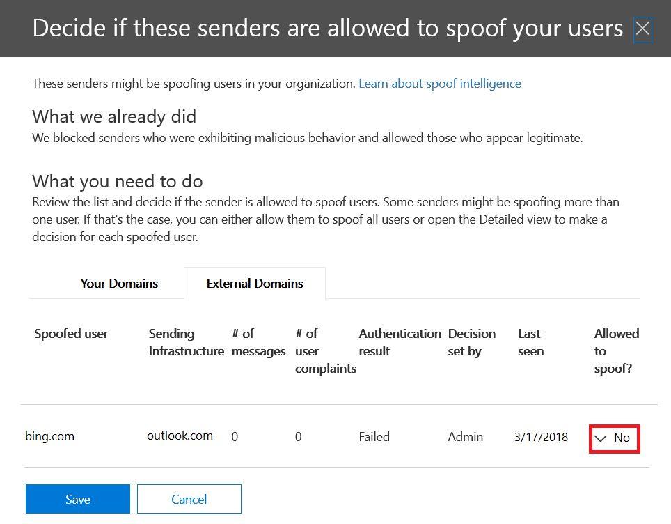

# Läs mer om falska underrättelser

Använd falska uppgifter i &amp; Security Compliance Center på **sidan Inställningar för skräppost** för att granska alla avsändare som förfalskar antingen domäner som ingår i organisationen eller förfalskaexterna externa domäner. Falska underrättelser finns som en del av Office 365 Enterprise E5 eller separat som en del av Advanced Threat Protection (ATP) och från och med oktober 2018 Exchange Online Protection (EOP).

## Vilka typer av e-postförfalskning kan jag granska och som ska jag skydda mot med falska intelligens?

För domäner som du äger kan du granska avsändare som förfalskar domänen och sedan väljer att tillåta avsändaren att fortsätta eller blockera avsändaren. För externa domäner kan du tillåta avsändardomänen i kombination med den sändande infrastrukturen, men inte en enskild skickae-postadress.

När en avsändare förfalskar en e-postadress verkar de skicka e-post för ett eller flera användarkonton inom någon av organisationens domäner eller en extern domän som skickas till din organisation. Överraskande nog finns det några legitima affärsskäl för förfalskning. I dessa fall blockerar du till exempel inte avsändaren från att förfalska domänen:

- Du har avsändare från tredje part som använder domänen för att skicka massutskick till dina egna anställda för företagsomröstningar.

- Du har anlitat ett externt företag för att generera och skicka ut reklam eller produktuppdateringar för din räkning.

- En assistent som regelbundet behöver skicka e-post till en annan person inom organisationen.

- Ett program som är konfigurerat för att förfalska sin egen organisation för att skicka interna meddelanden via e-post.

Externa domäner skickar ofta falska e-postmeddelanden, och många av dessa skäl är legitima. Här är till exempel några legitima fall när externa avsändare skickar förfalskad e-post:

- Avsändaren finns med i en diskussionssändlista och e-postlistan vidarebefordrar e-postmeddelandet från den ursprungliga avsändaren till alla deltagare i e-postlistan.

- Ett externt företag skickar e-post för ett annat företags räkning (till exempel en automatiserad rapport eller ett program-som-ett-tjänst-företag).

Du behöver ett sätt att se till att den post som skickas av legitima förfalskningar inte fastnar i skräppostfilter i Office 365 eller externa e-postsystem. Normalt behandlar Office 365 dessa e-postmeddelanden som skräppost. Som Office 365-administratör kan du förhindra detta genom att konfigurera förfalskningsfilter i Säkerhetsefterlevnadscenter. &amp; Om du äger domänen kan du konfigurera SPF, DKIM och DMARC så att dessa avsändare tillåts.

Å andra sidan måste skadliga förfalskningar, de avsändare som förfalskar din domän eller externa domäner, för att skicka skräppost eller nätfiskee, blockeras. Förfalskning är också ett vanligt sätt för phishers att få användarreferenser. Office 365 har inbyggt förfalskningsskydd för att skydda din organisation från avsändare av dessa skadliga e-postmeddelanden. Spoof skydd för din organisations domäner är alltid på för alla Office 365-kunder, och externa domän förfalskning skydd är på som standard för Advanced Threat Protection kunder och från och med oktober, 2018 EOP kunder också. För att ytterligare stärka detta skydd, berätta vilka avsändare som är auktoriserade att förfalska din organisations domäner och skicka e-post för din räkning, och om några externa domäner är tillåtna att förfalska. Alla e-postmeddelanden som skickas från en avsändare som du inte har behörighet kommer att behandlas som skräppost eller förfalskning av Office 365. Håll ett öga på avsändarna som förfalskar din domän och hjälper &amp; oss att förbättra falska underrättelser med hjälp av Security Compliance Center.

## Hantera falska underrättelser i &amp; Security Compliance Center

Den falska underrättelsepolicy som du har konfigurerat tillämpas alltid av Office 365. Du kan inte inaktivera den, men du kan välja hur mycket du vill hantera den aktivt.

Du kan granska avsändare som förfalskar domänen eller externa domäner och sedan bestämma om varje avsändare &amp; ska tillåtas att göra det med hjälp av Security Compliance Center. För varje förfalskat användarkonto som en avsändare förfalskar från domänen eller en extern domän kan du visa informationen i följande tabell.

|**Parametern**|**Beskrivning**|
|:-----|:-----|
|Avsändaren    |Även kallad den sanna avsändaren. Detta är vanligtvis den domän från vilken falska e-post kommer. Office 365 bestämmer domänen för pekaren (PTR) DNS-posten för den sändande IP-adressen som förfalskar din organisation. Om ingen domän hittas visas avsändarens IP-adress i stället.    |
|Förfalskad användare    |Användarkontot som förfalskas av avsändaren.    **Endast intern** flik. Det här fältet innehåller en enda e-postadress, eller om avsändaren förfalskar flera användarkonton innehåller det **mer än en**.    **Endast extern** flik. Externa domäner innehåller bara en skickande domän och innehåller inte en fullständig e-postadress.    **Tips! För avancerade administratörer.** Den förfalskade användaren är adressen Från (5322.From) som också är den adress som visas som från-adressen av e-postklienten. Detta kallas ibland header.from-adressen. Giltigheten av denna adress kontrolleras inte av SPF.           |
|Antal meddelanden    |Antalet e-postmeddelanden som avsändaren skickar till din organisation för den identifierade avsändareeller avsändare under de senaste 30 dagarna.    |
|Antal klagomål från användare    |Klagomål som lämnats in av användare mot denna avsändare av dina användare inom de senaste 30 dagarna. Klagomål är vanligtvis i form av skräp inlagor till Microsoft.    |
|Autentiseringsresultat    |Det här värdet **skickas** om avsändaren skickade EOP-verifieringskontroller (Exchange Online Protection), till exempel SPF eller DKIM, **Misslyckades** om avsändaren misslyckades med EOP-autentiseringskontroller eller **okänd** om resultatet av dessa kontroller inte är känt.    |
|Beslut som fastställts av    |Visar om Office 365-administratören eller policyn för falska underrättelseprinciper avgjorde om avsändaren får förfalska användaren eller inte.    |
|Senast sedd    |Det sista datum då ett meddelande togs emot av avsändaren för den här förfalskade användarens räkning.    |
|Får du förfalska?    | Visar om den här avsändaren får skicka e-post för den förfalskade användarens räkning. Möjliga värden är:    **Ja, det är jag** Alla falska adresser från denna falska avsändare kommer att tillåtas att förfalska din organisation.    **Nej, det är inte** Falska adresser från den här förfalskningsavsändaren får inte förfalska din organisation. I stället markeras meddelanden från den här avsändaren som skräppost av Office 365.    **Vissa användare** Om en avsändare förfalskar flera användare, kommer vissa falska adresser från den här avsändaren att tillåtas att förfalska din organisation, resten kommer att markeras som skräppost. Använd fliken **Detaljerad** för att se de specifika adresserna.    |
|Parodi typ    |Det här värdet är **internt** om domänen är en av organisationens etablerade domäner, annars är värdet **externt**.    |

 **Så här hanterar du avsändare som förfalskar &amp; din domän med hjälp av Security Compliance Center**

1. Gå till [ &amp; Security Compliance Center](https://protection.office.com).

2. Logga in på Office 365 med ditt arbets- eller skolkonto. Ditt konto måste ha administratörsuppgifter i din Office 365-organisation.

3. Expandera **policy** \> **mot** \> **skräppost**i Security &amp; Compliance Center .

    

4. På sidan **Inställningar för skräppost** i den högra rutan bläddrar du nedåt och expanderar Policy för **spoof-intelligens**.

    

5. Om du vill visa listan över avsändare som avfalskar domänen väljer du **Granska nya avsändare** och väljer fliken **Dina domäner.**

    Om du redan har granskat avsändare och vill ändra några av dina tidigare val kan du välja **Visa mig avsändare som jag redan har granskat** i stället. I båda fallen visas följande panel.

    

    Varje förfalskad användare visas i en separat rad så att du kan välja om du vill tillåta eller blockera avsändaren från förfalskning av varje användare individuellt.

    Om du vill lägga till en avsändare i listan tillåt för en användare väljer du **Ja** i kolumnen **Tillåten förfalskning.** Om du vill lägga till en avsändare i blockeringslistan för en användare väljer du **Nej**.

    Om du vill ange principen för domäner som du inte äger väljer **Yes** du fliken **Allowed to Spoof** **Externa domäner.** Om du tror att Office 365 har gjort ett misstag när du tillåter avsändaren att skicka skicka förfalskad e-post ändrar du kolumnen **Tillåten förfalskning till** **Nej**.

    

6. Välj **Spara** om du vill spara ändringarna.

Om du har en Office 365 Enterprise E5-prenumeration eller har köpt Avancerat hotskydd separat som tillägg kan du också hantera avsändare som förfalskar domänen via [Spoof Intelligence Insight](https://docs.microsoft.com/office365/securitycompliance/walkthrough-spoof-intelligence-insight).

## Konfigurera anti-spoofing-policyn

Förutom att tillåta eller blockera en viss avsändare från att skicka falska e-postmeddelanden till din organisation kan du också konfigurera hur strikt du vill att filtret ska vara och åtgärden ska vidtas när ett förfalskningsmeddelande hittas.

Anti-förfalskningsskydd tillämpas på e-post från avsändare från domäner som är externa till din Office 365-organisation. Du kan tillämpa principen på mottagare vars postlådor är licensierade för Office 365 Enterprise E5, Avancerat hotskydd och från och med oktober 2018, EOP-kunder också. Du hanterar anti-förfalskningsprincipen tillsammans med andra inställningar mot nätfiske. Mer information om inställningar för nätfiske i Motfiske finns i [Konfigurera Office 365 ATP-policyer mot nätfiske och nätfiske](set-up-anti-phishing-policies.md).

Office 365 innehåller standardskydd mot förfalskning som alltid körs. Det här standardskyddet visas &amp; inte i Security Compliance Center eller kan hämtas via Windows PowerShell-cmdlets. Du kan inte ändra standardskyddet för antiförfalskning. I stället kan du konfigurera hur strikt Office 365 tillämpar anti-förfalskningsskyddet i varje anti-phishing-princip som du skapar.

Även om anti-förfalskningsprincipen visas under anti-phishing-principen &amp; i Security Compliance Center ärver den inte sitt standardbeteende från den befintliga nätfiskeinställningen under anti-spam-konfigurationen. Om du har inställningar under **Nätfiske mot** **skräppost** \> som du vill replikera för anti-förfalskning måste du skapa en anti-phishing-policy och sedan redigera parodidelen av anti-phishing-principen för att återspegla dina falska inställningar enligt beskrivningen i följande avsnitt, i stället för att acceptera standardinställningarna som körs i bakgrunden.

 **Så här konfigurerar du anti-förfalskningsskydd i en &amp; anti-phishing-princip med hjälp av Security Compliance Center**

1. Gå till [ &amp; Security Compliance Center](https://protection.office.com).

2. Logga in på Office 365 med ditt arbets- eller skolkonto. Ditt konto måste ha administratörsuppgifter i din Office 365-organisation.

3. Expandera **policy** \> **mot** \> **nätfiske**i Säkerhetsefterlevnadscenter &amp; .

4. På sidan **Anti-phishing** i den högra rutan väljer du den anti-phishing-princip som du vill konfigurera.

5. Välj **Redigera**på sidan som visas på raden **Spoof.**

6. Konfigurera sedan de åtgärder som ska vidtas när ett meddelande identifieras som en korsdomänsparodi. Standardbeteendet är att flytta meddelandet till mottagarens skräppostmapp. Det andra alternativet är att skicka meddelandet till karantänen. Mer information om hur du hanterar meddelanden som skickas till karantän finns [i Karantänmeddelanden i Office 365](quarantine-email-messages.md).

    

7. Gör ditt val och välj sedan **Spara**.

## Andra sätt att hantera förfalskning och nätfiske med Office 365

Var flitig om förfalskning och phishing-skydd. Här är relaterade sätt att kontrollera avsändare som förfalskar din domän och hjälper till att förhindra att de skadar din organisation:

- Kontrollera exchange onlineskyddsrapporten som en del av din rutin. Du kan använda den här rapporten ofta för att visa och hjälpa till att hantera förfalskade avsändare. Information finns i **Spoof-e-postrapport** i [Använd e-postskyddsrapporter i Office 365 för att visa data om skadlig programvara, skräppost och regelidentifieringar](https://docs.microsoft.com/exchange/monitoring/use-mail-protection-reports).

För mer avancerade Office 365-administratörer kan du också slutföra dessa kontroller:

- Granska spf-konfigurationen (Sender Policy Framework). En snabb introduktion till SPF och konfigurerad snabbt finns [i Konfigurera SPF i Office 365 för att förhindra förfalskning](set-up-spf-in-office-365-to-help-prevent-spoofing.md). En mer djupgående förståelse för hur Office 365 använder SPF eller för felsökning eller icke-standardiserade distributioner, till exempel hybriddistributioner, börjar med [Hur Office 365 använder SPF (Sender Policy Framework) för att förhindra förfalskning](how-office-365-uses-spf-to-prevent-spoofing.md).

- Granska din Konfiguration av Domännycklar identifierade e-post (DKIM). Du bör använda DKIM utöver SPF och DMARC för att förhindra spoofers från att skicka meddelanden som ser ut som de kommer från din domän. Med DKIM kan du lägga till en digital signatur i e-postmeddelanden i meddelandehuvudet. Information finns i [Använda DKIM för att validera utgående e-post som skickas från din anpassade domän i Office 365](use-dkim-to-validate-outbound-email.md).

- Granska din domänbaserade dmarc-konfiguration (Message Authentication, Reporting och Conformance). Implementering av DMARC med SPF och DKIM ger ytterligare skydd mot förfalskning och phishing-e-post. DMARC hjälper till att ta emot e-postsystem avgöra vad du ska göra med meddelanden som skickas från din domän som misslyckas SPF eller DKIM kontroller. Information finns i [Använda DMARC för att validera e-post i Office 365](use-dmarc-to-validate-email.md).

- Använd [Cmdlet Get-PhishFilterPolicy](https://docs.microsoft.com/powershell/module/exchange/advanced-threat-protection/get-phishfilterpolicy) i Exchange Online PowerShell eller Exchange Online Protection PowerShell för att samla in detaljerade data om falska avsändare, generera tillåt- och blockeringslistor och hjälpa dig att avgöra hur du skapar mer omfattande SPF-, DKIM- och DMARC DNS-poster utan att din legitima e-post fastnar i externa skräppostfilter. Mer information finns i [Så här fungerar skyddet för antispoofing i Office 365](https://blogs.msdn.microsoft.com/tzink/2016/02/23/how-antispoofing-protection-works-in-office-365/).
